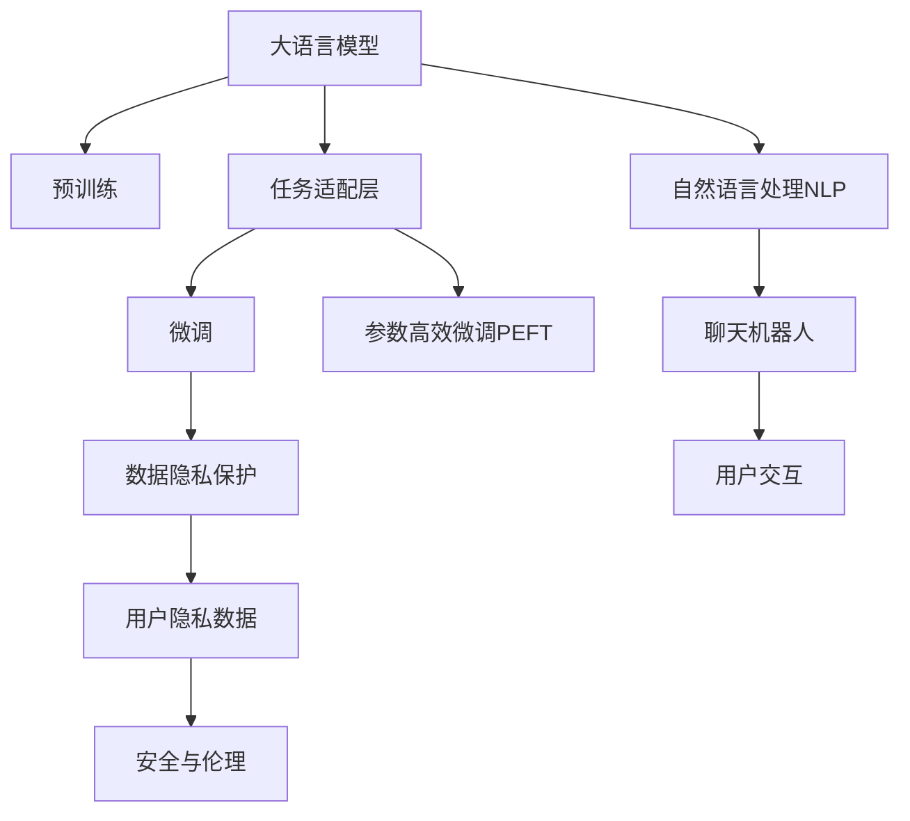

                 

# LLM的个性化：定制你的专属AI助手

> 关键词：个性化AI助手,大语言模型,LLM,深度学习,自然语言处理,NLP,定制化,用户隐私保护,数据隐私,安全与伦理,聊天机器人

## 1. 背景介绍

### 1.1 问题由来

随着人工智能技术的发展，自然语言处理(NLP)领域涌现出越来越多的智能聊天机器人。这些聊天机器人不仅能理解自然语言，还能进行文本生成、问题回答、情感分析等多种任务。然而，传统的通用聊天机器人往往缺乏对特定用户或场景的深度理解和适应，导致用户体验不够理想。

为了解决这一问题，本文将介绍一种基于大语言模型(Large Language Model, LLM)的个性化AI助手定制方法。通过深入了解用户需求、个性化数据处理和模型微调，实现对用户专属的AI助手的定制，提供更加贴心、高效的服务。

### 1.2 问题核心关键点

本文旨在介绍一种基于大语言模型的个性化AI助手定制方法，涵盖以下几个核心关键点：

- 如何选择合适的LLM模型
- 如何处理个性化数据
- 如何设计任务适配层
- 如何微调模型以适应特定任务
- 如何保护用户隐私数据
- 如何确保模型输出的安全性与可靠性

本文通过系统梳理上述核心问题，帮助读者了解大语言模型个性化AI助手的定制流程，并提出实际可行的解决方案。

## 2. 核心概念与联系

### 2.1 核心概念概述

为更好地理解本文所述的个性化AI助手定制方法，本节将介绍几个密切相关的核心概念：

- 大语言模型(LLM)：以自回归(如GPT)或自编码(如BERT)模型为代表的大规模预训练语言模型。通过在大规模无标签文本语料上进行预训练，学习通用的语言表示，具备强大的语言理解和生成能力。

- 个性化AI助手：根据用户需求定制的，具有高度个性化和用户适应性的AI聊天机器人。

- 数据隐私保护：指在数据收集、存储、处理和共享等各个环节，对用户数据进行严格的保护，防止隐私泄露。

- 用户隐私数据：用户在使用AI助手时提供的所有个人数据，如姓名、年龄、性别、偏好等。

- 安全与伦理：指在AI助手的设计和应用过程中，遵循一定的道德标准和法律法规，确保系统输出的准确性和无害性。

- 自然语言处理(NLP)：研究如何让计算机理解和处理人类语言的技术，包括文本分类、信息抽取、机器翻译、文本生成等任务。

这些核心概念之间的逻辑关系可以通过以下Mermaid流程图来展示：



这个流程图展示了大语言模型个性化AI助手的核心概念及其之间的关系：

1. 大语言模型通过预训练获得基础能力。
2. 任务适配层设计用于特定任务，以实现模型微调。
3. 微调是指根据用户需求，调整模型参数，使其适应特定的任务和用户特征。
4. 数据隐私保护是指在处理用户数据时，采取必要的措施保护用户隐私。
5. 用户隐私数据是模型训练的基础，需要对其进行保护和合理利用。
6. 安全与伦理是指在模型设计和应用过程中，遵循一定的道德标准和法律法规。
7. 自然语言处理是个性化AI助手的核心技术之一，用于实现文本理解和生成。
8. 聊天机器人是个性化AI助手的具体形式，用于与用户进行交互。

这些核心概念共同构成了大语言模型个性化AI助手的学习和应用框架，使其能够根据用户需求进行深度定制，提升用户体验。

## 3. 核心算法原理 & 具体操作步骤
### 3.1 算法原理概述

个性化AI助手的定制过程，本质上是基于大语言模型的微调过程。其核心思想是：将预训练的大语言模型视作一个强大的"特征提取器"，通过特定的个性化数据，调整模型参数，使其输出能够满足特定用户的需求和场景。

形式化地，假设预训练模型为 $M_{\theta}$，其中 $\theta$ 为预训练得到的模型参数。给定特定用户的个性化数据 $D_{\text{personal}}$，包括用户偏好、历史记录、行为数据等，微调的目标是找到新的模型参数 $\hat{\theta}$，使得：

$$
\hat{\theta}=\mathop{\arg\min}_{\theta} \mathcal{L}(M_{\theta},D_{\text{personal}})
$$

其中 $\mathcal{L}$ 为针对特定用户需求的损失函数，用于衡量模型预测输出与实际需求之间的差异。常见的损失函数包括交叉熵损失、均方误差损失等。

通过梯度下降等优化算法，微调过程不断更新模型参数 $\theta$，最小化损失函数 $\mathcal{L}$，使得模型输出逼近实际需求。由于 $\theta$ 已经通过预训练获得了较好的初始化，因此即便在特定用户数据上微调，也能较快收敛到理想的模型参数 $\hat{\theta}$。

### 3.2 算法步骤详解

基于个性化AI助手的定制，我们可以将整个过程分为以下几个关键步骤：

**Step 1: 收集个性化数据**
- 收集与用户需求相关的个性化数据，如用户历史对话、偏好设置、行为数据等。
- 数据集应覆盖不同场景和任务，保证模型输出的多样性和准确性。

**Step 2: 构建数据集**
- 将个性化数据划分为训练集、验证集和测试集，确保数据集的多样性和代表性。
- 对数据进行预处理，如清洗、归一化、标记等，提升数据质量。

**Step 3: 选择LLM模型**
- 根据任务需求选择合适的预训练模型，如GPT、BERT、T5等。
- 评估模型在类似任务上的表现，确保其具备较高的通用性和适应性。

**Step 4: 设计任务适配层**
- 根据任务类型，在预训练模型顶层设计合适的输出层和损失函数。
- 对于分类任务，通常在顶层添加线性分类器和交叉熵损失函数。
- 对于生成任务，通常使用语言模型的解码器输出概率分布，并以负对数似然为损失函数。

**Step 5: 设置微调超参数**
- 选择合适的优化算法及其参数，如 AdamW、SGD 等，设置学习率、批大小、迭代轮数等。
- 设置正则化技术及强度，包括权重衰减、Dropout、Early Stopping 等。
- 确定冻结预训练参数的策略，如仅微调顶层，或全部参数都参与微调。

**Step 6: 执行梯度训练**
- 将训练集数据分批次输入模型，前向传播计算损失函数。
- 反向传播计算参数梯度，根据设定的优化算法和学习率更新模型参数。
- 周期性在验证集上评估模型性能，根据性能指标决定是否触发 Early Stopping。
- 重复上述步骤直到满足预设的迭代轮数或 Early Stopping 条件。

**Step 7: 测试和部署**
- 在测试集上评估微调后模型 $M_{\hat{\theta}}$ 的性能，对比微调前后的精度提升。
- 使用微调后的模型对新样本进行推理预测，集成到实际的应用系统中。
- 持续收集新的数据，定期重新微调模型，以适应数据分布的变化。

以上是基于个性化需求定制大语言模型AI助手的完整流程。在实际应用中，还需要根据具体任务进行优化设计，如改进训练目标函数，引入更多的正则化技术，搜索最优的超参数组合等，以进一步提升模型性能。

### 3.3 算法优缺点

个性化AI助手的定制方法具有以下优点：
1. 高度适应性。根据用户的个性化需求进行微调，能够提供更加贴心的服务。
2. 提升用户体验。基于用户数据定制的模型，能够理解用户的语言习惯和偏好，提供更加个性化的回应。
3. 降低成本。相比从头开发，微调模型能够大幅度降低开发成本，缩短开发周期。
4. 持续优化。模型能够随着用户数据的积累不断学习和优化，逐步提升服务质量。

同时，该方法也存在一定的局限性：
1. 数据隐私问题。个性化数据涉及用户隐私，如何保护用户数据安全是关键。
2. 模型过拟合。在处理个性化数据时，容易陷入过拟合，导致模型泛化能力不足。
3. 模型鲁棒性。个性化模型在面对域外数据时，泛化性能可能降低。
4. 用户接受度。用户对于个性化AI助手的信任和接受度，可能会受到模型性能和隐私保护的影响。

尽管存在这些局限性，但就目前而言，基于个性化需求定制大语言模型AI助手的方法仍是大规模应用的主要方式。未来相关研究的重点在于如何进一步降低数据隐私问题，提高模型的泛化能力，提升用户对模型的信任和接受度。

### 3.4 算法应用领域

个性化AI助手的定制方法在众多领域均有广泛应用，例如：

- 智能客服：根据用户的历史对话记录，定制专属客服，提升客户满意度。
- 金融理财：根据用户的理财习惯和投资偏好，提供个性化的理财建议和资产管理服务。
- 医疗咨询：根据患者的病情记录和历史记录，提供个性化的诊疗建议和治疗方案。
- 教育辅导：根据学生的学习记录和偏好，提供个性化的学习计划和辅导内容。
- 电子商务：根据用户的购物记录和浏览偏好，推荐个性化的商品和优惠信息。
- 心理健康：根据用户的心理健康记录和行为数据，提供个性化的心理支持和干预方案。
- 安全监控：根据用户的行为模式和历史记录，提供个性化的安全预警和防护策略。

除了上述这些经典应用外，个性化AI助手还可以创新性地应用到更多场景中，如智慧家居、企业培训、公共安全等，为不同行业带来智能化和高效化的服务。

## 4. 数学模型和公式 & 详细讲解  
### 4.1 数学模型构建

本节将使用数学语言对基于个性化需求定制大语言模型AI助手的微调过程进行更加严格的刻画。

记预训练语言模型为 $M_{\theta}$，其中 $\theta$ 为预训练得到的模型参数。假设特定用户的个性化数据为 $D_{\text{personal}}=\{(x_i,y_i)\}_{i=1}^N, x_i \in \mathcal{X}, y_i \in \mathcal{Y}$。

定义模型 $M_{\theta}$ 在个性化数据样本 $(x,y)$ 上的损失函数为 $\ell(M_{\theta}(x),y)$，则在个性化数据集 $D_{\text{personal}}$ 上的经验风险为：

$$
\mathcal{L}(\theta) = \frac{1}{N} \sum_{i=1}^N \ell(M_{\theta}(x_i),y_i)
$$

微调的优化目标是最小化经验风险，即找到最优参数：

$$
\theta^* = \mathop{\arg\min}_{\theta} \mathcal{L}(\theta)
$$

在实践中，我们通常使用基于梯度的优化算法（如SGD、Adam等）来近似求解上述最优化问题。设 $\eta$ 为学习率，$\lambda$ 为正则化系数，则参数的更新公式为：

$$
\theta \leftarrow \theta - \eta \nabla_{\theta}\mathcal{L}(\theta) - \eta\lambda\theta
$$

其中 $\nabla_{\theta}\mathcal{L}(\theta)$ 为损失函数对参数 $\theta$ 的梯度，可通过反向传播算法高效计算。

### 4.2 公式推导过程

以下我们以用户对话分类任务为例，推导交叉熵损失函数及其梯度的计算公式。

假设模型 $M_{\theta}$ 在输入 $x$ 上的输出为 $\hat{y}=M_{\theta}(x) \in [0,1]$，表示样本属于正类的概率。真实标签 $y \in \{0,1\}$。则二分类交叉熵损失函数定义为：

$$
\ell(M_{\theta}(x),y) = -[y\log \hat{y} + (1-y)\log (1-\hat{y})]
$$

将其代入经验风险公式，得：

$$
\mathcal{L}(\theta) = -\frac{1}{N}\sum_{i=1}^N [y_i\log M_{\theta}(x_i)+(1-y_i)\log(1-M_{\theta}(x_i))]
$$

根据链式法则，损失函数对参数 $\theta_k$ 的梯度为：

$$
\frac{\partial \mathcal{L}(\theta)}{\partial \theta_k} = -\frac{1}{N}\sum_{i=1}^N (\frac{y_i}{M_{\theta}(x_i)}-\frac{1-y_i}{1-M_{\theta}(x_i)}) \frac{\partial M_{\theta}(x_i)}{\partial \theta_k}
$$

其中 $\frac{\partial M_{\theta}(x_i)}{\partial \theta_k}$ 可进一步递归展开，利用自动微分技术完成计算。

在得到损失函数的梯度后，即可带入参数更新公式，完成模型的迭代优化。重复上述过程直至收敛，最终得到适应个性化需求的模型参数 $\theta^*$。

## 5. 项目实践：代码实例和详细解释说明
### 5.1 开发环境搭建

在进行个性化AI助手定制的开发前，我们需要准备好开发环境。以下是使用Python进行PyTorch开发的环境配置流程：

1. 安装Anaconda：从官网下载并安装Anaconda，用于创建独立的Python环境。

2. 创建并激活虚拟环境：
```bash
conda create -n pytorch-env python=3.8 
conda activate pytorch-env
```

3. 安装PyTorch：根据CUDA版本，从官网获取对应的安装命令。例如：
```bash
conda install pytorch torchvision torchaudio cudatoolkit=11.1 -c pytorch -c conda-forge
```

4. 安装Transformers库：
```bash
pip install transformers
```

5. 安装各类工具包：
```bash
pip install numpy pandas scikit-learn matplotlib tqdm jupyter notebook ipython
```

完成上述步骤后，即可在`pytorch-env`环境中开始个性化AI助手定制的开发实践。

### 5.2 源代码详细实现

下面我们以对话分类任务为例，给出使用Transformers库对BERT模型进行个性化定制的PyTorch代码实现。

首先，定义对话分类任务的预处理函数：

```python
from transformers import BertTokenizer
from torch.utils.data import Dataset
import torch

class DialogueDataset(Dataset):
    def __init__(self, dialogues, labels, tokenizer, max_len=128):
        self.dialogues = dialogues
        self.labels = labels
        self.tokenizer = tokenizer
        self.max_len = max_len
        
    def __len__(self):
        return len(self.dialogues)
    
    def __getitem__(self, item):
        dialogue = self.dialogues[item]
        label = self.labels[item]
        
        encoding = self.tokenizer(dialogue, return_tensors='pt', max_length=self.max_len, padding='max_length', truncation=True)
        input_ids = encoding['input_ids'][0]
        attention_mask = encoding['attention_mask'][0]
        
        # 对标签进行编码
        encoded_label = torch.tensor(label, dtype=torch.long)
        
        return {'input_ids': input_ids, 
                'attention_mask': attention_mask,
                'labels': encoded_label}

# 标签与id的映射
label2id = {'positive': 1, 'negative': 0}
id2label = {v: k for k, v in label2id.items()}

# 创建dataset
tokenizer = BertTokenizer.from_pretrained('bert-base-cased')

train_dataset = DialogueDataset(train_dialogues, train_labels, tokenizer)
dev_dataset = DialogueDataset(dev_dialogues, dev_labels, tokenizer)
test_dataset = DialogueDataset(test_dialogues, test_labels, tokenizer)
```

然后，定义模型和优化器：

```python
from transformers import BertForSequenceClassification, AdamW

model = BertForSequenceClassification.from_pretrained('bert-base-cased', num_labels=len(label2id))

optimizer = AdamW(model.parameters(), lr=2e-5)
```

接着，定义训练和评估函数：

```python
from torch.utils.data import DataLoader
from tqdm import tqdm
from sklearn.metrics import classification_report

device = torch.device('cuda') if torch.cuda.is_available() else torch.device('cpu')
model.to(device)

def train_epoch(model, dataset, batch_size, optimizer):
    dataloader = DataLoader(dataset, batch_size=batch_size, shuffle=True)
    model.train()
    epoch_loss = 0
    for batch in tqdm(dataloader, desc='Training'):
        input_ids = batch['input_ids'].to(device)
        attention_mask = batch['attention_mask'].to(device)
        labels = batch['labels'].to(device)
        model.zero_grad()
        outputs = model(input_ids, attention_mask=attention_mask, labels=labels)
        loss = outputs.loss
        epoch_loss += loss.item()
        loss.backward()
        optimizer.step()
    return epoch_loss / len(dataloader)

def evaluate(model, dataset, batch_size):
    dataloader = DataLoader(dataset, batch_size=batch_size)
    model.eval()
    preds, labels = [], []
    with torch.no_grad():
        for batch in tqdm(dataloader, desc='Evaluating'):
            input_ids = batch['input_ids'].to(device)
            attention_mask = batch['attention_mask'].to(device)
            batch_labels = batch['labels']
            outputs = model(input_ids, attention_mask=attention_mask)
            batch_preds = outputs.logits.argmax(dim=2).to('cpu').tolist()
            batch_labels = batch_labels.to('cpu').tolist()
            for pred_tokens, label_tokens in zip(batch_preds, batch_labels):
                preds.append(pred_tokens)
                labels.append(label_tokens)
                
    print(classification_report(labels, preds))
```

最后，启动训练流程并在测试集上评估：

```python
epochs = 5
batch_size = 16

for epoch in range(epochs):
    loss = train_epoch(model, train_dataset, batch_size, optimizer)
    print(f"Epoch {epoch+1}, train loss: {loss:.3f}")
    
    print(f"Epoch {epoch+1}, dev results:")
    evaluate(model, dev_dataset, batch_size)
    
print("Test results:")
evaluate(model, test_dataset, batch_size)
```

以上就是使用PyTorch对BERT进行对话分类任务个性化定制的完整代码实现。可以看到，得益于Transformers库的强大封装，我们可以用相对简洁的代码完成BERT模型的加载和微调。

### 5.3 代码解读与分析

让我们再详细解读一下关键代码的实现细节：

**DialogueDataset类**：
- `__init__`方法：初始化对话记录、标签、分词器等关键组件。
- `__len__`方法：返回数据集的样本数量。
- `__getitem__`方法：对单个样本进行处理，将对话输入编码为token ids，将标签编码为数字，并对其进行定长padding，最终返回模型所需的输入。

**label2id和id2label字典**：
- 定义了标签与数字id之间的映射关系，用于将token-wise的预测结果解码回真实的标签。

**训练和评估函数**：
- 使用PyTorch的DataLoader对数据集进行批次化加载，供模型训练和推理使用。
- 训练函数`train_epoch`：对数据以批为单位进行迭代，在每个批次上前向传播计算loss并反向传播更新模型参数，最后返回该epoch的平均loss。
- 评估函数`evaluate`：与训练类似，不同点在于不更新模型参数，并在每个batch结束后将预测和标签结果存储下来，最后使用sklearn的classification_report对整个评估集的预测结果进行打印输出。

**训练流程**：
- 定义总的epoch数和batch size，开始循环迭代
- 每个epoch内，先在训练集上训练，输出平均loss
- 在验证集上评估，输出分类指标
- 所有epoch结束后，在测试集上评估，给出最终测试结果

可以看到，PyTorch配合Transformers库使得BERT微调的代码实现变得简洁高效。开发者可以将更多精力放在数据处理、模型改进等高层逻辑上，而不必过多关注底层的实现细节。

当然，工业级的系统实现还需考虑更多因素，如模型的保存和部署、超参数的自动搜索、更灵活的任务适配层等。但核心的微调范式基本与此类似。

## 6. 实际应用场景
### 6.1 智能客服系统

基于个性化AI助手的对话分类技术，可以广泛应用于智能客服系统的构建。传统客服往往需要配备大量人力，高峰期响应缓慢，且一致性和专业性难以保证。而使用个性化AI助手，可以7x24小时不间断服务，快速响应客户咨询，用自然流畅的语言解答各类常见问题。

在技术实现上，可以收集企业内部的历史客服对话记录，将问题和最佳答复构建成监督数据，在此基础上对预训练对话模型进行微调。微调后的对话模型能够自动理解用户意图，匹配最合适的答案模板进行回复。对于客户提出的新问题，还可以接入检索系统实时搜索相关内容，动态组织生成回答。如此构建的智能客服系统，能大幅提升客户咨询体验和问题解决效率。

### 6.2 金融舆情监测

金融机构需要实时监测市场舆论动向，以便及时应对负面信息传播，规避金融风险。传统的人工监测方式成本高、效率低，难以应对网络时代海量信息爆发的挑战。基于个性化AI助手的文本分类和情感分析技术，为金融舆情监测提供了新的解决方案。

具体而言，可以收集金融领域相关的新闻、报道、评论等文本数据，并对其进行主题标注和情感标注。在此基础上对预训练语言模型进行微调，使其能够自动判断文本属于何种主题，情感倾向是正面、中性还是负面。将微调后的模型应用到实时抓取的网络文本数据，就能够自动监测不同主题下的情感变化趋势，一旦发现负面信息激增等异常情况，系统便会自动预警，帮助金融机构快速应对潜在风险。

### 6.3 个性化推荐系统

当前的推荐系统往往只依赖用户的历史行为数据进行物品推荐，无法深入理解用户的真实兴趣偏好。基于个性化AI助手的个性化推荐技术，可以更好地挖掘用户行为背后的语义信息，从而提供更精准、多样的推荐内容。

在实践中，可以收集用户浏览、点击、评论、分享等行为数据，提取和用户交互的物品标题、描述、标签等文本内容。将文本内容作为模型输入，用户的后续行为（如是否点击、购买等）作为监督信号，在此基础上微调预训练语言模型。微调后的模型能够从文本内容中准确把握用户的兴趣点。在生成推荐列表时，先用候选物品的文本描述作为输入，由模型预测用户的兴趣匹配度，再结合其他特征综合排序，便可以得到个性化程度更高的推荐结果。

### 6.4 未来应用展望

随着个性化AI助手技术的发展，其应用场景将进一步拓展。未来，基于个性化AI助手的技术将在更多领域得到应用，为人类生产生活带来深远影响。

在智慧医疗领域，基于个性化AI助手的医疗问答、病历分析、药物研发等应用将提升医疗服务的智能化水平，辅助医生诊疗，加速新药开发进程。

在智能教育领域，微调技术可应用于作业批改、学情分析、知识推荐等方面，因材施教，促进教育公平，提高教学质量。

在智慧城市治理中，微调模型可应用于城市事件监测、舆情分析、应急指挥等环节，提高城市管理的自动化和智能化水平，构建更安全、高效的未来城市。

此外，在企业生产、社会治理、文娱传媒等众多领域，基于个性化AI助手的技术也将不断涌现，为各行各业带来智能化和高效化的服务。相信随着技术的日益成熟，个性化AI助手必将在构建人机协同的智能时代中扮演越来越重要的角色。

## 7. 工具和资源推荐
### 7.1 学习资源推荐

为了帮助开发者系统掌握个性化AI助手定制的理论基础和实践技巧，这里推荐一些优质的学习资源：

1. 《Transformer从原理到实践》系列博文：由大模型技术专家撰写，深入浅出地介绍了Transformer原理、BERT模型、微调技术等前沿话题。

2. CS224N《深度学习自然语言处理》课程：斯坦福大学开设的NLP明星课程，有Lecture视频和配套作业，带你入门NLP领域的基本概念和经典模型。

3. 《Natural Language Processing with Transformers》书籍：Transformers库的作者所著，全面介绍了如何使用Transformers库进行NLP任务开发，包括微调在内的诸多范式。

4. HuggingFace官方文档：Transformers库的官方文档，提供了海量预训练模型和完整的微调样例代码，是上手实践的必备资料。

5. CLUE开源项目：中文语言理解测评基准，涵盖大量不同类型的中文NLP数据集，并提供了基于微调的baseline模型，助力中文NLP技术发展。

通过对这些资源的学习实践，相信你一定能够快速掌握个性化AI助手定制的精髓，并用于解决实际的NLP问题。
###  7.2 开发工具推荐

高效的开发离不开优秀的工具支持。以下是几款用于个性化AI助手定制开发的常用工具：

1. PyTorch：基于Python的开源深度学习框架，灵活动态的计算图，适合快速迭代研究。大部分预训练语言模型都有PyTorch版本的实现。

2. TensorFlow：由Google主导开发的开源深度学习框架，生产部署方便，适合大规模工程应用。同样有丰富的预训练语言模型资源。

3. Transformers库：HuggingFace开发的NLP工具库，集成了众多SOTA语言模型，支持PyTorch和TensorFlow，是进行个性化AI助手定制开发的利器。

4. Weights & Biases：模型训练的实验跟踪工具，可以记录和可视化模型训练过程中的各项指标，方便对比和调优。与主流深度学习框架无缝集成。

5. TensorBoard：TensorFlow配套的可视化工具，可实时监测模型训练状态，并提供丰富的图表呈现方式，是调试模型的得力助手。

6. Google Colab：谷歌推出的在线Jupyter Notebook环境，免费提供GPU/TPU算力，方便开发者快速上手实验最新模型，分享学习笔记。

合理利用这些工具，可以显著提升个性化AI助手定制的开发效率，加快创新迭代的步伐。

### 7.3 相关论文推荐

个性化AI助手技术的发展源于学界的持续研究。以下是几篇奠基性的相关论文，推荐阅读：

1. Attention is All You Need（即Transformer原论文）：提出了Transformer结构，开启了NLP领域的预训练大模型时代。

2. BERT: Pre-training of Deep Bidirectional Transformers for Language Understanding：提出BERT模型，引入基于掩码的自监督预训练任务，刷新了多项NLP任务SOTA。

3. Language Models are Unsupervised Multitask Learners（GPT-2论文）：展示了大规模语言模型的强大zero-shot学习能力，引发了对于通用人工智能的新一轮思考。

4. Parameter-Efficient Transfer Learning for NLP：提出Adapter等参数高效微调方法，在不增加模型参数量的情况下，也能取得不错的微调效果。

5. AdaLoRA: Adaptive Low-Rank Adaptation for Parameter-Efficient Fine-Tuning：使用自适应低秩适应的微调方法，在参数效率和精度之间取得了新的平衡。

这些论文代表了大语言模型微调技术的发展脉络。通过学习这些前沿成果，可以帮助研究者把握学科前进方向，激发更多的创新灵感。

## 8. 总结：未来发展趋势与挑战

### 8.1 总结

本文对基于个性化需求定制大语言模型AI助手的微调方法进行了全面系统的介绍。首先阐述了个性化AI助手定制的背景和意义，明确了微调在提升用户体验、降低开发成本、加速落地应用等方面的独特价值。其次，从原理到实践，详细讲解了个性化AI助手的微调过程，给出了微调任务开发的完整代码实例。同时，本文还广泛探讨了个性化AI助手在智能客服、金融舆情、个性化推荐等多个行业领域的应用前景，展示了个性化AI助手的广阔应用空间。此外，本文精选了微调技术的各类学习资源，力求为读者提供全方位的技术指引。

通过本文的系统梳理，可以看到，基于大语言模型的个性化AI助手定制方法正在成为NLP领域的重要范式，极大地拓展了预训练语言模型的应用边界，催生了更多的落地场景。受益于大规模语料的预训练，个性化AI助手能够根据用户需求进行深度定制，提升用户体验。未来，伴随预训练语言模型和微调方法的持续演进，相信个性化AI助手必将在构建人机协同的智能时代中扮演越来越重要的角色。

### 8.2 未来发展趋势

展望未来，个性化AI助手定制方法将呈现以下几个发展趋势：

1. 模型规模持续增大。随着算力成本的下降和数据规模的扩张，预训练语言模型的参数量还将持续增长。超大批次的训练和推理也可能遇到显存不足的问题。因此需要采用一些资源优化技术，如梯度积累、混合精度训练、模型并行等，来突破硬件瓶颈。

2. 微调方法日趋多样。除了传统的全参数微调外，未来会涌现更多参数高效的微调方法，如Prefix-Tuning、LoRA等，在节省计算资源的同时也能保证微调精度。

3. 个性化AI助手普及化。随着技术的不断进步，个性化AI助手将逐步普及到更多行业和应用场景，为各行各业带来智能化和高效化的服务。

4. 数据隐私保护增强。个性化AI助手需要处理大量的用户数据，如何在数据收集、存储、处理和共享等各个环节，对用户数据进行严格的保护，防止隐私泄露，将成为未来的重要课题。

5. 用户交互体验提升。个性化AI助手将逐步具备更加智能化的交互能力，能够更好地理解用户需求，提供更加个性化的服务。

6. 多模态交互融合。未来的个性化AI助手将具备视觉、语音、文本等多种交互能力，实现多模态信息的融合，提升用户体验和智能化水平。

以上趋势凸显了个性化AI助手定制技术的广阔前景。这些方向的探索发展，必将进一步提升NLP系统的性能和应用范围，为人类生产生活带来深远影响。

### 8.3 面临的挑战

尽管个性化AI助手定制技术已经取得了瞩目成就，但在迈向更加智能化、普适化应用的过程中，它仍面临着诸多挑战：

1. 数据隐私问题。个性化AI助手需要处理大量的用户数据，如何在数据收集、存储、处理和共享等各个环节，对用户数据进行严格的保护，防止隐私泄露，是需要重点关注的课题。

2. 模型泛化能力。在处理个性化数据时，容易陷入过拟合，导致模型泛化能力不足。如何在保持模型精准度的同时，提升其泛化能力，是一个亟需解决的问题。

3. 用户接受度。个性化AI助手的应用效果和用户接受度，可能会受到模型性能和隐私保护的影响。如何让用户接受和信任个性化AI助手，是未来需要重点考虑的问题。

4. 安全性问题。个性化AI助手可能涉及用户隐私信息，如何确保系统输出的安全性和可靠性，是模型设计和使用中的重要问题。

5. 模型解释性。当前模型通常被称为"黑盒"系统，难以解释其内部工作机制和决策逻辑。如何赋予模型更强的可解释性，将是未来研究的重要方向。

尽管存在这些挑战，但就目前而言，基于个性化需求定制大语言模型AI助手的方法仍是大规模应用的主要方式。未来相关研究的重点在于如何进一步降低数据隐私问题，提高模型的泛化能力，提升用户对模型的信任和接受度。

### 8.4 研究展望

面对个性化AI助手定制所面临的挑战，未来的研究需要在以下几个方面寻求新的突破：

1. 探索无监督和半监督微调方法。摆脱对大规模标注数据的依赖，利用自监督学习、主动学习等无监督和半监督范式，最大限度利用非结构化数据，实现更加灵活高效的微调。

2. 研究参数高效和计算高效的微调范式。开发更加参数高效的微调方法，在固定大部分预训练参数的同时，只更新极少量的任务相关参数。同时优化微调模型的计算图，减少前向传播和反向传播的资源消耗，实现更加轻量级、实时性的部署。

3. 引入更多先验知识。将符号化的先验知识，如知识图谱、逻辑规则等，与神经网络模型进行巧妙融合，引导微调过程学习更准确、合理的语言模型。同时加强不同模态数据的整合，实现视觉、语音等多模态信息与文本信息的协同建模。

4. 纳入伦理道德约束。在模型训练目标中引入伦理导向的评估指标，过滤和惩罚有偏见、有害的输出倾向。同时加强人工干预和审核，建立模型行为的监管机制，确保输出符合人类价值观和伦理道德。

这些研究方向的探索，必将引领个性化AI助手定制技术迈向更高的台阶，为构建安全、可靠、可解释、可控的智能系统铺平道路。面向未来，个性化AI助手定制技术还需要与其他人工智能技术进行更深入的融合，如知识表示、因果推理、强化学习等，多路径协同发力，共同推动自然语言理解和智能交互系统的进步。只有勇于创新、敢于突破，才能不断拓展语言模型的边界，让智能技术更好地造福人类社会。

## 9. 附录：常见问题与解答

**Q1：个性化AI助手如何保护用户隐私数据？**

A: 保护用户隐私数据是个性化AI助手定制过程中的重要课题。以下是一些保护用户隐私数据的措施：

1. 数据匿名化处理：在数据收集和处理过程中，对用户标识信息进行匿名化处理，确保无法直接识别用户身份。

2. 数据加密存储：采用加密技术对用户数据进行存储，确保数据在传输和存储过程中的安全性。

3. 访问控制策略：设置严格的数据访问权限，确保只有经过授权的人员能够访问用户数据。

4. 数据使用透明度：向用户公开数据使用规则，确保用户对数据的使用方式知情并同意。

5. 数据共享限制：限制数据的共享范围，仅用于模型训练和优化，不得用于未经授权的第三方。

6. 隐私审计机制：定期进行隐私审计，确保数据处理过程中的合规性和安全性。

通过这些措施，可以有效保护用户隐私数据，确保个性化AI助手定制过程的合法性和安全性。

**Q2：微调过程中如何避免过拟合？**

A: 过拟合是微调过程中常见的问题，特别是在处理个性化数据时。以下是一些避免过拟合的措施：

1. 数据增强：通过回译、近义替换等方式扩充训练集，增加数据多样性。

2. 正则化技术：使用L2正则、Dropout、Early Stopping等方法，防止模型过度适应训练集。

3. 对抗训练：引入对抗样本，提高模型鲁棒性，防止过拟合。

4. 参数高效微调：只调整少量参数(如Adapter、Prefix等)，减少需要优化的参数量，降低过拟合风险。

5. 模型裁剪：去除不必要的层和参数，减小模型尺寸，加快推理速度，减少过拟合。

通过这些措施，可以有效避免微调过程中的过拟合问题，提升模型的泛化能力。

**Q3：如何确保个性化AI助手的安全性和可靠性？**

A: 确保个性化AI助手的安全性和可靠性是模型设计和应用过程中需要重点考虑的问题。以下是一些确保安全性和可靠性的措施：

1. 模型输出审核：对模型输出进行审核，确保其符合伦理道德标准，不包含有害信息。

2. 数据源审查：对数据源进行审查，确保数据的质量和真实性，避免有害数据的引入。

3. 安全监控机制：建立安全监控机制，实时监测模型的运行状态和输出结果，及时发现和处理异常情况。

4. 应急响应计划：制定应急响应计划，确保在发生安全问题时能够及时响应和处理。

5. 人工干预和审核：在关键应用场景中引入人工干预和审核，确保模型的输出符合人类价值观和伦理道德。

通过这些措施，可以有效保障个性化AI助手的安全性和可靠性，确保其输出的准确性和无害性。

**Q4：个性化AI助手在特定场景中的表现如何？**

A: 个性化AI助手在特定场景中的表现，取决于数据集的质量和多样性，以及模型的训练和微调方法。以下是一些特定场景中个性化AI助手的表现：

1. 智能客服：在智能客服系统中，个性化AI助手能够快速响应客户咨询，提供个性化建议和解决方案，提升客户满意度。

2. 金融舆情监测：在金融舆情监测系统中，个性化AI助手能够自动分析市场舆情，及时发现负面信息，帮助金融机构规避风险。

3. 个性化推荐系统：在个性化推荐系统中，个性化AI助手能够根据用户历史行为和偏好，提供个性化的商品和内容推荐，提升用户体验。

4. 医疗咨询：在医疗咨询系统中，个性化AI助手能够根据患者历史病历和诊断记录，提供个性化的诊疗建议和治疗方案，辅助医生诊疗。

5. 心理健康：在心理健康系统中，个性化AI助手能够根据用户行为和心理数据，提供个性化的心理支持和干预方案，帮助用户改善心理健康。

这些场景中，个性化AI助手的应用效果各异，需要根据具体需求和数据特点，进行针对性的模型训练和微调。

总之，个性化AI助手定制技术正在迅速发展，未来将有更广泛的应用场景和更多创新应用，为人类生产生活带来深远影响。面向未来，我们需要不断探索和优化技术，确保其安全性和可靠性，推动个性化AI助手技术的普及和落地。

