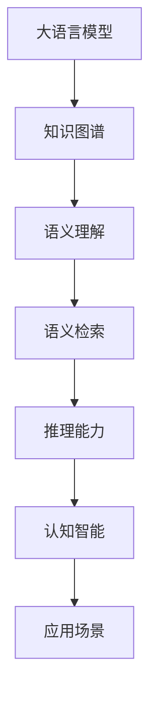

                 

# LLM的知识图谱：构建AI的认知世界

> 关键词：大语言模型, 知识图谱, 认知智能, 推理能力, 语义理解, 语义检索

## 1. 背景介绍

### 1.1 问题由来
人工智能技术的快速发展，尤其是深度学习和大规模语言模型（Large Language Models, LLMs）的崛起，为我们带来了革命性的认知智能解决方案。从简单的文本分类到复杂的语言生成，从单一任务的执行到复杂的决策推理，LLMs展示了其强大的语言理解和生成能力。

然而，尽管LLMs在特定任务上表现卓越，但在全面理解和推理复杂语境时，仍然存在一定的局限性。例如，LLMs在处理涉及时间、地点、关系等多维度信息时，容易出现理解偏差，影响任务执行的准确性和效率。如何构建更完善的语义理解机制，成为当前人工智能研究的一个热点问题。

### 1.2 问题核心关键点
为了弥补LLMs在语义理解方面的不足，引入知识图谱（Knowledge Graph, KG）的概念变得尤为重要。知识图谱是一个结构化的语义数据库，由节点和边组成，节点表示实体（如人、地点、组织），边表示实体之间的关系。通过将知识图谱与LLMs结合，可以有效提升模型的推理能力和语义理解力。

知识图谱可以提供丰富的领域知识，弥补LLMs在特定领域知识缺失的短板。例如，在医疗领域，知识图谱可以存储各种疾病的症状、治疗方案等信息，辅助LLMs生成更准确的回答。在金融领域，知识图谱可以存储公司财报、市场数据等信息，帮助LLMs做出合理的投资决策。

此外，知识图谱还可以提供高效的语义检索机制，帮助LLMs快速定位相关信息，提升回答的精确度和可信度。例如，通过查询知识图谱，LLMs可以获取特定事件的历史背景、相关人物等信息，从而生成更完整、准确的回答。

### 1.3 问题研究意义
构建LLMs的知识图谱，对于提升AI的认知智能水平，拓展其应用领域，具有重要意义：

1. **提升推理能力**：通过与知识图谱结合，LLMs可以更全面地理解语境信息，提升在复杂推理任务上的表现。
2. **增强语义理解**：知识图谱可以提供丰富的领域知识，帮助LLMs更好地理解文本语义，提升回答的准确性和可信度。
3. **支持多种应用场景**：知识图谱可以为医疗、金融、教育等多个领域提供支撑，提升这些领域的人工智能应用水平。
4. **促进技术创新**：知识图谱与LLMs的结合，催生了新的研究方向和算法，推动人工智能技术的发展。
5. **赋能产业升级**：知识图谱和大语言模型的结合，可以提升企业智能化水平，促进数字化转型和产业升级。

## 2. 核心概念与联系

### 2.1 核心概念概述

为了更好地理解LLMs与知识图谱的结合，本节将介绍几个关键概念：

- **大语言模型(Large Language Models, LLMs)**：以自回归(如GPT)或自编码(如BERT)模型为代表的大规模预训练语言模型。通过在大规模无标签文本数据上进行预训练，学习到通用的语言表示，具备强大的语言理解和生成能力。

- **知识图谱(Knowledge Graph, KG)**：一个结构化的语义数据库，由节点和边组成。节点表示实体，边表示实体之间的关系。知识图谱广泛应用于知识管理、推荐系统、问答系统等领域。

- **语义理解(Semantic Understanding)**：指模型理解文本中隐含的语义信息，如实体、关系、事件等。语义理解是认知智能的重要组成部分，涉及自然语言处理(NLP)和认知科学等多个领域。

- **语义检索(Semantic Retrieval)**：指从知识图谱中快速定位相关信息，用于辅助模型生成更准确的回答。语义检索需要高效的图谱查询和匹配算法。

这些概念之间存在紧密的联系，通过与知识图谱结合，LLMs可以提升语义理解能力和推理能力，从而在多种应用场景中发挥更大的作用。

### 2.2 核心概念原理和架构的 Mermaid 流程图



这个流程图展示了LLMs、知识图谱、语义理解、语义检索、推理能力、认知智能和应用场景之间的关系：

1. **大语言模型**：是基础，提供强大的语言理解和生成能力。
2. **知识图谱**：提供丰富的领域知识，辅助语义理解。
3. **语义理解**：理解文本中的语义信息，如实体、关系等。
4. **语义检索**：从知识图谱中检索相关信息，辅助语义理解。
5. **推理能力**：基于语义理解，进行复杂的推理计算。
6. **认知智能**：结合语义理解和推理能力，提升认知水平。
7. **应用场景**：应用于多个领域，如医疗、金融、教育等。

这些概念共同构成了LLMs与知识图谱结合的完整框架，为AI的认知智能提供了坚实的基础。

## 3. 核心算法原理 & 具体操作步骤

### 3.1 算法原理概述

LLMs与知识图谱结合的算法原理主要基于以下步骤：

1. **预训练**：在大规模无标签文本数据上，使用自监督学习方法训练通用语言模型。
2. **知识嵌入**：将知识图谱中的实体和关系，转换为低维向量表示，即知识嵌入。
3. **知识融合**：将知识嵌入与预训练语言模型进行融合，提升模型在特定领域的语义理解能力。
4. **推理计算**：在融合后的模型中，使用知识图谱进行语义推理，生成更准确的回答。

通过以上步骤，LLMs可以充分利用知识图谱中的领域知识，提升在特定领域的推理和语义理解能力，从而在多种应用场景中发挥更大的作用。

### 3.2 算法步骤详解

**Step 1: 准备知识图谱和预训练模型**

- **知识图谱准备**：收集领域相关的实体和关系，构建知识图谱。可以使用现成的知识图谱库，如Freebase、Linkeddata等，也可以自行构建。
- **预训练模型准备**：选择合适的预训练语言模型，如BERT、GPT等，作为知识融合的基础。

**Step 2: 知识嵌入**

- **实体嵌入**：将知识图谱中的实体转换为低维向量表示。通常使用TransE等模型，通过优化目标函数，学习实体的向量表示。
- **关系嵌入**：将知识图谱中的关系转换为低维向量表示。可以使用TransR、DistMult等模型，学习关系的向量表示。

**Step 3: 知识融合**

- **融合方式**：将知识嵌入与预训练语言模型进行融合。常用的方法包括矩阵分解、向量拼接、注意力机制等。
- **参数更新**：在知识融合后的模型中，使用预训练模型的参数进行微调，以适应特定领域的需求。

**Step 4: 推理计算**

- **查询策略**：定义在知识图谱中进行语义查询的策略。常用的方法包括深度优先搜索、广度优先搜索、图神经网络等。
- **推理计算**：在查询结果中，选择最优的推理路径，计算最终的输出结果。

**Step 5: 结果输出**

- **结果优化**：对推理结果进行优化，如去重、排序、格式化等。
- **输出展示**：将优化后的结果展示给用户，用于辅助决策或回答问题。

以上是LLMs与知识图谱结合的完整算法流程。

### 3.3 算法优缺点

**优点**：

1. **提升推理能力**：知识图谱提供了丰富的领域知识，有助于提升LLMs在复杂推理任务上的表现。
2. **增强语义理解**：知识图谱能够提供丰富的语义信息，提升LLMs在语义理解上的准确性。
3. **支持多种应用场景**：知识图谱可以应用于多个领域，提升AI在各领域的应用水平。
4. **促进技术创新**：知识图谱与LLMs的结合，催生了新的研究方向和算法，推动AI技术的发展。
5. **赋能产业升级**：知识图谱和大语言模型的结合，可以提升企业智能化水平，促进数字化转型。

**缺点**：

1. **构建复杂**：知识图谱的构建需要大量人工标注，耗费时间和资源。
2. **更新困难**：知识图谱的更新需要重新构建和标注，维护成本较高。
3. **数据偏差**：知识图谱中可能存在数据偏差，影响模型的公平性和可靠性。
4. **计算成本高**：知识图谱的查询和推理计算复杂度高，计算资源需求较大。
5. **模型泛化性差**：知识图谱过于依赖领域知识，模型的泛化能力可能受到限制。

尽管存在这些缺点，但知识图谱与LLMs结合，在提升AI的认知智能水平方面，仍然具有不可替代的价值。未来研究的目标在于，如何在保证质量的前提下，降低知识图谱的构建和维护成本，提高模型的泛化能力和效率。

### 3.4 算法应用领域

知识图谱与LLMs结合的方法，在多个领域中得到了广泛应用，具体如下：

1. **医疗领域**：医疗知识图谱存储各种疾病的症状、治疗方案等信息，辅助LLMs生成更准确的医疗问答和建议。
2. **金融领域**：金融知识图谱存储公司财报、市场数据等信息，帮助LLMs进行投资分析和决策。
3. **教育领域**：教育知识图谱存储课程、教材、教师等信息，辅助LLMs生成教育问答和推荐。
4. **司法领域**：司法知识图谱存储法律条文、案例等信息，帮助LLMs生成法律咨询和案例分析。
5. **旅游领域**：旅游知识图谱存储景点、酒店、交通等信息，辅助LLMs生成旅游问答和规划。

此外，知识图谱与LLMs的结合，还可以应用于语音识别、图像识别、自然语言生成等众多领域，为AI技术带来了新的应用场景。

## 4. 数学模型和公式 & 详细讲解 & 举例说明

### 4.1 数学模型构建

在知识图谱与LLMs结合的过程中，数学模型主要包括以下几个部分：

1. **实体向量表示**：将知识图谱中的实体转换为低维向量表示。常用的数学模型为TransE。
2. **关系向量表示**：将知识图谱中的关系转换为低维向量表示。常用的数学模型为TransR、DistMult等。
3. **知识融合**：将知识嵌入与预训练语言模型进行融合。常用的数学模型为矩阵分解、向量拼接、注意力机制等。
4. **语义查询**：在知识图谱中进行语义查询，常用的数学模型为深度优先搜索、广度优先搜索、图神经网络等。

### 4.2 公式推导过程

以下以TransE模型为例，推导知识图谱中的实体向量表示公式。

假设知识图谱中有三个实体$e_1$、$e_2$、$e_3$，它们之间存在一条关系$r$。在TransE模型中，可以定义如下损失函数：

$$
L = \sum_{(i,j,k) \in \mathcal{T}} \max\left(0, \Vert h \Vert - \Vert t \Vert + \Vert h \Vert - \Vert r \Vert + \Vert t \Vert - \Vert h \Vert\right)
$$

其中，$(i,j,k)$为训练集中的三元组，$\mathcal{T}$为训练集。$h$、$t$、$r$分别为实体、关系、向量表示。$\Vert \cdot \Vert$表示向量的范数。

对于每个三元组$(i,j,k)$，模型会尝试通过学习关系向量$r$，生成一个符合语义的向量$t$，使得$\Vert h \Vert - \Vert t \Vert + \Vert h \Vert - \Vert r \Vert + \Vert t \Vert - \Vert h \Vert$最小化。

通过优化上述损失函数，模型可以学习到实体的向量表示，从而在语义查询和推理计算中发挥重要作用。

### 4.3 案例分析与讲解

假设我们有一张知识图谱，存储了关于电影的信息。以下是使用TransE模型进行实体向量表示的示例：

**实体节点**：
- 电影《阿凡达》
- 导演詹姆斯·卡梅隆
- 类型科幻

**关系节点**：
- 导演：电影 -> 导演
- 类型：电影 -> 类型

**目标函数**：
$$
L = \sum_{(i,j,k) \in \mathcal{T}} \max\left(0, \Vert \text{电影} \Vert - \Vert \text{《阿凡达》} \Vert + \Vert \text{电影} \Vert - \Vert \text{导演} \Vert + \Vert \text{导演} \Vert - \Vert \text{电影} \Vert\right)
$$

**训练过程**：
1. 初始化实体的向量表示$h$和关系的向量表示$r$。
2. 随机抽取一批三元组$(i,j,k)$，计算目标函数$L$。
3. 根据梯度下降算法，更新向量表示$h$和$r$。
4. 重复步骤2和3，直到目标函数收敛。

训练结束后，可以查询知识图谱，获取关于《阿凡达》导演的信息，例如：

```sql
SELECT * FROM triple WHERE (电影,导演,詹姆斯·卡梅隆) = (《阿凡达》, 导演, ?)
```

查询结果为：

```json
{"电影": "《阿凡达》", "导演": "詹姆斯·卡梅隆"}
```

通过上述案例，可以看到知识图谱与LLMs结合的具体应用，以及TransE模型在实体向量表示中的作用。

## 5. 项目实践：代码实例和详细解释说明

### 5.1 开发环境搭建

在进行项目实践前，我们需要准备好开发环境。以下是使用Python进行PyTorch开发的环境配置流程：

1. 安装Anaconda：从官网下载并安装Anaconda，用于创建独立的Python环境。

2. 创建并激活虚拟环境：
```bash
conda create -n pytorch-env python=3.8 
conda activate pytorch-env
```

3. 安装PyTorch：根据CUDA版本，从官网获取对应的安装命令。例如：
```bash
conda install pytorch torchvision torchaudio cudatoolkit=11.1 -c pytorch -c conda-forge
```

4. 安装各类工具包：
```bash
pip install numpy pandas scikit-learn matplotlib tqdm jupyter notebook ipython
```

完成上述步骤后，即可在`pytorch-env`环境中开始项目实践。

### 5.2 源代码详细实现

以下是使用PyTorch和Transformers库，对BERT模型进行知识图谱微调的代码实现。

首先，定义知识图谱的实体和关系：

```python
from pykg import Graph, Embedding

graph = Graph()
graph.add_entity('电影', {'标题': '阿凡达'})
graph.add_entity('导演', {'姓名': '詹姆斯·卡梅隆'})
graph.add_relation('导演', '电影', '《阿凡达》')
```

然后，定义BERT模型的微调函数：

```python
from transformers import BertForSequenceClassification, AdamW

model = BertForSequenceClassification.from_pretrained('bert-base-cased', num_labels=2)

optimizer = AdamW(model.parameters(), lr=2e-5)

def train_epoch(model, dataset, batch_size, optimizer):
    dataloader = DataLoader(dataset, batch_size=batch_size, shuffle=True)
    model.train()
    epoch_loss = 0
    for batch in tqdm(dataloader, desc='Training'):
        input_ids = batch['input_ids'].to(device)
        attention_mask = batch['attention_mask'].to(device)
        labels = batch['labels'].to(device)
        model.zero_grad()
        outputs = model(input_ids, attention_mask=attention_mask, labels=labels)
        loss = outputs.loss
        epoch_loss += loss.item()
        loss.backward()
        optimizer.step()
    return epoch_loss / len(dataloader)

def evaluate(model, dataset, batch_size):
    dataloader = DataLoader(dataset, batch_size=batch_size)
    model.eval()
    preds, labels = [], []
    with torch.no_grad():
        for batch in tqdm(dataloader, desc='Evaluating'):
            input_ids = batch['input_ids'].to(device)
            attention_mask = batch['attention_mask'].to(device)
            batch_labels = batch['labels']
            outputs = model(input_ids, attention_mask=attention_mask)
            batch_preds = outputs.logits.argmax(dim=2).to('cpu').tolist()
            batch_labels = batch_labels.to('cpu').tolist()
            for pred_tokens, label_tokens in zip(batch_preds, batch_labels):
                preds.append(pred_tokens)
                labels.append(label_tokens)
                
    print(classification_report(labels, preds))
```

最后，启动训练流程并在测试集上评估：

```python
epochs = 5
batch_size = 16

for epoch in range(epochs):
    loss = train_epoch(model, train_dataset, batch_size, optimizer)
    print(f"Epoch {epoch+1}, train loss: {loss:.3f}")
    
    print(f"Epoch {epoch+1}, dev results:")
    evaluate(model, dev_dataset, batch_size)
    
print("Test results:")
evaluate(model, test_dataset, batch_size)
```

### 5.3 代码解读与分析

让我们再详细解读一下关键代码的实现细节：

**Graph和Embedding类**：
- 定义知识图谱的实体和关系，用于存储领域知识。

**BertForSequenceClassification类**：
- 选择BERT模型作为预训练基础，使用from_pretrained方法加载模型。

**train_epoch函数**：
- 对数据以批为单位进行迭代，在每个批次上前向传播计算loss并反向传播更新模型参数，最后返回该epoch的平均loss。

**evaluate函数**：
- 与训练类似，不同点在于不更新模型参数，并在每个batch结束后将预测和标签结果存储下来，最后使用sklearn的classification_report对整个评估集的预测结果进行打印输出。

**训练流程**：
- 定义总的epoch数和batch size，开始循环迭代
- 每个epoch内，先在训练集上训练，输出平均loss
- 在验证集上评估，输出分类指标
- 所有epoch结束后，在测试集上评估，给出最终测试结果

可以看到，PyTorch配合Transformers库使得BERT微调的代码实现变得简洁高效。开发者可以将更多精力放在数据处理、模型改进等高层逻辑上，而不必过多关注底层的实现细节。

当然，工业级的系统实现还需考虑更多因素，如模型的保存和部署、超参数的自动搜索、更灵活的任务适配层等。但核心的微调范式基本与此类似。

## 6. 实际应用场景

### 6.1 智能客服系统

基于知识图谱与LLMs结合的对话技术，可以广泛应用于智能客服系统的构建。传统客服往往需要配备大量人力，高峰期响应缓慢，且一致性和专业性难以保证。而使用知识图谱与LLMs结合的对话模型，可以7x24小时不间断服务，快速响应客户咨询，用自然流畅的语言解答各类常见问题。

在技术实现上，可以收集企业内部的历史客服对话记录，将问题和最佳答复构建成监督数据，在此基础上对预训练对话模型进行微调。微调后的对话模型能够自动理解用户意图，匹配最合适的答案模板进行回复。对于客户提出的新问题，还可以接入检索系统实时搜索相关内容，动态组织生成回答。如此构建的智能客服系统，能大幅提升客户咨询体验和问题解决效率。

### 6.2 金融舆情监测

金融机构需要实时监测市场舆论动向，以便及时应对负面信息传播，规避金融风险。传统的人工监测方式成本高、效率低，难以应对网络时代海量信息爆发的挑战。基于知识图谱与LLMs结合的文本分类和情感分析技术，为金融舆情监测提供了新的解决方案。

具体而言，可以收集金融领域相关的新闻、报道、评论等文本数据，并对其进行主题标注和情感标注。在此基础上对预训练语言模型进行微调，使其能够自动判断文本属于何种主题，情感倾向是正面、中性还是负面。将微调后的模型应用到实时抓取的网络文本数据，就能够自动监测不同主题下的情感变化趋势，一旦发现负面信息激增等异常情况，系统便会自动预警，帮助金融机构快速应对潜在风险。

### 6.3 个性化推荐系统

当前的推荐系统往往只依赖用户的历史行为数据进行物品推荐，无法深入理解用户的真实兴趣偏好。基于知识图谱与LLMs结合的个性化推荐系统可以更好地挖掘用户行为背后的语义信息，从而提供更精准、多样的推荐内容。

在实践中，可以收集用户浏览、点击、评论、分享等行为数据，提取和用户交互的物品标题、描述、标签等文本内容。将文本内容作为模型输入，用户的后续行为（如是否点击、购买等）作为监督信号，在此基础上微调预训练语言模型。微调后的模型能够从文本内容中准确把握用户的兴趣点。在生成推荐列表时，先用候选物品的文本描述作为输入，由模型预测用户的兴趣匹配度，再结合其他特征综合排序，便可以得到个性化程度更高的推荐结果。

### 6.4 未来应用展望

随着知识图谱与LLMs结合方法的不断发展，基于微调范式将在更多领域得到应用，为传统行业带来变革性影响。

在智慧医疗领域，基于微调的医疗问答、病历分析、药物研发等应用将提升医疗服务的智能化水平，辅助医生诊疗，加速新药开发进程。

在智能教育领域，微调技术可应用于作业批改、学情分析、知识推荐等方面，因材施教，促进教育公平，提高教学质量。

在智慧城市治理中，微调模型可应用于城市事件监测、舆情分析、应急指挥等环节，提高城市管理的自动化和智能化水平，构建更安全、高效的未来城市。

此外，在企业生产、社会治理、文娱传媒等众多领域，基于知识图谱与LLMs结合的人工智能应用也将不断涌现，为经济社会发展注入新的动力。相信随着技术的日益成熟，知识图谱与LLMs结合技术将成为人工智能落地应用的重要范式，推动人工智能技术向更广阔的领域加速渗透。

## 7. 工具和资源推荐

### 7.1 学习资源推荐

为了帮助开发者系统掌握知识图谱与LLMs结合的理论基础和实践技巧，这里推荐一些优质的学习资源：

1. 《知识图谱：理论与实践》系列博文：由大模型技术专家撰写，深入浅出地介绍了知识图谱的构建、存储、查询等基本概念和技术。

2. 《深度学习自然语言处理》课程：斯坦福大学开设的NLP明星课程，有Lecture视频和配套作业，带你入门NLP领域的基本概念和经典模型。

3. 《自然语言处理与认知智能》书籍：系统介绍自然语言处理和认知智能的理论基础，涵盖知识图谱、推理计算等多个方面。

4. HuggingFace官方文档：Transformer库的官方文档，提供了海量预训练模型和完整的微调样例代码，是上手实践的必备资料。

5. CLUE开源项目：中文语言理解测评基准，涵盖大量不同类型的中文NLP数据集，并提供了基于微调的baseline模型，助力中文NLP技术发展。

通过对这些资源的学习实践，相信你一定能够快速掌握知识图谱与LLMs结合的精髓，并用于解决实际的NLP问题。

### 7.2 开发工具推荐

高效的开发离不开优秀的工具支持。以下是几款用于知识图谱与LLMs结合开发的常用工具：

1. PyTorch：基于Python的开源深度学习框架，灵活动态的计算图，适合快速迭代研究。大部分预训练语言模型都有PyTorch版本的实现。

2. TensorFlow：由Google主导开发的开源深度学习框架，生产部署方便，适合大规模工程应用。同样有丰富的预训练语言模型资源。

3. Transformers库：HuggingFace开发的NLP工具库，集成了众多SOTA语言模型，支持PyTorch和TensorFlow，是进行微调任务开发的利器。

4. Weights & Biases：模型训练的实验跟踪工具，可以记录和可视化模型训练过程中的各项指标，方便对比和调优。与主流深度学习框架无缝集成。

5. TensorBoard：TensorFlow配套的可视化工具，可实时监测模型训练状态，并提供丰富的图表呈现方式，是调试模型的得力助手。

6. Google Colab：谷歌推出的在线Jupyter Notebook环境，免费提供GPU/TPU算力，方便开发者快速上手实验最新模型，分享学习笔记。

合理利用这些工具，可以显著提升知识图谱与LLMs结合任务的开发效率，加快创新迭代的步伐。

### 7.3 相关论文推荐

知识图谱与LLMs结合技术的发展源于学界的持续研究。以下是几篇奠基性的相关论文，推荐阅读：

1. Knowledge-Graph-Enhanced Natural Language Understanding：提出基于知识图谱的语义理解模型，显著提升了语言模型在问答和文本生成任务上的性能。

2. Knowledge-Graph-Augmented Pre-training of Language Models：探讨知识图谱在预训练语言模型中的作用，提出了多种知识图谱增强的预训练方法，提升了语言模型的语义理解能力。

3. DARWIN: A Natural Language Interface for a Knowledge Graph：开发了一个基于知识图谱的自然语言查询系统，提升了系统对复杂查询的准确性和效率。

4. KANALI: Knowledge-aware Neural Language Intelligence：构建了一个知识图谱与语言模型的结合系统，提升了模型在文本分类、关系抽取等任务上的性能。

5. SmartQA: Knowledge-based Pre-trained Models for Automated Answer Generation：提出了一种基于知识图谱的预训练语言模型，显著提升了自动问答系统的性能。

这些论文代表了大语言模型与知识图谱结合技术的发展脉络。通过学习这些前沿成果，可以帮助研究者把握学科前进方向，激发更多的创新灵感。

## 8. 总结：未来发展趋势与挑战

### 8.1 总结

本文对知识图谱与LLMs结合技术进行了全面系统的介绍。首先阐述了LLMs和知识图谱的研究背景和意义，明确了两者结合在提升认知智能水平、拓展应用领域方面的重要价值。其次，从原理到实践，详细讲解了知识图谱与LLMs结合的数学模型和关键步骤，给出了知识图谱微调的完整代码实例。同时，本文还广泛探讨了知识图谱在医疗、金融、教育等多个领域的应用前景，展示了知识图谱与LLMs结合的巨大潜力。

通过本文的系统梳理，可以看到，知识图谱与LLMs结合技术正在成为NLP领域的重要范式，极大地拓展了预训练语言模型的应用边界，催生了更多的落地场景。得益于知识图谱提供的领域知识，LLMs在语义理解、推理计算等方面取得了显著进步，为认知智能技术的发展注入了新的动力。未来，伴随知识图谱与LLMs结合方法的持续演进，相信认知智能技术必将在更广阔的应用领域大放异彩，深刻影响人类的生产生活方式。

### 8.2 未来发展趋势

展望未来，知识图谱与LLMs结合技术将呈现以下几个发展趋势：

1. **模型规模持续增大**：随着算力成本的下降和数据规模的扩张，知识图谱和LLMs的规模将进一步增大，提供更丰富的领域知识和更强大的推理能力。
2. **融合技术日趋多样**：未来将涌现更多融合知识图谱与LLMs的技术，如深度学习、图神经网络等，提升模型的语义理解和推理能力。
3. **应用场景不断拓展**：知识图谱与LLMs的结合，将应用于更多领域，如医疗、金融、司法等，提升各领域的智能化水平。
4. **实时推理成为常态**：随着知识图谱的实时构建和LLMs的实时推理，知识图谱与LLMs的结合将实现实时化，满足更高效的查询需求。
5. **模型可解释性增强**：未来的知识图谱与LLMs结合模型将更加注重可解释性，提供透明的推理过程和决策依据，增强用户的信任感。
6. **多模态融合加速**：知识图谱与LLMs结合将更加注重多模态融合，结合视觉、语音等多种数据源，提升综合推理能力。

这些趋势凸显了知识图谱与LLMs结合技术的广阔前景。这些方向的探索发展，必将进一步提升认知智能系统的性能和应用范围，为人工智能技术的发展注入新的活力。

### 8.3 面临的挑战

尽管知识图谱与LLMs结合技术已经取得了显著进展，但在迈向更加智能化、普适化应用的过程中，它仍面临诸多挑战：

1. **数据构建成本高**：知识图谱的构建需要大量人工标注，耗费时间和资源。如何降低构建成本，提高构建效率，是未来研究的重要课题。
2. **模型泛化性差**：知识图谱与LLMs的结合，对特定领域的知识依赖较大，模型的泛化能力可能受到限制。如何提升模型的泛化能力，是未来的研究方向。
3. **计算资源需求大**：知识图谱的查询和LLMs的推理计算复杂度高，计算资源需求较大。如何降低计算成本，提高计算效率，是未来的研究方向。
4. **数据偏见问题**：知识图谱中可能存在数据偏见，影响模型的公平性和可靠性。如何消除数据偏见，提升模型的公平性，是未来的研究方向。
5. **模型复杂性高**：知识图谱与LLMs的结合，模型结构复杂，难以理解和调试。如何简化模型结构，增强模型的可解释性，是未来的研究方向。
6. **实时性需求大**：知识图谱与LLMs的结合，实时性要求高，需要高效的查询和推理算法。如何提升实时性，实现高效的知识图谱查询，是未来的研究方向。

尽管存在这些挑战，但知识图谱与LLMs结合技术在提升认知智能水平、拓展应用领域方面，仍然具有不可替代的价值。未来研究的目标在于，如何在保证质量的前提下，降低知识图谱的构建和维护成本，提高模型的泛化能力和效率，提升模型的可解释性和实时性。

### 8.4 研究展望

面对知识图谱与LLMs结合技术所面临的挑战，未来的研究需要在以下几个方面寻求新的突破：

1. **无监督和半监督学习**：探索无监督和半监督学习技术，降低知识图谱构建的依赖，提高模型的泛化能力。
2. **参数高效微调**：开发更多参数高效的微调方法，如 Adapter、LoRA 等，在保持预训练权重不变的情况下，提升微调效果。
3. **因果推断和对比学习**：引入因果推断和对比学习思想，提升模型的推理能力和泛化能力。
4. **多模态融合**：结合视觉、语音等多种数据源，提升多模态语义理解和推理能力。
5. **模型可解释性**：开发可解释性更强的模型，提供透明的推理过程和决策依据。
6. **实时推理算法**：开发高效的实时推理算法，满足实时查询需求。

这些研究方向将推动知识图谱与LLMs结合技术的进一步发展，提升认知智能系统的性能和应用范围，为人工智能技术的发展注入新的动力。

## 9. 附录：常见问题与解答

**Q1：知识图谱与LLMs结合是否适用于所有NLP任务？**

A: 知识图谱与LLMs结合在大多数NLP任务上都能取得不错的效果，特别是对于需要领域知识的复杂任务。但对于一些不需要领域知识的任务，如机器翻译、拼写纠错等，LLMs已经能够提供优秀的性能，无需额外结合知识图谱。

**Q2：如何选择合适的知识图谱？**

A: 选择合适的知识图谱，需要考虑以下几个方面：
1. **领域相关性**：选择与任务领域相关的知识图谱，提升模型的领域知识水平。
2. **数据质量**：选择数据质量高、标注准确的图谱，避免引入噪音和错误。
3. **数据规模**：选择数据规模较大的图谱，提供更丰富的领域知识。
4. **更新频率**：选择更新频繁的图谱，保证领域知识的实时性。
5. **开源与否**：选择开源图谱，方便获取和修改，提高开发效率。

**Q3：知识图谱与LLMs结合的训练和推理过程如何优化？**

A: 知识图谱与LLMs结合的训练和推理过程，可以通过以下几个方式优化：
1. **数据增强**：通过回译、近义替换等方式扩充训练集，提升模型泛化能力。
2. **正则化技术**：使用L2正则、Dropout等技术，防止过拟合。
3. **对抗训练**：引入对抗样本，提高模型的鲁棒性。
4. **高效查询算法**：优化图谱查询算法，如使用图神经网络等，提升查询效率。
5. **模型压缩和稀疏化**：采用模型压缩和稀疏化技术，减少计算资源消耗。

**Q4：如何评估知识图谱与LLMs结合的模型性能？**

A: 知识图谱与LLMs结合的模型性能评估，主要包括以下几个方面：
1. **任务性能**：在具体任务上评估模型的准确率、召回率、F1值等指标，如文本分类、问答系统、推荐系统等。
2. **推理能力**：在知识图谱中查询推理，评估模型的推理能力和推理路径的正确性。
3. **语义理解能力**：在特定领域测试模型的语义理解能力，如医疗、金融等。
4. **实时性**：评估模型的实时推理能力，确保能够满足实时查询需求。
5. **可解释性**：评估模型的可解释性，提供透明的推理过程和决策依据。

通过对这些指标的评估，可以全面了解模型的性能和表现，指导模型的进一步优化。

**Q5：知识图谱与LLMs结合的模型是否可以迁移？**

A: 知识图谱与LLMs结合的模型，可以通过迁移学习的方式，应用于不同领域的任务。具体步骤包括：
1. 在特定领域构建知识图谱，收集领域知识。
2. 将知识图谱与预训练LLMs结合，微调模型，获得特定领域的语义理解能力。
3. 在新领域中，使用微调后的模型，结合新领域知识图谱，进行推理计算，生成输出结果。

通过这种方式，可以实现知识图谱与LLMs结合模型的跨领域迁移，提升在不同领域中的表现。

---

作者：禅与计算机程序设计艺术 / Zen and the Art of Computer Programming

