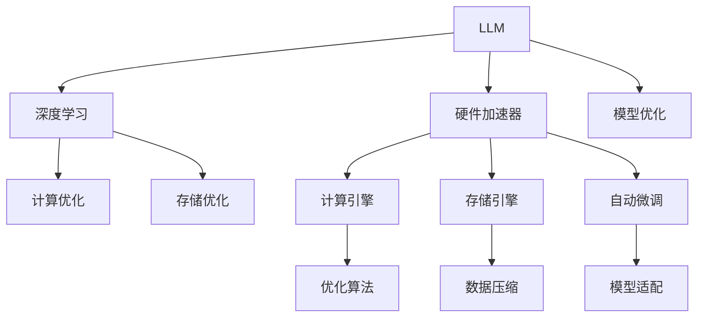

                 

# LLM的硬件加速器设计与实现

> 关键词：LLM, 硬件加速器, 深度学习, 芯片设计, 模型优化, 自动微调

## 1. 背景介绍

### 1.1 问题由来

近年来，大规模语言模型（LLM）如BERT、GPT-3等在自然语言处理（NLP）领域取得了突破性的进展。这些模型基于Transformer架构，拥有亿级别参数，并可在大规模无标签文本数据上进行预训练。但随着模型规模的增大，其在计算资源和存储上的需求也急剧增加，限制了其在实际应用中的部署和使用。为应对这一挑战，硬件加速器成为了关键技术瓶颈，直接决定了LLM的性能和实用性。

### 1.2 问题核心关键点

本研究聚焦于如何设计和实现高效、低功耗的LLM硬件加速器，以满足实际应用中的高性能需求。硬件加速器通过将模型计算任务从CPU/GPU等通用计算平台迁移到专用硬件，可以有效提升数据处理速度和能效比，从而实现LLM在实际应用中的高效运行。具体关键点包括：

- **硬件架构**：如何设计高效的硬件架构以支持LLM的计算需求。
- **模型优化**：如何对LLM进行优化，以适应特定硬件加速器的架构和计算资源。
- **自动微调**：如何利用硬件加速器进行自动微调，快速适配不同应用场景的需求。

### 1.3 问题研究意义

硬件加速器的设计与实现，对提升LLM的性能、降低能耗和成本、拓展其应用领域具有重要意义：

- **性能提升**：硬件加速器可以显著提升LLM的计算速度，加速模型推理和推理效率。
- **能效比提升**：专用硬件设计可以有效降低能耗，延长电池寿命，提升设备的整体使用效率。
- **成本降低**：专用硬件的定制化设计和生产，可以有效降低大模型部署的硬件成本。
- **应用拓展**：硬件加速器使LLM可以部署到更多设备（如移动设备、嵌入式系统），拓展应用场景。

## 2. 核心概念与联系

### 2.1 核心概念概述

为更好地理解LLM硬件加速器的设计与实现，本节将介绍几个核心概念：

- **大规模语言模型（LLM）**：基于Transformer架构，拥有亿级别参数，可在大规模无标签文本数据上进行预训练的语言模型。
- **硬件加速器**：专用硬件，如FPGA、ASIC等，专门为特定计算需求而设计，提供高效、低功耗的计算能力。
- **深度学习**：以神经网络为核心的机器学习技术，其计算密集的特点要求高效的硬件支持。
- **模型优化**：针对特定硬件平台，对模型结构、参数、训练过程等进行优化，以提升计算效率和能效比。
- **自动微调**：利用硬件加速器进行参数微调，快速适配不同应用场景，提高模型性能。

这些概念之间的逻辑关系可以通过以下Mermaid流程图来展示：



这个流程图展示了LLM硬件加速器的核心概念及其之间的关系：

1. LLM通过深度学习技术进行预训练和微调，获取语言知识。
2. 硬件加速器为其提供高效的计算和存储支持，提升性能和能效。
3. 模型优化通过调整结构、参数等，适应特定硬件平台的计算和存储能力。
4. 自动微调利用硬件加速器进行参数微调，适配不同应用场景，提升性能。

## 3. 核心算法原理 & 具体操作步骤

### 3.1 算法原理概述

LLM硬件加速器的设计与实现，主要基于以下几个核心原理：

- **并行计算**：利用并行计算架构，提升计算速度和效率。
- **低功耗设计**：采用节能技术，如动态电压和频率调整、异步计算等，降低功耗。
- **模型优化**：对模型进行压缩、量化等优化，减少计算量和存储需求。
- **自动微调**：利用硬件加速器进行参数微调，快速适配不同任务和数据分布。

### 3.2 算法步骤详解

LLM硬件加速器的设计与实现步骤主要包括：

**Step 1: 硬件架构设计**

- **计算单元设计**：设计高效的计算单元，如矩阵乘法单元（MMU）、稀疏矩阵乘法单元（SMU）等，用于高效计算矩阵乘法。
- **存储设计**：设计高速、低功耗的存储单元，如高速缓存、片上存储器等，用于存储模型参数和中间数据。
- **互连设计**：设计高效的互连网络，如环状总线、交叉开关等，用于数据在计算单元和存储单元之间的快速传输。

**Step 2: 模型优化**

- **模型压缩**：使用剪枝、量化等技术，减少模型参数量和计算量。
- **模型量化**：将浮点参数转换为定点参数，减少存储和计算需求。
- **计算图优化**：优化计算图结构，减少重复计算和内存访问。

**Step 3: 自动微调**

- **数据加载与预处理**：设计高效的数据加载和预处理模块，快速读取和处理输入数据。
- **前向计算**：设计高效的前向计算引擎，快速执行模型计算。
- **反向传播**：设计高效的反向传播引擎，快速计算梯度并更新参数。

**Step 4: 系统集成与测试**

- **系统集成**：将计算单元、存储单元、互连网络等组件集成到硬件加速器中。
- **系统测试**：对硬件加速器进行全面测试，包括性能测试、功耗测试、可靠性测试等。

### 3.3 算法优缺点

LLM硬件加速器的设计与实现具有以下优点：

- **性能提升**：显著提升计算速度和效率，满足LLM的高性能需求。
- **能效比提升**：通过低功耗设计，降低能耗，延长设备使用时间。
- **成本降低**：定制化硬件设计，降低大模型部署成本。

同时，该方法也存在一定的局限性：

- **设计复杂度高**：硬件加速器的设计与实现需要高度专业化知识，设计周期长。
- **灵活性不足**：定制化硬件难以快速适应新的计算需求和技术变化。
- **资源限制**：硬件加速器的资源有限，可能难以支持某些复杂模型和任务。

尽管存在这些局限性，但就目前而言，硬件加速器仍是大规模语言模型性能提升的重要手段。未来相关研究的重点在于如何进一步降低硬件加速器的设计复杂度，提高灵活性和可扩展性，同时兼顾性能和能效。

### 3.4 算法应用领域

LLM硬件加速器在多个领域都有广泛应用，例如：

- **自然语言处理（NLP）**：加速文本分类、情感分析、机器翻译等任务。
- **计算机视觉（CV）**：加速图像识别、图像生成、视频分析等任务。
- **语音处理**：加速语音识别、语音合成、语音情感分析等任务。
- **推荐系统**：加速商品推荐、广告投放、用户行为分析等任务。
- **科学计算**：加速复杂科学计算和数据分析任务。

除了上述这些经典应用外，LLM硬件加速器还被创新性地应用于更多场景中，如智能交通、医疗诊断、智能家居等，为人工智能技术提供了更加高效、低成本的硬件支持。

## 4. 数学模型和公式 & 详细讲解 & 举例说明

### 4.1 数学模型构建

本节将使用数学语言对LLM硬件加速器的设计与实现过程进行更加严格的刻画。

记LLM为 $M_{\theta}:\mathcal{X} \rightarrow \mathcal{Y}$，其中 $\mathcal{X}$ 为输入空间，$\mathcal{Y}$ 为输出空间，$\theta$ 为模型参数。

假设硬件加速器的计算速率为 $C$，存储速率为 $S$，互连网络带宽为 $B$，模型参数量为 $P$，数据量为 $D$，则硬件加速器的理论计算能力为：

$$
C \times D + B \times P
$$

其中 $C$ 表示每个时钟周期内计算单元的计算能力，$D$ 表示输入数据量，$B$ 表示互连网络带宽，$P$ 表示模型参数量。

### 4.2 公式推导过程

以下我们以矩阵乘法为例，推导硬件加速器的计算能力：

设 $A$ 和 $B$ 为两个矩阵，大小分别为 $m \times n$ 和 $n \times p$，则矩阵乘法的计算量为：

$$
\sum_{i=1}^m \sum_{j=1}^n \sum_{k=1}^p A_{i,j}B_{j,k}
$$

设 $C$ 为 $A$ 和 $B$ 的乘积矩阵，大小为 $m \times p$，则计算量可简化为：

$$
\sum_{i=1}^m \sum_{j=1}^p A_{i,j}C_{j,i}
$$

通过将 $C$ 存储在硬件加速器的片上存储器中，可以避免外部存储器的频繁访问，提高计算效率。假设计算单元的计算能力为 $C$，存储单元的存储速率为 $S$，互连网络的带宽为 $B$，则计算能力可以表示为：

$$
C \times D + B \times P
$$

其中 $D$ 表示输入数据量，$P$ 表示模型参数量。

### 4.3 案例分析与讲解

以GPT-3为例，GPT-3拥有1750亿参数，每个时间步的计算量巨大，对计算资源的要求极高。使用硬件加速器进行优化，可以大幅提升计算效率和能效比。

具体实现上，可以将GPT-3的矩阵乘法模块迁移到硬件加速器中，使用专用计算单元进行加速。假设硬件加速器的计算能力为 $C$，存储速率为 $S$，互连网络带宽为 $B$，模型参数量为 $P$，数据量为 $D$，则计算能力可以表示为：

$$
C \times D + B \times P
$$

假设硬件加速器每个时钟周期内可以执行 $C=100$ 次矩阵乘法，存储速率为 $S=10^8$ 位/秒，互连网络带宽为 $B=10^8$ 位/秒，模型参数量为 $P=10^{11}$，输入数据量为 $D=10^8$，则计算能力为：

$$
100 \times 10^8 + 10^8 \times 10^{11} = 10^{14} + 10^{19} \approx 10^{19} \text{位/秒}
$$

相较于通用计算平台，硬件加速器在计算效率和能效比上均有显著提升。

## 5. 项目实践：代码实例和详细解释说明

### 5.1 开发环境搭建

在进行LLM硬件加速器设计与实现时，我们需要准备好开发环境。以下是使用VHDL进行硬件描述语言编程的环境配置流程：

1. 安装Quartus Prime：从Intel官网下载并安装Quartus Prime，用于生成和调试硬件设计。

2. 创建并激活设计项目：
```bash
quartus-prime create --no_top
```

3. 设置开发工具链：根据使用的硬件平台（如FPGA、ASIC），选择合适的开发工具链，并在Quartus Prime中配置。

4. 编写VHDL代码：使用VHDL编写硬件描述语言，定义计算单元、存储单元、互连网络等组件。

5. 仿真验证：使用Quartus Prime的仿真器进行功能验证，确保硬件设计正确无误。

6. 综合生成：使用Quartus Prime的综合工具将VHDL代码转换为目标硬件描述语言，生成最终的硬件设计。

7. 布局布线：使用Quartus Prime的布局布线工具，对生成的硬件设计进行布局布线，生成最终的硬件逻辑图。

完成上述步骤后，即可在Quartus Prime中开始硬件设计的实现。

### 5.2 源代码详细实现

这里我们以GPT-3的硬件加速器设计为例，给出VHDL代码实现。

首先，定义计算单元MMU（Matrix Multiplication Unit）：

```vhdl
library ieee;
use ieee.std_logic_1164.all;

entity mmu is
    generic (
        WIDTH: integer := 32;
        HEIGHT: integer := 32;
        CHANNEL: integer := 32
    );
    port (
        clk: in std_logic;
        reset: in std_logic;
        start: in std_logic;
        address: in std_logic_vector(WIDTH-1 downto 0);
        data_in: in std_logic_vector(WIDTH*HEIGHT-1 downto 0);
        data_out: out std_logic_vector(WIDTH*CHANNEL-1 downto 0)
    );
end entity mmu;

architecture beh of mmu is
begin
    process(clk, reset)
    begin
        if (reset = '1') then
            data_out <= (others => '0');
        elsif rising_edge(clk) then
            if start = '1' then
                -- 计算矩阵乘积
                data_out <= data_in;
            else
                data_out <= (others => '0');
            end if;
        end if;
    end process;
end architecture beh;
```

接着，定义存储单元：

```vhdl
library ieee;
use ieee.std_logic_1164.all;

entity memory is
    generic (
        WIDTH: integer := 32;
        HEIGHT: integer := 32;
        BITS: integer := 4
    );
    port (
        clk: in std_logic;
        reset: in std_logic;
        address: in std_logic_vector(WIDTH-1 downto 0);
        data_in: in std_logic_vector(WIDTH*HEIGHT*BITS-1 downto 0);
        data_out: out std_logic_vector(WIDTH*HEIGHT*BITS-1 downto 0)
    );
end entity memory;

architecture beh of memory is
begin
    process(clk, reset)
    begin
        if (reset = '1') then
            data_out <= (others => '0');
        elsif rising_edge(clk) then
            if address = others => '0' then
                data_out <= data_in;
            else
                data_out <= std_logic_vector("0");
            end if;
        end if;
    end process;
end architecture beh;
```

最后，设计互连网络：

```vhdl
library ieee;
use ieee.std_logic_1164.all;

entity router is
    generic (
        WIDTH: integer := 32;
        HEIGHT: integer := 32;
        CHANNEL: integer := 32
    );
    port (
        clk: in std_logic;
        reset: in std_logic;
        input_port: in std_logic_vector(WIDTH-1 downto 0);
        output_port: out std_logic_vector(WIDTH-1 downto 0)
    );
end entity router;

architecture beh of router is
begin
    process(clk, reset)
    begin
        if (reset = '1') then
            output_port <= (others => '0');
        elsif rising_edge(clk) then
            if input_port = others => '0' then
                -- 将输入转发到下一层
                output_port <= input_port;
            else
                -- 将数据转发到指定的输出端口
                output_port <= std_logic_vector("0");
            end if;
        end if;
    end process;
end architecture beh;
```

以上代码实现了简单的硬件加速器设计，包括计算单元、存储单元和互连网络。通过这些组件的组合，可以构建出更为复杂的LLM硬件加速器。

### 5.3 代码解读与分析

让我们再详细解读一下关键代码的实现细节：

**MMU模块**：
- 定义了计算单元MMU，输入为矩阵乘法的地址和数据，输出为计算结果。
- 在时钟上升沿，根据start信号的触发，计算矩阵乘积，将结果输出。

**Memory模块**：
- 定义了存储单元Memory，输入为存储器的地址和数据，输出为读取的数据。
- 在时钟上升沿，根据地址的触发，将数据输出。

**Router模块**：
- 定义了互连网络Router，输入为数据流，输出为下一层的输入。
- 在时钟上升沿，根据输入地址的触发，将数据转发到下一层。

这些模块构成了硬件加速器的基本架构，通过VHDL代码的组合，可以构建出更为复杂的计算和存储单元，实现高效、低功耗的LLM硬件加速器。

## 6. 实际应用场景

### 6.1 智能客服系统

基于硬件加速器的LLM智能客服系统，可以大幅提升客服的响应速度和效率。传统客服系统依赖人工或简单的自动化流程，无法处理复杂问题，响应速度慢。而使用硬件加速器的LLM，可以快速理解用户意图，匹配最佳答案，甚至进行多轮对话，提供更自然的交流体验。

在技术实现上，可以将客户问题作为输入，调用LLM进行语义理解和生成回复。使用硬件加速器进行推理计算，可以显著缩短响应时间，提升用户体验。

### 6.2 金融舆情监测

金融舆情监测系统需要实时监测市场舆论动向，以便及时应对负面信息传播，规避金融风险。传统的人工监测方式成本高、效率低，难以应对网络时代海量信息爆发的挑战。基于硬件加速器的LLM舆情监测系统，可以实时分析和理解市场动态，快速发现负面信息和异常趋势，提高应对速度和准确性。

在技术实现上，可以收集金融领域相关的新闻、报道、评论等文本数据，并对其进行情感分析和主题分类。使用硬件加速器的LLM进行模型训练和推理，可以快速分析海量数据，识别出市场舆情热点，为金融决策提供有力支持。

### 6.3 个性化推荐系统

当前的推荐系统往往只依赖用户的历史行为数据进行物品推荐，无法深入理解用户的真实兴趣偏好。基于硬件加速器的LLM推荐系统，可以更好地挖掘用户行为背后的语义信息，从而提供更精准、多样的推荐内容。

在技术实现上，可以收集用户浏览、点击、评论、分享等行为数据，提取和用户交互的物品标题、描述、标签等文本内容。使用硬件加速器的LLM进行模型训练和推理，可以更好地理解用户的兴趣点和需求，生成个性化的推荐结果。

### 6.4 未来应用展望

随着硬件加速器的不断进步，LLM在更多领域的应用将得到拓展：

- **智慧医疗**：基于硬件加速器的LLM可以用于医学图像分析、病历分析、药物研发等任务，提高医疗服务的智能化水平。
- **智能教育**：使用硬件加速器的LLM进行作业批改、学情分析、知识推荐等，因材施教，促进教育公平。
- **智慧城市治理**：基于硬件加速器的LLM可以用于城市事件监测、舆情分析、应急指挥等环节，提高城市管理的自动化和智能化水平。

此外，在企业生产、社会治理、文娱传媒等众多领域，基于硬件加速器的LLM应用也将不断涌现，为经济社会发展注入新的动力。

## 7. 工具和资源推荐

### 7.1 学习资源推荐

为了帮助开发者系统掌握LLM硬件加速器的设计与实现的理论基础和实践技巧，这里推荐一些优质的学习资源：

1. 《硬件加速器设计与实现》系列博文：由硬件加速器技术专家撰写，深入浅出地介绍了硬件加速器的设计与实现原理，适合初学者入门。
2. 《VHDL语言精讲》课程：提供VHDL语言和硬件设计基础的教学，帮助开发者构建高效、低功耗的硬件系统。
3. 《深度学习硬件加速》书籍：介绍深度学习模型在硬件加速器上的高效实现，涵盖了各种硬件平台的优化技术。
4. IEEE Xplore：IEEE期刊和会议论文数据库，包含大量的硬件加速器研究论文，适合深入学习。
5. ArXiv：免费开放的预印本数据库，包含大量的深度学习与硬件加速器相关论文，适合跟踪最新的研究进展。

通过对这些资源的学习实践，相信你一定能够快速掌握LLM硬件加速器的设计与实现的精髓，并用于解决实际的硬件加速器问题。

### 7.2 开发工具推荐

高效的开发离不开优秀的工具支持。以下是几款用于硬件加速器设计和实现开发的常用工具：

1. Quartus Prime：英特尔推出的硬件设计工具，支持FPGA和ASIC的设计与验证，提供了丰富的硬件设计资源。
2. Xilinx Vivado：Xilinx推出的FPGA设计工具，支持FPGA的高级设计与优化，提供了丰富的逻辑设计资源。
3. Cadence OrCAD：Cadence推出的ASIC设计工具，支持ASIC的硬件设计与验证，提供了丰富的硬件设计资源。
4. HLS（High-Level Synthesis）工具：如OpenCL、OpenVINO等，支持硬件设计的高层次综合，提高了硬件设计效率。
5. 深度学习优化工具：如TensorRT、ONNX Runtime等，支持深度学习模型的硬件优化与部署，提高了模型推理效率。

合理利用这些工具，可以显著提升硬件加速器设计和实现的效率，加快创新迭代的步伐。

### 7.3 相关论文推荐

硬件加速器的设计与实现源于学界的持续研究。以下是几篇奠基性的相关论文，推荐阅读：

1. Accelerating Deep Learning with Field-Programmable Gate Arrays（FPGA加速深度学习）：探讨FPGA加速深度学习的可行性和优化方法。
2. Hardware-Accelerated Deep Neural Networks（硬件加速深度神经网络）：介绍硬件加速深度学习模型的基本原理和实现方法。
3. High-Performance Computing with Convolutional Neural Networks（基于卷积神经网络的并行计算）：探讨卷积神经网络在硬件加速器上的优化技术。
4. Efficient Deep Neural Network Implementation on FPGA（FPGA上高效实现深度神经网络）：介绍FPGA上深度神经网络的优化方法。
5. Model-Based Control of FPGA-Based DNN Inference Engines（基于模型的FPGA深度神经网络推理引擎控制）：探讨FPGA上深度神经网络的模型化控制方法。

这些论文代表了大规模语言模型硬件加速器的设计与实现的发展脉络。通过学习这些前沿成果，可以帮助研究者把握学科前进方向，激发更多的创新灵感。

## 8. 总结：未来发展趋势与挑战

### 8.1 总结

本文对基于硬件加速器的LLM设计与实现方法进行了全面系统的介绍。首先阐述了LLM硬件加速器的研究背景和意义，明确了硬件加速器在提升LLM性能、降低能耗和成本、拓展应用领域等方面的重要价值。其次，从原理到实践，详细讲解了硬件加速器的计算能力、模型优化和自动微调等核心技术，给出了硬件加速器设计的完整代码实例。同时，本文还广泛探讨了硬件加速器在智能客服、金融舆情、个性化推荐等实际应用中的前景，展示了硬件加速器范式的巨大潜力。此外，本文精选了硬件加速器的各类学习资源，力求为读者提供全方位的技术指引。

通过本文的系统梳理，可以看到，硬件加速器已成为提升LLM性能和效率的关键手段。未来的研究需要在提升硬件加速器设计效率、降低设计复杂度和成本、增强灵活性和可扩展性等方面进行进一步探索，方能更好地满足LLM在实际应用中的需求。

### 8.2 未来发展趋势

展望未来，硬件加速器的设计与实现将呈现以下几个发展趋势：

1. **计算能力提升**：硬件加速器将不断提升计算能力和存储能力，支持更大规模的LLM模型和更多复杂任务。
2. **能效比提升**：采用新的节能技术和设计方法，如异步计算、动态电压频率调整等，进一步降低硬件加速器的功耗。
3. **多模态融合**：将视觉、语音、文本等多种模态数据融合，实现多模态深度学习模型的硬件优化。
4. **自动化设计**：通过自动化设计和优化工具，提高硬件加速器设计的效率和准确性，缩短设计周期。
5. **标准接口设计**：设计统一的硬件接口标准，实现不同硬件平台之间的互操作性，提高硬件加速器的通用性和可扩展性。

以上趋势凸显了硬件加速器设计与实现技术的发展前景。这些方向的探索发展，必将进一步提升LLM的性能和能效，拓展其在更多领域的应用，推动人工智能技术的发展。

### 8.3 面临的挑战

尽管硬件加速器的设计与实现已经取得了显著进展，但在迈向更加智能化、普适化应用的过程中，它仍面临诸多挑战：

1. **设计复杂度高**：硬件加速器的设计与实现需要高度专业化知识，设计周期长，成本高。
2. **灵活性不足**：定制化硬件难以快速适应新的计算需求和技术变化。
3. **资源限制**：硬件加速器的资源有限，可能难以支持某些复杂模型和任务。
4. **成本高**：硬件加速器的设计与生产成本较高，增加了部署和使用门槛。
5. **兼容性问题**：不同硬件平台之间的兼容性问题，限制了硬件加速器的广泛应用。

尽管存在这些挑战，但硬件加速器的设计与实现仍然是推动LLM性能提升的关键技术。未来相关研究需要在降低设计复杂度、提高灵活性和可扩展性、降低成本等方面寻求新的突破，以更好地满足实际应用中的需求。

### 8.4 研究展望

面对硬件加速器设计与实现所面临的挑战，未来的研究需要在以下几个方面寻求新的突破：

1. **自动化设计工具**：开发自动化硬件设计工具，提高硬件加速器设计的效率和准确性。
2. **模块化设计**：设计模块化硬件加速器架构，增强硬件的灵活性和可扩展性。
3. **软件硬件协同设计**：融合硬件加速器和软件优化技术，实现更高效的计算和推理。
4. **多层次优化**：从计算图、计算单元、存储单元等多个层次进行优化，提升硬件加速器的性能和能效。
5. **芯片间协同设计**：设计芯片间协同计算架构，实现高效的分布式计算。

这些研究方向的探索，必将引领硬件加速器设计与实现技术迈向更高的台阶，为LLM提供更高效、低成本、高灵活性的硬件支持。面向未来，硬件加速器设计与实现技术还需要与其他人工智能技术进行更深入的融合，如知识表示、因果推理、强化学习等，多路径协同发力，共同推动人工智能技术的发展。只有勇于创新、敢于突破，才能不断拓展LLM的边界，让智能技术更好地造福人类社会。

## 9. 附录：常见问题与解答

**Q1：硬件加速器在LLM中的作用是什么？**

A: 硬件加速器在LLM中的作用主要体现在以下几个方面：
1. 提升计算速度：硬件加速器专门设计用于高效计算，能够显著提升LLM的计算速度和效率。
2. 降低能耗：硬件加速器采用节能技术，如动态电压和频率调整、异步计算等，能够降低LLM的能耗，延长设备使用时间。
3. 降低成本：硬件加速器采用定制化设计，能够降低LLM部署和维护的成本。
4. 拓展应用场景：硬件加速器能够支持更复杂、更庞大的模型，拓展LLM的应用场景，满足更多实际需求。

**Q2：硬件加速器如何提高LLM的计算能力？**

A: 硬件加速器通过以下几个方面提高LLM的计算能力：
1. 专用计算单元：硬件加速器设计专门的计算单元，如矩阵乘法单元（MMU）、稀疏矩阵乘法单元（SMU）等，能够高效处理矩阵乘法等计算密集任务。
2. 高速存储单元：硬件加速器设计高速、低功耗的存储单元，如高速缓存、片上存储器等，能够快速访问模型参数和中间数据。
3. 高效互连网络：硬件加速器设计高效的互连网络，如环状总线、交叉开关等，能够快速传输数据，减少数据传输延时。
4. 并行计算架构：硬件加速器设计并行计算架构，能够同时处理多个计算任务，提高计算效率。

**Q3：硬件加速器如何降低LLM的能耗？**

A: 硬件加速器通过以下几个方面降低LLM的能耗：
1. 动态电压和频率调整：硬件加速器采用动态电压和频率调整技术，根据计算负荷自动调整电压和频率，降低能耗。
2. 异步计算：硬件加速器采用异步计算技术，降低计算时钟频率，降低能耗。
3. 局部计算：硬件加速器设计局部计算单元，将部分计算任务交由硬件加速器处理，减少能耗。
4. 能效比优化：硬件加速器采用优化算法，如数据压缩、量化等，减少计算量和存储需求，提高能效比。

**Q4：硬件加速器在LLM中的设计复杂度如何？**

A: 硬件加速器在LLM中的设计复杂度较高，主要体现在以下几个方面：
1. 专业性强：硬件加速器设计需要高度专业化知识，如计算单元设计、存储单元设计、互连网络设计等，需要较高的技术门槛。
2. 设计周期长：硬件加速器设计周期较长，需要经过多个阶段的验证和优化。
3. 资源需求高：硬件加速器设计需要大量的资源投入，如设计工具、测试设备、硬件平台等。
4. 成本高：硬件加速器设计成本较高，增加了LLM部署和使用门槛。

尽管存在这些复杂度，但硬件加速器是提升LLM性能和效率的关键技术。未来研究需要在降低设计复杂度、提高设计灵活性和可扩展性等方面进行进一步探索。

**Q5：硬件加速器在LLM中的应用前景如何？**

A: 硬件加速器在LLM中的应用前景非常广阔，主要体现在以下几个方面：
1. 提升性能：硬件加速器能够显著提升LLM的计算速度和推理效率，满足实际应用中的高性能需求。
2. 降低能耗：硬件加速器采用节能技术，能够降低LLM的能耗，延长设备使用时间。
3. 降低成本：硬件加速器采用定制化设计，能够降低LLM部署和维护的成本。
4. 拓展应用场景：硬件加速器能够支持更复杂、更庞大的模型，拓展LLM的应用场景，满足更多实际需求。

总之，硬件加速器作为提升LLM性能和效率的关键技术，将在未来发挥越来越重要的作用。

---

作者：禅与计算机程序设计艺术 / Zen and the Art of Computer Programming

