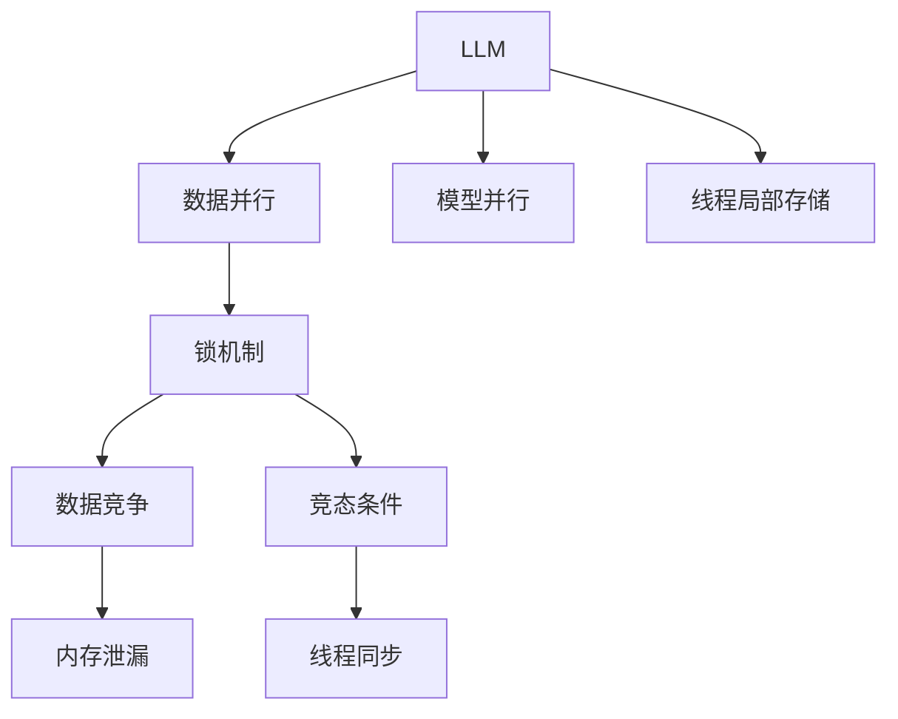

                 

# LLM的线程安全问题与解决思路

> 关键词：大规模语言模型(Large Language Model, LLM), 多线程并行, 线程安全, 共享变量, 锁机制, 数据竞争, 内存泄漏, 竞态条件, 线程同步, 线程局部存储, 软件并发, 硬件加速, 内存管理

## 1. 背景介绍

### 1.1 问题由来
随着深度学习技术的快速发展和硬件性能的不断提升，大规模语言模型（LLM）的训练和推理规模越来越大，数据并行和模型并行成为主流。这些技术手段极大地提升了模型的训练效率和推理速度，但随之而来的，是大规模并行计算带来的线程安全问题。在LLM的训练和推理过程中，多个线程需要共享大量的变量和资源，因此线程安全成为一项至关重要的任务。然而，错误的线程安全处理可能会导致数据竞争、内存泄漏、竞态条件等严重问题，影响模型性能和系统稳定性。

### 1.2 问题核心关键点
LLM的线程安全问题主要涉及以下几个关键点：
- **多线程并行**：在训练和推理过程中，通常需要利用多线程进行数据处理和计算。
- **共享变量**：多个线程需要共享模型参数、中间变量等重要资源。
- **锁机制**：为避免数据竞争，必须使用锁等同步机制来保护共享变量。
- **数据竞争**：多个线程同时对同一共享变量进行读写操作时，可能会发生数据竞争。
- **内存泄漏**：共享变量在多线程环境下，如果没有正确管理，可能会发生内存泄漏。
- **竞态条件**：由于数据竞争，可能导致不可预期的结果。

这些问题的处理不当，将直接影响LLM的训练和推理效果。因此，本文将详细探讨这些问题的原理、产生原因以及相应的解决思路。

## 2. 核心概念与联系

### 2.1 核心概念概述

为更好地理解LLM的线程安全问题，本节将介绍几个密切相关的核心概念：

- **大规模语言模型（LLM）**：以自回归（如GPT）或自编码（如BERT）模型为代表的大规模预训练语言模型。通过在大规模无标签文本语料上进行预训练，学习通用的语言表示，具备强大的语言理解和生成能力。

- **数据并行（Data Parallelism）**：将数据分成多个批次，由多个线程同时处理，以提高训练和推理的效率。

- **模型并行（Model Parallelism）**：将模型参数分成多个子集，由多个线程同时更新，以处理超大模型的训练问题。

- **线程安全（Thread Safety）**：指在多线程环境中，多个线程对共享变量的访问是互斥的，避免了数据竞争和竞态条件等并发问题。

- **锁机制（Locking Mechanism）**：通过互斥锁、读写锁等机制，实现对共享变量的保护，防止数据竞争。

- **线程局部存储（Thread Local Storage, TLS）**：每个线程有自己的存储区，避免多个线程之间的数据冲突。

这些核心概念之间的逻辑关系可以通过以下Mermaid流程图来展示：



这个流程图展示了大规模语言模型中的线程安全问题及其之间的关系：

1. LLM通过数据并行和模型并行，提升了训练和推理的效率。
2. 多个线程共享模型参数等变量，需要锁机制保护。
3. 数据竞争和竞态条件可能导致不可预期的结果。
4. 内存泄漏需要合理的资源管理。
5. 线程同步是解决线程安全问题的基础。
6. 线程局部存储避免共享变量的冲突。

## 3. 核心算法原理 & 具体操作步骤

### 3.1 算法原理概述

在大规模语言模型中，线程安全问题的解决主要依赖于锁机制和线程局部存储。锁机制通过互斥访问共享变量，防止多个线程同时修改同一份数据，导致数据竞争和竞态条件。而线程局部存储则将变量与线程绑定，避免多个线程之间的数据冲突。

### 3.2 算法步骤详解

基于锁机制和线程局部存储，解决LLM的线程安全问题通常包括以下几个关键步骤：

**Step 1: 锁机制设计**
- 确定需要保护的共享变量，判断是否需要加锁。
- 选择合适的锁类型，如互斥锁、读写锁、原子操作等。
- 设计锁的使用规则，明确哪些线程可以访问加锁的变量。

**Step 2: 线程局部存储**
- 为需要独立处理的变量设计线程局部存储。
- 确定哪些变量需要线程局部存储，哪些可以共享。
- 实现线程局部存储的创建和销毁，保证每个线程都有独立的存储空间。

**Step 3: 锁的使用与释放**
- 在访问共享变量时，先加锁，确保同一时间只有一个线程可以访问。
- 在使用共享变量后，立即释放锁，释放资源的占用。

**Step 4: 死锁处理**
- 定义避免死锁的策略，如按照一定的顺序加锁。
- 使用超时机制，防止线程长时间等待锁。
- 进行锁的层次划分，减少死锁的发生概率。

**Step 5: 异常处理**
- 设计异常处理机制，确保线程在异常情况下能够正确恢复。
- 记录锁的使用情况，便于排查异常原因。

**Step 6: 性能优化**
- 通过合理设计锁的使用策略，减少锁的开销。
- 使用无锁数据结构，避免锁的使用。
- 使用线程池和任务队列，提高并行性能。

### 3.3 算法优缺点

基于锁机制和线程局部存储的线程安全解决方案，具有以下优点：
1. 简单高效。锁机制和线程局部存储的实现相对简单，易于理解和实现。
2. 易于扩展。适用于多种场景，可以灵活设计锁的使用策略和线程局部存储的变量。
3. 可控性强。锁的使用和释放可以精确控制，保证线程安全。

同时，该方法也存在一些局限性：
1. 性能开销。锁的开销可能影响程序的执行效率，尤其是在并发操作频繁的场景下。
2. 死锁风险。设计不当的锁使用可能导致死锁问题。
3. 锁粒度问题。锁粒度过大可能导致锁的竞争过于激烈，而锁粒度过小则可能影响并发性能。

尽管存在这些局限性，但就目前而言，基于锁机制和线程局部存储的线程安全方法仍是大规模语言模型应用中最主流范式。未来相关研究的重点在于如何进一步降低锁的使用频率，提高并发性能，同时兼顾线程安全性和程序的可维护性。

### 3.4 算法应用领域

基于锁机制和线程局部存储的线程安全方法，在LLM的训练和推理中得到了广泛应用，如：

- 模型参数的更新：在训练过程中，需要多个线程同时更新模型参数，通过锁机制保护参数的更新。
- 中间变量的计算：在推理过程中，多个线程需要同时计算中间变量，通过锁机制保护变量。
- 数据处理和传输：在数据并行处理和分布式计算中，需要多个线程同时处理数据，通过锁机制保护数据的访问。

除了上述这些经典应用外，基于线程安全的方法还被创新性地应用于更高级别的系统设计，如分布式系统、云计算平台、自动化测试等，为大规模并行计算提供基础支持。

## 4. 数学模型和公式 & 详细讲解 & 举例说明

### 4.1 数学模型构建

在本节中，我们将使用数学语言对LLM的线程安全问题进行更加严格的刻画。

记需要保护的共享变量为 $x$，定义多个线程访问 $x$ 的函数为 $f(x)$。假设 $x$ 的当前值为 $x_0$，在多个线程同时访问 $x$ 的情况下，$x$ 的值可能会发生不可预测的变化。

### 4.2 公式推导过程

在多线程环境下，线程 $i$ 对 $x$ 的访问可以表示为：

$$
x_{i+1} = f(x_i)
$$

其中 $x_i$ 表示线程 $i$ 对 $x$ 的访问结果。在线程 $i$ 和 $j$ 同时访问 $x$ 的情况下，$x$ 的值可能变为 $x'$，满足：

$$
x' = f(x_i) \quad \text{或} \quad x' = f(x_j)
$$

为了保证线程安全，需要在访问 $x$ 时加锁，确保同一时间只有一个线程可以访问 $x$。这可以通过互斥锁 $L$ 来实现：

$$
\begin{aligned}
x_{i+1} &= \begin{cases}
f(x_i), & \text{如果 } i \text{ 获取了锁 } L \\
x_i, & \text{如果 } i \text{ 无法获取锁 } L
\end{cases} \\
x_{j+1} &= \begin{cases}
f(x_j), & \text{如果 } j \text{ 获取了锁 } L \\
x_j, & \text{如果 } j \text{ 无法获取锁 } L
\end{cases}
\end{aligned}
$$

在获取锁后，线程 $i$ 和 $j$ 对 $x$ 的访问分别得到结果 $x_{i+1}$ 和 $x_{j+1}$，最终 $x$ 的值变为：

$$
x' = x_{i+1} \quad \text{或} \quad x' = x_{j+1}
$$

由此可以看出，通过锁机制，可以保证多个线程对共享变量的访问是互斥的，避免了数据竞争和竞态条件等并发问题。

### 4.3 案例分析与讲解

以下是一个简单的多线程访问共享变量的案例，展示锁机制的使用。

假设有一个全局变量 `counter` 用于记录访问次数，多个线程同时访问 `counter` 并增加计数器。如果不对 `counter` 进行锁保护，多个线程同时访问可能导致计数器值不准确。

```python
import threading

counter = 0
lock = threading.Lock()

def increment():
    global counter
    for _ in range(1000000):
        with lock:
            counter += 1

threads = [threading.Thread(target=increment) for _ in range(10)]
for thread in threads:
    thread.start()

for thread in threads:
    thread.join()

print(counter)
```

在上述代码中，使用 `threading.Lock()` 创建了一个互斥锁 `lock`。在 `increment` 函数中，每次循环增加计数器时，先使用 `with lock` 获取锁，保证同一时间只有一个线程可以访问 `counter`，从而避免了数据竞争和计数器值的不准确。

通过锁机制，实现了多线程对共享变量的安全访问。

## 5. 项目实践：代码实例和详细解释说明

### 5.1 开发环境搭建

在进行线程安全问题实践前，我们需要准备好开发环境。以下是使用Python进行PyTorch开发的环境配置流程：

1. 安装Anaconda：从官网下载并安装Anaconda，用于创建独立的Python环境。

2. 创建并激活虚拟环境：
```bash
conda create -n pytorch-env python=3.8 
conda activate pytorch-env
```

3. 安装PyTorch：根据CUDA版本，从官网获取对应的安装命令。例如：
```bash
conda install pytorch torchvision torchaudio cudatoolkit=11.1 -c pytorch -c conda-forge
```

4. 安装Multiprocessing库：
```bash
pip install multiprocessing
```

完成上述步骤后，即可在`pytorch-env`环境中开始线程安全问题的实践。

### 5.2 源代码详细实现

下面我们以并行计算为例，给出使用Multiprocessing库进行线程安全处理的PyTorch代码实现。

首先，定义一个并行计算函数：

```python
import torch
from multiprocessing import Pool, Lock

def compute(x, lock):
    with lock:
        return x * x

def parallel_compute(nums, lock):
    pool = Pool(processes=4)
    results = pool.map(compute, nums, [lock] * len(nums))
    return results

```

在上述代码中，`compute` 函数计算每个数的平方，并使用 `with lock` 获取锁，保证同一时间只有一个线程可以访问变量 `x`。`parallel_compute` 函数使用 Multiprocessing 的 `Pool` 类创建多个进程，并行计算每个数的平方，通过传递锁对象 `lock` 实现线程安全。

### 5.3 代码解读与分析

让我们再详细解读一下关键代码的实现细节：

**Multiprocessing库**：
- `Pool` 类：创建进程池，指定进程数量，方便管理多个进程的并发计算。
- `map` 方法：将函数应用到输入序列的每个元素上，并返回结果序列。

**Lock类**：
- 使用 `Lock` 类创建互斥锁，确保同一时间只有一个线程可以访问共享变量 `x`。

**并行计算函数**：
- `compute` 函数：计算每个数的平方，并在计算前获取锁。
- `parallel_compute` 函数：使用 `Pool` 类创建多个进程，并行计算每个数的平方，通过传递锁对象 `lock` 实现线程安全。

可以看到，通过 Multiprocessing 库，我们可以在多线程环境中实现并行计算，同时使用锁机制保证线程安全。

## 6. 实际应用场景

### 6.1 分布式计算

在大规模语言模型的训练和推理过程中，通常需要利用分布式计算来加速计算任务。在分布式计算环境中，线程安全问题变得尤为重要，因为多个进程需要在共享内存中访问变量。

### 6.2 多核计算

现代计算机通常配备多个CPU核心，利用多核计算可以显著提升计算效率。在多核计算中，线程安全问题同样需要谨慎处理，以避免数据竞争和竞态条件。

### 6.3 云计算平台

云计算平台上的大规模并行计算任务，也需要考虑线程安全问题，以保障计算结果的准确性和一致性。

### 6.4 实时系统

在实时系统中，需要快速响应用户请求，进行并行计算。线程安全问题如果处理不当，可能导致系统崩溃或数据损坏。

## 7. 工具和资源推荐

### 7.1 学习资源推荐

为了帮助开发者系统掌握LLM的线程安全问题及其解决思路，这里推荐一些优质的学习资源：

1. 《Concurrency: State Models & Java Threads》系列博文：深入浅出地介绍了Java多线程编程的基础知识和最佳实践。

2. 《Thread Safety》课程：由Coursera提供的Java线程安全课程，涵盖线程安全问题的概念、锁机制、并发集合等。

3. 《C++ Concurrency in Action》书籍：讲解了C++11及更高版本中的线程安全机制和并发编程技术。

4. 《The Art of Multiprocessor Programming》书籍：详细介绍了多处理器系统的线程安全编程技术和设计原则。

5. 《High Performance Computing with Python》书籍：介绍了Python中并行计算和分布式计算的最佳实践，包括线程安全问题。

通过对这些资源的学习实践，相信你一定能够系统地掌握LLM的线程安全问题及其解决思路，并在实际开发中加以应用。

### 7.2 开发工具推荐

高效的开发离不开优秀的工具支持。以下是几款用于LLM线程安全问题开发的常用工具：

1. PyTorch：基于Python的开源深度学习框架，支持分布式计算和多核计算，易于进行多线程编程。

2. Multiprocessing库：Python标准库，提供了创建进程池和并行计算的支持，方便进行多线程编程。

3. Threading库：Python标准库，提供了创建线程和线程同步的支持，方便进行多线程编程。

4. OpenMP：C/C++语言标准库，提供了跨平台的线程并行编程支持。

5. Intel TBB：英特尔线程库，提供了高效的并行编程接口，支持多核计算。

6. CUDA：NVIDIA提供的并行计算平台，支持GPU加速的多线程计算。

合理利用这些工具，可以显著提升LLM的线程安全问题解决效率，加快创新迭代的步伐。

### 7.3 相关论文推荐

LLM的线程安全问题涉及许多前沿研究，以下是几篇奠基性的相关论文，推荐阅读：

1. "A Survey of Concurrency Control" by F. Geels：综述了各种并发控制技术，包括锁机制、乐观并发等。

2. "The Art of Multiprocessor Programming" by M. Herlihy：介绍了多处理器系统的并发编程技术和设计原则。

3. "Practical Concurrent Programming in Python" by P. Walsh：讲解了Python中的并发编程技术，包括锁机制、线程池等。

4. "Thread Safety in Java" by J. Newstead：介绍了Java线程安全编程的最佳实践和技术。

5. "Parallel Programming with CUDA" by A. Smith：讲解了使用CUDA进行GPU加速的并行计算技术。

这些论文代表了大规模语言模型线程安全问题的发展脉络。通过学习这些前沿成果，可以帮助研究者把握学科前进方向，激发更多的创新灵感。

## 8. 总结：未来发展趋势与挑战

### 8.1 总结

本文对基于锁机制和线程局部存储的线程安全问题进行了全面系统的介绍。首先阐述了线程安全问题在LLM中的重要性，明确了锁机制和线程局部存储的基本概念和作用。其次，从原理到实践，详细讲解了线程安全问题的解决思路，给出了线程安全问题处理的完整代码实例。同时，本文还探讨了线程安全问题在分布式计算、多核计算、云计算平台等多个领域的应用场景，展示了线程安全问题的广泛应用。

通过本文的系统梳理，可以看到，线程安全问题在LLM中具有重要意义，其解决思路包括锁机制和线程局部存储。这些方法可以有效避免数据竞争和竞态条件等并发问题，保证LLM的训练和推理性能。未来，随着硬件性能的提升和算法的优化，如何进一步提升线程安全问题的解决效率，减少锁的使用频率，将是重要研究方向。

### 8.2 未来发展趋势

展望未来，LLM的线程安全问题将呈现以下几个发展趋势：

1. 并发编程范式创新。未来的并发编程技术将更加灵活和高效，减少锁的使用，提高并发性能。

2. 无锁编程和因果编程。开发更加智能化的并发编程工具，利用因果推断和无锁编程技术，提高并发程序的可靠性。

3. 线程安全工具的完善。开发更加智能化的并发编程工具，利用因果推断和无锁编程技术，提高并发程序的可靠性。

4. 跨平台并发编程。开发适用于多平台的并发编程技术，方便在不同硬件和操作系统上实现高效的并发计算。

5. 内存管理技术的进步。开发更加智能化的内存管理工具，减少内存泄漏和资源竞争。

以上趋势凸显了LLM线程安全问题的重要性和研究价值。这些方向的探索发展，必将进一步提升LLM的并发性能和系统稳定性，推动LLM在更广泛的应用领域得到应用。

### 8.3 面临的挑战

尽管线程安全问题在LLM中得到了广泛关注和研究，但在实现高效并行计算的同时，依然面临诸多挑战：

1. 性能开销。锁的开销可能影响程序的执行效率，尤其是在并发操作频繁的场景下。

2. 死锁风险。设计不当的锁使用可能导致死锁问题，影响系统稳定性。

3. 锁粒度问题。锁粒度过大可能导致锁的竞争过于激烈，而锁粒度过小则可能影响并发性能。

4. 资源竞争。多个线程同时访问共享资源，可能导致资源竞争和数据冲突。

5. 分布式同步。在分布式计算环境中，需要考虑跨节点同步问题，保证系统一致性。

这些挑战需要研究者不断探索和优化，才能实现高效、可靠的LLM并发计算。

### 8.4 研究展望

面对LLM线程安全问题所面临的种种挑战，未来的研究需要在以下几个方面寻求新的突破：

1. 探索新的并发编程范式。利用无锁编程、因果推断等技术，开发更加高效和可靠的并发编程方法。

2. 研究智能并发控制技术。开发智能化的锁管理工具，动态调整锁粒度和锁使用策略，提高并发性能。

3. 改进多核计算和分布式计算技术。优化多核计算和分布式计算的算法和模型，减少锁的使用频率。

4. 探索新的内存管理技术。开发更加智能化的内存管理工具，减少内存泄漏和资源竞争。

5. 研究跨平台并发编程技术。开发适用于多平台的并发编程技术，方便在不同硬件和操作系统上实现高效的并发计算。

这些研究方向的探索，必将引领LLM线程安全问题走向更高的台阶，为构建高效、可靠、安全的智能系统提供技术支持。面向未来，线程安全问题需要与其他人工智能技术进行更深入的融合，如因果推理、强化学习等，多路径协同发力，共同推动智能系统的发展。只有勇于创新、敢于突破，才能不断拓展LLM的边界，让智能技术更好地造福人类社会。

## 9. 附录：常见问题与解答

**Q1：如何避免线程安全问题？**

A: 避免线程安全问题的关键是正确设计锁的使用策略。
1. 避免锁粒度过大。锁粒度过大会导致锁竞争过于激烈，影响并发性能。应将锁的使用粒度尽量细化。
2. 避免死锁。设计锁的使用顺序，确保同一时间只有一个线程可以访问锁。
3. 避免过多的锁使用。在可能的情况下，使用无锁编程技术。

**Q2：线程安全问题如何影响LLM性能？**

A: 线程安全问题如果处理不当，会导致数据竞争和竞态条件，影响LLM的性能和系统稳定性。
1. 数据竞争。多个线程同时修改同一份数据，可能导致数据不一致。
2. 竞态条件。由于数据竞争，可能导致不可预期的结果。
3. 死锁。多个线程同时等待锁，导致系统无法正常运行。

**Q3：如何提高LLM的并发性能？**

A: 提高LLM的并发性能，可以通过以下方法：
1. 使用无锁编程技术。尽可能减少锁的使用，提高并发性能。
2. 使用因果推断技术。利用因果推断方法，避免数据竞争，提高并发性能。
3. 优化算法和模型。优化LLM的算法和模型，减少锁的使用频率。
4. 使用线程池和任务队列。使用线程池和任务队列，提高并发性能。

**Q4：如何应对线程安全问题的挑战？**

A: 应对线程安全问题的挑战，可以从以下几个方面入手：
1. 优化锁的使用策略。通过合理设计锁的使用策略，减少锁的开销和竞争。
2. 研究新的并发编程技术。利用无锁编程、因果推断等技术，提高并发性能。
3. 改进硬件支持。优化硬件设计，提高并发计算的性能。
4. 开发智能化的锁管理工具。开发智能化的锁管理工具，动态调整锁粒度和锁使用策略。

这些方法可以帮助研究者有效应对线程安全问题，提高LLM的并发性能和系统稳定性。

---

作者：禅与计算机程序设计艺术 / Zen and the Art of Computer Programming

