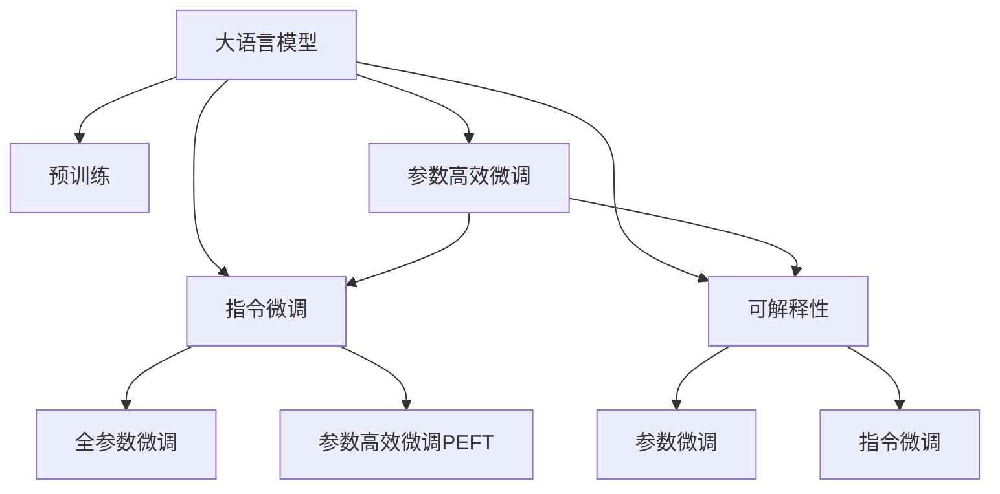

                 

# LLM的魔力：创造无限可能的指令集

## 1. 背景介绍

### 1.1 问题由来

近年，大型语言模型（Large Language Models, LLMs），如GPT-3、BERT等，在自然语言处理（Natural Language Processing, NLP）领域取得了突破性的进展。这些模型在大规模无标签文本语料上进行预训练，学习到了丰富的语言知识，能够进行高效的文本生成、分类、翻译等多种任务。但这些通用模型在特定领域的应用时，通常需要进一步微调（Fine-Tuning），以提高模型在特定任务上的表现。

微调是指将预训练模型当作初始化参数，通过有监督地训练来优化模型在特定任务上的性能。这一过程不仅能提升模型在特定任务上的效果，还能保持模型在预训练中获得的一般性知识。因此，微调成为了提升大型语言模型应用效果的重要手段。

### 1.2 问题核心关键点

微调的关键在于选择合适的学习率、正则化技术、数据增强等方法，避免模型过拟合，同时最大程度地利用预训练模型的通用性知识。传统微调方法在实际应用中虽然已取得显著成效，但存在一些局限性，如对标注数据依赖较高、模型泛化能力有限、可解释性不足等。

为了应对这些挑战，新兴的指令微调（Instruction Fine-Tuning）方法应运而生，利用自然语言描述，直接指导模型执行特定任务，而无需对模型进行大规模更新。这种方法不仅减少了对标注数据的依赖，还能提升模型的泛化能力和可解释性，具有更广泛的应用前景。

## 2. 核心概念与联系

### 2.1 核心概念概述

为更好地理解指令微调，本节将介绍几个密切相关的核心概念：

- 大语言模型（Large Language Model, LLM）：以自回归（如GPT）或自编码（如BERT）模型为代表的大规模预训练语言模型。通过在大规模无标签文本语料上进行预训练，学习通用的语言表示，具备强大的语言理解和生成能力。

- 预训练（Pre-training）：指在大规模无标签文本语料上，通过自监督学习任务训练通用语言模型的过程。常见的预训练任务包括言语建模、遮挡语言模型等。预训练使得模型学习到语言的通用表示。

- 指令微调（Instruction Fine-Tuning）：指将自然语言指令作为输入，指导模型执行特定任务，而无需对模型进行大规模更新的微调方法。

- 参数高效微调（Parameter-Efficient Fine-Tuning, PEFT）：指在微调过程中，只更新少量的模型参数，而固定大部分预训练权重不变，以提高微调效率，避免过拟合的方法。

- 可解释性（Explainability）：指模型输出结果的可解释性，即模型如何根据输入数据做出预测，以及预测的合理性。

这些核心概念之间的逻辑关系可以通过以下Mermaid流程图来展示：



这个流程图展示了大语言模型的核心概念及其之间的关系：

1. 大语言模型通过预训练获得基础能力。
2. 微调是对预训练模型进行任务特定的优化，可以分为全参数微调和参数高效微调（PEFT）。
3. 指令微调是一种不更新模型参数的方法，通过自然语言指令引导模型执行特定任务。
4. 可解释性是指令微调中的一个重要属性，使得模型输出结果具有可解释性。
5. 参数高效微调与可解释性相结合，可以构建更加灵活、高效的指令微调模型。

这些概念共同构成了大语言模型的学习和应用框架，使其能够在各种场景下发挥强大的语言理解和生成能力。通过理解这些核心概念，我们可以更好地把握大语言模型的工作原理和优化方向。

## 3. 核心算法原理 & 具体操作步骤

### 3.1 算法原理概述

指令微调基于自然语言处理（NLP）的原理，将自然语言指令作为输入，引导大语言模型执行特定任务。这种微调方法的核心思想是：利用自然语言描述任务的执行逻辑，而不需要对模型进行大规模更新。

形式化地，假设预训练模型为 $M_{\theta}$，其中 $\theta$ 为预训练得到的模型参数。给定任务 $T$ 的自然语言指令 $I$，指令微调的目标是找到新的模型参数 $\hat{\theta}$，使得：

$$
\hat{\theta}=\mathop{\arg\min}_{\theta} \mathcal{L}(M_{\theta},I)
$$

其中 $\mathcal{L}$ 为针对任务 $T$ 设计的损失函数，用于衡量模型输出的质量。常见的损失函数包括交叉熵损失、均方误差损失等。

通过梯度下降等优化算法，指令微调过程不断更新模型参数 $\theta$，最小化损失函数 $\mathcal{L}$，使得模型输出逼近理想结果。由于 $\theta$ 已经通过预训练获得了较好的初始化，因此即便是在指令微调过程中，也能较快收敛到理想的模型参数 $\hat{\theta}$。

### 3.2 算法步骤详解

指令微调的核心步骤如下：

**Step 1: 准备预训练模型和指令**
- 选择合适的预训练语言模型 $M_{\theta}$ 作为初始化参数，如 BERT、GPT 等。
- 编写或收集自然语言指令，用于描述特定任务。

**Step 2: 设计任务适配层**
- 根据任务类型，在预训练模型顶层设计合适的输出层和损失函数。
- 对于分类任务，通常在顶层添加线性分类器和交叉熵损失函数。
- 对于生成任务，通常使用语言模型的解码器输出概率分布，并以负对数似然为损失函数。

**Step 3: 设置微调超参数**
- 选择合适的优化算法及其参数，如 AdamW、SGD 等，设置学习率、批大小、迭代轮数等。
- 设置正则化技术及强度，包括权重衰减、Dropout、Early Stopping 等。
- 确定冻结预训练参数的策略，如仅微调顶层，或全部参数都参与微调。

**Step 4: 执行指令微调**
- 将指令数据分批次输入模型，前向传播计算损失函数。
- 反向传播计算参数梯度，根据设定的优化算法和学习率更新模型参数。
- 周期性在验证集上评估模型性能，根据性能指标决定是否触发 Early Stopping。
- 重复上述步骤直到满足预设的迭代轮数或 Early Stopping 条件。

**Step 5: 测试和部署**
- 在测试集上评估微调后模型 $M_{\hat{\theta}}$ 的性能，对比微调前后的精度提升。
- 使用微调后的模型对新指令进行推理预测，集成到实际的应用系统中。
- 持续收集新的指令，定期重新微调模型，以适应指令分布的变化。

以上是指令微调的一般流程。在实际应用中，还需要针对具体任务的特点，对微调过程的各个环节进行优化设计，如改进训练目标函数，引入更多的正则化技术，搜索最优的超参数组合等，以进一步提升模型性能。

### 3.3 算法优缺点

指令微调方法具有以下优点：
1. 不依赖标注数据。自然语言指令直接描述了任务执行逻辑，无需额外的标注数据。
2. 泛化能力强。指令微调可以处理多种不同领域的任务，只需简单修改指令即可。
3. 可解释性高。指令微调的模型输出具有高度的可解释性，能够直接从指令中理解任务需求。
4. 零样本学习能力。利用预训练模型的语言理解能力，能够在零样本情况下执行新任务。

同时，该方法也存在一些局限性：
1. 对自然语言描述要求较高。指令需要准确描述任务逻辑，否则可能导致模型输出错误。
2. 对模型理解能力依赖较大。预训练模型的语言理解能力直接影响指令微调的效果。
3. 对抗攻击脆弱。模型可能受到对抗样本的干扰，导致输出错误。
4. 模型可控性不足。模型输出可能受到多种因素的影响，难以完全控制。

尽管存在这些局限性，但指令微调方法以其独特的优势，正在成为大语言模型应用中的重要手段。

### 3.4 算法应用领域

指令微调方法在NLP领域已经得到了广泛的应用，覆盖了几乎所有常见任务，例如：

- 文本分类：如情感分析、主题分类、意图识别等。通过指令微调使模型学习文本-标签映射。
- 命名实体识别：识别文本中的人名、地名、机构名等特定实体。通过指令微调使模型掌握实体边界和类型。
- 关系抽取：从文本中抽取实体之间的语义关系。通过指令微调使模型学习实体-关系三元组。
- 问答系统：对自然语言问题给出答案。将问题-答案对作为指令，微调模型学习匹配答案。
- 机器翻译：将源语言文本翻译成目标语言。通过指令微调使模型学习语言-语言映射。
- 文本摘要：将长文本压缩成简短摘要。通过指令微调使模型学习抓取要点。
- 对话系统：使机器能够与人自然对话。将多轮对话历史作为上下文，微调模型进行回复生成。

除了上述这些经典任务外，指令微调方法还被创新性地应用到更多场景中，如可控文本生成、常识推理、代码生成、数据增强等，为NLP技术带来了全新的突破。随着预训练模型和微调方法的不断进步，相信基于指令微调的方法将在更多领域得到应用，为NLP技术的发展注入新的活力。

## 4. 数学模型和公式 & 详细讲解 & 举例说明

### 4.1 数学模型构建

本节将使用数学语言对指令微调过程进行更加严格的刻画。

记预训练语言模型为 $M_{\theta}$，其中 $\theta$ 为预训练得到的模型参数。假设指令微调的任务为 $T$，其指令为 $I$。指令微调的目标是找到最优的模型参数 $\hat{\theta}$，使得模型输出与指令 $I$ 一致。

定义模型 $M_{\theta}$ 在指令 $I$ 上的损失函数为 $\ell(M_{\theta},I)$，则在指令微调的任务 $T$ 上的经验风险为：

$$
\mathcal{L}(\theta) = \mathbb{E}_{I \sim P_T}[\ell(M_{\theta},I)]
$$

其中 $P_T$ 为任务 $T$ 的指令分布。微调的目标是最小化经验风险，即找到最优参数：

$$
\theta^* = \mathop{\arg\min}_{\theta} \mathcal{L}(\theta)
$$

在实践中，我们通常使用基于梯度的优化算法（如SGD、Adam等）来近似求解上述最优化问题。设 $\eta$ 为学习率，$\lambda$ 为正则化系数，则参数的更新公式为：

$$
\theta \leftarrow \theta - \eta \nabla_{\theta}\mathcal{L}(\theta) - \eta\lambda\theta
$$

其中 $\nabla_{\theta}\mathcal{L}(\theta)$ 为损失函数对参数 $\theta$ 的梯度，可通过反向传播算法高效计算。

### 4.2 公式推导过程

以下我们以二分类任务为例，推导交叉熵损失函数及其梯度的计算公式。

假设模型 $M_{\theta}$ 在指令 $I$ 上的输出为 $\hat{y}=M_{\theta}(I) \in [0,1]$，表示模型对指令的分类结果。真实标签 $y \in \{0,1\}$。则二分类交叉熵损失函数定义为：

$$
\ell(M_{\theta}(I),y) = -[y\log \hat{y} + (1-y)\log (1-\hat{y})]
$$

将其代入经验风险公式，得：

$$
\mathcal{L}(\theta) = -\mathbb{E}_{I \sim P_T}[y\log M_{\theta}(I)+(1-y)\log(1-M_{\theta}(I))]
$$

根据链式法则，损失函数对参数 $\theta_k$ 的梯度为：

$$
\frac{\partial \mathcal{L}(\theta)}{\partial \theta_k} = -\mathbb{E}_{I \sim P_T} (\frac{y}{M_{\theta}(I)}-\frac{1-y}{1-M_{\theta}(I)}) \frac{\partial M_{\theta}(I)}{\partial \theta_k}
$$

其中 $\frac{\partial M_{\theta}(I)}{\partial \theta_k}$ 可进一步递归展开，利用自动微分技术完成计算。

在得到损失函数的梯度后，即可带入参数更新公式，完成模型的迭代优化。重复上述过程直至收敛，最终得到适应指令 $I$ 的最优模型参数 $\hat{\theta}$。

## 5. 项目实践：代码实例和详细解释说明

### 5.1 开发环境搭建

在进行指令微调实践前，我们需要准备好开发环境。以下是使用Python进行PyTorch开发的环境配置流程：

1. 安装Anaconda：从官网下载并安装Anaconda，用于创建独立的Python环境。

2. 创建并激活虚拟环境：
```bash
conda create -n pytorch-env python=3.8 
conda activate pytorch-env
```

3. 安装PyTorch：根据CUDA版本，从官网获取对应的安装命令。例如：
```bash
conda install pytorch torchvision torchaudio cudatoolkit=11.1 -c pytorch -c conda-forge
```

4. 安装Transformers库：
```bash
pip install transformers
```

5. 安装各类工具包：
```bash
pip install numpy pandas scikit-learn matplotlib tqdm jupyter notebook ipython
```

完成上述步骤后，即可在`pytorch-env`环境中开始指令微调实践。

### 5.2 源代码详细实现

下面我们以命名实体识别(NER)任务为例，给出使用Transformers库对BERT模型进行指令微调的PyTorch代码实现。

首先，定义NER任务的数据处理函数：

```python
from transformers import BertTokenizer
from torch.utils.data import Dataset
import torch

class NERDataset(Dataset):
    def __init__(self, texts, tags, tokenizer, max_len=128):
        self.texts = texts
        self.tags = tags
        self.tokenizer = tokenizer
        self.max_len = max_len
        
    def __len__(self):
        return len(self.texts)
    
    def __getitem__(self, item):
        text = self.texts[item]
        tags = self.tags[item]
        
        encoding = self.tokenizer(text, return_tensors='pt', max_length=self.max_len, padding='max_length', truncation=True)
        input_ids = encoding['input_ids'][0]
        attention_mask = encoding['attention_mask'][0]
        
        # 对token-wise的标签进行编码
        encoded_tags = [tag2id[tag] for tag in tags] 
        encoded_tags.extend([tag2id['O']] * (self.max_len - len(encoded_tags)))
        labels = torch.tensor(encoded_tags, dtype=torch.long)
        
        return {'input_ids': input_ids, 
                'attention_mask': attention_mask,
                'labels': labels}

# 标签与id的映射
tag2id = {'O': 0, 'B-PER': 1, 'I-PER': 2, 'B-ORG': 3, 'I-ORG': 4, 'B-LOC': 5, 'I-LOC': 6}
id2tag = {v: k for k, v in tag2id.items()}

# 创建dataset
tokenizer = BertTokenizer.from_pretrained('bert-base-cased')

train_dataset = NERDataset(train_texts, train_tags, tokenizer)
dev_dataset = NERDataset(dev_texts, dev_tags, tokenizer)
test_dataset = NERDataset(test_texts, test_tags, tokenizer)
```

然后，定义模型和优化器：

```python
from transformers import BertForTokenClassification, AdamW

model = BertForTokenClassification.from_pretrained('bert-base-cased', num_labels=len(tag2id))

optimizer = AdamW(model.parameters(), lr=2e-5)
```

接着，定义训练和评估函数：

```python
from torch.utils.data import DataLoader
from tqdm import tqdm
from sklearn.metrics import classification_report

device = torch.device('cuda') if torch.cuda.is_available() else torch.device('cpu')
model.to(device)

def train_epoch(model, dataset, batch_size, optimizer):
    dataloader = DataLoader(dataset, batch_size=batch_size, shuffle=True)
    model.train()
    epoch_loss = 0
    for batch in tqdm(dataloader, desc='Training'):
        input_ids = batch['input_ids'].to(device)
        attention_mask = batch['attention_mask'].to(device)
        labels = batch['labels'].to(device)
        model.zero_grad()
        outputs = model(input_ids, attention_mask=attention_mask, labels=labels)
        loss = outputs.loss
        epoch_loss += loss.item()
        loss.backward()
        optimizer.step()
    return epoch_loss / len(dataloader)

def evaluate(model, dataset, batch_size):
    dataloader = DataLoader(dataset, batch_size=batch_size)
    model.eval()
    preds, labels = [], []
    with torch.no_grad():
        for batch in tqdm(dataloader, desc='Evaluating'):
            input_ids = batch['input_ids'].to(device)
            attention_mask = batch['attention_mask'].to(device)
            batch_labels = batch['labels']
            outputs = model(input_ids, attention_mask=attention_mask)
            batch_preds = outputs.logits.argmax(dim=2).to('cpu').tolist()
            batch_labels = batch_labels.to('cpu').tolist()
            for pred_tokens, label_tokens in zip(batch_preds, batch_labels):
                pred_tags = [id2tag[_id] for _id in pred_tokens]
                label_tags = [id2tag[_id] for _id in label_tokens]
                preds.append(pred_tags[:len(label_tags)])
                labels.append(label_tags)
                
    print(classification_report(labels, preds))
```

最后，启动训练流程并在测试集上评估：

```python
epochs = 5
batch_size = 16

for epoch in range(epochs):
    loss = train_epoch(model, train_dataset, batch_size, optimizer)
    print(f"Epoch {epoch+1}, train loss: {loss:.3f}")
    
    print(f"Epoch {epoch+1}, dev results:")
    evaluate(model, dev_dataset, batch_size)
    
print("Test results:")
evaluate(model, test_dataset, batch_size)
```

以上就是使用PyTorch对BERT进行命名实体识别任务指令微调的完整代码实现。可以看到，得益于Transformers库的强大封装，我们可以用相对简洁的代码完成BERT模型的加载和指令微调。

### 5.3 代码解读与分析

让我们再详细解读一下关键代码的实现细节：

**NERDataset类**：
- `__init__`方法：初始化文本、标签、分词器等关键组件。
- `__len__`方法：返回数据集的样本数量。
- `__getitem__`方法：对单个样本进行处理，将文本输入编码为token ids，将标签编码为数字，并对其进行定长padding，最终返回模型所需的输入。

**tag2id和id2tag字典**：
- 定义了标签与数字id之间的映射关系，用于将token-wise的预测结果解码回真实的标签。

**训练和评估函数**：
- 使用PyTorch的DataLoader对数据集进行批次化加载，供模型训练和推理使用。
- 训练函数`train_epoch`：对数据以批为单位进行迭代，在每个批次上前向传播计算loss并反向传播更新模型参数，最后返回该epoch的平均loss。
- 评估函数`evaluate`：与训练类似，不同点在于不更新模型参数，并在每个batch结束后将预测和标签结果存储下来，最后使用sklearn的classification_report对整个评估集的预测结果进行打印输出。

**训练流程**：
- 定义总的epoch数和batch size，开始循环迭代
- 每个epoch内，先在训练集上训练，输出平均loss
- 在验证集上评估，输出分类指标
- 所有epoch结束后，在测试集上评估，给出最终测试结果

可以看到，PyTorch配合Transformers库使得BERT指令微调的代码实现变得简洁高效。开发者可以将更多精力放在数据处理、模型改进等高层逻辑上，而不必过多关注底层的实现细节。

当然，工业级的系统实现还需考虑更多因素，如模型的保存和部署、超参数的自动搜索、更灵活的任务适配层等。但核心的指令微调范式基本与此类似。

## 6. 实际应用场景
### 6.1 智能客服系统

基于指令微调的对话技术，可以广泛应用于智能客服系统的构建。传统客服往往需要配备大量人力，高峰期响应缓慢，且一致性和专业性难以保证。而使用指令微调的对话模型，可以7x24小时不间断服务，快速响应客户咨询，用自然流畅的语言解答各类常见问题。

在技术实现上，可以收集企业内部的历史客服对话记录，将问题和最佳答复构建成指令，在此基础上对预训练对话模型进行指令微调。微调后的对话模型能够自动理解用户意图，匹配最合适的答案模板进行回复。对于客户提出的新问题，还可以接入检索系统实时搜索相关内容，动态组织生成回答。如此构建的智能客服系统，能大幅提升客户咨询体验和问题解决效率。

### 6.2 金融舆情监测

金融机构需要实时监测市场舆论动向，以便及时应对负面信息传播，规避金融风险。传统的人工监测方式成本高、效率低，难以应对网络时代海量信息爆发的挑战。基于指令微调的文本分类和情感分析技术，为金融舆情监测提供了新的解决方案。

具体而言，可以收集金融领域相关的新闻、报道、评论等文本数据，并对其进行主题标注和情感标注。在此基础上对预训练语言模型进行指令微调，使其能够自动判断文本属于何种主题，情感倾向是正面、中性还是负面。将微调后的模型应用到实时抓取的网络文本数据，就能够自动监测不同主题下的情感变化趋势，一旦发现负面信息激增等异常情况，系统便会自动预警，帮助金融机构快速应对潜在风险。

### 6.3 个性化推荐系统

当前的推荐系统往往只依赖用户的历史行为数据进行物品推荐，无法深入理解用户的真实兴趣偏好。基于指令微调的多模态推荐系统可以更好地挖掘用户行为背后的语义信息，从而提供更精准、多样的推荐内容。

在实践中，可以收集用户浏览、点击、评论、分享等行为数据，提取和用户交互的物品标题、描述、标签等文本内容。将文本内容作为模型输入，用户的后续行为（如是否点击、购买等）作为监督信号，在此基础上微调预训练语言模型。微调后的模型能够从文本内容中准确把握用户的兴趣点。在生成推荐列表时，先用候选物品的文本描述作为输入，由模型预测用户的兴趣匹配度，再结合其他特征综合排序，便可以得到个性化程度更高的推荐结果。

### 6.4 未来应用展望

随着指令微调方法的不断发展，基于微调范式将在更多领域得到应用，为NLP技术带来新的发展机遇。

在智慧医疗领域，基于指令微调的医疗问答、病历分析、药物研发等应用将提升医疗服务的智能化水平，辅助医生诊疗，加速新药开发进程。

在智能教育领域，指令微调方法可应用于作业批改、学情分析、知识推荐等方面，因材施教，促进教育公平，提高教学质量。

在智慧城市治理中，指令微调模型可应用于城市事件监测、舆情分析、应急指挥等环节，提高城市管理的自动化和智能化水平，构建更安全、高效的未来城市。

此外，在企业生产、社会治理、文娱传媒等众多领域，基于指令微调的人工智能应用也将不断涌现，为经济社会发展注入新的动力。相信随着技术的日益成熟，指令微调方法将成为NLP应用的重要范式，推动人工智能技术在各行各业的落地应用。

## 7. 工具和资源推荐
### 7.1 学习资源推荐

为了帮助开发者系统掌握指令微调的理论基础和实践技巧，这里推荐一些优质的学习资源：

1. 《Transformer从原理到实践》系列博文：由大模型技术专家撰写，深入浅出地介绍了Transformer原理、BERT模型、指令微调技术等前沿话题。

2. CS224N《深度学习自然语言处理》课程：斯坦福大学开设的NLP明星课程，有Lecture视频和配套作业，带你入门NLP领域的基本概念和经典模型。

3. 《Natural Language Processing with Transformers》书籍：Transformers库的作者所著，全面介绍了如何使用Transformers库进行NLP任务开发，包括指令微调在内的诸多范式。

4. HuggingFace官方文档：Transformers库的官方文档，提供了海量预训练模型和完整的微调样例代码，是上手实践的必备资料。

5. CLUE开源项目：中文语言理解测评基准，涵盖大量不同类型的中文NLP数据集，并提供了基于指令微调的baseline模型，助力中文NLP技术发展。

通过对这些资源的学习实践，相信你一定能够快速掌握指令微调的精髓，并用于解决实际的NLP问题。
###  7.2 开发工具推荐

高效的开发离不开优秀的工具支持。以下是几款用于指令微调开发的常用工具：

1. PyTorch：基于Python的开源深度学习框架，灵活动态的计算图，适合快速迭代研究。大部分预训练语言模型都有PyTorch版本的实现。

2. TensorFlow：由Google主导开发的开源深度学习框架，生产部署方便，适合大规模工程应用。同样有丰富的预训练语言模型资源。

3. Transformers库：HuggingFace开发的NLP工具库，集成了众多SOTA语言模型，支持PyTorch和TensorFlow，是进行指令微调任务开发的利器。

4. Weights & Biases：模型训练的实验跟踪工具，可以记录和可视化模型训练过程中的各项指标，方便对比和调优。与主流深度学习框架无缝集成。

5. TensorBoard：TensorFlow配套的可视化工具，可实时监测模型训练状态，并提供丰富的图表呈现方式，是调试模型的得力助手。

6. Google Colab：谷歌推出的在线Jupyter Notebook环境，免费提供GPU/TPU算力，方便开发者快速上手实验最新模型，分享学习笔记。

合理利用这些工具，可以显著提升指令微调任务的开发效率，加快创新迭代的步伐。

### 7.3 相关论文推荐

指令微调方法在NLP领域的发展源于学界的持续研究。以下是几篇奠基性的相关论文，推荐阅读：

1. Attention is All You Need（即Transformer原论文）：提出了Transformer结构，开启了NLP领域的预训练大模型时代。

2. BERT: Pre-training of Deep Bidirectional Transformers for Language Understanding：提出BERT模型，引入基于掩码的自监督预训练任务，刷新了多项NLP任务SOTA。

3. Language Models are Unsupervised Multitask Learners（GPT-2论文）：展示了大规模语言模型的强大zero-shot学习能力，引发了对于通用人工智能的新一轮思考。

4. Instruction-Tuned Language Models Can Outperform Human Performance on Object Navigation Tasks：展示了通过指令微调，语言模型能够完成复杂的物理任务，为通用人工智能的发展提供了新的视角。

5. Towards Interpretable Multi-modal Instruction-Following Models：介绍了如何通过指令微调，构建跨模态的可解释性强、鲁棒性高的指令执行模型。

6. Multi-modal Instruction Fine-Tuning for Discrete Choices with a Hierarchical Policy Layer：提出了一种跨模态指令微调方法，使得模型能够在多模态数据上执行复杂的离散选择任务。

这些论文代表了大指令微调技术的发展脉络。通过学习这些前沿成果，可以帮助研究者把握学科前进方向，激发更多的创新灵感。

## 8. 总结：未来发展趋势与挑战

### 8.1 总结

本文对基于指令微调的大语言模型进行全面系统的介绍。首先阐述了指令微调的基本概念和关键原理，明确了指令微调在拓展预训练模型应用、提升下游任务性能方面的独特价值。其次，从原理到实践，详细讲解了指令微调的数学原理和关键步骤，给出了指令微调任务开发的完整代码实例。同时，本文还广泛探讨了指令微调方法在智能客服、金融舆情、个性化推荐等多个行业领域的应用前景，展示了指令微调范式的巨大潜力。此外，本文精选了指令微调技术的各类学习资源，力求为读者提供全方位的技术指引。

通过本文的系统梳理，可以看到，基于指令微调的方法正在成为大语言模型应用中的重要手段。这种不依赖标注数据、能够灵活处理多种不同领域任务的方法，将成为NLP技术发展的重要趋势。未来，伴随预训练模型和指令微调方法的不断进步，相信基于指令微调的技术将在更广泛的应用领域大放异彩，深刻影响人类的生产生活方式。

### 8.2 未来发展趋势

展望未来，指令微调方法将呈现以下几个发展趋势：

1. 模型规模持续增大。随着算力成本的下降和数据规模的扩张，预训练语言模型的参数量还将持续增长。超大规模语言模型蕴含的丰富语言知识，有望支撑更加复杂多变的指令微调。

2. 指令微调方法日趋多样。除了传统的指令微调外，未来会涌现更多参数高效、计算高效的指令微调方法，如Prompt-Tuning、LoRA等，在节省计算资源的同时也能保证微调精度。

3. 多模态指令微调崛起。当前的指令微调主要聚焦于纯文本数据，未来会进一步拓展到图像、视频、语音等多模态数据微调。多模态信息的融合，将显著提升语言模型对现实世界的理解和建模能力。

4. 指令微调与持续学习的结合。为了应对数据分布的变化，指令微调模型需要不断学习新知识以保持性能。如何在不遗忘原有知识的同时，高效吸收新样本信息，将成为重要的研究课题。

5. 指令微调的广泛应用。指令微调方法在NLP领域的成功应用，有望拓展到更多领域，如自动驾驶、机器人控制、智能家居等，为AI的广泛落地提供新的路径。

以上趋势凸显了指令微调方法的广阔前景。这些方向的探索发展，必将进一步提升NLP系统的性能和应用范围，为人类认知智能的进化带来深远影响。

### 8.3 面临的挑战

尽管指令微调方法已经取得了瞩目成效，但在迈向更加智能化、普适化应用的过程中，仍面临诸多挑战：

1. 指令描述复杂性。指令需要准确描述任务逻辑，否则可能导致模型输出错误。如何设计简洁、清晰的指令，提高指令的可理解性和执行性，是重要的研究方向。

2. 模型鲁棒性不足。指令微调模型面对域外数据时，泛化性能往往大打折扣。对于测试样本的微小扰动，模型容易受到干扰，导致输出波动。如何提高模型的鲁棒性和泛化能力，需要进一步探索。

3. 模型可控性不足。模型输出可能受到多种因素的影响，难以完全控制。如何在不同场景下保证模型输出的稳定性和一致性，需要更多的研究和优化。

4. 模型解释性不足。指令微调模型的决策过程通常缺乏可解释性，难以对其推理逻辑进行分析和调试。如何赋予模型更强的可解释性，增强模型的可信度，是重要的研究方向。

5. 模型安全性和公平性问题。指令微调模型在实际应用中，可能引入偏见、有害信息，导致安全性和公平性问题。如何设计更为公平、安全的指令微调模型，是亟待解决的问题。

6. 多任务指令微调。不同任务可能具有相似的指令逻辑，但执行逻辑不同。如何在相同指令下实现不同任务的功能，提升模型的泛化能力和多任务处理能力，需要进一步探索。

这些挑战凸显了指令微调技术在实际应用中的复杂性和多样性。未来，需要在指令设计、模型训练、性能评估等方面进行深入研究，才能进一步提升指令微调模型的应用效果和安全性。

### 8.4 研究展望

面对指令微调技术面临的种种挑战，未来的研究需要在以下几个方面寻求新的突破：

1. 探索更简洁、清晰的指令设计方法。通过形式化语言或符号逻辑，减少指令描述的复杂性，提高指令的可理解性和执行性。

2. 研究指令微调模型的鲁棒性和泛化能力。通过引入对抗训练、数据增强等技术，提升模型在域外数据上的泛化性能和鲁棒性。

3. 加强模型输出可控性。通过设计更复杂的决策逻辑，增强模型的可解释性，提高输出的稳定性和一致性。

4. 引入公平性和安全性约束。在指令微调的目标函数中引入公平性、安全性约束，确保模型输出的公平性和安全性。

5. 研究多任务指令微调方法。通过引入多任务学习、跨模态学习等方法，提升模型在不同任务上的泛化能力和执行效率。

6. 研究跨模态指令微调方法。通过引入多模态数据，增强模型的感知能力，提升指令执行的准确性和鲁棒性。

这些研究方向的探索，必将引领指令微调技术迈向更高的台阶，为构建安全、可靠、可解释、可控的智能系统铺平道路。面向未来，指令微调技术还需要与其他人工智能技术进行更深入的融合，如知识表示、因果推理、强化学习等，多路径协同发力，共同推动自然语言理解和智能交互系统的进步。只有勇于创新、敢于突破，才能不断拓展语言模型的边界，让智能技术更好地造福人类社会。

## 9. 附录：常见问题与解答

**Q1：指令微调是否适用于所有NLP任务？**

A: 指令微调在大多数NLP任务上都能取得不错的效果，特别是对于数据量较小的任务。但对于一些特定领域的任务，如医学、法律等，仅仅依靠通用语料预训练的模型可能难以很好地适应。此时需要在特定领域语料上进一步预训练，再进行微调，才能获得理想效果。此外，对于一些需要时效性、个性化很强的任务，如对话、推荐等，指令微调方法也需要针对性的改进优化。

**Q2：如何选择合适的指令描述？**

A: 指令描述需要简洁明了，能够准确传达任务逻辑。通常包含以下要素：
1. 任务类型：明确任务是分类、生成、匹配等类型。
2. 输入数据：描述输入数据的类型和格式，如文本、图片等。
3. 输出格式：描述输出数据的类型和格式，如文本、列表等。
4. 额外约束：描述任务的任何额外约束，如长度限制、顺序要求等。

指令描述的设计需要结合具体任务的特点，进行反复试验和优化。

**Q3：指令微调是否需要大量标注数据？**

A: 指令微调通常不依赖标注数据，但需要大量的未标注数据。这些数据可以是语料库、网站内容、对话记录等，用于训练指令微调模型。数据量的充足与否，直接影响到指令微调的效果。

**Q4：指令微调是否能够实现零样本学习？**

A: 指令微调能够实现零样本学习，即在没有任何标注数据的情况下，通过预训练模型和自然语言指令，完成对新任务的执行。这种方法通过利用预训练模型的语言理解能力，直接从指令中提取任务逻辑，进行推理和生成。

**Q5：指令微调是否需要微调所有模型参数？**

A: 指令微调通常只需要微调顶层参数，即指令微调后的输出层和解码器等。这样可以保持预训练模型的底层参数不变，避免过度拟合和知识退化。

这些代码和知识点，相信你一定能够快速掌握指令微调的精髓，并用于解决实际的NLP问题。

---

作者：禅与计算机程序设计艺术 / Zen and the Art of Computer Programming

