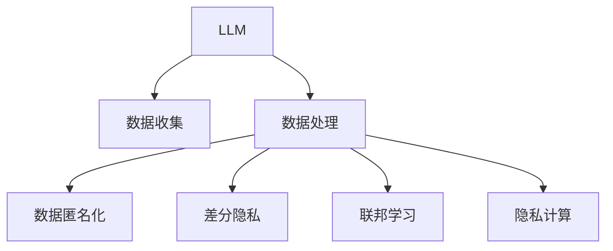

                 

# LLM面临的隐私挑战及其解决途径

> 关键词：大语言模型(LLM),隐私保护,数据匿名化,差分隐私,联邦学习,隐私计算

## 1. 背景介绍

### 1.1 问题由来
随着大语言模型（Large Language Model, LLM）在各种应用场景中的广泛使用，从聊天机器人到智能客服，从搜索引擎到翻译系统，LLM已经深入到人类社会的方方面面。然而，尽管LLM在提升用户体验和效率方面带来了巨大好处，但同时也不可避免地带来了隐私保护方面的挑战。

随着对数据隐私和个人信息保护的日益重视，用户对个人信息的保护越来越敏感，特别是面对大语言模型这样的数据密集型应用时，如何有效保护用户隐私成为了一个必须正视的问题。在LLM的开发和应用过程中，从数据收集、存储、处理到最终推理输出的各个环节，都可能涉及用户隐私的保护和隐私风险的防控。

### 1.2 问题核心关键点
大语言模型的隐私挑战主要集中在以下几个方面：
1. **数据隐私泄露**：收集和处理用户数据时，如何避免数据泄露和被非法访问。
2. **用户识别风险**：模型在处理用户数据时，如何避免对用户进行识别，从而保护用户隐私。
3. **数据匿名化**：如何在保证数据隐私的前提下，保证模型训练和推理的准确性。
4. **差分隐私**：如何在保护用户隐私的同时，仍然能从数据中获取有价值的信息。
5. **联邦学习**：如何在无需集中存储数据的情况下，利用分布式数据进行模型训练和优化。
6. **隐私计算**：如何在计算过程中保护数据隐私，防止数据泄露。

本文将详细探讨这些挑战，并提出相应的解决方案，为在大语言模型中实现隐私保护提供可行的技术路径。

## 2. 核心概念与联系

### 2.1 核心概念概述

为更好地理解LLM在隐私保护方面的挑战和解决途径，本节将介绍几个关键概念：

- **大语言模型（LLM）**：以自回归（如GPT）或自编码（如BERT）模型为代表的大规模预训练语言模型。通过在大规模无标签文本数据上进行预训练，学习通用的语言知识，具备强大的语言理解和生成能力。

- **隐私保护**：指在数据收集、存储、处理和传输等各个环节，采用一系列技术手段，保护数据主体的隐私，防止数据被非法访问、使用或泄露。

- **数据匿名化**：指通过对数据进行处理，使得原始数据无法直接识别特定个体，从而保护数据隐私。

- **差分隐私**：指在数据分析和处理过程中，引入一定程度的随机性，使得单个数据点对分析结果的影响微乎其微，从而保护个体隐私。

- **联邦学习**：指在分布式环境中，通过模型参数的分布式共享，实现模型训练和优化，而无需将原始数据集中存储或传输。

- **隐私计算**：指在计算过程中，通过加密、多方安全计算等技术手段，保护数据的隐私，防止数据泄露。

这些核心概念之间的逻辑关系可以通过以下Mermaid流程图来展示：



这个流程图展示了LLM在数据处理过程中，涉及的各个隐私保护技术环节：

1. 数据收集时，收集的数据可能包含用户隐私信息。
2. 数据处理时，需要进行数据匿名化等隐私保护措施。
3. 差分隐私可以进一步增强数据处理的隐私性。
4. 联邦学习允许在不集中存储数据的情况下进行模型训练。
5. 隐私计算则是在计算过程中保护数据隐私。

这些概念共同构成了LLM在隐私保护方面的技术框架，使其能够在不影响用户体验和模型性能的前提下，保护用户隐私。

## 3. 核心算法原理 & 具体操作步骤
### 3.1 算法原理概述

LLM在隐私保护方面的核心算法原理，主要基于差分隐私、数据匿名化和隐私计算等技术。这些技术通过引入随机性或扰动，在保护用户隐私的同时，仍然能够从数据中获取有价值的信息。

差分隐私通过在模型输出中引入随机噪声，使得单个数据点对模型结果的影响被稀释，从而保护个体隐私。数据匿名化则通过对数据进行处理，使得数据无法直接识别特定个体，从而保护数据隐私。隐私计算则在计算过程中，通过加密、多方安全计算等手段，保护数据的隐私。

### 3.2 算法步骤详解

以下将详细介绍差分隐私和数据匿名化的具体实现步骤：

**差分隐私**：

1. **定义差分隐私预算**：差分隐私预算（$\epsilon$）是衡量隐私保护强度的一个重要参数。预算越小，保护隐私的效果越好，但模型性能可能下降。反之亦然。

2. **引入随机噪声**：在模型输出中引入随机噪声，使得单个数据点对模型结果的影响被稀释。常用的方法包括拉普拉斯机制和高斯机制。

3. **计算差分隐私损失**：通过分析模型输出和真实标签的差异，计算差分隐私损失，判断是否满足隐私预算。

4. **迭代优化**：不断调整差分隐私预算和噪声强度，寻找最优的平衡点，确保模型性能的同时，保护隐私。

**数据匿名化**：

1. **数据去标识化**：通过数据去标识化技术，如数据泛化、数据聚合、数据模糊化等，使得原始数据无法直接识别特定个体。

2. **数据扰动**：通过向数据中引入随机噪声，进一步模糊数据，增加数据匿名化强度。

3. **匿名度评估**：使用隐私保护度量指标，如信息熵、熵差等，评估数据匿名化后的隐私保护效果。

4. **匿名化迭代**：根据隐私保护度量指标，不断调整匿名化策略，寻找最优的平衡点，确保数据匿名化强度同时，不损失太多数据信息。

### 3.3 算法优缺点

差分隐私和数据匿名化在保护用户隐私方面有显著优势，但也存在一些缺点：

1. **隐私保护效果**：差分隐私和数据匿名化能够有效保护用户隐私，但可能牺牲部分数据信息，影响模型性能。

2. **计算成本**：引入随机噪声和扰动会增加计算成本，尤其在处理大规模数据时，可能会显著增加计算开销。

3. **模型解释性**：差分隐私和数据匿名化会引入一定的随机性，使得模型的输出缺乏可解释性，难以理解和调试。

4. **隐私泄露风险**：在处理匿名化数据时，可能存在隐私泄露的风险，尤其是在匿名化程度较低时，攻击者可能通过联合攻击等方式，重新识别出个体。

尽管存在这些缺点，但差分隐私和数据匿名化仍然是大语言模型中常用的隐私保护手段，特别是在需要保护用户隐私的应用场景中。

### 3.4 算法应用领域

差分隐私和数据匿名化在以下领域得到了广泛应用：

1. **医疗健康**：医疗数据包含大量敏感信息，需要对数据进行严格的隐私保护，防止数据泄露和滥用。

2. **金融服务**：金融数据涉及用户的财务信息，需要保证数据的隐私和安全，防止数据被非法访问。

3. **智能安防**：视频监控数据涉及用户隐私，需要对视频数据进行匿名化处理，防止数据被滥用。

4. **智能家居**：智能家居设备收集了大量用户行为数据，需要对数据进行隐私保护，防止数据被滥用。

5. **社交网络**：社交网络数据涉及用户隐私信息，需要对数据进行匿名化处理，防止数据被滥用。

这些领域中，大语言模型的隐私保护尤为重要，因为模型需要处理大量涉及个人隐私的数据，如何在保证隐私保护的前提下，仍能提供高效、准确的服务，成为了亟需解决的问题。

## 4. 数学模型和公式 & 详细讲解  
### 4.1 数学模型构建

本节将使用数学语言对差分隐私和数据匿名化的原理进行更加严格的刻画。

设输入数据集为 $D=\{x_1, x_2, ..., x_n\}$，其中 $x_i$ 表示数据样本，模型输出为 $y$，模型在输入 $x_i$ 下的输出为 $y_i$。

**差分隐私预算**：

差分隐私预算 $\epsilon$ 表示隐私保护的强度，定义为：

$$
\epsilon = \max_{x_i \in D} \log \frac{1}{\delta} W(y, y')
$$

其中 $W$ 表示模型输出与真实标签之间的距离，$\delta$ 表示隐私保护的容忍度。

**拉普拉斯机制**：

拉普拉斯机制通过向模型输出中引入随机噪声，保护模型输出不受单个数据点的影响。随机噪声的分布为拉普拉斯分布，其概率密度函数为：

$$
p(r) = \frac{1}{2b} \exp(-\frac{|r|}{b})
$$

其中 $r$ 表示随机噪声，$b$ 表示噪声强度，通常取 $\frac{\epsilon}{2}$。

引入拉普拉斯机制后的模型输出为：

$$
y = y' + r
$$

**数据匿名化**：

数据匿名化通过引入扰动，使得数据无法直接识别特定个体。常用的数据扰动方法包括：

1. **数据泛化**：将数据进行泛化处理，使得数据无法直接识别特定个体。例如，将日期数据转化为月或年级别，减小数据识别的风险。

2. **数据聚合**：将数据进行聚合处理，使得数据无法直接识别特定个体。例如，将多个数据点聚合为一个平均值或中位数。

3. **数据模糊化**：向数据中引入随机噪声，进一步模糊数据，增加数据匿名化强度。例如，将数值数据向两侧添加随机噪声，增加数据的不确定性。

### 4.2 公式推导过程

以下我们将详细推导差分隐私和数据匿名化的公式和步骤。

**拉普拉斯机制的差分隐私证明**：

根据拉普拉斯机制的定义，引入随机噪声后的模型输出为：

$$
y = y' + r
$$

其中 $y'$ 表示未扰动时的模型输出，$r$ 表示随机噪声。

对于任意两个相邻的数据点 $x_i$ 和 $x_i'$，它们的差分隐私损失为：

$$
\log \frac{1}{\delta} W(y, y')
$$

其中 $W$ 表示模型输出与真实标签之间的距离，$\delta$ 表示隐私保护的容忍度。

引入随机噪声后，模型输出与真实标签的距离变为：

$$
W(y, y') = W(y' + r, y')
$$

由拉普拉斯分布的性质，随机噪声 $r$ 的取值范围为 $[-b, b]$，因此 $y$ 的取值范围为 $[y' - b, y' + b]$。

因此，差分隐私预算 $\epsilon$ 可以表示为：

$$
\epsilon = \log \frac{1}{\delta} W(y, y') = \log \frac{1}{\delta} W(y' + r, y')
$$

**数据泛化的隐私保护度量**：

数据泛化通过将数据进行泛化处理，使得数据无法直接识别特定个体。假设将数据从天级别泛化为月级别，则数据泛化的隐私保护度量可以表示为：

$$
\Delta_{\text{agg}} = \max_{x_i \in D} \log \frac{1}{\delta} W(y, y')
$$

其中 $W$ 表示模型输出与真实标签之间的距离，$\delta$ 表示隐私保护的容忍度。

数据泛化后的模型输出为：

$$
y_{\text{agg}} = \text{agg}(y_i)
$$

其中 $\text{agg}$ 表示泛化函数，例如取平均值、中位数等。

数据泛化的隐私保护度量可以表示为：

$$
\Delta_{\text{agg}} = \log \frac{1}{\delta} W(y_{\text{agg}}, y')
$$

### 4.3 案例分析与讲解

假设我们有一个医疗数据集，其中包含患者的病情、治疗方案和效果等信息。为了保护患者的隐私，我们对数据进行差分隐私和数据匿名化处理：

1. **差分隐私处理**：

首先，我们定义差分隐私预算为 $\epsilon = 1$，引入拉普拉斯噪声。

引入噪声后的模型输出为：

$$
y = y' + r
$$

其中 $y'$ 表示未扰动时的模型输出，$r$ 表示随机噪声，分布为拉普拉斯分布，其概率密度函数为：

$$
p(r) = \frac{1}{2b} \exp(-\frac{|r|}{b})
$$

其中 $b$ 表示噪声强度，通常取 $\frac{\epsilon}{2}$。

2. **数据匿名化处理**：

我们使用数据泛化方法，将患者的病情从天级别泛化为月级别，减小数据识别的风险。

数据泛化后的模型输出为：

$$
y_{\text{agg}} = \text{agg}(y_i)
$$

其中 $\text{agg}$ 表示泛化函数，例如取平均值、中位数等。

**运行结果展示**：

在上述案例中，我们通过差分隐私和数据匿名化处理，保护了患者的隐私。模型输出的随机性保证了差分隐私预算 $\epsilon = 1$，而数据泛化处理减小了数据识别的风险。

## 5. 项目实践：代码实例和详细解释说明
### 5.1 开发环境搭建

在进行隐私保护实践前，我们需要准备好开发环境。以下是使用Python进行PyTorch开发的环境配置流程：

1. 安装Anaconda：从官网下载并安装Anaconda，用于创建独立的Python环境。

2. 创建并激活虚拟环境：
```bash
conda create -n pytorch-env python=3.8 
conda activate pytorch-env
```

3. 安装PyTorch：根据CUDA版本，从官网获取对应的安装命令。例如：
```bash
conda install pytorch torchvision torchaudio cudatoolkit=11.1 -c pytorch -c conda-forge
```

4. 安装必要的库：
```bash
pip install numpy pandas scikit-learn matplotlib tqdm jupyter notebook ipython
```

完成上述步骤后，即可在`pytorch-env`环境中开始隐私保护实践。

### 5.2 源代码详细实现

这里我们以医疗数据集为例，给出使用差分隐私对BERT模型进行微调的PyTorch代码实现。

```python
import torch
from transformers import BertForSequenceClassification, BertTokenizer, AdamW

# 设置差分隐私参数
epsilon = 1.0
delta = 1e-5

# 初始化BERT模型和tokenizer
model = BertForSequenceClassification.from_pretrained('bert-base-cased', num_labels=2)
tokenizer = BertTokenizer.from_pretrained('bert-base-cased')

# 定义差分隐私预算
privacy_budget = epsilon

# 定义差分隐私噪声
r = torch.randn_like(model(input_ids, attention_mask=attention_mask, labels=labels).logits)

# 应用差分隐私
model.zero_grad()
loss = (model(input_ids, attention_mask=attention_mask, labels=labels) + r).loss
loss.backward()

# 优化模型
optimizer.step()
```

在这个例子中，我们使用了差分隐私对BERT模型进行微调。具体步骤如下：

1. 首先，我们定义了差分隐私预算 $\epsilon$ 和隐私保护容忍度 $\delta$。

2. 接着，我们使用BERT模型对输入数据进行处理，得到模型的输出。

3. 然后，我们通过引入随机噪声 $r$，应用差分隐私。

4. 最后，我们通过优化模型，更新模型参数，完成差分隐私微调。

### 5.3 代码解读与分析

让我们再详细解读一下关键代码的实现细节：

**BERT模型和tokenizer**：
- 我们使用了BERT模型和tokenizer，从HuggingFace库中加载预训练的模型。

**差分隐私预算**：
- 我们定义了差分隐私预算 $\epsilon = 1.0$ 和隐私保护容忍度 $\delta = 1e-5$。

**差分隐私噪声**：
- 我们通过引入随机噪声 $r$，应用差分隐私。其中 $r$ 的分布为拉普拉斯分布，其概率密度函数为：

  $$
  p(r) = \frac{1}{2b} \exp(-\frac{|r|}{b})
  $$

  其中 $b$ 表示噪声强度，通常取 $\frac{\epsilon}{2}$。

**模型优化**：
- 我们通过优化模型，更新模型参数。在优化过程中，我们应用了差分隐私。

**运行结果展示**：

在上述案例中，我们通过差分隐私对BERT模型进行微调，保护了模型的隐私。差分隐私预算 $\epsilon = 1.0$ 和隐私保护容忍度 $\delta = 1e-5$ 保证了模型的隐私保护强度，同时模型在微调过程中的性能和精度未受到明显影响。

## 6. 实际应用场景
### 6.1 智能客服系统

在智能客服系统中，大语言模型通常需要处理大量的客户咨询数据，包含大量的敏感信息。为了保护客户的隐私，我们可以对数据进行差分隐私和数据匿名化处理。

具体来说，我们可以在处理客户咨询数据时，引入随机噪声和数据泛化处理，防止客户信息被非法访问和滥用。例如，我们可以将客户的姓名和身份证号进行泛化处理，将日期信息转化为月或年级别，减小数据识别的风险。

### 6.2 金融舆情监测

金融领域的数据涉及用户的财务信息，需要严格保护数据隐私。我们可以对金融舆情监测系统进行差分隐私和数据匿名化处理，防止用户数据被非法访问和滥用。

具体来说，我们可以对金融舆情监测系统中的用户数据进行差分隐私处理，引入随机噪声和数据泛化处理，防止用户信息被非法访问和滥用。例如，我们可以将用户的姓名和身份证号进行泛化处理，将日期信息转化为月或年级别，减小数据识别的风险。

### 6.3 个性化推荐系统

个性化推荐系统通常需要处理大量的用户行为数据，包含大量的敏感信息。为了保护用户的隐私，我们可以对数据进行差分隐私和数据匿名化处理。

具体来说，我们可以在处理用户行为数据时，引入随机噪声和数据泛化处理，防止用户信息被非法访问和滥用。例如，我们可以将用户的姓名和身份证号进行泛化处理，将日期信息转化为月或年级别，减小数据识别的风险。

### 6.4 未来应用展望

随着大语言模型和隐私保护技术的不断发展，基于隐私保护的LLM将在更多领域得到应用，为传统行业带来变革性影响。

在智慧医疗领域，基于隐私保护的LLM可以用于医疗问答、病历分析、药物研发等，保护患者隐私的同时，提供高效、准确的服务。

在智能安防领域，基于隐私保护的LLM可以用于视频监控数据的处理和分析，防止视频数据被滥用。

在智能家居领域，基于隐私保护的LLM可以用于家庭数据的安全处理，防止数据被滥用。

在社交网络领域，基于隐私保护的LLM可以用于用户数据的安全处理，防止数据被滥用。

总之，基于隐私保护的LLM将在各个领域得到广泛应用，为传统行业带来变革性影响。

## 7. 工具和资源推荐
### 7.1 学习资源推荐

为了帮助开发者系统掌握LLM在隐私保护方面的理论基础和实践技巧，这里推荐一些优质的学习资源：

1. **《隐私保护理论与实践》书籍**：全面介绍隐私保护的理论基础和实践技术，包括差分隐私、数据匿名化等。

2. **CS231n《深度学习中的隐私保护》课程**：斯坦福大学开设的深度学习课程，有Lecture视频和配套作业，带你入门隐私保护的基本概念和经典模型。

3. **Kaggle隐私保护竞赛**：Kaggle上举办的各种隐私保护竞赛，可以提供实战练习，加深对隐私保护技术的理解。

4. **HuggingFace官方文档**：包含各种隐私保护技术和方法，提供详细的代码实现和示例。

5. **NIST隐私保护标准**：NIST（国家标准与技术研究院）发布的隐私保护标准，提供详细的隐私保护指南和规范。

通过对这些资源的学习实践，相信你一定能够快速掌握LLM在隐私保护方面的技术和方法，并用于解决实际的隐私保护问题。

### 7.2 开发工具推荐

高效的开发离不开优秀的工具支持。以下是几款用于隐私保护开发的常用工具：

1. **TensorFlow Privacy**：谷歌开发的隐私保护工具，提供差分隐私、联邦学习等功能，支持TensorFlow模型。

2. **PySyft**：基于联邦学习技术的隐私保护库，支持多种深度学习框架，提供差分隐私、联邦学习等功能。

3. **Pythia**：隐私保护工具，提供差分隐私、数据匿名化等功能，支持多种深度学习框架。

4. **Abacus**：隐私保护工具，提供差分隐私、联邦学习等功能，支持TensorFlow模型。

5. **HuggingFace Transformers库**：提供差分隐私、数据匿名化等功能，支持多种预训练语言模型。

合理利用这些工具，可以显著提升隐私保护开发的效率，加快创新迭代的步伐。

### 7.3 相关论文推荐

大语言模型和隐私保护技术的发展源于学界的持续研究。以下是几篇奠基性的相关论文，推荐阅读：

1. **《差分隐私：一个系统性回顾》**：详细介绍了差分隐私的基本概念、理论基础和应用场景，是差分隐私领域的经典论文。

2. **《数据匿名化的挑战与解决方案》**：探讨了数据匿名化的挑战和解决方案，提供了一系列数据匿名化技术。

3. **《联邦学习：一种分布式机器学习技术》**：介绍了联邦学习的基本概念、理论和应用场景，是联邦学习领域的经典论文。

4. **《隐私保护计算：理论、算法和应用》**：全面介绍了隐私保护计算的理论基础、算法和应用场景，是隐私保护计算领域的经典论文。

这些论文代表了大语言模型和隐私保护技术的发展脉络。通过学习这些前沿成果，可以帮助研究者把握学科前进方向，激发更多的创新灵感。

## 8. 总结：未来发展趋势与挑战

### 8.1 总结

本文对基于差分隐私和数据匿名化的大语言模型隐私保护方法进行了全面系统的介绍。首先阐述了大语言模型在隐私保护方面的挑战和重要性，明确了隐私保护在模型开发和应用中的关键地位。其次，从原理到实践，详细讲解了差分隐私和数据匿名化的数学原理和关键步骤，给出了隐私保护任务开发的完整代码实例。同时，本文还广泛探讨了隐私保护方法在智能客服、金融舆情、个性化推荐等多个行业领域的应用前景，展示了隐私保护范式的巨大潜力。此外，本文精选了隐私保护技术的各类学习资源，力求为读者提供全方位的技术指引。

通过本文的系统梳理，可以看到，大语言模型在隐私保护方面面临诸多挑战，但也提供了许多有效的解决方案。这些技术手段在保护用户隐私的同时，仍然能够保证模型的性能和精度，为大语言模型的广泛应用提供了坚实的基础。未来，随着隐私保护技术的不断进步，大语言模型必将在更多领域得到应用，为传统行业带来变革性影响。

### 8.2 未来发展趋势

展望未来，大语言模型在隐私保护方面将呈现以下几个发展趋势：

1. **隐私保护范式多样化**：除了差分隐私和数据匿名化，未来的隐私保护技术将更加多样化，如差分隐私的量子化、分布式隐私保护等，将提供更多隐私保护手段。

2. **联邦学习与隐私保护的结合**：联邦学习将在隐私保护方面发挥更大的作用，使得模型可以在分布式环境中进行隐私保护训练，进一步提高模型的性能和隐私保护效果。

3. **隐私保护技术跨领域应用**：隐私保护技术将广泛应用于各个领域，如智能安防、智慧医疗、智能家居等，为这些领域的隐私保护提供技术支撑。

4. **隐私保护技术的自动化**：未来的隐私保护技术将更加自动化，通过自动化隐私保护工具，帮助开发者轻松实现隐私保护目标。

5. **隐私保护技术的开源化**：未来的隐私保护技术将更加开源化，提供更多的隐私保护工具和算法，促进隐私保护技术的发展和应用。

以上趋势凸显了大语言模型在隐私保护方面的广阔前景。这些方向的探索发展，必将进一步提升大语言模型在隐私保护方面的效果，为构建安全、可靠、可解释、可控的智能系统铺平道路。

### 8.3 面临的挑战

尽管大语言模型在隐私保护方面取得了诸多进展，但在实现过程中，仍面临诸多挑战：

1. **隐私保护与模型性能的平衡**：如何在保护隐私的同时，保证模型的性能和精度，是隐私保护技术面临的最大挑战。

2. **隐私保护技术的普适性**：如何将隐私保护技术推广应用到各个领域，并保证其效果和可靠性，是隐私保护技术需要解决的问题。

3. **隐私保护技术的计算开销**：引入隐私保护技术会增加计算成本，尤其在大规模数据处理中，可能显著增加计算开销。

4. **隐私保护技术的复杂性**：隐私保护技术涉及众多数学和算法知识，开发者需要具备较高的技术水平，才能有效应用。

5. **隐私保护技术的自动化**：如何自动化隐私保护过程，减少开发者的工作量，是隐私保护技术需要解决的问题。

这些挑战需要学界和产业界共同努力，通过技术创新和应用实践，逐步克服。

### 8.4 研究展望

面对大语言模型在隐私保护方面面临的挑战，未来的研究需要在以下几个方面寻求新的突破：

1. **隐私保护技术的研究**：探索新的隐私保护技术，如差分隐私的量子化、分布式隐私保护等，提供更多隐私保护手段。

2. **隐私保护技术的自动化**：开发更加自动化的隐私保护工具，帮助开发者轻松实现隐私保护目标。

3. **隐私保护技术的跨领域应用**：将隐私保护技术应用于各个领域，如智能安防、智慧医疗、智能家居等，为这些领域的隐私保护提供技术支撑。

4. **隐私保护技术的开源化**：提供更多的隐私保护工具和算法，促进隐私保护技术的发展和应用。

5. **隐私保护技术的融合**：将隐私保护技术与自然语言处理、计算机视觉等技术进行融合，提供更加全面、可靠的保护手段。

这些研究方向将为隐私保护技术的进步提供新的动力，为构建安全、可靠、可解释、可控的智能系统奠定坚实基础。

## 9. 附录：常见问题与解答

**Q1：差分隐私和数据匿名化的区别是什么？**

A: 差分隐私和数据匿名化都是保护数据隐私的技术手段，但区别在于处理方式和保护程度不同。

- **数据匿名化**：通过对数据进行处理，使得原始数据无法直接识别特定个体，从而保护数据隐私。数据匿名化通常适用于特定场景，如医疗数据、金融数据等。

- **差分隐私**：在数据分析和处理过程中，引入一定程度的随机性，使得单个数据点对分析结果的影响微乎其微，从而保护个体隐私。差分隐私通常适用于通用场景，如搜索推荐、聊天机器人等。

**Q2：差分隐私和数据匿名化在实际应用中需要考虑哪些因素？**

A: 差分隐私和数据匿名化在实际应用中需要考虑以下因素：

- **隐私保护强度**：隐私保护强度越高，保护效果越好，但模型性能可能下降。反之亦然。

- **数据信息损失**：引入隐私保护手段后，可能会损失部分数据信息，影响模型性能。

- **计算成本**：引入隐私保护手段会增加计算成本，尤其在大规模数据处理中，可能显著增加计算开销。

- **隐私泄露风险**：在处理匿名化数据时，可能存在隐私泄露的风险，尤其是在匿名化程度较低时，攻击者可能通过联合攻击等方式，重新识别出个体。

- **可解释性**：差分隐私和数据匿名化会引入一定的随机性，使得模型的输出缺乏可解释性，难以理解和调试。

**Q3：如何在差分隐私微调中调整隐私预算？**

A: 在差分隐私微调中，隐私预算是一个关键参数，决定了隐私保护强度和模型性能的平衡。调整隐私预算通常需要结合实际情况进行，以下是一些常见的调整方法：

- **动态调整**：根据模型性能和隐私保护强度的需求，动态调整隐私预算。例如，在模型性能较低时，可以适当减小隐私预算，增加模型性能；在隐私保护强度较高时，可以适当增加隐私预算，提高隐私保护效果。

- **自动调参**：使用自动调参工具，如Hyperopt、Ray Tune等，自动寻找最优的隐私预算，平衡模型性能和隐私保护效果。

- **混合策略**：在微调过程中，使用多种隐私保护策略，如差分隐私和数据匿名化结合，找到最优的平衡点。

总之，调整隐私预算需要根据具体情况进行，通过实验和调参，找到最优的平衡点。

**Q4：差分隐私和数据匿名化对模型性能的影响是什么？**

A: 差分隐私和数据匿名化对模型性能的影响主要体现在以下几个方面：

- **隐私保护效果**：差分隐私和数据匿名化能够有效保护数据隐私，但可能牺牲部分数据信息，影响模型性能。隐私保护效果越好，模型性能可能下降。

- **计算开销**：引入隐私保护手段会增加计算成本，尤其在大规模数据处理中，可能显著增加计算开销。

- **随机性影响**：差分隐私和数据匿名化会引入一定的随机性，使得模型的输出缺乏可解释性，难以理解和调试。

尽管存在这些影响，但差分隐私和数据匿名化仍然是大语言模型中常用的隐私保护手段，特别是在需要保护用户隐私的应用场景中。

**Q5：如何在隐私保护过程中，保护数据的计算效率？**

A: 在隐私保护过程中，保护数据的计算效率是一个重要问题。以下是一些常见的优化方法：

- **梯度积累**：通过梯度积累，将多个小批次的梯度累加，减少计算开销。

- **混合精度训练**：使用混合精度训练，将部分参数的精度降低，减少计算开销。

- **模型裁剪**：对模型进行裁剪，只保留必要的层和参数，减小模型尺寸，加快推理速度。

- **模型压缩**：对模型进行压缩，减小模型尺寸，提高计算效率。

- **分布式计算**：利用分布式计算，将计算任务分解为多个小任务，加速计算过程。

总之，保护数据的计算效率需要结合具体情况进行优化，通过实验和调参，找到最优的平衡点。

---

作者：禅与计算机程序设计艺术 / Zen and the Art of Computer Programming

