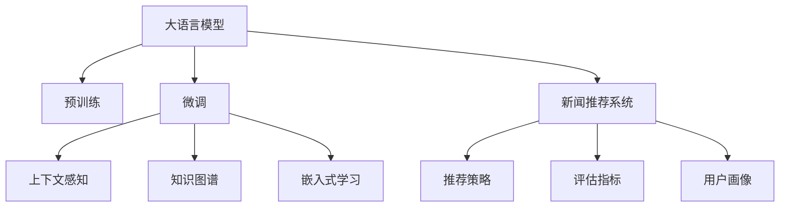

                 

# LLM驱动的个性化新闻推荐系统

## 1. 背景介绍

随着移动互联网和信息技术的飞速发展，新闻推荐系统成为了信息获取的重要方式之一。传统基于规则或协同过滤的新闻推荐系统，存在推荐效果单一、用户交互次数有限的缺点。而基于用户-文章特征协同的机器学习推荐模型，也存在冷启动用户难、数据稀疏性问题。近年来，深度学习和大语言模型(LLM)技术，在新闻推荐系统中开始得到广泛应用，逐渐成为新一代推荐引擎的核心。

特别是大语言模型，通过在大规模无标签文本数据上预训练，学习到了丰富的语言知识和语义信息。这使得大语言模型能够精准理解和处理自然语言，支持新闻推荐系统快速响应和处理用户输入，实现个性化新闻的精准推送。

本文将介绍如何使用大语言模型驱动的新闻推荐系统，包括推荐模型的构建、训练、微调及实际应用场景，旨在帮助读者深入理解LLM在推荐系统中的应用，并提升推荐系统的性能和效果。

## 2. 核心概念与联系

### 2.1 核心概念概述

为更好地理解LLM驱动的个性化新闻推荐系统，本节将介绍几个密切相关的核心概念：

- 大语言模型(Large Language Model, LLM)：以自回归(如GPT)或自编码(如BERT)模型为代表的大规模预训练语言模型。通过在大规模无标签文本语料上进行预训练，学习通用的语言表示，具备强大的语言理解和生成能力。

- 新闻推荐系统(News Recommendation System)：通过分析用户的历史阅读行为和偏好，实时推荐可能感兴趣的新闻。常见的推荐策略包括协同过滤、内容匹配等，目标是通过精准理解用户需求，实现高效、个性化的信息推送。

- 上下文感知(Context-Aware)：在推荐过程中，模型能够根据当前用户行为、上下文环境等综合因素，做出更准确的推荐决策。

- 知识图谱(Knowledge Graph)：一种以实体为节点，关系为边，构成网络结构的数据模型，可以融合外部结构化知识，提升推荐系统的深度和广度。

- 嵌入式学习(Embedding Learning)：将新闻和用户特征通过Embedding映射到低维空间，以便计算和相似度匹配。

- 推荐系统评估指标(Recommendation System Evaluation Metrics)：如点击率(CTR)、召回率(RR)、准确率(Accuracy)等，用于衡量推荐模型性能。

- 用户画像(User Persona)：根据用户行为、兴趣、属性等信息，构建用户特征模型，为推荐系统提供个性化的依据。

这些核心概念之间的逻辑关系可以通过以下Mermaid流程图来展示：



这个流程图展示了大语言模型的新闻推荐系统核心概念及其之间的关系：

1. 大语言模型通过预训练获得基础能力。
2. 微调在大规模有标签数据上进行，提升模型对特定任务的适应能力。
3. 微调后的模型采用上下文感知和知识图谱，增强推荐决策的深度和广度。
4. 嵌入式学习将新闻和用户特征映射到低维空间，便于计算和相似度匹配。
5. 新闻推荐系统通过融合上述技术，实现精准推荐。
6. 评估指标和用户画像用于评估和优化推荐系统的性能和用户体验。

这些核心概念共同构成了LLM驱动的个性化新闻推荐系统的理论框架，为其应用提供了坚实的支撑。

## 3. 核心算法原理 & 具体操作步骤
### 3.1 算法原理概述

基于大语言模型的新闻推荐系统，本质上是一个深度学习驱动的协同过滤模型。其核心思想是：利用大语言模型的语义理解能力，对新闻进行嵌入式表示，并根据用户画像和上下文环境，实现精准推荐。

形式化地，假设用户集合为 $U$，新闻集合为 $N$，用户对新闻的交互行为表示为 $I_{ui} \in \{1,0\}$，其中 $u \in U$，$i \in N$。新闻的嵌入式表示为 $\mathbf{e}_i \in \mathbb{R}^d$，用户的嵌入式表示为 $\mathbf{p}_u \in \mathbb{R}^d$。则新闻推荐系统优化目标为：

$$
\max_{\mathbf{p}_u} \sum_{i \in N} p_{ui} \cdot I_{ui}
$$

其中 $p_{ui}$ 为新闻 $i$ 对用户 $u$ 的推荐概率。该目标可以分解为两个子目标：

- 嵌入式表示学习：通过大语言模型学习新闻和用户的语义表示。
- 协同过滤推荐：基于嵌入式表示，进行协同过滤推荐。

### 3.2 算法步骤详解

基于大语言模型的新闻推荐系统一般包括以下几个关键步骤：

**Step 1: 准备预训练模型和数据集**
- 选择合适的预训练语言模型 $M_{\theta}$ 作为初始化参数，如 BERT、GPT 等。
- 准备新闻推荐系统的训练数据集 $D=\{(x_i,y_i)\}_{i=1}^N$，其中 $x_i$ 为新闻文本，$y_i \in \{1,0\}$ 为新闻是否被用户点击过。

**Step 2: 设计任务适配层**
- 根据新闻推荐系统的具体需求，设计适当的任务适配层。例如，对于新闻点击预测任务，可以添加线性分类器和交叉熵损失函数。

**Step 3: 添加用户画像和上下文信息**
- 在用户嵌入 $\mathbf{p}_u$ 和新闻嵌入 $\mathbf{e}_i$ 的计算中，添加用户画像和上下文特征，如用户兴趣、时间、地点等。

**Step 4: 训练嵌入式表示**
- 将用户-新闻对 $(x_i,y_i)$ 作为训练样本，通过嵌入式学习，将用户和新闻映射到低维空间。

**Step 5: 协同过滤推荐**
- 使用嵌入式表示和用户画像，计算用户对新闻的推荐概率。
- 采用排序算法将推荐新闻按照概率排序，实时推送给用户。

**Step 6: 模型微调和评估**
- 在实时推荐过程中，收集用户反馈数据，通过微调不断优化嵌入式表示和学习参数。
- 使用点击率、召回率、精确率等指标评估模型效果，并根据评估结果进行模型迭代和优化。

### 3.3 算法优缺点

基于大语言模型的新闻推荐系统具有以下优点：

1. 语义理解能力强。大语言模型能够精准理解和处理自然语言，对新闻内容进行精确建模。
2. 嵌入式表示高效。将新闻和用户特征通过Embedding映射到低维空间，便于计算和相似度匹配。
3. 上下文感知强。结合用户画像和上下文信息，推荐决策更加个性化、精准。
4. 适应性强。可以灵活融合外部知识图谱，提升推荐系统的深度和广度。
5. 可解释性好。嵌入式表示具有较高的可解释性，便于分析和调试推荐过程。

同时，该方法也存在一定的局限性：

1. 数据需求高。需要大规模的新闻和用户数据，以及高质量的用户画像，数据获取和标注成本高。
2. 计算复杂。预训练大模型参数量庞大，推荐过程需要较高计算资源。
3. 冷启动问题。新用户或新新闻缺乏足够的历史行为数据，难以获得精准推荐。
4. 数据隐私。用户隐私保护和数据安全问题，需要严格的数据管理和加密措施。

尽管存在这些局限性，但就目前而言，基于大语言模型的推荐系统方法仍是最主流范式。未来相关研究的重点在于如何进一步降低推荐系统的数据需求，提高模型的冷启动性能和数据隐私保护能力，同时兼顾计算效率和可解释性等因素。

### 3.4 算法应用领域

基于大语言模型的新闻推荐系统，在新闻媒体、社交网络、在线阅读平台等诸多领域，已经得到了广泛的应用。例如：

- 新闻媒体平台：如人民日报、新华网等，利用推荐系统精准推送用户感兴趣的新闻内容，提升用户留存和点击率。
- 社交网络平台：如微博、微信、抖音等，利用推荐系统发现和推荐热点话题、热门内容，增加用户互动和粘性。
- 在线阅读平台：如知乎、豆瓣阅读、Kindle等，利用推荐系统推荐书籍、文章、讲座等，提升用户阅读体验。

除了上述这些经典应用外，大语言模型推荐系统也被创新性地应用到更多场景中，如个性化视频推荐、电子商务商品推荐、智能搜索等，为信息获取和消费提供新的路径。随着预训练模型和推荐方法的不断进步，相信大语言模型推荐系统将在更广阔的应用领域大放异彩。

## 4. 数学模型和公式 & 详细讲解
### 4.1 数学模型构建

本节将使用数学语言对基于大语言模型的新闻推荐系统进行更加严格的刻画。

记用户集合为 $U$，新闻集合为 $N$，用户对新闻的交互行为表示为 $I_{ui} \in \{1,0\}$，其中 $u \in U$，$i \in N$。假设用户 $u$ 的嵌入式表示为 $\mathbf{p}_u \in \mathbb{R}^d$，新闻 $i$ 的嵌入式表示为 $\mathbf{e}_i \in \mathbb{R}^d$。

新闻推荐系统的优化目标为：

$$
\max_{\mathbf{p}_u} \sum_{i \in N} p_{ui} \cdot I_{ui}
$$

其中 $p_{ui}$ 为新闻 $i$ 对用户 $u$ 的推荐概率。通过嵌入式学习，将新闻和用户表示映射到低维空间：

$$
\mathbf{e}_i = f_{\theta}(x_i)
$$

$$
\mathbf{p}_u = g_{\phi}(u)
$$

其中 $f_{\theta}$ 为嵌入式表示函数，$g_{\phi}$ 为用户画像函数，$\theta$ 和 $\phi$ 为相应模型的参数。

在实际应用中，通常将嵌入式表示函数 $f_{\theta}$ 和用户画像函数 $g_{\phi}$ 设计为多层次神经网络，以提取更深层次的语义信息。

### 4.2 公式推导过程

以下我们以新闻点击预测任务为例，推导嵌入式表示的学习过程和协同过滤推荐的计算方法。

假设用户 $u$ 对新闻 $i$ 的点击概率为 $p_{ui}$，可以表示为：

$$
p_{ui} = \sigma(\mathbf{p}_u \cdot \mathbf{e}_i)
$$

其中 $\sigma$ 为sigmoid函数，用于将概率映射到 $[0,1]$ 区间。

在嵌入式表示学习阶段，利用大语言模型对新闻和用户进行预训练，然后通过微调学习嵌入式表示。具体而言，可以通过以下步骤计算：

1. 利用大语言模型对新闻 $x_i$ 进行预训练，获得新闻的嵌入式表示 $\mathbf{e}_i$。

2. 利用用户画像函数 $g_{\phi}$ 对用户 $u$ 进行表示，得到用户嵌入 $\mathbf{p}_u$。

3. 利用协同过滤公式计算用户对新闻的点击概率：

$$
p_{ui} = \sigma(\mathbf{p}_u \cdot \mathbf{e}_i)
$$

其中 $\sigma$ 为sigmoid函数，用于将概率映射到 $[0,1]$ 区间。

### 4.3 案例分析与讲解

假设一个在线新闻平台，用户 $u$ 对新闻 $i$ 进行了点击，假设用户嵌入 $\mathbf{p}_u$ 和新闻嵌入 $\mathbf{e}_i$ 已知。

首先，利用大语言模型对新闻 $x_i$ 进行预训练，获得新闻的嵌入式表示 $\mathbf{e}_i$。然后，利用用户画像函数 $g_{\phi}$ 对用户 $u$ 进行表示，得到用户嵌入 $\mathbf{p}_u$。最后，利用协同过滤公式计算用户对新闻的点击概率：

$$
p_{ui} = \sigma(\mathbf{p}_u \cdot \mathbf{e}_i)
$$

其中 $\sigma$ 为sigmoid函数，用于将概率映射到 $[0,1]$ 区间。

在实际应用中，需要考虑多种影响因素，如时间、地点、新闻类别等。因此，可以利用LSTM、GRU等序列模型，对新闻序列进行建模，捕捉时序变化特征。同时，可以利用注意力机制，对新闻和用户特征进行加权处理，提升推荐效果。

## 5. 项目实践：代码实例和详细解释说明
### 5.1 开发环境搭建

在进行新闻推荐系统开发前，我们需要准备好开发环境。以下是使用Python进行PyTorch开发的环境配置流程：

1. 安装Anaconda：从官网下载并安装Anaconda，用于创建独立的Python环境。

2. 创建并激活虚拟环境：
```bash
conda create -n pytorch-env python=3.8 
conda activate pytorch-env
```

3. 安装PyTorch：根据CUDA版本，从官网获取对应的安装命令。例如：
```bash
conda install pytorch torchvision torchaudio cudatoolkit=11.1 -c pytorch -c conda-forge
```

4. 安装Transformers库：
```bash
pip install transformers
```

5. 安装各类工具包：
```bash
pip install numpy pandas scikit-learn matplotlib tqdm jupyter notebook ipython
```

完成上述步骤后，即可在`pytorch-env`环境中开始新闻推荐系统的开发实践。

### 5.2 源代码详细实现

下面我们以新闻点击预测任务为例，给出使用Transformers库对BERT模型进行嵌入式表示学习的PyTorch代码实现。

首先，定义新闻推荐系统的数据处理函数：

```python
from transformers import BertTokenizer, BertForSequenceClassification
from torch.utils.data import Dataset, DataLoader
import torch

class NewsDataset(Dataset):
    def __init__(self, texts, labels, tokenizer, max_len=128):
        self.texts = texts
        self.labels = labels
        self.tokenizer = tokenizer
        self.max_len = max_len
        
    def __len__(self):
        return len(self.texts)
    
    def __getitem__(self, item):
        text = self.texts[item]
        label = self.labels[item]
        
        encoding = self.tokenizer(text, return_tensors='pt', max_length=self.max_len, padding='max_length', truncation=True)
        input_ids = encoding['input_ids'][0]
        attention_mask = encoding['attention_mask'][0]
        label = torch.tensor(label, dtype=torch.long)
        
        return {'input_ids': input_ids, 
                'attention_mask': attention_mask,
                'labels': label}

# 加载预训练BERT模型
tokenizer = BertTokenizer.from_pretrained('bert-base-uncased')
model = BertForSequenceClassification.from_pretrained('bert-base-uncased', num_labels=2)
```

然后，定义训练和评估函数：

```python
from torch.utils.data import DataLoader
from tqdm import tqdm
from sklearn.metrics import classification_report

device = torch.device('cuda') if torch.cuda.is_available() else torch.device('cpu')
model.to(device)

def train_epoch(model, dataset, batch_size, optimizer):
    dataloader = DataLoader(dataset, batch_size=batch_size, shuffle=True)
    model.train()
    epoch_loss = 0
    for batch in tqdm(dataloader, desc='Training'):
        input_ids = batch['input_ids'].to(device)
        attention_mask = batch['attention_mask'].to(device)
        labels = batch['labels'].to(device)
        model.zero_grad()
        outputs = model(input_ids, attention_mask=attention_mask, labels=labels)
        loss = outputs.loss
        epoch_loss += loss.item()
        loss.backward()
        optimizer.step()
    return epoch_loss / len(dataloader)

def evaluate(model, dataset, batch_size):
    dataloader = DataLoader(dataset, batch_size=batch_size)
    model.eval()
    preds, labels = [], []
    with torch.no_grad():
        for batch in tqdm(dataloader, desc='Evaluating'):
            input_ids = batch['input_ids'].to(device)
            attention_mask = batch['attention_mask'].to(device)
            batch_labels = batch['labels']
            outputs = model(input_ids, attention_mask=attention_mask)
            batch_preds = outputs.logits.argmax(dim=1).to('cpu').tolist()
            batch_labels = batch_labels.to('cpu').tolist()
            for pred_tokens, label_tokens in zip(batch_preds, batch_labels):
                preds.append(pred_tokens[:len(label_tokens)])
                labels.append(label_tokens)
                
    print(classification_report(labels, preds))
```

最后，启动训练流程并在测试集上评估：

```python
epochs = 5
batch_size = 16

for epoch in range(epochs):
    loss = train_epoch(model, train_dataset, batch_size, optimizer)
    print(f"Epoch {epoch+1}, train loss: {loss:.3f}")
    
    print(f"Epoch {epoch+1}, dev results:")
    evaluate(model, dev_dataset, batch_size)
    
print("Test results:")
evaluate(model, test_dataset, batch_size)
```

以上就是使用PyTorch对BERT进行嵌入式表示学习的完整代码实现。可以看到，得益于Transformers库的强大封装，我们可以用相对简洁的代码完成BERT模型的加载和嵌入式表示学习。

### 5.3 代码解读与分析

让我们再详细解读一下关键代码的实现细节：

**NewsDataset类**：
- `__init__`方法：初始化文本、标签、分词器等关键组件。
- `__len__`方法：返回数据集的样本数量。
- `__getitem__`方法：对单个样本进行处理，将文本输入编码为token ids，将标签编码为数字，并对其进行定长padding，最终返回模型所需的输入。

**模型加载与配置**：
- 利用预训练BERT模型，并通过指定标签数，构建多类别分类器。
- 将模型和分词器加载到GPU上，准备进行训练。

**训练和评估函数**：
- 使用PyTorch的DataLoader对数据集进行批次化加载，供模型训练和推理使用。
- 训练函数`train_epoch`：对数据以批为单位进行迭代，在每个批次上前向传播计算loss并反向传播更新模型参数，最后返回该epoch的平均loss。
- 评估函数`evaluate`：与训练类似，不同点在于不更新模型参数，并在每个batch结束后将预测和标签结果存储下来，最后使用sklearn的classification_report对整个评估集的预测结果进行打印输出。

**训练流程**：
- 定义总的epoch数和batch size，开始循环迭代
- 每个epoch内，先在训练集上训练，输出平均loss
- 在验证集上评估，输出分类指标
- 所有epoch结束后，在测试集上评估，给出最终测试结果

可以看到，PyTorch配合Transformers库使得BERT嵌入式表示学习的代码实现变得简洁高效。开发者可以将更多精力放在数据处理、模型改进等高层逻辑上，而不必过多关注底层的实现细节。

当然，工业级的系统实现还需考虑更多因素，如模型的保存和部署、超参数的自动搜索、更灵活的任务适配层等。但核心的嵌入式表示学习范式基本与此类似。

## 6. 实际应用场景
### 6.1 在线新闻平台

基于大语言模型的新闻推荐系统，可以广泛应用于在线新闻平台，如腾讯新闻、今日头条等。这些平台通过推荐系统精准推送用户感兴趣的新闻内容，提升用户留存和点击率，增强平台粘性和商业价值。

在技术实现上，可以收集用户的历史点击数据和兴趣标签，将用户特征和新闻文本作为输入，对BERT等大模型进行微调。微调后的模型能够根据用户画像和上下文信息，计算新闻的推荐概率。平台可以根据推荐概率排序，实时推送新闻内容，优化用户阅读体验。

### 6.2 社交网络平台

社交网络平台如微博、微信、抖音等，利用新闻推荐系统发现和推荐热点话题、热门内容，增加用户互动和粘性。这些平台通过推荐系统，利用用户的历史互动数据，精准推送用户感兴趣的新闻，提升用户活跃度和留存率。

在技术实现上，社交网络平台可以基于大语言模型微调，设计上下文感知、知识图谱融合的推荐模型。模型能够捕捉用户行为的时序变化特征，结合新闻类别、时间、地点等外部信息，实现更精准的推荐。

### 6.3 在线阅读平台

在线阅读平台如知乎、豆瓣阅读、Kindle等，利用新闻推荐系统推荐书籍、文章、讲座等，提升用户阅读体验。这些平台通过推荐系统，利用用户的历史阅读行为，精准推送用户感兴趣的内容，提升阅读体验和用户留存率。

在技术实现上，在线阅读平台可以基于大语言模型微调，设计多层次的嵌入式表示函数和用户画像函数。模型能够捕捉文章、书籍的结构化特征，结合用户兴趣和行为，实现更精准的推荐。

### 6.4 未来应用展望

随着大语言模型和推荐系统的不断发展，基于大语言模型的推荐系统将在更广泛的应用领域得到应用，为新闻媒体、社交网络、在线阅读等平台带来变革性影响。

在智慧医疗领域，基于大语言模型的新闻推荐系统，可以推荐医学文章、科研报告等，帮助医生、科研人员及时获取最新研究成果，加速医疗科技的进步。

在智能教育领域，基于大语言模型的新闻推荐系统，可以推荐学习资源、课程视频等，提升教育资源的覆盖率和教学质量。

在智慧城市治理中，基于大语言模型的新闻推荐系统，可以推荐政策解读、市民生活信息等，提高城市管理和市民服务的智能化水平，构建更安全、高效的未来城市。

此外，在企业生产、社会治理、文娱传媒等众多领域，基于大语言模型的新闻推荐系统，也将不断涌现，为信息获取和消费提供新的路径。相信随着技术的日益成熟，大语言模型推荐系统必将在更广阔的应用领域大放异彩。

## 7. 工具和资源推荐
### 7.1 学习资源推荐

为了帮助开发者系统掌握大语言模型驱动的新闻推荐系统的理论基础和实践技巧，这里推荐一些优质的学习资源：

1. 《深度学习理论与实践》系列博文：由大模型技术专家撰写，深入浅出地介绍了深度学习的基本概念和应用场景。

2. CS229《机器学习》课程：斯坦福大学开设的经典机器学习课程，涵盖了大规模数据处理、协同过滤推荐等前沿话题，适合NLP领域的学习者。

3. 《Natural Language Processing with Transformers》书籍：Transformers库的作者所著，全面介绍了如何使用Transformers库进行NLP任务开发，包括嵌入式表示在内的诸多范式。

4. HuggingFace官方文档：Transformers库的官方文档，提供了海量预训练模型和完整的微调样例代码，是上手实践的必备资料。

5. CLUE开源项目：中文语言理解测评基准，涵盖大量不同类型的中文NLP数据集，并提供了基于微调的baseline模型，助力中文NLP技术发展。

通过对这些资源的学习实践，相信你一定能够快速掌握大语言模型驱动的新闻推荐系统的精髓，并提升推荐系统的性能和效果。
### 7.2 开发工具推荐

高效的开发离不开优秀的工具支持。以下是几款用于大语言模型驱动的新闻推荐系统开发的常用工具：

1. PyTorch：基于Python的开源深度学习框架，灵活动态的计算图，适合快速迭代研究。大部分预训练语言模型都有PyTorch版本的实现。

2. TensorFlow：由Google主导开发的开源深度学习框架，生产部署方便，适合大规模工程应用。同样有丰富的预训练语言模型资源。

3. Transformers库：HuggingFace开发的NLP工具库，集成了众多SOTA语言模型，支持PyTorch和TensorFlow，是进行嵌入式表示学习的利器。

4. Weights & Biases：模型训练的实验跟踪工具，可以记录和可视化模型训练过程中的各项指标，方便对比和调优。与主流深度学习框架无缝集成。

5. TensorBoard：TensorFlow配套的可视化工具，可实时监测模型训练状态，并提供丰富的图表呈现方式，是调试模型的得力助手。

6. Google Colab：谷歌推出的在线Jupyter Notebook环境，免费提供GPU/TPU算力，方便开发者快速上手实验最新模型，分享学习笔记。

合理利用这些工具，可以显著提升大语言模型驱动的新闻推荐系统的开发效率，加快创新迭代的步伐。

### 7.3 相关论文推荐

大语言模型驱动的新闻推荐系统的发展源于学界的持续研究。以下是几篇奠基性的相关论文，推荐阅读：

1. Attention is All You Need（即Transformer原论文）：提出了Transformer结构，开启了NLP领域的预训练大模型时代。

2. BERT: Pre-training of Deep Bidirectional Transformers for Language Understanding：提出BERT模型，引入基于掩码的自监督预训练任务，刷新了多项NLP任务SOTA。

3. Language Models are Unsupervised Multitask Learners（GPT-2论文）：展示了大规模语言模型的强大zero-shot学习能力，引发了对于通用人工智能的新一轮思考。

4. Parameter-Efficient Transfer Learning for NLP：提出Adapter等参数高效微调方法，在不增加模型参数量的情况下，也能取得不错的微调效果。

5. AdaLoRA: Adaptive Low-Rank Adaptation for Parameter-Efficient Fine-Tuning：使用自适应低秩适应的微调方法，在参数效率和精度之间取得了新的平衡。

这些论文代表了大语言模型微调技术的发展脉络。通过学习这些前沿成果，可以帮助研究者把握学科前进方向，激发更多的创新灵感。

## 8. 总结：未来发展趋势与挑战
### 8.1 总结

本文对基于大语言模型的新闻推荐系统进行了全面系统的介绍。首先阐述了大语言模型和微调技术的研究背景和意义，明确了嵌入式表示学习在推荐系统中的核心地位。其次，从原理到实践，详细讲解了嵌入式表示学习的数学原理和关键步骤，给出了嵌入式表示学习的完整代码实例。同时，本文还广泛探讨了嵌入式表示学习在新闻推荐系统中的应用场景，展示了嵌入式表示学习的广泛应用价值。

通过本文的系统梳理，可以看到，基于大语言模型的嵌入式表示学习，在新闻推荐系统中的应用前景广阔，为推荐系统性能提升提供了强大的动力。未来，伴随预训练模型和推荐方法的不断进步，相信新闻推荐系统将在更广阔的应用领域大放异彩。

### 8.2 未来发展趋势

展望未来，大语言模型嵌入式表示学习的新闻推荐系统将呈现以下几个发展趋势：

1. 模型规模持续增大。随着算力成本的下降和数据规模的扩张，预训练语言模型的参数量还将持续增长。超大规模语言模型蕴含的丰富语言知识，有望支撑更加复杂多变的推荐任务。

2. 嵌入式表示更加灵活。未来的嵌入式表示学习将不再局限于新闻文本，可以扩展到更多类型的输入数据，如音频、视频、时间序列等，提升推荐系统的泛化能力。

3. 上下文感知更深入。结合更多的上下文信息，如用户行为、时间、地点等，增强推荐决策的深度和广度。上下文感知模型能够捕捉用户行为的时序变化特征，提升推荐效果。

4. 嵌入式表示与知识图谱融合。利用知识图谱增强嵌入式表示的学习能力，融合外部结构化知识，提升推荐系统的深度和广度。

5. 推荐系统更加个性化。利用用户画像和嵌入式表示，实现更精准的推荐，提升用户满意度。

6. 冷启动问题得到缓解。新用户和冷新闻可以通过预训练大模型进行嵌入式表示学习，减少冷启动问题对推荐系统性能的影响。

以上趋势凸显了大语言模型嵌入式表示学习的新闻推荐系统的广阔前景。这些方向的探索发展，必将进一步提升新闻推荐系统的性能和效果，为用户带来更加个性化、精准的信息获取体验。

### 8.3 面临的挑战

尽管大语言模型嵌入式表示学习的新闻推荐系统已经取得了瞩目成就，但在迈向更加智能化、普适化应用的过程中，它仍面临着诸多挑战：

1. 数据需求高。需要大规模的新闻和用户数据，以及高质量的用户画像，数据获取和标注成本高。

2. 计算复杂。预训练大模型参数量庞大，推荐过程需要较高计算资源。

3. 冷启动问题。新用户或新新闻缺乏足够的历史行为数据，难以获得精准推荐。

4. 数据隐私。用户隐私保护和数据安全问题，需要严格的数据管理和加密措施。

尽管存在这些局限性，但就目前而言，基于大语言模型的嵌入式表示学习推荐系统方法仍是最主流范式。未来相关研究的重点在于如何进一步降低推荐系统的数据需求，提高模型的冷启动性能和数据隐私保护能力，同时兼顾计算效率和可解释性等因素。

### 8.4 研究展望

面向未来，大语言模型嵌入式表示学习的新闻推荐系统需要在以下几个方面寻求新的突破：

1. 探索无监督和半监督嵌入式表示学习方法。摆脱对大规模标注数据的依赖，利用自监督学习、主动学习等无监督和半监督范式，最大限度利用非结构化数据，实现更加灵活高效的嵌入式表示学习。

2. 研究参数高效和计算高效的嵌入式表示学习方法。开发更加参数高效的嵌入式表示学习方法，在固定大部分预训练参数的情况下，只更新极少量的任务相关参数。同时优化嵌入式表示学习的计算图，减少前向传播和反向传播的资源消耗，实现更加轻量级、实时性的部署。

3. 融合因果和对比学习范式。通过引入因果推断和对比学习思想，增强嵌入式表示学习建立稳定因果关系的能力，学习更加普适、鲁棒的语言表征，从而提升模型泛化性和抗干扰能力。

4. 引入更多先验知识。将符号化的先验知识，如知识图谱、逻辑规则等，与神经网络模型进行巧妙融合，引导嵌入式表示学习过程学习更准确、合理的语言模型。同时加强不同模态数据的整合，实现视觉、语音等多模态信息与文本信息的协同建模。

5. 结合因果分析和博弈论工具。将因果分析方法引入嵌入式表示学习，识别出模型决策的关键特征，增强推荐过程的可解释性和可控性。借助博弈论工具刻画人机交互过程，主动探索并规避模型的脆弱点，提高系统稳定性。

6. 纳入伦理道德约束。在模型训练目标中引入伦理导向的评估指标，过滤和惩罚有偏见、有害的输出倾向。同时加强人工干预和审核，建立模型行为的监管机制，确保输出符合人类价值观和伦理道德。

这些研究方向的探索，必将引领大语言模型嵌入式表示学习的新闻推荐系统迈向更高的台阶，为构建安全、可靠、可解释、可控的智能系统铺平道路。面向未来，大语言模型嵌入式表示学习的新闻推荐系统还需要与其他人工智能技术进行更深入的融合，如知识表示、因果推理、强化学习等，多路径协同发力，共同推动新闻推荐系统的进步。只有勇于创新、敢于突破，才能不断拓展语言模型的边界，让智能技术更好地造福人类社会。

## 9. 附录：常见问题与解答

**Q1：大语言模型在嵌入式表示学习中如何体现上下文感知？**

A: 在嵌入式表示学习中，可以通过LSTM、GRU等序列模型，对新闻序列进行建模，捕捉时序变化特征。同时，可以利用注意力机制，对新闻和用户特征进行加权处理，提升推荐效果。例如，可以利用Transformer模型，结合位置编码，捕捉新闻序列的时序信息。

**Q2：嵌入式表示学习和协同过滤推荐有什么区别？**

A: 嵌入式表示学习是一种将新闻和用户特征通过Embedding映射到低维空间的技术，便于计算和相似度匹配。而协同过滤推荐是一种基于用户历史行为和物品相似度进行推荐的技术，通常用于解决数据稀疏性问题。嵌入式表示学习可以提升协同过滤推荐的准确性，使得推荐系统能够更加高效、精准地推荐新闻。

**Q3：嵌入式表示学习和传统协同过滤推荐模型相比，有哪些优势？**

A: 嵌入式表示学习相比传统协同过滤推荐模型，具有以下优势：
1. 语义理解能力强。嵌入式表示学习能够捕捉新闻的语义信息，提升推荐准确性。
2. 泛化能力强。嵌入式表示学习能够学习到更普适、鲁棒的语义表示，适用于多种新闻推荐任务。
3. 嵌入式表示具有可解释性。嵌入式表示能够捕捉新闻的语义特征，便于分析和调试推荐过程。

尽管存在这些优势，嵌入式表示学习也需要更多的计算资源和标注数据，同时面临着数据稀疏性和冷启动问题。未来的研究需要在这些方面进行改进，提升嵌入式表示学习的性能和实用性。

**Q4：嵌入式表示学习和知识图谱融合的原理是什么？**

A: 嵌入式表示学习和知识图谱融合，是利用知识图谱增强嵌入式表示学习的能力。具体而言，可以将知识图谱中的实体、关系等结构化信息，通过某种方式嵌入到新闻和用户特征中。例如，可以将新闻和用户特征映射到知识图谱的节点上，通过边权重表示相关性。这样可以更好地捕捉新闻和用户之间的关系，提升推荐系统的深度和广度。

**Q5：嵌入式表示学习是否适用于所有新闻推荐场景？**

A: 嵌入式表示学习适用于大部分新闻推荐场景，但也有一些限制条件：
1. 数据需求高。需要大规模的新闻和用户数据，以及高质量的用户画像，数据获取和标注成本高。
2. 计算复杂。预训练大模型参数量庞大，推荐过程需要较高计算资源。
3. 冷启动问题。新用户或新新闻缺乏足够的历史行为数据，难以获得精准推荐。

尽管存在这些局限性，嵌入式表示学习仍是目前推荐系统的主流技术，具有较强的推荐能力和可解释性。未来，可以通过无监督和半监督方法、参数高效和计算高效方法，进一步提升嵌入式表示学习的性能和实用性。

---

作者：禅与计算机程序设计艺术 / Zen and the Art of Computer Programming

