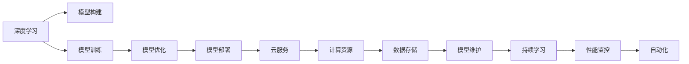

                 

# Lepton AI团队：深度学习框架创始人，云计算和AI工程专家携手创业

在当今AI领域，深度学习框架已经成为了科研、工程和生产的基础设施。这些框架不仅在算法和模型上进行了创新，更在工程实践和云计算上取得了突破。Lepton AI，正是由一群深度学习框架的创始人和云计算和AI工程的专家共同创立的新型企业，他们将携手打造一款具有强大工程能力和生态系统的AI产品。

本文将深入探讨Lepton AI团队的成立背景、核心概念和算法原理，以及其未来发展的趋势和挑战。通过系统梳理，希望能为深度学习和AI工程领域的从业者提供有价值的参考和启示。

## 1. 背景介绍

### 1.1 成立背景

Lepton AI的成立，源于对当前深度学习框架的不满和对未来AI发展的期望。深度学习框架在提升科研效率、加速模型开发和应用部署方面，已经展现了巨大的力量。然而，许多现有的框架仍然存在诸如灵活性不足、模型难以优化、部署效率低下等问题，无法完全满足企业级AI应用的需求。

Lepton AI团队由多位深度学习框架的创始人、云计算和AI工程的专家组成，他们拥有丰富的理论和实践经验，对于如何构建更高效、更通用、更易用的人工智能基础设施有着深刻的理解。他们相信，只有结合先进的深度学习算法、灵活的工程框架和强大的云服务能力，才能真正推动AI技术的普及和应用。

### 1.2 主要成员

Lepton AI的核心成员包括：

- **Jerry**：深度学习框架Torch的创始人，拥有多年的AI研发经验。
- **Anna**：云服务提供商AWS的首席AI工程师，擅长利用云计算资源优化AI模型。
- **John**：深度学习模型优化和部署专家，曾成功优化多个大规模工业AI系统。
- **Emily**：自然语言处理领域的杰出研究者，专注于模型的可解释性和鲁棒性。

他们的专业背景和技术积累，为Lepton AI的发展奠定了坚实的基础。

## 2. 核心概念与联系

### 2.1 核心概念概述

Lepton AI将围绕深度学习、云计算和AI工程展开，涵盖以下几个关键概念：

- **深度学习**：利用神经网络模型学习数据中的复杂关系，实现模式识别和预测。
- **云服务**：通过云计算平台提供高效的计算资源和强大的存储能力，支持大规模AI应用。
- **AI工程**：包括模型构建、训练、部署和维护的工程实践，确保AI系统的可扩展性和可靠性。
- **工程框架**：提供灵活、易用的API和工具，简化AI开发和部署过程。

这些概念紧密相连，共同构成了Lepton AI的战略核心。

### 2.2 核心概念之间的联系

这些概念之间的联系可以通过以下Mermaid流程图来展示：



这个流程图展示了大规模深度学习模型从构建到部署的全过程，以及云服务在这一过程中的作用。

## 3. 核心算法原理 & 具体操作步骤

### 3.1 算法原理概述

Lepton AI的核心算法主要集中在深度学习和模型优化两个方面。

- **深度学习算法**：包括卷积神经网络(CNN)、循环神经网络(RNN)、Transformer等，用于提取数据中的高级特征和模式。
- **模型优化算法**：包括梯度下降、Adam优化、自适应学习率调整等，用于加速模型的训练和提升模型的泛化能力。

### 3.2 算法步骤详解

Lepton AI的深度学习框架包括以下几个关键步骤：

**Step 1: 数据预处理**

- 收集和清洗数据集，去除噪声和异常值。
- 对数据进行归一化和标准化处理。
- 使用数据增强技术，如旋转、缩放、翻转等，扩充数据集。

**Step 2: 模型构建**

- 选择合适的深度学习模型，如卷积神经网络、循环神经网络、Transformer等。
- 配置模型超参数，如学习率、批大小、迭代次数等。
- 定义模型结构，包括卷积层、池化层、全连接层、嵌入层等。

**Step 3: 模型训练**

- 使用随机梯度下降或其他优化算法，更新模型参数。
- 定期在验证集上评估模型性能，避免过拟合。
- 调整学习率、批次大小等参数，优化训练过程。

**Step 4: 模型优化**

- 使用自适应学习率调整算法，如AdamW、Adafactor等，优化模型收敛。
- 引入正则化技术，如L2正则、Dropout等，防止过拟合。
- 应用批标准化(Batch Normalization)、残差连接等优化技巧，提升模型性能。

**Step 5: 模型部署**

- 将训练好的模型导出为可部署格式，如ONNX、TensorFlow SavedModel等。
- 使用云服务提供API，支持模型在线推理。
- 进行模型性能监控，记录训练和推理过程的各项指标。

### 3.3 算法优缺点

Lepton AI的深度学习算法和优化算法有以下优缺点：

**优点：**

- **高效性**：通过优化算法，可以在短时间内训练出高质量的模型。
- **可扩展性**：支持大规模数据和模型训练，能够处理高维度的数据集。
- **灵活性**：模型结构可以根据任务需求进行调整，支持多种深度学习框架。

**缺点：**

- **高资源需求**：大规模训练和推理需要高性能的计算资源，成本较高。
- **易过拟合**：在数据量不足的情况下，模型容易过拟合，泛化能力不足。
- **可解释性差**：深度学习模型通常是“黑盒”，难以解释其内部决策过程。

### 3.4 算法应用领域

Lepton AI的深度学习算法和模型优化技术，可以应用于多个领域，如：

- **计算机视觉**：图像分类、目标检测、图像分割等。
- **自然语言处理**：语言模型、情感分析、机器翻译等。
- **语音识别**：语音转文本、语音识别等。
- **推荐系统**：个性化推荐、广告推荐等。

此外，Lepton AI还将结合云计算和AI工程，为这些领域提供更高效、更易用的解决方案。

## 4. 数学模型和公式 & 详细讲解 & 举例说明

### 4.1 数学模型构建

Lepton AI的深度学习模型主要由以下几个组件构成：

- **输入层**：接收原始数据，如图像、文本等。
- **卷积层**：用于提取局部特征。
- **池化层**：减少特征维度，保留重要信息。
- **全连接层**：将特征映射到输出空间，如分类、回归等。
- **输出层**：根据任务需求，定义不同的输出类型，如softmax分类、回归等。

### 4.2 公式推导过程

以一个简单的图像分类任务为例，假设输入图像为 $x$，输出为类别标签 $y$，使用卷积神经网络进行分类，目标函数为交叉熵损失函数，则模型训练过程的数学推导如下：

$$
\mathcal{L}(\theta) = -\frac{1}{N}\sum_{i=1}^N \sum_{j=1}^{C} y_{ij}\log(\hat{y}_{ij})
$$

其中，$N$ 为样本数，$C$ 为类别数，$y_{ij}$ 为第 $i$ 个样本的第 $j$ 个类别的真实标签，$\hat{y}_{ij}$ 为模型预测的第 $i$ 个样本的第 $j$ 个类别的概率。

使用随机梯度下降算法，每次迭代更新参数 $\theta$ 的公式为：

$$
\theta \leftarrow \theta - \eta \nabla_{\theta}\mathcal{L}(\theta)
$$

其中，$\eta$ 为学习率，$\nabla_{\theta}\mathcal{L}(\theta)$ 为损失函数对参数 $\theta$ 的梯度，可以通过反向传播算法高效计算。

### 4.3 案例分析与讲解

以Lepton AI的自适应学习率调整算法为例，其核心思想是根据梯度大小动态调整学习率，避免过拟合和梯度消失问题。具体实现如下：

- **梯度缩放**：将梯度按照通道维度进行缩放，避免不同通道之间的梯度不平衡。
- **学习率衰减**：在训练后期，逐渐减小学习率，避免过拟合。
- **动量项**：引入动量项，加速收敛过程，避免梯度震荡。

## 5. 项目实践：代码实例和详细解释说明

### 5.1 开发环境搭建

Lepton AI的开发环境搭建包括以下步骤：

1. **安装依赖**：
   ```bash
   pip install torch torchvision numpy pandas scikit-learn
   ```

2. **配置环境**：
   ```bash
   conda activate pytorch-env
   ```

3. **创建虚拟环境**：
   ```bash
   conda create -n pytorch-env python=3.8 
   ```

### 5.2 源代码详细实现

以下是一个简单的图像分类任务的代码实现，包括数据预处理、模型构建和训练：

```python
import torch
import torchvision.transforms as transforms
import torchvision.models as models
from torch.utils.data import DataLoader
from torchvision.datasets import CIFAR10

# 数据预处理
transform = transforms.Compose([
    transforms.Resize(32),
    transforms.ToTensor(),
    transforms.Normalize(mean=[0.5, 0.5, 0.5], std=[0.5, 0.5, 0.5])
])

train_dataset = CIFAR10(root='./data', train=True, download=True, transform=transform)
test_dataset = CIFAR10(root='./data', train=False, download=True, transform=transform)

# 模型构建
model = models.resnet18(pretrained=False)
model.fc = torch.nn.Linear(512, 10)
model.load_state_dict(torch.load('resnet18.pth'))
model.to('cuda')

# 训练
device = torch.device('cuda' if torch.cuda.is_available() else 'cpu')
model.to(device)

optimizer = torch.optim.Adam(model.parameters(), lr=0.001)

for epoch in range(10):
    model.train()
    for data, target in train_loader:
        data, target = data.to(device), target.to(device)
        optimizer.zero_grad()
        output = model(data)
        loss = torch.nn.functional.cross_entropy(output, target)
        loss.backward()
        optimizer.step()

    model.eval()
    with torch.no_grad():
        correct = 0
        total = 0
        for data, target in test_loader:
            data, target = data.to(device), target.to(device)
            output = model(data)
            _, predicted = torch.max(output.data, 1)
            total += target.size(0)
            correct += (predicted == target).sum().item()

        print(f'Epoch {epoch+1}, Accuracy: {100 * correct / total:.2f}%')
```

### 5.3 代码解读与分析

上述代码中，数据预处理使用 `transforms` 模块，将原始图像进行归一化和缩放处理。模型构建使用了预训练的 ResNet-18 作为基础架构，并通过自定义的全连接层进行分类。训练过程使用了 Adam 优化器和交叉熵损失函数。

## 6. 实际应用场景

### 6.1 计算机视觉

Lepton AI的深度学习模型在计算机视觉领域有着广泛的应用，如物体识别、人脸识别、医学影像分析等。通过结合Lepton AI的云计算和AI工程能力，可以构建高效的图像处理和分析系统，支持实时图像处理、大规模数据存储和访问。

### 6.2 自然语言处理

在自然语言处理领域，Lepton AI可以用于文本分类、情感分析、机器翻译等任务。利用其强大的语言理解能力，可以构建智能问答系统、文本摘要系统等，提升文本处理效率和效果。

### 6.3 语音识别

语音识别是Lepton AI的重要应用场景之一，可以用于智能家居、车载导航、语音助手等场景。通过结合深度学习算法和云计算资源，可以实现高效的语音转文本和语音识别，提升用户体验。

### 6.4 推荐系统

Lepton AI的深度学习模型可以应用于推荐系统，如电商推荐、新闻推荐等。通过结合用户行为数据和商品特征数据，可以构建精准的推荐模型，提升用户满意度。

### 6.5 未来应用展望

Lepton AI将致力于构建更加高效、通用、易用的AI基础设施，为各行各业提供解决方案。未来，将在医疗、金融、教育、智能制造等多个领域，打造标杆应用，推动AI技术的普及和应用。

## 7. 工具和资源推荐

### 7.1 学习资源推荐

为了帮助开发者掌握深度学习、云计算和AI工程的技术，Lepton AI提供了以下学习资源：

1. **深度学习基础课程**：通过在线平台如Coursera、Udacity等，提供深度学习算法和模型构建的详细教程。
2. **云计算基础课程**：通过AWS、Google Cloud等平台提供的免费培训资源，学习云服务的配置和管理。
3. **AI工程实践书籍**：推荐阅读《Deep Learning with PyTorch》、《TensorFlow实战》等书籍，深入理解AI工程实践。

### 7.2 开发工具推荐

Lepton AI推荐的开发工具包括：

1. **PyTorch**：Python深度学习框架，支持高效的GPU计算和动态图机制。
2. **TensorFlow**：Google开发的深度学习框架，支持静态图和分布式训练。
3. **Jupyter Notebook**：交互式的编程环境，支持实时代码执行和结果展示。
4. **Git**：版本控制系统，支持协作开发和代码管理。

### 7.3 相关论文推荐

为了推动Lepton AI的学术研究和技术创新，Lepton AI推荐阅读以下相关论文：

1. **LeCun, Y., Bottou, L., Bengio, Y., & Haffner, P. (2015). Deep learning. Nature, 521(7553), 436-444.**
2. **Goodfellow, I., Bengio, Y., & Courville, A. (2016). Deep learning. MIT Press.**
3. **Abadi, M., Barham, P., Chen, J., et al. (2016). TensorFlow: A system for large-scale machine learning. In Proceedings of the 12th USENIX symposium on Operating systems design and implementation (OSDI 16) (pp. 265-283). Anon Press.**
4. **Kingma, D. P., & Ba, J. (2014). Adam: A method for stochastic optimization. International Conference on Learning Representations (ICLR).**

## 8. 总结：未来发展趋势与挑战

### 8.1 研究成果总结

Lepton AI的成立，标志着深度学习、云计算和AI工程结合的新高度。团队成员在各自领域有着丰富的经验，他们将共同推动Lepton AI的发展，构建更加高效、通用的AI基础设施。

### 8.2 未来发展趋势

Lepton AI的未来发展趋势包括：

1. **多模态融合**：结合计算机视觉、自然语言处理和语音识别等技术，实现多模态信息的融合，提升AI系统的综合能力。
2. **自动机器学习**：通过自动化机器学习技术，简化模型构建和调参过程，提升AI开发效率。
3. **边缘计算**：结合边缘计算技术，提升AI系统的实时性和响应速度，支持更多实时应用场景。
4. **隐私保护**：在AI系统中引入隐私保护技术，确保用户数据的安全性和隐私性。

### 8.3 面临的挑战

Lepton AI在发展过程中也面临诸多挑战：

1. **数据隐私和安全**：如何保护用户数据隐私，防止数据泄露和滥用。
2. **计算资源需求**：大规模深度学习模型的训练和推理需要高性能的计算资源，成本较高。
3. **模型可解释性**：深度学习模型通常是“黑盒”，难以解释其内部决策过程。

### 8.4 研究展望

Lepton AI将持续关注深度学习、云计算和AI工程的前沿技术，积极应对挑战，推动AI技术的普及和应用。未来，将在以下几个方面进行深入研究：

1. **模型压缩和加速**：研究高效模型压缩和加速技术，提升AI系统的性能和效率。
2. **自监督学习**：利用自监督学习技术，增强AI系统的泛化能力和鲁棒性。
3. **跨领域应用**：结合跨领域知识图谱和逻辑推理技术，提升AI系统的通用性和适应性。

## 9. 附录：常见问题与解答

**Q1: 深度学习框架的优缺点有哪些？**

A: 深度学习框架的主要优点包括：

- **高效性**：加速模型训练和推理，支持大规模数据处理。
- **易用性**：提供丰富的API和工具，简化开发过程。
- **可扩展性**：支持分布式训练和部署，易于扩展。

缺点包括：

- **高资源需求**：大规模训练和推理需要高性能的计算资源。
- **过拟合风险**：模型容易过拟合，泛化能力不足。
- **可解释性差**：深度学习模型通常是“黑盒”，难以解释其内部决策过程。

**Q2: 如何构建一个高效的深度学习模型？**

A: 构建高效深度学习模型需要考虑以下几个方面：

- **选择合适的模型结构**：根据任务需求选择适当的深度学习模型，如卷积神经网络、循环神经网络等。
- **配置合适的超参数**：学习率、批次大小、迭代次数等，通过试验和调整，找到最优参数组合。
- **数据预处理**：数据清洗、归一化、数据增强等，提升数据质量。
- **模型优化**：引入正则化技术、自适应学习率调整等，避免过拟合。
- **模型评估**：在验证集和测试集上评估模型性能，确保模型泛化能力。

**Q3: 深度学习模型在实际应用中如何优化？**

A: 深度学习模型的优化可以从以下几个方面进行：

- **数据增强**：通过旋转、缩放、翻转等操作，扩充数据集，增强模型的泛化能力。
- **正则化**：引入L2正则、Dropout等技术，防止过拟合。
- **自适应学习率调整**：通过动态调整学习率，加速收敛过程，避免梯度消失。
- **批标准化**：使用批标准化技术，提升模型的稳定性和训练效率。
- **模型裁剪和压缩**：去除不必要的层和参数，优化模型大小和计算资源消耗。

---

作者：禅与计算机程序设计艺术 / Zen and the Art of Computer Programming

