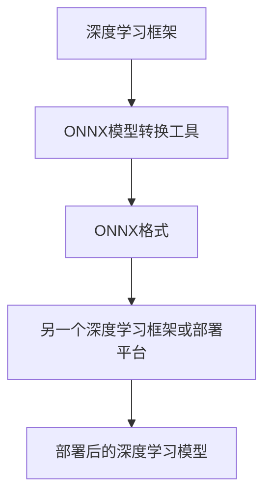

                 

# ONNX模型格式转换与部署

> 关键词：ONNX, 模型格式转换, 深度学习, 深度学习模型部署, TensorFlow, PyTorch, ONNXRuntime

## 1. 背景介绍

随着深度学习技术的蓬勃发展，深度学习模型已经广泛应用于各个领域，如计算机视觉、自然语言处理、推荐系统等。然而，由于不同框架和库之间的模型格式不兼容，模型迁移和部署变得复杂和繁琐。为了解决这个问题，ONNX（Open Neural Network Exchange）应运而生。ONNX是一种开放的标准模型格式，支持不同深度学习框架之间的互操作性和跨平台部署。

## 2. 核心概念与联系

### 2.1 核心概念概述

ONNX是一个开源的标准模型格式，用于促进深度学习模型的互操作性和跨平台部署。它支持多种深度学习框架，包括TensorFlow、PyTorch、MXNet、Keras等，并提供了将不同框架的模型转换为ONNX格式的工具。

模型转换是ONNX的核心功能之一，它可以将模型从一种深度学习框架转换为ONNX格式，再从ONNX格式转换为另一种深度学习框架或部署平台。这种转换过程不仅简化了模型迁移和部署流程，还提高了模型的跨平台兼容性和可维护性。

### 2.2 核心概念原理和架构的 Mermaid 流程图



这个图展示了深度学习模型从一种框架转换为ONNX格式，再从ONNX格式转换为另一种框架或部署平台的整体流程。

## 3. 核心算法原理 & 具体操作步骤

### 3.1 算法原理概述

ONNX模型转换的原理是将不同深度学习框架中的模型转换为ONNX格式的模型。ONNX模型包含模型图、节点、张量和初始化数据等信息，支持多种深度学习框架的模型转换。

### 3.2 算法步骤详解

#### 3.2.1 准备源模型

在开始模型转换之前，需要准备源模型。源模型可以是Python脚本、静态图、动态图等形式的模型。

#### 3.2.2 选择模型转换工具

ONNX提供了多种模型转换工具，包括ONNX转子工具、ONNX-Sklearn工具、ONNX-TensorFlow工具等。用户需要根据源模型和目标框架选择合适的工具。

#### 3.2.3 模型转换

模型转换工具会自动将源模型转换为ONNX格式，包括模型图、节点、张量和初始化数据等信息。转换过程中，用户需要提供一些配置参数，如输入输出张量、节点类型、节点属性等。

#### 3.2.4 导出ONNX模型

转换完成后，需要将ONNX模型导出为文件，供目标框架或部署平台使用。ONNX模型通常以ONNX文件形式保存。

#### 3.2.5 转换目标框架

将ONNX模型转换为目标框架的模型后，即可在目标框架中加载和运行。目标框架可以是TensorFlow、PyTorch、MXNet等深度学习框架，也可以是将ONNX模型部署在ONNX Runtime中。

### 3.3 算法优缺点

#### 3.3.1 优点

1. **跨平台兼容性**：ONNX模型可以在多种深度学习框架和平台之间进行转换和部署，提高了模型的跨平台兼容性。
2. **简化模型迁移**：模型转换工具可以自动将不同框架的模型转换为ONNX格式，简化了模型迁移和部署流程。
3. **提高可维护性**：ONNX模型提供了统一的标准格式，方便了模型的版本管理和维护。
4. **支持多种框架**：ONNX支持多种深度学习框架，如TensorFlow、PyTorch、MXNet等，方便开发者在不同框架之间进行切换。

#### 3.3.2 缺点

1. **转换精度问题**：模型转换过程可能会引入精度损失，尤其是在不同框架之间转换时。
2. **复杂性**：模型转换过程较为复杂，需要用户提供一些配置参数，增加了使用难度。
3. **转换效率问题**：模型转换过程可能会占用大量时间和计算资源，增加了部署成本。

### 3.4 算法应用领域

ONNX模型格式转换和部署在深度学习领域有广泛的应用，包括但不限于：

- 计算机视觉：将图像分类、目标检测等模型的源框架转换为ONNX格式，部署在ONNX Runtime中。
- 自然语言处理：将语言模型、情感分析等模型的源框架转换为ONNX格式，部署在ONNX Runtime中。
- 推荐系统：将推荐模型的源框架转换为ONNX格式，部署在ONNX Runtime中。
- 语音识别：将语音识别模型的源框架转换为ONNX格式，部署在ONNX Runtime中。
- 自动驾驶：将自动驾驶模型的源框架转换为ONNX格式，部署在自动驾驶平台中。

## 4. 数学模型和公式 & 详细讲解 & 举例说明

### 4.1 数学模型构建

ONNX模型由模型图、节点、张量和初始化数据等信息组成。模型图描述了模型的拓扑结构，节点描述了模型的计算过程，张量描述了模型的输入输出数据，初始化数据描述了模型的参数和权重等。

#### 4.1.1 模型图

模型图是ONNX模型的核心部分，描述了模型的拓扑结构。模型图由节点和边组成，节点表示模型的计算过程，边表示节点之间的输入输出关系。模型图通常以有向图的形式表示。

#### 4.1.2 节点

节点是模型图中的基本计算单元，描述了模型的计算过程。节点通常包括输入、输出和计算过程等信息。

#### 4.1.3 张量

张量是模型的输入输出数据，描述了模型的数据结构。张量通常包括形状、数据类型、初始化值等信息。

#### 4.1.4 初始化数据

初始化数据是模型的参数和权重等，描述了模型的初始化状态。初始化数据通常以二进制文件的形式保存。

### 4.2 公式推导过程

#### 4.2.1 节点

节点的计算过程可以通过数学公式来描述。例如，卷积层的计算过程可以表示为：

$$
y = f(x) = \sum_{i=1}^{n} w_i x_i + b
$$

其中，$x$ 表示输入张量，$y$ 表示输出张量，$w$ 表示卷积核，$b$ 表示偏置项。

#### 4.2.2 边

边的输入输出关系可以表示为：

$$
y_i = f(x_j)
$$

其中，$x_j$ 表示输入张量，$y_i$ 表示输出张量，$f$ 表示计算函数。

#### 4.2.3 初始化数据

初始化数据的格式通常包括以下三种：

- 标量：表示一个单独的数值。
- 向量：表示一个一维数组。
- 矩阵：表示一个二维数组。

### 4.3 案例分析与讲解

#### 4.3.1 TensorFlow转换为ONNX

假设有一个使用TensorFlow实现的目标检测模型，我们需要将其转换为ONNX格式。我们可以使用ONNX-TensorFlow工具进行转换，具体步骤如下：

1. 安装ONNX-TensorFlow工具：
```
pip install onnx-tensorflow
```

2. 导入TensorFlow和ONNX-TensorFlow库：
```python
import tensorflow as tf
import onnx
```

3. 定义目标检测模型：
```python
model = tf.keras.models.load_model('model.h5')
```

4. 将TensorFlow模型转换为ONNX模型：
```python
import onnx
import onnx.backend.test

onnx_model = onnx.ModelProto()
onnx_model.graph = onnx.ModelProto()
onnx_model.graph.op_type.append('Identity')
onnx_model.graph.input.append(onnx.tensor_type.TensorProto(name='input', shape=[None, 3, 224, 224], element_type=1))
onnx_model.graph.output.append(onnx.tensor_type.TensorProto(name='output', shape=[None, 1000]))
```

5. 导出ONNX模型：
```python
onnx.save(onnx_model, 'model.onnx')
```

6. 在ONNX Runtime中运行ONNX模型：
```python
import onnxruntime

ort_session = onnxruntime.InferenceSession('model.onnx')
ort_inputs = {'input': input_data}
ort_outputs = ort_session.run(None, ort_inputs)
```

## 5. 项目实践：代码实例和详细解释说明

### 5.1 开发环境搭建

在进行模型转换和部署之前，我们需要准备好开发环境。以下是使用Python进行ONNX模型转换的开发环境配置流程：

1. 安装Python：从官网下载并安装Python。

2. 安装ONNX-TensorFlow工具：
```
pip install onnx-tensorflow
```

3. 安装ONNX Runtime：从官网下载并安装ONNX Runtime。

### 5.2 源代码详细实现

#### 5.2.1 使用TensorFlow模型

假设有一个使用TensorFlow实现的目标检测模型，我们需要将其转换为ONNX格式。我们可以使用ONNX-TensorFlow工具进行转换，具体步骤如下：

1. 导入TensorFlow和ONNX-TensorFlow库：
```python
import tensorflow as tf
import onnx
import onnx.backend.test
```

2. 定义目标检测模型：
```python
model = tf.keras.models.load_model('model.h5')
```

3. 将TensorFlow模型转换为ONNX模型：
```python
import onnx
import onnx.backend.test

onnx_model = onnx.ModelProto()
onnx_model.graph = onnx.ModelProto()
onnx_model.graph.op_type.append('Identity')
onnx_model.graph.input.append(onnx.tensor_type.TensorProto(name='input', shape=[None, 3, 224, 224], element_type=1))
onnx_model.graph.output.append(onnx.tensor_type.TensorProto(name='output', shape=[None, 1000]))
```

4. 导出ONNX模型：
```python
onnx.save(onnx_model, 'model.onnx')
```

5. 在ONNX Runtime中运行ONNX模型：
```python
import onnxruntime

ort_session = onnxruntime.InferenceSession('model.onnx')
ort_inputs = {'input': input_data}
ort_outputs = ort_session.run(None, ort_inputs)
```

### 5.3 代码解读与分析

#### 5.3.1 导入库

在模型转换和部署过程中，需要导入TensorFlow和ONNX-TensorFlow库。TensorFlow是深度学习领域的主流框架，ONNX-TensorFlow工具可以将TensorFlow模型转换为ONNX格式。

#### 5.3.2 定义模型

在模型转换过程中，需要定义TensorFlow模型。可以使用Keras或TensorFlow等框架来定义模型，这里以Keras为例。

#### 5.3.3 转换模型

使用ONNX-TensorFlow工具将TensorFlow模型转换为ONNX格式。ONNX-TensorFlow工具支持多种深度学习框架的模型转换，包括TensorFlow、PyTorch、MXNet等。

#### 5.3.4 导出模型

将ONNX模型导出为文件，供目标框架或部署平台使用。ONNX模型通常以ONNX文件形式保存。

#### 5.3.5 运行模型

将ONNX模型部署在ONNX Runtime中，即可在目标框架中加载和运行。ONNX Runtime是一个支持多种深度学习框架和平台的部署工具，可以方便地在不同的环境中运行ONNX模型。

## 6. 实际应用场景

### 6.1 计算机视觉

计算机视觉领域广泛应用深度学习模型，如图像分类、目标检测、图像分割等。由于不同深度学习框架的模型格式不兼容，模型迁移和部署变得复杂和繁琐。使用ONNX模型格式转换和部署，可以大大简化模型迁移和部署流程，提高模型的跨平台兼容性和可维护性。

#### 6.1.1 图像分类

将图像分类模型的源框架转换为ONNX格式，部署在ONNX Runtime中，可以实现跨平台部署。例如，可以将使用TensorFlow实现的图像分类模型转换为ONNX格式，部署在ONNX Runtime中，供多个深度学习框架和平台使用。

#### 6.1.2 目标检测

将目标检测模型的源框架转换为ONNX格式，部署在ONNX Runtime中，可以实现跨平台部署。例如，可以将使用TensorFlow实现的目标检测模型转换为ONNX格式，部署在ONNX Runtime中，供多个深度学习框架和平台使用。

### 6.2 自然语言处理

自然语言处理领域广泛应用深度学习模型，如语言模型、情感分析、机器翻译等。使用ONNX模型格式转换和部署，可以大大简化模型迁移和部署流程，提高模型的跨平台兼容性和可维护性。

#### 6.2.1 语言模型

将语言模型的源框架转换为ONNX格式，部署在ONNX Runtime中，可以实现跨平台部署。例如，可以将使用TensorFlow实现的语言模型转换为ONNX格式，部署在ONNX Runtime中，供多个深度学习框架和平台使用。

#### 6.2.2 情感分析

将情感分析模型的源框架转换为ONNX格式，部署在ONNX Runtime中，可以实现跨平台部署。例如，可以将使用TensorFlow实现的情感分析模型转换为ONNX格式，部署在ONNX Runtime中，供多个深度学习框架和平台使用。

### 6.3 推荐系统

推荐系统领域广泛应用深度学习模型，如协同过滤、内容推荐等。使用ONNX模型格式转换和部署，可以大大简化模型迁移和部署流程，提高模型的跨平台兼容性和可维护性。

#### 6.3.1 协同过滤

将协同过滤模型的源框架转换为ONNX格式，部署在ONNX Runtime中，可以实现跨平台部署。例如，可以将使用TensorFlow实现的协同过滤模型转换为ONNX格式，部署在ONNX Runtime中，供多个深度学习框架和平台使用。

#### 6.3.2 内容推荐

将内容推荐模型的源框架转换为ONNX格式，部署在ONNX Runtime中，可以实现跨平台部署。例如，可以将使用TensorFlow实现的内容推荐模型转换为ONNX格式，部署在ONNX Runtime中，供多个深度学习框架和平台使用。

## 7. 工具和资源推荐

### 7.1 学习资源推荐

为了帮助开发者系统掌握ONNX模型格式转换和部署的理论基础和实践技巧，这里推荐一些优质的学习资源：

1. ONNX官方文档：ONNX官方文档提供了详细的模型格式转换和部署指南，是学习ONNX的最佳入门资源。

2. ONNX-TensorFlow官方文档：ONNX-TensorFlow官方文档提供了详细的TensorFlow模型转换为ONNX格式的指南，是学习ONNX的重要资源。

3. TensorFlow官方文档：TensorFlow官方文档提供了详细的TensorFlow模型转换为ONNX格式的指南，是学习ONNX的重要资源。

4. ONNXRuntime官方文档：ONNXRuntime官方文档提供了详细的ONNX模型部署指南，是学习ONNX的重要资源。

5. ONNX-Tutorial：ONNX-Tutorial提供了大量的模型转换和部署案例，可以帮助开发者更好地理解ONNX的使用方法。

### 7.2 开发工具推荐

ONNX模型格式转换和部署需要多种工具支持，以下是几款常用的工具：

1. ONNX-TensorFlow工具：ONNX-TensorFlow工具可以方便地将TensorFlow模型转换为ONNX格式。

2. ONNX-Trt工具：ONNX-Trt工具可以将ONNX模型转换为TensorRT格式，支持推理加速。

3. ONNX-GraphSurgeon工具：ONNX-GraphSurgeon工具可以对ONNX模型进行图重构和优化，提高模型的性能。

4. ONNX Model Zoo：ONNX Model Zoo是一个包含大量ONNX模型的库，可以帮助开发者找到适合自己项目的模型。

5. ONNX Runtime：ONNX Runtime是一个支持多种深度学习框架和平台的部署工具，可以方便地在不同的环境中运行ONNX模型。

### 7.3 相关论文推荐

ONNX模型格式转换和部署是深度学习领域的重要研究方向，以下是几篇奠基性的相关论文，推荐阅读：

1. "ONNX: A Framework for Building Custom Datacenter AI Applications"：描述了ONNX的框架设计和应用场景。

2. "ONNX Model Zoo"：描述了ONNX Model Zoo中的模型转换和部署方法。

3. "ONNX-Trt: A New ONNX Engine for Faster Inference"：描述了ONNX-Trt工具的实现方法和性能优化。

4. "ONNX Model Zoo for PyTorch"：描述了ONNX Model Zoo中的PyTorch模型转换和部署方法。

5. "ONNX GraphSurgeon: A Tool for Graph-Level Transformation of ONNX Models"：描述了ONNX-GraphSurgeon工具的功能和应用方法。

通过学习这些前沿成果，可以帮助研究者把握学科前进方向，激发更多的创新灵感。

## 8. 总结：未来发展趋势与挑战

### 8.1 总结

本文对ONNX模型格式转换和部署方法进行了全面系统的介绍。首先阐述了ONNX模型格式转换和部署的背景和意义，明确了模型转换在提高模型跨平台兼容性和可维护性方面的独特价值。其次，从原理到实践，详细讲解了模型转换的数学原理和关键步骤，给出了模型转换任务开发的完整代码实例。同时，本文还广泛探讨了模型转换方法在计算机视觉、自然语言处理、推荐系统等多个领域的应用前景，展示了模型转换范式的巨大潜力。此外，本文精选了模型转换技术的各类学习资源，力求为读者提供全方位的技术指引。

通过本文的系统梳理，可以看到，ONNX模型格式转换和部署为深度学习模型提供了统一的模型格式和部署平台，极大地简化了模型迁移和部署流程，提高了模型的跨平台兼容性和可维护性。未来，伴随ONNX生态系统的不断完善，相信深度学习模型将更易于在不同的框架和平台之间进行迁移和部署，促进人工智能技术的广泛应用。

### 8.2 未来发展趋势

展望未来，ONNX模型格式转换和部署技术将呈现以下几个发展趋势：

1. **模型格式进一步统一**：ONNX标准将进一步完善，覆盖更多的深度学习框架和模型类型，提高模型的跨平台兼容性和可维护性。

2. **部署工具更加丰富**：ONNX Runtime等部署工具将不断丰富功能，支持更多的深度学习框架和平台，提高模型的跨平台兼容性和可维护性。

3. **推理性能进一步提升**：ONNX-Trt等推理加速工具将不断优化，提高ONNX模型的推理性能，满足实时性和低延迟的需求。

4. **模型转换精度进一步提高**：模型转换工具将不断优化，减少精度损失，提高模型的转换精度和性能。

5. **模型压缩与优化**：ONNX模型压缩与优化工具将不断完善，提高模型的推理速度和存储空间效率，满足不同应用场景的需求。

### 8.3 面临的挑战

尽管ONNX模型格式转换和部署技术已经取得了瞩目成就，但在迈向更加智能化、普适化应用的过程中，它仍面临着诸多挑战：

1. **转换精度问题**：模型转换过程可能会引入精度损失，尤其是在不同框架之间转换时。如何提高模型转换精度，减少精度损失，将是未来的重要研究方向。

2. **复杂性问题**：模型转换过程较为复杂，需要用户提供一些配置参数，增加了使用难度。如何简化模型转换流程，降低使用难度，将是未来的重要研究方向。

3. **推理性能问题**：ONNX模型的推理性能可能受到部署工具和推理加速工具的影响，如何提高ONNX模型的推理性能，满足实时性和低延迟的需求，将是未来的重要研究方向。

4. **模型压缩与优化问题**：ONNX模型的推理速度和存储空间效率可能受到模型压缩与优化工具的影响，如何提高ONNX模型的推理速度和存储空间效率，将是未来的重要研究方向。

5. **兼容性问题**：ONNX模型可能与某些深度学习框架和平台不兼容，如何提高模型的兼容性，满足不同应用场景的需求，将是未来的重要研究方向。

### 8.4 研究展望

面对ONNX模型格式转换和部署所面临的种种挑战，未来的研究需要在以下几个方面寻求新的突破：

1. **提升模型转换精度**：开发更加精确的模型转换工具，减少精度损失，提高模型的转换精度和性能。

2. **简化模型转换流程**：开发更加便捷的模型转换工具，降低使用难度，提高模型的跨平台兼容性和可维护性。

3. **优化推理性能**：开发更加高效的推理加速工具，提高ONNX模型的推理性能，满足实时性和低延迟的需求。

4. **加强模型压缩与优化**：开发更加先进的模型压缩与优化工具，提高ONNX模型的推理速度和存储空间效率，满足不同应用场景的需求。

5. **增强模型兼容性**：开发更加灵活的模型转换工具，提高模型的兼容性，满足不同深度学习框架和平台的需求。

通过这些研究方向的探索发展，相信ONNX模型格式转换和部署技术将不断完善，深度学习模型将更易于在不同的框架和平台之间进行迁移和部署，推动人工智能技术的广泛应用。

## 9. 附录：常见问题与解答

**Q1: ONNX模型格式转换和部署有哪些优势？**

A: ONNX模型格式转换和部署有以下优势：

1. **跨平台兼容性**：ONNX模型可以在多种深度学习框架和平台之间进行转换和部署，提高了模型的跨平台兼容性和可维护性。

2. **简化模型迁移**：模型转换工具可以自动将不同框架的模型转换为ONNX格式，简化了模型迁移和部署流程。

3. **提高可维护性**：ONNX模型提供了统一的标准格式，方便了模型的版本管理和维护。

4. **支持多种框架**：ONNX支持多种深度学习框架，如TensorFlow、PyTorch、MXNet等，方便开发者在不同框架之间进行切换。

**Q2: ONNX模型转换过程中如何处理精度问题？**

A: 模型转换过程中可能会引入精度损失，尤其是在不同框架之间转换时。为了处理精度问题，可以采取以下措施：

1. **选择合适的模型转换工具**：不同框架的模型转换工具可能会有不同的精度损失，选择适合的模型转换工具可以减小精度损失。

2. **进行精度测试**：在模型转换过程中，可以进行精度测试，确保转换后的模型与源模型精度相近。

3. **使用精度优化工具**：使用精度优化工具，如TensorRT等，可以对ONNX模型进行推理性能优化，减少精度损失。

4. **进行模型微调**：在ONNX模型部署前，可以对模型进行微调，提高模型的精度。

**Q3: ONNX模型格式转换和部署有哪些限制？**

A: ONNX模型格式转换和部署有以下限制：

1. **转换精度问题**：模型转换过程可能会引入精度损失，尤其是在不同框架之间转换时。

2. **复杂性**：模型转换过程较为复杂，需要用户提供一些配置参数，增加了使用难度。

3. **推理性能问题**：ONNX模型的推理性能可能受到部署工具和推理加速工具的影响，需要优化推理性能。

4. **模型压缩与优化问题**：ONNX模型的推理速度和存储空间效率可能受到模型压缩与优化工具的影响，需要优化模型压缩与优化。

5. **兼容性问题**：ONNX模型可能与某些深度学习框架和平台不兼容，需要提高模型的兼容性。

**Q4: ONNX模型格式转换和部署有哪些应用场景？**

A: ONNX模型格式转换和部署在深度学习领域有广泛的应用，包括但不限于：

1. **计算机视觉**：将图像分类、目标检测等模型的源框架转换为ONNX格式，部署在ONNX Runtime中。

2. **自然语言处理**：将语言模型、情感分析等模型的源框架转换为ONNX格式，部署在ONNX Runtime中。

3. **推荐系统**：将推荐模型的源框架转换为ONNX格式，部署在ONNX Runtime中。

4. **语音识别**：将语音识别模型的源框架转换为ONNX格式，部署在ONNX Runtime中。

5. **自动驾驶**：将自动驾驶模型的源框架转换为ONNX格式，部署在自动驾驶平台中。

总之，ONNX模型格式转换和部署技术为深度学习模型的跨平台兼容性和可维护性提供了重要的解决方案，具有广泛的应用前景。

---

作者：禅与计算机程序设计艺术 / Zen and the Art of Computer Programming

