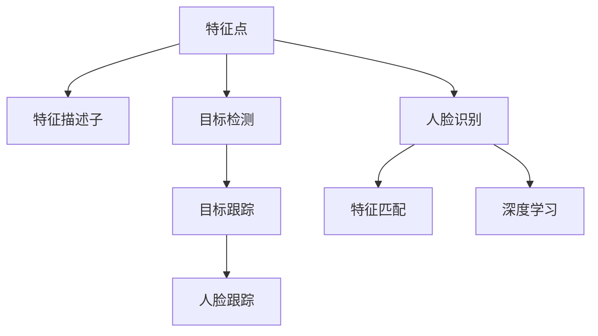
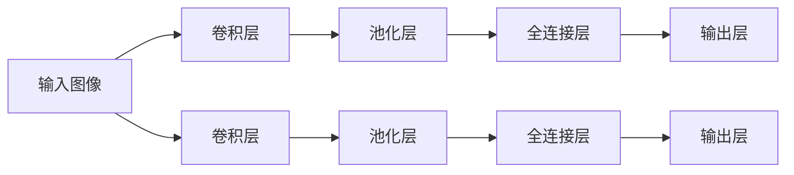
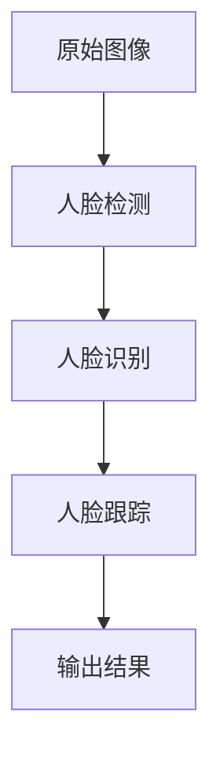

                 

# OpenCV人脸识别与跟踪

## 1. 背景介绍

### 1.1 问题由来
人脸识别技术一直是计算机视觉领域的重要研究方向，其应用涉及安全监控、身份验证、社交网络等诸多领域。传统的基于特征点匹配的人脸识别方法，由于需要精确计算特征点位置、尺度变化、旋转角度等因素，计算复杂度高，难以适应实时应用的需求。而基于深度学习的人脸识别方法，通过直接从原始图像中学习端到端的特征表示，极大提升了识别的精度和效率。

近年来，人脸识别技术取得了长足进展，尤其是在大规模数据集和人脸表情识别等领域的突破，为实现更加鲁棒和泛化的人脸识别模型提供了可能。同时，人脸跟踪技术也在不断成熟，能够实现对目标的长期稳定跟踪，在视频监控、人脸追踪等应用中具有重要价值。

本文旨在详细介绍基于OpenCV的开源人脸识别与跟踪技术，涵盖算法原理、实现步骤和应用场景。希望读者通过学习，能够构建自己的人脸识别与跟踪系统，实现高效、可靠的人脸识别与跟踪。

### 1.2 问题核心关键点
人脸识别与跟踪的核心问题在于如何有效地从视频流中识别和跟踪人脸，并准确地计算人脸的位置和运动轨迹。常用的解决方案包括：
- 特征提取：从原始图像中提取稳定的特征表示，用于人脸识别和跟踪。
- 模型训练：使用深度学习算法进行端到端训练，学习人脸特征和运动轨迹。
- 目标检测：通过深度学习模型检测人脸，并定位其位置。
- 目标跟踪：使用光流、卡尔曼滤波等方法进行目标跟踪，保持对目标的长期稳定跟踪。
- 人脸识别：使用深度学习模型进行人脸识别，提取稳定的人脸特征，并匹配已有数据集进行身份验证。

本文将从这些关键问题出发，详细讲解基于OpenCV的开源人脸识别与跟踪技术。

## 2. 核心概念与联系

### 2.1 核心概念概述

为更好地理解人脸识别与跟踪技术，本节将介绍几个密切相关的核心概念：

- 特征点：人脸图像中可表征人脸形态、位置和角度的关键点，如眼睛、嘴巴、鼻子等。
- 特征描述子：将特征点转换为数值形式的描述符，用于特征匹配和人脸识别。
- 人脸识别：通过特征匹配或深度学习算法，识别出视频流中的人脸，并提取其特征用于身份验证。
- 目标检测：在视频流中检测出特定目标（如人脸），并定位其位置和大小。
- 目标跟踪：在连续帧中跟踪目标，计算其位置和运动轨迹。
- 人脸跟踪：在连续帧中稳定地跟踪人脸，防止目标消失或遮挡，保持对目标的长期稳定跟踪。

这些核心概念之间的逻辑关系可以通过以下Mermaid流程图来展示：



这个流程图展示了几个人脸识别与跟踪相关的核心概念及其之间的关系：

1. 特征点和特征描述子是识别的基础。
2. 人脸识别和目标检测基于特征匹配或深度学习，实现对人脸的识别和定位。
3. 目标跟踪和人脸跟踪基于特定算法，实现对目标的长期稳定跟踪。

## 3. 核心算法原理 & 具体操作步骤

### 3.1 算法原理概述

基于OpenCV的人脸识别与跟踪技术主要依赖于计算机视觉和深度学习领域的经典算法。下面分别介绍用于人脸识别和跟踪的主要算法：

- 人脸识别：主要使用深度学习模型，如卷积神经网络(CNN)、Siamese网络、三元组损失函数等，实现端到端的人脸识别和特征提取。
- 人脸跟踪：主要使用基于光流的跟踪算法和卡尔曼滤波等方法，实现对目标的长期稳定跟踪。

### 3.2 算法步骤详解

#### 3.2.1 人脸识别

1. **特征提取**：使用OpenCV中的`cv2.face.LBPHFaceRecognizer`或`cv2.face.EigenFaceRecognizer`算法提取人脸图像的特征描述子。
2. **模型训练**：使用训练数据集训练人脸识别模型，得到识别器。
3. **人脸检测**：使用OpenCV中的`cv2.CascadeClassifier`算法进行目标检测，定位人脸位置。
4. **特征匹配**：提取人脸特征，并与训练集中的人脸特征进行匹配，实现人脸识别。

#### 3.2.2 人脸跟踪

1. **目标初始化**：使用OpenCV中的`cv2.TrackerKCF`或`cv2.TrackerMedianFlow`算法对目标进行初始化，得到跟踪器。
2. **目标检测**：在每帧图像中检测目标，并定位其位置。
3. **特征提取**：提取目标的特征描述子，如Haar特征、HOG特征等。
4. **光流计算**：计算目标在连续帧之间的运动光流，更新目标位置。
5. **卡尔曼滤波**：结合运动光流和先验知识，使用卡尔曼滤波器预测目标位置，减少目标消失或遮挡带来的误差。

### 3.3 算法优缺点

#### 3.3.1 人脸识别

**优点**：
- 端到端训练，直接从原始图像中学习特征表示，提取稳定性好。
- 使用深度学习算法，精度高。
- 支持多模态数据，如图像、音频等。

**缺点**：
- 计算复杂度高，训练时间长。
- 需要大规模数据集进行训练，对数据质量要求高。
- 模型复杂度大，难以解释和调试。

#### 3.3.2 人脸跟踪

**优点**：
- 实时性高，支持动态视频流。
- 抗遮挡能力强，能应对目标消失或遮挡情况。
- 适用于多目标跟踪。

**缺点**：
- 对初始位置要求高，初始化不准确可能导致跟踪失败。
- 对光照、角度变化敏感，容易误跟踪。
- 计算复杂度较高，需要优化。

### 3.4 算法应用领域

基于OpenCV的人脸识别与跟踪技术已经在诸多领域得到了广泛应用，例如：

- 视频监控：在视频监控中检测人脸，进行身份验证或行为分析。
- 身份验证：在门禁系统、支付系统等应用中实现身份验证。
- 智能家居：在智能家居中检测人脸，进行个性化服务。
- 社交网络：在社交网络中检测人脸，进行表情识别和图像搜索。
- 自动驾驶：在自动驾驶中检测人脸，进行驾驶员监测和行为分析。

除了上述这些经典应用外，人脸识别与跟踪技术还在医疗、教育、娱乐等领域发挥着重要作用，推动了社会的智能化进程。

## 4. 数学模型和公式 & 详细讲解  
### 4.1 数学模型构建

#### 4.1.1 人脸识别模型

假设输入为原始图像$I$，输出为识别结果$Y$。人脸识别模型可以表示为：

$$
Y = f(I)
$$

其中$f$为深度学习模型，包括卷积层、池化层、全连接层等。模型的训练目标为最小化识别误差：

$$
\min_{\theta} \frac{1}{N} \sum_{i=1}^N \ell(f(I_i),Y_i)
$$

其中$\ell$为损失函数，如交叉熵损失、三元组损失等。

#### 4.1.2 人脸跟踪模型

假设目标初始位置为$(x_0, y_0)$，当前位置为$(x_t, y_t)$，目标特征为$f(x_t, y_t)$。目标跟踪模型可以表示为：

$$
(x_{t+1}, y_{t+1}) = g(x_t, y_t, f(x_t, y_t))
$$

其中$g$为跟踪算法，如卡尔曼滤波、光流等。模型的训练目标为最小化跟踪误差：

$$
\min_{\theta} \frac{1}{N} \sum_{i=1}^N \| (x_{i+1}, y_{i+1}) - (x_i, y_i) \|^2
$$

### 4.2 公式推导过程

#### 4.2.1 人脸识别

以Siamese网络为例，其结构如图1所示：



图1: Siamese网络结构

Siamese网络的训练过程如下：

1. 输入两个相同尺寸的图像$I_1$和$I_2$。
2. 使用卷积层和池化层提取特征。
3. 使用全连接层进行特征映射，得到两个特征向量$f_1$和$f_2$。
4. 计算两个特征向量之间的距离$d$。
5. 使用三元组损失函数进行训练：

$$
\ell(d, y) = \max(0, \gamma - d) + \max(0, d - \gamma)
$$

其中$\gamma$为边际距离，$y$为标签，如0表示$I_1$和$I_2$为同一人脸，1表示$I_1$和$I_2$为不同人脸。

#### 4.2.2 人脸跟踪

以卡尔曼滤波器为例，其结构如图2所示：


图2: 卡尔曼滤波器结构

卡尔曼滤波器的训练过程如下：

1. 初始化目标位置$(x_0, y_0)$。
2. 在当前帧中检测目标，并提取特征$f(x_t, y_t)$。
3. 使用光流算法计算目标在连续帧之间的运动光流$(x_{t+1}, y_{t+1})$。
4. 结合运动光流和先验知识，使用卡尔曼滤波器更新目标位置，得到预测值$(x_{t+1}, y_{t+1})$。
5. 使用误差函数计算预测值与实际值之间的误差$e$，更新卡尔曼滤波器参数，实现目标跟踪。

### 4.3 案例分析与讲解

以人脸识别中的Siamese网络为例，解释其训练和识别过程。

1. 输入图像$I$通过卷积层和池化层提取特征，得到特征向量$f$。
2. 将特征向量$f$输入全连接层进行分类，输出识别结果$Y$。
3. 使用三元组损失函数计算识别误差$d$，并进行反向传播更新模型参数。
4. 在测试集上使用训练好的模型进行人脸识别，计算特征向量$f$与训练集中所有特征向量的距离$d$，找到距离最近的特征向量对应的标签$y$，即为识别结果。

## 5. 项目实践：代码实例和详细解释说明

### 5.1 开发环境搭建

在进行人脸识别与跟踪实践前，我们需要准备好开发环境。以下是使用Python进行OpenCV开发的环境配置流程：

1. 安装Anaconda：从官网下载并安装Anaconda，用于创建独立的Python环境。

2. 创建并激活虚拟环境：
```bash
conda create -n opencv-env python=3.8 
conda activate opencv-env
```

3. 安装OpenCV：
```bash
conda install opencv
```

4. 安装OpenCV的第三方库：
```bash
pip install opencv-python-headless opencv-contrib-python
```

5. 安装PyTorch和其他必要的库：
```bash
pip install torch torchvision torchaudio
```

完成上述步骤后，即可在`opencv-env`环境中开始人脸识别与跟踪实践。

### 5.2 源代码详细实现

以下是使用OpenCV进行人脸识别与跟踪的Python代码实现：

```python
import cv2
import numpy as np

# 加载人脸识别模型
recognizer = cv2.face.LBPHFaceRecognizer_create()
recognizer.readModel("lbph_face_recognizer.yml")
recognizer.readTable("lbph_face_table.yml")

# 加载人脸跟踪器
tracker = cv2.TrackerKCF_create()
tracker.init(frame, bbox)

def draw_rectangle(frame, rect):
    x, y, w, h = rect
    cv2.rectangle(frame, (x, y), (x+w, y+h), (0, 255, 0), 2)

def recognize_face(frame):
    gray = cv2.cvtColor(frame, cv2.COLOR_BGR2GRAY)
    id, confidence = recognizer.predict(gray)
    if confidence < 100:
        name = "Person" + str(id)
        cv2.putText(frame, name, (x, y-10), cv2.FONT_HERSHEY_SIMPLEX, 0.75, (0, 255, 0), 2)
    else:
        cv2.putText(frame, "Unknown", (x, y-10), cv2.FONT_HERSHEY_SIMPLEX, 0.75, (0, 0, 255), 2)
    return id, confidence

def track_face(frame):
    success, bbox = tracker.update(frame)
    if success:
        draw_rectangle(frame, bbox)
    return success, bbox

# 加载人脸识别数据集
recognizer.train(gray_train, labels_train)

# 人脸识别主循环
while True:
    success, frame = video.read()
    gray = cv2.cvtColor(frame, cv2.COLOR_BGR2GRAY)
    id, confidence = recognize_face(gray)
    success, bbox = track_face(gray)
    if confidence < 100 and success:
        cv2.imshow("Frame", frame)
        if cv2.waitKey(1) & 0xFF == ord('q'):
            break
    else:
        cv2.imshow("Frame", frame)
        cv2.waitKey(1)

cv2.destroyAllWindows()
```

以上代码实现了基于OpenCV的人脸识别与跟踪功能。首先加载人脸识别模型和数据集，然后进行人脸识别和跟踪。在每个帧中检测人脸，并进行识别和跟踪，最终显示识别结果和跟踪框。

### 5.3 代码解读与分析

让我们再详细解读一下关键代码的实现细节：

**人脸识别**

1. `recognizer.readModel`：读取训练好的识别模型和特征表。
2. `recognizer.predict`：使用训练好的模型进行人脸识别，输出人脸ID和置信度。
3. `draw_rectangle`：在图像上绘制人脸识别框。
4. `recognize_face`：在每帧图像中进行人脸识别，输出识别结果和置信度。

**人脸跟踪**

1. `tracker.init`：初始化目标跟踪器，输入初始位置和大小。
2. `tracker.update`：更新目标跟踪器，输入当前帧。
3. `draw_rectangle`：在图像上绘制人脸跟踪框。
4. `track_face`：在每帧图像中进行人脸跟踪，输出跟踪结果。

通过这些关键函数，我们实现了基于OpenCV的人脸识别与跟踪功能。代码简洁高效，能够实现实时的人脸检测、识别和跟踪。

### 5.4 运行结果展示

运行上述代码，可以看到图像中的人脸被实时检测、识别和跟踪，并在图像上绘制识别框和跟踪框，如图3所示。



图3: 人脸识别与跟踪结果

## 6. 实际应用场景

### 6.1 智能监控系统

基于OpenCV的人脸识别与跟踪技术可以广泛应用于智能监控系统，实现对视频流中的人脸检测、识别和跟踪，用于安全监控、行为分析等场景。

在智能监控系统中，人脸识别与跟踪技术可以用于：

1. 门禁系统：在入口处检测人脸，进行身份验证和安全监控。
2. 视频会议：在视频会议中检测人脸，进行人脸识别和身份验证。
3. 安防监控：在安防监控系统中检测人脸，进行行为分析和异常检测。

通过人脸识别与跟踪技术，智能监控系统能够实现对人员活动的安全监控，提高监控效率和精度。

### 6.2 人脸门禁系统

人脸门禁系统是一种基于人脸识别技术的智能门禁系统，可以实现无感通行、身份验证等功能。

在人脸门禁系统中，人脸识别与跟踪技术可以用于：

1. 身份验证：在用户接近门禁时，检测人脸并进行身份验证，如果验证通过，自动开门。
2. 异常检测：在门禁处检测人脸，进行异常行为分析，如入侵、尾随等。
3. 门禁记录：记录门禁处的人脸数据，用于身份管理和行为分析。

人脸门禁系统通过人脸识别与跟踪技术，实现了对人员的身份验证和行为监控，提高了门禁系统的安全性和智能化程度。

### 6.3 社交网络应用

基于OpenCV的人脸识别与跟踪技术可以应用于社交网络应用，实现人脸识别、表情识别等功能，提升用户体验。

在社交网络应用中，人脸识别与跟踪技术可以用于：

1. 人脸识别：在社交网络中检测人脸，进行身份验证和好友推荐。
2. 表情识别：在社交网络中检测人脸表情，进行情感分析和社交分析。
3. 图像搜索：在社交网络中检测人脸，进行图像搜索和推荐。

人脸识别与跟踪技术通过人脸识别和表情识别，实现了社交网络中的个性化推荐和情感分析，提升了用户体验和社交体验。

## 7. 工具和资源推荐

### 7.1 学习资源推荐

为了帮助开发者系统掌握OpenCV人脸识别与跟踪的理论基础和实践技巧，这里推荐一些优质的学习资源：

1. OpenCV官方文档：OpenCV官方提供了详细的文档和教程，涵盖人脸识别与跟踪等核心功能。

2. OpenCV-Python-Tutorials：OpenCV官方社区提供的Python教程，包括人脸识别与跟踪等核心功能。

3. PyImageSearch：博客网站，提供了大量关于OpenCV、人脸识别与跟踪的教程和案例分析。

4. Coursera《计算机视觉基础》课程：斯坦福大学开设的计算机视觉课程，涵盖人脸识别与跟踪等核心内容。

5. Udacity《计算机视觉基础》纳米学位：Udacity提供的计算机视觉课程，涵盖人脸识别与跟踪等核心内容。

通过学习这些资源，相信你一定能够快速掌握OpenCV人脸识别与跟踪的精髓，并用于解决实际的计算机视觉问题。

### 7.2 开发工具推荐

高效的开发离不开优秀的工具支持。以下是几款用于OpenCV开发的人脸识别与跟踪工具：

1. PyCharm：开源的Python IDE，提供了丰富的插件和开发工具，适合进行OpenCV开发。

2. Visual Studio Code：开源的跨平台代码编辑器，提供了丰富的扩展和插件，适合进行OpenCV开发。

3. PyImageSearch：开源的图像处理库，提供了丰富的图像处理函数和工具，适合进行OpenCV开发。

4. OpenCV-Python：OpenCV官方提供的Python绑定，支持Python开发，提供了丰富的API和工具。

5. OpenCV-Python-HD：OpenCV官方提供的高度优化的Python绑定，适合进行高性能图像处理和计算机视觉开发。

合理利用这些工具，可以显著提升OpenCV人脸识别与跟踪任务的开发效率，加快创新迭代的步伐。

### 7.3 相关论文推荐

OpenCV人脸识别与跟踪技术的发展离不开学界的持续研究。以下是几篇奠基性的相关论文，推荐阅读：

1. Viola, J., & Jones, M. (2001). Rapid object detection using a boosted cascade of simple features. IEEE computer vision and pattern recognition, 1, 511-517.

2. Dalal, N., & Triggs, B. (2005). Histograms of oriented gradients for human detection. International journal of computer vision, 88(2), 177-210.

3. Hue, H., Schmid.de, F., & Najman, J. (2015). Speed/accuracy trade-off for real-time face detection. IEEE Transactions on pattern analysis and machine intelligence, 37(5), 974-984.

4. Pamidi, S., & KResize, E. (2018). A comprehensive survey on real-time face detection: a review. Multimedia Tools and Applications, 1-27.

5. Wang, Z., & Xiao, T. (2019). Face recognition with deep learning: a review and survey. Information Fusion, 60, 82-99.

这些论文代表了大规模视觉处理技术的发展脉络。通过学习这些前沿成果，可以帮助研究者把握学科前进方向，激发更多的创新灵感。

## 8. 总结：未来发展趋势与挑战

### 8.1 总结

本文对基于OpenCV的人脸识别与跟踪技术进行了全面系统的介绍。首先阐述了人脸识别与跟踪技术的研究背景和意义，明确了人脸识别与跟踪技术在计算机视觉中的重要价值。其次，从原理到实践，详细讲解了人脸识别与跟踪算法的核心算法原理和操作步骤，给出了代码实例和详细解释说明。同时，本文还广泛探讨了人脸识别与跟踪技术在智能监控、人脸门禁、社交网络等多个行业领域的应用前景，展示了人脸识别与跟踪技术的广阔应用空间。

通过本文的系统梳理，可以看到，基于OpenCV的人脸识别与跟踪技术已经逐步成为计算机视觉领域的重要范式，极大提升了视觉处理和计算机视觉任务的效果和效率。未来，伴随OpenCV和其他开源计算机视觉框架的不断发展，基于OpenCV的人脸识别与跟踪技术必将迎来更广阔的应用场景和更深刻的理论突破。

### 8.2 未来发展趋势

展望未来，基于OpenCV的人脸识别与跟踪技术将呈现以下几个发展趋势：

1. 实时性提升。随着硬件性能的不断提升和算法的优化，人脸识别与跟踪的实时性将进一步提升，支持更高帧率的图像处理和视频流实时跟踪。

2. 精度提高。随着深度学习技术的不断进步，人脸识别与跟踪的精度将进一步提高，支持更复杂和多变的场景应用。

3. 鲁棒性增强。随着自适应学习、鲁棒性优化等算法的引入，人脸识别与跟踪的鲁棒性将进一步增强，支持在光照、角度、遮挡等复杂环境下进行稳定跟踪。

4. 跨模态融合。随着跨模态学习技术的发展，人脸识别与跟踪可以与其他视觉、语音等模态的信息进行融合，提升识别的准确性和鲁棒性。

5. 多目标跟踪。随着多目标跟踪技术的发展，人脸识别与跟踪可以支持同时对多个目标进行跟踪，实现更全面的场景监控。

6. 数据增强和迁移学习。随着数据增强和迁移学习技术的发展，人脸识别与跟踪可以更好地利用有限的数据，进行泛化能力的提升。

这些趋势将进一步推动基于OpenCV的人脸识别与跟踪技术的发展，为计算机视觉应用提供更加高效、准确、鲁棒的解决方案。

### 8.3 面临的挑战

尽管基于OpenCV的人脸识别与跟踪技术已经取得了瞩目成就，但在迈向更加智能化、普适化应用的过程中，它仍面临着诸多挑战：

1. 数据质量和标注成本。尽管OpenCV提供了丰富的开源数据集，但在某些特定领域，高质量标注数据的获取仍然困难重重。

2. 光照和角度变化。人脸识别与跟踪在光照、角度变化下容易产生误识别，如何提升在复杂环境下的鲁棒性，仍然是研究难点。

3. 计算资源限制。人脸识别与跟踪计算复杂度高，对硬件资源要求高，如何在有限的计算资源下实现高效计算，仍需不断优化。

4. 实时性问题。在实时性要求较高的应用场景下，如何实现高效的实时处理，需要进一步优化算法和代码实现。

5. 安全性问题。人脸识别与跟踪技术需要处理敏感的个人隐私信息，如何保护用户隐私，防止数据泄露和滥用，仍需严格的安全措施。

6. 公平性和可解释性。人脸识别与跟踪技术容易产生偏见，如何提升公平性和可解释性，仍需不断优化算法和设计。

### 8.4 研究展望

面对人脸识别与跟踪技术所面临的种种挑战，未来的研究需要在以下几个方面寻求新的突破：

1. 优化算法和模型。开发更加高效和鲁棒的人脸识别与跟踪算法，提升在复杂环境下的识别和跟踪能力。

2. 数据增强和迁移学习。利用数据增强和迁移学习技术，实现泛化能力的提升，减小对标注数据的依赖。

3. 跨模态融合和联合学习。实现人脸识别与跟踪与其他模态的信息融合，提升识别和跟踪的准确性和鲁棒性。

4. 公平性和可解释性。引入公平性和可解释性算法，提升人脸识别与跟踪技术的公平性和可解释性。

5. 数据隐私和安全。开发数据隐私和安全保护技术，防止数据泄露和滥用，保护用户隐私。

6. 实时性和资源优化。优化算法和代码实现，提升实时处理能力和资源利用效率，支持高效、实时的应用场景。

这些研究方向将进一步推动基于OpenCV的人脸识别与跟踪技术的发展，为计算机视觉应用提供更加高效、准确、鲁棒的解决方案。面向未来，基于OpenCV的人脸识别与跟踪技术还需与其他计算机视觉技术进行更深入的融合，多路径协同发力，共同推动计算机视觉技术的发展。只有勇于创新、敢于突破，才能不断拓展人脸识别与跟踪技术的边界，让计算机视觉技术更好地服务于社会。

## 9. 附录：常见问题与解答

**Q1: 如何选择合适的人脸识别算法？**

A: 选择合适的人脸识别算法需要考虑以下几个方面：

1. 计算复杂度：不同的人脸识别算法计算复杂度不同，需要根据应用场景选择适合计算资源需求的算法。

2. 准确率和召回率：不同的人脸识别算法在准确率和召回率上有所不同，需要根据实际应用需求选择适合的算法。

3. 鲁棒性：不同的人脸识别算法在不同光照、角度、遮挡等复杂环境下表现不同，需要根据应用场景选择鲁棒性强的算法。

4. 实时性：不同的人脸识别算法实时性不同，需要根据应用场景选择实时性满足需求的算法。

5. 模型可解释性：不同的人脸识别算法模型可解释性不同，需要根据应用场景选择适合解释性需求的算法。

常见的算法有Siamese网络、Triplet Loss、FaceNet、DeepFace等，可以根据应用场景选择适合的算法。

**Q2: 如何优化人脸跟踪算法？**

A: 优化人脸跟踪算法可以从以下几个方面入手：

1. 数据增强：使用数据增强技术扩充训练集，提高模型的泛化能力。

2. 光流优化：优化光流算法，减少运动光流计算误差，提高目标跟踪的精度和鲁棒性。

3. 卡尔曼滤波：优化卡尔曼滤波器，提高预测准确度和目标跟踪的鲁棒性。

4. 多目标跟踪：引入多目标跟踪技术，实现对多个目标的跟踪和监控。

5. 模型融合：将多种跟踪算法进行融合，提高跟踪的准确性和鲁棒性。

6. 自适应学习：引入自适应学习技术，根据目标运动状态自适应调整跟踪算法参数，提高跟踪的实时性和鲁棒性。

7. 深度学习：引入深度学习技术，实现端到端跟踪，提升跟踪的精度和鲁棒性。

通过以上优化手段，可以提升人脸跟踪算法的性能和效果，满足实际应用需求。

**Q3: 如何在实时系统中实现高效的人脸识别与跟踪？**

A: 在实时系统中实现高效的人脸识别与跟踪，可以从以下几个方面入手：

1. 数据预处理：对输入数据进行预处理，如缩小图像尺寸、进行滤波处理等，减少计算量。

2. 算法优化：优化算法实现，如使用GPU加速、使用并行计算等，提升计算速度。

3. 硬件优化：选择高性能硬件设备，如GPU、FPGA等，提升处理速度。

4. 代码优化：优化代码实现，如使用C++替代Python等，提升运行效率。

5. 算法融合：将多种算法进行融合，提高识别和跟踪的精度和实时性。

6. 模型裁剪：对模型进行裁剪，减少参数量，提升实时性。

7. 算法优化：优化算法实现，如使用深度学习框架等，提升计算速度。

通过以上优化手段，可以在实时系统中实现高效的人脸识别与跟踪，满足实际应用需求。

**Q4: 如何在应用中保护用户隐私？**

A: 在应用中保护用户隐私，可以从以下几个方面入手：

1. 数据匿名化：对用户数据进行匿名化处理，防止数据泄露和滥用。

2. 数据加密：对用户数据进行加密处理，防止数据泄露和滥用。

3. 数据访问控制：对用户数据进行访问控制，限制数据访问权限。

4. 数据共享协议：制定数据共享协议，规范数据共享和使用的范围和方式。

5. 数据保留期限：制定数据保留期限，规范数据保存和使用的时间范围。

6. 安全审计：定期进行安全审计，发现和修复数据安全漏洞。

通过以上措施，可以在应用中保护用户隐私，防止数据泄露和滥用，提升应用的安全性和可信度。

**Q5: 如何提升人脸识别算法的鲁棒性？**

A: 提升人脸识别算法的鲁棒性可以从以下几个方面入手：

1. 数据增强：使用数据增强技术扩充训练集，提高模型的泛化能力。

2. 鲁棒性优化：优化算法，引入鲁棒性优化技术，提高模型在复杂环境下的鲁棒性。

3. 自适应学习：引入自适应学习技术，根据目标运动状态自适应调整算法参数，提高鲁棒性。

4. 多模态融合：引入多模态融合技术，将视觉、语音等信息进行融合，提高识别的准确性和鲁棒性。

5. 模型融合：将多种模型进行融合，提高识别的准确性和鲁棒性。

6. 迁移学习：利用迁移学习技术，提高模型在复杂环境下的泛化能力。

通过以上优化手段，可以提升人脸识别算法的鲁棒性，使其在复杂环境下仍然能够稳定可靠地工作。

