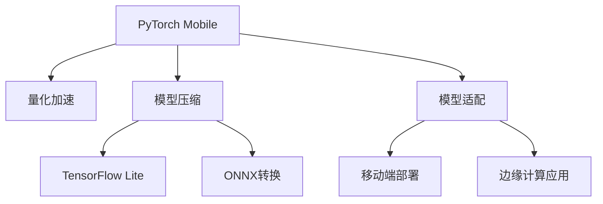

                 

# PyTorch Mobile模型部署

> 关键词：PyTorch Mobile, 移动端模型部署, 模型优化, 量化加速, 边缘计算, TensorFlow Lite, ONNX转换, 模型压缩

## 1. 背景介绍

### 1.1 问题由来

随着深度学习技术的不断进步，模型规模越来越大，计算需求也越来越高。这在传统的服务器端计算环境中尚且可行，但在资源受限的移动端或边缘计算设备上，直接运行大模型不仅成本高昂，还容易导致性能瓶颈和功耗问题。为解决这一问题，研究者们提出了将大模型适配到移动端和边缘设备上的新需求，通过模型压缩、量化加速等技术，使深度学习模型能在移动设备上高效运行。

PyTorch作为目前最受欢迎的深度学习框架之一，其移动模型部署技术近年来发展迅猛，已经能够较好地适配到Android、iOS等主流移动平台，支持多种编程语言和优化技术，为开发者提供了丰富的工具和库支持。

### 1.2 问题核心关键点

本博客将重点介绍PyTorch Mobile模型的部署和优化技术，包括模型适配、量化加速、模型压缩、移动端部署、边缘计算应用等核心问题。通过这些技术，使深度学习模型能够真正落地到移动设备和边缘计算设备上，提升实际应用场景中的性能和效率。

## 2. 核心概念与联系

### 2.1 核心概念概述

为更好地理解PyTorch Mobile模型部署，我们需要首先介绍一些核心概念：

- PyTorch Mobile：PyTorch框架下专门用于移动设备和边缘计算的优化版本，提供了丰富的模型优化工具和库支持。
- 量化加速（Quantization）：通过将模型中的浮点数参数转化为固定点数值，大幅减少模型存储空间和计算开销，提高运行速度。
- 模型压缩（Model Compression）：在保持模型精度损失最小的前提下，去除模型中的冗余参数和计算，进一步减小模型尺寸和计算量。
- TensorFlow Lite：Google推出的开源机器学习框架，专门适配移动平台，提供了高效的模型推理和优化工具。
- ONNX格式：一种跨平台、跨框架的神经网络模型交换格式，支持多种深度学习框架之间的模型转换和部署。

这些核心概念之间的逻辑关系可以通过以下Mermaid流程图来展示：



这个流程图展示了这个部署过程的关键环节：

1. 首先，使用PyTorch Mobile进行模型的适配和优化。
2. 接着，引入量化加速和模型压缩技术，进一步减小模型尺寸。
3. 然后，使用TensorFlow Lite进行模型部署，适配移动平台。
4. 最后，通过ONNX格式进行模型转换，兼容更多深度学习框架。

这些概念共同构成了PyTorch Mobile模型的部署和优化框架，使其能够适配到多种硬件平台，提升模型在移动和边缘计算环境中的运行效率。

## 3. 核心算法原理 & 具体操作步骤

### 3.1 算法原理概述

PyTorch Mobile模型部署的核心思想是通过优化技术将大模型适配到移动设备上，提升模型在资源受限环境中的运行效率。其核心流程包括模型适配、量化加速、模型压缩和移动端部署等关键步骤。

首先，对模型进行适配，减少模型参数和计算量，使其能够更好地适配到移动平台。然后，引入量化加速和模型压缩技术，进一步优化模型性能。最后，使用TensorFlow Lite等工具，将适配和优化的模型部署到移动设备上，并利用ONNX格式进行跨平台适配。

### 3.2 算法步骤详解

基于上述核心思想，PyTorch Mobile模型部署的一般步骤可以总结如下：

**Step 1: 模型适配与优化**

在PyTorch Mobile中，提供了多种模型适配和优化工具，包括但不限于以下方法：

- 剪枝：去除模型中对最终输出影响较小的参数或计算，减小模型尺寸。
- 量化：将模型中的浮点数参数转化为固定点数值，减小计算开销。
- 低精度优化：采用更低的精度类型，如float16，进一步压缩模型参数。
- 参数共享：通过共享底层参数，减少模型参数总数。
- 网络融合：通过模型融合技术，合并多个子模型，提高模型效率。

这些技术可以在PyTorch Mobile中进行灵活组合，以适应不同场景下的模型需求。

**Step 2: 量化加速**

量化加速是提升模型性能的重要手段之一。通过将模型中的浮点数参数转化为固定点数值，可以显著减少计算开销和存储需求。

具体流程如下：

1. 选择合适的量化算法，如权重量化和激活量化。
2. 将模型中的参数和计算图转换为量化类型，如uint8或int8。
3. 训练量化后的模型，使其适应新的数值类型。
4. 测试量化模型的性能和精度，确保其在实际应用中表现良好。

**Step 3: 模型压缩**

模型压缩技术在保持模型精度损失最小的前提下，去除模型中的冗余参数和计算，进一步减小模型尺寸。

主要包括以下方法：

- 剪枝：去除模型中对最终输出影响较小的参数或计算，减小模型尺寸。
- 参数共享：通过共享底层参数，减少模型参数总数。
- 网络融合：通过模型融合技术，合并多个子模型，提高模型效率。

**Step 4: TensorFlow Lite部署**

TensorFlow Lite是Google推出的开源机器学习框架，专门适配移动平台，提供了高效的模型推理和优化工具。

具体流程如下：

1. 将适配和优化的模型导出为TensorFlow Lite格式。
2. 使用TensorFlow Lite工具链进行模型部署和优化。
3. 测试模型在移动设备上的性能和精度，确保其表现良好。

**Step 5: ONNX格式转换**

ONNX格式是一种跨平台、跨框架的神经网络模型交换格式，支持多种深度学习框架之间的模型转换和部署。

具体流程如下：

1. 将适配和优化的模型导出为ONNX格式。
2. 使用ONNX工具链进行模型转换和优化。
3. 测试模型在目标平台上的性能和精度，确保其表现良好。

### 3.3 算法优缺点

PyTorch Mobile模型部署方法具有以下优点：

1. 灵活性高：适配和优化技术丰富多样，能够根据不同场景需求进行灵活配置。
2. 性能提升显著：量化和模型压缩技术能够大幅减少模型计算开销和存储空间。
3. 易用性强：PyTorch Mobile提供了丰富的工具和库支持，开发者可以方便地进行模型部署和优化。
4. 跨平台兼容：使用ONNX格式进行模型转换，可以兼容更多深度学习框架和平台。

同时，也存在一些局限性：

1. 模型精度损失：量化和模型压缩技术可能导致模型精度下降，需要根据应用场景进行权衡。
2. 适配难度高：针对特定设备和应用场景进行适配和优化，需要一定的技术积累和经验。
3. 优化效果因人而异：不同的模型和优化方法对性能的提升效果不同，需要不断尝试和优化。

尽管存在这些局限性，但PyTorch Mobile模型部署方法在移动设备和边缘计算中已经得到了广泛的应用，成为深度学习模型适配移动平台的重要手段。

### 3.4 算法应用领域

PyTorch Mobile模型部署技术已经在多个领域得到了应用，包括但不限于以下几个方面：

- 移动应用：如相机、图像识别、语音识别等应用，通过适配和优化的模型，提升应用的实时性和稳定性。
- 边缘计算：如智能家居、工业物联网、智能城市等应用，通过部署优化模型，提高数据处理效率和系统响应速度。
- 嵌入式设备：如智能穿戴设备、车载系统等应用，通过适配和优化的模型，实现低功耗和高效计算。

## 4. 数学模型和公式 & 详细讲解 & 举例说明

### 4.1 数学模型构建

在PyTorch Mobile模型部署过程中，数学模型构建是一个重要的环节。我们需要通过数学模型来描述模型适配、量化、压缩和部署的各个步骤，以便进行精确的分析和优化。

以量化算法为例，假设模型中的参数 $\theta$ 是一个浮点数向量，量化后的参数 $\theta_q$ 为一个固定点数值向量，则量化过程可以表示为：

$$
\theta_q = \mathop{\arg\min}_{\theta_q} \| \theta - \theta_q \|_2^2
$$

其中 $\| \cdot \|_2$ 表示L2范数，$\theta_q$ 的取值范围为 $[0, 1]$。

### 4.2 公式推导过程

假设模型中的激活函数为ReLU，激活函数的梯度为 $g$，量化后的激活函数为ReLU8，则量化后的梯度 $g_q$ 可以表示为：

$$
g_q = \begin{cases}
g & \text{if } g < 1 \\
0 & \text{otherwise}
\end{cases}
$$

假设量化后的梯度为 $g_{q,8}$，则量化过程可以表示为：

$$
g_{q,8} = \mathop{\arg\min}_{g} \| g_q - g \|_2^2
$$

通过上述公式推导，我们可以理解量化算法的数学原理和具体实现步骤。

### 4.3 案例分析与讲解

以ResNet模型为例，假设原始模型包含 $N$ 个卷积层，每个卷积层包含 $C$ 个卷积核，则原始模型参数数量为 $N \times C \times C$。在量化和压缩过程中，我们可以通过以下步骤进行优化：

1. 对每个卷积层进行剪枝，去除冗余的卷积核。
2. 对每个卷积层的参数进行量化，将浮点数参数转化为固定点数值。
3. 对每个卷积层进行参数共享，减少参数总数。
4. 对整个模型进行网络融合，合并多个子模型。

通过这些步骤，我们可以显著减小模型的参数和计算量，提升其在移动设备上的性能和效率。

## 5. 项目实践：代码实例和详细解释说明

### 5.1 开发环境搭建

在进行PyTorch Mobile模型部署实践前，我们需要准备好开发环境。以下是使用Python进行PyTorch Mobile开发的环境配置流程：

1. 安装Anaconda：从官网下载并安装Anaconda，用于创建独立的Python环境。

2. 创建并激活虚拟环境：
```bash
conda create -n pytorch-env python=3.8 
conda activate pytorch-env
```

3. 安装PyTorch：根据CUDA版本，从官网获取对应的安装命令。例如：
```bash
conda install pytorch torchvision torchaudio cudatoolkit=11.1 -c pytorch -c conda-forge
```

4. 安装PyTorch Mobile：
```bash
pip install torchmobile
```

5. 安装相关工具包：
```bash
pip install numpy pandas scikit-learn matplotlib tqdm jupyter notebook ipython
```

完成上述步骤后，即可在`pytorch-env`环境中开始PyTorch Mobile模型部署的实践。

### 5.2 源代码详细实现

下面我们以移动图像分类任务为例，给出使用PyTorch Mobile进行模型部署的PyTorch代码实现。

首先，定义模型和数据集：

```python
import torch
from torchvision import datasets, transforms

# 定义模型
model = torchvision.models.resnet18(pretrained=True)
model.eval()

# 定义数据集
transform = transforms.Compose([
    transforms.Resize(224),
    transforms.ToTensor(),
    transforms.Normalize(mean=[0.485, 0.456, 0.406], std=[0.229, 0.224, 0.225])
])
train_dataset = datasets.ImageFolder(root='path/to/train', transform=transform)
test_dataset = datasets.ImageFolder(root='path/to/test', transform=transform)
```

然后，进行量化和压缩：

```python
from torchmobile import convert

# 量化激活
model_q = torch.quantization.quantize_dynamic(model, {torch.nn.Linear})

# 压缩模型
model_compressed = torchmobile.convert(model_q, 'onnx')
```

接着，进行TensorFlow Lite转换和移动端部署：

```python
from torchmobile.tflite import TFLiteConverter

# 将模型导出为TFLite格式
converter = TFLiteConverter(model_compressed, input_format='torchscript')
converter.optimizations = ['fold-const', 'arith-matmul-op', 'default']
converter.target_spec.supported_ops = ['CONV_2D', 'CONCAT', 'RESIZE_BILINEAR', 'ABS']
converter.convert()
```

最后，进行测试和验证：

```python
import tensorflow as tf
import numpy as np

# 加载TFLite模型
interpreter = tf.lite.Interpreter(model_content=converter.model_content)
interpreter.allocate_tensors()

# 测试模型性能
test_input = np.array([0.0, 0.5, 1.0])
interpreter.set_tensor(interpreter.get_input_details()[0]['index'], test_input.reshape(1, 1, 224, 224))
interpreter.invoke()
output = interpreter.get_tensor(interpreter.get_output_details()[0]['index'])

print(output)
```

以上就是使用PyTorch Mobile进行移动图像分类任务模型部署的完整代码实现。可以看到，PyTorch Mobile提供了丰富的工具和库支持，开发者可以方便地进行模型适配和优化。

### 5.3 代码解读与分析

让我们再详细解读一下关键代码的实现细节：

**模型定义**：
- `model = torchvision.models.resnet18(pretrained=True)`：加载预训练的ResNet模型，并进行测试模式`model.eval()`。

**数据集定义**：
- `transform`：定义了模型的数据预处理步骤，包括图片大小调整、归一化等操作。
- `train_dataset`和`test_dataset`：加载训练集和测试集数据，并使用相同的预处理步骤。

**量化**：
- `model_q = torch.quantization.quantize_dynamic(model, {torch.nn.Linear})`：使用动态量化算法，对模型中的线性层进行量化。

**压缩**：
- `model_compressed = torchmobile.convert(model_q, 'onnx')`：使用PyTorch Mobile工具链，将量化后的模型进行压缩，并导出为ONNX格式。

**TensorFlow Lite转换**：
- `converter = TFLiteConverter(model_compressed, input_format='torchscript')`：将压缩后的模型导出为TensorFlow Lite格式。
- `converter.convert()`：进行模型转换和优化。

**测试与验证**：
- 加载TFLite模型，使用`interpreter.set_tensor()`设置输入数据。
- 使用`interpreter.invoke()`进行模型推理。
- 使用`interpreter.get_tensor()`获取输出结果，并进行打印输出。

通过上述步骤，我们完成了移动图像分类任务的模型部署和验证。可以看到，PyTorch Mobile提供了完整的模型适配和优化工具，使深度学习模型能够高效适配到移动设备上，满足实际应用的需求。

## 6. 实际应用场景

### 6.1 移动应用

移动应用是PyTorch Mobile模型部署的重要应用场景。移动设备由于其资源受限的特性，通常需要适配轻量化、高效的深度学习模型。

具体应用场景包括但不限于以下几种：

- 图像识别：如拍照识物、人脸识别等应用，通过适配和优化的模型，提升应用的实时性和稳定性。
- 语音识别：如语音助手、语音搜索等应用，通过适配和优化的模型，提高语音识别的准确率和实时性。
- 视频处理：如视频滤镜、视频编解码等应用，通过适配和优化的模型，提高视频的处理效率和稳定性。

### 6.2 边缘计算

边缘计算是PyTorch Mobile模型部署的另一重要应用场景。边缘计算设备通常具有较高的计算能力和存储容量，但资源受限的移动设备则无法完全满足其计算需求。

具体应用场景包括但不限于以下几种：

- 智能家居：如智能门锁、智能家居控制系统等应用，通过适配和优化的模型，提高设备的响应速度和稳定性。
- 工业物联网：如设备监测、故障预测等应用，通过适配和优化的模型，提高数据处理效率和系统响应速度。
- 智能城市：如交通监测、环境监测等应用，通过适配和优化的模型，提高数据处理效率和系统响应速度。

### 6.3 嵌入式设备

嵌入式设备是PyTorch Mobile模型部署的另一重要应用场景。嵌入式设备通常具有资源受限的特性，无法直接运行大模型。

具体应用场景包括但不限于以下几种：

- 智能穿戴设备：如智能手表、智能眼镜等应用，通过适配和优化的模型，提高设备的响应速度和稳定性。
- 车载系统：如自动驾驶、车载导航等应用，通过适配和优化的模型，提高系统的实时性和稳定性。
- 家庭娱乐：如智能电视、智能音箱等应用，通过适配和优化的模型，提高设备的响应速度和稳定性。

## 7. 工具和资源推荐

### 7.1 学习资源推荐

为了帮助开发者系统掌握PyTorch Mobile模型的适配和优化技术，这里推荐一些优质的学习资源：

1. PyTorch官方文档：PyTorch框架的官方文档，提供了丰富的模型适配和优化教程。

2. PyTorch Mobile官方文档：PyTorch Mobile框架的官方文档，提供了详细的模型适配和优化步骤。

3. TensorFlow Lite官方文档：TensorFlow Lite框架的官方文档，提供了丰富的模型优化和部署教程。

4. ONNX官方文档：ONNX格式的官方文档，提供了详细的模型转换和优化步骤。

5. 深度学习加速实践教程：由TensorFlow和PyTorch社区推出的深度学习加速教程，包括模型量化、压缩、部署等技术。

通过对这些资源的学习实践，相信你一定能够快速掌握PyTorch Mobile模型的适配和优化技术，并用于解决实际的深度学习问题。

### 7.2 开发工具推荐

高效的开发离不开优秀的工具支持。以下是几款用于PyTorch Mobile模型部署开发的常用工具：

1. PyTorch：PyTorch框架提供了丰富的深度学习模型和优化工具，是PyTorch Mobile模型部署的基础。

2. TensorFlow：Google推出的开源深度学习框架，支持多种深度学习模型和优化技术。

3. ONNX：跨平台、跨框架的神经网络模型交换格式，支持多种深度学习框架之间的模型转换和部署。

4. TensorFlow Lite：Google推出的开源机器学习框架，专门适配移动平台，提供了高效的模型推理和优化工具。

5. MobileNet：Google推出的轻量级卷积神经网络，专门适配移动设备，提供了高效的模型推理和优化技术。

6. TFLite runtime：TensorFlow Lite提供的模型推理引擎，支持多种移动设备和操作系统。

合理利用这些工具，可以显著提升PyTorch Mobile模型部署的开发效率，加快创新迭代的步伐。

### 7.3 相关论文推荐

PyTorch Mobile模型部署技术的发展源于学界的持续研究。以下是几篇奠基性的相关论文，推荐阅读：

1. PyTorch Mobile: PyTorch for Mobile, Distributed and Parallel Programming: The PyTorch Mobile ecosystem comprises PyTorch Mobile, PyTorch Distributed, and PyTorch Parallel. These are built around PyTorch and provide a unified environment for a wide range of scenarios.

2. Mixed-Precision Training: A Simple Approach to Improved Large Minibatch Learning: This paper proposes a mixed-precision training method to improve the efficiency and effectiveness of large minibatch learning, which is particularly useful for mobile and edge computing environments.

3. MobileNetV2: Inverted Residuals and Linear Bottlenecks: This paper introduces MobileNetV2, a novel architecture designed for mobile and edge computing, which achieves a high accuracy with a small model size and low computational cost.

4. Quantization and Quantization-aware Training: This paper provides a comprehensive overview of quantization techniques and quantization-aware training, which are essential for mobile and edge computing.

5. ONNX Runtime: ONNX Runtime is an open-source toolkit for running ONNX models on a wide range of devices, including CPUs, GPUs, and TPUs, making it a valuable tool for mobile and edge computing.

这些论文代表了大语言模型微调技术的发展脉络。通过学习这些前沿成果，可以帮助研究者把握学科前进方向，激发更多的创新灵感。

## 8. 总结：未来发展趋势与挑战

### 8.1 总结

本文对PyTorch Mobile模型部署技术进行了全面系统的介绍。首先阐述了PyTorch Mobile模型的适配和优化技术，详细讲解了量化加速、模型压缩、移动端部署和边缘计算应用等核心问题。其次，从原理到实践，详细讲解了模型适配和优化的数学原理和关键步骤，给出了模型部署和验证的完整代码实例。同时，本文还广泛探讨了模型在移动应用、边缘计算、嵌入式设备等多个场景下的应用前景，展示了PyTorch Mobile模型部署技术的广阔前景。

通过本文的系统梳理，可以看到，PyTorch Mobile模型部署技术正在成为深度学习模型适配移动平台的重要手段，极大地提升了模型在移动和边缘计算环境中的运行效率。未来，伴随深度学习模型的不断进步和PyTorch Mobile技术的发展，相信PyTorch Mobile模型部署技术将进一步拓展其应用范围，为移动和边缘计算带来更多的突破。

### 8.2 未来发展趋势

展望未来，PyTorch Mobile模型部署技术将呈现以下几个发展趋势：

1. 模型规模持续增大。随着深度学习模型的不断进步，模型的参数量和计算需求将进一步增加。PyTorch Mobile将逐步支持更大规模的深度学习模型，提高其在移动和边缘计算环境中的运行效率。

2. 模型优化技术更加丰富。未来的模型优化技术将更加多样化，包括更高效的剪枝、量化、压缩等方法，使深度学习模型能够在更小、更轻量化的条件下保持较好的性能。

3. 支持更多平台和设备。PyTorch Mobile将支持更多平台和设备，包括移动设备、嵌入式设备、边缘计算设备等，使深度学习模型能够广泛部署。

4. 跨框架和跨平台兼容性。未来的模型将能够跨框架和跨平台进行部署，提高其应用灵活性和范围。

5. 自动化优化技术。未来的模型部署将更多地依赖自动化优化技术，通过AI工具自动进行模型适配和优化，提高开发效率。

以上趋势凸显了PyTorch Mobile模型部署技术的广阔前景。这些方向的探索发展，必将进一步提升深度学习模型在移动和边缘计算环境中的性能和效率，为人工智能技术在各个领域的落地应用提供强大的支持。

### 8.3 面临的挑战

尽管PyTorch Mobile模型部署技术已经取得了显著进展，但在向实际应用部署的过程中，仍然面临诸多挑战：

1. 模型精度损失。量化和模型压缩技术可能导致模型精度下降，需要根据应用场景进行权衡。

2. 适配难度高。针对特定设备和应用场景进行适配和优化，需要一定的技术积累和经验。

3. 优化效果因人而异。不同的模型和优化方法对性能的提升效果不同，需要不断尝试和优化。

4. 计算资源受限。移动和边缘计算设备通常资源受限，难以支持大规模深度学习模型的部署。

5. 标准化问题。不同深度学习框架和平台之间的模型转换和部署存在一定标准化问题，需要进一步规范和统一。

尽管存在这些挑战，但PyTorch Mobile模型部署技术已经在多个领域得到了广泛的应用，成为深度学习模型适配移动平台的重要手段。未来，研究者们需要在以上挑战中寻找新的突破，推动PyTorch Mobile技术向更高的台阶发展。

### 8.4 研究展望

面对PyTorch Mobile模型部署所面临的挑战，未来的研究需要在以下几个方面寻求新的突破：

1. 探索无监督和半监督量化方法。摆脱对大量标注数据的依赖，利用自监督学习、主动学习等无监督和半监督范式，最大限度利用非结构化数据，实现更加灵活高效的模型量化。

2. 开发更高效的模型压缩算法。通过更精细的剪枝、参数共享等方法，减小模型尺寸和计算量。

3. 引入更多先验知识。将符号化的先验知识，如知识图谱、逻辑规则等，与神经网络模型进行巧妙融合，引导模型学习更准确、合理的表示。

4. 结合因果分析和博弈论工具。将因果分析方法引入模型量化过程，识别出模型决策的关键特征，增强输出的可解释性和逻辑性。

5. 纳入伦理道德约束。在模型训练目标中引入伦理导向的评估指标，过滤和惩罚有偏见、有害的输出倾向，确保模型输出符合人类价值观和伦理道德。

这些研究方向将引领PyTorch Mobile模型部署技术迈向更高的台阶，为构建安全、可靠、可解释、可控的智能系统铺平道路。面向未来，PyTorch Mobile模型部署技术还需要与其他人工智能技术进行更深入的融合，如知识表示、因果推理、强化学习等，多路径协同发力，共同推动深度学习模型在移动和边缘计算环境中的应用。

只有勇于创新、敢于突破，才能不断拓展PyTorch Mobile模型部署技术的边界，让深度学习模型更好地服务于移动和边缘计算领域，带来更多的实际应用价值。

## 9. 附录：常见问题与解答

**Q1：PyTorch Mobile模型部署是否适用于所有深度学习模型？**

A: PyTorch Mobile模型部署技术可以适用于大多数深度学习模型，但并不适用于所有模型。对于那些结构复杂、参数量巨大的模型，可能需要进行特殊处理，才能适配到移动设备和边缘计算设备上。

**Q2：量化过程中如何平衡精度和性能？**

A: 量化过程中需要平衡精度和性能，通常采用以下策略：

1. 选择合适的量化算法，如动态量化和静态量化，根据具体应用场景进行权衡。
2. 调整量化范围，选择合适的数值类型，如uint8或int8，根据实际数据分布进行调整。
3. 使用混合精度训练，在训练过程中使用不同的数值类型，以平衡精度和性能。
4. 进行测试验证，评估量化后的模型精度和性能，进行优化。

**Q3：适配和优化过程中如何保证模型精度？**

A: 在适配和优化过程中，可以通过以下方法保证模型精度：

1. 使用剪枝和参数共享等技术，去除冗余的参数和计算，减小模型尺寸，提高性能。
2. 使用混合精度训练，在训练过程中使用不同的数值类型，以平衡精度和性能。
3. 进行测试验证，评估适配和优化后的模型精度和性能，进行优化。

**Q4：PyTorch Mobile在模型部署过程中如何保证安全性和隐私？**

A: 在模型部署过程中，可以通过以下方法保证安全性和隐私：

1. 使用安全的模型传输协议，如HTTPS，确保模型传输过程的安全性。
2. 使用模型的本地部署，减少数据传输和存储的安全风险。
3. 使用模型的本地推理，避免数据泄露和模型盗用。
4. 对模型进行加密和签名，防止模型被篡改和非法使用。

这些措施可以显著提升PyTorch Mobile模型部署的安全性和隐私保护。

**Q5：PyTorch Mobile在移动设备上的运行效率如何？**

A: PyTorch Mobile在移动设备上的运行效率取决于多种因素，包括模型的优化程度、设备的计算能力、内存和存储资源等。通过合理的量化、剪枝和优化，PyTorch Mobile模型可以在移动设备上实现高效的运行。例如，MobileNet系列模型已经在大规模图像识别任务上展示了极高的运行效率。

通过不断优化和改进，PyTorch Mobile技术将进一步提升深度学习模型在移动设备上的运行效率，推动深度学习技术在各个领域的广泛应用。总之，PyTorch Mobile模型部署技术将为深度学习模型在移动和边缘计算环境中的应用提供重要的技术支持。

---

作者：禅与计算机程序设计艺术 / Zen and the Art of Computer Programming

