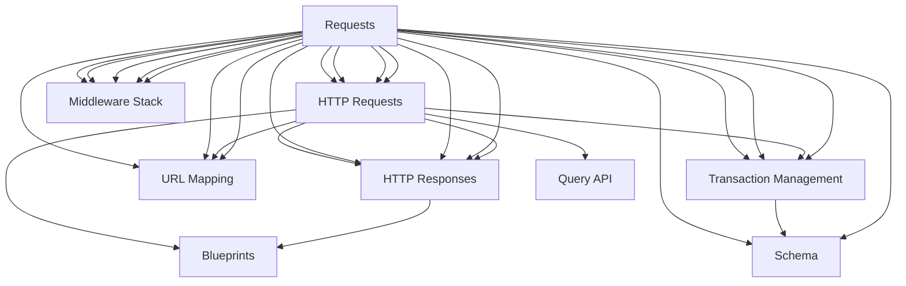

                 

# Python Web 框架比较：探索适合项目的最佳选择

> 关键词：Python Web 框架，Django, Flask, FastAPI, Pyramid, 选择标准, 应用场景, 优缺点, 学习资源, 工具推荐, 总结

## 1. 背景介绍

随着Web应用的日益普及，Python成为开发Web应用的首选语言。而Python Web框架，作为连接前后端的关键工具，其选择对项目的成功与否具有重要影响。Django、Flask、FastAPI、Pyramid等框架各具特色，适用于不同的应用场景。本文将对这四个主流的Python Web框架进行详细比较，探索其核心原理与具体操作步骤，提出选择标准，并结合实际应用场景给出指导建议。

## 2. 核心概念与联系

### 2.1 核心概念概述

在深入比较之前，我们先了解几个关键概念：

- **Web 框架**：Web框架是构建Web应用程序的基础，提供了一系列工具和库，帮助开发者更方便地构建Web应用。
- **Django**：一款全功能的Web框架，提供ORM、模板引擎、用户认证等内置功能。
- **Flask**：一款轻量级的Web框架，灵活且易于扩展，适用于小型应用和API开发。
- **FastAPI**：一款高性能的Web框架，基于Starlette和Uvicorn，专为API和微服务设计。
- **Pyramid**：一款灵活的Web框架，适用于大型Web应用和高度定制化开发。

### 2.2 核心概念原理和架构的 Mermaid 流程图



这个流程图展示了Django、Flask、FastAPI和Pyramid的架构特点：

- Django具有强大的ORM、模板引擎、用户认证等内置功能，适用于大型Web应用。
- Flask轻量级且灵活，通过Blueprints和URL Routers组织代码，适合小型应用和API开发。
- FastAPI专注于API和微服务，使用OpenAPI和Schema描述接口，适合高性能应用。
- Pyramid支持大型应用和高度定制化，使用URL Routers、Middleware Stack等组件实现灵活的开发。

## 3. 核心算法原理 & 具体操作步骤
### 3.1 算法原理概述

不同Web框架的核心算法原理略有不同，但共同的目标是提供快速、灵活、安全的Web应用开发环境。

- **Django**：采用模型-视图-模板（MVT）模式，通过ORM封装数据库操作，提供强大的模板引擎和用户认证。
- **Flask**：基于请求-响应模型，使用Blueprints和URL Routers组织代码，灵活度高。
- **FastAPI**：基于Starlette和Uvicorn，提供异步请求处理和HTTP请求/响应模型，专注于API和微服务。
- **Pyramid**：基于URL Mapping和Middleware Stack，提供灵活的URL路由和中间件支持。

### 3.2 算法步骤详解

各框架的实际操作步骤如下：

**Django**：
1. 安装Django。
2. 配置数据库和设置项目名称。
3. 定义模型和视图。
4. 创建模板和样式。
5. 运行开发服务器。

**Flask**：
1. 安装Flask。
2. 创建Blueprints和URL Routers。
3. 编写视图和处理器函数。
4. 配置HTTP请求处理和URL路由。
5. 运行开发服务器。

**FastAPI**：
1. 安装FastAPI。
2. 定义API接口和模型。
3. 编写处理函数。
4. 配置异步请求处理和HTTP响应。
5. 运行开发服务器。

**Pyramid**：
1. 安装Pyramid。
2. 定义URL Mapping和Middleware Stack。
3. 编写视图和处理器函数。
4. 配置HTTP请求处理和URL路由。
5. 运行开发服务器。

### 3.3 算法优缺点

**Django**：
- **优点**：功能强大，易于上手，内置ORM和模板引擎，适合大型应用。
- **缺点**：灵活性不足，学习曲线较陡峭。

**Flask**：
- **优点**：轻量级、灵活，易于扩展，适合小型应用和API开发。
- **缺点**：需要开发者自行管理数据库和请求处理。

**FastAPI**：
- **优点**：高性能、专注于API和微服务，易于使用，支持异步处理。
- **缺点**：功能相对较少，学习曲线较陡峭。

**Pyramid**：
- **优点**：灵活、适用于大型应用和高度定制化，支持多种中间件。
- **缺点**：学习曲线较陡峭，配置复杂。

### 3.4 算法应用领域

- **Django**：适用于大型Web应用和企业级项目，如社交媒体、电商网站等。
- **Flask**：适用于小型应用和API开发，如博客、新闻网站等。
- **FastAPI**：适用于高性能API和微服务，如API网关、数据服务等。
- **Pyramid**：适用于大型应用和高度定制化开发，如企业门户、数据仪表板等。

## 4. 数学模型和公式 & 详细讲解 & 举例说明

### 4.1 数学模型构建

不同框架的数学模型构建方法有所不同，但核心思想都是通过数学模型来描述和处理Web请求和响应。

**Django**：
- 模型-视图-模板（MVT）模式，模型通过ORM与数据库交互，视图处理用户请求，模板生成响应。

**Flask**：
- 请求-响应模型，每个请求对应一个处理器函数，通过Blueprints组织代码。

**FastAPI**：
- HTTP请求/响应模型，使用OpenAPI和Schema描述API接口，支持异步请求处理。

**Pyramid**：
- URL Mapping和Middleware Stack，通过URL Routers和Middleware Stack处理请求和响应。

### 4.2 公式推导过程

**Django**：
$$
\text{视图处理} = \text{模型} + \text{模板引擎} + \text{用户认证} + \text{URL Routers} + \text{中间件}
$$

**Flask**：
$$
\text{处理函数} = \text{Blueprints} + \text{URL Routers} + \text{请求处理}
$$

**FastAPI**：
$$
\text{API接口} = \text{OpenAPI} + \text{Schema} + \text{异步处理} + \text{HTTP请求/响应}
$$

**Pyramid**：
$$
\text{URL Mapping} + \text{Middleware Stack} + \text{请求处理} + \text{响应处理}
$$

### 4.3 案例分析与讲解

**Django**：
- 项目：社交媒体应用，如Facebook。
- 模型：用户、文章、评论等。
- 视图：用户登录、文章列表、文章详情等。
- 模板：展示文章列表、文章详情等。

**Flask**：
- 项目：个人博客，如WordPress。
- Blueprints：分别处理文章、评论等模块。
- URL Routers：定义URL路由。
- 请求处理：处理HTTP请求，生成HTML页面。

**FastAPI**：
- 项目：数据服务API，如Github API。
- 模型：数据、标签等。
- 视图：数据列表、数据详情等。
- 异步处理：快速处理大量请求。

**Pyramid**：
- 项目：企业门户，如公司官网。
- URL Mapping：定义URL映射。
- Middleware Stack：处理请求和响应。
- 请求处理：处理HTTP请求，生成HTML页面。

## 5. 项目实践：代码实例和详细解释说明

### 5.1 开发环境搭建

**Django**：
```bash
pip install django
```

**Flask**：
```bash
pip install flask
```

**FastAPI**：
```bash
pip install fastapi uvicorn
```

**Pyramid**：
```bash
pip install pyramid
```

### 5.2 源代码详细实现

**Django**：
```python
from django.shortcuts import render
from .models import User, Article

def index(request):
    articles = Article.objects.all()
    return render(request, 'index.html', {'articles': articles})
```

**Flask**：
```python
from flask import Flask, Blueprint

app = Flask(__name__)
article_blueprint = Blueprint('article', __name__)

@article_blueprint.route('/article/<int:pk>')
def article_detail(pk):
    article = Article.query.get(pk)
    return render_template('article_detail.html', article=article)
```

**FastAPI**：
```python
from fastapi import FastAPI

app = FastAPI()

@app.get('/articles/{pk}')
def article_detail(pk: int):
    article = Article.get(pk)
    return article
```

**Pyramid**：
```python
from pyramid.config import Configurator
from pyramid.response import Response

def get_article_detail(request):
    pk = int(request.matchdict['pk'])
    article = Article.get(pk)
    return Response.render(article)
```

### 5.3 代码解读与分析

**Django**：
- 使用`render`函数生成HTML页面，通过ORM获取数据库中的数据。
- 定义视图函数处理用户请求。

**Flask**：
- 使用Blueprints组织代码，定义URL路由。
- 通过`render_template`函数生成HTML页面。

**FastAPI**：
- 使用OpenAPI和Schema描述API接口。
- 定义`@app.get`装饰器处理HTTP GET请求。

**Pyramid**：
- 通过Configurator配置URL Mapping和Middleware Stack。
- 定义`get_article_detail`函数处理HTTP请求。

### 5.4 运行结果展示

运行上述代码后，各框架都能生成对应的HTML页面，展示相应的数据。

## 6. 实际应用场景

### 6.1 背景介绍

在实际应用中，选择适合项目的Web框架至关重要。

### 6.2 项目示例

**社交媒体应用**：
- 选择Django：功能强大，易于上手，适用于大型应用。
- 项目特点：用户管理、文章发布、评论互动等。

**个人博客**：
- 选择Flask：轻量级、灵活，易于扩展，适合小型应用。
- 项目特点：文章发布、评论互动等。

**API服务**：
- 选择FastAPI：专注于API和微服务，支持异步处理，性能高。
- 项目特点：数据服务、API网关等。

**企业门户**：
- 选择Pyramid：灵活、适用于大型应用和高度定制化开发。
- 项目特点：用户管理、数据展示、页面动态等。

## 7. 工具和资源推荐

### 7.1 学习资源推荐

- **Django**：
  - 官方文档：https://docs.djangoproject.com/
  - 实战教程：《Django实战：从入门到精通》

- **Flask**：
  - 官方文档：https://flask.palletsprojects.com/
  - 实战教程：《Flask Web开发》

- **FastAPI**：
  - 官方文档：https://fastapi.tiangolo.com/
  - 实战教程：《FastAPI实战教程》

- **Pyramid**：
  - 官方文档：https://docs.pylonsproject.org/projects/pyramid/en/latest/
  - 实战教程：《Pyramid Web开发》

### 7.2 开发工具推荐

- **Django**：
  - Django Admin：管理后台。
  - Django REST Framework：API开发。

- **Flask**：
  - Flask SQLAlchemy：数据库操作。
  - Flask RESTful：API开发。

- **FastAPI**：
  - OpenAPI：API文档。
  - Starlette：HTTP请求处理。

- **Pyramid**：
  - SQLAlchemy：数据库操作。
  - Transaction Management：事务管理。

### 7.3 相关论文推荐

- **Django**：
  - 论文：《Django: A High-Level Web Framework That Encourages Rapid Development and Clean, pragmatic design》
  - 链接：https://www.djangoproject.com/blog/2008/12/30/the-django-web-framework/

- **Flask**：
  - 论文：《Flask: Micro Framework for Rapid Web Development》
  - 链接：https://mochikuni.github.io/flask-website/en/

- **FastAPI**：
  - 论文：《FastAPI: Fast, web-standard Python 3.7+ based on Starlette and Uvicorn》
  - 链接：https://fastapi.tiangolo.com/

- **Pyramid**：
  - 论文：《Pyramid: A Development Framework for the Next Generation of Web Applications》
  - 链接：https://www.pylonsproject.org/

## 8. 总结：未来发展趋势与挑战

### 8.1 研究成果总结

本文详细比较了Django、Flask、FastAPI和Pyramid四个Python Web框架，探索了其核心原理和操作步骤，提出了选择标准，并结合实际应用场景给出指导建议。通过比较，我们发现不同框架适用于不同的项目类型，开发者需根据具体需求进行选择。

### 8.2 未来发展趋势

- **Django**：
  - 发展趋势：功能增强、易用性提升。
  - 挑战：灵活性不足，性能优化。

- **Flask**：
  - 发展趋势：扩展性增强、生态系统完善。
  - 挑战：性能瓶颈、模块化不足。

- **FastAPI**：
  - 发展趋势：性能提升、生态系统完善。
  - 挑战：功能扩展、社区支持。

- **Pyramid**：
  - 发展趋势：生态系统完善、功能增强。
  - 挑战：学习曲线陡峭、配置复杂。

### 8.3 面临的挑战

- **Django**：
  - 挑战：灵活性不足，性能优化。

- **Flask**：
  - 挑战：性能瓶颈、模块化不足。

- **FastAPI**：
  - 挑战：功能扩展、社区支持。

- **Pyramid**：
  - 挑战：学习曲线陡峭、配置复杂。

### 8.4 研究展望

未来的研究方向应关注以下几个方面：

- **功能增强**：提升各框架的功能性和易用性。
- **性能优化**：优化各框架的性能瓶颈，提升处理能力。
- **生态系统**：完善各框架的生态系统，增强社区支持。
- **跨框架协作**：探索各框架的协作机制，实现资源共享。

## 9. 附录：常见问题与解答

### 9.1 常见问题

**Q1：如何选择适合的Python Web框架？**
- **A**：根据项目需求选择，如大型应用选Django，小型应用选Flask，API服务选FastAPI，高度定制化选Pyramid。

**Q2：Django和Flask哪个更易上手？**
- **A**：Flask更轻量级、灵活，适合小型应用和快速原型开发。Django功能强大，易于上手，适合大型应用和快速开发。

**Q3：FastAPI和Django比较，哪个更适合API开发？**
- **A**：FastAPI专注于API和微服务，支持异步处理，性能高。Django适合Web应用开发，但API开发需结合Django REST Framework。

**Q4：Pyramid和Flask比较，哪个更适合大型应用？**
- **A**：Pyramid支持大型应用和高度定制化，但学习曲线较陡峭。Flask轻量级、灵活，但扩展性不足。

**Q5：FastAPI和Django比较，哪个更适合大型Web应用？**
- **A**：Django功能强大，易于上手，适用于大型Web应用。FastAPI专注于API和微服务，性能高，但功能相对较少。

**Q6：Flask和Pyramid比较，哪个更适合高度定制化开发？**
- **A**：Pyramid支持大型应用和高度定制化开发，但配置复杂，学习曲线陡峭。Flask轻量级、灵活，但扩展性不足。

**Q7：Django和Pyramid比较，哪个更适合高度定制化开发？**
- **A**：Pyramid支持大型应用和高度定制化开发，但配置复杂，学习曲线陡峭。Django功能强大，易于上手，但灵活性不足。

**Q8：FastAPI和Flask比较，哪个更适合API网关？**
- **A**：FastAPI专注于API和微服务，支持异步处理，性能高，适合API网关。Flask轻量级、灵活，但扩展性不足，需结合其他工具。

**Q9：Django和FastAPI比较，哪个更适合数据服务API？**
- **A**：FastAPI专注于API和微服务，支持异步处理，性能高，适合数据服务API。Django功能强大，易于上手，但API开发需结合Django REST Framework。

**Q10：Flask和Pyramid比较，哪个更适合小型应用？**
- **A**：Flask轻量级、灵活，适合小型应用和API开发。Pyramid灵活、适用于大型应用和高度定制化开发，但学习曲线陡峭，配置复杂。

通过本文的详细比较和指导，开发者可以根据具体需求选择适合的Python Web框架，提升开发效率，构建高质量的Web应用。

