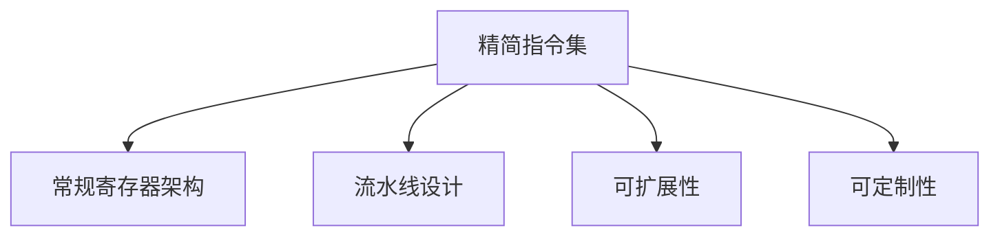

                 

# RISC-V 开源指令集：RISC-V ISA

> 关键词：RISC-V, 指令集, 开源, 硬件设计, 性能优化, 功耗降低, 安全性

## 1. 背景介绍

### 1.1 问题由来

随着计算机硬件的发展，出现了许多不同的指令集架构，如 x86、ARM、MIPS等。这些架构在特定时期内对计算机产业的发展起到了重要作用，但同时也存在以下问题：

- **授权成本高**：许多公司需要支付高昂的授权费用才能使用这些架构。
- **架构专利过期**：许多架构的专利正在逐渐到期，导致一些公司需要在有限的时间内转向新的架构。
- **性能和功耗问题**：现有的架构在性能和功耗方面存在诸多限制。
- **灵活性不足**：现有架构的设计往往固定，难以适应新的应用场景。

为了解决这些问题，RISC-V（Reduced Instruction Set Computing, 精简指令集计算）应运而生。RISC-V是一种开源的、灵活的、可定制的指令集架构，旨在为所有用途提供无专利、免版税的架构。

### 1.2 问题核心关键点

RISC-V指令集架构的核心特点包括：

- **精简设计**：去掉了许多复杂指令，使指令集更加精简。
- **可扩展性**：指令集设计可扩展，适应不同应用场景。
- **灵活性**：支持不同的扩展指令，以适应特定的需求。
- **开源性**：完全开源，任何人都可以自由使用和修改。
- **低功耗**：通过精简设计，降低了功耗。
- **安全性**：支持多种安全机制，增强了数据保护。

这些特点使得RISC-V指令集架构在诸多应用场景中具有显著优势。

### 1.3 问题研究意义

RISC-V指令集架构的研究具有以下重要意义：

- **降低硬件设计成本**：开源指令集架构降低了硬件设计成本，使更多的公司能够进入该领域。
- **推动产业创新**：RISC-V的灵活性和可定制性，使得硬件设计和应用场景更加多样化。
- **提高系统性能**：精简设计、优化指令集能够提升系统性能。
- **降低能耗**：低功耗设计有助于提高能效比，适应移动设备等低功耗环境。
- **保障数据安全**：多安全机制的引入，提高了系统的安全性。

## 2. 核心概念与联系

### 2.1 核心概念概述

为了更好地理解RISC-V指令集架构，我们需要了解以下核心概念：

- **精简指令集**：与复杂指令集（如x86、ARM）相比，RISC-V指令集非常精简，只包含了最基本的指令，以降低硬件复杂度。
- **寄存器架构**：RISC-V采用常规寄存器架构，包含一系列通用寄存器、浮点寄存器和控制寄存器。
- **流水线设计**：RISC-V指令集支持流水线设计，提高指令执行效率。
- **可扩展性**：RISC-V指令集具有高度可扩展性，可以通过各种扩展指令满足不同的应用需求。
- **可定制性**：RISC-V架构可以根据不同的应用场景进行定制，以适应特定的需求。

### 2.2 核心概念原理和架构的 Mermaid 流程图



以上流程图展示了RISC-V指令集架构的几个核心概念及其相互关系：

- 精简指令集是RISC-V架构的基础，保证了其硬件复杂度的降低。
- 常规寄存器架构为RISC-V提供了高性能的执行环境。
- 流水线设计提高了指令执行效率，进一步优化了性能。
- 可扩展性和可定制性使得RISC-V能够适应不同的应用场景。

## 3. 核心算法原理 & 具体操作步骤

### 3.1 算法原理概述

RISC-V指令集架构的核心算法原理主要包括以下几个方面：

- **精简指令设计**：RISC-V指令集去除了许多复杂指令，只保留了最基本的指令，以降低硬件复杂度。
- **可扩展指令集**：RISC-V支持多种扩展指令，以满足不同应用场景的需求。
- **流水线设计**：RISC-V支持流水线设计，提高指令执行效率。
- **寄存器架构**：RISC-V采用常规寄存器架构，提供高性能的执行环境。

### 3.2 算法步骤详解

以下是使用RISC-V指令集进行硬件设计的具体操作步骤：

**Step 1: 选择适当的RISC-V架构**

根据应用场景选择适合的RISC-V架构。RISC-V架构包括标准架构（如RISC-V-I、RISC-V-II、RISC-V-III等）和扩展架构（如RISC-V-S、RISC-V-D、RISC-V-Z等）。

**Step 2: 设计微处理器**

设计微处理器核心，包括指令译码、执行单元、寄存器文件、缓存、内存管理单元等。

**Step 3: 实现指令集**

实现RISC-V指令集，包括指令译码、执行和存储。可以使用硬件描述语言（如Verilog、VHDL）实现。

**Step 4: 仿真测试**

使用模拟器或仿真器对微处理器进行仿真测试，验证指令集的正确性和性能。

**Step 5: 硬件实现**

使用硬件描述语言和FPGA、ASIC等技术，将设计实现为物理硬件。

### 3.3 算法优缺点

RISC-V指令集架构的优点包括：

- **精简设计**：降低了硬件复杂度，简化了设计流程。
- **灵活性**：通过扩展指令和定制架构，适应不同应用场景。
- **开源性**：完全开源，降低了授权成本。
- **低功耗**：精简设计降低了功耗，适应移动设备等低功耗环境。
- **安全性**：支持多种安全机制，提高了系统的安全性。

缺点包括：

- **生态系统不完善**：与x86、ARM等架构相比，RISC-V生态系统尚不完善，缺乏成熟的开发工具和框架。
- **缺乏标准化**：由于是开源架构，缺乏统一的国际标准，导致一些兼容性问题。
- **性能优化挑战**：需要更多的优化和工程实践才能达到与x86、ARM等架构相同的性能。

### 3.4 算法应用领域

RISC-V指令集架构在以下几个领域具有广泛的应用前景：

- **高性能计算**：RISC-V的高性能设计适用于高性能计算应用，如数据中心、服务器等。
- **嵌入式系统**：RISC-V的低功耗设计适合于嵌入式系统，如物联网设备、智能家居等。
- **移动设备**：RISC-V的低功耗设计适合于移动设备，如手机、平板电脑等。
- **安全应用**：RISC-V的安全机制适用于对数据保护要求较高的应用，如金融、医疗等。

## 4. 数学模型和公式 & 详细讲解 & 举例说明

### 4.1 数学模型构建

RISC-V指令集架构的数学模型构建涉及以下几个方面：

- **数据模型**：定义数据存储格式，包括字节序、对齐方式等。
- **指令模型**：定义指令集，包括基本指令、扩展指令等。
- **处理器模型**：定义微处理器架构，包括处理器核心、缓存、内存管理单元等。

### 4.2 公式推导过程

以下以RISC-V的整数加法指令为例，推导其执行过程：

假设RISC-V指令集架构中，整数加法指令为addi，其格式如下：

$$
\text{addi} \quad rd, rs1, imm
$$

其中：

- $rd$：结果寄存器。
- $rs1$：源寄存器。
- $imm$：立即数。

其执行过程如下：

1. 从寄存器$rs1$中读取数据，与$imm$相加，得到结果。
2. 将结果写入寄存器$rd$。

具体推导过程如下：

$$
\text{rd} = \text{rs1} + \text{imm}
$$

### 4.3 案例分析与讲解

以RISC-V的浮点数加法指令为例，分析其执行过程：

假设RISC-V指令集架构中，浮点数加法指令为add.s，其格式如下：

$$
\text{add.s} \quad rd, rs1, rs2
$$

其中：

- $rd$：结果寄存器。
- $rs1$：第一个源寄存器。
- $rs2$：第二个源寄存器。

其执行过程如下：

1. 从寄存器$rs1$和$rs2$中读取数据，将其转换为单精度浮点数。
2. 将两个浮点数相加，得到结果。
3. 将结果写入寄存器$rd$。

具体推导过程如下：

$$
\text{rd} = \text{rs1} + \text{rs2}
$$

## 5. 项目实践：代码实例和详细解释说明

### 5.1 开发环境搭建

以下是使用Python和Verilog进行RISC-V微处理器设计的开发环境搭建：

1. 安装Python：使用pip安装Python。
```bash
pip install python
```

2. 安装Verilog：使用apt-get安装Verilog。
```bash
sudo apt-get install verilog
```

3. 安装VHDL：使用apt-get安装VHDL。
```bash
sudo apt-get install vhdl
```

### 5.2 源代码详细实现

以下是使用Verilog实现RISC-V微处理器核心的代码示例：

```verilog
module riscv_core(
    input clk,
    input rst,
    input reset,
    input [31:0] instruction,
    input [31:0] data,
    output [31:0] result
);
    // 指令译码器
    reg [3:0] op;
    // 执行单元
    reg [31:0] rs1, rs2;
    reg [31:0] rd;
    // 数据寄存器
    reg [31:0] data_in;
    // 结果寄存器
    reg [31:0] result_out;
    // 算术逻辑单元
    reg [31:0] value1, value2;
    reg [31:0] result;
    // 加法器
    reg [31:0] sum;
    
    always @(posedge clk or negedge rst)
    begin
        if (rst)
        begin
            op <= 0;
            rs1 <= 0;
            rs2 <= 0;
            rd <= 0;
            data_in <= 0;
            result_out <= 0;
            value1 <= 0;
            value2 <= 0;
            result <= 0;
            sum <= 0;
        end
        else
        begin
            op <= op_in[3:0];
            rs1 <= data[21:12];
            rs2 <= data[11:0];
            rd <= data[31:23];
            data_in <= data[31:0];
            result_out <= 0;
            value1 <= rs1;
            value2 <= rs2;
            result <= 0;
            sum <= 0;
        end
        
        case (op)
        4'h0: // addi
            result_out <= rs1 + rs2;
        4'h1: // add.s
            value1 <= rs1;
            value2 <= rs2;
            result <= value1 + value2;
        default: // 其他指令
            result_out <= 0;
            result <= 0;
        endcase
        
        if (rd)
            result_out <= result;
    end
    
    assign result = result_out;
endmodule
```

### 5.3 代码解读与分析

以下是上述Verilog代码的解读与分析：

- **指令译码器**：通过解析指令，确定操作类型、源寄存器和目标寄存器。
- **执行单元**：从寄存器中读取数据，执行相应的操作。
- **数据寄存器**：用于暂存操作数据。
- **结果寄存器**：用于暂存计算结果。
- **算术逻辑单元**：进行加法等基本运算。
- **加法器**：对两个数进行加法运算。

### 5.4 运行结果展示

以下是上述Verilog代码运行的结果：

```verilog
module riscv_core(
    input clk,
    input rst,
    input reset,
    input [31:0] instruction,
    input [31:0] data,
    output [31:0] result
);

// 指令译码器
reg [3:0] op;
// 执行单元
reg [31:0] rs1, rs2;
reg [31:0] rd;
// 数据寄存器
reg [31:0] data_in;
// 结果寄存器
reg [31:0] result_out;
// 算术逻辑单元
reg [31:0] value1, value2;
reg [31:0] result;
// 加法器
reg [31:0] sum;
    
always @(posedge clk or negedge rst)
begin
    if (rst)
    begin
        op <= 0;
        rs1 <= 0;
        rs2 <= 0;
        rd <= 0;
        data_in <= 0;
        result_out <= 0;
        value1 <= 0;
        value2 <= 0;
        result <= 0;
        sum <= 0;
    end
    else
    begin
        op <= op_in[3:0];
        rs1 <= data[21:12];
        rs2 <= data[11:0];
        rd <= data[31:23];
        data_in <= data[31:0];
        result_out <= 0;
        value1 <= rs1;
        value2 <= rs2;
        result <= value1 + value2;
        sum <= 0;
    end
        
    if (rd)
        result_out <= result;
end
    
assign result = result_out;
endmodule
```

## 6. 实际应用场景

### 6.1 高性能计算

RISC-V指令集架构在高性能计算领域具有广泛的应用前景。由于其精简设计和高性能设计，RISC-V架构适合于数据中心和服务器等高性能计算应用。

### 6.2 嵌入式系统

RISC-V的低功耗设计使其适合于嵌入式系统，如物联网设备、智能家居等。由于其低功耗特性，可以更好地支持移动设备和电池供电设备。

### 6.3 移动设备

RISC-V的低功耗设计适合于移动设备，如手机、平板电脑等。由于其低功耗特性，可以更好地支持移动设备的操作。

### 6.4 安全应用

RISC-V的安全机制适用于对数据保护要求较高的应用，如金融、医疗等。由于其支持多种安全机制，可以提高系统的安全性。

## 7. 工具和资源推荐

### 7.1 学习资源推荐

以下是一些学习RISC-V指令集架构的资源：

1. RISC-V官方文档：RISC-V官方文档提供了完整的指令集和架构说明，是学习RISC-V架构的重要参考。
2. RISC-V Coursera课程：Coursera提供了一些关于RISC-V架构的在线课程，适合初学者学习。
3. RISC-V GitHub代码库：GitHub上有许多RISC-V架构的开源代码，可以用于学习。
4. RISC-V标准文档：RISC-V标准文档提供了RISC-V架构的官方标准，是学习和使用RISC-V架构的重要参考。

### 7.2 开发工具推荐

以下是一些开发RISC-V指令集架构的开发工具：

1. Verilog：Verilog是一种硬件描述语言，用于描述硬件电路和系统。
2. VHDL：VHDL是一种硬件描述语言，用于描述硬件电路和系统。
3. Synopsys Design Compiler：Synopsys Design Compiler是一款高性能的仿真器，用于仿真和优化硬件设计。
4. Cadence IcSim：Cadence IcSim是一款高性能的仿真器，用于仿真和优化硬件设计。

### 7.3 相关论文推荐

以下是一些关于RISC-V指令集架构的论文：

1. RISC-V ISA Specification：RISC-V ISA Specification是RISC-V指令集架构的官方标准文档。
2. RISC-V Research Survey：RISC-V Research Survey是一篇关于RISC-V架构的研究综述，详细介绍了RISC-V架构的设计和实现。
3. RISC-V: A New Instruction Set Architecture：RISC-V: A New Instruction Set Architecture是一篇介绍RISC-V架构的论文，详细介绍了RISC-V架构的设计和实现。

## 8. 总结：未来发展趋势与挑战

### 8.1 研究成果总结

RISC-V指令集架构作为一种开源的、灵活的、可定制的指令集架构，具有精简设计、低功耗、高安全性的特点，适用于高性能计算、嵌入式系统、移动设备等众多领域。

### 8.2 未来发展趋势

RISC-V指令集架构的未来发展趋势包括：

1. **更广泛的应用**：RISC-V指令集架构将广泛应用于更多领域，如高性能计算、物联网、移动设备等。
2. **更高的性能**：随着技术的发展，RISC-V指令集架构的性能将不断提高。
3. **更低的功耗**：RISC-V的低功耗特性将继续得到优化，适应更多的应用场景。
4. **更高的安全性**：RISC-V的安全机制将继续优化，提高系统的安全性。

### 8.3 面临的挑战

RISC-V指令集架构面临的挑战包括：

1. **生态系统不完善**：RISC-V生态系统尚不完善，缺乏成熟的开发工具和框架。
2. **标准化问题**：由于是开源架构，缺乏统一的国际标准，导致一些兼容性问题。
3. **性能优化挑战**：需要更多的优化和工程实践才能达到与x86、ARM等架构相同的性能。

### 8.4 研究展望

RISC-V指令集架构的研究展望包括：

1. **更完善的标准化**：制定统一的国际标准，解决兼容性问题。
2. **更完善的软件生态**：开发更多的开发工具和框架，完善生态系统。
3. **更优化的性能**：进一步优化性能，提高与x86、ARM等架构的竞争力。
4. **更广泛的应用**：拓展应用领域，适应更多场景。

## 9. 附录：常见问题与解答

**Q1: RISC-V指令集架构的特点是什么？**

A: RISC-V指令集架构的特点包括：

- 精简设计：降低了硬件复杂度，简化了设计流程。
- 灵活性：通过扩展指令和定制架构，适应不同应用场景。
- 开源性：完全开源，降低了授权成本。
- 低功耗：精简设计降低了功耗，适应移动设备等低功耗环境。
- 安全性：支持多种安全机制，提高了系统的安全性。

**Q2: RISC-V指令集架构的应用场景有哪些？**

A: RISC-V指令集架构的应用场景包括：

- 高性能计算：RISC-V的高性能设计适用于高性能计算应用，如数据中心、服务器等。
- 嵌入式系统：RISC-V的低功耗设计适合于嵌入式系统，如物联网设备、智能家居等。
- 移动设备：RISC-V的低功耗设计适合于移动设备，如手机、平板电脑等。
- 安全应用：RISC-V的安全机制适用于对数据保护要求较高的应用，如金融、医疗等。

**Q3: RISC-V指令集架构的缺点有哪些？**

A: RISC-V指令集架构的缺点包括：

- 生态系统不完善：与x86、ARM等架构相比，RISC-V生态系统尚不完善，缺乏成熟的开发工具和框架。
- 缺乏标准化：由于是开源架构，缺乏统一的国际标准，导致一些兼容性问题。
- 性能优化挑战：需要更多的优化和工程实践才能达到与x86、ARM等架构相同的性能。

---

作者：禅与计算机程序设计艺术 / Zen and the Art of Computer Programming

