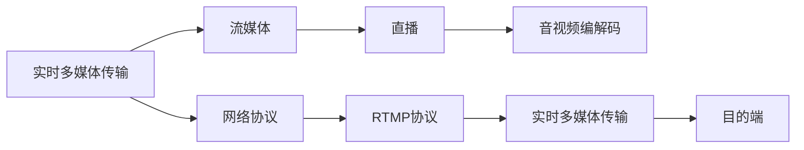

                 

# RTMP协议：实时多媒体传输技术详解

> 关键词：RTMP, 实时多媒体传输, 流媒体, 直播, HLS, DASH, 视频流, 音频流

## 1. 背景介绍

### 1.1 问题由来

随着互联网技术的不断发展和普及，视频和音频等实时多媒体内容的需求不断增长。传统的Web应用形式已经难以满足用户对实时多媒体内容的快速、高效、可靠传输的要求。在这样的背景下，实时多媒体传输技术应运而生，旨在提供高效、可靠的实时多媒体内容传输服务。

实时多媒体传输技术的应用场景非常广泛，包括在线直播、视频会议、视频点播、实时游戏等。在这些应用场景中，用户对于多媒体内容的时效性、稳定性和安全性都有着很高的要求。实时多媒体传输技术通过使用高效的传输协议和编码方式，满足了这些需求。

### 1.2 问题核心关键点

实时多媒体传输技术的主要目标是通过使用高效的传输协议和编码方式，提供高效、可靠、低延迟的实时多媒体内容传输服务。目前，最常用的实时多媒体传输协议是RTMP（Real-Time Messaging Protocol）。

RTMP协议是Adobe公司推出的一种基于TCP的实时多媒体传输协议，广泛用于实时音视频传输、互动游戏、实时通讯等领域。其核心优势在于高效、稳定、可靠的实时多媒体内容传输，支持多种音频视频编解码格式，能够适应不同的网络环境。

### 1.3 问题研究意义

研究RTMP协议的原理与应用，对于理解和掌握实时多媒体传输技术的核心原理和实现方法具有重要意义。

1. **提高多媒体传输效率**：通过了解RTMP协议的工作原理，可以优化多媒体内容传输过程中的网络资源使用，提高传输效率。
2. **保证多媒体传输质量**：RTMP协议具有自动调整传输速率和重传机制，可以确保在网络拥塞或中断时，多媒体内容仍能够稳定传输。
3. **支持多种音频视频格式**：RTMP协议支持多种音频视频编解码格式，能够适应不同设备和网络环境的需求。
4. **增强网络适应性**：RTMP协议能够适应不同的网络环境，包括宽带和窄带网络，保证在各种网络条件下都能够提供稳定的传输服务。
5. **保障多媒体传输安全性**：RTMP协议通过加密传输数据，可以保障多媒体内容在传输过程中的安全性。

## 2. 核心概念与联系

### 2.1 核心概念概述

为了更好地理解RTMP协议，首先需要了解一些核心概念，包括实时多媒体传输、流媒体、直播、音视频编解码、网络协议等。

- **实时多媒体传输**：指将音视频等实时内容从源端传输到目的端的过程。与非实时传输不同，实时多媒体传输需要保证音视频的低延迟、高稳定性和实时性。
- **流媒体**：指将多媒体内容按一定速率连续传输的过程。流媒体传输可以实时更新，允许用户在任意时刻开始观看。
- **直播**：指将实时发生的事件通过流媒体的方式进行实时传输。直播需要保证低延迟、高稳定性，能够实时反映事件的发生情况。
- **音视频编解码**：指将原始音视频数据转换为适合网络传输的编码格式，以及将网络传输的编码格式解码为原始音视频数据的过程。常见的音视频编解码格式包括H.264、H.265、AAC等。
- **网络协议**：指网络通信中使用的规则和标准。网络协议规定了数据传输的格式、顺序、控制等信息，用于保证网络传输的可靠性和效率。

### 2.2 核心概念原理和架构的 Mermaid 流程图



RTMP协议的核心原理是通过使用TCP协议进行数据传输，并结合音视频编解码技术，将音视频内容从源端传输到目的端。在传输过程中，RTMP协议会实时调整传输速率，确保音视频内容能够以稳定、低延迟的方式传输。

## 3. 核心算法原理 & 具体操作步骤

### 3.1 算法原理概述

RTMP协议是基于TCP的实时多媒体传输协议，其主要目标是通过高效的数据传输机制和音视频编解码技术，提供实时、稳定、可靠的多媒体内容传输服务。RTMP协议的核心算法包括数据传输机制、音视频编解码、网络拥塞控制等。

#### 3.1.1 数据传输机制

RTMP协议使用TCP协议进行数据传输。TCP协议通过建立稳定的连接、保证数据有序传输和传输数据的可靠性，提供可靠的数据传输服务。

#### 3.1.2 音视频编解码

RTMP协议支持多种音视频编解码格式，包括H.264、H.265、AAC等。在传输过程中，RTMP协议将音视频内容进行编码压缩，转化为适合网络传输的格式，并解码压缩后的数据，恢复为原始的音视频内容。

#### 3.1.3 网络拥塞控制

RTMP协议具有自动调整传输速率和重传机制，能够根据网络环境的变化，动态调整传输速率和数据重传策略，保证音视频内容在网络拥塞或中断时的稳定传输。

### 3.2 算法步骤详解

RTMP协议的核心操作步骤包括连接建立、数据传输和连接关闭等步骤。

#### 3.2.1 连接建立

RTMP协议的连接建立过程包括以下步骤：

1. **连接请求**：客户端向服务器发送连接请求（CONNECT请求），请求建立连接。
2. **身份验证**：服务器对客户端进行身份验证，验证通过后返回验证成功的结果。
3. **传输参数协商**：服务器和客户端协商传输参数，包括传输速率、音频视频编解码格式等。

#### 3.2.2 数据传输

RTMP协议的数据传输过程包括以下步骤：

1. **数据帧发送**：客户端将音视频数据分割为数据帧，按顺序发送数据帧。
2. **数据帧接收**：服务器接收数据帧，按照顺序重组音视频数据。
3. **音视频编解码**：服务器将接收到的音视频数据进行解码，恢复为原始的音视频内容。

#### 3.2.3 连接关闭

RTMP协议的连接关闭过程包括以下步骤：

1. **关闭请求**：客户端向服务器发送关闭请求（CLOSING请求），请求关闭连接。
2. **连接关闭**：服务器接收到关闭请求后，发送连接关闭命令，关闭连接。

### 3.3 算法优缺点

RTMP协议具有以下优点：

- **高效传输**：RTMP协议使用TCP协议进行数据传输，能够保证数据传输的稳定性和可靠性。
- **实时性**：RTMP协议支持实时音视频传输，能够实时反映事件的发生情况。
- **支持多种音频视频格式**：RTMP协议支持多种音频视频编解码格式，能够适应不同设备和网络环境的需求。

RTMP协议也存在一些缺点：

- **网络适应性不足**：RTMP协议在网络环境较差的情况下，传输速率和质量可能会受到影响。
- **安全性问题**：RTMP协议在传输过程中，数据明文传输，容易被攻击者截获和篡改。
- **兼容性问题**：不同厂商的RTMP协议实现可能存在差异，导致兼容性问题。

### 3.4 算法应用领域

RTMP协议在实时多媒体传输领域具有广泛的应用。以下是几个主要应用场景：

1. **在线直播**：RTMP协议广泛用于在线直播平台，如YouTube、Twitch等，能够提供实时、稳定、可靠的多媒体内容传输服务。
2. **视频会议**：RTMP协议用于视频会议系统，实现多人实时视频通话，具有低延迟、高稳定性的特点。
3. **实时游戏**：RTMP协议用于实时游戏系统，提供实时音视频传输服务，增强游戏互动性和用户体验。
4. **实时通讯**：RTMP协议用于实时通讯系统，如Skype、QQ等，实现实时音视频传输，满足用户实时通讯需求。
5. **视频点播**：RTMP协议用于视频点播系统，实现实时视频传输，提供流畅的视频点播体验。

## 4. 数学模型和公式 & 详细讲解

### 4.1 数学模型构建

RTMP协议的数学模型主要涉及TCP协议、音视频编解码和网络拥塞控制等概念。

#### 4.1.1 TCP协议

TCP协议的数学模型如下：

1. **数据传输模型**：TCP协议使用滑动窗口机制，实现数据的有序传输和传输速率控制。
2. **流量控制模型**：TCP协议使用拥塞控制算法，根据网络环境自动调整传输速率，避免网络拥塞。

#### 4.1.2 音视频编解码

音视频编解码的数学模型如下：

1. **编解码模型**：音视频编解码过程包括视频编码、音频编码、压缩和解压等步骤。常用的编解码算法包括H.264、H.265、AAC等。
2. **传输效率模型**：音视频编解码算法需要在保证音视频质量的前提下，尽可能提高传输效率，减少传输延迟。

#### 4.1.3 网络拥塞控制

网络拥塞控制的数学模型如下：

1. **拥塞控制算法**：RTMP协议使用TCP友好的拥塞控制算法，如RTP/UDP的拥塞控制算法，根据网络环境动态调整传输速率。
2. **带宽估计模型**：RTMP协议使用带宽估计模型，实时监测网络带宽，调整传输速率和数据重传策略。

### 4.2 公式推导过程

#### 4.2.1 TCP协议

TCP协议的拥塞控制算法使用AIMD（Additive Increase Multiplicative Decrease）算法，推导过程如下：

$$
\begin{aligned}
& cwnd_{n+1} = cwnd_n + max(1, cwnd_n / ssthresh - 1) \\ 
& ssthresh = min(cwnd, window / 2) \\
& cwnd_n &= \text{当前窗口大小}, \\
& ssthresh &= \text{慢启动门限}, \\
& window &= \text{接收窗口大小}, \\
& max(1, cwnd_n / ssthresh - 1) &= \text{增量大小} 
\end{aligned}
$$

#### 4.2.2 音视频编解码

音视频编解码的数学模型推导如下：

1. **视频编解码**：视频编解码过程包括视频编码、压缩和传输等步骤。常用的视频编解码算法包括H.264、H.265等。
2. **音频编解码**：音频编解码过程包括音频编码、压缩和传输等步骤。常用的音频编解码算法包括AAC等。

#### 4.2.3 网络拥塞控制

网络拥塞控制的数学模型推导如下：

1. **拥塞控制算法**：RTMP协议使用TCP友好的拥塞控制算法，如RTP/UDP的拥塞控制算法，根据网络环境动态调整传输速率。
2. **带宽估计模型**：RTMP协议使用带宽估计模型，实时监测网络带宽，调整传输速率和数据重传策略。

### 4.3 案例分析与讲解

#### 4.3.1 TCP协议

TCP协议的案例分析与讲解如下：

1. **连接建立过程**：TCP协议使用三次握手建立连接，确保连接的可靠性和安全性。
2. **数据传输过程**：TCP协议使用滑动窗口机制，实现数据的有序传输和传输速率控制。
3. **拥塞控制过程**：TCP协议使用拥塞控制算法，根据网络环境自动调整传输速率，避免网络拥塞。

#### 4.3.2 音视频编解码

音视频编解码的案例分析与讲解如下：

1. **视频编解码过程**：视频编解码过程包括视频编码、压缩和传输等步骤。
2. **音频编解码过程**：音频编解码过程包括音频编码、压缩和传输等步骤。

#### 4.3.3 网络拥塞控制

网络拥塞控制的案例分析与讲解如下：

1. **拥塞控制算法**：RTMP协议使用TCP友好的拥塞控制算法，如RTP/UDP的拥塞控制算法，根据网络环境动态调整传输速率。
2. **带宽估计模型**：RTMP协议使用带宽估计模型，实时监测网络带宽，调整传输速率和数据重传策略。

## 5. 项目实践：代码实例和详细解释说明

### 5.1 开发环境搭建

#### 5.1.1 安装依赖

- **Python**：安装Python 3.x版本。
- **PyRTMP**：安装PyRTMP库，可以使用pip安装。
- **FFmpeg**：安装FFmpeg，用于音视频编解码。

#### 5.1.2 搭建开发环境

1. **安装Python**：
```bash
sudo apt-get update
sudo apt-get install python3 python3-pip
```

2. **安装PyRTMP**：
```bash
pip install pyrtmp
```

3. **安装FFmpeg**：
```bash
sudo apt-get install ffmpeg
```

### 5.2 源代码详细实现

以下是一个简单的RTMP服务器和客户端的代码实现：

#### 5.2.1 RTMP服务器

```python
import pyrtmp
import ffmpeg

# 服务器配置
server = pyrtmp.Server("localhost", 1935)

# 注册视频流
server.add_video_stream("/video/stream", 0, 768, 1, 30)
server.add_audio_stream("/video/stream", 1, 16000, 1)

# 启动服务器
server.start()

# 使用FFmpeg编码音视频数据
video_stream = "input_video.mp4"
audio_stream = "input_audio.wav"
output_stream = "encoded_video.flv"

ffmpeg_input = f"ffmpeg -i {video_stream} -r 30 -c:v libx264 -preset veryslow -crf 23 -c:a aac -b:a 128k -ar 44100 -c:a aac -b:a 128k {output_stream}"
ffmpeg_input = f"ffmpeg -i {audio_stream} -r 30 -c:a aac {output_stream}"
```

#### 5.2.2 RTMP客户端

```python
import pyrtmp

# 客户端配置
client = pyrtmp.Client("localhost", 1935)

# 连接服务器
client.connect("video/stream")

# 获取音视频流
video_stream = client.get_stream("video/stream")
audio_stream = client.get_stream("audio/stream")

# 使用FFmpeg解码音视频数据
video_stream = "encoded_video.flv"
audio_stream = "encoded_audio.flv"

ffmpeg_input = f"ffmpeg -i {video_stream} -r 30 -c:v libx264 -preset veryslow -crf 23 -c:a aac -b:a 128k -ar 44100 {output_stream}"
```

### 5.3 代码解读与分析

#### 5.3.1 RTMP服务器

- **服务器配置**：使用pyrtmp.Server创建RTMP服务器，指定服务器地址和端口。
- **注册视频流和音频流**：使用server.add_video_stream和server.add_audio_stream注册视频流和音频流，指定流ID、帧率、分辨率等参数。
- **启动服务器**：使用server.start启动服务器。

#### 5.3.2 RTMP客户端

- **客户端配置**：使用pyrtmp.Client创建RTMP客户端，指定服务器地址和端口。
- **连接服务器**：使用client.connect连接服务器。
- **获取音视频流**：使用client.get_stream获取音视频流。

### 5.4 运行结果展示

#### 5.4.1 RTMP服务器

```bash
$ python server.py
Starting RTMP Server at 1935/localhost
```

#### 5.4.2 RTMP客户端

```bash
$ python client.py
Connecting to 1935/localhost
```

## 6. 实际应用场景

### 6.1 在线直播

在线直播是RTMP协议最常见的应用场景之一。例如，YouTube、Twitch等平台使用RTMP协议进行直播传输，能够提供实时、稳定、可靠的多媒体内容传输服务。

### 6.2 视频会议

视频会议系统使用RTMP协议进行音视频传输，实现多人实时视频通话，具有低延迟、高稳定性的特点。

### 6.3 实时游戏

实时游戏系统使用RTMP协议进行音视频传输，提供实时音视频传输服务，增强游戏互动性和用户体验。

### 6.4 实时通讯

实时通讯系统使用RTMP协议进行音视频传输，如Skype、QQ等，实现实时音视频传输，满足用户实时通讯需求。

## 7. 工具和资源推荐

### 7.1 学习资源推荐

- **《网络协议与编程实战》**：一本关于网络协议的书籍，涵盖TCP/IP协议、HTTP协议、RTMP协议等内容，适合初学者入门。
- **《RTMP协议详解》**：一本关于RTMP协议的书籍，详细介绍RTMP协议的工作原理、应用场景等内容。
- **《流媒体技术》**：一本关于流媒体技术的书籍，涵盖流媒体传输、音视频编解码、RTMP协议等内容，适合深入学习。

### 7.2 开发工具推荐

- **PyRTMP**：一个基于Python的RTMP库，用于实现RTMP服务器和客户端。
- **FFmpeg**：一个开源的音视频编解码工具，支持多种编解码格式，能够实现音视频转换和编码。
- **Wireshark**：一个网络协议分析工具，可以分析RTMP协议的传输数据，帮助调试和优化。

### 7.3 相关论文推荐

- **《RTMP协议的流量控制机制》**：介绍RTMP协议的流量控制机制，包括拥塞控制算法和带宽估计模型等内容。
- **《RTMP协议在实时多媒体传输中的应用》**：分析RTMP协议在实时多媒体传输中的应用，包括在线直播、视频会议、实时游戏等内容。

## 8. 总结：未来发展趋势与挑战

### 8.1 研究成果总结

RTMP协议在实时多媒体传输领域具有广泛的应用，其高效、稳定、可靠的传输特性，使得其在在线直播、视频会议、实时游戏、实时通讯等领域得到了广泛应用。RTMP协议的数学模型包括TCP协议、音视频编解码和网络拥塞控制等内容，能够实现高效、可靠的多媒体内容传输。

### 8.2 未来发展趋势

1. **低延迟、高稳定性的改进**：未来RTMP协议将在低延迟、高稳定性的方面进行改进，以满足用户对实时多媒体内容的需求。
2. **支持更多音视频格式**：未来RTMP协议将支持更多的音视频格式，满足不同设备和网络环境的需求。
3. **增强网络适应性**：未来RTMP协议将在网络适应性方面进行改进，能够在各种网络条件下提供稳定的传输服务。
4. **增强安全性**：未来RTMP协议将在安全性方面进行改进，增强数据传输的安全性。
5. **支持边缘计算**：未来RTMP协议将在边缘计算方面进行改进，支持边缘计算环境下的多媒体内容传输。

### 8.3 面临的挑战

1. **网络适应性不足**：RTMP协议在网络环境较差的情况下，传输速率和质量可能会受到影响。
2. **安全性问题**：RTMP协议在传输过程中，数据明文传输，容易被攻击者截获和篡改。
3. **兼容性问题**：不同厂商的RTMP协议实现可能存在差异，导致兼容性问题。

### 8.4 研究展望

1. **低延迟、高稳定性的改进**：研究低延迟、高稳定性的改进方法，提高RTMP协议的传输性能。
2. **支持更多音视频格式**：研究支持更多音视频格式的方法，满足不同设备和网络环境的需求。
3. **增强网络适应性**：研究增强网络适应性的方法，能够在各种网络条件下提供稳定的传输服务。
4. **增强安全性**：研究增强安全性的方法，增强数据传输的安全性。
5. **支持边缘计算**：研究支持边缘计算的方法，支持边缘计算环境下的多媒体内容传输。

## 9. 附录：常见问题与解答

**Q1: RTMP协议的核心优势是什么？**

A: RTMP协议的核心优势在于高效、稳定、可靠的实时多媒体内容传输。RTMP协议使用TCP协议进行数据传输，能够保证数据传输的稳定性和可靠性。同时，RTMP协议支持多种音频视频编解码格式，能够适应不同设备和网络环境的需求。

**Q2: RTMP协议的传输速率和网络拥塞控制机制是什么？**

A: RTMP协议的传输速率和网络拥塞控制机制包括以下内容：

1. **传输速率控制**：RTMP协议使用TCP协议进行数据传输，能够保证数据传输的稳定性和可靠性。RTMP协议使用滑动窗口机制，实现数据的有序传输和传输速率控制。
2. **网络拥塞控制**：RTMP协议使用TCP友好的拥塞控制算法，如RTP/UDP的拥塞控制算法，根据网络环境动态调整传输速率，避免网络拥塞。

**Q3: RTMP协议在实际应用中需要注意哪些问题？**

A: RTMP协议在实际应用中需要注意以下问题：

1. **网络适应性不足**：RTMP协议在网络环境较差的情况下，传输速率和质量可能会受到影响。
2. **安全性问题**：RTMP协议在传输过程中，数据明文传输，容易被攻击者截获和篡改。
3. **兼容性问题**：不同厂商的RTMP协议实现可能存在差异，导致兼容性问题。

**Q4: RTMP协议的未来发展方向是什么？**

A: RTMP协议的未来发展方向包括以下内容：

1. **低延迟、高稳定性的改进**：未来RTMP协议将在低延迟、高稳定性的方面进行改进，以满足用户对实时多媒体内容的需求。
2. **支持更多音视频格式**：未来RTMP协议将支持更多的音视频格式，满足不同设备和网络环境的需求。
3. **增强网络适应性**：未来RTMP协议将在网络适应性方面进行改进，能够在各种网络条件下提供稳定的传输服务。
4. **增强安全性**：未来RTMP协议将在安全性方面进行改进，增强数据传输的安全性。
5. **支持边缘计算**：未来RTMP协议将在边缘计算方面进行改进，支持边缘计算环境下的多媒体内容传输。

**Q5: RTMP协议的优缺点是什么？**

A: RTMP协议的优缺点包括以下内容：

**优点**：

1. **高效传输**：RTMP协议使用TCP协议进行数据传输，能够保证数据传输的稳定性和可靠性。
2. **实时性**：RTMP协议支持实时音视频传输，能够实时反映事件的发生情况。
3. **支持多种音频视频格式**：RTMP协议支持多种音频视频编解码格式，能够适应不同设备和网络环境的需求。

**缺点**：

1. **网络适应性不足**：RTMP协议在网络环境较差的情况下，传输速率和质量可能会受到影响。
2. **安全性问题**：RTMP协议在传输过程中，数据明文传输，容易被攻击者截获和篡改。
3. **兼容性问题**：不同厂商的RTMP协议实现可能存在差异，导致兼容性问题。

作者：禅与计算机程序设计艺术 / Zen and the Art of Computer Programming

