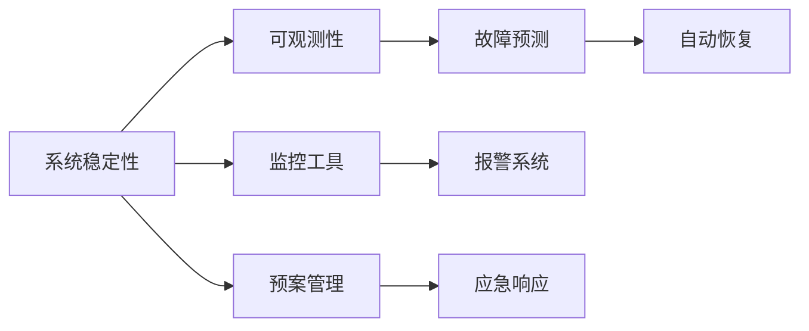

                 

# SRE（站点可靠性工程）：确保系统稳定性

> 关键词：SRE, 站点可靠性工程, 系统稳定性, 可观测性, 故障预测, 自动恢复, 监控工具

## 1. 背景介绍

随着互联网技术的飞速发展，站点可靠性和系统稳定性成为企业IT系统设计中不可忽视的关键环节。传统运维团队面临着巨大压力，需要投入大量人力物力保障业务稳定运行。SRE（站点可靠性工程）的提出，为大规模IT系统的稳定运行提供了新的方法和实践。本文将系统介绍SRE的基本概念、核心原则、关键技术和具体应用场景，帮助读者全面了解SRE的内涵和实际价值。

## 2. 核心概念与联系

### 2.1 核心概念概述

- **SRE（站点可靠性工程）**：一种将运维与开发相结合的实践方法，旨在提升IT系统的可靠性，减少宕机时间，提高用户体验。

- **系统稳定性**：指IT系统在面对不同压力情况下，能够持续可靠地运行，确保业务连续性和数据完整性。

- **可观测性**：通过系统监控、日志分析、异常检测等手段，实时掌握系统运行状态，及时发现和处理问题。

- **故障预测**：基于历史数据和系统行为，预测未来可能出现的故障，提前采取措施进行预防。

- **自动恢复**：通过自动化工具和预定义规则，在系统发生故障后快速自动恢复，最小化宕机时间。

- **监控工具**：用于实时监测系统性能、日志、网络状态等，为SRE提供关键数据支撑。

这些核心概念相互关联，共同构成了SRE系统的理论基础。通过系统性的分析、设计和实施，企业可以构建更加稳定、可靠、高效的IT基础设施。

### 2.2 核心概念原理和架构的 Mermaid 流程图(Mermaid 流程节点中不要有括号、逗号等特殊字符)



这个流程图展示了SRE系统的主要架构和关键流程：

1. **系统稳定性**是SRE的最终目标，需要通过**可观测性**进行实时监测。
2. **故障预测**基于历史数据和系统行为，识别潜在问题，预警给运营团队。
3. **自动恢复**在故障发生后，迅速采取预定义措施，快速恢复服务。
4. **监控工具**是可观测性的实现手段，通过收集和分析数据，提供实时的系统运行状态。
5. **报警系统和预案管理**配合故障预测和自动恢复，确保在问题发生时能够及时响应和处理。

## 3. 核心算法原理 & 具体操作步骤

### 3.1 算法原理概述

SRE的实现涉及多种算法和技术手段，核心目标是通过自动化和数据驱动的方法，提升系统稳定性和可靠性。以下是SRE核心算法的基本原理：

- **时间序列分析**：通过对系统指标（如请求数、响应时间、错误率等）进行时间序列分析，识别出异常模式，为故障预测提供依据。
- **机器学习算法**：利用监督学习、无监督学习等机器学习算法，分析历史数据，预测未来故障，提高故障预测的准确性。
- **异常检测**：通过统计学方法和机器学习算法，识别出系统中的异常行为，及时发出告警。
- **自动化工具链**：结合配置管理、版本控制、持续集成等自动化工具，实现系统的高效部署和维护。

### 3.2 算法步骤详解

1. **数据采集**：收集系统运行中的各项指标和日志，包括请求数、响应时间、错误率、内存使用情况、磁盘I/O等。
2. **数据清洗与处理**：对采集到的数据进行清洗和处理，去除噪音和异常值，确保数据质量。
3. **模型训练与部署**：利用时间序列分析、机器学习等算法，对数据进行建模，训练预测模型，并部署到生产环境中。
4. **实时监控与告警**：通过监控工具和报警系统，实时监测系统状态，当指标超出预设阈值时，及时发出告警。
5. **故障预测与预防**：基于历史数据和系统行为，进行故障预测，提前采取预防措施。
6. **自动恢复与回滚**：在故障发生后，迅速启动自动恢复流程，并根据预定义的恢复策略，进行系统回滚。
7. **应急响应与预案管理**：在问题发生后，根据预案进行快速响应，确保业务连续性。

### 3.3 算法优缺点

**优点**：

- **提升系统稳定性**：通过自动化和数据驱动的方法，减少人为错误，提高系统可靠性。
- **降低运营成本**：通过系统自愈和自动化流程，减少人力投入，提升效率。
- **增强用户体验**：系统的高可用性和快速恢复能力，直接提升用户满意度。

**缺点**：

- **复杂度高**：系统设计和实施需要涉及多个环节，复杂度高，难度大。
- **依赖数据质量**：系统稳定性和可靠性依赖于高质量的数据，数据质量和处理水平对系统表现有重要影响。
- **前期投入大**：初期需要投入大量资源进行工具选择、数据采集、模型训练等工作。

### 3.4 算法应用领域

SRE的应用领域非常广泛，覆盖了互联网企业的各个方面，包括但不限于：

- **Web应用**：通过实时监控、异常检测、故障预测等手段，保障网站的高可用性。
- **云服务**：利用自动恢复和预案管理，确保云服务的高可靠性，快速应对各种故障。
- **大数据**：通过自动化工具和监控工具，保障大数据系统的高性能和数据完整性。
- **物联网**：利用可观测性技术，实时监控设备状态，预测设备故障，提升物联网系统的稳定性。
- **人工智能**：通过自动化工具和故障预测，确保AI模型的持续稳定运行。

## 4. 数学模型和公式 & 详细讲解 & 举例说明（备注：数学公式请使用latex格式，latex嵌入文中独立段落使用 $$，段落内使用 $)

### 4.1 数学模型构建

SRE的数学模型构建主要涉及时间序列分析和机器学习模型，以下是具体的数学模型构建过程：

- **时间序列分析**：假设系统指标 $y_t$ 是时间 $t$ 的函数，可以表示为 $y_t = f(y_{t-1}, u_t, \epsilon_t)$，其中 $f$ 是线性或非线性函数，$u_t$ 是外生冲击，$\epsilon_t$ 是随机误差。

- **机器学习模型**：利用监督学习算法（如线性回归、决策树、随机森林等）对历史数据进行训练，构建预测模型 $y_{t+1} = g(y_t, X_t, \theta)$，其中 $g$ 是预测函数，$X_t$ 是特征向量，$\theta$ 是模型参数。

### 4.2 公式推导过程

以时间序列分析中的ARIMA模型为例，推导其基本公式：

$$
ARIMA(p,d,q)(P,D,Q)[S]^{c}
$$

其中，$p$ 是自回归项数，$d$ 是差分阶数，$q$ 是移动平均项数，$P$ 是季节性自回归项数，$D$ 是季节性差分阶数，$Q$ 是季节性移动平均项数，$S$ 是季节性周期长度，$c$ 是季节性周期因子。

具体公式推导过程如下：

1. **自回归模型**：

$$
y_t = \phi_1 y_{t-1} + \phi_2 y_{t-2} + ... + \phi_p y_{t-p} + u_t
$$

2. **差分模型**：

$$
\Delta y_t = \theta_1 \Delta y_{t-1} + ... + \theta_d \Delta y_{t-d}
$$

3. **移动平均模型**：

$$
u_t = \psi_1 u_{t-1} + \psi_2 u_{t-2} + ... + \psi_q u_{t-q}
$$

4. **季节性模型**：

$$
y_t = \Phi_1 y_{t-D} + \Phi_2 y_{t-2D} + ... + \Phi_P y_{t-pD} + \Psi_t \psi_{t-1} + ... + \Psi_Q \psi_{t-Q}
$$

其中，$\phi_i$、$\theta_j$、$\psi_k$ 是模型参数。

### 4.3 案例分析与讲解

以Twitter为例，展示如何利用SRE技术保障其系统的稳定性：

- **数据采集**：Twitter通过Prometheus等监控工具，实时采集系统指标，包括请求数、响应时间、错误率等。
- **数据清洗与处理**：对采集到的数据进行清洗和处理，去除噪音和异常值，确保数据质量。
- **模型训练与部署**：利用ARIMA模型，对数据进行建模，训练预测模型，并部署到生产环境中。
- **实时监控与告警**：通过Grafana等工具，实时监测系统状态，当指标超出预设阈值时，及时发出告警。
- **故障预测与预防**：基于历史数据和系统行为，进行故障预测，提前采取预防措施。
- **自动恢复与回滚**：在故障发生后，迅速启动自动恢复流程，并根据预定义的恢复策略，进行系统回滚。
- **应急响应与预案管理**：在问题发生后，根据预案进行快速响应，确保业务连续性。

## 5. 项目实践：代码实例和详细解释说明

### 5.1 开发环境搭建

在进行SRE实践前，我们需要准备好开发环境。以下是使用Python进行Prometheus和Grafana开发的环境配置流程：

1. 安装Anaconda：从官网下载并安装Anaconda，用于创建独立的Python环境。

2. 创建并激活虚拟环境：
```bash
conda create -n prometheus-env python=3.8 
conda activate prometheus-env
```

3. 安装Prometheus和Grafana：
```bash
conda install prometheus prometheus-alertmanager
conda install grafana grafana-app
```

4. 安装相关库：
```bash
pip install prometheus-client
pip install grafana-api-client
```

完成上述步骤后，即可在`prometheus-env`环境中开始SRE实践。

### 5.2 源代码详细实现

这里我们以Prometheus为例，展示如何构建SRE系统：

首先，定义Prometheus的配置文件`prometheus.yml`：

```yaml
global:
  scrape_interval: 1m
  evaluation_interval: 1m
  scrape_timeout: 10s
  external_labels:
    prometheus: k8s
alerting:
  alertmanagers:
    - static_configs:
        - alertmanager_webex_config: http://localhost:9093
```

接着，启动Prometheus和Grafana服务：

```bash
prometheus --config.file=prometheus.yml
grafana-server --config.servers.http.httpAddr=:3000 --config.paths.web = grafana/dashboards
```

最后，使用Prometheus提供的API，实时查询和展示系统状态：

```python
from prometheus_client import Gauge, Counter

metric = Gauge('web_request_duration_seconds', 'Duration of HTTP requests', ['status_code'])
counter = Counter('web_request_count', 'Number of HTTP requests')

def handle_request(status_code):
    metric.labels(status_code).set(request.duration)
    counter.labels(status_code).inc()

# 注册处理函数
handle_request.register(handle_request)

# 启动Flask应用
app = Flask(__name__)
```

### 5.3 代码解读与分析

让我们再详细解读一下关键代码的实现细节：

**Prometheus配置文件**：
- `global`部分定义了Scrape时间间隔、Evaluation时间间隔、Scrape超时时间等全局参数。
- `alerting`部分定义了Alertmanager的地址和监控指标的报警规则。

**Gauge和Counter对象**：
- `Gauge`用于度量值，在配置文件中定义，表示HTTP请求的持续时间。
- `Counter`用于计数，在代码中定义，表示HTTP请求的数量。

**处理函数**：
- `handle_request`函数在接收到HTTP请求后，根据状态码更新Gauge和Counter的值。

**Flask应用**：
- 通过Flask搭建Web应用，接收HTTP请求，并调用处理函数。

## 6. 实际应用场景

### 6.1 互联网公司

对于互联网公司，SRE的应用场景非常广泛。以Google为例，SRE通过自动化和数据驱动的方法，保障了其各类服务的稳定性：

- **Web服务**：通过实时监控、异常检测和故障预测，保障网站的高可用性。
- **云平台**：利用自动恢复和预案管理，确保云服务的高可靠性，快速应对各种故障。
- **大数据处理**：通过自动化工具和监控工具，保障大数据系统的高性能和数据完整性。

### 6.2 金融行业

金融行业对系统稳定性有着极高的要求，SRE的应用可以有效提升其系统的可靠性：

- **交易系统**：通过实时监控和异常检测，保障交易系统的稳定运行。
- **风控系统**：利用故障预测和自动恢复，及时发现和处理系统故障，确保风险控制模型的稳定运行。
- **客户服务**：通过自动化工具和预案管理，提升客户服务的可用性和响应速度。

### 6.3 电信运营商

电信运营商提供的服务具有高可用性要求，SRE的应用可以显著提升其系统的稳定性：

- **移动网络**：通过实时监控和异常检测，保障移动网络的稳定运行。
- **固网服务**：利用故障预测和自动恢复，及时发现和处理系统故障，确保固网服务的可靠性和连续性。
- **运营支撑系统**：通过自动化工具和预案管理，提升运营支撑系统的效率和可靠性。

## 7. 工具和资源推荐

### 7.1 学习资源推荐

为了帮助开发者系统掌握SRE的理论基础和实践技巧，这里推荐一些优质的学习资源：

1. **《站点可靠性工程》系列书籍**：由SRE专家撰写，详细介绍了SRE的基本概念、核心原则和实际应用。
2. **SRE Tutorials by Google**：Google官方提供的SRE教程，涵盖时间序列分析、机器学习等关键技术。
3. **《站点可靠性工程实践指南》**：SRE领域的实践指南，提供详细的SRE系统设计和实施方案。
4. **Prometheus文档和社区**：Prometheus的官方文档和社区资源，提供了丰富的案例和实践经验。
5. **Grafana官方文档和社区**：Grafana的官方文档和社区资源，提供了详细的配置和管理指南。

通过对这些资源的学习实践，相信你一定能够快速掌握SRE的精髓，并用于解决实际的系统稳定性问题。

### 7.2 开发工具推荐

高效的开发离不开优秀的工具支持。以下是几款用于SRE开发的常用工具：

1. **Prometheus**：开源监控系统，用于实时监测系统指标和告警。
2. **Grafana**：开源仪表板工具，用于实时展示系统状态和告警信息。
3. **Kubernetes**：容器编排系统，用于自动化部署和扩展SRE系统。
4. **Jaeger**：分布式追踪系统，用于分析和诊断系统故障。
5. **Prometheus Alertmanager**：告警管理工具，用于集中处理和分发告警信息。
6. **Grafana API Client**：用于集成Grafana的Python API，实现自动化告警和数据展示。

合理利用这些工具，可以显著提升SRE任务的开发效率，加快创新迭代的步伐。

### 7.3 相关论文推荐

SRE的发展源于学界的持续研究。以下是几篇奠基性的相关论文，推荐阅读：

1. **《站点可靠性工程：DevOps时代的新实践》**：介绍了SRE的基本概念和实现方法，探讨了DevOps与SRE的关系。
2. **《站点可靠性工程：从设计到实施》**：详细介绍了SRE系统的设计和实施方案，提供了大量实践案例。
3. **《自动化运维：SRE的崛起》**：探讨了自动化运维在SRE中的应用，介绍了常用的自动化工具和流程。
4. **《基于时间序列分析的故障预测技术》**：介绍了时间序列分析的基本方法和应用场景，提供了多个实际案例。
5. **《机器学习在SRE中的应用》**：讨论了机器学习在SRE中的应用，包括异常检测、故障预测等。

这些论文代表了大语言模型微调技术的发展脉络。通过学习这些前沿成果，可以帮助研究者把握学科前进方向，激发更多的创新灵感。

## 8. 总结：未来发展趋势与挑战

### 8.1 研究成果总结

本文对SRE的基本概念、核心原则、关键技术和具体应用场景进行了全面系统的介绍。通过系统性的分析、设计和实施，企业可以构建更加稳定、可靠、高效的IT基础设施。SRE的实践方法已经被广泛应用于各类大型企业，显著提升了系统稳定性和运营效率。

### 8.2 未来发展趋势

展望未来，SRE将呈现以下几个发展趋势：

1. **自动化程度提升**：随着AI和大数据技术的应用，SRE将进一步自动化，减少人工干预，提升效率。
2. **智能化水平提高**：利用机器学习等技术，进行更精准的故障预测和自动恢复。
3. **跨领域融合**：SRE将与其他IT技术如DevOps、云原生等进行深度融合，形成更加一体化、高效的系统。
4. **实时性增强**：通过云计算和边缘计算等技术，提升SRE系统的实时性和响应速度。
5. **安全性强化**：利用加密、认证等技术，提升SRE系统的安全性，确保业务连续性。

### 8.3 面临的挑战

尽管SRE已经取得了显著成效，但在迈向更加智能化、普适化应用的过程中，仍面临诸多挑战：

1. **复杂度增加**：SRE系统设计复杂，涉及多种工具和流程，需要较高的技术水平。
2. **数据依赖性强**：SRE系统的可靠性依赖于高质量的数据，数据采集和处理水平对系统表现有重要影响。
3. **前期投入大**：初期需要投入大量资源进行工具选择、数据采集、模型训练等工作。
4. **技术更新快**：SRE领域技术更新快速，需要持续学习和跟进最新的技术动态。
5. **跨部门协同**：SRE需要跨部门协同，涉及开发、运维、安全等多个团队，协同难度大。

### 8.4 研究展望

面对SRE面临的挑战，未来的研究需要在以下几个方面寻求新的突破：

1. **简化工具链**：开发更加易用、高效的工具，降低SRE系统设计和实施的难度。
2. **提升数据质量**：通过数据清洗和预处理技术，提升数据质量，增强SRE系统的可靠性。
3. **自动化与智能化结合**：利用自动化和智能化技术，提升SRE系统的效率和精确度。
4. **跨领域融合**：与其他IT技术如DevOps、云原生进行深度融合，形成更加一体化、高效的系统。
5. **安全性和隐私保护**：加强SRE系统的安全性，确保业务连续性和数据隐私。

## 9. 附录：常见问题与解答

**Q1：SRE的实现是否需要投入大量人力？**

A: SRE的实现需要投入一定的人力，但相较于传统的运维模式，其自动化和数据驱动的特点，可以在一定程度上减少人工干预，提升效率。随着技术的进步，SRE系统将更加智能化，对人力需求将进一步减少。

**Q2：SRE是否适用于所有企业？**

A: SRE适用于任何需要保障系统稳定性的企业，但不同的企业在设计和实施SRE系统时需要根据自身特点进行调整。对于小型企业，可以逐步引入SRE理念和技术，逐步优化运维流程。

**Q3：SRE的实施周期通常需要多久？**

A: SRE的实施周期因企业规模和技术水平而异。一般来说，大型企业的SRE系统设计和实施可能需要数月甚至数年时间。对于中小型企业，可以先从简单的自动化任务开始，逐步引入更复杂的SRE功能。

**Q4：SRE实施过程中需要注意哪些风险？**

A: SRE实施过程中需要注意的风险包括但不限于：数据质量问题、工具选择不当、流程复杂、跨部门协同困难等。需要系统性地评估和规划，制定详细的实施计划，并在实施过程中持续优化和调整。

**Q5：如何评估SRE系统的效果？**

A: SRE系统的评估可以通过以下几个指标进行：系统宕机时间、告警响应时间、问题处理时间、用户体验满意度等。通过定量和定性的分析，评估SRE系统对系统稳定性和用户体验的提升效果。

---

作者：禅与计算机程序设计艺术 / Zen and the Art of Computer Programming

