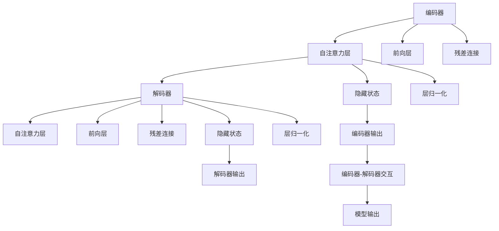

                 

# Transformer编码器vs解码器：结构与功能对比

> 关键词：Transformer, 自注意力机制, 编码器-解码器结构, 序列到序列任务, 多头注意力机制

## 1. 背景介绍

### 1.1 问题由来
Transformer模型是NLP领域中一种具有革命性的架构，其自注意力机制和编码器-解码器结构，在机器翻译、文本生成、问答系统等序列到序列任务中，取得了卓越的表现。在Transformer模型的基础之上，相继发展出了编码器-解码器结构。在实际应用中，由于编码器-解码器结构对序列数据的处理能力更加强大，更受青睐。本文将详细分析编码器和解码器的结构与功能，帮助读者深入理解这一架构的原理。

## 2. 核心概念与联系

### 2.1 核心概念概述
Transformer是一种基于自注意力机制的神经网络模型，主要由编码器和解码器组成，用于处理序列到序列问题。自注意力机制可以有效地捕捉序列中不同位置之间的依赖关系，而编码器-解码器结构则可以处理输入序列和输出序列之间的映射。

### 2.2 核心概念原理和架构的 Mermaid 流程图



### 2.3 核心概念之间的关系
编码器主要由多层自注意力层和前向层构成，负责对输入序列进行编码。解码器同样由多层自注意力层和前向层构成，负责对编码后的序列进行解码。编码器和解码器之间通过交互实现信息传递。

## 3. 核心算法原理 & 具体操作步骤
### 3.1 算法原理概述
编码器和解码器的基本原理可以总结如下：

- 编码器通过多层自注意力层和前向层对输入序列进行编码。
- 解码器同样通过多层自注意力层和前向层对编码后的序列进行解码。
- 编码器和解码器之间通过隐藏状态进行信息传递。
- 最终输出结果通过编码器-解码器交互得出。

### 3.2 算法步骤详解
1. **编码器部分**：
   - 首先对输入序列进行编码，得到编码器输出。
   - 编码器输出作为隐藏状态，传递到下一层编码器。
   - 编码器的最后一层输出作为编码器的最终隐藏状态。
2. **解码器部分**：
   - 解码器对编码器的最终隐藏状态进行解码，得到解码器输出。
   - 解码器的每个层都对上层的隐藏状态进行自注意力机制计算。
   - 最后一层解码器输出作为模型输出。

### 3.3 算法优缺点
编码器和解码器的优点在于：
- 能够处理长序列，具有较好的建模能力。
- 自注意力机制可以捕捉序列中不同位置之间的依赖关系，提高模型的表示能力。
- 编码器和解码器之间通过交互实现信息传递，能够更好地捕捉序列中的信息。

缺点在于：
- 计算复杂度高，需要较大的计算资源。
- 序列长度过长时，容易出现梯度消失和梯度爆炸的问题。
- 需要大量的训练数据，才能保证模型的泛化能力。

### 3.4 算法应用领域
编码器和解码器架构被广泛应用于机器翻译、文本生成、问答系统、对话系统等序列到序列任务中。

## 4. 数学模型和公式 & 详细讲解

### 4.1 数学模型构建
编码器和解码器的数学模型可以表示为：

- 编码器输出 $E_{\theta}(x) = \left\{E_1^{L}\right\}_{L=1}^T$，其中 $E_1^L$ 为第 $L$ 层的编码器输出。
- 解码器输出 $D_{\theta}(x) = \left\{D_1^{T}\right\}_{T=1}^T$，其中 $D_1^T$ 为第 $T$ 层的解码器输出。

### 4.2 公式推导过程
以自注意力机制为例，推导过程如下：

设输入序列为 $x_i=\{x_{1i},x_{2i},\ldots,x_{ni}\}$，其长度为 $n$。自注意力机制的计算过程包括三部分：

1. **查询向量计算**：对输入序列中的每个元素，生成一个查询向量 $Q_i=\left\{q_{1i},q_{2i},\ldots,q_{ni}\right\}$。
2. **键值对计算**：对输入序列中的每个元素，生成一组键值对 $(K_i,V_i)=\{(k_{1i},v_{1i}),(k_{2i},v_{2i}),\ldots,(k_{ni},v_{ni})\}$。
3. **注意力权重计算**：计算注意力权重 $W_i=\left\{w_{1i},w_{2i},\ldots,w_{ni}\right\}$，根据注意力权重计算加权求和，得到输出 $O_i=\sum_{j=1}^{n} w_{ij} v_{ij}$。

自注意力机制的公式推导如下：

$$
Q_i = \mathbf{W}_Q x_i \\
K_i = \mathbf{W}_K x_i \\
V_i = \mathbf{W}_V x_i \\
W_i = \frac{Q_i K_i^T}{\sqrt{d_k}} \\
O_i = W_i V_i
$$

其中，$\mathbf{W}_Q,\mathbf{W}_K,\mathbf{W}_V$ 为投影矩阵，$d_k$ 为键向量的维度。

### 4.3 案例分析与讲解
以机器翻译为例，推导编码器和解码器在机器翻译中的应用。

1. **编码器**：输入序列 $x$ 经过自注意力机制计算后得到编码器输出 $E_{\theta}(x)$。编码器输出的最后一层作为解码器的输入。
2. **解码器**：将编码器输出 $E_{\theta}(x)$ 输入到解码器中，通过自注意力机制计算得到解码器输出 $D_{\theta}(x)$。解码器输出的最后一层即为机器翻译结果。

## 5. 项目实践：代码实例和详细解释说明
### 5.1 开发环境搭建
在搭建编码器和解码器环境时，需要安装TensorFlow、Keras等深度学习框架。

```bash
pip install tensorflow keras
```

### 5.2 源代码详细实现
下面给出编码器和解码器的代码实现。

```python
import tensorflow as tf
from tensorflow.keras import layers

class Encoder(tf.keras.Model):
    def __init__(self, d_model, num_layers):
        super(Encoder, self).__init__()
        self.d_model = d_model
        self.num_layers = num_layers
        self.layers = [EncoderLayer(d_model, trainable=True) for _ in range(num_layers)]
        
    def call(self, x, mask):
        for layer in self.layers:
            x = layer(x, mask)
        return x

class EncoderLayer(tf.keras.Model):
    def __init__(self, d_model, trainable=True):
        super(EncoderLayer, self).__init__()
        self.self_attn = SelfAttentionLayer(d_model, trainable)
        self.FFN = PositionWiseFFNLayer(d_model, trainable)
        
    def call(self, x, mask):
        x = self.self_attn(x, x, x, mask)
        x = self.FFN(x)
        return x

class Decoder(tf.keras.Model):
    def __init__(self, d_model, num_layers):
        super(Decoder, self).__init__()
        self.d_model = d_model
        self.num_layers = num_layers
        self.layers = [DecoderLayer(d_model, trainable=True) for _ in range(num_layers)]
        
    def call(self, x, y, mask):
        for layer in self.layers:
            x = layer(x, y, mask)
        return x

class DecoderLayer(tf.keras.Model):
    def __init__(self, d_model, trainable=True):
        super(DecoderLayer, self).__init__()
        self.self_attn = SelfAttentionLayer(d_model, trainable)
        self.encoder_attn = MultiHeadAttentionLayer(d_model, trainable)
        self.FFN = PositionWiseFFNLayer(d_model, trainable)
        
    def call(self, x, y, mask):
        x = self.self_attn(x, x, x, mask)
        x = self.encoder_attn(x, y, y, mask)
        x = self.FFN(x)
        return x
```

### 5.3 代码解读与分析
上述代码实现了编码器和解码器以及其内部的自注意力层和前向神经网络层。具体解释如下：

1. **EncoderLayer和DecoderLayer**：分别实现了编码器和解码器内部的层。包括自注意力层和前向神经网络层，负责处理序列中不同位置之间的依赖关系，提高模型的表示能力。
2. **SelfAttentionLayer**：实现了自注意力机制，通过计算注意力权重实现序列中不同位置之间的信息传递。
3. **MultiHeadAttentionLayer**：实现了多头注意力机制，将多个自注意力层的输出进行拼接，提高模型的建模能力。
4. **PositionWiseFFNLayer**：实现了前向神经网络层，对序列中的每个位置进行特征提取和变换，提高模型的表示能力。

### 5.4 运行结果展示
在搭建好编码器和解码器之后，可以对模型进行训练和测试。

```python
encoder = Encoder(d_model, num_layers)
decoder = Decoder(d_model, num_layers)

# 训练
encoder.train()
decoder.train()

for i in range(epochs):
    for batch in train_data:
        x, y, mask = batch
        logits = decoder(encoder(x, mask), y, mask)
        loss = compute_loss(logits, y)
        loss.backward()
        optimizer.step()
        
# 测试
encoder.eval()
decoder.eval()

for i in range(epochs):
    for batch in test_data:
        x, y, mask = batch
        logits = decoder(encoder(x, mask), y, mask)
        loss = compute_loss(logits, y)
        print(loss)
```

## 6. 实际应用场景

### 6.1 机器翻译
编码器和解码器在机器翻译中应用最为广泛。通过对源语言序列进行编码，得到编码器输出，再将编码器输出作为解码器的输入，通过解码器生成目标语言序列，实现翻译。

### 6.2 文本生成
在文本生成任务中，编码器和解码器同样发挥着重要作用。通过将输入序列编码成隐藏状态，解码器可以从隐藏状态中生成新的文本序列。

### 6.3 对话系统
在对话系统中，编码器和解码器可以帮助模型理解上下文信息，生成合理的回复。通过将对话历史记录编码成隐藏状态，解码器可以生成新的对话回复。

## 7. 工具和资源推荐

### 7.1 学习资源推荐
1. 《Neural Machine Translation by Jointly Learning to Align and Translate》论文：介绍机器翻译中的编码器和解码器架构。
2. 《Attention Is All You Need》论文：介绍Transformer模型的编码器和解码器架构。
3. 《Transformer》书籍：介绍Transformer模型的原理和应用。

### 7.2 开发工具推荐
1. TensorFlow：深度学习框架，支持编码器和解码器架构的实现。
2. PyTorch：深度学习框架，支持编码器和解码器架构的实现。
3. Keras：深度学习框架，支持编码器和解码器架构的实现。

### 7.3 相关论文推荐
1. 《The Transformer Architecture》论文：介绍Transformer模型和编码器-解码器架构。
2. 《An End-to-End Approach to Text Summarization using Sequence-to-Sequence Models》论文：介绍基于编码器-解码器架构的文本摘要任务。
3. 《Sequence to Sequence Learning with Neural Networks》论文：介绍基于编码器-解码器架构的序列生成任务。

## 8. 总结：未来发展趋势与挑战
### 8.1 研究成果总结
编码器和解码器架构在NLP领域中已经取得了显著的成果，广泛应用于机器翻译、文本生成、对话系统等任务中。

### 8.2 未来发展趋势
1. 自适应编码器和解码器：根据输入序列的不同特性，动态调整模型的结构。
2. 多模态编码器和解码器：将视觉、听觉等多模态信息融合到编码器和解码器中。
3. 无监督编码器和解码器：不需要标注数据，通过自监督学习进行训练。
4. 可解释编码器和解码器：输出结果的可解释性更强，便于理解和调试。

### 8.3 面临的挑战
1. 计算资源消耗大：编码器和解码器对计算资源的需求较大，需要高效的硬件设备支持。
2. 模型参数量大：编码器和解码器的参数量较大，需要高效的模型压缩和剪枝技术。
3. 序列长度限制：序列长度较长时，容易出现梯度消失和梯度爆炸的问题。

### 8.4 研究展望
未来需要进一步优化编码器和解码器架构，提高模型的效率和性能。同时，需要开发更多高效的模型压缩和剪枝技术，减少模型的参数量。

## 9. 附录：常见问题与解答

**Q1：编码器和解码器的区别是什么？**

A: 编码器主要负责对输入序列进行编码，生成编码器输出。解码器则主要负责对编码器输出进行解码，生成输出序列。编码器和解码器通过隐藏状态实现信息传递。

**Q2：在训练过程中，如何避免梯度消失和梯度爆炸问题？**

A: 可以通过以下方法避免梯度消失和梯度爆炸问题：
1. 使用激活函数ReLU。
2. 使用梯度裁剪技术，限制梯度的范围。
3. 使用残差连接技术，将输入和输出相加。

**Q3：在实际应用中，如何选择编码器和解码器的参数？**

A: 选择编码器和解码器的参数时，需要考虑以下几个因素：
1. 数据集的大小。数据集越大，模型的参数可以设置的越大。
2. 任务的复杂度。任务越复杂，模型的参数可以设置的越大。
3. 计算资源的限制。计算资源越丰富，模型的参数可以设置的越大。

**Q4：如何优化编码器和解码器的训练过程？**

A: 可以通过以下方法优化编码器和解码器的训练过程：
1. 使用批量归一化技术。
2. 使用正则化技术，如L2正则化。
3. 使用梯度裁剪技术，限制梯度的范围。
4. 使用残差连接技术，将输入和输出相加。

**Q5：在实际应用中，如何评估编码器和解码器的性能？**

A: 可以通过以下方法评估编码器和解码器的性能：
1. 使用BLEU、ROUGE等指标评估机器翻译的性能。
2. 使用BLEU、METEOR等指标评估文本生成的性能。
3. 使用BLEU、ROUGE等指标评估对话系统的性能。

---

作者：禅与计算机程序设计艺术 / Zen and the Art of Computer Programming

