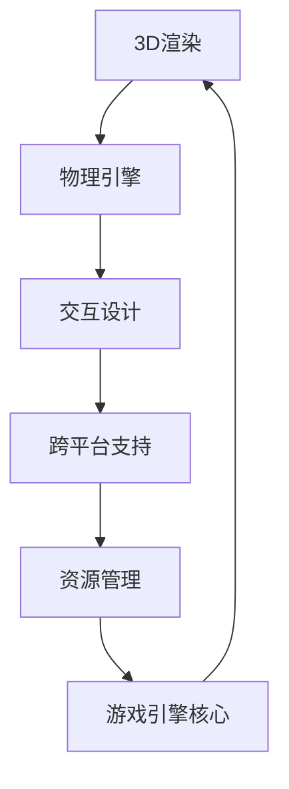

                 

# Unity 游戏引擎开发：创建逼真的世界和互动体验

> 关键词：Unity, 游戏引擎, 逼真世界, 互动体验, VR/AR, 游戏开发, 3D渲染, 物理引擎, 跨平台支持

## 1. 背景介绍

在数字化娱乐的浪潮下，游戏行业迎来了前所未有的发展机遇。从传统的PC、主机到新兴的移动设备和虚拟现实(VR)、增强现实(AR)等平台，游戏不再仅仅局限于娱乐消遣，更成为重要的文化输出和数字内容产业。作为全球领先的跨平台游戏引擎，Unity在近年里凭借其强大的生态系统和用户基础，成为游戏开发的首选工具。本文将深入探讨Unity游戏引擎的开发核心，帮助开发者理解如何创建逼真的世界和互动体验，推动游戏技术的进步。

## 2. 核心概念与联系

### 2.1 核心概念概述

Unity是广泛使用的高效跨平台游戏引擎，以其直观的可视化编辑器、丰富的插件生态、强大的3D渲染和物理引擎著称。开发者可以借助Unity轻松创建复杂的3D场景、丰富的交互效果，并将游戏部署到PC、手机、VR等多种设备上。

本文主要关注Unity在游戏开发中的应用，涵盖以下几个关键概念：

- **3D渲染**：使用Unity的渲染引擎，可以实现高性能、高保真度的3D图形渲染，支撑逼真的视觉效果。
- **物理引擎**：利用Unity内置的物理引擎，实现逼真的物理交互和动态效果。
- **交互设计**：通过Unity的脚本语言和编辑器工具，实现游戏元素的动态交互和事件驱动。
- **跨平台支持**：Unity支持多平台发布，包括Windows、macOS、iOS、Android、VR等，确保游戏开发的一次性。
- **资源管理**：Unity提供了丰富的资源管理工具，如资产导入、资源打包、版本控制等，简化项目开发流程。

这些概念通过一个统一的游戏开发框架有机地结合在一起，允许开发者用单一的技术栈创建跨平台的多媒体互动体验。

### 2.2 核心概念原理和架构的 Mermaid 流程图



## 3. 核心算法原理 & 具体操作步骤

### 3.1 算法原理概述

Unity的核心算法主要围绕3D渲染、物理模拟、动画与交互设计展开。这些算法的实现不仅依赖于先进的数学模型，还需要跨学科的协作，如计算机图形学、物理学、人工智能等。下面简要介绍这些核心算法的基本原理。

- **3D渲染算法**：主要依赖于光照模型、着色模型和渲染管线，通过高性能的GPU并行计算，实现逼真的3D图形效果。
- **物理模拟算法**：利用基于物理的建模(BPB)、碰撞检测和响应，实现物体之间的真实交互和动态效果。
- **动画算法**：通过骨骼动画、蒙皮动画、粒子动画等技术，实现流畅的角色动画和特效。
- **交互设计算法**：结合用户输入和游戏逻辑，实现复杂的交互效果，如用户界面(UI)交互、语音交互等。

这些算法原理构成了Unity引擎的核心竞争力，支撑了丰富多样的游戏体验。

### 3.2 算法步骤详解

 Unity的开发流程大致可以分为以下几个步骤：

1. **设计**：确定游戏概念、目标用户和核心玩法，进行概念验证和市场调研。
2. **资产创建**：使用Unity的可视化编辑器创建3D模型、纹理、动画等游戏资产。
3. **脚本编写**：编写C#或JavaScript脚本，实现游戏逻辑和交互效果。
4. **物理设置**：利用Unity的物理引擎，设置游戏元素的物理属性，如质量、摩擦系数等。
5. **渲染优化**：对3D渲染管线进行优化，确保高性能渲染效果。
6. **测试与发布**：在多个平台上进行游戏测试，修复Bug，发布游戏版本。

### 3.3 算法优缺点

 Unity引擎以其强大的功能集和丰富的开发工具著称，但同时也存在一些挑战：

- **优点**：
  - 强大的生态系统：丰富的插件和扩展支持，可以扩展游戏功能。
  - 跨平台支持：支持多平台发布，节省开发成本。
  - 高性能渲染：内置优化工具，提升渲染效率。
  - 物理引擎：逼真的物理模拟和碰撞检测。

- **缺点**：
  - 学习曲线陡峭：初学者可能需要一定时间适应。
  - 内存和性能要求高：大型的3D游戏可能面临性能瓶颈。
  - 许可证费用：专业版可能需要购买商业许可证。

### 3.4 算法应用领域

 Unity在游戏开发领域广泛应用，几乎涵盖所有类型的游戏：

- **移动游戏**：通过Unity开发的小型移动游戏，如《Flappy Bird》、《Temple Run》等，展示了Unity在跨平台开发上的优势。
- **PC游戏**：Unity支持多种图形API和硬件加速，适用于开发高性能的PC游戏，如《The Witness》、《Titanfall 2》等。
- **VR游戏**：Unity为VR开发者提供了方便的工具和资源，开发了如《Beat Saber》、《The Garden》等流行的VR游戏。
- **AR游戏**：Unity的AR集成功能，使开发者能够开发像《Pokémon GO》这样高度交互的AR游戏。
- **大型多人在线游戏(MMO)**：Unity支持海量并发用户，开发了如《Mobile Royale》、《Surviving Mars》等大型MMO游戏。

## 4. 数学模型和公式 & 详细讲解 & 举例说明

### 4.1 数学模型构建

Unity的3D渲染和物理引擎依赖于复杂的数学模型，主要包括：

- **光照模型**：如Phong、Blinn-Phong、PBR等，计算物体表面反射率、环境光、直接光源等。
- **着色模型**：如Lambert、Gouraud、Phong等，用于平滑过渡不同材质和颜色。
- **碰撞检测**：如包围盒、碰撞球、层次空间等，用于计算物体之间的碰撞。
- **动态效果**：如粒子系统、流体模拟、软体动力学等，用于实现复杂的物理效果。

### 4.2 公式推导过程

以Phong光照模型为例，其数学推导过程如下：

\[ f(x) = \frac{K_a}{\pi} + K_d \frac{L_i}{\pi (n \cdot v + \epsilon)} + K_s \frac{(L_r \cdot (r \cdot v))^m}{\pi (n \cdot v + \epsilon)^m} \]

其中，$K_a$为环境光反射率，$K_d$为漫反射系数，$K_s$为镜面反射系数，$L_i$为入射光强度，$n$为法向量，$v$为视角向量，$L_r$为反射光强度，$r$为反射向量，$m$为镜面指数。

### 4.3 案例分析与讲解

以《纪念碑谷》（Monument Valley）为例，分析Unity在游戏开发中的应用：

1. **3D渲染**：使用Unity的3D渲染管线，实现高效的光照和着色效果。
2. **物理引擎**：利用Unity的物理引擎，实现角色和环境元素的逼真交互。
3. **动画设计**：使用Unity的动画工具，实现流畅的角色动画和特效。
4. **交互设计**：通过Unity的脚本语言，实现游戏逻辑和用户交互。

## 5. 项目实践：代码实例和详细解释说明

### 5.1 开发环境搭建

Unity开发环境搭建相对简单，主要包括以下步骤：

1. 下载并安装Unity编辑器，根据需求选择标准版或专业版。
2. 配置开发环境，如安装必要的插件和扩展。
3. 创建新项目，设置项目设置和资源路径。

### 5.2 源代码详细实现

以下是一个简单的Unity3D游戏项目，实现一个球体沿着轨道滚动的效果：

1. 创建3D球体和轨道模型，导入Unity项目中。
2. 编写C#脚本，控制球体在轨道上滚动：

```csharp
using UnityEngine;

public class BallRoll : MonoBehaviour
{
    public float speed = 5f;
    public float angle = 0f;
    
    void Update()
    {
        angle += speed * Time.deltaTime;
        transform.Rotate(new Vector3(0, 1, 0), angle);
    }
}
```

3. 将脚本绑定到球体上，启动Unity编辑器，运行项目。

### 5.3 代码解读与分析

该脚本通过Unity的`Update`函数，实现球体绕轴旋转，代码简洁高效。Unity的可视化编辑器提供了丰富的可视化界面，方便开发者调试和测试。

### 5.4 运行结果展示

启动项目后，可以看到球体在轨道上平滑滚动，视觉效果逼真。通过进一步优化脚本和渲染设置，可以实现更加复杂的交互效果。

## 6. 实际应用场景

### 6.1 虚拟现实

Unity在虚拟现实(VR)开发中具有重要地位。VR游戏需要逼真的3D渲染和物理引擎，Unity提供了强大的支持。

1. **沉浸式体验**：Unity支持头显设备和手柄，实现自然的手部交互和空间定位。
2. **实时渲染**：Unity的实时渲染引擎，实现高质量的VR图形效果。
3. **物理模拟**：Unity的物理引擎，提供真实的碰撞和动态效果。

以《Beat Saber》为例，该游戏利用Unity的物理引擎和3D渲染，实现了用户与虚拟环境的互动，创造出沉浸式音乐舞蹈体验。

### 6.2 增强现实

Unity在增强现实(AR)开发中也发挥着重要作用。AR游戏需要利用现实环境与虚拟元素结合，Unity提供了灵活的AR工具。

1. **环境识别**：Unity支持多种AR识别技术，如图像识别、颜色识别等。
2. **透明渲染**：Unity的透明渲染技术，实现虚拟元素在现实环境中的叠加。
3. **交互设计**：Unity的脚本语言，实现复杂的用户交互和事件驱动。

以《Pokémon GO》为例，该游戏利用Unity的AR工具，将虚拟宠物与现实环境结合，创造出独特的寻宝和战斗体验。

### 6.3 大型多人在线游戏

Unity支持海量并发用户，适用于开发大型多人在线游戏(MMO)。

1. **网络同步**：Unity的网络同步功能，实现多用户实时交互。
2. **游戏逻辑**：Unity的脚本语言，实现复杂的游戏逻辑和规则。
3. **性能优化**：Unity的性能优化工具，保证游戏的高效运行。

以《Surviving Mars》为例，该游戏利用Unity的网络同步和物理引擎，支持全球玩家协作，实现大规模多人在线生存游戏。

### 6.4 未来应用展望

未来，Unity在游戏开发中的应用将更加广泛，包括：

1. **跨平台互操作性**：Unity支持多种平台，实现跨平台的游戏体验。
2. **云计算和边缘计算**：利用云服务和边缘计算，提升游戏性能和网络体验。
3. **虚拟与现实融合**：利用AR和VR技术，实现虚拟与现实的深度融合。
4. **人工智能**：引入AI技术，实现自适应游戏难度和个性化推荐。
5. **区块链**：利用区块链技术，实现去中心化的游戏生态和经济系统。

## 7. 工具和资源推荐

### 7.1 学习资源推荐

- **Unity官方文档**：Unity提供的官方文档，详细介绍了Unity的功能和使用方法。
- **Unity Asset Store**：Unity的资产市场，提供丰富的3D模型、特效、脚本等资源。
- **Unity Learn**：Unity的学习平台，提供免费和付费的课程和教程。
- **Unity开发者社区**：Unity的开发者社区，提供丰富的技术交流和支持。

### 7.2 开发工具推荐

- **Visual Studio**：Unity的集成开发环境，支持C#和JavaScript开发。
- **Git**：版本控制工具，方便团队协作和代码管理。
- **GitHub**：代码托管平台，提供丰富的代码仓库和社区支持。
- **Unity Hub**：Unity的桌面管理工具，方便管理多个Unity项目。

### 7.3 相关论文推荐

- **"Real-time Hardware-accelerated Graphics Rendering on Mobile Devices with Unity and OpenGL ES 3.1"**：介绍Unity在移动设备上的图形渲染技术。
- **"Unity for Virtual and Augmented Reality: A Survey"**：总结Unity在虚拟和增强现实中的应用和挑战。
- **"Development of an Interactive Game using Unity 3D"**：介绍使用Unity开发互动游戏的过程和方法。

## 8. 总结：未来发展趋势与挑战

### 8.1 总结

本文详细介绍了Unity游戏引擎的核心概念和开发实践，帮助开发者理解如何创建逼真的世界和互动体验。Unity凭借其强大的生态系统和丰富的功能集，成为游戏开发的首选工具。开发者可以通过掌握Unity的基本原理和工具，开发出多样化的游戏应用。

### 8.2 未来发展趋势

Unity的未来发展趋势包括：

1. **实时渲染技术的提升**：未来Unity将不断优化渲染管线，提升图形质量。
2. **物理引擎的强化**：利用先进的物理建模和模拟技术，提升交互效果的真实性。
3. **AR和VR技术的融合**：利用AR和VR技术，实现虚拟与现实的深度融合。
4. **AI和机器学习的引入**：引入AI和机器学习技术，提升游戏智能化水平。
5. **跨平台互操作性**：提升跨平台互操作性，支持更多的游戏平台和设备。

### 8.3 面临的挑战

Unity在游戏开发中也面临一些挑战：

1. **性能瓶颈**：大型的3D游戏可能面临性能瓶颈，需要优化渲染和物理引擎。
2. **脚本调试**：复杂的脚本调试过程，需要更多的工具和资源支持。
3. **生态系统的维护**：生态系统的持续更新和维护，需要大量资源和投入。

### 8.4 研究展望

未来研究可以关注以下几个方向：

1. **虚拟现实渲染优化**：优化VR渲染性能，提升用户体验。
2. **实时物理模拟**：提升物理引擎的精度和速度，实现真实的物理交互。
3. **交互设计自动化**：利用AI技术，实现自动化的交互设计和事件驱动。
4. **跨平台互操作性**：提升跨平台互操作性，支持更多的游戏平台和设备。

## 9. 附录：常见问题与解答

**Q1：Unity有哪些主要组件和功能？**

A: Unity的主要组件包括：

- **3D渲染**：提供图形渲染引擎，支持高质量的3D图形渲染。
- **物理引擎**：提供逼真的物理模拟和碰撞检测。
- **动画系统**：提供骨骼动画、蒙皮动画、粒子动画等动画工具。
- **脚本语言**：提供C#和JavaScript脚本语言，实现游戏逻辑和交互效果。
- **资源管理**：提供资源导入、打包、版本控制等工具。
- **跨平台支持**：支持多平台发布，包括PC、手机、VR等。

**Q2：Unity的渲染管线包括哪些部分？**

A: Unity的渲染管线主要包括：

- **光照模型**：如Phong、Blinn-Phong、PBR等，计算物体表面反射率、环境光、直接光源等。
- **着色模型**：如Lambert、Gouraud、Phong等，用于平滑过渡不同材质和颜色。
- **渲染优化**：利用GPU并行计算，提升渲染效率。
- **透明渲染**：实现虚拟元素在现实环境中的叠加。

**Q3：Unity中的物理引擎有哪些特性？**

A: Unity的物理引擎具有以下特性：

- **基于物理的建模(BPB)**：计算物体表面反射率、环境光、直接光源等。
- **碰撞检测**：如包围盒、碰撞球、层次空间等，用于计算物体之间的碰撞。
- **动态效果**：如粒子系统、流体模拟、软体动力学等，用于实现复杂的物理效果。

**Q4：如何优化Unity游戏的渲染性能？**

A: 优化Unity游戏渲染性能的方法包括：

- **减少渲染对象数量**：优化模型和纹理，减少渲染对象数量。
- **使用LOD技术**：利用LOD技术，实现场景的层次渲染。
- **渲染优化工具**：使用Unity的渲染优化工具，如质量设置、光线追踪等。
- **硬件加速**：利用GPU和CPU并行计算，提升渲染效率。

**Q5：如何在Unity中实现AR游戏？**

A: 在Unity中实现AR游戏的方法包括：

- **环境识别**：使用Unity的图像识别和颜色识别技术，实现环境识别。
- **透明渲染**：使用Unity的透明渲染技术，实现虚拟元素在现实环境中的叠加。
- **交互设计**：使用Unity的脚本语言，实现复杂的用户交互和事件驱动。

通过本文的系统梳理，可以看到，Unity游戏引擎的开发流程和核心技术。掌握了Unity的基本原理和工具，开发者可以轻松创建复杂的3D场景、丰富的交互效果，并将游戏部署到多种设备上，实现逼真的世界和互动体验。未来，随着Unity技术的不断进步，游戏开发将迎来更多的创新和突破。

