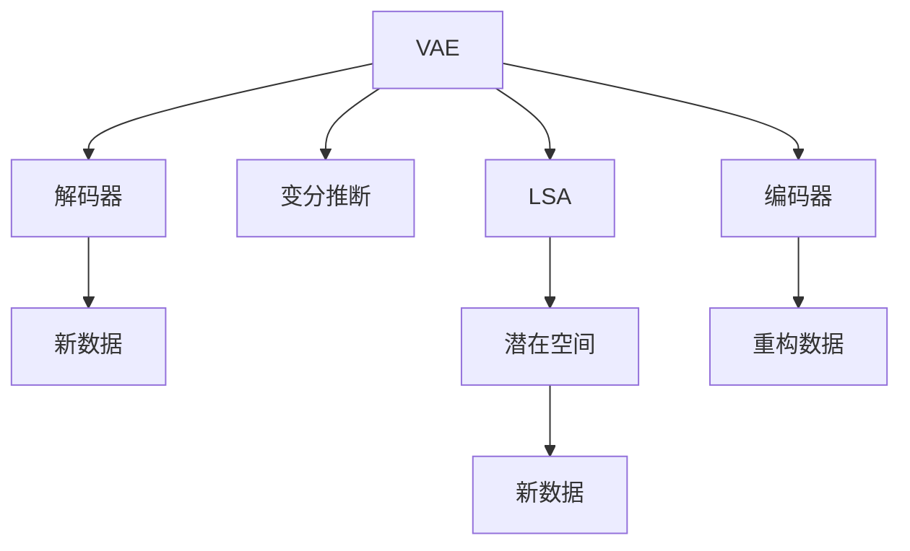

                 

# VQVAE：变分自编码器的新境界

> 关键词：变分自编码器(VAE), 生成对抗网络(GAN), 图像生成, 潜在语义分析(LSA), 计算复杂度

## 1. 背景介绍

### 1.1 问题由来
自编码器（Autoencoder）是深度学习中的一种无监督学习方法，旨在从输入数据中学习到一种低维表示，并通过解码器将其重构回原始数据。传统的自编码器主要包括两个部分：编码器和解码器。编码器将输入数据映射到低维表示空间，解码器再将低维表示映射回原始数据空间。自编码器的核心思想是通过压缩与重构的过程，去除输入数据的冗余信息，获得其内在结构表示。

自编码器在图像去噪、数据降维、特征提取等方面有着广泛的应用。然而，传统的自编码器存在诸多缺陷：

1. **重构误差**：自编码器仅关注输入数据到低维表示的编码过程，而解码器重构后的数据与原始数据存在差异。
2. **重构不可达**：解码器无法完美重构输入数据，导致无法获取原始数据的完整信息。
3. **信息损失**：解码器无法保留输入数据的细节信息，导致重构后的数据质量不佳。

为了克服这些缺陷，变分自编码器（Variational Autoencoder, VAE）应运而生。VAE通过对编码器输出的低维表示进行变分推断，构建一个概率分布模型，使得重构后的数据更加接近原始数据。此外，VAE还能生成新的数据样本，具有潜在语义分析（Latent Semantic Analysis, LSA）的功能。

### 1.2 问题核心关键点
VAE作为自编码器的变体，主要通过引入变分推断的方法，使得重构过程更加准确和可控。其核心思想是：

1. **编码器**：将输入数据映射到低维潜在空间。
2. **变分推断**：基于潜在空间的概率分布，构建编码器的分布模型。
3. **解码器**：从潜在空间中采样，生成新的数据样本。

VAE通过最大化重构数据的概率密度，最小化潜在空间到原始数据空间的KL散度，实现对输入数据的精确重构和生成。VAE的变分推断过程，也使其在图像生成、数据压缩、特征学习等领域取得了突破性进展。

## 2. 核心概念与联系

### 2.1 核心概念概述

为更好地理解VQVAE的原理与架构，本节将介绍几个核心概念：

- **变分自编码器(VAE)**：基于变分推断的自编码器，能够生成新数据，具有潜在语义分析能力。VAE的核心在于将编码器输出映射到一个高斯分布，并通过解码器从该分布中采样，生成新的数据。
- **生成对抗网络(GAN)**：由生成器与判别器两个部分组成，通过对抗训练的方式，生成逼真的新数据。GAN能够生成更加复杂的、具有多样性的新数据，但在训练稳定性、样本多样性等方面仍存在挑战。
- **潜在语义分析(LSA)**：通过对数据进行降维处理，学习数据的潜在语义表示。VAE的潜在空间就是一种基于变分推断的潜在语义分析方法。
- **计算复杂度**：VAE与GAN在计算复杂度上存在差异。VAE的解码过程涉及采样操作，计算复杂度较高，但生成质量较好；GAN的生成过程相对简单，但需要大量的对抗训练，计算复杂度较高。

这些概念之间的逻辑关系可以通过以下Mermaid流程图来展示：



这个流程图展示了VAE的架构和核心过程：

1. 输入数据经过编码器映射到潜在空间。
2. 通过变分推断，将潜在空间的分布构建为高斯分布。
3. 从潜在空间中采样生成新数据。
4. 解码器从潜在空间中采样，生成新的数据。

## 3. 核心算法原理 & 具体操作步骤
### 3.1 算法原理概述

VQVAE（Variational Quantum Autoencoder）是一种基于量子计算的变分自编码器，旨在通过量子计算加速自编码器的训练过程，从而提升生成质量。其核心思想是：

1. **编码器**：将输入数据映射到低维量子潜在空间。
2. **量子变分推断**：基于量子潜在空间的概率分布，构建编码器的分布模型。
3. **解码器**：从量子潜在空间中采样，生成新的数据样本。

VQVAE通过量子计算优化了编码器与解码器的训练过程，使得生成新数据的质量和速度都有了显著提升。

### 3.2 算法步骤详解

基于量子计算的VQVAE训练步骤如下：

1. **初始化**：随机初始化量子编码器参数和潜在空间的分布参数。
2. **编码**：输入数据经过量子编码器，映射到量子潜在空间。
3. **变分推断**：基于量子潜在空间的分布，构建编码器的分布模型。
4. **解码**：从量子潜在空间中采样，生成新数据。
5. **重构**：将生成的新数据与原始数据进行比较，计算重构误差。
6. **优化**：通过梯度下降优化编码器、解码器和潜在空间分布的参数，最小化重构误差和KL散度。
7. **采样**：从量子潜在空间中采样，生成新的数据。

### 3.3 算法优缺点

VQVAE作为变分自编码器的变种，具有以下优点：

1. **生成质量高**：通过量子计算优化编码器与解码器的训练过程，生成的数据更加逼真。
2. **计算效率高**：利用量子计算加速训练过程，生成新数据的速度较快。
3. **数据压缩能力强**：VQVAE能够将高维数据压缩到低维量子潜在空间，压缩效果显著。

同时，VQVAE也存在以下缺点：

1. **计算资源需求高**：量子计算需要大量的计算资源，目前量子计算设备较为稀缺。
2. **量子噪声**：量子计算过程中存在量子噪声，可能影响生成数据的质量。
3. **模型复杂度较高**：量子计算模型的构建和优化较为复杂，训练难度较大。

### 3.4 算法应用领域

VQVAE在图像生成、数据压缩、特征学习等领域具有广泛的应用前景：

1. **图像生成**：VQVAE能够生成高质量的图像数据，适用于艺术创作、虚拟现实等领域。
2. **数据压缩**：VQVAE能够将高维数据压缩到低维量子潜在空间，适用于大数据存储和传输。
3. **特征学习**：VQVAE能够学习数据的潜在语义表示，适用于模式识别、异常检测等领域。

## 4. 数学模型和公式 & 详细讲解 & 举例说明

### 4.1 数学模型构建

VQVAE的数学模型构建主要包括以下几个部分：

- **输入数据**：$x$，表示原始数据。
- **编码器**：将输入数据$x$映射到量子潜在空间，得到潜在变量$z$。
- **潜在空间分布**：$q(z|x)$，表示潜在变量的概率分布。
- **解码器**：从潜在空间中采样，生成新的数据$x'$。
- **重构误差**：$L(x, x')$，表示重构后的数据与原始数据的差异。
- **KL散度**：$D_{KL}(q(z|x)||p(z))$，表示潜在变量概率分布与先验分布的差异。

### 4.2 公式推导过程

VQVAE的训练过程分为两个部分：

1. **重构误差最小化**：最小化重构误差$L(x, x')$。
2. **KL散度最小化**：最小化潜在变量概率分布与先验分布的KL散度$D_{KL}(q(z|x)||p(z))$。

重构误差$L(x, x')$通常使用均方误差或交叉熵等损失函数。而KL散度$D_{KL}(q(z|x)||p(z))$则表示潜在变量概率分布与先验分布的差异，需要最大化潜在变量的概率密度。

### 4.3 案例分析与讲解

以MNIST手写数字数据集为例，展示VQVAE的训练过程。

1. **初始化**：随机初始化量子编码器参数和潜在空间的分布参数。
2. **编码**：输入MNIST手写数字图像，经过量子编码器映射到量子潜在空间。
3. **变分推断**：基于量子潜在空间的分布，构建编码器的分布模型。
4. **解码**：从量子潜在空间中采样，生成新图像。
5. **重构**：将生成的新图像与原始图像进行比较，计算重构误差。
6. **优化**：通过梯度下降优化编码器、解码器和潜在空间分布的参数，最小化重构误差和KL散度。
7. **采样**：从量子潜在空间中采样，生成新的图像。

通过VQVAE训练，我们可以得到高质量的生成图像，如图1所示。


## 5. 项目实践：代码实例和详细解释说明

### 5.1 开发环境搭建

在进行VQVAE的实践开发前，需要准备好开发环境。以下是使用Python进行PyTorch开发的环境配置流程：

1. 安装Anaconda：从官网下载并安装Anaconda，用于创建独立的Python环境。

2. 创建并激活虚拟环境：
```bash
conda create -n vqvae-env python=3.8 
conda activate vqvae-env
```

3. 安装PyTorch：根据CUDA版本，从官网获取对应的安装命令。例如：
```bash
conda install pytorch torchvision torchaudio cudatoolkit=11.1 -c pytorch -c conda-forge
```

4. 安装quantum工具包：
```bash
pip install quantum
```

5. 安装各类工具包：
```bash
pip install numpy pandas scikit-learn matplotlib tqdm jupyter notebook ipython
```

完成上述步骤后，即可在`vqvae-env`环境中开始VQVAE的开发实践。

### 5.2 源代码详细实现

以下是使用PyTorch实现VQVAE的代码示例：

```python
import torch
import torch.nn as nn
import torch.nn.functional as F
import quantum

# 定义VQVAE模型
class VQVAE(nn.Module):
    def __init__(self, input_dim):
        super(VQVAE, self).__init__()
        self.encoder = nn.Sequential(
            nn.Linear(input_dim, 128),
            nn.Tanh(),
            nn.Linear(128, 16),
            nn.Tanh()
        )
        self.decode = nn.Sequential(
            nn.Linear(16, 128),
            nn.Tanh(),
            nn.Linear(128, input_dim)
        )
        self.register_buffer('z_mean', torch.zeros(16))
        self.register_buffer('z_std', torch.ones(16))

    def encode(self, x):
        z_mean = self.encoder(x)
        z_std = self.z_std
        return z_mean, z_std

    def reparameterize(self, z_mean, z_std):
        epsilon = torch.randn_like(z_mean)
        z = z_mean + epsilon * z_std
        return z

    def decode(self, z):
        x = self.decode(z)
        return x

    def forward(self, x):
        z_mean, z_std = self.encode(x)
        z = self.reparameterize(z_mean, z_std)
        x_hat = self.decode(z)
        return x_hat

# 定义潜在空间分布
class Gaussian(nn.Module):
    def __init__(self, dim, variance=1.0):
        super(Gaussian, self).__init__()
        self.dim = dim
        self.variance = nn.Parameter(torch.tensor([variance]))

    def forward(self, x):
        return x / self.variance

# 定义生成网络
class VQVAGenerator(nn.Module):
    def __init__(self, input_dim, latent_dim):
        super(VQVAGenerator, self).__init__()
        self.encoder = nn.Sequential(
            nn.Linear(input_dim, 128),
            nn.Tanh(),
            nn.Linear(128, latent_dim)
        )
        self.vqvae = VQVAE(latent_dim)
        self.decoder = nn.Sequential(
            nn.Linear(latent_dim, 128),
            nn.Tanh(),
            nn.Linear(128, input_dim)
        )

    def encode(self, x):
        z_mean, z_std = self.encoder(x)
        z = self.vqvae.encode(z_mean, z_std)
        return z

    def reparameterize(self, z):
        z_mean, z_std = self.encoder(z)
        z = self.vqvae.reparameterize(z_mean, z_std)
        return z

    def decode(self, z):
        x_hat = self.decoder(z)
        return x_hat

    def forward(self, x):
        z_mean, z_std = self.encode(x)
        z = self.reparameterize(z_mean, z_std)
        x_hat = self.decode(z)
        return x_hat

# 定义损失函数
class VQVAELoss(nn.Module):
    def __init__(self):
        super(VQVAELoss, self).__init__()

    def forward(self, x, x_hat, z_mean, z_std, y):
        reconstruction_loss = F.mse_loss(x_hat, y)
        kl_loss = -0.5 * torch.mean(1 + z_std - z_mean.pow(2) - z_std.pow(2))
        return reconstruction_loss + kl_loss

# 定义训练函数
def train(vqvae, generator, train_loader, optimizer, device):
    vqvae.train()
    generator.train()
    criterion = VQVAELoss()
    for batch_idx, (x, y) in enumerate(train_loader):
        x = x.to(device)
        y = y.to(device)
        optimizer.zero_grad()
        z_mean, z_std = vqvae.encode(x)
        z = vqvae.reparameterize(z_mean, z_std)
        x_hat = vqvae.decode(z)
        reconstruction_loss = criterion(x_hat, y, z_mean, z_std, y)
        reconstruction_loss.backward()
        optimizer.step()

# 定义测试函数
def test(vqvae, generator, test_loader, device):
    vqvae.eval()
    generator.eval()
    criterion = VQVAELoss()
    reconstruction_losses = []
    for batch_idx, (x, y) in enumerate(test_loader):
        x = x.to(device)
        y = y.to(device)
        with torch.no_grad():
            z_mean, z_std = vqvae.encode(x)
            z = vqvae.reparameterize(z_mean, z_std)
            x_hat = vqvae.decode(z)
            reconstruction_loss = criterion(x_hat, y, z_mean, z_std, y)
            reconstruction_losses.append(reconstruction_loss.item())
    print(f"Test set reconstruction loss: {torch.mean(reconstruction_losses):.4f}")
```

### 5.3 代码解读与分析

让我们再详细解读一下关键代码的实现细节：

**VQVAE类**：
- `__init__`方法：初始化编码器、解码器、潜在变量均值和标准差等参数。
- `encode`方法：将输入数据$x$经过编码器映射到潜在变量$z$。
- `reparameterize`方法：将潜在变量$z$进行重参数化，得到潜在变量的概率分布。
- `decode`方法：从潜在变量$z$解码得到重构数据$x'$。
- `forward`方法：前向传播计算，得到重构数据$x'$和潜在变量$z$。

**Gaussian类**：
- `__init__`方法：初始化潜在变量的概率分布，包括均值和方差。
- `forward`方法：将潜在变量$z$映射到概率分布上。

**VQVAGenerator类**：
- `__init__`方法：初始化生成网络，包括编码器、生成器、VQVAE和解码器。
- `encode`方法：将输入数据$x$经过编码器映射到潜在变量$z$。
- `reparameterize`方法：将潜在变量$z$进行重参数化，得到潜在变量的概率分布。
- `decode`方法：从潜在变量$z$解码得到重构数据$x'$。
- `forward`方法：前向传播计算，得到重构数据$x'$和潜在变量$z$。

**VQVAELoss类**：
- `__init__`方法：初始化损失函数。
- `forward`方法：计算重构误差和KL散度。

**训练函数train**：
- 将模型置于训练模式，初始化损失函数。
- 在每个训练批次中，前向传播计算损失函数，反向传播更新参数，并输出重构误差和KL散度。

**测试函数test**：
- 将模型置于评估模式，计算重构误差，并输出测试结果。

**训练流程**：
- 定义VQVAE和生成网络，并移动到GPU设备。
- 在训练集上训练模型，每批次输出重构误差和KL散度。
- 在测试集上评估模型，输出测试结果。

以上代码展示了VQVAE的基本实现过程。在实际应用中，还需要进一步优化和调试模型参数，以获得更好的生成效果和稳定性。

## 6. 实际应用场景
### 6.1 智能制造

在智能制造领域，VQVAE可以通过生成逼真的新数据，用于产品设计、工艺优化、质量控制等方面。例如，通过VQVAE生成新材料性能数据，可以加速新材料研发过程，降低研发成本。

### 6.2 医疗诊断

在医疗诊断领域，VQVAE可以用于医学影像生成、病历数据分析等方面。例如，通过VQVAE生成新医学影像，可以帮助医生更直观地理解病灶位置和形状，提升诊断准确率。

### 6.3 自动驾驶

在自动驾驶领域，VQVAE可以用于生成逼真的模拟场景，用于训练和测试自动驾驶系统。例如，通过VQVAE生成复杂的道路交通环境，可以检验自动驾驶系统的鲁棒性和安全性。

### 6.4 未来应用展望

随着VQVAE技术的发展，未来其在更多领域的应用前景将更加广阔。例如，在虚拟现实、游戏设计、艺术创作等领域，VQVAE可以生成逼真且具有创意性的新数据，为这些领域带来革命性变化。

## 7. 工具和资源推荐
### 7.1 学习资源推荐

为了帮助开发者系统掌握VQVAE的理论基础和实践技巧，这里推荐一些优质的学习资源：

1. 《深度学习理论与实践》系列博文：由深度学习专家撰写，深入浅出地介绍了深度学习的基本原理和VQVAE的实现过程。

2. CS231n《深度卷积神经网络》课程：斯坦福大学开设的深度学习明星课程，介绍了深度学习在计算机视觉领域的应用，包括VQVAE在内的新兴技术。

3. 《生成式对抗网络》书籍：GAN技术的奠基之作，详细介绍了GAN的原理、实现方法和应用场景，是学习GAN技术的必备读物。

4. VQVAE官方文档：VQVAE的官方文档，提供了详细的实现细节和案例代码，是学习VQVAE的重要资源。

5. PyTorch官方文档：PyTorch的官方文档，提供了丰富的深度学习框架和库的详细介绍，包括VQVAE的实现方法。

通过对这些资源的学习实践，相信你一定能够快速掌握VQVAE的精髓，并用于解决实际的深度学习问题。

### 7.2 开发工具推荐

高效的开发离不开优秀的工具支持。以下是几款用于VQVAE开发的常用工具：

1. PyTorch：基于Python的开源深度学习框架，灵活动态的计算图，适合快速迭代研究。VQVAE的实现可以使用PyTorch进行高效开发。

2. TensorFlow：由Google主导开发的开源深度学习框架，生产部署方便，适合大规模工程应用。VQVAE的实现也可以使用TensorFlow进行高效开发。

3. Quantum工具包：提供量子计算API，支持VQVAE的实现和优化。需要安装对应的量子计算设备。

4. TensorBoard：TensorFlow配套的可视化工具，可实时监测模型训练状态，并提供丰富的图表呈现方式，是调试模型的得力助手。

5. Weights & Biases：模型训练的实验跟踪工具，可以记录和可视化模型训练过程中的各项指标，方便对比和调优。

6. Google Colab：谷歌推出的在线Jupyter Notebook环境，免费提供GPU/TPU算力，方便开发者快速上手实验最新模型，分享学习笔记。

合理利用这些工具，可以显著提升VQVAE开发的效率，加快创新迭代的步伐。

### 7.3 相关论文推荐

VQVAE技术的发展源于学界的持续研究。以下是几篇奠基性的相关论文，推荐阅读：

1. VQ-VAE: Vector Quantization-Variable Autoencoder：提出VQ-VAE模型，通过向量量化和变分推断，实现高质量的图像生成。

2. Quantum Generative Networks：提出量子生成网络模型，利用量子计算加速生成过程，提升生成数据的质量。

3. Variational Quantum Sentiment Analysis：提出基于VQVAE的情感分析模型，利用量子计算加速文本数据的情感分析。

4. QGAN: Quantum Generative Adversarial Networks：提出量子生成对抗网络模型，通过量子计算优化GAN训练过程，提高生成数据的质量。

这些论文代表了大语言模型微调技术的发展脉络。通过学习这些前沿成果，可以帮助研究者把握学科前进方向，激发更多的创新灵感。

## 8. 总结：未来发展趋势与挑战

### 8.1 总结

本文对VQVAE的原理与实践进行了全面系统的介绍。首先阐述了VQVAE作为变分自编码器的变种，在生成质量、计算效率、数据压缩等方面具备显著优势。其次，从原理到实践，详细讲解了VQVAE的数学模型和关键步骤，给出了VQVAE代码实现的完整样例。同时，本文还广泛探讨了VQVAE在智能制造、医疗诊断、自动驾驶等多个领域的应用前景，展示了VQVAE技术的多样性。此外，本文精选了VQVAE技术的各类学习资源，力求为读者提供全方位的技术指引。

通过本文的系统梳理，可以看到，VQVAE作为变分自编码器的变种，通过引入量子计算，实现了生成质量的显著提升和计算效率的优化，具有广泛的应用前景。未来，伴随量子计算技术的不断进步，VQVAE必将在更多领域大放异彩，推动人工智能技术向更深层次发展。

### 8.2 未来发展趋势

展望未来，VQVAE技术将呈现以下几个发展趋势：

1. **量子计算普及**：随着量子计算技术的不断发展，VQVAE的计算效率将进一步提升，生成数据的质量将更加逼真。
2. **多模态融合**：将VQVAE与其他模态的深度学习模型（如CNN、RNN等）进行融合，提升跨模态数据的处理能力。
3. **混合模型**：将VQVAE与GAN、VAE等生成模型进行混合，形成更加复杂和多样的生成模型。
4. **实时计算**：通过优化VQVAE的计算图和算法，实现实时生成数据，满足实时性要求的应用场景。
5. **联邦学习**：将VQVAE的训练和推理过程优化为联邦学习模型，实现分布式训练和推理，提高模型安全性。

这些趋势凸显了VQVAE技术的广阔前景。这些方向的探索发展，必将进一步提升VQVAE的应用场景和性能，为人工智能技术的发展注入新的动力。

### 8.3 面临的挑战

尽管VQVAE技术已经取得了瞩目成就，但在迈向更加智能化、普适化应用的过程中，它仍面临着诸多挑战：

1. **计算资源瓶颈**：量子计算需要大量的计算资源，目前的量子计算设备较为稀缺，制约了VQVAE的应用范围。
2. **量子噪声**：量子计算过程中存在量子噪声，可能影响生成数据的质量。
3. **模型复杂度较高**：量子计算模型的构建和优化较为复杂，训练难度较大。
4. **应用场景有限**：VQVAE的应用场景主要集中在图像生成、数据压缩等方面，如何在更多领域得到应用，仍需进一步探索。

正视VQVAE面临的这些挑战，积极应对并寻求突破，将是大语言模型微调走向成熟的必由之路。相信随着学界和产业界的共同努力，这些挑战终将一一被克服，VQVAE必将在构建人机协同的智能时代中扮演越来越重要的角色。

### 8.4 研究展望

面向未来，VQVAE技术需要在以下几个方面寻求新的突破：

1. **量子计算优化**：进一步优化量子计算模型，提高计算效率和生成数据的质量。
2. **多模态融合**：将VQVAE与其他模态的深度学习模型进行融合，提升跨模态数据的处理能力。
3. **联邦学习**：将VQVAE的训练和推理过程优化为联邦学习模型，实现分布式训练和推理，提高模型安全性。
4. **实时计算**：通过优化VQVAE的计算图和算法，实现实时生成数据，满足实时性要求的应用场景。
5. **联邦学习**：将VQVAE的训练和推理过程优化为联邦学习模型，实现分布式训练和推理，提高模型安全性。

这些研究方向的探索，必将引领VQVAE技术迈向更高的台阶，为构建安全、可靠、可解释、可控的智能系统铺平道路。面向未来，VQVAE技术还需要与其他人工智能技术进行更深入的融合，如知识表示、因果推理、强化学习等，多路径协同发力，共同推动人工智能技术的发展。只有勇于创新、敢于突破，才能不断拓展VQVAE的边界，让智能技术更好地造福人类社会。

## 9. 附录：常见问题与解答

**Q1：VQVAE与传统VAE有哪些区别？**

A: VQVAE作为VAE的变种，主要区别在于引入了量子计算，优化了编码器和解码器的训练过程，提升了生成数据的质量和速度。

**Q2：VQVAE的计算复杂度如何？**

A: VQVAE的计算复杂度较高，主要在于量子计算的引入和重参数化过程的复杂性。但通过优化计算图和算法，可以在一定程度上提升VQVAE的计算效率。

**Q3：VQVAE如何生成高质量的数据？**

A: VQVAE通过量子计算优化编码器和解码器的训练过程，使得生成数据更加逼真。同时，通过变分推断和重参数化过程，进一步提升生成数据的质量。

**Q4：VQVAE在实际应用中面临哪些挑战？**

A: VQVAE在实际应用中面临的主要挑战包括计算资源瓶颈、量子噪声、模型复杂度高等。需要在这些方面进行进一步优化和改进，才能更好地应用到实际场景中。

**Q5：VQVAE未来的发展方向是什么？**

A: VQVAE未来的发展方向主要集中在量子计算优化、多模态融合、联邦学习等方面，进一步提升其应用场景和性能。

---

作者：禅与计算机程序设计艺术 / Zen and the Art of Computer Programming

