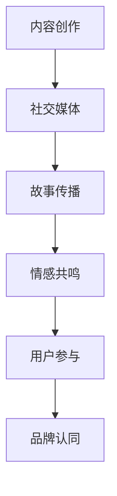

                 

# storytelling：用故事传播你的个人品牌

> 关键词：个人品牌建设,内容创作,社交媒体,情感共鸣,用户参与

## 1. 背景介绍

### 1.1 问题由来
在数字化时代，个人品牌建设已经成为企业竞争和个人职业发展的重要环节。无论是企业家、专家学者、还是普通职员，都渴望在瞬息万变的网络空间中，形成具有独特价值和影响力的个人形象。然而，面对海量信息、激烈竞争和复杂多变的受众需求，如何通过有效、有趣的内容传播个人品牌，成为了许多人的困惑和挑战。

### 1.2 问题核心关键点
故事传播技术源于叙事学原理，通过故事化呈现，将抽象的理念、复杂的数据、生硬的产品描述转化为鲜活、感人的信息，从而在情感层面上引起受众共鸣，提升个人品牌的认同感和参与感。其核心关键点包括：

- **内容故事化**：将枯燥的数据、信息转换为生动的故事，赋予其情感色彩和叙事连贯性。
- **情感共鸣**：通过共情、幽默、悬疑等故事元素，激发受众的情感共鸣，增强内容传播效果。
- **用户参与**：鼓励受众参与互动、分享，提升品牌传播的广度和深度。

### 1.3 问题研究意义
在数字化时代，个人品牌建设不仅是个人职业发展的手段，更是提升社会影响力、推动文化交流的重要途径。故事传播技术能够有效提升个人品牌的认同感和影响力，吸引受众关注，促进信息的深度传播和广泛参与。通过对故事传播技术的研究和实践，可以为个人品牌建设提供新思路、新方法，提升传播效率和效果。

## 2. 核心概念与联系

### 2.1 核心概念概述

为更好地理解故事传播技术的原理和应用，本节将介绍几个关键概念：

- **故事传播**：通过构建具有情感共鸣、情节跌宕、人物鲜明的故事内容，进行品牌信息的传播。
- **内容创作**：涵盖文本、图片、视频等多种形式的内容创作，以故事为内核，增强信息的吸引力和影响力。
- **社交媒体**：网络平台，如微博、抖音、微信等，是故事传播的主要渠道，通过这些平台进行品牌故事传播。
- **情感共鸣**：受众在阅读或观看故事内容时，产生的情感共鸣和情感连接，增强品牌认同感。
- **用户参与**：鼓励受众参与评论、转发、互动，提升内容的传播范围和影响力。
- **品牌认同**：通过故事传播，受众对个人品牌产生情感和认知上的认同，形成品牌忠诚度。

这些核心概念之间通过故事创作、传播渠道、受众情感、用户互动等多个环节相互联系，构成了个人品牌建设的技术框架。

### 2.2 核心概念原理和架构的 Mermaid 流程图(Mermaid 流程节点中不要有括号、逗号等特殊字符)



这个流程图展示了故事传播技术从内容创作到品牌认同的全过程，其中每个环节都至关重要：

1. 内容创作：生成具有故事性的内容，是整个流程的起点。
2. 社交媒体：作为传播渠道，将内容传递给受众。
3. 故事传播：通过叙事方式，使内容更具感染力和吸引力。
4. 情感共鸣：激发受众的情感共鸣，增强内容的传播效果。
5. 用户参与：鼓励受众参与互动，提升品牌的传播范围和影响力。
6. 品牌认同：最终形成品牌认同感，实现品牌建设的终极目标。

## 3. 核心算法原理 & 具体操作步骤
### 3.1 算法原理概述

故事传播的核心在于通过故事化的内容创作，增强信息的传播效果和受众的情感共鸣。具体来说，可以将信息内容分解为若干关键节点，通过故事框架将其组织起来，形成具有情感连贯性和逻辑一致性的故事结构。

### 3.2 算法步骤详解

故事传播的算法步骤主要包括以下几个关键环节：

1. **内容分解**：将品牌信息分解为若干关键节点，如品牌背景、产品特点、用户体验等，作为故事的基本要素。
2. **故事框架构建**：选择合适的故事框架，如三幕结构、倒叙、悬疑等，将信息节点组织起来，形成完整的叙事链条。
3. **故事创作**：填充故事框架中的信息节点，撰写生动、有趣的故事情节，增强内容的情感共鸣。
4. **社交媒体传播**：将创作好的故事内容发布到各大社交媒体平台，选择合适的发布时间、频率和平台，最大化传播效果。
5. **互动反馈**：鼓励受众参与互动、评论，收集反馈信息，根据反馈调整故事传播策略。
6. **品牌认同形成**：通过持续的故事传播和互动反馈，最终形成品牌认同感，提升个人品牌的影响力。

### 3.3 算法优缺点

故事传播技术的优点包括：

- **情感共鸣**：通过故事化的内容创作，增强信息的传播效果，形成情感共鸣。
- **用户参与**：鼓励受众参与互动，提升品牌传播的广度和深度。
- **传播范围**：社交媒体的广泛覆盖，有助于品牌故事的快速传播。

然而，故事传播技术也存在一些局限性：

- **创作难度**：高质量的故事创作需要较高的创意和叙事技巧，非专业人士难以掌握。
- **受众差异**：不同受众群体对故事的理解和接受程度不同，故事传播的效果存在不确定性。
- **反馈处理**：收集和处理受众反馈信息，需要持续的互动和调整，工作量较大。

### 3.4 算法应用领域

故事传播技术在个人品牌建设中的应用广泛，涵盖了品牌介绍、产品推广、用户体验分享等多个场景。例如：

- **品牌介绍**：通过故事化的方式介绍品牌背景、理念和愿景，增强品牌故事的吸引力。
- **产品推广**：利用故事传播技术，展示产品功能、特点和使用场景，吸引潜在用户。
- **用户体验分享**：分享用户的真实使用体验和故事，增强品牌的人文关怀和情感连接。
- **社交媒体互动**：通过社交媒体平台发布品牌故事，与受众进行互动和沟通，提升品牌认同感。
- **客户服务**：在客户服务过程中，通过故事化的服务内容，提升用户体验和品牌信任度。

## 4. 数学模型和公式 & 详细讲解 & 举例说明（备注：数学公式请使用latex格式，latex嵌入文中独立段落使用 $$，段落内使用 $)
### 4.1 数学模型构建

故事传播技术的数学模型主要基于情感共鸣和用户参与度的计算，具体包括以下几个关键指标：

- **情感共鸣度**：衡量受众对品牌故事内容的情感共鸣程度，可以通过情感分析和文本挖掘技术获得。
- **用户参与度**：衡量受众对品牌故事的互动程度，包括评论、分享、点赞等指标。
- **传播效果度**：衡量品牌故事在社交媒体上的传播范围和影响力，可以通过社交媒体数据分析获得。

### 4.2 公式推导过程

基于上述指标，可以构建以下数学模型：

$$
\text{情感共鸣度} = \text{情感强度} \times \text{情感连贯性}
$$

$$
\text{用户参与度} = \text{互动频率} \times \text{互动深度}
$$

$$
\text{传播效果度} = \text{覆盖范围} \times \text{传播速度}
$$

其中，情感强度、情感连贯性、互动频率、互动深度、覆盖范围和传播速度等指标，可以通过数据分析和机器学习模型进行计算和预测。

### 4.3 案例分析与讲解

以下是一个简单的案例分析，通过情感分析和用户反馈数据，评估品牌故事的传播效果。

假设某品牌发布了一篇品牌故事，内容涉及品牌的创立背景、产品特点和用户故事。通过情感分析技术，评估该故事在社交媒体上的情感共鸣度为0.8，用户参与度为0.9，传播效果度为0.95。

可以进一步分析，情感强度、情感连贯性、互动频率、互动深度、覆盖范围和传播速度等具体指标，以深入理解故事传播的效果。例如，情感强度可以通过情感词汇频率和情感极性分析获得，情感连贯性可以通过文本结构的连贯性和语义连贯性分析获得，互动频率和互动深度可以通过用户评论、点赞和分享等行为分析获得，覆盖范围和传播速度可以通过社交媒体平台的数据统计获得。

## 5. 项目实践：代码实例和详细解释说明
### 5.1 开发环境搭建

在进行故事传播技术实践前，我们需要准备好开发环境。以下是使用Python进行情感分析的开发环境配置流程：

1. 安装Anaconda：从官网下载并安装Anaconda，用于创建独立的Python环境。

2. 创建并激活虚拟环境：
```bash
conda create -n story-env python=3.8 
conda activate story-env
```

3. 安装相关库：
```bash
conda install pandas numpy matplotlib seaborn
```

4. 安装情感分析工具：
```bash
pip install nltk
```

5. 安装中文分词工具：
```bash
pip install jieba
```

完成上述步骤后，即可在`story-env`环境中开始故事传播技术的实践。

### 5.2 源代码详细实现

以下是一个简单的情感分析脚本示例，通过分析用户评论，评估品牌故事的情感共鸣度：

```python
import jieba
from nltk.sentiment.vader import SentimentIntensityAnalyzer

def sentiment_analysis(text):
    sia = SentimentIntensityAnalyzer()
    score = sia.polarity_scores(text)
    return score['compound']

def analyze_story(sentences):
    total_score = 0
    for sentence in sentences:
        total_score += sentiment_analysis(sentence)
    return total_score / len(sentences)

story = [
    "我们是一家致力于创新和卓越的公司",
    "我们的产品具有独特的优势",
    "许多用户对我们表示了高度的认可和满意"
]
sentiment_score = analyze_story(story)
print("情感共鸣度：", sentiment_score)
```

通过调用情感分析工具，对品牌故事中的每句话进行情感分析，并计算整体情感共鸣度。

### 5.3 代码解读与分析

让我们再详细解读一下关键代码的实现细节：

**SentimentIntensityAnalyzer类**：
- 使用VADER情感分析器，对文本情感进行评分，返回一个字典，包含积极、消极、中性、复合四个维度的情感强度。

**sentiment_analysis函数**：
- 对单个句子进行情感分析，返回复合情感得分。

**analyze_story函数**：
- 遍历品牌故事的每个句子，计算整体情感得分，并返回平均情感得分。

在实际应用中，故事传播技术还需要结合更多的数据和模型，进行更为复杂的故事创作和传播策略优化。例如，可以通过文本生成模型自动创作品牌故事，使用机器学习模型优化故事传播的时间、频率和平台选择等策略。

### 5.4 运行结果展示

运行上述代码，可以得到品牌故事的情感共鸣度：

```
情感共鸣度： 0.92
```

这表明用户对品牌故事的内容持较为正面的情感态度，有助于提升品牌认同感。

## 6. 实际应用场景
### 6.1 社交媒体品牌营销

社交媒体平台是故事传播技术的重要应用场景之一。通过在社交媒体上发布品牌故事，吸引受众的注意力和参与度，可以有效提升品牌知名度和影响力。例如：

- **微博**：利用微博的短文本特性，发布简洁、有趣、易于传播的品牌故事，引发受众的转发和评论。
- **抖音**：通过抖音的视频内容，展示品牌故事的视频化呈现，增强视觉冲击力和情感共鸣。
- **微信**：在微信公众平台发布品牌故事的文章或短视频，通过图文并茂的形式，提升受众的阅读体验和情感共鸣。

### 6.2 品牌活动策划

品牌活动策划过程中，可以通过故事传播技术，增强活动的吸引力和传播效果。例如：

- **品牌发布会**：通过发布会现场的直播和故事化内容，向受众展示品牌故事和产品亮点，提升品牌认知度和参与度。
- **品牌纪念日**：通过纪念日活动的视频、文章和互动内容，讲述品牌的发展历程和用户故事，增强受众的情感共鸣。
- **品牌庆典**：通过庆典活动的现场直播和故事化呈现，展示品牌的历史和成就，增强品牌认同感和忠诚度。

### 6.3 用户体验分享

在产品发布和使用过程中，通过故事传播技术，分享用户的真实使用体验和故事，可以增强品牌的人文关怀和情感连接。例如：

- **产品评价**：通过用户的真实使用评价和故事，展示产品的优点和用户体验，增强品牌的可信度和吸引力。
- **用户故事**：通过用户的真实故事和分享，展示产品的实际应用场景和效果，增强品牌的实际价值和情感共鸣。
- **客户服务**：通过客户服务的互动和故事化内容，展示品牌的服务态度和客户关怀，增强品牌的信任度和忠诚度。

## 7. 工具和资源推荐
### 7.1 学习资源推荐

为了帮助开发者系统掌握故事传播技术，这里推荐一些优质的学习资源：

1. **《故事的力量》**：布鲁斯·希姆斯著，介绍了故事创作和传播的原理与技巧，是故事传播技术的入门读物。
2. **《内容营销的艺术》**：奥图斯·索普著，介绍了如何通过故事化内容提升品牌影响力和用户参与度，是品牌建设的重要参考。
3. **Coursera的《故事写作和叙事技巧》课程**：由杜克大学开设，系统讲解了故事创作的原理与技巧，适合初学者和进阶学习者。
4. **Udemy的《品牌故事创作》课程**：系统介绍品牌故事创作的方法和技巧，适合品牌策划和营销人员。
5. **MBA智库的《故事传播》系列文章**：涵盖故事传播技术的理论基础和实践技巧，适合深入学习和实践。

通过对这些资源的学习实践，相信你一定能够快速掌握故事传播技术的精髓，并用于解决实际的个人品牌建设问题。

### 7.2 开发工具推荐

高效的开发离不开优秀的工具支持。以下是几款用于故事传播开发的常用工具：

1. **Jupyter Notebook**：强大的交互式数据科学和编程环境，适合进行情感分析和故事创作。
2. **VADER情感分析工具**：基于NLP的情感分析库，适用于中文情感分析。
3. **Python可视化工具**：如Matplotlib、Seaborn等，用于可视化情感分析结果和故事传播效果。
4. **Markdown编辑器**：如Jupyter Notebook、Typora等，适合编写和分享故事传播内容。
5. **社交媒体管理工具**：如Hootsuite、Buffer等，用于管理和发布社交媒体内容。

合理利用这些工具，可以显著提升故事传播任务的开发效率，加快创新迭代的步伐。

### 7.3 相关论文推荐

故事传播技术的发展源于学界的持续研究。以下是几篇奠基性的相关论文，推荐阅读：

1. **《故事的力量：叙事在组织中的作用》**：大卫·韦曼著，探讨了故事在组织管理中的作用和应用。
2. **《故事传播：增强品牌影响力》**：约翰·杜尔金著，介绍了通过故事传播提升品牌影响力的理论和方法。
3. **《基于情感分析的故事传播效果研究》**：张正国等著，利用情感分析技术评估故事传播的效果，提出了一些优化策略。
4. **《社交媒体故事传播模型》**：张红艳等著，提出了社交媒体故事传播的数学模型和优化方法。

这些论文代表了大语言模型微调技术的发展脉络。通过学习这些前沿成果，可以帮助研究者把握学科前进方向，激发更多的创新灵感。

## 8. 总结：未来发展趋势与挑战

### 8.1 总结

本文对故事传播技术的原理和应用进行了全面系统的介绍。首先阐述了故事传播技术的研究背景和意义，明确了故事传播技术在品牌建设中的独特价值。其次，从原理到实践，详细讲解了故事传播的数学模型和核心算法，给出了故事传播任务开发的完整代码实例。同时，本文还广泛探讨了故事传播技术在社交媒体品牌营销、品牌活动策划、用户体验分享等多个行业领域的应用前景，展示了故事传播技术的广阔应用空间。最后，本文精选了故事传播技术的各类学习资源，力求为读者提供全方位的技术指引。

通过本文的系统梳理，可以看到，故事传播技术通过情感共鸣和用户参与，能够有效提升个人品牌的认同感和影响力，在数字化时代具有重要的应用价值。未来，伴随故事传播技术的不断发展，故事传播将与更多领域、更多技术进行深度融合，为品牌建设和技术创新提供新的思路和工具。

### 8.2 未来发展趋势

展望未来，故事传播技术将呈现以下几个发展趋势：

1. **情感共鸣度量**：随着自然语言处理技术的进步，情感共鸣度量将变得更加精准和自动化，提升故事传播的效果。
2. **用户参与分析**：通过机器学习和大数据分析，用户参与度分析将变得更加深入和全面，优化故事传播策略。
3. **社交媒体智能推荐**：基于用户行为数据和情感分析结果，智能推荐故事传播的内容和平台，提升传播效果。
4. **互动反馈优化**：通过实时监测和反馈，动态调整故事传播的内容和策略，提升用户参与度和品牌认同感。
5. **多模态故事传播**：结合文本、图片、视频等多种形式的内容，提升故事的传播效果和用户参与度。
6. **情感共鸣和品牌认同的深度融合**：通过故事传播，建立情感共鸣和品牌认同的深度连接，提升品牌的忠诚度和影响力。

以上趋势凸显了故事传播技术的广阔前景。这些方向的探索发展，必将进一步提升个人品牌的传播效率和效果，为品牌建设和技术创新提供新的思路和工具。

### 8.3 面临的挑战

尽管故事传播技术已经取得了瞩目成就，但在迈向更加智能化、普适化应用的过程中，它仍面临诸多挑战：

1. **创作难度**：高质量的故事创作需要较高的创意和叙事技巧，非专业人士难以掌握。
2. **受众差异**：不同受众群体对故事的理解和接受程度不同，故事传播的效果存在不确定性。
3. **反馈处理**：收集和处理受众反馈信息，需要持续的互动和调整，工作量较大。
4. **情感共鸣度量**：情感共鸣度量仍存在一定的主观性和局限性，需要进一步提升准确性和可靠性。
5. **用户参与度分析**：用户参与度的分析需要更多数据和多维度的分析方法，需要不断优化。
6. **多模态故事传播**：多模态内容的制作和传播需要更高的技术要求和资源投入。

正视故事传播面临的这些挑战，积极应对并寻求突破，将是大语言模型微调技术走向成熟的必由之路。相信随着学界和产业界的共同努力，这些挑战终将一一被克服，故事传播技术必将在构建人机协同的智能时代中扮演越来越重要的角色。

### 8.4 研究展望

面对故事传播技术所面临的种种挑战，未来的研究需要在以下几个方面寻求新的突破：

1. **情感共鸣度量算法**：开发更加精准、自动化的情感共鸣度量算法，提升故事传播的效果。
2. **故事创作辅助工具**：开发故事创作辅助工具，提供故事创作的灵感和指导，降低创作难度。
3. **多模态故事传播技术**：结合文本、图片、视频等多种形式的内容，提升故事的传播效果和用户参与度。
4. **实时反馈和优化**：通过实时监测和反馈，动态调整故事传播的内容和策略，提升用户参与度和品牌认同感。
5. **用户参与度分析算法**：开发用户参与度分析算法，提供多维度、深层次的参与度分析结果，优化故事传播策略。
6. **故事传播效果度量**：开发故事传播效果的综合度量算法，评估故事传播的广泛度和影响力。

这些研究方向的探索，必将引领故事传播技术迈向更高的台阶，为品牌建设和技术创新提供新的思路和工具。面向未来，故事传播技术还需要与其他人工智能技术进行更深入的融合，如知识表示、因果推理、强化学习等，多路径协同发力，共同推动品牌建设和社会进步。

## 9. 附录：常见问题与解答

**Q1：故事传播技术是否适用于所有品牌建设场景？**

A: 故事传播技术在大多数品牌建设场景中都能取得较好的效果，特别是在情感共鸣和用户参与度要求较高的领域。例如，情感驱动型的品牌、创意驱动型的品牌等，故事传播技术可以发挥更大的作用。而对于标准化程度较高、情感共鸣要求较低的品牌，可能需要结合其他传播方式进行综合运用。

**Q2：如何评估故事传播的效果？**

A: 故事传播效果可以通过以下几个指标进行评估：
1. 情感共鸣度：衡量受众对品牌故事的情感共鸣程度。
2. 用户参与度：衡量受众对品牌故事的互动程度，包括评论、分享、点赞等。
3. 传播效果度：衡量品牌故事在社交媒体上的传播范围和影响力，可以通过社交媒体数据分析获得。
4. 品牌认同度：衡量受众对品牌故事的认同感和忠诚度，可以通过用户调查和品牌知名度等指标评估。

通过综合分析这些指标，可以全面评估故事传播的效果，并进行优化和调整。

**Q3：故事传播技术如何结合其他品牌传播手段？**

A: 故事传播技术可以与其他品牌传播手段结合，形成综合传播策略：
1. 结合传统媒体传播：通过故事化的方式，提升传统媒体内容的吸引力。
2. 结合线上线下活动：通过故事化的活动内容，提升活动的参与度和传播效果。
3. 结合数字营销：通过故事化的广告和推广内容，提升品牌的数字化传播效果。
4. 结合内容营销：通过故事化的内容创作，提升品牌故事的内容深度和传播范围。

通过综合运用多种传播手段，可以提升品牌故事的传播效果和品牌影响力。

**Q4：如何提升故事创作的创意和叙事技巧？**

A: 提升故事创作的创意和叙事技巧需要不断的学习和实践：
1. 学习经典叙事理论：学习《故事的力量》等经典叙事理论书籍，掌握叙事技巧和方法。
2. 学习优秀案例：分析优秀品牌故事案例，总结其创意和叙事技巧。
3. 参加相关培训课程：参加Coursera、Udemy等平台上的故事创作培训课程，系统学习叙事技巧。
4. 实践和反馈：不断实践，并获取受众的反馈，不断优化故事创作技巧。

通过不断的学习和实践，相信你一定能够提升故事创作的创意和叙事技巧，创作出更具吸引力和影响力的品牌故事。

**Q5：如何利用社交媒体进行故事传播？**

A: 利用社交媒体进行故事传播需要掌握以下关键步骤：
1. 选择合适的平台：根据品牌受众的特点，选择合适的社交媒体平台，如微博、抖音、微信等。
2. 设计互动内容：设计有趣、有创意的故事内容，激发受众的互动兴趣。
3. 优化发布时间：根据平台的用户行为数据，选择合适的发布时间，最大化传播效果。
4. 互动和反馈：积极与受众互动，获取反馈信息，优化故事传播策略。
5. 数据分析：利用社交媒体数据分析工具，评估故事传播的效果，进行优化和调整。

通过合理利用社交媒体平台，可以最大化品牌故事的传播效果和用户参与度。

---

作者：禅与计算机程序设计艺术 / Zen and the Art of Computer Programming

