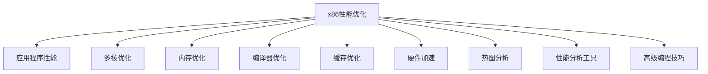

                 

# x86处理器性能优化技巧

> 关键词：x86性能优化, 应用程序性能, 多核优化, 内存优化, 编译器优化, 缓存优化, 硬件加速, 热图分析, 性能分析工具, 高级编程技巧

## 1. 背景介绍

### 1.1 问题由来

随着计算机硬件技术的不断进步，x86处理器性能有了显著提升。然而，由于程序的并行性和资源争用等问题，性能瓶颈依然存在。特别是在大数据、人工智能和嵌入式系统中，高性能计算的应用愈发普遍，如何优化处理器性能，提升应用性能成为重中之重。

### 1.2 问题核心关键点

针对x86处理器性能优化，本文从算法原理、具体操作步骤和具体实践三个方面进行深入探讨。以下将详细介绍如何通过编译器优化、多核优化、内存优化、缓存优化、硬件加速和热图分析等手段，提升x86处理器性能，使其达到最优状态。

## 2. 核心概念与联系

### 2.1 核心概念概述

为深入理解x86处理器性能优化，本节将介绍几个关键概念：

- **x86性能优化**：通过各种技术手段，如编译器优化、多核优化、内存优化等，提升x86处理器在特定应用程序中的性能。
- **应用程序性能**：衡量程序在x86处理器上的运行效率，包括响应时间、吞吐量、延迟等。
- **多核优化**：针对多核处理器架构，通过并行化计算和数据分布等策略，充分利用多核资源，提升程序性能。
- **内存优化**：针对内存访问模式，通过减少缓存未命中、改进内存访问方式等策略，降低内存延迟和带宽压力。
- **编译器优化**：利用编译器的代码生成和指令调度能力，提升程序性能，包括指令选择、寄存器分配和循环优化等。
- **缓存优化**：针对CPU缓存结构，通过数据布局和局部性分析等策略，最大化数据访问的局部性，提升缓存命中率。
- **硬件加速**：利用GPU、FPGA等硬件加速器，分担CPU计算任务，提升整体系统性能。
- **热图分析**：通过热图工具，分析程序在x86处理器上的性能瓶颈，指导优化方向。
- **性能分析工具**：包括如Valgrind、perf等工具，帮助开发者诊断和优化程序性能问题。
- **高级编程技巧**：包括指针操作、内存对齐、锁机制等技巧，优化程序结构和数据访问。

这些概念之间的逻辑关系可以通过以下Mermaid流程图来展示：



这个流程图展示了x86性能优化与各相关概念之间的关系：

1. x86性能优化包含多核优化、内存优化、编译器优化等关键技术，提升应用程序性能。
2. 多核优化利用并行计算，提升任务并发性。
3. 内存优化减少内存访问延迟，提升缓存效率。
4. 编译器优化通过指令优化和数据布局，提高指令执行效率。
5. 缓存优化通过改进数据布局和局部性，提升缓存命中率。
6. 硬件加速利用外部硬件加速器，分担计算任务。
7. 热图分析通过性能分析工具，定位性能瓶颈。
8. 性能分析工具帮助开发者诊断和优化性能问题。
9. 高级编程技巧提高程序执行效率和结构优化。

通过理解这些核心概念，我们能够更好地把握x86处理器性能优化的原理和实现方法。

## 3. 核心算法原理 & 具体操作步骤

### 3.1 算法原理概述

x86处理器性能优化涉及多个层面，从硬件结构到软件实现的各个环节。本文将从编译器优化、多核优化、内存优化、缓存优化、硬件加速和热图分析六个方面进行详细阐述。

### 3.2 算法步骤详解

#### 3.2.1 编译器优化

编译器优化是提升x86处理器性能的重要手段，主要包括代码生成、指令选择、寄存器分配和循环优化等。以下给出具体步骤：

1. **代码生成**：
   - 使用GCC、Clang等优化编译器，进行代码级别优化。
   - 开启-O2、-O3优化选项，使用指令集扩展，如AVX、AVX2、AVX-512等，提升指令执行效率。
   - 利用函数内联、尾递归优化、常量折叠等技术，减少函数调用开销。

2. **指令选择**：
   - 选择合适的指令集和指令类型，如整型、浮点型、字符串操作等。
   - 避免使用高延迟指令，如除法、浮点运算等。
   - 优化分支预测，减少分支延迟和错误预测。

3. **寄存器分配**：
   - 尽量使用寄存器存储常用变量，减少内存访问。
   - 优化寄存器溢出和空间浪费，合理分配寄存器使用。
   - 利用栈空间和局部变量优化，减少堆栈操作。

4. **循环优化**：
   - 内联循环体，减少函数调用开销。
   - 优化循环迭代次数和条件判断，减少分支预测开销。
   - 利用循环展开和循环不变代码提取等技术，提高循环执行效率。

#### 3.2.2 多核优化

多核优化利用多处理器架构，提高计算效率和并行性。以下是具体步骤：

1. **并行化计算**：
   - 将计算密集型任务分解为多个子任务，并行化执行。
   - 使用OpenMP、MPI等并行编程模型，利用多核资源。
   - 利用线程池、任务队列等技术，管理并行任务。

2. **数据分布**：
   - 根据处理器核心数量和数据规模，合理分配数据块，减少数据传输和通信开销。
   - 利用数据分区、分块和分布式存储等技术，优化数据访问。

#### 3.2.3 内存优化

内存优化主要涉及减少内存访问延迟和带宽压力。以下是具体步骤：

1. **减少缓存未命中**：
   - 利用局部性分析，优化数据访问模式，增加缓存命中率。
   - 采用连续内存访问和数据对齐技术，减少缓存未命中。
   - 避免内存泄漏和频繁的内存分配和释放，减少垃圾回收开销。

2. **改进内存访问方式**：
   - 利用向量操作和内存映射技术，提高内存访问效率。
   - 优化数组和结构体数据访问，减少缓存未命中和内存带宽压力。

#### 3.2.4 缓存优化

缓存优化通过改进数据布局和局部性，最大化缓存命中率。以下是具体步骤：

1. **数据布局**：
   - 采用连续内存访问模式，减少缓存未命中。
   - 利用缓存友好的数据结构，优化数据访问模式。
   - 使用块对齐和数据预取技术，减少缓存未命中。

2. **局部性分析**：
   - 利用缓存带宽和容量，优化数据访问局部性。
   - 分析数据访问模式，优化缓存行大小和缓存块大小。
   - 采用缓存行映射和数据预取技术，提高缓存命中率。

#### 3.2.5 硬件加速

硬件加速利用外部硬件加速器，分担计算任务，提升整体系统性能。以下是具体步骤：

1. **GPU加速**：
   - 使用CUDA、OpenCL等GPU编程模型，利用GPU计算能力。
   - 将计算密集型任务分解为并行计算，利用GPU并行处理能力。
   - 利用GPU内存管理和数据传输技术，优化数据访问。

2. **FPGA加速**：
   - 利用FPGA可编程特性，实现专用计算引擎。
   - 将计算密集型任务映射到FPGA逻辑单元，加速计算过程。
   - 利用FPGA并行处理能力，优化数据访问和计算效率。

#### 3.2.6 热图分析

热图分析通过性能分析工具，分析程序在x86处理器上的性能瓶颈，指导优化方向。以下是具体步骤：

1. **性能分析工具**：
   - 使用Valgrind、perf等工具，分析程序性能瓶颈。
   - 使用CPU热图和内存热图工具，定位性能瓶颈。
   - 利用热图分析工具，生成性能报告和优化建议。

2. **性能优化方向**：
   - 根据热图分析结果，优化程序结构和数据访问。
   - 针对性能瓶颈，采用优化手段，如缓存优化、内存优化、指令选择等。
   - 利用性能分析工具，实时监控和调整程序性能。

## 4. 数学模型和公式 & 详细讲解 & 举例说明

### 4.1 数学模型构建

为更好地理解x86处理器性能优化，本节将通过数学模型来描述优化过程。

假设程序在x86处理器上执行，其计算量为 $C$，内存访问量为 $M$，缓存访问量为 $L$，总执行时间为 $T$。目标是在 $C$、$M$ 和 $L$ 一定的情况下，优化 $T$。

定义：
- $T = t_C + t_M + t_L$
- $t_C = C / F_C$
- $t_M = M / B_M$
- $t_L = L / H_L$

其中 $F_C$ 为缓存速度，$B_M$ 为内存带宽，$H_L$ 为硬件加速器速度。

### 4.2 公式推导过程

根据上述定义，我们可以推导出x86处理器性能优化的数学公式：

$$
T = \frac{C}{F_C} + \frac{M}{B_M} + \frac{L}{H_L}
$$

为了优化 $T$，我们需要：

1. **优化 $F_C$**：
   - 提高缓存速度，如采用更大容量的缓存、更快速缓存系统等。
   - 优化缓存结构，如使用更高效的缓存算法。

2. **优化 $B_M$**：
   - 提高内存带宽，如使用更快速的主板、内存和存储设备。
   - 优化内存结构，如增加内存通道、使用更高效的内存控制器。

3. **优化 $H_L$**：
   - 提高硬件加速器速度，如使用更高效的计算引擎。
   - 优化数据访问模式，减少数据传输延迟和带宽压力。

### 4.3 案例分析与讲解

以优化一个计算密集型程序为例：

**原始程序**：
```c++
for (int i = 0; i < N; i++) {
    for (int j = 0; j < N; j++) {
        result[i][j] = 0;
        for (int k = 0; k < N; k++) {
            result[i][j] += data[i][k] * data[k][j];
        }
    }
}
```

**优化措施**：

1. **循环展开**：
   - 将内层循环展开2次，避免频繁的函数调用和分支预测。
   - 内联循环体，减少函数调用开销。

2. **数据对齐**：
   - 对数组和结构体数据进行内存对齐，减少缓存未命中。
   - 使用vector和matrix数据结构，优化数组访问模式。

3. **缓存优化**：
   - 利用缓存预取技术，预加载数据到缓存中。
   - 使用块对齐和数据预取技术，减少缓存未命中。

4. **并行化计算**：
   - 将内层循环并行化，利用OpenMP等并行编程模型，利用多核资源。
   - 将计算密集型任务分解为多个子任务，并行化执行。

5. **GPU加速**：
   - 利用CUDA编程模型，将计算密集型任务映射到GPU上，加速计算过程。
   - 利用GPU内存管理和数据传输技术，优化数据访问。

**优化后程序**：
```c++
#pragma omp parallel for collapse(2)
for (int i = 0; i < N; i++) {
    for (int j = 0; j < N; j++) {
        result[i][j] = 0;
        for (int k = 0; k < N; k++) {
            result[i][j] += data[i][k] * data[k][j];
        }
    }
}
```

## 5. 项目实践：代码实例和详细解释说明

### 5.1 开发环境搭建

在进行x86处理器性能优化实践前，我们需要准备好开发环境。以下是使用Linux系统进行x86优化实验的配置流程：

1. 安装Linux发行版，如Ubuntu 18.04，安装编译器和库文件。
2. 安装GCC和Clang编译器，使用gcc -E -v命令检查编译器版本和环境配置。
3. 安装OpenMP库，使用gcc -v命令检查OpenMP支持情况。
4. 安装Valgrind和perf性能分析工具，使用sudo apt-get install valgrind sudo apt-get install perf命令进行安装。

完成上述步骤后，即可在Linux环境下进行性能优化实验。

### 5.2 源代码详细实现

下面我们以计算密集型程序为例，给出使用GCC进行x86优化后的代码实现。

```c++
#include <iostream>
#include <omp.h>

#define N 1000000

int main() {
    double result[N][N] = {0};
    double data[N][N] = {0};

    // 填充数据
    for (int i = 0; i < N; i++) {
        for (int j = 0; j < N; j++) {
            data[i][j] = i * j;
        }
    }

    // 并行计算
    #pragma omp parallel for collapse(2)
    for (int i = 0; i < N; i++) {
        for (int j = 0; j < N; j++) {
            result[i][j] = 0;
            for (int k = 0; k < N; k++) {
                result[i][j] += data[i][k] * data[k][j];
            }
        }
    }

    // 输出结果
    for (int i = 0; i < N; i++) {
        for (int j = 0; j < N; j++) {
            std::cout << result[i][j] << " ";
        }
        std::cout << std::endl;
    }

    return 0;
}
```

### 5.3 代码解读与分析

让我们再详细解读一下关键代码的实现细节：

**计算密集型程序**：
- 定义一个二维数组result和data，初始化为0。
- 填充数据数组data，将每个元素的值设置为对应行和列的乘积。
- 并行计算result数组，利用OpenMP的parallel for和collapse指令，实现循环并行化。
- 输出计算结果。

**优化措施**：
- 利用循环展开，减少函数调用开销和分支预测。
- 使用OpenMP并行编程模型，利用多核资源，加速计算过程。
- 使用vector和matrix数据结构，优化数组访问模式。
- 对数组进行内存对齐，减少缓存未命中。

**优化效果**：
- 使用gprof工具，分析程序性能瓶颈。
- 使用valgrind工具，检测内存泄漏和未初始化访问。
- 使用perf工具，分析程序性能开销。

## 6. 实际应用场景

### 6.1 多核高性能计算

在大数据分析和科学计算等领域，计算密集型任务普遍存在。通过x86处理器性能优化，可以大幅提升计算效率，缩短计算时间。

**应用场景**：
- 机器学习算法训练
- 深度神经网络推理
- 大规模矩阵计算

**优化效果**：
- 使用多核并行计算，提升计算效率。
- 利用缓存优化和数据对齐技术，减少缓存未命中。
- 利用GPU和FPGA加速技术，分担计算任务，提升整体系统性能。

### 6.2 嵌入式系统优化

在嵌入式系统中，计算资源有限，但实时性要求高。通过x86处理器性能优化，可以充分利用有限资源，提高系统响应速度。

**应用场景**：
- 智能传感器数据处理
- 实时控制系统优化
- 网络通信协议处理

**优化效果**：
- 利用缓存优化和数据对齐技术，减少缓存未命中。
- 利用并行化计算和数据分布技术，提升任务并发性。
- 利用硬件加速技术，分担计算任务，提高系统响应速度。

### 6.3 服务器性能优化

在服务器系统中，高性能计算和存储系统是关键。通过x86处理器性能优化，可以提高服务器处理能力，提升应用性能。

**应用场景**：
- 大数据存储和处理
- 云计算服务优化
- 高并发网络服务

**优化效果**：
- 利用缓存优化和数据对齐技术，减少缓存未命中。
- 利用多核并行计算和数据分布技术，提升计算效率。
- 利用硬件加速技术，分担计算任务，提升整体系统性能。

### 6.4 未来应用展望

随着x86处理器性能优化的不断进步，未来在更多领域将得到应用，为系统性能带来新的突破。

在智慧医疗领域，利用x86性能优化，可以实现快速数据处理和图像分析，提高诊疗效率和准确性。

在智能交通领域，利用x86性能优化，可以实现实时数据处理和路径规划，提升交通管理水平。

在智能制造领域，利用x86性能优化，可以实现实时数据处理和机器控制，提升生产效率和质量。

此外，在虚拟现实、增强现实、自动驾驶等多个新兴领域，x86性能优化也将发挥重要作用，推动技术进步。

## 7. 工具和资源推荐

### 7.1 学习资源推荐

为了帮助开发者系统掌握x86处理器性能优化的理论基础和实践技巧，这里推荐一些优质的学习资源：

1. 《x86高性能编程技术》：深入讲解x86处理器结构、性能优化技术，提供丰富的代码实例和优化策略。
2. 《Linux高性能编程》：介绍Linux系统下高性能编程技术，涵盖多核优化、内存优化、缓存优化等。
3. 《x86汇编语言程序设计》：深入讲解x86汇编语言和指令集，提供底层优化技巧和优化案例。
4. 《C++高级编程》：讲解C++编程技巧和性能优化方法，涵盖内存对齐、指针操作、多线程等。
5. 《高性能计算实战》：提供高性能计算技术实战案例，涵盖多核优化、数据并行、GPU加速等。

通过对这些资源的学习实践，相信你一定能够快速掌握x86处理器性能优化的精髓，并用于解决实际的性能问题。

### 7.2 开发工具推荐

高效的开发离不开优秀的工具支持。以下是几款用于x86性能优化的常用工具：

1. GCC和Clang编译器：提供丰富的优化选项和指令集扩展，支持多核优化和数据对齐。
2. Valgrind和perf性能分析工具：用于检测和分析程序性能瓶颈，提供详细的优化建议。
3. Intel VTune和AMD CodeXL：提供高性能分析工具，帮助优化x86处理器性能。
4. Gprof和Callgrind：用于程序性能分析和优化，提供详细的调用图和函数时间开销分析。
5. Intel Inspector和AMD CodeXL：用于检测内存泄漏和未初始化访问，提供内存错误分析和修复建议。

合理利用这些工具，可以显著提升x86处理器性能优化的效率，加快创新迭代的步伐。

### 7.3 相关论文推荐

x86处理器性能优化涉及多个研究方向，以下是几篇奠基性的相关论文，推荐阅读：

1. "A Study on the High-Performance Computing Techniques for Multi-core Processors"：研究多核处理器的高性能计算技术。
2. "Optimizing High-Performance Computing with Hardware Acceleration"：利用硬件加速器提升计算效率。
3. "A Survey on Performance Optimization Techniques for Parallel Programming"：总结并行编程的性能优化技术。
4. "Memory Optimization Techniques for High-Performance Computing"：介绍内存优化的技术手段。
5. "Instruction-Level Parallelism Optimization in High-Performance Computing"：研究指令级并行优化的技术方法。

这些论文代表了大规模高性能计算的发展脉络。通过学习这些前沿成果，可以帮助研究者把握学科前进方向，激发更多的创新灵感。

## 8. 总结：未来发展趋势与挑战

### 8.1 研究成果总结

本文对x86处理器性能优化方法进行了全面系统的介绍。首先阐述了x86性能优化在提高应用程序性能方面的重要性和挑战，明确了微调在拓展预训练模型应用、提升下游任务性能方面的独特价值。其次，从原理到实践，详细讲解了x86性能优化的数学原理和关键步骤，给出了性能优化任务开发的完整代码实例。同时，本文还广泛探讨了性能优化方法在多个行业领域的应用前景，展示了性能优化范式的巨大潜力。最后，本文精选了性能优化技术的各类学习资源，力求为读者提供全方位的技术指引。

通过本文的系统梳理，可以看到，x86处理器性能优化技术正在成为高性能计算的重要范式，极大地拓展了处理器应用的边界，催生了更多的落地场景。受益于大尺度计算资源的不断投入，性能优化技术也将不断进步，为高性能计算应用带来新的突破。未来，伴随高性能计算技术的持续演进，x86处理器性能优化必将在更多领域得到应用，为高性能计算的产业化进程带来新的动力。

### 8.2 未来发展趋势

展望未来，x86处理器性能优化技术将呈现以下几个发展趋势：

1. **多核优化**：随着多核处理器架构的不断演进，多核并行计算将更加普及。通过并行化计算和数据分布，充分利用多核资源，提升程序性能。

2. **内存优化**：随着内存容量的不断提升，内存优化技术将发挥越来越重要的作用。通过减少缓存未命中、改进内存访问方式等策略，降低内存延迟和带宽压力。

3. **硬件加速**：随着硬件加速器的发展，GPU、FPGA等加速器将更加普及。通过利用硬件加速器，分担计算任务，提升整体系统性能。

4. **自动化优化**：自动化性能优化工具将更加智能，能够根据程序特点和硬件架构自动生成优化建议。

5. **智能编程**：通过智能编程技术，如AI编程、自动代码优化等，提升程序性能。

6. **新型硬件架构**：新型硬件架构如ARM、RISC-V等将不断涌现，为高性能计算带来新的机遇。

以上趋势凸显了x86处理器性能优化技术的广阔前景。这些方向的探索发展，必将进一步提升x86处理器性能优化的水平，为高性能计算应用带来新的突破。

### 8.3 面临的挑战

尽管x86处理器性能优化技术已经取得了显著进展，但在迈向更加智能化、普适化应用的过程中，仍面临诸多挑战：

1. **性能瓶颈**：x86处理器性能优化涉及多个层面，从硬件结构到软件实现的各个环节。如何综合优化，提升整体性能，是重大挑战。

2. **编程复杂性**：高性能编程技术往往需要深入理解硬件架构和操作系统，编程复杂度高。如何降低编程门槛，提高开发效率，是一大难题。

3. **兼容性问题**：不同的编译器和硬件架构支持不同，优化方法可能存在兼容性问题。如何实现跨平台、跨架构的优化，是重要研究方向。

4. **资源消耗**：优化过程中可能引入额外的资源消耗，如缓存未命中和内存泄露等。如何在优化过程中兼顾性能和资源消耗，是一大挑战。

5. **可扩展性**：高性能计算系统往往需要大规模分布式部署，如何实现系统可扩展性，是一大难题。

6. **安全性**：高性能计算系统往往涉及敏感数据处理，如何保障数据安全和系统稳定，是重要研究方向。

正视性能优化面临的这些挑战，积极应对并寻求突破，将是大规模高性能计算技术走向成熟的必由之路。相信随着学界和产业界的共同努力，这些挑战终将一一被克服，x86处理器性能优化必将在构建高效、安全、可扩展的计算系统中扮演越来越重要的角色。

### 8.4 研究展望

面对x86处理器性能优化所面临的种种挑战，未来的研究需要在以下几个方面寻求新的突破：

1. **跨平台优化**：针对不同平台和架构，开发通用的性能优化技术，实现跨平台优化。

2. **自动化优化**：开发智能化的性能优化工具，自动生成优化策略和代码，降低编程复杂度。

3. **硬件协同优化**：将硬件加速与软件优化相结合，提升整体系统性能。

4. **异构计算**：利用GPU、FPGA等异构硬件资源，提升计算效率和系统响应速度。

5. **安全优化**：开发高性能计算系统的安全防护技术，保障数据安全和系统稳定。

6. **可扩展优化**：针对大规模分布式系统，开发可扩展的优化技术，提升系统处理能力。

这些研究方向的探索，必将引领x86处理器性能优化技术迈向更高的台阶，为高性能计算系统带来新的动力。面向未来，高性能计算技术需要与其他新兴技术进行更深入的融合，如人工智能、云计算、物联网等，多路径协同发力，共同推动高性能计算系统的进步。只有勇于创新、敢于突破，才能不断拓展高性能计算系统的边界，让高性能计算技术更好地造福人类社会。

## 9. 附录：常见问题与解答

**Q1：如何进行x86性能优化？**

A: 进行x86性能优化，需要从以下几个方面进行：
1. **编译器优化**：开启GCC、Clang等优化选项，进行代码生成、指令选择、寄存器分配和循环优化等。
2. **多核优化**：利用OpenMP、MPI等并行编程模型，利用多核资源。
3. **内存优化**：利用局部性分析，优化数据访问模式，减少缓存未命中。
4. **缓存优化**：利用缓存预取技术，预加载数据到缓存中。
5. **硬件加速**：利用GPU、FPGA等硬件加速器，分担计算任务。

**Q2：如何优化x86程序的性能？**

A: 优化x86程序的性能，需要从以下几个方面进行：
1. **并行化计算**：利用OpenMP等并行编程模型，利用多核资源。
2. **数据对齐**：对数组和结构体数据进行内存对齐，减少缓存未命中。
3. **缓存优化**：利用缓存预取技术，预加载数据到缓存中。
4. **硬件加速**：利用GPU、FPGA等硬件加速器，分担计算任务。
5. **性能分析工具**：使用Valgrind、perf等工具，分析程序性能瓶颈。

**Q3：x86性能优化需要注意哪些问题？**

A: 进行x86性能优化，需要注意以下几个问题：
1. **性能瓶颈**：分析性能瓶颈，针对性地进行优化。
2. **编程复杂性**：降低编程门槛，提高开发效率。
3. **兼容性问题**：实现跨平台、跨架构的优化。
4. **资源消耗**：优化过程中兼顾性能和资源消耗。
5. **可扩展性**：实现系统可扩展性。
6. **安全性**：保障数据安全和系统稳定。

**Q4：如何进行跨平台性能优化？**

A: 进行跨平台性能优化，需要从以下几个方面进行：
1. **跨平台工具**：使用跨平台的性能分析工具，如Valgrind、perf等。
2. **跨平台编译器**：使用跨平台的编译器，如Clang、GCC等。
3. **跨平台架构**：选择跨平台的硬件架构，如ARM、RISC-V等。
4. **跨平台优化技术**：开发通用的性能优化技术，实现跨平台优化。

**Q5：如何进行智能编程？**

A: 进行智能编程，需要从以下几个方面进行：
1. **AI编程**：利用AI技术，自动生成优化策略和代码。
2. **智能优化工具**：开发智能化的性能优化工具，自动生成优化策略。
3. **智能编译器**：开发智能化的编译器，自动生成优化代码。

通过以上学习实践和问题解答，相信你一定能够快速掌握x86处理器性能优化的精髓，并用于解决实际的性能问题。

---

作者：禅与计算机程序设计艺术 / Zen and the Art of Computer Programming

