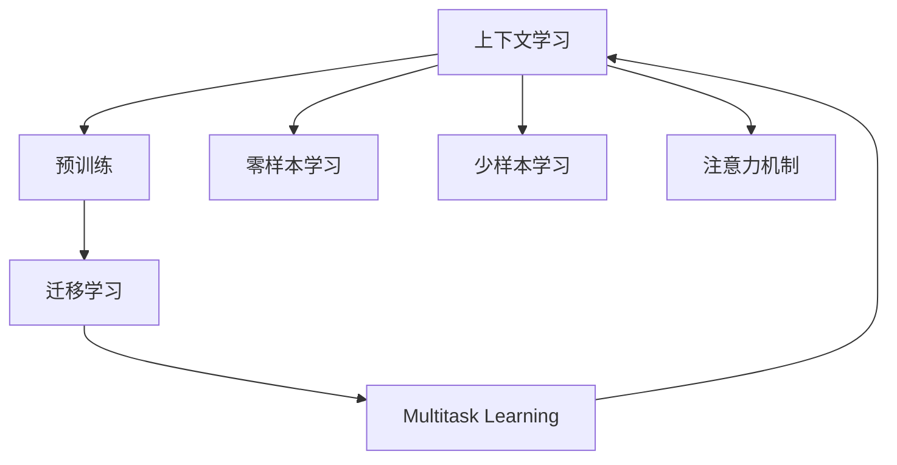

                 

# 上下文学习：零样本和少样本学习技术

> 关键词：上下文学习(Contextual Learning)，零样本学习(Zero-shot Learning)，少样本学习(Few-shot Learning)，预训练(Pre-training)，迁移学习(Transfer Learning)，多任务学习(Multi-task Learning)，注意力机制(Attention Mechanism)

## 1. 背景介绍

### 1.1 问题由来
在自然语言处理(NLP)、计算机视觉(CV)等人工智能领域，数据标注是构建模型的重要步骤。然而，标注数据往往需要大量人工参与，成本高、效率低，难以适应实际应用需求。为了解决这一问题，学术界和产业界提出了一系列基于上下文学习的技术，通过有效利用少量或无标签数据，提高模型对新任务的适应能力。

具体而言，上下文学习是指利用预训练模型在不同任务之间迁移知识，通过学习输入数据的上下文特征，直接进行新任务的推理或生成。在零样本学习中，模型完全无标签训练数据，仅依靠输入的上下文信息完成学习；在少样本学习中，模型仅使用少量标注数据，通过迁移学习和上下文学习机制，提升对新任务的理解和预测能力。

这些技术不仅能够显著降低标注成本，还能在数据稀缺、资源有限的场景下，快速实现模型的泛化和学习。例如，在大规模图像分类任务中，使用预训练的图像识别模型，结合少量样本标注，即可在新的类别上实现高效的迁移学习。在自然语言生成任务中，零样本或少样本学习的技术，使模型能够基于任务描述，生成符合期望的输出，如自动摘要、对话生成等。

### 1.2 问题核心关键点
上下文学习的关键在于如何设计预训练模型，并有效利用任务描述、提示词等上下文信息，实现新任务的推理和生成。主要包含以下几个核心问题：

1. 预训练模型的选择：不同的预训练模型在迁移学习能力和下游任务适配性上有所不同，选择适合任务需求的预训练模型至关重要。
2. 上下文信息的设计：任务描述、提示词等上下文信息的设计，直接影响模型的推理效果和泛化能力。
3. 多任务学习和迁移学习的结合：如何通过多任务学习，增强模型的泛化能力和迁移能力，提升新任务的学习效果。
4. 注意力机制的引入：通过注意力机制，使模型能够更加关注任务相关的输入信息，提高推理和生成的准确性。

## 2. 核心概念与联系

### 2.1 核心概念概述

为更好地理解上下文学习技术，本节将介绍几个密切相关的核心概念：

- 上下文学习(Contextual Learning)：指利用预训练模型的上下文特征，直接进行新任务的推理和生成，无需标签数据。通过上下文信息，模型能够快速适应新任务，提升推理和生成的效果。
- 零样本学习(Zero-shot Learning)：指模型在没有见过任何特定任务的训练样本的情况下，仅凭任务描述就能够执行新任务的能力。通常通过在输入中提供少量示例或文本提示，实现零样本学习。
- 少样本学习(Few-shot Learning)：指在只有少量标注样本的情况下，模型能够快速适应新任务，提升对新任务的推理和生成能力。通常通过提供少量标注样本和大量未标注数据进行训练。
- 预训练(Pre-training)：指在大规模无标签数据上，通过自监督学习任务训练通用语言模型，学习通用语言表示。预训练为上下文学习提供了丰富的上下文知识。
- 迁移学习(Transfer Learning)：指将一个领域学习到的知识，迁移应用到另一个不同但相关的领域的学习范式。通过迁移学习，预训练模型能够更好地适应新任务，提升学习效果。
- 多任务学习(Multi-task Learning)：指同时学习多个相关任务，共享预训练参数，提升模型在多任务上的泛化能力和迁移能力。

这些核心概念之间的逻辑关系可以通过以下Mermaid流程图来展示：



这个流程图展示上下文学习的核心概念及其之间的关系：

1. 上下文学习通过预训练模型学习上下文特征，无需标注数据。
2. 零样本学习和少样本学习是上下文学习的特例，在特定上下文信息下进行学习。
3. 预训练为上下文学习提供上下文知识，是上下文学习的基础。
4. 迁移学习使预训练模型能够更好地适应新任务，提升学习效果。
5. 多任务学习增强模型的泛化能力和迁移能力，通过共享参数提升模型性能。
6. 注意力机制使模型能够更加关注任务相关的输入信息，提高推理和生成的准确性。

这些概念共同构成了上下文学习的学习和应用框架，使得模型能够在各种场景下进行高效的学习和推理。

## 3. 核心算法原理 & 具体操作步骤

### 3.1 算法原理概述

上下文学习的基本原理是通过预训练模型，学习输入数据的上下文特征，直接进行新任务的推理和生成。其主要步骤包括：

1. 选择预训练模型：基于任务需求选择合适的预训练模型。常见的预训练模型包括BERT、GPT、ViT等。
2. 设计任务描述或提示词：根据任务需求，设计合适的任务描述或提示词，作为上下文信息。
3. 融合上下文信息：通过注意力机制、多任务学习等方法，将上下文信息融合到模型中。
4. 进行推理或生成：在新的任务上进行推理或生成，如分类、生成文本、图像等。

### 3.2 算法步骤详解

具体而言，上下文学习的算法步骤如下：

**Step 1: 准备预训练模型和上下文信息**
- 选择合适的预训练模型 $M_{\theta}$ 作为初始化参数。
- 设计任务描述 $D$ 或提示词 $P$，作为上下文信息。

**Step 2: 融合上下文信息**
- 将上下文信息 $D$ 或 $P$ 输入到预训练模型中，通过注意力机制、多任务学习等方法，将上下文信息与预训练权重 $M_{\theta}$ 融合。
- 对于零样本学习，完全依赖预训练模型的上下文特征进行推理或生成。
- 对于少样本学习，可以使用少量标注数据进行微调，进一步提升模型的推理或生成能力。

**Step 3: 进行推理或生成**
- 在新的任务上进行推理或生成。例如，在图像分类任务中，输入新图像及其对应的任务描述，模型通过上下文学习进行分类。
- 在文本生成任务中，输入任务描述或提示词，模型通过上下文学习生成符合期望的文本。

**Step 4: 评估和优化**
- 使用验证集对模型的推理或生成结果进行评估，根据评估结果调整上下文信息或预训练模型参数。
- 重复上述步骤，直至模型在新的任务上达到满意的推理或生成效果。

### 3.3 算法优缺点

上下文学习的优点包括：

1. 无需标注数据：零样本学习完全依赖预训练模型的上下文特征，降低标注数据需求，适合数据稀缺场景。
2. 泛化能力强：少样本学习和零样本学习通过上下文信息增强泛化能力，适应性强，能够处理多种类型的任务。
3. 学习效率高：通过上下文信息引导模型学习，训练时间较短，适合快速部署和应用。
4. 可解释性强：上下文学习模型通常以预训练模型为基础，其决策过程具有一定的可解释性。

同时，上下文学习也存在一些局限性：

1. 数据分布假设：上下文学习的效果很大程度上取决于预训练模型和上下文信息的设计，对数据分布有较高的假设要求。
2. 性能依赖上下文：上下文信息的设计对模型性能有显著影响，设计不当可能导致模型效果下降。
3. 鲁棒性不足：预训练模型的固有偏见和噪声，可能通过上下文学习传递到新任务，影响模型性能。
4. 数据隐私问题：上下文学习可能涉及用户隐私数据，需要采取数据脱敏、隐私保护等措施。

尽管存在这些局限性，但就目前而言，上下文学习仍然是大规模数据稀缺、资源有限场景下的高效学习范式。未来相关研究的重点在于如何进一步提高上下文学习的泛化能力，优化上下文信息的设计，同时兼顾可解释性和伦理安全性等因素。

### 3.4 算法应用领域

上下文学习在NLP、CV等人工智能领域已经得到了广泛的应用，覆盖了以下几类任务：

- 文本分类：如情感分析、主题分类、意图识别等。通过上下文信息，模型能够理解文本的上下文语义，进行分类预测。
- 命名实体识别：识别文本中的人名、地名、机构名等特定实体。通过上下文信息，模型能够精确判断实体的边界和类型。
- 图像分类：对输入图像进行分类，如物体识别、场景分类等。通过上下文信息，模型能够学习图像的特征表示。
- 机器翻译：将源语言文本翻译成目标语言。通过上下文信息，模型能够理解源语言文本的语义，生成目标语言文本。
- 文本生成：如自动摘要、对话生成等。通过上下文信息，模型能够生成符合任务要求的文本。
- 图像生成：如图像转换、图像编辑等。通过上下文信息，模型能够生成新的图像内容。

此外，上下文学习还被创新性地应用到更多场景中，如可控文本生成、常识推理、代码生成、数据增强等，为人工智能技术带来了全新的突破。

## 4. 数学模型和公式 & 详细讲解  

### 4.1 数学模型构建

本节将使用数学语言对上下文学习的数学模型进行更加严格的刻画。

记预训练模型为 $M_{\theta}:\mathcal{X} \rightarrow \mathcal{Y}$，其中 $\mathcal{X}$ 为输入空间，$\mathcal{Y}$ 为输出空间，$\theta$ 为预训练得到的模型参数。假设上下文信息为 $C$，任务描述为 $T$。

定义上下文学习模型 $F_{\phi}$ 在输入 $(x, C)$ 上的推理结果为 $F_{\phi}(x, C)$，其中 $\phi$ 为模型参数。

在零样本学习中，模型完全依赖预训练模型的上下文特征进行推理或生成，上下文信息 $C$ 为输入文本。在少样本学习中，模型通过融合少量标注数据 $D=\{(x_i, y_i)\}_{i=1}^N$ 和上下文信息 $C$ 进行微调。

### 4.2 公式推导过程

以下我们以图像分类任务为例，推导基于上下文学习的推理公式。

假设模型 $M_{\theta}$ 在输入 $x$ 上的输出为 $M_{\theta}(x) \in \mathbb{R}^d$，表示图像特征向量。上下文信息 $C$ 为图像的描述文本，表示为 $C=x_{text}$。任务描述 $T$ 为图像的类别标签，表示为 $T=y$。

定义上下文学习模型 $F_{\phi}$ 在输入 $(x, C)$ 上的推理结果为：

$$
F_{\phi}(x, C) = M_{\theta}(x) + \phi(C)
$$

其中，$\phi$ 为上下文信息 $C$ 与预训练模型 $M_{\theta}$ 的融合函数。

推理公式 $\phi$ 的具体形式，取决于上下文信息的设计和预训练模型的结构。对于文本描述 $C=x_{text}$，可以使用多任务学习或注意力机制，将其与图像特征向量 $M_{\theta}(x)$ 融合。例如，在BERT模型中，可以通过将图像描述 $C$ 输入到BERT模型，使用BERT的上下文特征进行推理。

对于图像分类任务，模型最终输出 $F_{\phi}(x, C)$ 的分类概率分布，表示为：

$$
P(T|x, C) = softmax(\phi(C) \cdot M_{\theta}(x)^T)
$$

其中，$\cdot$ 表示矩阵乘积，$softmax$ 函数用于将输出转化为概率分布。

在训练过程中，使用交叉熵损失函数对模型进行优化：

$$
\mathcal{L}(\phi, \theta) = -\frac{1}{N} \sum_{i=1}^N \log P(T_i|x_i, C_i)
$$

其中，$\{(x_i, C_i)\}_{i=1}^N$ 为训练数据集，$T_i$ 为对应的类别标签。

在优化过程中，同时更新上下文信息 $\phi$ 和预训练模型 $M_{\theta}$ 的参数，以最小化损失函数 $\mathcal{L}(\phi, \theta)$。

### 4.3 案例分析与讲解

在实际应用中，上下文学习模型的构建和优化需要结合具体的任务需求进行设计。以下以BERT模型在零样本图像分类任务中的应用为例，进行详细讲解：

**Step 1: 准备预训练模型和上下文信息**
- 选择BERT模型作为初始化参数。
- 设计图像描述文本 $C=x_{text}$ 作为上下文信息。

**Step 2: 融合上下文信息**
- 将图像描述文本 $C$ 输入到BERT模型中，得到上下文特征 $H_{bert}$。
- 将图像特征向量 $M_{\theta}(x)$ 和上下文特征 $H_{bert}$ 融合，得到融合特征 $F_{\phi}(x, C) = M_{\theta}(x) + \phi(H_{bert})$。
- 其中 $\phi$ 为简单的加法或注意力机制，例如：

$$
\phi(H_{bert}) = \alpha * H_{bert} + (1-\alpha) * M_{\theta}(x)
$$

其中 $\alpha$ 为注意力系数，表示上下文特征对模型输出的贡献程度。

**Step 3: 进行推理或生成**
- 在新的图像上进行推理或生成。例如，输入新图像 $x$ 及其对应的图像描述文本 $C$，模型通过上下文学习进行分类预测。

**Step 4: 评估和优化**
- 使用验证集对模型的推理或生成结果进行评估，根据评估结果调整上下文信息 $C$ 或预训练模型 $M_{\theta}$ 参数。
- 重复上述步骤，直至模型在新的任务上达到满意的推理或生成效果。

## 5. 项目实践：代码实例和详细解释说明

### 5.1 开发环境搭建

在进行上下文学习实践前，我们需要准备好开发环境。以下是使用Python进行PyTorch开发的环境配置流程：

1. 安装Anaconda：从官网下载并安装Anaconda，用于创建独立的Python环境。

2. 创建并激活虚拟环境：
```bash
conda create -n pytorch-env python=3.8 
conda activate pytorch-env
```

3. 安装PyTorch：根据CUDA版本，从官网获取对应的安装命令。例如：
```bash
conda install pytorch torchvision torchaudio cudatoolkit=11.1 -c pytorch -c conda-forge
```

4. 安装HuggingFace Transformers库：
```bash
pip install transformers
```

5. 安装各类工具包：
```bash
pip install numpy pandas scikit-learn matplotlib tqdm jupyter notebook ipython
```

完成上述步骤后，即可在`pytorch-env`环境中开始上下文学习实践。

### 5.2 源代码详细实现

下面我以BERT模型在零样本图像分类任务中的应用为例，给出使用Transformers库进行上下文学习的PyTorch代码实现。

首先，定义图像分类任务的数据处理函数：

```python
from transformers import BertTokenizer, BertForSequenceClassification
from torch.utils.data import Dataset
import torch

class ImageClassificationDataset(Dataset):
    def __init__(self, images, captions, labels, tokenizer, max_len=128):
        self.images = images
        self.captions = captions
        self.labels = labels
        self.tokenizer = tokenizer
        self.max_len = max_len
        
    def __len__(self):
        return len(self.images)
    
    def __getitem__(self, item):
        image = self.images[item]
        caption = self.captions[item]
        label = self.labels[item]
        
        encoding = self.tokenizer(caption, return_tensors='pt', max_length=self.max_len, padding='max_length', truncation=True)
        image = image.unsqueeze(0)
        
        return {'image': image,
                'features': encoding['input_ids'],
                'attention_mask': encoding['attention_mask'],
                'labels': label}

# 创建dataset
tokenizer = BertTokenizer.from_pretrained('bert-base-cased')

train_dataset = ImageClassificationDataset(train_images, train_captions, train_labels, tokenizer)
dev_dataset = ImageClassificationDataset(dev_images, dev_captions, dev_labels, tokenizer)
test_dataset = ImageClassificationDataset(test_images, test_captions, test_labels, tokenizer)
```

然后，定义模型和优化器：

```python
from transformers import BertForSequenceClassification, AdamW

model = BertForSequenceClassification.from_pretrained('bert-base-cased', num_labels=5)

optimizer = AdamW(model.parameters(), lr=2e-5)
```

接着，定义训练和评估函数：

```python
from torch.utils.data import DataLoader
from tqdm import tqdm
from sklearn.metrics import accuracy_score

device = torch.device('cuda') if torch.cuda.is_available() else torch.device('cpu')
model.to(device)

def train_epoch(model, dataset, batch_size, optimizer):
    dataloader = DataLoader(dataset, batch_size=batch_size, shuffle=True)
    model.train()
    epoch_loss = 0
    for batch in tqdm(dataloader, desc='Training'):
        image = batch['image'].to(device)
        features = batch['features'].to(device)
        attention_mask = batch['attention_mask'].to(device)
        labels = batch['labels'].to(device)
        model.zero_grad()
        outputs = model(image, features=features, attention_mask=attention_mask, labels=labels)
        loss = outputs.loss
        epoch_loss += loss.item()
        loss.backward()
        optimizer.step()
    return epoch_loss / len(dataloader)

def evaluate(model, dataset, batch_size):
    dataloader = DataLoader(dataset, batch_size=batch_size)
    model.eval()
    preds, labels = [], []
    with torch.no_grad():
        for batch in tqdm(dataloader, desc='Evaluating'):
            image = batch['image'].to(device)
            features = batch['features'].to(device)
            attention_mask = batch['attention_mask'].to(device)
            batch_labels = batch['labels']
            outputs = model(image, features=features, attention_mask=attention_mask)
            batch_preds = outputs.logits.argmax(dim=1).to('cpu').tolist()
            batch_labels = batch_labels.to('cpu').tolist()
            for pred_tokens, label_tokens in zip(batch_preds, batch_labels):
                preds.append(pred_tokens)
                labels.append(label_tokens)
                
    print(f'Accuracy: {accuracy_score(labels, preds)}')
```

最后，启动训练流程并在测试集上评估：

```python
epochs = 5
batch_size = 16

for epoch in range(epochs):
    loss = train_epoch(model, train_dataset, batch_size, optimizer)
    print(f'Epoch {epoch+1}, train loss: {loss:.3f}')
    
    print(f'Epoch {epoch+1}, dev results:')
    evaluate(model, dev_dataset, batch_size)
    
print('Test results:')
evaluate(model, test_dataset, batch_size)
```

以上就是使用PyTorch对BERT进行零样本图像分类任务上下文学习的完整代码实现。可以看到，借助Transformers库的强大封装，我们可以在相对简洁的代码中实现BERT模型的上下文学习。

### 5.3 代码解读与分析

让我们再详细解读一下关键代码的实现细节：

**ImageClassificationDataset类**：
- `__init__`方法：初始化图像、文本、标签等关键组件，并定义最大长度、分词器等参数。
- `__len__`方法：返回数据集的样本数量。
- `__getitem__`方法：对单个样本进行处理，将图像和文本输入编码为token ids，并添加[CLS]标记，用于上下文特征的提取。

**模型和优化器**：
- 定义BERT模型作为初始化参数，设置合适的学习率。

**训练和评估函数**：
- 使用PyTorch的DataLoader对数据集进行批次化加载，供模型训练和推理使用。
- 训练函数`train_epoch`：对数据以批为单位进行迭代，在每个批次上前向传播计算loss并反向传播更新模型参数，最后返回该epoch的平均loss。
- 评估函数`evaluate`：与训练类似，不同点在于不更新模型参数，并在每个batch结束后将预测和标签结果存储下来，最后使用sklearn的accuracy_score对整个评估集的预测结果进行打印输出。

**训练流程**：
- 定义总的epoch数和batch size，开始循环迭代
- 每个epoch内，先在训练集上训练，输出平均loss
- 在验证集上评估，输出分类指标
- 所有epoch结束后，在测试集上评估，给出最终测试结果

可以看到，PyTorch配合Transformers库使得上下文学习的代码实现变得简洁高效。开发者可以将更多精力放在数据处理、模型改进等高层逻辑上，而不必过多关注底层的实现细节。

当然，工业级的系统实现还需考虑更多因素，如模型的保存和部署、超参数的自动搜索、更灵活的任务适配层等。但核心的上下文学习范式基本与此类似。

## 6. 实际应用场景
### 6.1 智能客服系统

基于上下文学习的对话技术，可以广泛应用于智能客服系统的构建。传统客服往往需要配备大量人力，高峰期响应缓慢，且一致性和专业性难以保证。而使用上下文学习的对话模型，可以7x24小时不间断服务，快速响应客户咨询，用自然流畅的语言解答各类常见问题。

在技术实现上，可以收集企业内部的历史客服对话记录，将问题和最佳答复构建成监督数据，在此基础上对预训练对话模型进行上下文学习。上下文学习后的对话模型能够自动理解用户意图，匹配最合适的答案模板进行回复。对于客户提出的新问题，还可以接入检索系统实时搜索相关内容，动态组织生成回答。如此构建的智能客服系统，能大幅提升客户咨询体验和问题解决效率。

### 6.2 金融舆情监测

金融机构需要实时监测市场舆论动向，以便及时应对负面信息传播，规避金融风险。传统的人工监测方式成本高、效率低，难以应对网络时代海量信息爆发的挑战。基于上下文学习的文本分类和情感分析技术，为金融舆情监测提供了新的解决方案。

具体而言，可以收集金融领域相关的新闻、报道、评论等文本数据，并对其进行主题标注和情感标注。在此基础上对预训练语言模型进行上下文学习，使其能够自动判断文本属于何种主题，情感倾向是正面、中性还是负面。将上下文学习后的模型应用到实时抓取的网络文本数据，就能够自动监测不同主题下的情感变化趋势，一旦发现负面信息激增等异常情况，系统便会自动预警，帮助金融机构快速应对潜在风险。

### 6.3 个性化推荐系统

当前的推荐系统往往只依赖用户的历史行为数据进行物品推荐，无法深入理解用户的真实兴趣偏好。基于上下文学习的多任务学习技术，个性化推荐系统可以更好地挖掘用户行为背后的语义信息，从而提供更精准、多样的推荐内容。

在实践中，可以收集用户浏览、点击、评论、分享等行为数据，提取和用户交互的物品标题、描述、标签等文本内容。将文本内容作为模型输入，用户的后续行为（如是否点击、购买等）作为监督信号，在此基础上进行上下文学习。上下文学习后的模型能够从文本内容中准确把握用户的兴趣点。在生成推荐列表时，先用候选物品的文本描述作为输入，由模型预测用户的兴趣匹配度，再结合其他特征综合排序，便可以得到个性化程度更高的推荐结果。

### 6.4 未来应用展望

随着上下文学习技术的发展，其在NLP、CV等领域的应用前景将更加广阔。以下是一些未来应用展望：

1. **自然语言生成**：上下文学习技术可以应用于文本生成任务，如自动摘要、对话生成等。模型通过上下文信息，生成符合期望的文本输出。
2. **多模态学习**：结合视觉、语音等多模态数据，进行多模态上下文学习，提升模型的感知能力和泛化能力。
3. **知识图谱构建**：上下文学习模型可以与知识图谱结合，从文本中提取实体和关系，构建知识图谱，提升模型的推理和生成能力。
4. **数据增强**：上下文学习模型能够生成新的训练样本，用于数据增强，提升模型的泛化能力和鲁棒性。
5. **自动编程**：上下文学习模型可以辅助编写代码，通过自然语言描述生成符合期望的代码片段，提升编程效率和质量。
6. **智能推荐**：上下文学习模型可以应用于推荐系统，提升推荐内容的个性化和多样化。
7. **情感分析**：上下文学习模型可以应用于情感分析任务，自动识别文本的情感倾向，辅助情感管理。

未来，随着上下文学习技术的不断发展，其在人工智能领域的应用将更加广泛，为自然语言处理、计算机视觉等技术的落地应用提供新的思路和方向。

## 7. 工具和资源推荐
### 7.1 学习资源推荐

为了帮助开发者系统掌握上下文学习技术，这里推荐一些优质的学习资源：

1. 《Transformer from Principle to Practice》系列博文：由大模型技术专家撰写，深入浅出地介绍了Transformer原理、上下文学习技术等前沿话题。

2. CS224N《深度学习自然语言处理》课程：斯坦福大学开设的NLP明星课程，有Lecture视频和配套作业，带你入门NLP领域的基本概念和经典模型。

3. 《Natural Language Processing with Transformers》书籍：Transformers库的作者所著，全面介绍了如何使用Transformers库进行NLP任务开发，包括上下文学习在内的诸多范式。

4. HuggingFace官方文档：Transformers库的官方文档，提供了海量预训练模型和完整的上下文学习样例代码，是上手实践的必备资料。

5. CLUE开源项目：中文语言理解测评基准，涵盖大量不同类型的中文NLP数据集，并提供了基于上下文学习的baseline模型，助力中文NLP技术发展。

通过对这些资源的学习实践，相信你一定能够快速掌握上下文学习的精髓，并用于解决实际的NLP问题。
### 7.2 开发工具推荐

高效的开发离不开优秀的工具支持。以下是几款用于上下文学习开发的常用工具：

1. PyTorch：基于Python的开源深度学习框架，灵活动态的计算图，适合快速迭代研究。大部分预训练语言模型都有PyTorch版本的实现。

2. TensorFlow：由Google主导开发的开源深度学习框架，生产部署方便，适合大规模工程应用。同样有丰富的预训练语言模型资源。

3. Transformers库：HuggingFace开发的NLP工具库，集成了众多SOTA语言模型，支持PyTorch和TensorFlow，是进行上下文学习开发的利器。

4. Weights & Biases：模型训练的实验跟踪工具，可以记录和可视化模型训练过程中的各项指标，方便对比和调优。与主流深度学习框架无缝集成。

5. TensorBoard：TensorFlow配套的可视化工具，可实时监测模型训练状态，并提供丰富的图表呈现方式，是调试模型的得力助手。

6. Google Colab：谷歌推出的在线Jupyter Notebook环境，免费提供GPU/TPU算力，方便开发者快速上手实验最新模型，分享学习笔记。

合理利用这些工具，可以显著提升上下文学习任务的开发效率，加快创新迭代的步伐。

### 7.3 相关论文推荐

上下文学习技术的发展源于学界的持续研究。以下是几篇奠基性的相关论文，推荐阅读：

1. Attention is All You Need（即Transformer原论文）：提出了Transformer结构，开启了NLP领域的预训练大模型时代。

2. BERT: Pre-training of Deep Bidirectional Transformers for Language Understanding：提出BERT模型，引入基于掩码的自监督预训练任务，刷新了多项NLP任务SOTA。

3. Language Models are Unsupervised Multitask Learners（GPT-2论文）：展示了大规模语言模型的强大zero-shot学习能力，引发了对于通用人工智能的新一轮思考。

4. Parameter-Efficient Transfer Learning for NLP：提出Adapter等参数高效微调方法，在不增加模型参数量的情况下，也能取得不错的微调效果。

5. Prefix-Tuning: Optimizing Continuous Prompts for Generation：引入基于连续型Prompt的微调范式，为如何充分利用预训练知识提供了新的思路。

6. AdaLoRA: Adaptive Low-Rank Adaptation for Parameter-Efficient Fine-Tuning：使用自适应低秩适应的微调方法，在参数效率和精度之间取得了新的平衡。

这些论文代表了大规模数据稀缺、资源有限场景下的高效学习范式。通过学习这些前沿成果，可以帮助研究者把握学科前进方向，激发更多的创新灵感。

## 8. 总结：未来发展趋势与挑战

### 8.1 总结

本文对基于上下文学习的零样本和少样本学习技术进行了全面系统的介绍。首先阐述了上下文学习的背景和意义，明确了其在大规模数据稀缺、资源有限场景下的重要价值。其次，从原理到实践，详细讲解了上下文学习的数学模型和核心算法，给出了上下文学习任务开发的完整代码实例。同时，本文还广泛探讨了上下文学习技术在智能客服、金融舆情、个性化推荐等多个行业领域的应用前景，展示了上下文学习技术的巨大潜力。此外，本文精选了上下文学习的各类学习资源，力求为读者提供全方位的技术指引。

通过本文的系统梳理，可以看到，基于上下文学习的零样本和少样本学习技术正在成为大规模数据稀缺、资源有限场景下的高效学习范式，极大地拓展了预训练语言模型的应用边界，催生了更多的落地场景。受益于大规模语料的预训练，上下文学习模型以更低的时间和标注成本，在小样本条件下也能取得不俗的效果，有力推动了NLP技术的产业化进程。未来，伴随上下文学习技术的不断发展，其在人工智能领域的应用将更加广泛，为自然语言处理、计算机视觉等技术的落地应用提供新的思路和方向。

### 8.2 未来发展趋势

展望未来，上下文学习技术将呈现以下几个发展趋势：

1. **模型规模持续增大**：随着算力成本的下降和数据规模的扩张，预训练语言模型的参数量还将持续增长。超大批次的训练和推理也可能遇到显存不足的问题。因此，如何提高上下文学习模型的计算效率，优化模型结构，是未来研究的重要方向。

2. **上下文信息设计多样化**：上下文信息的设计对上下文学习的效果有显著影响。未来的研究将探索更多种类的上下文信息，如视觉特征、语音特征等，提升模型的多模态学习能力。

3. **多任务学习和迁移学习的深度结合**：通过多任务学习和迁移学习，上下文学习模型能够更好地适应多领域任务，提高泛化能力和迁移能力。未来研究将探索更多多任务学习的策略，提升上下文学习模型的性能。

4. **注意力机制的进一步优化**：注意力机制是上下文学习模型的核心组成部分，未来的研究将探索更多的注意力机制设计，如自适应注意力、多层次注意力等，提升模型的推理和生成能力。

5. **上下文学习与其他技术的结合**：上下文学习技术可以与强化学习、知识图谱等技术结合，提升模型的推理和生成能力。未来研究将探索更多上下文学习与其他技术的结合方式，提升模型的性能和应用范围。

6. **上下文学习的伦理和安全问题**：上下文学习模型可能涉及用户隐私数据，如何保护数据隐私、避免模型偏见，是未来研究的重要课题。

以上趋势凸显了上下文学习技术的广阔前景。这些方向的探索发展，必将进一步提升上下文学习模型的性能和应用范围，为人工智能技术的落地应用提供新的思路和方向。

### 8.3 面临的挑战

尽管上下文学习技术已经取得了显著成果，但在迈向更加智能化、普适化应用的过程中，仍面临诸多挑战：

1. **数据分布假设**：上下文学习的效果很大程度上取决于预训练模型和上下文信息的设计，对数据分布有较高的假设要求。如何设计更鲁棒的上下文信息，适应不同数据分布，是未来研究的重要方向。

2. **上下文信息设计难度**：上下文信息的设计对上下文学习的效果有显著影响，设计不当可能导致模型效果下降。如何设计更高效的上下文信息，是未来研究的重要课题。

3. **上下文学习模型的鲁棒性**：预训练模型的固有偏见和噪声，可能通过上下文学习传递到新任务，影响模型性能。如何提高上下文学习模型的鲁棒性，避免灾难性遗忘，还需要更多理论和实践的积累。

4. **上下文学习模型的可解释性**：当前上下文学习模型通常以预训练模型为基础，其决策过程具有一定的可解释性。如何提高上下文学习模型的可解释性，特别是模型的推理和生成过程，是未来研究的重要方向。

5. **上下文学习模型的计算效率**：上下文学习模型通常需要更大的计算资源进行训练和推理。如何提高上下文学习模型的计算效率，优化模型结构，减少计算资源消耗，是未来研究的重要方向。

6. **上下文学习模型的应用场景**：上下文学习模型在特定应用场景中，可能会遇到泛化能力不足的问题。如何提高上下文学习模型在各种应用场景中的泛化能力，是未来研究的重要方向。

7. **上下文学习模型的数据隐私问题**：上下文学习模型可能涉及用户隐私数据，如何保护数据隐私、避免模型偏见，是未来研究的重要课题。

面对这些挑战，未来的研究需要在上下文信息设计、模型结构优化、算法改进等多个方面寻求新的突破，才能进一步提升上下文学习模型的性能和应用范围。

### 8.4 研究展望

面向未来，上下文学习技术的研究方向包括：

1. **探索无监督和半监督上下文学习**：摆脱对大规模标注数据的依赖，利用自监督学习、主动学习等无监督和半监督范式，最大限度利用非结构化数据，实现更加灵活高效的上下文学习。

2. **研究参数高效和计算高效的上下文学习范式**：开发更加参数高效的上下文学习方法，在固定大部分预训练参数的同时，只更新极少量的任务相关参数。同时优化上下文学习模型的计算图，减少前向传播和反向传播的资源消耗，实现更加轻量级、实时性的部署。

3. **融合因果和对比学习范式**：通过引入因果推断和对比学习思想，增强上下文学习模型建立稳定因果关系的能力，学习更加普适、鲁棒的语言表征，从而提升模型泛化性和抗干扰能力。

4. **引入更多先验知识**：将符号化的先验知识，如知识图谱、逻辑规则等，与神经网络模型进行巧妙融合，引导上下文学习过程学习更准确、合理的语言模型。同时加强不同模态数据的整合，实现视觉、语音等多模态信息与文本信息的协同建模。

5. **结合因果分析和博弈论工具**：将因果分析方法引入上下文学习模型，识别出模型决策的关键特征，增强输出解释的因果性和逻辑性。借助博弈论工具刻画人机交互过程，主动探索并规避模型的脆弱点，提高系统稳定性。

6. **纳入伦理道德约束**：在模型训练目标中引入伦理导向的评估指标，过滤和惩罚有偏见、有害的输出倾向。同时加强人工干预和审核，建立模型行为的监管机制，确保输出符合人类价值观和伦理道德。

这些研究方向的探索，必将引领上下文学习技术迈向更高的台阶，为构建安全、可靠、可解释、可控的智能系统铺平道路。面向未来，上下文学习技术还需要与其他人工智能技术进行更深入的融合，如知识表示、因果推理、强化学习等，多路径协同发力，共同推动人工智能技术的进步。只有勇于创新、敢于突破，才能不断拓展上下文学习模型的边界，让智能技术更好地造福人类社会。

## 9. 附录：常见问题与解答

**Q1: 上下文学习和传统机器学习有什么区别？**

A: 上下文学习主要利用预训练模型的上下文特征，直接进行新任务的推理和生成，无需标注数据。而传统机器学习通常需要大量的标注数据进行训练，学习模型参数，然后进行预测。上下文学习可以在数据稀缺、资源有限的场景下，快速实现模型的泛化和学习。

**Q2: 上下文学习在实际应用中有哪些限制？**

A: 上下文学习的性能很大程度上取决于上下文信息的设计，对数据分布有较高的假设要求。设计不当可能导致模型效果下降。此外，上下文学习模型可能涉及用户隐私数据，需要采取数据脱敏、隐私保护等措施。

**Q3: 上下文学习能否用于大规模图像分类任务？**

A: 上下文学习可以通过上下文信息引导模型学习，在图像分类任务中也有很好的应用。例如，通过图像描述文本作为上下文信息，引导BERT模型进行图像分类。但上下文学习的效果也会受到预训练模型和上下文信息的设计影响。

**Q4: 上下文学习中的注意力机制有哪些设计方法？**

A: 上下文学习中的注意力机制设计方法多种多样，常用的有：
1. 自适应注意力：根据任务需求，动态调整注意力机制的权重，适应不同任务。
2. 多层次注意力：将注意力机制分成多个层次，不同层次关注不同级别的特征。
3. 多任务注意力：将注意力机制应用于多任务学习，增强模型在不同任务上的泛化能力。
4. 自注意力机制：通过自注意力机制，关注输入序列中不同位置的特征，提升模型的理解能力。

**Q5: 上下文学习是否适用于所有自然语言处理任务？**

A: 上下文学习在大多数自然语言处理任务上都能取得不错的效果，特别是对于数据量较小的任务。但对于一些特定领域的任务，如医学、法律等，仅仅依靠通用语料预训练的模型可能难以很好地适应。此时需要在特定领域语料上进一步预训练，再进行上下文学习。

通过本文的系统梳理，可以看到，基于上下文学习的零样本和少样本学习技术正在成为大规模数据稀缺、资源有限场景下的高效学习范式，极大地拓展了预训练语言模型的应用边界，催生了更多的落地场景。受益于大规模语料的预训练，上下文学习模型以更低的时间和标注成本，在小样本条件下也能取得不俗的效果，有力推动了NLP技术的产业化进程。未来，伴随上下文学习技术的不断发展，其在人工智能领域的应用将更加广泛，为自然语言处理、计算机视觉等技术的落地应用提供新的思路和方向。

