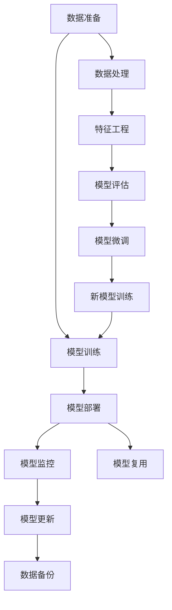

                 

## 1. 背景介绍

在当今数字化转型浪潮中，人工智能（AI）作为核心驱动力，正迅速改变各行各业的业务模式。其中，云原生AI（Cloud-Native AI）作为一种新型的AI架构范式，正在重新定义AI技术的应用方式和业务价值。Lepton AI，作为云原生AI领域的领先者，提出了基于云原生的AI技术理念，旨在通过更加灵活、高效、安全的方式来构建和部署AI模型，满足企业对AI应用的高需求、低成本、高可用性的要求。本文将深入探讨Lepton AI的技术理念，为读者揭示云原生AI的核心价值和实现路径。

## 2. 核心概念与联系

### 2.1 核心概念概述

Lepton AI基于云原生的理念，将AI模型的构建、训练、部署和运行等各个环节全面迁移到云上，通过容器化、微服务化、自动化和管道化等手段，打造一个高效、弹性、可扩展的AI生态系统。以下是Lepton AI核心概念的简要介绍：

- **容器化**：将AI模型及其依赖打包成容器，确保模型的运行环境一致性，提升模型的部署效率和可移植性。
- **微服务化**：将AI模型的不同组件和服务模块化，支持独立部署、水平扩展和弹性伸缩，提高系统的灵活性和可维护性。
- **自动化**：通过CI/CD（持续集成/持续部署）管道，自动化模型的构建、训练、测试、部署和监控，减少人工干预，提高效率和质量。
- **管道化**：通过流水线（Pipeline）构建数据处理、模型训练、模型评估和模型部署的自动化流程，实现全生命周期的自动化管理。

这些概念共同构成了Lepton AI的云原生AI架构，其核心目标是通过云计算的优势，提供更加高效、灵活、可扩展的AI应用方案，为企业创造更大的价值。

### 2.2 核心概念原理和架构的 Mermaid 流程图



该图表展示了Lepton AI的核心流程：首先，数据经过清洗、标注等处理，进入模型训练阶段；训练好的模型部署到云端，并自动监控模型性能；模型在运行过程中，可以接收新的数据进行微调，并利用备份机制保障数据安全；同时，旧模型可以被复用，进一步优化。这一流程强调了数据的流动性和模型的弹性，是云原生AI架构的典型特征。

## 3. 核心算法原理 & 具体操作步骤

### 3.1 算法原理概述

Lepton AI的核心算法原理主要体现在以下几个方面：

- **分布式训练**：利用云计算的分布式计算能力，将模型训练任务分散到多个节点上并行执行，大幅提升训练速度和效率。
- **自动混合精度**：在模型训练过程中，自动调整计算精度，优化模型参数，减少内存和计算资源消耗，提高训练性能。
- **弹性伸缩**：根据模型的负载情况动态调整计算资源，实现系统的弹性伸缩，确保系统的高可用性和稳定性。
- **模型推理优化**：通过模型压缩、量化等技术手段，优化模型的推理性能，提升系统响应速度和资源利用率。

### 3.2 算法步骤详解

Lepton AI的算法步骤主要包括以下几个环节：

1. **数据准备**：收集、清洗和标注数据，并将其按需划分为训练集、验证集和测试集。
2. **模型构建**：选择合适的AI框架（如TensorFlow、PyTorch等）和模型结构，设计模型的网络架构。
3. **模型训练**：在分布式计算环境中，通过自动混合精度的优化，对模型进行训练，并记录训练日志和指标。
4. **模型评估**：在测试集上评估模型性能，通过指标分析模型的泛化能力和稳定性。
5. **模型微调**：根据评估结果，对模型进行微调，更新参数并重新训练。
6. **模型部署**：将训练好的模型部署到云上，并配置监控和备份机制。
7. **模型更新**：定期接收新的数据，对模型进行重新训练和微调，确保模型不断更新和优化。

### 3.3 算法优缺点

Lepton AI的算法优势显著，主要体现在以下几个方面：

- **高效性**：通过分布式训练和弹性伸缩，大幅提升模型训练和推理的速度和效率。
- **灵活性**：支持灵活的模型构建和微调，适应不同任务和需求。
- **可靠性**：利用云计算的冗余和备份机制，保障系统的稳定性和高可用性。
- **可扩展性**：支持水平扩展，满足不断增长的计算需求。

然而，Lepton AI也存在一些局限性：

- **成本问题**：初期建设成本较高，需要投入较重的硬件资源。
- **安全风险**：数据和模型在云上存储和传输，面临一定的安全风险。
- **技术门槛**：需要具备一定的云计算和AI技术背景，才能有效使用。

### 3.4 算法应用领域

Lepton AI的算法理念和实现方法适用于各种AI应用场景，以下是几个典型的应用领域：

- **智能客服**：利用微服务化和自动化管道，构建弹性、可扩展的智能客服系统，提升客户满意度和服务效率。
- **智能推荐**：通过模型压缩和量化优化，构建高性能的推荐引擎，实现个性化推荐，提升用户体验。
- **金融风控**：利用分布式训练和自动混合精度，构建高性能的金融风控模型，实时监控和评估金融风险。
- **医疗诊断**：通过模型微调和弹性伸缩，构建高精度的医疗诊断模型，辅助医生进行诊断和治疗决策。

## 4. 数学模型和公式 & 详细讲解 & 举例说明

### 4.1 数学模型构建

Lepton AI的数学模型构建主要围绕以下几类任务展开：

- **分类任务**：将数据划分为正负样本，利用交叉熵损失函数训练模型，输出类别概率。
- **回归任务**：将数据映射到连续值，利用均方误差损失函数训练模型，输出预测值。
- **序列生成任务**：将数据按序列排序，利用序列生成损失函数训练模型，输出生成序列。

### 4.2 公式推导过程

以分类任务为例，设训练数据集为 $\{(x_i,y_i)\}_{i=1}^N$，模型输出为 $\hat{y} = \text{softmax}(W^Tx_i + b)$，其中 $W$ 和 $b$ 为模型参数。交叉熵损失函数为：

$$
L(y,\hat{y}) = -\frac{1}{N}\sum_{i=1}^N y_i \log \hat{y}_i + (1-y_i) \log (1-\hat{y}_i)
$$

通过梯度下降等优化算法，不断调整模型参数 $W$ 和 $b$，最小化损失函数 $L$。

### 4.3 案例分析与讲解

假设有一家电商平台，利用Lepton AI进行商品推荐系统开发。数据准备阶段，收集用户行为数据和商品属性数据，并进行清洗和标注。模型构建阶段，选择序列生成模型（如RNN、LSTM等），设计推荐算法。模型训练阶段，利用云计算的分布式训练能力，自动混合精度的优化，对模型进行训练，并记录训练日志和指标。模型评估阶段，在测试集上评估模型性能，通过指标分析模型的泛化能力和稳定性。模型微调阶段，根据评估结果，对模型进行微调，更新参数并重新训练。模型部署阶段，将训练好的模型部署到云上，并配置监控和备份机制。模型更新阶段，定期接收新的数据，对模型进行重新训练和微调，确保模型不断更新和优化。

## 5. 项目实践：代码实例和详细解释说明

### 5.1 开发环境搭建

首先，搭建Python开发环境，包括安装Python、PyTorch、TensorFlow等AI框架，以及相应的依赖库。然后，在Kubernetes集群上部署Lepton AI的模型训练和推理容器。最后，配置CI/CD管道，实现自动化构建、训练、部署和监控。

### 5.2 源代码详细实现

以下是一个基于Lepton AI的智能推荐系统的代码实现：

```python
from lepton_ai import LeptonRecommender

# 构建推荐系统
recommender = LeptonRecommender()

# 数据准备
train_data = ...
train_labels = ...
test_data = ...
test_labels = ...

# 模型训练
recommender.train(train_data, train_labels)

# 模型评估
eval_result = recommender.evaluate(test_data, test_labels)

# 模型部署
recommender.deploy()

# 模型更新
new_data = ...
recommender.update(new_data)
```

### 5.3 代码解读与分析

Lepton AI提供了丰富的API接口，便于开发者快速搭建和调试AI系统。在上述代码中，首先构建了一个智能推荐系统，然后准备训练数据和测试数据，进行模型训练和评估。最后，将训练好的模型部署到云端，并使用API接口进行模型更新。

### 5.4 运行结果展示

运行代码后，系统会根据训练数据自动调整模型参数，生成推荐结果，并在测试集上评估性能指标。同时，系统将自动备份模型参数，确保数据安全。

## 6. 实际应用场景

### 6.1 智能客服

智能客服是Lepton AI的重要应用场景之一。通过Lepton AI的微服务化和自动化管道，可以构建弹性、可扩展的智能客服系统，提升客户满意度和服务效率。系统可以自动处理常见问题，并通过自然语言处理技术，理解用户意图并给出合适的回答，同时支持多语言、多渠道的部署。

### 6.2 金融风控

在金融风控领域，利用Lepton AI构建高性能的金融风控模型，可以实时监控和评估金融风险，保障金融系统的稳定运行。系统可以自动接收新数据进行模型微调，并根据负载情况进行弹性伸缩，确保系统的高可用性和稳定性。

### 6.3 医疗诊断

在医疗诊断领域，Lepton AI通过模型微调和弹性伸缩，构建高精度的医疗诊断模型，辅助医生进行诊断和治疗决策。系统可以自动接收新数据进行模型更新，并支持多模式数据（如图像、文本、语音等）的综合分析，提升诊断准确性和效率。

### 6.4 未来应用展望

未来，Lepton AI将继续拓展其应用领域，推动云原生AI技术在更多行业中的应用。例如，在制造业，利用Lepton AI构建智能制造系统，实现生产过程的自动化和智能化；在零售业，利用Lepton AI构建智能零售平台，提升商品推荐和库存管理效率。随着技术的不断进步，Lepton AI将带来更多的创新和突破，成为AI技术的标杆和典范。

## 7. 工具和资源推荐

### 7.1 学习资源推荐

- **Lepton AI官方文档**：提供详细的API接口和示例代码，便于开发者快速上手。
- **Kubernetes官方文档**：提供全面的容器编排和部署指南，帮助开发者构建高效、可扩展的系统。
- **TensorFlow官方文档**：提供丰富的机器学习算法和工具，支持模型的构建、训练和推理。
- **PyTorch官方文档**：提供灵活的AI框架和丰富的教程，支持模型的构建和优化。

### 7.2 开发工具推荐

- **Jupyter Notebook**：提供交互式编程环境，便于开发者进行模型调试和迭代。
- **KubeSphere**：提供便捷的Kubernetes管理工具，支持模型的快速部署和运维。
- **Prometheus**：提供实时监控和告警功能，确保系统的稳定性和可用性。
- **Fluentd**：提供日志收集和分析功能，帮助开发者排查问题。

### 7.3 相关论文推荐

- **"TensorFlow: A System for Large-Scale Machine Learning"**：介绍TensorFlow的架构和设计思想，为Lepton AI的模型训练提供理论基础。
- **"Cloud-Native AI: A New Paradigm for AI Development and Deployment"**：探讨云原生AI的架构和实现方法，为Lepton AI提供设计灵感。
- **"Model Compression and Quantization for AI Model Efficiency"**：讨论模型压缩和量化的技术手段，为Lepton AI的模型优化提供指导。

## 8. 总结：未来发展趋势与挑战

### 8.1 研究成果总结

Lepton AI基于云原生的技术理念，通过容器化、微服务化、自动化和管道化等手段，打造了一个高效、弹性、可扩展的AI生态系统。其核心算法和实现方法在多个实际应用场景中得到了验证，展示了云原生AI的强大潜力和广泛应用前景。

### 8.2 未来发展趋势

未来的发展趋势主要体现在以下几个方面：

- **模型智能化**：随着AI技术的不断进步，模型的智能化程度将不断提高，能够更好地理解和处理复杂的业务逻辑。
- **系统自动化**：自动化管道和工具将进一步普及，简化模型的构建、训练、部署和运维流程，提升开发效率和系统稳定性。
- **数据融合**：通过多源数据融合，提升模型的泛化能力和鲁棒性，支持更加全面和精确的业务决策。
- **安全保障**：随着数据安全问题的日益凸显，云原生AI将更加注重数据和模型的安全保障，提供更加可靠和安全的解决方案。

### 8.3 面临的挑战

尽管Lepton AI已经取得了显著成果，但在发展过程中仍面临一些挑战：

- **技术复杂性**：云原生AI技术的应用需要较高的技术门槛，开发者需要具备一定的云计算和AI技术背景。
- **成本问题**：云计算资源的使用成本较高，需要在性能和成本之间找到平衡点。
- **数据安全**：数据在云上存储和传输，面临一定的安全风险，需要加强数据保护和隐私保护。

### 8.4 研究展望

未来，Lepton AI需要在以下几个方面继续努力：

- **简化开发流程**：通过提供更加易用的开发工具和API接口，降低开发门槛，提升开发效率。
- **优化资源使用**：通过资源优化技术，降低成本，提高系统的性能和稳定性。
- **加强安全保障**：引入更多的安全机制，保护数据和模型的安全，提升系统的可信度和可靠性。

## 9. 附录：常见问题与解答

**Q1：Lepton AI的核心优势是什么？**

A: Lepton AI的核心优势在于其云原生的架构设计，通过容器化、微服务化、自动化和管道化等手段，提供高效、弹性、可扩展的AI解决方案。其分布式训练和自动混合精度的优化，大幅提升了模型训练和推理的效率和性能。

**Q2：Lepton AI的微服务化有什么优势？**

A: 微服务化使得系统更加灵活和可扩展，支持独立部署、水平扩展和弹性伸缩，便于快速迭代和维护。同时，通过微服务之间的相互独立和协作，提升系统的可靠性和容错性。

**Q3：如何确保Lepton AI系统的安全性？**

A: 利用云计算的冗余和备份机制，确保系统的稳定性和高可用性。同时，通过加密传输、访问控制等安全措施，保护数据和模型的安全。

**Q4：Lepton AI是否支持跨云平台部署？**

A: 是的，Lepton AI的设计理念是跨云平台的，可以支持在AWS、Azure、Google Cloud等多个云平台上部署和运行。

**Q5：Lepton AI的模型优化有哪些技术手段？**

A: Lepton AI通过模型压缩、量化、自动混合精度等技术手段，优化模型的推理性能，提升系统响应速度和资源利用率。同时，支持模型微调和弹性伸缩，确保模型的高可用性和稳定性。

---

作者：禅与计算机程序设计艺术 / Zen and the Art of Computer Programming

