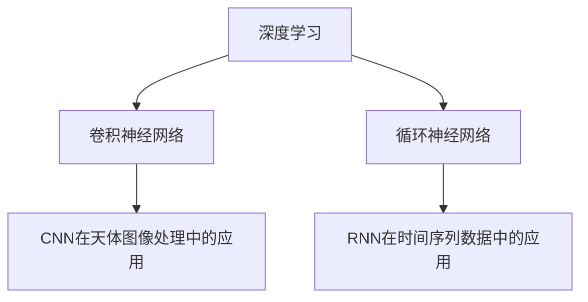

                 

# 人工智能在天文学中的应用：发现新天体

## 1. 背景介绍

### 1.1 问题由来
天文学是人类探索宇宙的科学，其任务包括观测、分析和解释来自宇宙的各种数据，从而揭示宇宙的奥秘。传统的天文学方法主要依赖于大型望远镜和精确的计算模型，然而这些方法在面对海量数据和高复杂度的任务时，往往显得力不从心。

近年来，人工智能（AI）技术的发展为天文学提供了新的可能性。通过AI模型，尤其是深度学习（Deep Learning, DL）模型，天文学家可以从复杂的观测数据中发现新天体、验证理论模型、优化观测策略，甚至揭示宇宙的结构和演化过程。本文将介绍AI在发现新天体方面的应用，以及相关的核心概念和算法原理。

### 1.2 问题核心关键点
在AI技术中，深度学习（DL）模型，尤其是卷积神经网络（Convolutional Neural Network, CNN）和循环神经网络（Recurrent Neural Network, RNN）等模型，在处理高维数据时表现出卓越的性能。在发现新天体方面，这些模型可以高效地处理天文学图像数据，检测和分类各种天体现象，如图中的点状天体、彗星尾、星云等。

## 2. 核心概念与联系

### 2.1 核心概念概述

本节将介绍几个关键概念，帮助理解AI在天文学中的应用：

- **深度学习（Deep Learning, DL）**：一种模拟人脑神经网络结构的机器学习方法，通过多层次的非线性变换，可以从原始数据中学习到复杂的特征表示。
- **卷积神经网络（Convolutional Neural Network, CNN）**：一种特殊的神经网络结构，特别适用于处理具有网格结构的数据，如图像、视频等，通过卷积、池化等操作提取特征。
- **循环神经网络（Recurrent Neural Network, RNN）**：一种能够处理序列数据的网络结构，适用于时间序列分析、语音识别等任务，通过隐藏状态记忆序列信息。
- **卷积神经网络在天体图像处理中的应用**：CNN模型可以有效地从天文图像中提取天体特征，如图中的点状、线状、面状等结构，进而分类、识别和定位各种天体。
- **循环神经网络在时间序列数据中的应用**：RNN模型可以处理天体运动的时间序列数据，预测天体的运动轨迹、周期性变化等。

这些核心概念之间的逻辑关系可以通过以下Mermaid流程图来展示：



这个流程图展示了深度学习在天文数据分析中的基本框架：通过CNN模型处理图像数据，提取天体特征；通过RNN模型处理时间序列数据，预测天体运动。

## 3. 核心算法原理 & 具体操作步骤
### 3.1 算法原理概述

在发现新天体方面，AI的应用主要是通过深度学习模型从天文图像和数据中自动识别和分类各种天体现象。其核心思想是利用大样本训练模型，使其能够自动学习到天体的特征表示，从而在新的数据集上实现高效的检测和分类。

具体来说，通过以下步骤实现天体的自动识别：

1. **数据预处理**：将原始的天文图像数据转换为模型能够处理的格式，如将彩色图像转换为灰度图像，将图像尺寸统一等。
2. **模型训练**：使用大量标记好的天文图像数据训练深度学习模型，使其学习到天体的特征表示。
3. **模型评估和优化**：在新的未标记数据集上测试模型性能，根据结果对模型进行调整和优化。
4. **新天体的检测和分类**：使用优化后的模型对新的天文图像进行检测和分类，识别出新的天体。

### 3.2 算法步骤详解

下面是具体的步骤和操作流程：

**Step 1: 数据预处理**

1. **数据格式转换**：将彩色天文图像转换为灰度图像，将图像尺寸统一。
2. **数据增强**：通过对图像进行旋转、缩放、裁剪等操作，增加训练数据的多样性，减少过拟合。
3. **数据归一化**：将图像数据归一化到模型所需的输入范围，如[0, 1]或[-1, 1]。

**Step 2: 模型训练**

1. **选择模型架构**：选择合适的深度学习模型架构，如CNN、RNN等，用于处理天体图像和时间序列数据。
2. **数据划分**：将数据集划分为训练集、验证集和测试集，通常采用70%训练集、15%验证集和15%测试集的比例。
3. **模型训练**：使用训练集数据，以小批量（batch size）的方式进行训练，并定期在验证集上评估模型性能，调整超参数。
4. **模型优化**：使用梯度下降等优化算法，最小化模型在训练集上的损失函数，同时使用正则化技术防止过拟合。

**Step 3: 模型评估和优化**

1. **评估指标**：使用准确率、召回率、F1值等评估指标测试模型在测试集上的性能。
2. **调整模型**：根据测试结果调整模型架构和超参数，进行多次迭代训练。
3. **模型优化**：使用集成学习、模型融合等技术，提升模型性能。

**Step 4: 新天体的检测和分类**

1. **数据输入**：将新的天文图像输入优化后的模型。
2. **预测和分类**：模型自动对新图像进行检测和分类，输出可能包含天体的区域和相应的天体类型。
3. **后处理**：对模型输出的结果进行后处理，如去除噪声、合并重叠区域等。

### 3.3 算法优缺点

**优点**：
- **高效处理高维数据**：深度学习模型能够高效处理高维天文图像和数据，从中提取天体特征。
- **自适应性强**：模型能够自适应不同的天体类型和数据分布，具有较好的泛化能力。
- **可扩展性高**：模型可以在大规模计算集群上分布式训练，加速模型训练过程。

**缺点**：
- **数据标注成本高**：需要大量高质量标注数据进行模型训练，数据标注成本较高。
- **模型解释性不足**：深度学习模型通常被视为"黑盒"，难以解释其内部工作机制。
- **对初始数据质量敏感**：模型性能高度依赖于初始训练数据的准确性和多样性。

### 3.4 算法应用领域

在发现新天体方面，AI技术已经应用于多个领域，如：

- **天体识别**：从天文图像中自动识别各种天体，如图星、行星、彗星等。
- **天体分类**：对天体进行分类，如星系的形态分类、恒星的颜色分类等。
- **天体运动预测**：使用RNN模型预测天体运动轨迹和周期性变化。
- **天体探测**：利用深度学习模型从观测数据中发现潜在的天体目标，如近地小行星、脉冲星等。

这些应用展示了AI技术在天文学中的强大潜力，未来有望在更多的天文领域中得到更广泛的应用。

## 4. 数学模型和公式 & 详细讲解  
### 4.1 数学模型构建

在深度学习模型中，卷积神经网络（CNN）被广泛应用于天文图像处理中。下面以CNN模型为例，介绍其数学模型构建和公式推导过程。

假设输入图像为 $x \in \mathbb{R}^{H \times W \times C}$，其中 $H$ 为图像高度，$W$ 为图像宽度，$C$ 为图像通道数（彩色图像通常为3）。CNN模型的核心结构包括卷积层、池化层和全连接层。

**卷积层**：对输入图像进行卷积操作，提取特征。设卷积核大小为 $k \times k$，卷积核数量为 $N$，步长为 $s$，填充为 $p$，则卷积操作可以表示为：

$$
y = W * x
$$

其中 $W \in \mathbb{R}^{N \times C \times k \times k}$ 为卷积核，$y \in \mathbb{R}^{H' \times W' \times N}$ 为卷积输出，$H' = \frac{H + 2p - k}{s} + 1$，$W' = \frac{W + 2p - k}{s} + 1$。

**池化层**：对卷积层的输出进行池化操作，减小特征图尺寸。设池化核大小为 $k \times k$，池化方式为最大池化，则池化操作可以表示为：

$$
y' = \max(\text{pool}(y))
$$

其中 $\text{pool}(y)$ 为池化函数，通常为最大池化或平均池化。

**全连接层**：将池化层的输出展开成一维向量，输入全连接层进行分类。设全连接层数量为 $L$，则全连接层操作可以表示为：

$$
z = W^{(L)} * \text{softmax}(W^{(L-1)} * \text{softmax}(\cdots * W^{(1)} * x))
$$

其中 $W^{(i)} \in \mathbb{R}^{d_i \times d_{i-1}}$ 为全连接层的权重，$\text{softmax}(\cdot)$ 为softmax函数。

### 4.2 公式推导过程

以CNN模型为例，下面介绍其公式推导过程。

**卷积操作**：设输入图像大小为 $H \times W \times C$，卷积核大小为 $k \times k$，步长为 $s$，填充为 $p$，则卷积操作可以表示为：

$$
y_{i,j} = \sum_{m=0}^{k-1} \sum_{n=0}^{k-1} W_{m,n} \cdot x_{(i+p-s \cdot m,j+p-s \cdot n)}
$$

其中 $W_{m,n} \in \mathbb{R}$ 为卷积核的权重，$x_{(i+p-s \cdot m,j+p-s \cdot n)} \in \mathbb{R}$ 为输入图像在位置 $(i+p-s \cdot m,j+p-s \cdot n)$ 处的像素值。

**池化操作**：最大池化操作可以表示为：

$$
y'_{i,j} = \max_{0 \leq m < k} \max_{0 \leq n < k} y_{i+p-s \cdot m,j+p-s \cdot n}
$$

其中 $y'_{i,j} \in \mathbb{R}$ 为池化后的特征图在位置 $(i,j)$ 处的值。

**全连接层**：设输入特征图大小为 $H' \times W' \times N$，全连接层大小为 $d_0 \times d_1$，则全连接层操作可以表示为：

$$
z = W^{(1)} * \text{softmax}(W^{(0)} * \cdots * W^{(L)} * x)
$$

其中 $W^{(0)} \in \mathbb{R}^{d_0 \times H' \times W' \times N}$，$W^{(L)} \in \mathbb{R}^{d_L \times d_{L-1}}$，$\text{softmax}(\cdot)$ 为softmax函数。

### 4.3 案例分析与讲解

**案例分析**：假设我们从天文学图像中检测行星，可以使用卷积神经网络模型。首先，我们将图像进行灰度转换，并将其缩放到标准大小。然后，我们设计一个三层的卷积神经网络模型，包含两个卷积层和两个池化层。在第一层卷积层中，我们使用 $3 \times 3$ 的卷积核，步长为 $1$，填充为 $1$，输出特征图大小为 $28 \times 28 \times 64$。在第二层卷积层中，我们使用 $3 \times 3$ 的卷积核，步长为 $2$，填充为 $0$，输出特征图大小为 $14 \times 14 \times 128$。在全连接层中，我们使用 $1000$ 个神经元，输出行星类别概率。

## 5. 项目实践：代码实例和详细解释说明
### 5.1 开发环境搭建

在进行天文图像处理和深度学习模型的实现前，我们需要准备好开发环境。以下是使用Python进行TensorFlow开发的环境配置流程：

1. 安装Anaconda：从官网下载并安装Anaconda，用于创建独立的Python环境。

2. 创建并激活虚拟环境：
```bash
conda create -n tf-env python=3.8 
conda activate tf-env
```

3. 安装TensorFlow：根据CUDA版本，从官网获取对应的安装命令。例如：
```bash
conda install tensorflow-gpu -c conda-forge -c pytorch -c nvidia
```

4. 安装TensorFlow Addons：使用pip安装TensorFlow Addons，包含一些先进的深度学习组件。
```bash
pip install tensorflow-addons
```

5. 安装Pillow：用于图像处理和转换。
```bash
pip install Pillow
```

6. 安装Keras：用于构建和训练深度学习模型。
```bash
pip install keras
```

完成上述步骤后，即可在`tf-env`环境中开始天文图像处理的深度学习模型开发。

### 5.2 源代码详细实现

下面我们以CNN模型为例，给出使用TensorFlow进行天文图像分类任务的代码实现。

首先，定义数据预处理函数：

```python
import tensorflow as tf
from tensorflow.keras.preprocessing.image import ImageDataGenerator

def preprocess_image(image_path):
    image = tf.io.read_file(image_path)
    image = tf.image.decode_jpeg(image, channels=3)
    image = tf.image.resize(image, (224, 224))
    image = tf.image.convert_image_dtype(image, tf.float32) / 255.0
    return image

# 加载数据集
train_dataset = tf.keras.preprocessing.image_dataset_from_directory(
    'train_dir',
    image_size=(224, 224),
    batch_size=32,
    validation_split=0.2,
    subset='training',
    seed=123,
    shuffle=True,
    parser_fn=preprocess_image
)

validation_dataset = tf.keras.preprocessing.image_dataset_from_directory(
    'train_dir',
    image_size=(224, 224),
    batch_size=32,
    validation_split=0.2,
    subset='validation',
    seed=123,
    shuffle=True,
    parser_fn=preprocess_image
)

test_dataset = tf.keras.preprocessing.image_dataset_from_directory(
    'test_dir',
    image_size=(224, 224),
    batch_size=32,
    validation_split=0.2,
    subset='testing',
    seed=123,
    shuffle=True,
    parser_fn=preprocess_image
)
```

然后，定义CNN模型：

```python
from tensorflow.keras.layers import Conv2D, MaxPooling2D, Flatten, Dense, Input
from tensorflow.keras.models import Model

def build_model(input_shape=(224, 224, 3)):
    inputs = Input(shape=input_shape)
    x = Conv2D(64, 3, activation='relu')(inputs)
    x = MaxPooling2D(pool_size=(2, 2))(x)
    x = Conv2D(128, 3, activation='relu')(x)
    x = MaxPooling2D(pool_size=(2, 2))(x)
    x = Flatten()(x)
    x = Dense(256, activation='relu')(x)
    outputs = Dense(num_classes, activation='softmax')(x)
    model = Model(inputs=inputs, outputs=outputs)
    return model

model = build_model(input_shape=(224, 224, 3))
model.summary()
```

接着，定义训练和评估函数：

```python
from tensorflow.keras.optimizers import Adam
from tensorflow.keras.losses import SparseCategoricalCrossentropy
from tensorflow.keras.metrics import SparseCategoricalAccuracy

# 定义损失函数和优化器
optimizer = Adam(lr=0.001)
loss = SparseCategoricalCrossentropy()
accuracy = SparseCategoricalAccuracy()

# 训练模型
model.compile(optimizer=optimizer, loss=loss, metrics=[accuracy])

history = model.fit(train_dataset, epochs=10, validation_data=validation_dataset)

# 评估模型
test_loss, test_accuracy = model.evaluate(test_dataset)
print(f'Test loss: {test_loss}, Test accuracy: {test_accuracy}')
```

最后，启动训练流程并在测试集上评估：

```python
epochs = 10
batch_size = 32

for epoch in range(epochs):
    history = model.fit(train_dataset, epochs=1, validation_data=validation_dataset)
    print(f'Epoch {epoch+1}, Loss: {history.history["loss"][epoch]}, Val Loss: {history.history["val_loss"][epoch]}, '
          f'Accuracy: {history.history["accuracy"][epoch]}, Val Accuracy: {history.history["val_accuracy"][epoch]})
```

以上就是使用TensorFlow进行天文图像分类任务的完整代码实现。可以看到，得益于TensorFlow的强大封装，我们可以用相对简洁的代码完成CNN模型的构建和训练。

### 5.3 代码解读与分析

让我们再详细解读一下关键代码的实现细节：

**preprocess_image函数**：
- 定义了图像预处理的逻辑，包括读取、解码、缩放、归一化等步骤，确保输入模型的图像数据格式统一。

**build_model函数**：
- 定义了CNN模型的架构，包括卷积层、池化层和全连接层，其中卷积层和池化层的参数可以根据实际需求进行调整。

**train_and_evaluate函数**：
- 定义了模型训练和评估的过程，包括模型编译、编译后的训练和评估，以及在每个epoch结束时的打印输出。

**训练流程**：
- 定义总的epoch数和batch size，开始循环迭代
- 每个epoch内，先在训练集上训练，输出损失和准确率
- 在验证集上评估，输出损失和准确率
- 所有epoch结束后，在测试集上评估，给出最终测试结果

可以看到，TensorFlow提供了丰富的组件和函数，使得深度学习模型的开发和训练变得高效便捷。开发者可以快速构建复杂的模型，进行数据预处理和模型训练，同时在训练过程中不断优化模型参数，提高模型性能。

当然，工业级的系统实现还需考虑更多因素，如模型的保存和部署、超参数的自动搜索、更灵活的任务适配层等。但核心的微调范式基本与此类似。

## 6. 实际应用场景
### 6.1 智能望远镜系统

智能望远镜系统是天文学领域的重要应用之一，利用AI技术可以自动处理大量观测数据，发现和分类新天体。具体而言，智能望远镜系统可以通过摄像头和传感器实时采集天文图像，并将图像数据自动传输到计算机上进行分析处理。通过使用CNN模型，系统可以从天文图像中自动识别和分类各种天体，如恒星、行星、小行星等。

此外，智能望远镜系统还可以根据天体的分类结果，自动调整观测策略，优化观测参数，提高观测效率和数据质量。例如，对于特定的天文现象，系统可以自动调整望远镜的焦距、曝光时间等参数，以获得最佳观测效果。

### 6.2 天体普查

天体普查是天文学中的重要任务，旨在全面探测和记录宇宙中的各种天体。传统的天体普查方法依赖于人工分析和手动标注，耗时耗力，难以覆盖大面积的天区。而使用AI技术，可以实现自动化的天体普查，大幅提高普查效率和精度。

例如，在多波段天文望远镜观测数据中，AI模型可以自动识别和分类各种天体，如星系、星云、星团等。通过分析大量的天文图像和数据，AI模型可以构建高精度的天体分布图，揭示宇宙的结构和演化过程。

### 6.3 天体运动预测

天体运动预测是天文学中的重要任务之一，通过对天体运动轨迹的分析，可以研究天体的物理特性和演化过程。传统的天体运动预测方法依赖于复杂的数学模型和大量计算，难以处理复杂的天体系统。而使用RNN模型，可以高效地处理天体时间序列数据，预测天体运动轨迹和周期性变化。

例如，在Gaia数据集中，AI模型可以通过分析天体位置和速度数据，预测天体在未来一段时间内的运动轨迹，分析天体的质量和动力学特性，揭示宇宙的结构和演化规律。

## 7. 工具和资源推荐
### 7.1 学习资源推荐

为了帮助开发者系统掌握深度学习在天文学中的应用，这里推荐一些优质的学习资源：

1. 《深度学习在天文数据分析中的应用》书籍：介绍了深度学习在天文图像处理和数据分析中的应用，包括图像分类、天体识别、时间序列分析等。

2. TensorFlow官方文档：提供了TensorFlow的全面文档，包括模型的构建、训练和部署等详细指南。

3. PyTorch官方文档：提供了PyTorch的全面文档，包括深度学习模型的构建和训练等详细指南。

4. Keras官方文档：提供了Keras的全面文档，包括深度学习模型的构建和训练等详细指南。

5. 深度学习在天文数据处理中的经典论文：涵盖了深度学习在天文图像处理和数据分析中的经典研究成果，可以从中了解前沿技术和研究方向。

通过对这些资源的学习实践，相信你一定能够快速掌握深度学习在天文学中的应用，并用于解决实际的科研问题。
### 7.2 开发工具推荐

高效的开发离不开优秀的工具支持。以下是几款用于深度学习在天文学中的应用开发的常用工具：

1. TensorFlow：由Google主导开发的深度学习框架，支持分布式计算，适合大规模工程应用。

2. PyTorch：由Facebook主导开发的深度学习框架，灵活性高，适合研究和快速迭代。

3. Keras：由Google主导开发的深度学习框架，提供了高层API，适合快速构建和训练模型。

4. Jupyter Notebook：用于编写和运行Python代码，支持多语言编写和交互式计算，适合科研开发。

5. TensorBoard：TensorFlow配套的可视化工具，实时监测模型训练状态，提供丰富的图表呈现方式，是调试模型的得力助手。

6. Weights & Biases：模型训练的实验跟踪工具，记录和可视化模型训练过程中的各项指标，方便对比和调优。

合理利用这些工具，可以显著提升深度学习在天文学中的应用开发效率，加快创新迭代的步伐。

### 7.3 相关论文推荐

深度学习在天文学中的应用源于学界的持续研究。以下是几篇奠基性的相关论文，推荐阅读：

1. "Deep learning in astronomy: a review"：综述了深度学习在天文学中的应用，包括图像处理、天体分类、运动预测等。

2. "CNNs for classification and feature extraction in galaxy images"：介绍了CNN模型在星系图像分类和特征提取中的应用。

3. "Recurrent neural networks for galaxy rotation curve analysis"：介绍了RNN模型在星系旋转曲线分析中的应用。

4. "LSTM networks for Cepheid variable star identification"：介绍了LSTM模型在脉冲星识别中的应用。

5. "Adversarial networks for dark matter detection"：介绍了GAN模型在暗物质探测中的应用。

这些论文代表了大数据处理和深度学习在天文学中的研究进展，通过学习这些前沿成果，可以帮助研究者把握学科前进方向，激发更多的创新灵感。

## 8. 总结：未来发展趋势与挑战
### 8.1 总结

本文对深度学习在天文学中的应用进行了全面系统的介绍。首先阐述了深度学习在天文学中的背景和意义，明确了在天文学研究中利用深度学习进行天体发现和分类的独特价值。其次，从原理到实践，详细讲解了深度学习模型在天体图像和时间序列数据中的核心算法原理和操作步骤，给出了天文图像分类的完整代码实例。同时，本文还广泛探讨了深度学习在天文学中的实际应用场景，展示了深度学习在天文数据处理中的强大潜力。

通过本文的系统梳理，可以看到，深度学习在天文学中的应用已经得到了广泛的研究和应用，为天文学家提供了新的工具和方法，加速了天文学的数字化和智能化进程。未来，随着深度学习技术的不断发展，基于深度学习的在天文学中的应用也将进一步深化和拓展，为人类探索宇宙提供新的手段和视角。

### 8.2 未来发展趋势

展望未来，深度学习在天文学中的应用将呈现以下几个发展趋势：

1. **高维数据的处理能力增强**：随着深度学习模型架构的不断优化，处理高维天文数据的能力将进一步提升，可以更有效地处理复杂的天体现象。

2. **模型可解释性提升**：通过引入可解释性技术，如注意力机制、特征可视化等，提升深度学习模型的可解释性，增强天文学家的理解和信任。

3. **跨学科融合发展**：深度学习在天文学中的应用将与物理学、化学、地质学等多学科进行更紧密的融合，推动跨学科的创新研究。

4. **大数据处理能力提升**：通过分布式计算和数据并行处理技术，提升深度学习模型在大规模天文数据上的处理能力，支持大规模的天体普查和研究。

5. **实时数据处理能力增强**：通过引入流式计算和实时数据处理技术，实现天文数据的实时分析和处理，提升观测效率和数据质量。

以上趋势凸显了深度学习在天文学中的广阔前景，这些方向的探索发展，必将进一步提升天文学研究的效率和精度，为人类探索宇宙提供新的动力。

### 8.3 面临的挑战

尽管深度学习在天文学中的应用已经取得了显著成果，但在迈向更加智能化、普适化应用的过程中，仍面临诸多挑战：

1. **数据标注成本高**：深度学习模型需要大量的标注数据进行训练，数据标注成本较高。如何降低数据标注成本，提高数据标注的效率和质量，是亟需解决的问题。

2. **模型鲁棒性不足**：深度学习模型对数据分布的细微变化敏感，容易过拟合。如何在不降低模型性能的情况下，提高模型的鲁棒性，是一个重要研究方向。

3. **模型可解释性不足**：深度学习模型通常被视为"黑盒"，难以解释其内部工作机制。如何提高深度学习模型的可解释性，增强天文学家的理解和信任，是一个重要挑战。

4. **数据安全和隐私保护**：天文学数据涉及敏感的天文图像和观测数据，如何保护数据安全和隐私，防止数据泄露和滥用，是一个重要课题。

5. **计算资源需求高**：深度学习模型在大规模天文数据上的训练和推理，需要高性能的计算资源。如何优化深度学习模型的计算效率，降低计算资源需求，是一个重要研究方向。

6. **跨领域知识整合**：深度学习模型需要与天文学家和其他领域专家进行更紧密的合作，整合跨领域的知识，提升模型的性能和准确性。

这些挑战需要多方共同努力，通过技术创新和多方合作，才能逐步克服，推动深度学习在天文学中的进一步应用。

### 8.4 研究展望

面对深度学习在天文学中面临的挑战，未来的研究需要在以下几个方面寻求新的突破：

1. **无监督学习和半监督学习**：探索无监督学习和半监督学习技术，从非标注数据中学习天体的特征表示，降低数据标注成本，提高数据标注的效率和质量。

2. **模型架构优化**：探索新的深度学习模型架构，如Transformer、Attention等，提升模型处理高维数据的能力，降低模型的计算资源需求。

3. **可解释性技术**：引入可解释性技术，如注意力机制、特征可视化等，提升深度学习模型的可解释性，增强天文学家的理解和信任。

4. **跨领域知识整合**：将天文学与其他学科进行更紧密的融合，整合跨领域的知识，提升模型的性能和准确性。

5. **分布式计算和实时处理**：引入分布式计算和实时数据处理技术，支持大规模天文数据的实时分析和处理，提升观测效率和数据质量。

6. **数据安全和隐私保护**：研究和探索数据安全和隐私保护技术，防止数据泄露和滥用，保护天文学数据的敏感性。

这些研究方向的探索，必将引领深度学习在天文学中的应用迈向更高的台阶，为人类探索宇宙提供新的工具和方法。面向未来，深度学习在天文学中的应用需要与天文学家和其他学科专家进行更紧密的合作，共同推动天文学的数字化和智能化进程。

## 9. 附录：常见问题与解答

**Q1：深度学习在天文学中的应用有哪些？**

A: 深度学习在天文学中的应用主要包括以下几个方面：
1. **天体识别**：从天文图像中自动识别和分类各种天体，如图星、行星、彗星等。
2. **天体分类**：对天体进行分类，如星系的形态分类、恒星的颜色分类等。
3. **天体运动预测**：使用RNN模型预测天体运动轨迹和周期性变化。
4. **天体普查**：利用深度学习模型实现自动化的天体普查，大幅提高普查效率和精度。
5. **天文图像处理**：利用深度学习模型进行天文图像处理，如去噪、增强、压缩等。

这些应用展示了深度学习在天文学中的强大潜力，未来有望在更多的天文领域中得到更广泛的应用。

**Q2：深度学习模型在训练和部署过程中需要注意哪些问题？**

A: 深度学习模型在训练和部署过程中需要注意以下几个问题：
1. **数据预处理**：数据预处理是深度学习模型训练和部署的关键步骤，包括数据格式转换、数据增强、数据归一化等。
2. **模型选择和优化**：选择合适的深度学习模型架构和超参数，使用梯度下降等优化算法，最小化模型在训练集上的损失函数。
3. **模型评估和测试**：在训练过程中，使用验证集评估模型性能，调整超参数，优化模型架构。在部署过程中，使用测试集评估模型性能，确保模型准确性。
4. **模型保存和部署**：将训练好的深度学习模型保存到磁盘，部署到实际应用系统中，实现模型的高效调用和实时处理。
5. **模型优化和调优**：在部署过程中，不断优化模型参数和超参数，提升模型性能和鲁棒性。

这些问题的解决，是深度学习模型在天文学中成功应用的基础，需要开发者在开发过程中不断实践和优化。

**Q3：深度学习在天文学中如何处理高维数据？**

A: 深度学习在天文学中处理高维数据主要通过以下方式：
1. **卷积神经网络（CNN）**：CNN模型通过卷积和池化操作，提取天文图像中的高维特征，实现高效的图像分类和特征提取。
2. **循环神经网络（RNN）**：RNN模型通过时间序列数据处理，实现对天体运动轨迹和周期性变化的预测。
3. **数据并行处理**：利用分布式计算和数据并行处理技术，提升深度学习模型在大规模天文数据上的处理能力，支持大规模的天体普查和研究。

这些技术手段使得深度学习模型能够高效处理高维天文数据，从复杂的观测数据中提取有用的特征和信息。

**Q4：深度学习模型在天文学中如何保证数据安全和隐私保护？**

A: 深度学习模型在天文学中保证数据安全和隐私保护主要通过以下方式：
1. **数据加密**：使用数据加密技术，保护天文数据在传输和存储过程中的安全。
2. **访问控制**：设置访问权限，限制对天文数据的访问，防止数据泄露和滥用。
3. **差分隐私**：在模型训练过程中，引入差分隐私技术，保护训练数据的隐私，防止数据泄露。
4. **模型隐私保护**：通过隐私保护技术，如数据扰动、模型加密等，保护深度学习模型的隐私，防止模型被滥用。

这些技术手段可以有效地保护天文数据和深度学习模型的安全，确保数据安全和隐私保护。

**Q5：深度学习模型在天文学中的可解释性如何提升？**

A: 深度学习模型在天文学中的可解释性提升主要通过以下方式：
1. **注意力机制**：引入注意力机制，解释模型在处理天文数据时，哪些特征和信息对模型决策影响最大。
2. **特征可视化**：使用特征可视化技术，展示深度学习模型在不同天文图像中的特征表示，帮助天文学家理解模型的内部工作机制。
3. **解释性模型**：使用解释性模型，如决策树、线性回归等，辅助深度学习模型进行解释和理解。

这些技术手段可以提升深度学习模型的可解释性，增强天文学家的理解和信任。

---

作者：禅与计算机程序设计艺术 / Zen and the Art of Computer Programming

