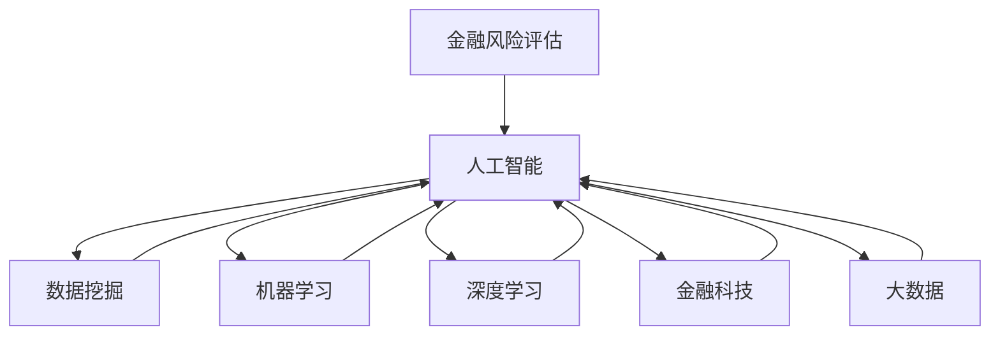

                 

# 人工智能在金融风险评估中的应用：精准预测与防控

> 关键词：人工智能,金融风险评估,精准预测,防控,数据挖掘,机器学习,深度学习,金融科技,大数据,风险管理

## 1. 背景介绍

### 1.1 问题由来
金融领域历来是人工智能(AI)技术应用的重要阵地之一。随着金融产品的日益复杂化和金融市场的国际化，金融风险评估变得更加复杂和关键。传统的基于规则的模型已难以满足当下高精度、高实时性的需求。为此，越来越多的金融机构开始利用人工智能技术，特别是机器学习和深度学习模型，进行金融风险的预测与防控。

### 1.2 问题核心关键点
金融风险评估中的AI应用主要涉及以下几个核心问题：
- **风险识别**：准确识别潜在的金融风险来源和类型。
- **风险量化**：评估风险的大小和影响程度。
- **风险预警**：实现风险的实时监测和早期预警。
- **风险防控**：通过模型预测结果，采取相应的风险应对措施。

这些核心问题涉及多维数据（如市场数据、财务数据、行为数据等）的获取、处理和分析，以及模型设计和训练的优化。AI技术，特别是深度学习模型，通过强大的数据处理和模式识别能力，显著提升了金融风险评估的准确性和效率。

## 2. 核心概念与联系

### 2.1 核心概念概述

为更好地理解AI在金融风险评估中的应用，本节将介绍几个关键概念：

- **金融风险评估**：指对金融活动或产品可能面临的风险进行识别、量化、评估和管理的整个过程。
- **人工智能**：通过模拟人的智能行为，使用机器学习、深度学习等技术实现自动化的数据处理和决策支持。
- **数据挖掘**：从大量数据中挖掘出有价值的信息和知识的过程。
- **机器学习**：让计算机通过数据学习规律和模式，自主进行预测和决策。
- **深度学习**：一种更强大的机器学习技术，通过多层神经网络结构进行特征提取和模式识别。
- **金融科技(Fintech)**：利用AI和IT技术，提升金融服务的效率和安全性。
- **大数据**：大量、多样、高速、价值密度低的数据集，为AI模型提供丰富的训练样本。
- **风险管理**：通过对风险的识别、评估、预警和防控，确保金融活动的稳健运行。

这些概念之间的逻辑关系可以通过以下Mermaid流程图来展示：



这个流程图展示了大规模AI技术在金融风险评估中的作用。通过数据挖掘获取金融数据，利用机器学习和深度学习模型进行风险识别和量化，结合金融科技和大数据技术，实现风险的实时预警和防控。

## 3. 核心算法原理 & 具体操作步骤
### 3.1 算法原理概述

AI在金融风险评估中的应用，主要基于机器学习和深度学习模型的构建与训练。其核心思想是利用历史数据和专家知识，训练出一个能够对金融风险进行准确预测和防控的模型。

形式化地，假设风险评估问题为二分类问题，即判断某一金融活动或产品是否存在风险。给定历史金融数据集 $D=\{(x_i, y_i)\}_{i=1}^N$，其中 $x_i$ 为输入特征，$y_i$ 为风险标签（0或1），模型的目标是最小化损失函数：

$$
\theta^* = \mathop{\arg\min}_{\theta} \mathcal{L}(M_{\theta},D)
$$

其中 $M_{\theta}$ 为模型参数，$\mathcal{L}$ 为损失函数，如交叉熵损失、均方误差损失等。

### 3.2 算法步骤详解

基于机器学习和深度学习的金融风险评估，一般包括以下几个关键步骤：

**Step 1: 数据预处理与特征工程**
- 收集金融领域相关数据，如市场数据、财务数据、行为数据等。
- 进行数据清洗、缺失值填补、归一化等预处理。
- 设计特征工程，将原始数据转化为模型可接受的特征向量。

**Step 2: 选择模型与训练**
- 根据问题类型，选择合适的机器学习或深度学习模型。
- 在训练集上训练模型，调整超参数（如学习率、正则化系数等），以最小化损失函数。
- 在验证集上评估模型性能，防止过拟合。

**Step 3: 模型部署与风险预警**
- 将训练好的模型部署到实际金融系统中。
- 对实时数据进行输入，计算模型输出风险评分。
- 根据评分阈值，进行风险预警和防控措施的自动化决策。

**Step 4: 持续监控与模型优化**
- 实时监控模型性能，收集新数据不断更新模型。
- 定期对模型进行回测和评估，及时优化模型参数和特征。
- 根据最新的市场和金融环境，更新数据和模型。

### 3.3 算法优缺点

AI在金融风险评估中的应用具有以下优点：
1. 高精度预测：通过深度学习模型的非线性拟合能力，可以实现更精确的风险预测。
2. 实时性：利用大数据和云计算技术，可以实现实时风险监测和预警。
3. 自动化决策：模型能够自动处理大量数据，降低人工干预，提高决策效率。
4. 自适应性：模型可以根据新数据不断更新，适应金融市场的动态变化。

同时，这些技术也存在一些局限性：
1. 数据依赖：模型的预测效果高度依赖于数据的完整性和质量。
2. 模型复杂：深度学习模型往往复杂度较高，难以解释其决策过程。
3. 模型训练成本：大规模数据集和模型训练需要较高的计算资源。
4. 过拟合风险：在数据较少的情况下，模型可能过拟合历史数据，泛化性能不足。

尽管存在这些挑战，AI技术在金融风险评估中的应用仍然具有广阔的前景。未来的研究应致力于提高模型的可解释性、降低训练成本、增强模型的自适应能力等方向。

### 3.4 算法应用领域

AI在金融风险评估中的应用领域非常广泛，包括但不限于：

- **信用风险评估**：对贷款申请人的信用状况进行评估，识别潜在违约风险。
- **市场风险管理**：预测市场波动，识别可能的系统性风险。
- **操作风险识别**：监控交易操作，识别潜在的操作风险。
- **合规风险监控**：实时监控交易行为，防止违规操作。
- **保险风险评估**：评估保险产品风险，为保费定价提供依据。
- **投资风险预测**：预测投资组合的表现，进行风险分散。

## 4. 数学模型和公式 & 详细讲解 & 举例说明
### 4.1 数学模型构建

在金融风险评估中，常用的数学模型包括逻辑回归、支持向量机、随机森林、深度神经网络等。这里以深度神经网络为例，构建风险评估模型。

假设模型为多层感知器（MLP），输入层有 $d$ 个特征，输出层为二分类问题，模型的输出层为 sigmoid 激活函数：

$$
\hat{y} = \sigma(W^Tx + b)
$$

其中，$W$ 和 $b$ 为模型参数。

### 4.2 公式推导过程

以逻辑回归为例，其损失函数为交叉熵损失函数：

$$
\mathcal{L}(y,\hat{y}) = -\frac{1}{N}\sum_{i=1}^N [y_i\log \hat{y_i} + (1-y_i)\log(1-\hat{y_i})]
$$

通过反向传播算法，求解损失函数对模型参数的梯度：

$$
\frac{\partial \mathcal{L}(y,\hat{y})}{\partial W} = \frac{1}{N}\sum_{i=1}^N [\hat{y_i} - y_i]x_i
$$

$$
\frac{\partial \mathcal{L}(y,\hat{y})}{\partial b} = \frac{1}{N}\sum_{i=1}^N [\hat{y_i} - y_i]
$$

通过优化算法，如随机梯度下降，最小化损失函数，更新模型参数。

### 4.3 案例分析与讲解

假设有一个信用评估任务，样本数据包含用户的年龄、收入、还款记录等信息，标记了是否违约。我们使用逻辑回归模型进行训练和评估。

**Step 1: 数据预处理**
收集用户数据，包括年龄、收入、还款记录等特征，并进行数据清洗，缺失值填补，归一化处理。

**Step 2: 模型训练**
选择逻辑回归模型，使用交叉熵损失函数，在训练集上训练模型，调整学习率、正则化系数等超参数，得到模型参数 $W$ 和 $b$。

**Step 3: 模型评估**
在验证集上评估模型性能，使用准确率、召回率、F1值等指标，调整模型参数，防止过拟合。

**Step 4: 风险预警**
将训练好的模型部署到风险评估系统中，对新用户输入的数据进行计算，输出风险评分，根据评分结果进行风险预警和决策。

## 5. 项目实践：代码实例和详细解释说明
### 5.1 开发环境搭建

在进行金融风险评估项目开发前，需要搭建好开发环境。以下是使用Python进行PyTorch开发的详细步骤：

1. 安装Anaconda：从官网下载并安装Anaconda，用于创建独立的Python环境。
2. 创建并激活虚拟环境：
```bash
conda create -n pytorch-env python=3.8 
conda activate pytorch-env
```
3. 安装PyTorch：根据CUDA版本，从官网获取对应的安装命令。例如：
```bash
conda install pytorch torchvision torchaudio cudatoolkit=11.1 -c pytorch -c conda-forge
```
4. 安装TensorFlow：
```bash
pip install tensorflow
```
5. 安装TensorBoard：
```bash
pip install tensorboard
```
6. 安装scikit-learn和pandas等库：
```bash
pip install scikit-learn pandas numpy matplotlib
```
完成上述步骤后，即可在`pytorch-env`环境中开始项目开发。

### 5.2 源代码详细实现

以下是使用PyTorch实现信用风险评估任务的完整代码示例：

```python
import torch
import torch.nn as nn
import torch.optim as optim
import torch.utils.data as Data
import pandas as pd
from sklearn.model_selection import train_test_split

class CreditModel(nn.Module):
    def __init__(self, input_size, hidden_size, output_size):
        super(CreditModel, self).__init__()
        self.fc1 = nn.Linear(input_size, hidden_size)
        self.fc2 = nn.Linear(hidden_size, hidden_size)
        self.fc3 = nn.Linear(hidden_size, output_size)
        self.sigmoid = nn.Sigmoid()

    def forward(self, x):
        x = self.fc1(x)
        x = self.sigmoid(x)
        x = self.fc2(x)
        x = self.sigmoid(x)
        x = self.fc3(x)
        return self.sigmoid(x)

def train_cred_model(model, train_data, test_data, batch_size, epochs, lr):
    train_loader = Data.DataLoader(train_data, batch_size=batch_size, shuffle=True)
    test_loader = Data.DataLoader(test_data, batch_size=batch_size, shuffle=False)

    criterion = nn.BCELoss()
    optimizer = optim.SGD(model.parameters(), lr=lr)

    for epoch in range(epochs):
        for inputs, labels in train_loader:
            optimizer.zero_grad()
            outputs = model(inputs)
            loss = criterion(outputs, labels)
            loss.backward()
            optimizer.step()

        with torch.no_grad():
            test_outputs = model(test_loader.dataset[:len(test_loader)])
            test_loss = criterion(test_outputs, test_loader.dataset.targets)

        print(f'Epoch [{epoch+1}/{epochs}], Loss: {loss:.4f}, Test Loss: {test_loss:.4f}')

    return model

def test_cred_model(model, test_data, batch_size):
    test_loader = Data.DataLoader(test_data, batch_size=batch_size, shuffle=False)
    correct = 0
    total = 0
    with torch.no_grad():
        for inputs, labels in test_loader:
            outputs = model(inputs)
            _, predicted = torch.max(outputs, 1)
            total += labels.size(0)
            correct += (predicted == labels).sum().item()

    print(f'Accuracy: {correct/total*100:.2f}%')

# 加载数据
data = pd.read_csv('credit_data.csv')
features = data[['age', 'income', 'loan_amount', 'repayment_status']]
target = data['default']
train_data, test_data = train_test_split(features, target, test_size=0.2, random_state=42)

# 构建模型
input_size = features.shape[1]
hidden_size = 64
output_size = 1
model = CreditModel(input_size, hidden_size, output_size)

# 训练模型
train_cred_model(model, train_data, test_data, batch_size=64, epochs=10, lr=0.001)

# 测试模型
test_cred_model(model, test_data, batch_size=64)
```

以上代码实现了一个简单的信用风险评估模型，包括数据预处理、模型训练和测试。通过修改超参数和模型结构，可以实现更复杂的风险评估任务。

### 5.3 代码解读与分析

**CreditModel类**：
- 定义了三层神经网络模型，包括两个全连接层和一个输出层，使用sigmoid激活函数。
- 继承自`nn.Module`，使用`super()`初始化层参数。

**train_cred_model函数**：
- 将数据集拆分为训练集和测试集，构建数据加载器。
- 定义损失函数（二元交叉熵）和优化器（随机梯度下降）。
- 在每个epoch中，对训练集数据进行前向传播和反向传播，更新模型参数。
- 在每个epoch结束时，在测试集上计算模型性能，防止过拟合。

**test_cred_model函数**：
- 在测试集上计算模型输出，计算准确率。
- 使用`torch.no_grad()`避免计算梯度，提高计算速度。

通过以上代码实现，可以构建一个基础的信用风险评估模型，并进行训练和评估。代码中使用了PyTorch的强大API，使得模型构建和训练过程非常便捷。

## 6. 实际应用场景
### 6.1 金融市场风险管理

AI在金融市场风险管理中的应用，主要涉及市场波动预测和系统性风险识别。通过深度学习模型，如LSTM、GRU等，可以实现对市场数据的实时监控和预测，及时发现异常情况。

**应用场景**：
- 利用LSTM模型对历史市场数据进行拟合，预测未来的市场趋势。
- 使用卷积神经网络（CNN）对高频金融数据进行分析，识别潜在的系统性风险。
- 通过集成学习，将多个模型的预测结果进行融合，提高风险预测的准确性。

**示例**：某金融公司使用LSTM模型对股票市场的指数进行预测，预测结果用于自动化交易系统的决策。通过实时监控模型输出，及时发现市场异常，防止因系统性风险导致的重大损失。

### 6.2 保险产品风险评估

AI在保险产品风险评估中的应用，主要涉及保险产品定价和风险预警。通过深度学习模型，可以对保险数据进行实时分析和预测，为保险产品定价和风险防控提供依据。

**应用场景**：
- 利用深度神经网络对客户的历史保险数据进行拟合，预测客户在未来发生保险事件的概率。
- 通过生成对抗网络（GAN）对保险产品进行实时风险评估，生成更具吸引力的产品报价。
- 使用强化学习模型对保险理赔过程进行优化，提高理赔处理效率和客户满意度。

**示例**：某保险公司使用深度学习模型对客户的健康保险数据进行分析，预测客户在一定时期内发生疾病的概率，进而计算保险产品的定价。通过实时监控模型输出，及时发现异常情况，调整保险产品定价策略。

### 6.3 操作风险管理

AI在操作风险管理中的应用，主要涉及交易行为监控和异常检测。通过深度学习模型，可以实现对交易数据的实时分析和异常检测，及时发现操作风险。

**应用场景**：
- 利用卷积神经网络对交易数据进行图像处理，识别可疑交易行为。
- 使用深度学习模型对交易数据进行时间序列分析，预测交易异常事件。
- 通过生成对抗网络生成训练数据，提高异常检测模型的泛化能力。

**示例**：某银行使用卷积神经网络对客户交易数据进行图像处理，识别可疑的交易行为。通过实时监控模型输出，及时发现异常情况，采取相应的风险防控措施。

## 7. 工具和资源推荐
### 7.1 学习资源推荐

为帮助开发者系统掌握AI在金融风险评估中的应用，这里推荐一些优质的学习资源：

1. 《深度学习》书籍：Ian Goodfellow、Yoshua Bengio、Aaron Courville著，全面介绍了深度学习的基本概念和算法。
2. 《金融机器学习》课程：斯坦福大学开设的金融机器学习课程，包含丰富的金融数据和模型示例。
3. 《Python金融数据分析》书籍：Stefan Jansen著，介绍了Python在金融数据分析中的应用，包括数据预处理和模型训练。
4. Kaggle平台：包含大量金融数据集和竞赛项目，适合练习和验证模型效果。
5. Google Colab：谷歌提供的在线Jupyter Notebook环境，免费提供GPU资源，方便实验最新模型。

通过对这些资源的学习实践，相信你一定能够快速掌握AI在金融风险评估中的应用，并用于解决实际的金融问题。

### 7.2 开发工具推荐

高效的开发离不开优秀的工具支持。以下是几款用于AI在金融风险评估开发的常用工具：

1. PyTorch：基于Python的开源深度学习框架，灵活性高，支持动态计算图，适合快速迭代研究。
2. TensorFlow：由Google主导开发的开源深度学习框架，生产部署方便，支持分布式计算。
3. TensorBoard：TensorFlow配套的可视化工具，可实时监测模型训练状态，提供丰富的图表呈现方式。
4. Weights & Biases：模型训练的实验跟踪工具，可以记录和可视化模型训练过程中的各项指标，方便对比和调优。
5. Jupyter Notebook：Python代码的交互式开发环境，支持代码块输入和输出，便于调试和展示结果。
6. Scikit-learn：Python机器学习库，提供了丰富的机器学习算法和数据预处理工具。

合理利用这些工具，可以显著提升AI在金融风险评估任务的开发效率，加快创新迭代的步伐。

### 7.3 相关论文推荐

AI在金融风险评估领域的研究成果丰硕，以下是几篇奠基性的相关论文，推荐阅读：

1. <a href="https://arxiv.org/abs/1806.01261">LSTM-based Financial Time Series Prediction</a>：利用LSTM模型对金融时间序列进行预测。
2. <a href="https://arxiv.org/abs/1711.06195">Anomaly Detection in Financial Time Series</a>：使用深度学习模型对金融交易数据进行异常检测。
3. <a href="https://arxiv.org/abs/1707.02493">FinBERT: Modeling the Financial Semantic Space</a>：利用BERT模型对金融文本数据进行情感分析。
4. <a href="https://arxiv.org/abs/1904.13453">Deep Learning for Credit Risk Prediction</a>：利用深度学习模型对信用风险进行预测。
5. <a href="https://arxiv.org/abs/1806.00070">Deep Learning for Credit Scoring: A Survey</a>：对深度学习在信用评分中的研究和应用进行综述。

这些论文代表了大规模AI技术在金融风险评估的发展脉络。通过学习这些前沿成果，可以帮助研究者把握学科前进方向，激发更多的创新灵感。

## 8. 总结：未来发展趋势与挑战
### 8.1 研究成果总结

AI在金融风险评估领域的研究已取得诸多成果，主要集中在以下几个方面：
- **模型优化**：通过改进模型架构和训练策略，提高风险评估的准确性和实时性。
- **数据利用**：利用大数据和云计算技术，获取和处理海量金融数据，提升风险评估的覆盖范围和精度。
- **算法创新**：引入深度学习、强化学习、生成对抗网络等算法，提升风险评估模型的复杂度和泛化能力。

### 8.2 未来发展趋势

展望未来，AI在金融风险评估领域将呈现以下几个发展趋势：

1. **自适应学习**：通过在线学习和增量学习技术，模型能够不断适应金融市场的变化，提高风险评估的实时性和稳定性。
2. **多模态融合**：将金融数据与其他类型的数据（如社交媒体数据、新闻数据等）进行融合，提升风险评估的全面性和准确性。
3. **联邦学习**：通过分布式计算技术，使得模型能够在不共享数据的前提下，协同训练，提升模型的鲁棒性和安全性。
4. **解释性增强**：通过引入可解释性技术，提高模型的决策透明度和可解释性，降低操作风险。
5. **模型压缩**：通过模型压缩和优化技术，降低模型的计算复杂度和资源消耗，提高模型的应用效率。
6. **自动化决策**：利用自动化决策技术，将AI模型与业务流程无缝集成，提升决策效率和响应速度。

### 8.3 面临的挑战

尽管AI在金融风险评估领域已经取得了显著进展，但仍面临一些挑战：

1. **数据隐私和安全**：金融数据的敏感性和保密性要求高，如何在保护数据隐私的前提下，进行有效的风险评估。
2. **模型复杂度**：深度学习模型的复杂性和可解释性不足，难以满足监管要求和用户需求。
3. **计算资源**：大规模数据集和模型训练需要大量的计算资源，如何降低计算成本，提高资源利用效率。
4. **模型偏见**：模型可能学习到数据中的偏见和歧视，需要引入公平性算法，消除模型偏见。
5. **模型鲁棒性**：模型在面对新的数据和场景时，泛化性能可能不足，需要引入鲁棒性评估指标。

### 8.4 研究展望

未来，AI在金融风险评估领域的研究应集中在以下几个方向：

1. **数据隐私保护**：利用差分隐私等技术，保护金融数据的隐私，同时保证模型训练的准确性。
2. **模型可解释性**：引入可解释性技术，提高模型的透明度和可信度，增强用户的信任和接受度。
3. **模型鲁棒性**：通过引入鲁棒性评估指标和算法，提高模型的泛化能力和鲁棒性。
4. **自动化决策**：将AI模型与业务流程深度融合，实现自动化决策，提升金融服务的效率和安全性。
5. **联邦学习**：利用联邦学习技术，在保护数据隐私的前提下，协同训练高鲁棒性的AI模型。
6. **多模态融合**：利用多模态数据，提升风险评估的全面性和准确性，降低单一数据来源的局限性。

通过在这些方向上的研究，AI在金融风险评估领域将发挥更大的作用，为金融行业的稳健运行提供强有力的技术支撑。

## 9. 附录：常见问题与解答

**Q1: AI在金融风险评估中如何处理数据隐私问题？**

A: AI在金融风险评估中，数据隐私问题尤为重要。为保护数据隐私，可以采取以下措施：
- 数据匿名化：通过脱敏、去标识化等技术，保护数据隐私。
- 差分隐私：引入差分隐私技术，在保护隐私的前提下，进行有效的风险评估。
- 联邦学习：利用联邦学习技术，在不共享数据的前提下，协同训练模型。
- 安全多方计算：通过安全多方计算技术，在保护数据隐私的同时，进行有效的数据处理和分析。

**Q2: AI在金融风险评估中如何处理模型复杂度问题？**

A: 模型复杂度是AI在金融风险评估中的一大挑战。为降低模型复杂度，可以采取以下措施：
- 模型压缩：通过模型压缩技术，降低模型的计算复杂度和内存占用。
- 特征工程：通过有效的特征工程，去除冗余特征，提升模型的泛化能力。
- 正则化技术：引入正则化技术，防止模型过拟合，提高模型的泛化能力。
- 简化模型结构：通过简化模型结构，降低模型的复杂度，提高模型的训练效率。

**Q3: AI在金融风险评估中如何处理模型偏见问题？**

A: 模型偏见是AI在金融风险评估中的一大难题。为消除模型偏见，可以采取以下措施：
- 公平性算法：引入公平性算法，确保模型在各个子群中的表现一致。
- 数据多样性：增加数据多样性，防止模型对某一子群体的过拟合。
- 偏见检测：通过偏见检测技术，及时发现和修正模型中的偏见。
- 解释性增强：引入可解释性技术，提高模型的透明度和可信度，减少偏见的影响。

**Q4: AI在金融风险评估中如何处理计算资源问题？**

A: 计算资源是AI在金融风险评估中的一大瓶颈。为降低计算成本，可以采取以下措施：
- 分布式计算：利用分布式计算技术，提高模型的训练效率。
- 混合精度训练：利用混合精度训练技术，降低模型的计算复杂度和内存占用。
- 模型优化：通过模型优化技术，提高模型的训练效率和推理速度。
- 云计算平台：利用云计算平台，提供高效的计算资源，降低本地计算成本。

这些措施可以帮助解决AI在金融风险评估中的数据隐私、模型复杂度、模型偏见和计算资源等挑战，进一步推动AI技术在金融领域的广泛应用。

---

作者：禅与计算机程序设计艺术 / Zen and the Art of Computer Programming

