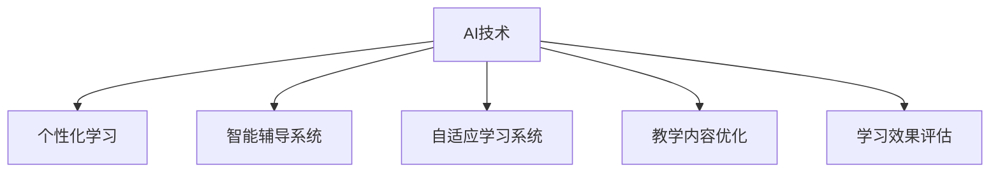

                 

# 人工智能：教育变革的催化剂

> 关键词：人工智能,教育技术,个性化学习,数据驱动,自适应学习系统,教学内容优化

## 1. 背景介绍

### 1.1 问题由来

21世纪以来，科技的飞速发展和全球化浪潮推动了教育的深刻变革。传统的教室授课模式，尤其是“一刀切”的教学方法，已难以适应个性化需求日益增长的新时代要求。如何提升教育质量，实现个性化教育，成为教育领域亟需解决的难题。

人工智能(AI)技术的飞速发展，特别是深度学习、自然语言处理、计算机视觉等技术的突破，为教育领域带来了全新的机遇和挑战。基于AI的教育技术，如智能推荐系统、智能辅导系统、自适应学习系统等，能够根据学生的个性化需求和行为数据，提供有针对性的教学内容，优化教学效果，引领教育模式的创新和变革。

### 1.2 问题核心关键点

AI技术在教育领域的应用，主要集中在以下几个方面：

- **个性化学习**：通过学习分析、推荐算法等技术，为每个学生提供量身定制的学习内容。
- **智能辅导**：利用自然语言处理技术，提供个性化的学习辅导，帮助学生掌握知识。
- **自适应学习系统**：基于学生的数据和行为，动态调整教学内容和策略，实现自适应的个性化学习。
- **教学内容优化**：通过AI技术分析和改进教学内容，提高教学质量和效果。
- **学习效果评估**：利用AI算法进行客观评估，提升教学质量监控的科学性和有效性。

AI技术的引入，使得教育更加贴合每个学生的实际需求，极大地提高了教学质量和学生的学习成效。这不仅为教育公平提供了新的解决路径，也为教育创新带来了无限可能。

## 2. 核心概念与联系

### 2.1 核心概念概述

为更好地理解基于AI的教育技术，本节将介绍几个关键概念：

- **人工智能(AI)**：利用计算机科学和数学技术，模拟人类智能行为，解决复杂问题的技术。AI涵盖了机器学习、深度学习、自然语言处理、计算机视觉等多个领域。
- **个性化学习**：根据每个学生的兴趣、能力和需求，提供定制化的学习内容和方法。
- **智能辅导系统**：利用AI技术，实现对学生的智能辅导，包括自动答疑、作业批改等功能。
- **自适应学习系统**：基于学生的学习数据和行为，动态调整教学策略，实现个性化学习。
- **教学内容优化**：通过AI技术对教学内容进行分析，改进教学方法，提升教学质量。
- **学习效果评估**：利用AI算法，科学评估学生的学习效果，帮助教师优化教学策略。

这些核心概念之间的联系可以通过以下Mermaid流程图来展示：



这个流程图展示了几大AI技术在教育领域的主要应用方向及其相互联系：

1. AI技术提供基础算法支持，应用于个性化学习、智能辅导、自适应学习等多个环节。
2. 个性化学习、智能辅导、自适应学习等技术手段，依托AI算法实现，提升教育效果。
3. 教学内容优化和学习效果评估，进一步利用AI技术进行数据驱动决策，完善教育质量监控。

## 3. 核心算法原理 & 具体操作步骤
### 3.1 算法原理概述

基于AI的教育技术，本质上是通过数据驱动的方法，实现对教学过程的优化和个性化调整。其核心思想是：通过收集和分析学生的学习数据，利用AI算法识别学生的学习模式和需求，从而动态调整教学策略和内容，实现自适应学习。

形式化地，假设学生在学习过程中的行为数据为 $D=\{(x_i,y_i)\}_{i=1}^N$，其中 $x_i$ 为学生行为，如课堂互动、作业完成情况等，$y_i$ 为学习效果，如考试成绩、掌握情况等。定义学习模型 $M_{\theta}$，其中 $\theta$ 为模型参数。教育技术的优化目标是最小化预测值与实际值之间的误差，即：

$$
\theta^* = \mathop{\arg\min}_{\theta} \sum_{i=1}^N (M_{\theta}(x_i) - y_i)^2
$$

通过梯度下降等优化算法，教育技术不断更新模型参数 $\theta$，最小化预测误差，使学生获得个性化、高效的学习体验。

### 3.2 算法步骤详解

基于AI的教育技术一般包括以下几个关键步骤：

**Step 1: 数据收集与预处理**
- 收集学生的学习数据，包括课堂互动、作业完成情况、成绩、考勤等。
- 对数据进行清洗和标准化处理，去除异常值和噪声。

**Step 2: 特征提取与建模**
- 通过特征提取算法，将学生的行为数据转换为机器学习算法可接受的特征表示。
- 选择合适的机器学习或深度学习模型，对特征进行建模，如线性回归、支持向量机、神经网络等。

**Step 3: 训练与评估**
- 将建模结果应用到学生数据集上，训练模型。
- 在验证集上评估模型性能，调整模型参数。

**Step 4: 动态调整与优化**
- 根据学生的实时学习数据，动态调整模型的参数，更新学习内容和策略。
- 不断迭代优化，提升个性化学习的效果。

**Step 5: 结果反馈与调整**
- 收集学生对学习效果的反馈，评估学习系统的表现。
- 根据反馈信息，调整和优化学习策略。

以上是基于AI的教育技术的一般流程。在实际应用中，还需要针对具体任务的特点，对各个环节进行优化设计，如改进数据收集和特征提取方法，优化模型结构等。

### 3.3 算法优缺点

基于AI的教育技术具有以下优点：
1. 个性化学习：利用数据驱动的方法，为每个学生提供量身定制的学习内容，提升学习效果。
2. 效率高：AI技术能够自动化地进行教学分析和调整，减少教师的工作负担。
3. 智能辅导：利用自然语言处理等技术，提供智能辅导，提升学习质量。
4. 数据驱动：基于学生数据，优化教学策略，提升教学效果。
5. 学习效果评估：利用AI算法进行科学评估，帮助教师监控和优化教学质量。

同时，该技术也存在一定的局限性：
1. 数据隐私：学生数据涉及隐私，需要严格保护。
2. 数据质量：学生数据的完整性和准确性对教育效果影响较大。
3. 技术门槛：AI技术的应用需要专业知识和技能，教师和学校需投入额外资源进行培训。
4. 个性化过度依赖：过度依赖AI，可能忽视了教师和学生的互动和沟通。
5. 公平性问题：AI算法的偏见可能加剧教育不公，需注意公平性问题。

尽管存在这些局限性，但就目前而言，基于AI的教育技术仍是大规模个性化教育的重要手段。未来相关研究的重点在于如何进一步降低数据隐私和安全风险，提高数据质量，降低技术门槛，同时兼顾公平性和教育质量。

### 3.4 算法应用领域

基于AI的教育技术已经在多个领域得到应用，涵盖小学、中学、高等教育等多个层次，具体应用包括：

- **智能推荐系统**：根据学生的学习历史和偏好，推荐合适的学习内容。
- **智能答疑系统**：利用自然语言处理技术，自动解答学生的疑问。
- **自适应学习平台**：基于学生的数据和行为，动态调整学习内容和策略，实现个性化学习。
- **学习效果评估系统**：通过AI算法评估学生的学习效果，提供个性化的改进建议。
- **智能教材优化**：利用AI技术分析教材的使用情况，改进教学内容和方法。
- **心理辅导系统**：利用AI技术识别学生的心理状态，提供个性化的心理辅导。

除了以上典型应用外，AI技术还被创新性地应用于体育教学、艺术教育等更多场景中，为教育领域带来了更多的创新可能。

## 4. 数学模型和公式 & 详细讲解  
### 4.1 数学模型构建

本节将使用数学语言对基于AI的教育技术进行更加严格的刻画。

记学生学习行为数据为 $D=\{(x_i,y_i)\}_{i=1}^N$，其中 $x_i$ 为学生行为，如课堂互动、作业完成情况等，$y_i$ 为学习效果，如考试成绩、掌握情况等。定义学习模型 $M_{\theta}$，其中 $\theta$ 为模型参数。

教育技术的优化目标是最小化预测值与实际值之间的误差，即：

$$
\theta^* = \mathop{\arg\min}_{\theta} \sum_{i=1}^N (M_{\theta}(x_i) - y_i)^2
$$

其中，$M_{\theta}(x_i)$ 为模型对学生行为数据 $x_i$ 的预测输出。

### 4.2 公式推导过程

以下我们以学生学习效果评估为例，推导回归模型的公式及其梯度计算。

假设学生学习效果与行为数据的关系可以用线性回归模型表示：

$$
y_i = \theta_0 + \theta_1 x_{i1} + \theta_2 x_{i2} + \cdots + \theta_n x_{in}
$$

其中，$\theta_0$ 为截距项，$\theta_1, \theta_2, \cdots, \theta_n$ 为模型参数。利用最小二乘法，求解模型参数：

$$
\theta^* = \mathop{\arg\min}_{\theta} \sum_{i=1}^N (y_i - M_{\theta}(x_i))^2
$$

根据梯度下降法，求解 $\theta^*$ 的公式为：

$$
\theta \leftarrow \theta - \eta \nabla_{\theta}\mathcal{L}(\theta)
$$

其中，$\mathcal{L}(\theta)$ 为损失函数，$\nabla_{\theta}\mathcal{L}(\theta)$ 为损失函数对参数 $\theta$ 的梯度，可通过反向传播算法高效计算。

在得到模型参数 $\theta^*$ 后，将 $\theta^*$ 代入模型 $M_{\theta^*}$ 中，即可对学生的学习效果进行预测和评估。

### 4.3 案例分析与讲解

假设某智能学习平台希望通过AI技术评估学生对某一课程的掌握情况。平台收集了学生的互动次数、作业完成情况、考试成绩等数据，并定义了学生掌握情况的线性回归模型：

$$
y_i = 0.2 x_{i1} + 0.3 x_{i2} + 0.5 x_{i3} - 0.1 x_{i4}
$$

其中，$x_{i1}$ 为互动次数，$x_{i2}$ 为作业完成情况，$x_{i3}$ 为考试成绩，$x_{i4}$ 为考勤情况。利用平台收集的数据，通过最小二乘法求解模型参数 $\theta$，得到：

$$
\theta^* = [0.2, 0.3, 0.5, -0.1]
$$

将 $\theta^*$ 代入模型 $M_{\theta^*}$ 中，可对每个学生对课程的掌握情况进行评估。例如，某学生互动次数为10，作业完成情况为5，考试成绩为85，考勤情况为10，则其掌握情况的预测值为：

$$
y_i = 0.2 \times 10 + 0.3 \times 5 + 0.5 \times 85 - 0.1 \times 10 = 81.1
$$

## 5. 项目实践：代码实例和详细解释说明
### 5.1 开发环境搭建

在进行AI教育技术开发前，我们需要准备好开发环境。以下是使用Python进行Scikit-learn开发的环境配置流程：

1. 安装Anaconda：从官网下载并安装Anaconda，用于创建独立的Python环境。

2. 创建并激活虚拟环境：
```bash
conda create -n ai-env python=3.8 
conda activate ai-env
```

3. 安装Scikit-learn：从官网获取Scikit-learn的安装包，进行安装。例如：
```bash
pip install scikit-learn
```

4. 安装各类工具包：
```bash
pip install numpy pandas scikit-learn matplotlib tqdm jupyter notebook ipython
```

完成上述步骤后，即可在`ai-env`环境中开始AI教育技术开发。

### 5.2 源代码详细实现

下面我们以学生学习效果评估为例，给出使用Scikit-learn对线性回归模型进行训练和评估的PyTorch代码实现。

首先，定义线性回归模型：

```python
from sklearn.linear_model import LinearRegression

class StudentAssessmentModel:
    def __init__(self):
        self.model = LinearRegression()
        
    def fit(self, X, y):
        self.model.fit(X, y)
        
    def predict(self, X):
        return self.model.predict(X)
```

然后，定义数据处理函数：

```python
import pandas as pd

def load_student_data():
    data = pd.read_csv('student_data.csv')
    X = data[['interaction', 'homework', 'exam', 'attendance']]
    y = data['performance']
    return X, y

def split_train_test(X, y, test_size=0.2):
    train_idx = list(range(len(X)))
    test_idx = int(len(X) * test_size)
    train_X, test_X = X[train_idx], X[test_idx:]
    train_y, test_y = y[train_idx], y[test_idx:]
    return train_X, train_y, test_X, test_y
```

接着，定义训练和评估函数：

```python
def train_model(model, X, y, test_size=0.2):
    train_X, train_y, test_X, test_y = split_train_test(X, y, test_size)
    model.fit(train_X, train_y)
    train_score = model.score(train_X, train_y)
    test_score = model.score(test_X, test_y)
    return train_score, test_score

def evaluate_model(model, X, y, test_size=0.2):
    train_X, train_y, test_X, test_y = split_train_test(X, y, test_size)
    model.fit(train_X, train_y)
    train_score = model.score(train_X, train_y)
    test_score = model.score(test_X, test_y)
    return train_score, test_score
```

最后，启动训练流程并在测试集上评估：

```python
import matplotlib.pyplot as plt

X, y = load_student_data()

model = StudentAssessmentModel()
train_score, test_score = train_model(model, X, y)
print(f'Train score: {train_score:.2f}, Test score: {test_score:.2f}')

plt.plot(X, y, 'b.')
plt.plot(X, model.predict(X), 'r.')
plt.legend(['Data', 'Model'])
plt.show()
```

以上就是使用Scikit-learn对线性回归模型进行学生学习效果评估的完整代码实现。可以看到，利用Scikit-learn，我们可以用相对简洁的代码实现模型的训练和评估。

### 5.3 代码解读与分析

让我们再详细解读一下关键代码的实现细节：

**StudentAssessmentModel类**：
- `__init__`方法：初始化模型，创建线性回归对象。
- `fit`方法：训练模型，拟合训练集数据。
- `predict`方法：预测，对新数据进行评估。

**load_student_data函数**：
- 加载学生数据集，提取特征和标签。

**split_train_test函数**：
- 将数据集划分为训练集和测试集，采用固定比例划分。

**train_model和evaluate_model函数**：
- 训练模型，并分别在训练集和测试集上评估模型的性能，返回均方误差。
- 使用Scikit-learn的`score`方法，计算模型在测试集上的评估指标。

**训练流程**：
- 定义X和y数据集。
- 创建模型对象，训练模型。
- 在测试集上评估模型，并打印出训练和测试的均方误差。
- 使用Matplotlib绘制数据和模型预测的散点图。

可以看到，Scikit-learn提供了简洁高效的API，大大简化了模型的开发过程。开发者可以将更多精力放在数据处理和业务逻辑上，而不必过多关注底层实现细节。

当然，工业级的系统实现还需考虑更多因素，如模型的保存和部署、超参数的自动搜索、更灵活的任务适配层等。但核心的AI教育技术开发流程基本与此类似。

## 6. 实际应用场景
### 6.1 智能推荐系统

基于AI的智能推荐系统，可以为学生提供个性化的学习内容，提升学习效率。例如，一个在线学习平台可以根据学生的学习历史和兴趣，推荐适合的学习资源、视频课程、练习题等。通过分析学生的互动数据，推荐系统能够发现学生的兴趣点，提供更加契合的个性化学习建议。

### 6.2 智能答疑系统

智能答疑系统利用自然语言处理技术，实时解答学生的学习疑问，提升学习体验。系统通过分析学生的提问内容，匹配相关的知识库和答案，自动生成解答，帮助学生快速理解学习内容。此外，智能答疑系统还能记录学生的提问历史，逐步提升其问答质量和准确性。

### 6.3 自适应学习平台

自适应学习平台通过收集学生的学习数据和行为，动态调整教学内容和策略，实现个性化的学习路径。例如，一个数学学习平台可以根据学生的答题情况和错误类型，推荐相应的习题和解析视频，帮助学生针对性提升。通过不断迭代优化，平台能够提供更加精准和个性化的学习体验。

### 6.4 学习效果评估系统

学习效果评估系统通过AI算法评估学生的学习效果，提供个性化的改进建议。系统可以分析学生的作业完成情况、考试成绩、互动数据等，评估学生的掌握情况，并给出针对性的建议。例如，系统可以识别学生在某知识点上的薄弱环节，推荐相关的学习资源和练习题，帮助学生补齐短板。

### 6.5 智能教材优化

智能教材优化系统通过AI技术分析教材的使用情况，改进教学内容和方法。系统可以分析学生对不同教材的反馈，识别出教材中的薄弱环节和知识点，提出优化建议。例如，系统可以推荐更适合不同层次学生的教材，提升教学效果。

### 6.6 心理辅导系统

心理辅导系统利用AI技术识别学生的心理状态，提供个性化的心理辅导。系统可以通过分析学生的互动数据、作业完成情况等，评估学生的情绪和心理状态，并提供针对性的建议。例如，系统可以识别学生的焦虑和压力，推荐心理健康知识和应对策略，帮助学生保持良好的心理状态。

## 7. 工具和资源推荐
### 7.1 学习资源推荐

为了帮助开发者系统掌握AI教育技术的基础知识和实践技巧，这里推荐一些优质的学习资源：

1. **机器学习基础课程**：如Andrew Ng的《机器学习》课程，系统介绍机器学习的基本概念和算法。
2. **深度学习框架教程**：如TensorFlow官方文档，提供全面的深度学习框架使用方法。
3. **自然语言处理工具库**：如NLTK、spaCy等，提供自然语言处理的常用工具和方法。
4. **教育技术论文**：如IEEE Xplore、ACM Digital Library等，提供教育技术领域的最新研究成果。
5. **教育技术案例**：如Coursera、edX等在线教育平台，提供丰富的教育技术实践案例。

通过对这些资源的学习实践，相信你一定能够快速掌握AI教育技术的精髓，并用于解决实际的NLP问题。
### 7.2 开发工具推荐

高效的开发离不开优秀的工具支持。以下是几款用于AI教育技术开发的常用工具：

1. **Python**：基于Python的Scikit-learn、TensorFlow等框架，灵活性和可扩展性高。
2. **Jupyter Notebook**：提供交互式代码运行环境，便于快速迭代和调试。
3. **TensorBoard**：可视化工具，实时监测模型训练状态，并提供丰富的图表呈现方式。
4. **OpenAI Codex**：代码自动生成工具，加速模型训练和优化过程。
5. **Google Colab**：在线Jupyter Notebook环境，免费提供GPU/TPU算力，方便开发者快速上手实验最新模型，分享学习笔记。

合理利用这些工具，可以显著提升AI教育技术的开发效率，加快创新迭代的步伐。

### 7.3 相关论文推荐

AI技术在教育领域的应用源于学界的持续研究。以下是几篇奠基性的相关论文，推荐阅读：

1. **A Survey of AI Technologies in Education**：综述了AI技术在教育领域的应用，提供全面视角。
2. **Intelligent Tutoring Systems**：介绍了智能辅导系统的基本概念和算法。
3. **Data Mining for Learning Analytics**：利用数据挖掘技术分析学生的学习行为和效果，提供个性化的学习建议。
4. **Adaptive Learning Systems**：探讨了自适应学习系统的实现方法和效果评估。
5. **Benchmark for Online Learning Platforms**：提供在线学习平台的评估标准和基准，促进教育技术的发展。

这些论文代表了大AI教育技术的发展脉络。通过学习这些前沿成果，可以帮助研究者把握学科前进方向，激发更多的创新灵感。

## 8. 总结：未来发展趋势与挑战
### 8.1 总结

本文对基于AI的教育技术进行了全面系统的介绍。首先阐述了AI技术在教育领域的应用背景和意义，明确了个性化学习、智能辅导、自适应学习等技术手段的独特价值。其次，从原理到实践，详细讲解了AI教育技术的数学模型和关键步骤，给出了AI教育技术开发的完整代码实例。同时，本文还广泛探讨了AI教育技术在智能推荐、智能答疑、自适应学习等多个行业领域的应用前景，展示了AI教育技术的广阔前景。

通过本文的系统梳理，可以看到，基于AI的教育技术正在成为教育领域的重要手段，极大地提升了教学质量和学生的学习成效。AI技术的引入，使得教育更加贴合每个学生的实际需求，为教育公平提供了新的解决路径，也为教育创新带来了无限可能。

### 8.2 未来发展趋势

展望未来，AI教育技术将呈现以下几个发展趋势：

1. **AI与教育深度融合**：AI技术将深度融入教育全流程，从教学设计、教师培训、学习评估等多个环节提供支持，全面提升教育质量。
2. **个性化学习普及**：基于AI的个性化学习平台将普及到更多学校和课堂，为每个学生提供量身定制的学习内容，提升学习效果。
3. **智能辅导系统提升**：自然语言处理、语音识别等技术的发展，将使得智能辅导系统更加智能和高效，提供更优质的学习体验。
4. **自适应学习系统优化**：动态调整教学策略和内容的自适应学习系统将不断优化，提供更加精准和个性化的学习路径。
5. **教学内容优化完善**：利用AI技术对教材和资源进行分析和优化，提升教学质量和效果。
6. **学习效果评估科学化**：AI算法将广泛应用于学习效果的评估和监控，提升评估的科学性和客观性。

以上趋势凸显了AI教育技术的广阔前景。这些方向的探索发展，必将进一步提升教育质量，为教育公平和创新提供新的解决方案。

### 8.3 面临的挑战

尽管AI教育技术已经取得了瞩目成就，但在迈向更加智能化、普适化应用的过程中，它仍面临着诸多挑战：

1. **数据隐私和安全**：学生数据涉及隐私，需要严格保护。如何在保证数据隐私和安全的前提下，有效利用数据提升教学效果，是一个重要问题。
2. **数据质量和多样性**：学生数据的完整性和多样性对教育效果影响较大。如何收集和处理多样化的学生数据，是一个挑战。
3. **技术门槛和普及**：AI教育技术的应用需要专业知识和技能，教师和学校需投入额外资源进行培训和部署。如何降低技术门槛，提升技术的普及率，是一个关键问题。
4. **公平性和普适性**：AI算法的偏见可能加剧教育不公，需注意公平性问题。如何设计公平、普适的AI教育技术，是一个重要挑战。
5. **个性化过度依赖**：过度依赖AI，可能忽视了教师和学生的互动和沟通。如何平衡AI和人类教师的角色，是一个值得思考的问题。

尽管存在这些挑战，但AI教育技术的前景依然光明。未来相关研究的重点在于如何进一步降低数据隐私和安全风险，提高数据质量，降低技术门槛，同时兼顾公平性和教育质量。

### 8.4 研究展望

面向未来，AI教育技术需要在以下几个方面寻求新的突破：

1. **数据驱动的个性化学习**：通过大规模数据分析，提供更加个性化和精准的学习建议，提升学习效果。
2. **智能辅导系统优化**：引入更多自然语言处理技术，提升智能辅导系统的智能化和高效性。
3. **自适应学习系统改进**：结合多种学习模式，提供更加灵活和自适应的学习路径。
4. **教学内容优化创新**：利用AI技术对教材和资源进行深度分析和优化，提升教学质量和效果。
5. **学习效果评估创新**：引入更多评估指标和方法，科学评估学生的学习效果，提供个性化的改进建议。
6. **数据隐私和安全保护**：设计更加科学的数据隐私保护机制，确保数据安全和学生的隐私。

这些研究方向的探索，必将引领AI教育技术迈向更高的台阶，为教育公平和创新提供新的解决方案。面向未来，AI教育技术还需要与其他教育技术进行更深入的融合，如知识表示、因果推理、增强学习等，多路径协同发力，共同推动教育质量的提升。只有勇于创新、敢于突破，才能不断拓展AI教育技术的边界，让智能技术更好地造福教育领域。

## 9. 附录：常见问题与解答

**Q1：如何确保AI教育技术的安全性和隐私保护？**

A: 确保AI教育技术的安全性和隐私保护，需要从多个方面进行考虑：

1. **数据加密**：对学生数据进行加密存储和传输，防止数据泄露。
2. **匿名化处理**：对数据进行匿名化处理，去除个人信息，保护学生隐私。
3. **访问控制**：采用严格的访问控制机制，确保只有授权人员可以访问数据。
4. **数据去标识化**：对数据进行去标识化处理，减少数据泄露的风险。
5. **法律法规遵守**：遵守相关的法律法规，如GDPR等，确保数据使用的合法合规。

通过以上措施，可以有效保护学生数据的安全和隐私，确保AI教育技术的公平性和普适性。

**Q2：AI教育技术的实施过程中需要注意哪些问题？**

A: AI教育技术的实施过程中需要注意以下几个问题：

1. **技术支持**：AI教育技术的应用需要相应的技术支持，包括数据处理、模型训练、系统部署等。
2. **教师培训**：AI教育技术的应用需要教师具备相应的技术素养，需要进行系统的培训和支持。
3. **学生适应**：学生需要适应新的学习方式，可能存在一定的适应期。
4. **系统稳定性**：AI教育系统需要保证稳定性和可靠性，防止系统故障影响教学效果。
5. **学习效果评估**：AI教育技术的应用需要科学的评估体系，确保评估的客观性和有效性。
6. **公平性和普适性**：AI教育技术需要兼顾公平性和普适性，确保不同层次学生都能受益。

通过以上措施，可以有效确保AI教育技术的顺利实施和应用效果。

**Q3：AI教育技术在哪些领域具有应用潜力？**

A: AI教育技术在以下几个领域具有应用潜力：

1. **小学教育**：基于AI的智能推荐系统、智能答疑系统，提升小学教育质量。
2. **中学教育**：基于AI的自适应学习平台、智能教材优化系统，提供个性化学习路径。
3. **高等教育**：基于AI的学习效果评估系统、智能辅导系统，提升高等教育效果。
4. **职业教育**：基于AI的智能推荐系统、自适应学习平台，提供职业培训和技能提升。
5. **继续教育**：基于AI的智能推荐系统、学习效果评估系统，提升继续教育质量。
6. **成人教育**：基于AI的智能推荐系统、智能辅导系统，提供终身学习支持。

AI教育技术在多个领域具有广泛的应用前景，为教育模式的创新和变革提供了新的可能。

---

作者：禅与计算机程序设计艺术 / Zen and the Art of Computer Programming

