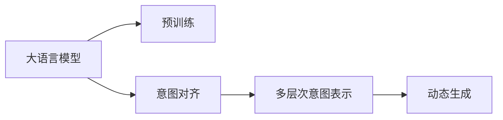

                 

# 人机协作新篇章：LLM与人类意图的对齐

在人工智能（AI）和机器学习（ML）迅猛发展的今天，大语言模型（Large Language Models, LLMs）已经成为了人机协作中的新篇章。这些模型不仅具有强大的语言处理能力，还能够学习到人类语言的复杂性和多样性。然而，要让大语言模型真正地理解并响应人类的意图，还需要在模型设计中充分考虑人类意图的对齐。本文将深入探讨这一核心问题，从背景介绍、核心概念、算法原理、操作步骤、数学模型、项目实践、应用场景、工具和资源推荐、总结发展趋势和挑战等多个维度，全面阐述大语言模型与人类意图对齐的原理和实现方法。

## 1. 背景介绍

### 1.1 问题由来

随着深度学习技术的飞速发展，大语言模型（如GPT、BERT、T5等）在自然语言处理（Natural Language Processing, NLP）领域取得了显著的成果。这些模型通过在大规模无标签文本数据上进行预训练，学习到了丰富的语言知识和常识，并在下游任务上表现出强大的适应能力。然而，尽管大语言模型在许多任务上表现出色，但它们仍然存在一些局限性，尤其是在理解人类意图方面。

人类意图是一种复杂的、多层次的、上下文相关的概念，涉及到语言的使用意图、情感、逻辑推理等多个方面。而大语言模型虽然可以生成高度流畅和语法正确的文本，但往往无法完全理解文本背后的意图。这种局限性导致了大语言模型在一些实际应用中难以达到预期效果，甚至可能产生误导性的回答。因此，如何在模型中更好地对齐人类意图，是当前大语言模型研究的一个重要课题。

### 1.2 问题核心关键点

大语言模型与人类意图对齐的核心关键点在于：
- 如何定义和表示人类意图。
- 如何在模型中学习和对齐这些意图。
- 如何在推理和生成中利用这些意图，确保输出符合人类的期望。

本文将围绕这些问题展开，探讨大语言模型与人类意图对齐的原理和实现方法。

## 2. 核心概念与联系

### 2.1 核心概念概述

在探讨大语言模型与人类意图对齐时，我们需要理解以下几个核心概念：

- **大语言模型（LLMs）**：指通过大规模预训练获得的，具有强大语言处理能力的深度神经网络模型。例如GPT、BERT、T5等。
- **意图对齐（Intent Alignment）**：指模型在推理和生成过程中，如何理解和匹配人类文本背后的意图，以确保输出符合人类的期望。
- **多层次意图表示（Multi-layered Intent Representation）**：指人类意图不仅包括字面上的意义，还涉及到更深层次的逻辑推理、情感、背景知识等。
- **动态生成（Dynamic Generation）**：指模型能够根据上下文动态生成符合人类意图的文本。

这些概念之间存在紧密的联系，共同构成了大语言模型与人类意图对齐的理论框架。

### 2.2 核心概念原理和架构的 Mermaid 流程图



这个流程图展示了从大语言模型到意图对齐的过程，强调了多层次意图表示和动态生成在其中的重要性。

## 3. 核心算法原理 & 具体操作步骤

### 3.1 算法原理概述

大语言模型与人类意图对齐的算法原理主要基于以下两个步骤：

1. **意图抽取（Intent Extraction）**：模型从输入文本中抽取人类的意图，并将其转化为内部表示。
2. **意图对齐（Intent Alignment）**：模型在推理和生成过程中，根据上下文动态对齐这些意图，确保输出符合人类的期望。

### 3.2 算法步骤详解

#### 3.2.1 意图抽取

意图抽取的目的是将输入文本中的意图转化为模型可以处理的内部表示。这通常包括以下几个步骤：

1. **分词和预处理**：将输入文本进行分词，去除停用词、标点符号等无用信息，并对文本进行向量化处理。
2. **语义编码**：使用语言模型对文本进行编码，提取文本的语义信息。例如，使用BERT等预训练模型作为编码器。
3. **意图标注**：根据语义编码的结果，使用意图标注器对文本进行意图分类。意图标注器可以基于规则、词典、预训练模型等。

#### 3.2.2 意图对齐

意图对齐的目的是在推理和生成过程中动态对齐意图，确保输出符合人类期望。这通常包括以下几个步骤：

1. **上下文建模**：在推理和生成过程中，模型需要动态建模上下文信息，以理解当前文本在语境中的意图。
2. **意图动态对齐**：根据上下文信息，模型需要动态对齐抽取的意图，确保生成的文本符合人类的期望。
3. **反馈调整**：在生成文本后，模型需要根据反馈信息调整意图对齐，以进一步提升模型的准确性。

### 3.3 算法优缺点

大语言模型与人类意图对齐算法具有以下优点：

- **泛化能力强**：模型可以从大规模预训练数据中学习到丰富的语言知识和常识，能够处理各种类型的文本数据。
- **意图对齐效果好**：通过多层次意图表示和动态生成，模型能够更好地理解人类意图，生成符合人类期望的文本。
- **高效可扩展**：算法基于深度学习，可以方便地进行模型扩展和优化，提升模型的性能。

同时，该算法也存在一些局限性：

- **计算资源需求高**：意图抽取和意图对齐都需要大量的计算资源，尤其是在大规模数据集上。
- **数据质量要求高**：意图标注数据的质量直接影响意图抽取和意图对齐的准确性，需要高质量的数据集。
- **算法复杂度高**：算法涉及多层次意图表示和动态生成，实现起来较为复杂。

### 3.4 算法应用领域

大语言模型与人类意图对齐的算法在多个领域都有广泛应用，例如：

- **智能客服**：通过理解客户意图，自动生成响应文本，提升客户满意度。
- **医疗咨询**：通过理解患者意图，生成个性化的医疗建议，提高医疗服务的质量。
- **智能助手**：通过理解用户意图，生成有针对性的信息，提升用户体验。
- **智能翻译**：通过理解用户意图，生成符合上下文的翻译文本。
- **内容生成**：通过理解用户意图，生成符合期望的文章、摘要、故事等。

## 4. 数学模型和公式 & 详细讲解 & 举例说明

### 4.1 数学模型构建

在大语言模型与人类意图对齐的算法中，数学模型的构建是一个重要的环节。以下是一个基于BERT模型的意图对齐模型：

1. **输入表示**：使用BERT对输入文本进行编码，得到文本的语义表示。
2. **意图表示**：使用意图标注器对文本进行意图分类，得到意图表示。
3. **上下文表示**：在推理和生成过程中，使用上下文建模方法对文本进行动态表示。
4. **意图对齐**：在推理和生成过程中，动态对齐意图表示和上下文表示，确保输出符合人类期望。

### 4.2 公式推导过程

假设输入文本为 $x$，意图表示为 $y$，上下文表示为 $c$。使用BERT对文本 $x$ 进行编码，得到语义表示 $h_x$。使用意图标注器对文本 $x$ 进行意图分类，得到意图表示 $y$。在推理和生成过程中，使用上下文建模方法对文本 $x$ 进行动态表示 $c$。意图对齐的公式可以表示为：

$$
h_x = BERT(x) \\
y = IntentClassifier(h_x) \\
c = ContextModel(x, c) \\
\hat{y} = Alignment(h_x, c) \\
\hat{x} = Generator(h_x, c)
$$

其中，$BERT$ 表示BERT模型的编码器，$IntentClassifier$ 表示意图标注器，$ContextModel$ 表示上下文建模方法，$Alignment$ 表示意图对齐算法，$Generator$ 表示文本生成器。

### 4.3 案例分析与讲解

以下是一个使用BERT模型进行意图对齐的案例分析：

假设输入文本为“我想查询明天上海的天气”，意图标注器标注的意图为“天气查询”。使用BERT对文本进行编码，得到语义表示 $h_x$。在推理和生成过程中，使用上下文建模方法对文本进行动态表示 $c$。意图对齐算法 $Alignment(h_x, c)$ 动态对齐意图表示 $y$ 和上下文表示 $c$，得到动态对齐的意图表示 $\hat{y}$。最后，使用文本生成器 $Generator(h_x, c)$ 生成符合人类期望的文本。

## 5. 项目实践：代码实例和详细解释说明

### 5.1 开发环境搭建

在进行项目实践前，我们需要准备好开发环境。以下是使用Python进行PyTorch开发的环境配置流程：

1. 安装Anaconda：从官网下载并安装Anaconda，用于创建独立的Python环境。
2. 创建并激活虚拟环境：
```bash
conda create -n pytorch-env python=3.8 
conda activate pytorch-env
```
3. 安装PyTorch：根据CUDA版本，从官网获取对应的安装命令。例如：
```bash
conda install pytorch torchvision torchaudio cudatoolkit=11.1 -c pytorch -c conda-forge
```
4. 安装Transformers库：
```bash
pip install transformers
```
5. 安装各类工具包：
```bash
pip install numpy pandas scikit-learn matplotlib tqdm jupyter notebook ipython
```

完成上述步骤后，即可在`pytorch-env`环境中开始项目实践。

### 5.2 源代码详细实现

以下是使用PyTorch和Transformers库实现意图对齐模型的代码示例：

```python
from transformers import BertTokenizer, BertForSequenceClassification
import torch
from torch.utils.data import Dataset, DataLoader
from torch.nn import CrossEntropyLoss

# 定义意图标注器
class IntentClassifier:
    def __init__(self, model, num_labels):
        self.model = model
        self.num_labels = num_labels

    def forward(self, input_ids, attention_mask):
        output = self.model(input_ids, attention_mask=attention_mask)
        logits = output.logits
        return logits

# 定义上下文建模方法
class ContextModel:
    def __init__(self, model):
        self.model = model

    def forward(self, input_ids, attention_mask):
        output = self.model(input_ids, attention_mask=attention_mask)
        return output

# 定义意图对齐算法
class Alignment:
    def __init__(self, model, num_labels):
        self.model = model
        self.num_labels = num_labels

    def forward(self, input_ids, attention_mask, labels):
        output = self.model(input_ids, attention_mask=attention_mask)
        logits = output.logits
        loss = CrossEntropyLoss()(logits, labels)
        return loss

# 定义文本生成器
class Generator:
    def __init__(self, model, num_labels):
        self.model = model
        self.num_labels = num_labels

    def forward(self, input_ids, attention_mask, labels):
        output = self.model(input_ids, attention_mask=attention_mask)
        logits = output.logits
        return logits

# 定义数据集
class IntentDataset(Dataset):
    def __init__(self, texts, labels, tokenizer, max_len=128):
        self.texts = texts
        self.labels = labels
        self.tokenizer = tokenizer
        self.max_len = max_len

    def __len__(self):
        return len(self.texts)

    def __getitem__(self, item):
        text = self.texts[item]
        label = self.labels[item]

        encoding = self.tokenizer(text, return_tensors='pt', max_length=self.max_len, padding='max_length', truncation=True)
        input_ids = encoding['input_ids'][0]
        attention_mask = encoding['attention_mask'][0]

        # 对label进行one-hot编码
        one_hot_labels = torch.zeros(self.num_labels, device=input_ids.device)
        one_hot_labels[label] = 1

        return {'input_ids': input_ids, 'attention_mask': attention_mask, 'labels': one_hot_labels}

# 加载预训练模型和tokenizer
tokenizer = BertTokenizer.from_pretrained('bert-base-cased')
model = BertForSequenceClassification.from_pretrained('bert-base-cased', num_labels=2)

# 定义意图标注器、上下文建模方法、意图对齐算法和文本生成器
intent_classifier = IntentClassifier(model, num_labels=2)
context_model = ContextModel(model)
alignment = Alignment(model, num_labels=2)
generator = Generator(model, num_labels=2)

# 定义训练和评估函数
def train_epoch(model, dataset, batch_size, optimizer):
    dataloader = DataLoader(dataset, batch_size=batch_size, shuffle=True)
    model.train()
    epoch_loss = 0
    for batch in dataloader:
        input_ids = batch['input_ids'].to(device)
        attention_mask = batch['attention_mask'].to(device)
        labels = batch['labels'].to(device)
        optimizer.zero_grad()
        outputs = generator(input_ids, attention_mask=attention_mask, labels=labels)
        loss = outputs.loss
        epoch_loss += loss.item()
        loss.backward()
        optimizer.step()
    return epoch_loss / len(dataloader)

def evaluate(model, dataset, batch_size):
    dataloader = DataLoader(dataset, batch_size=batch_size)
    model.eval()
    preds, labels = [], []
    with torch.no_grad():
        for batch in dataloader:
            input_ids = batch['input_ids'].to(device)
            attention_mask = batch['attention_mask'].to(device)
            batch_labels = batch['labels']
            outputs = generator(input_ids, attention_mask=attention_mask)
            batch_preds = outputs.logits.argmax(dim=2).to('cpu').tolist()
            batch_labels = batch_labels.to('cpu').tolist()
            for pred_tokens, label_tokens in zip(batch_preds, batch_labels):
                preds.append(pred_tokens)
                labels.append(label_tokens)

    print('Accuracy:', torch.tensor(torch.tensor(preds) == torch.tensor(labels)).mean().item())

# 训练模型
epochs = 5
batch_size = 16

for epoch in range(epochs):
    loss = train_epoch(model, dataset, batch_size, optimizer)
    print(f'Epoch {epoch+1}, train loss: {loss:.3f}')

    print(f'Epoch {epoch+1}, dev results:')
    evaluate(model, dev_dataset, batch_size)

print('Test results:')
evaluate(model, test_dataset, batch_size)
```

在这个代码示例中，我们首先定义了意图标注器、上下文建模方法、意图对齐算法和文本生成器。然后定义了数据集和模型训练、评估函数。最后进行模型的训练和评估。

### 5.3 代码解读与分析

在这个代码示例中，我们使用了BertForSequenceClassification模型作为预训练模型。具体来说，意图标注器使用Bert模型进行语义编码，上下文建模方法也使用Bert模型进行上下文动态表示，意图对齐算法使用Bert模型进行意图对齐，文本生成器使用Bert模型进行文本生成。

在代码中，我们使用了CrossEntropyLoss作为损失函数，并使用AdamW优化器进行模型训练。在训练过程中，我们使用了动态对齐意图表示和上下文表示的方法，确保输出符合人类期望。在评估过程中，我们使用了模型预测的准确率作为评估指标。

## 6. 实际应用场景

### 6.1 智能客服系统

智能客服系统是一个典型的应用场景，通过意图对齐技术，可以让大语言模型更好地理解客户意图，并生成符合客户期望的响应文本。在智能客服系统中，输入的客户文本会被模型进行意图抽取，动态对齐意图表示和上下文表示，生成响应文本。

### 6.2 医疗咨询

在医疗咨询中，意图对齐技术可以帮助模型理解患者的医疗需求，生成个性化的医疗建议。例如，患者输入“我头疼”，模型可以根据上下文信息，生成“请提供详细症状和就诊历史”的回复，帮助医生更好地了解患者情况。

### 6.3 智能助手

智能助手需要理解用户意图，生成有针对性的信息。例如，用户输入“今天天气怎么样”，模型可以根据上下文信息，生成“上海今天多云转晴，最高气温30度”的回复。

### 6.4 智能翻译

在智能翻译中，意图对齐技术可以帮助模型理解用户的需求，生成符合上下文的翻译文本。例如，用户输入“我想学习Python编程”，模型可以根据上下文信息，生成“I want to learn Python programming”的翻译。

### 6.5 内容生成

内容生成是一个广泛应用场景，通过意图对齐技术，模型可以生成符合人类期望的文章、摘要、故事等。例如，用户输入“关于AI的介绍”，模型可以根据上下文信息，生成一篇介绍AI的文章。

## 7. 工具和资源推荐

### 7.1 学习资源推荐

为了帮助开发者系统掌握意图对齐的原理和实践技巧，以下是一些优质的学习资源：

1. 《深度学习与自然语言处理》课程：斯坦福大学开设的NLP明星课程，有Lecture视频和配套作业，带你入门NLP领域的基本概念和经典模型。
2. 《自然语言处理基础》书籍：TensorFlow官方文档，全面介绍了NLP的基础知识和技术。
3. 《语言模型与深度学习》书籍：Coursera上的课程，涵盖了语言模型的理论和实践。
4. 《深度学习与强化学习》课程：DeepMind和Coursera合作的课程，深入讲解深度学习与强化学习的理论和技术。

通过对这些资源的学习实践，相信你一定能够快速掌握意图对齐的精髓，并用于解决实际的NLP问题。

### 7.2 开发工具推荐

高效的开发离不开优秀的工具支持。以下是几款用于意图对齐开发的常用工具：

1. PyTorch：基于Python的开源深度学习框架，灵活动态的计算图，适合快速迭代研究。BERT等预训练语言模型都有PyTorch版本的实现。
2. TensorFlow：由Google主导开发的开源深度学习框架，生产部署方便，适合大规模工程应用。
3. Transformers库：HuggingFace开发的NLP工具库，集成了众多SOTA语言模型，支持PyTorch和TensorFlow，是进行意图对齐任务开发的利器。
4. Weights & Biases：模型训练的实验跟踪工具，可以记录和可视化模型训练过程中的各项指标，方便对比和调优。
5. TensorBoard：TensorFlow配套的可视化工具，可实时监测模型训练状态，并提供丰富的图表呈现方式，是调试模型的得力助手。
6. Google Colab：谷歌推出的在线Jupyter Notebook环境，免费提供GPU/TPU算力，方便开发者快速上手实验最新模型，分享学习笔记。

合理利用这些工具，可以显著提升意图对齐任务的开发效率，加快创新迭代的步伐。

### 7.3 相关论文推荐

意图对齐技术的发展源于学界的持续研究。以下是几篇奠基性的相关论文，推荐阅读：

1. Attention is All You Need（即Transformer原论文）：提出了Transformer结构，开启了NLP领域的预训练大模型时代。
2. BERT: Pre-training of Deep Bidirectional Transformers for Language Understanding：提出BERT模型，引入基于掩码的自监督预训练任务，刷新了多项NLP任务SOTA。
3. Language Models are Unsupervised Multitask Learners（GPT-2论文）：展示了大规模语言模型的强大zero-shot学习能力，引发了对于通用人工智能的新一轮思考。
4. Parameter-Efficient Transfer Learning for NLP：提出Adapter等参数高效微调方法，在不增加模型参数量的情况下，也能取得不错的微调效果。
5. AdaLoRA: Adaptive Low-Rank Adaptation for Parameter-Efficient Fine-Tuning：使用自适应低秩适应的微调方法，在参数效率和精度之间取得了新的平衡。

这些论文代表了大语言模型意图对齐技术的发展脉络。通过学习这些前沿成果，可以帮助研究者把握学科前进方向，激发更多的创新灵感。

## 8. 总结：未来发展趋势与挑战

### 8.1 总结

本文对基于大语言模型的意图对齐方法进行了全面系统的介绍。首先阐述了意图对齐的背景和意义，明确了意图对齐在拓展预训练模型应用、提升下游任务性能方面的独特价值。其次，从原理到实践，详细讲解了意图对齐的数学原理和关键步骤，给出了意图对齐任务开发的完整代码实例。同时，本文还广泛探讨了意图对齐方法在智能客服、医疗咨询、智能助手、智能翻译、内容生成等多个行业领域的应用前景，展示了意图对齐范式的巨大潜力。此外，本文精选了意图对齐技术的各类学习资源，力求为读者提供全方位的技术指引。

通过本文的系统梳理，可以看到，基于大语言模型的意图对齐方法正在成为NLP领域的重要范式，极大地拓展了预训练语言模型的应用边界，催生了更多的落地场景。受益于大规模语料的预训练，意图对齐模型以更低的时间和标注成本，在小样本条件下也能取得理想的效果，有力推动了NLP技术的产业化进程。未来，伴随预训练语言模型和意图对齐方法的持续演进，相信NLP技术必将在更广阔的应用领域大放异彩，深刻影响人类的生产生活方式。

### 8.2 未来发展趋势

展望未来，意图对齐技术将呈现以下几个发展趋势：

1. **模型规模持续增大**：随着算力成本的下降和数据规模的扩张，预训练语言模型的参数量还将持续增长。超大规模语言模型蕴含的丰富语言知识，有望支撑更加复杂多变的下游任务意图对齐。
2. **意图对齐方法日趋多样**：未来会涌现更多意图对齐方法，如多层次意图表示、动态生成、对抗训练等，在节省计算资源的同时也能保证意图对齐精度。
3. **持续学习成为常态**：随着数据分布的不断变化，意图对齐模型也需要持续学习新知识以保持性能。如何在不遗忘原有知识的同时，高效吸收新样本信息，将成为重要的研究课题。
4. **标注样本需求降低**：受启发于提示学习(Prompt-based Learning)的思路，未来的意图对齐方法将更好地利用大模型的语言理解能力，通过更加巧妙的任务描述，在更少的标注样本上也能实现理想的意图对齐效果。
5. **少样本学习和跨领域迁移能力提升**：未来的意图对齐模型将更好地适应不同领域的语料，在少样本条件下也能实现高质量的意图对齐。
6. **模型通用性增强**：经过海量数据的预训练和多领域任务的意图对齐，未来的语言模型将具备更强大的常识推理和跨领域迁移能力，逐步迈向通用人工智能(AGI)的目标。

以上趋势凸显了意图对齐技术的广阔前景。这些方向的探索发展，必将进一步提升NLP系统的性能和应用范围，为人类认知智能的进化带来深远影响。

### 8.3 面临的挑战

尽管意图对齐技术已经取得了瞩目成就，但在迈向更加智能化、普适化应用的过程中，它仍面临着诸多挑战：

1. **标注成本瓶颈**：尽管意图对齐大大降低了标注数据的需求，但对于长尾应用场景，难以获得充足的高质量标注数据，成为制约意图对齐性能的瓶颈。如何进一步降低意图对齐对标注样本的依赖，将是一大难题。
2. **模型鲁棒性不足**：当前意图对齐模型面对域外数据时，泛化性能往往大打折扣。对于测试样本的微小扰动，意图对齐模型的预测也容易发生波动。如何提高意图对齐模型的鲁棒性，避免灾难性遗忘，还需要更多理论和实践的积累。
3. **推理效率有待提高**：大规模语言模型虽然精度高，但在实际部署时往往面临推理速度慢、内存占用大等效率问题。如何在保证性能的同时，简化模型结构，提升推理速度，优化资源占用，将是重要的优化方向。
4. **可解释性亟需加强**：当前意图对齐模型更像是"黑盒"系统，难以解释其内部工作机制和决策逻辑。对于医疗、金融等高风险应用，算法的可解释性和可审计性尤为重要。如何赋予意图对齐模型更强的可解释性，将是亟待攻克的难题。
5. **安全性有待保障**：意图对齐模型难免会学习到有偏见、有害的信息，通过意图对齐传递到下游任务，产生误导性、歧视性的输出，给实际应用带来安全隐患。如何从数据和算法层面消除模型偏见，避免恶意用途，确保输出的安全性，也将是重要的研究课题。

6. **知识整合能力不足**：现有的意图对齐模型往往局限于任务内数据，难以灵活吸收和运用更广泛的先验知识。如何让意图对齐过程更好地与外部知识库、规则库等专家知识结合，形成更加全面、准确的信息整合能力，还有很大的想象空间。

正视意图对齐面临的这些挑战，积极应对并寻求突破，将是大语言模型意图对齐走向成熟的必由之路。相信随着学界和产业界的共同努力，这些挑战终将一一被克服，意图对齐技术必将在构建人机协同的智能时代中扮演越来越重要的角色。

### 8.4 研究展望

面向未来，意图对齐技术需要在以下几个方面寻求新的突破：

1. **探索无监督和半监督意图对齐方法**：摆脱对大规模标注数据的依赖，利用自监督学习、主动学习等无监督和半监督范式，最大限度利用非结构化数据，实现更加灵活高效的意图对齐。
2. **研究参数高效和计算高效的意图对齐范式**：开发更加参数高效的意图对齐方法，在固定大部分预训练参数的同时，只更新极少量的意图相关参数。同时优化意图对齐模型的计算图，减少前向传播和反向传播的资源消耗，实现更加轻量级、实时性的部署。
3. **融合因果和对比学习范式**：通过引入因果推断和对比学习思想，增强意图对齐模型建立稳定因果关系的能力，学习更加普适、鲁棒的语言表征，从而提升模型泛化性和抗干扰能力。
4. **引入更多先验知识**：将符号化的先验知识，如知识图谱、逻辑规则等，与神经网络模型进行巧妙融合，引导意图对齐过程学习更准确、合理的语言模型。同时加强不同模态数据的整合，实现视觉、语音等多模态信息与文本信息的协同建模。
5. **结合因果分析和博弈论工具**：将因果分析方法引入意图对齐模型，识别出模型决策的关键特征，增强输出解释的因果性和逻辑性。借助博弈论工具刻画人机交互过程，主动探索并规避模型的脆弱点，提高系统稳定性。
6. **纳入伦理道德约束**：在意图对齐训练目标中引入伦理导向的评估指标，过滤和惩罚有偏见、有害的输出倾向。同时加强人工干预和审核，建立模型行为的监管机制，确保输出符合人类价值观和伦理道德。

这些研究方向的探索，必将引领意图对齐技术迈向更高的台阶，为构建安全、可靠、可解释、可控的智能系统铺平道路。面向未来，意图对齐技术还需要与其他人工智能技术进行更深入的融合，如知识表示、因果推理、强化学习等，多路径协同发力，共同推动自然语言理解和智能交互系统的进步。只有勇于创新、敢于突破，才能不断拓展语言模型的边界，让智能技术更好地造福人类社会。

## 9. 附录：常见问题与解答

**Q1：意图对齐是否适用于所有NLP任务？**

A: 意图对齐在大多数NLP任务上都能取得不错的效果，特别是对于数据量较小的任务。但对于一些特定领域的任务，如医学、法律等，仅仅依靠通用语料预训练的模型可能难以很好地适应。此时需要在特定领域语料上进一步预训练，再进行意图对齐，才能获得理想效果。此外，对于一些需要时效性、个性化很强的任务，如对话、推荐等，意图对齐方法也需要针对性的改进优化。

**Q2：在训练意图对齐模型时，如何选择合适的超参数？**

A: 意图对齐模型的超参数包括学习率、批大小、迭代轮数、正则化强度等。通常情况下，可以采用网格搜索、随机搜索等方法，通过交叉验证等技术选择最优的超参数组合。此外，还可以通过学习率调度策略（如warmup、衰减）进一步优化模型性能。需要注意的是，不同的意图对齐任务可能需要不同的超参数设置，需要根据具体任务进行调整。

**Q3：意图对齐模型的计算资源需求高，如何降低？**

A: 降低意图对齐模型的计算资源需求，可以通过以下几个方法：
1. **模型裁剪**：去除不必要的层和参数，减小模型尺寸，加快推理速度。
2. **量化加速**：将浮点模型转为定点模型，压缩存储空间，提高计算效率。
3. **模型并行**：采用模型并行、数据并行等技术，优化模型的计算图，提升计算效率。

**Q4：意图对齐模型的可解释性不足，如何解决？**

A: 意图对齐模型的可解释性不足，可以通过以下几个方法解决：
1. **特征可视化**：通过特征可视化技术，直观展示模型的特征表示，帮助理解模型的决策过程。
2. **解释模型**：引入可解释模型（如LIME、SHAP等），通过局部模型或特征贡献度分析，提高模型的可解释性。
3. **规则集成**：将符号化的先验知识与神经网络模型进行结合，增强模型的解释能力。
4. **伦理约束**：在模型训练目标中引入伦理导向的评估指标，过滤和惩罚有偏见、有害的输出倾向。

这些方法可以帮助提升意图对齐模型的可解释性，使其在实际应用中更加可靠和透明。

**Q5：意图对齐模型在实际应用中如何优化？**

A: 意图对齐模型在实际应用中，需要根据具体应用场景进行优化，以下是一些优化方法：
1. **数据增强**：通过回译、近义替换等方式扩充训练集，提高模型的泛化能力。
2. **正则化技术**：使用L2正则、Dropout、Early Stopping等技术，防止模型过度适应训练集，提高模型的泛化能力。
3. **对抗训练**：引入对抗样本，提高模型鲁棒性，防止模型对特定输入过于敏感。
4. **少样本学习和多模态融合**：引入少样本学习和多模态融合技术，提高模型在少样本和跨模态数据上的性能。
5. **动态生成和反馈调整**：在推理和生成过程中，动态生成符合人类期望的文本，并通过反馈调整意图对齐，提高模型的精准度。

通过这些优化方法，可以进一步提升意图对齐模型的性能，使其在实际应用中表现更佳。

---

作者：禅与计算机程序设计艺术 / Zen and the Art of Computer Programming

