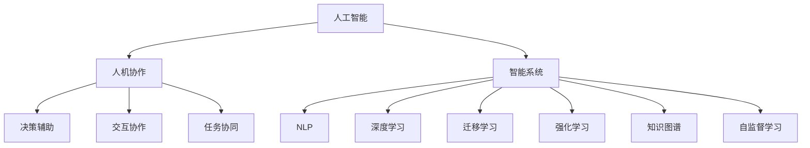

                 

## 1. 背景介绍

在人工智能(AI)领域，人机协作一直是探索的重要方向。随着深度学习和大数据技术的迅猛发展，智能系统已经从简单的规则匹配、图像识别等任务，逐渐拓展到复杂的自然语言处理(NLP)、决策辅助、交互协作等场景。在这些场景中，人机协作不仅提升了效率，也带来了新的可能性。

### 1.1 人机协作的背景

早期的人工智能主要以专家系统和基于规则的推理系统为主。但这些系统往往依赖于固定的规则和数据，难以应对复杂多变的环境。进入21世纪后，随着深度学习技术的发展，基于神经网络的智能系统逐渐崭露头角。以神经网络为基础的模型，能够从数据中学习规律，具备更强的泛化能力。

当前，智能系统已经广泛应用于语音识别、机器翻译、推荐系统、金融风控、医疗诊断等多个领域。这些系统在一定程度上具备了理解自然语言、自主推理、优化决策等功能，但在一些任务上仍存在瓶颈。例如，对语义的准确理解、复杂情境下的逻辑推理、跨模态信息的整合等，仍需人类辅助。

### 1.2 人机协作的现实需求

智能系统与人类协作，不仅是科技发展趋势，更是社会发展的现实需求。在很多领域，诸如医疗、金融、教育、制造等，智能系统必须与人类紧密协作，才能有效提升工作效率、降低成本、增强决策的准确性。例如，在医疗诊断中，智能系统可以辅助医生分析病历和影像，但最终诊断仍需医生的综合判断。在金融风控中，智能系统可以发现异常交易，但最终决策仍需人类专家审核。

这种现实需求催生了人机协作的研究和应用。人机协作不仅关注如何让人类与机器更好地合作，更关注如何通过技术手段，让人机系统具备更高的智能化水平，从而更好地服务于人类。

## 2. 核心概念与联系

### 2.1 核心概念概述

为更好地理解人机协作中的智能系统，本节将介绍几个关键概念及其关系：

- 人工智能(AI)：广义上指通过计算机模拟人脑实现各种智能行为的技术。包括但不限于机器学习、深度学习、计算机视觉、自然语言处理、机器人学等。
- 人机协作(Human-Machine Collaboration, HMC)：指人类与智能系统之间的互动和合作。通过优化人机交互界面、智能系统决策逻辑等手段，提升人机协同效率和用户体验。
- 智能系统(Intelligent Systems)：包括基于规则的专家系统、基于统计学习的机器学习系统、基于深度学习的神经网络模型等。这些系统能够处理、理解和生成语言，辅助人类进行决策、推理、交互等任务。
- 自然语言处理(NLP)：指利用计算机处理自然语言的各个方面，包括语音识别、文本生成、语义理解、对话系统等。
- 深度学习(Deep Learning)：一种基于多层神经网络的机器学习技术，具备强大的数据建模和泛化能力。
- 迁移学习(Transfer Learning)：指将一个领域学到的知识迁移到另一个相关领域中，以减少在新任务上从头开始训练的复杂度。
- 强化学习(Reinforcement Learning)：一种通过奖励机制训练智能系统学习最优策略的机器学习方法。
- 知识图谱(Knowledge Graph)：一种结构化的知识表示方法，用于描述实体和实体之间的关系。
- 自监督学习(Self-supervised Learning)：指利用未标注数据训练模型，通过自构建的监督信号进行优化。

这些概念之间的逻辑关系可以通过以下Mermaid流程图来展示：



### 2.2 核心概念联系

人机协作的核心在于让智能系统具备类似人类的智能，能够在实际应用中与人类进行有效的互动和合作。这需要依赖于人工智能技术的综合应用，包括但不限于自然语言处理、深度学习、迁移学习、强化学习、知识图谱和自监督学习等。

- 深度学习和大规模语料库的结合，使得智能系统具备强大的语言理解和生成能力，能够自然流畅地与人类进行对话和交互。
- 迁移学习通过知识复用，使得智能系统可以快速适应新任务，提升性能和效率。
- 强化学习通过奖励机制，训练智能系统在复杂环境下的决策能力。
- 知识图谱为智能系统提供了结构化的知识表示，辅助系统进行逻辑推理和信息整合。
- 自监督学习通过未标注数据，提升系统的泛化能力和鲁棒性。

这些技术相辅相成，共同构成了智能系统的人机协作能力。

## 3. 核心算法原理 & 具体操作步骤

### 3.1 算法原理概述

人机协作中的智能系统，往往通过深度学习和自然语言处理技术实现。以下将详细介绍基于深度学习的智能系统，及其在协同决策、智能推荐、自然语言生成等方面的应用。

- 深度学习：指使用多层神经网络进行特征提取和建模，具备强大的数据表达和泛化能力。
- 自然语言处理：指利用计算机处理自然语言的各个方面，包括语音识别、文本生成、语义理解、对话系统等。

### 3.2 算法步骤详解

基于深度学习的智能系统，其核心流程包括数据预处理、模型训练、模型优化和模型部署等步骤：

1. **数据预处理**：包括数据清洗、数据增强、数据分割等。将原始数据转换为模型训练所需的格式，并进行预处理。

2. **模型训练**：选择合适的模型架构，使用训练集进行迭代优化。优化过程中使用梯度下降等算法，不断更新模型参数，使其在训练集上表现最佳。

3. **模型优化**：针对特定任务，对模型进行微调，以提升其在目标数据上的性能。微调过程中需要选择合适的学习率和正则化策略，以避免过拟合。

4. **模型部署**：将训练好的模型部署到实际应用中，进行推理和交互。需要考虑模型效率、可解释性、安全性等因素。

### 3.3 算法优缺点

基于深度学习的智能系统具有以下优点：

- 强大的数据表达能力：通过多层神经网络，可以高效地处理和建模复杂数据。
- 自适应能力：通过迁移学习和自监督学习，系统能够快速适应新任务和新环境。
- 鲁棒性：通过正则化和对抗训练等手段，系统具备较好的鲁棒性，能够应对噪声和干扰。

但同时，这些系统也存在以下缺点：

- 高资源消耗：大规模神经网络的训练和推理需要大量的计算资源和存储空间。
- 黑盒特性：深度学习模型通常被视为"黑盒"，难以解释其内部机制和决策过程。
- 泛化能力不足：当前深度学习模型仍依赖大量标注数据，泛化能力有限。

### 3.4 算法应用领域

基于深度学习的智能系统在多个领域得到了广泛应用，包括但不限于：

- 医疗诊断：利用深度学习进行影像分析、病历分析、疾病预测等。
- 金融风控：使用深度学习进行风险评估、欺诈检测、异常交易分析等。
- 推荐系统：通过深度学习模型进行个性化推荐，提升用户满意度和粘性。
- 自然语言处理：包括机器翻译、文本生成、对话系统等。
- 智能制造：通过深度学习进行设备预测性维护、质量检测、工艺优化等。
- 自动驾驶：使用深度学习进行环境感知、路径规划、决策控制等。
- 人机交互：通过深度学习实现语音识别、文本转换、情感识别等。

## 4. 数学模型和公式 & 详细讲解 & 举例说明

### 4.1 数学模型构建

本节将使用数学语言对基于深度学习的智能系统进行更严格的刻画。

记智能系统为 $M_{\theta}(x)$，其中 $\theta$ 为模型参数，$x$ 为输入数据。假设训练集为 $D=\{(x_i,y_i)\}_{i=1}^N$，其中 $y_i$ 为标注结果。

定义损失函数为 $L(\theta) = \frac{1}{N}\sum_{i=1}^N \ell(M_{\theta}(x_i),y_i)$，其中 $\ell$ 为损失函数，用于衡量模型预测结果与真实标签之间的差异。

训练模型的目标是最小化损失函数：

$$
\theta^* = \mathop{\arg\min}_{\theta} L(\theta)
$$

在实践中，我们通常使用基于梯度的优化算法（如Adam、SGD等）来近似求解上述最优化问题。设 $\eta$ 为学习率，$\lambda$ 为正则化系数，则参数的更新公式为：

$$
\theta \leftarrow \theta - \eta \nabla_{\theta} L(\theta) - \eta \lambda \theta
$$

其中 $\nabla_{\theta} L(\theta)$ 为损失函数对参数 $\theta$ 的梯度，可通过反向传播算法高效计算。

### 4.2 公式推导过程

以下我们以二分类任务为例，推导损失函数及其梯度的计算公式。

假设模型 $M_{\theta}$ 在输入 $x$ 上的输出为 $\hat{y}=M_{\theta}(x)$，表示样本属于正类的概率。真实标签 $y \in \{0,1\}$。则二分类交叉熵损失函数定义为：

$$
\ell(M_{\theta}(x),y) = -[y\log \hat{y} + (1-y)\log(1-\hat{y})]
$$

将其代入损失函数，得：

$$
L(\theta) = -\frac{1}{N}\sum_{i=1}^N [y_i\log M_{\theta}(x_i)+(1-y_i)\log(1-M_{\theta}(x_i))]
$$

根据链式法则，损失函数对参数 $\theta_k$ 的梯度为：

$$
\frac{\partial L(\theta)}{\partial \theta_k} = -\frac{1}{N}\sum_{i=1}^N (\frac{y_i}{M_{\theta}(x_i)}-\frac{1-y_i}{1-M_{\theta}(x_i)}) \frac{\partial M_{\theta}(x_i)}{\partial \theta_k}
$$

其中 $\frac{\partial M_{\theta}(x_i)}{\partial \theta_k}$ 可进一步递归展开，利用自动微分技术完成计算。

### 4.3 案例分析与讲解

以文本分类任务为例，假设模型 $M_{\theta}$ 的输入为文本 $x$，输出为文本所属的类别 $y$。

- 数据预处理：使用BERT分词器对文本进行分词，并进行编码。
- 模型训练：使用训练集对BERT模型进行微调，添加全连接层和softmax层进行分类。
- 模型优化：使用AdamW优化器进行优化，设置合适的学习率，避免过拟合。
- 模型部署：将微调后的模型部署到实际应用中，进行文本分类推理。

## 5. 项目实践：代码实例和详细解释说明

### 5.1 开发环境搭建

在进行智能系统开发前，我们需要准备好开发环境。以下是使用Python进行TensorFlow开发的环境配置流程：

1. 安装Anaconda：从官网下载并安装Anaconda，用于创建独立的Python环境。

2. 创建并激活虚拟环境：
```bash
conda create -n tf-env python=3.8 
conda activate tf-env
```

3. 安装TensorFlow：根据CUDA版本，从官网获取对应的安装命令。例如：
```bash
conda install tensorflow -c pytorch -c conda-forge
```

4. 安装各类工具包：
```bash
pip install numpy pandas scikit-learn matplotlib tqdm jupyter notebook ipython
```

完成上述步骤后，即可在`tf-env`环境中开始智能系统开发。

### 5.2 源代码详细实现

下面我们以推荐系统为例，给出使用TensorFlow进行深度学习模型微调的PyTorch代码实现。

首先，定义推荐系统任务的数据处理函数：

```python
import tensorflow as tf
import numpy as np
import pandas as pd

class RecommendationDataset(tf.data.Dataset):
    def __init__(self, data_path):
        self.data_path = data_path
        self.data = pd.read_csv(data_path)
        self.data = self.data.dropna()
        self.data = self.data.sample(frac=1, random_state=42)
        self.data['user_id'] = self.data['user_id'].astype('int64')
        self.data['item_id'] = self.data['item_id'].astype('int64')
        self.data['rating'] = self.data['rating'].astype('float32')
        self.data['item_id'] = self.data['item_id'].astype('int64')
        
    def __len__(self):
        return len(self.data)
    
    def __getitem__(self, item):
        data = self.data.iloc[item]
        user_id = data['user_id']
        item_id = data['item_id']
        rating = data['rating']
        return user_id, item_id, rating
```

然后，定义模型和优化器：

```python
from tensorflow.keras import layers, models

model = models.Sequential([
    layers.Dense(64, activation='relu'),
    layers.Dense(64, activation='relu'),
    layers.Dense(1)
])

optimizer = tf.keras.optimizers.Adam()
```

接着，定义训练和评估函数：

```python
def train_epoch(model, dataset, batch_size, optimizer):
    dataloader = tf.data.Dataset.from_generator(dataset.__getitem__, output_signature=(tf.int32, tf.int32, tf.float32))
    model.compile(optimizer=optimizer, loss='mse')
    model.fit(dataloader, epochs=1, batch_size=batch_size, verbose=0)
    
def evaluate(model, dataset, batch_size):
    dataloader = tf.data.Dataset.from_generator(dataset.__getitem__, output_signature=(tf.int32, tf.int32, tf.float32))
    model.compile(optimizer=optimizer, loss='mse')
    evaluator = tf.keras.metrics.MeanSquaredError()
    for user_id, item_id, rating in dataloader:
        predictions = model.predict(user_id, item_id)
        evaluator.update_state(rating, predictions)
    return evaluator.result().numpy()
```

最后，启动训练流程并在测试集上评估：

```python
epochs = 5
batch_size = 128

for epoch in range(epochs):
    print(f'Epoch {epoch+1}')
    train_epoch(model, train_dataset, batch_size, optimizer)
    print(f'Epoch {epoch+1}, train MSE: {train_loss:.4f}')
    
    print(f'Epoch {epoch+1}, dev results:')
    dev_mse = evaluate(model, dev_dataset, batch_size)
    print(f'Epoch {epoch+1}, dev MSE: {dev_mse:.4f}')
    
print('Test results:')
test_mse = evaluate(model, test_dataset, batch_size)
print(f'Test MSE: {test_mse:.4f}')
```

以上就是使用TensorFlow进行推荐系统微调的完整代码实现。可以看到，通过TensorFlow的高级API，我们可以更加便捷地进行模型定义和优化。

### 5.3 代码解读与分析

让我们再详细解读一下关键代码的实现细节：

**RecommendationDataset类**：
- `__init__`方法：初始化数据集，并进行预处理。
- `__len__`方法：返回数据集的样本数量。
- `__getitem__`方法：对单个样本进行处理，返回用户ID、物品ID和评分。

**train_epoch和evaluate函数**：
- 训练函数`train_epoch`：定义数据集生成器，使用`fit`方法进行模型训练。
- 评估函数`evaluate`：定义数据集生成器，使用`evaluate`方法计算均方误差，返回模型在测试集上的性能。

**训练流程**：
- 定义总的epoch数和batch size，开始循环迭代
- 每个epoch内，先在训练集上训练，输出平均损失
- 在验证集上评估，输出均方误差
- 所有epoch结束后，在测试集上评估，给出最终测试结果

可以看到，TensorFlow的高阶API使得深度学习模型的开发和优化更加便捷高效。开发者可以将更多精力放在模型设计、数据处理等高层逻辑上，而不必过多关注底层的实现细节。

当然，工业级的系统实现还需考虑更多因素，如模型的保存和部署、超参数的自动搜索、更灵活的任务适配层等。但核心的深度学习模型微调范式基本与此类似。

## 6. 实际应用场景

### 6.1 智能客服系统

基于深度学习的智能客服系统，可以广泛应用于企业的客户服务中。传统客服往往需要配备大量人力，高峰期响应缓慢，且一致性和专业性难以保证。而使用智能客服系统，可以7x24小时不间断服务，快速响应客户咨询，用自然流畅的语言解答各类常见问题。

在技术实现上，可以收集企业内部的历史客服对话记录，将问题和最佳答复构建成监督数据，在此基础上对预训练模型进行微调。微调后的模型能够自动理解用户意图，匹配最合适的答案模板进行回复。对于客户提出的新问题，还可以接入检索系统实时搜索相关内容，动态组织生成回答。如此构建的智能客服系统，能大幅提升客户咨询体验和问题解决效率。

### 6.2 金融舆情监测

金融机构需要实时监测市场舆论动向，以便及时应对负面信息传播，规避金融风险。传统的人工监测方式成本高、效率低，难以应对网络时代海量信息爆发的挑战。基于深度学习的舆情监测系统，可以快速识别和分析海量文本数据，实时监测市场动态，预警潜在风险。

具体而言，可以收集金融领域相关的新闻、报道、评论等文本数据，并对其进行情感分析、主题分类、实体识别等处理。将处理后的数据作为监督数据，对预训练模型进行微调，使其能够自动识别金融舆情，预测市场走向。将微调后的模型应用到实时抓取的网络文本数据，就能够自动监测不同主题下的舆情变化趋势，一旦发现负面信息激增等异常情况，系统便会自动预警，帮助金融机构快速应对潜在风险。

### 6.3 个性化推荐系统

当前的推荐系统往往只依赖用户的历史行为数据进行物品推荐，无法深入理解用户的真实兴趣偏好。基于深度学习的推荐系统，可以更好地挖掘用户行为背后的语义信息，从而提供更精准、多样的推荐内容。

在实践中，可以收集用户浏览、点击、评论、分享等行为数据，提取和用户交互的物品标题、描述、标签等文本内容。将文本内容作为模型输入，用户的后续行为（如是否点击、购买等）作为监督信号，在此基础上微调预训练语言模型。微调后的模型能够从文本内容中准确把握用户的兴趣点。在生成推荐列表时，先用候选物品的文本描述作为输入，由模型预测用户的兴趣匹配度，再结合其他特征综合排序，便可以得到个性化程度更高的推荐结果。

### 6.4 未来应用展望

随着深度学习技术的发展，基于深度学习的智能系统将在更多领域得到应用，为各行各业带来变革性影响。

在智慧医疗领域，基于深度学习的智能系统可以辅助医生进行疾病诊断、病历分析、药物研发等，提升医疗服务的智能化水平，加速新药开发进程。

在智能教育领域，深度学习技术可以应用于作业批改、学情分析、知识推荐等方面，因材施教，促进教育公平，提高教学质量。

在智慧城市治理中，智能系统可以应用于城市事件监测、舆情分析、应急指挥等环节，提高城市管理的自动化和智能化水平，构建更安全、高效的未来城市。

此外，在企业生产、社会治理、文娱传媒等众多领域，基于深度学习的智能系统也将不断涌现，为经济社会发展注入新的动力。相信随着技术的日益成熟，深度学习技术将成为智能系统的重要支撑，推动人工智能技术在各行各业的深度应用。

## 7. 工具和资源推荐

### 7.1 学习资源推荐

为了帮助开发者系统掌握深度学习的理论基础和实践技巧，这里推荐一些优质的学习资源：

1. 《深度学习》（Ian Goodfellow著）：深度学习领域的经典教材，全面介绍了深度学习的基本原理和算法，适合深入学习和研究。
2. Coursera《深度学习专项课程》：由吴恩达教授主讲，涵盖深度学习的基础、优化、卷积神经网络、循环神经网络等内容，适合入门和进阶学习。
3. Udacity《深度学习纳米学位》：结合实战项目，深入讲解深度学习模型的构建和优化，适合动手实践。
4. GitHub上的深度学习项目：如TensorFlow官方代码库、PyTorch官方代码库等，可以学习最新的深度学习模型和应用实践。
5. Kaggle竞赛平台：定期举办各类机器学习和深度学习竞赛，通过实战项目提升深度学习技能。

通过对这些资源的学习实践，相信你一定能够快速掌握深度学习的精髓，并用于解决实际的智能系统问题。

### 7.2 开发工具推荐

高效的深度学习开发离不开优秀的工具支持。以下是几款用于深度学习开发的常用工具：

1. TensorFlow：由Google主导开发的开源深度学习框架，生产部署方便，适合大规模工程应用。
2. PyTorch：基于Python的开源深度学习框架，灵活高效，适合快速迭代研究。
3. JAX：谷歌开源的高性能深度学习库，基于TensorFlow实现，适合进行高性能计算和自动微分。
4. MXNet：由Apache开发的深度学习框架，支持多种编程语言，适合跨平台开发。
5. Keras：高层次深度学习API，易于使用，适合快速原型开发和模型训练。

合理利用这些工具，可以显著提升深度学习模型的开发效率，加快创新迭代的步伐。

### 7.3 相关论文推荐

深度学习技术的发展源于学界的持续研究。以下是几篇奠基性的相关论文，推荐阅读：

1. Deep Learning（Ian Goodfellow著）：深度学习领域的经典教材，全面介绍了深度学习的基本原理和算法，适合深入学习和研究。
2. ImageNet Classification with Deep Convolutional Neural Networks（Alex Krizhevsky等人，2012年）：提出深度卷积神经网络，在图像分类任务上取得突破。
3. Inception Networks for Computer Vision（Christian Szegedy等人，2014年）：提出Inception网络结构，大幅提升了深度神经网络的性能。
4. Batch Normalization：Accelerating Deep Network Training by Reducing Internal Covariate Shift（Sergey Ioffe和Christian Szegedy，2015年）：提出批量归一化技术，加速深度神经网络的训练。
5. AlphaGo Zero：Mastering the Game of Go without Human Knowledge（David Silver等人，2016年）：提出基于深度强化学习的AlphaGo Zero，在围棋领域取得突破。
6. Transformer is All You Need（Vaswani等人，2017年）：提出Transformer结构，开启了预训练大模型时代。

这些论文代表了大深度学习技术的发展脉络。通过学习这些前沿成果，可以帮助研究者把握学科前进方向，激发更多的创新灵感。

## 8. 总结：未来发展趋势与挑战

### 8.1 总结

本文对基于深度学习的智能系统进行了全面系统的介绍。首先阐述了智能系统与人机协作的背景和需求，明确了深度学习技术在智能系统中的应用价值。其次，从原理到实践，详细讲解了深度学习模型的构建和优化过程，给出了完整的代码实例和分析。同时，本文还探讨了深度学习模型在实际应用中的广泛场景，展示了其强大的应用潜力。

通过本文的系统梳理，可以看到，基于深度学习的智能系统正在成为人机协作的重要工具。这些系统通过深度学习技术，能够高效地处理和理解复杂数据，辅助人类进行决策、推理、交互等任务。未来，伴随技术的不断进步，深度学习系统将在更多领域得到应用，为各行各业带来变革性影响。

### 8.2 未来发展趋势

展望未来，基于深度学习的智能系统将呈现以下几个发展趋势：

1. 模型规模持续增大。随着算力成本的下降和数据规模的扩张，深度学习模型的参数量还将持续增长。超大规模深度学习模型蕴含的丰富数据表示，将进一步提升智能系统的表现。
2. 模型结构日益复杂。未来深度学习模型将更加深入地挖掘数据的复杂关系，提升表达能力。同时，将引入更多先验知识，如知识图谱、逻辑规则等，辅助模型进行推理和决策。
3. 知识表示多样化。除了文本数据，深度学习模型将更多地利用图像、视频、语音等多模态数据，进行跨模态信息整合，提升对现实世界的建模能力。
4. 迁移学习范围扩大。未来的深度学习模型将不仅在特定领域进行微调，还将进行更广泛的迁移学习，提升跨领域的泛化能力。
5. 对抗训练成为标配。深度学习模型将通过对抗训练等手段，提升鲁棒性和安全性，避免被恶意攻击和误导。
6. 自监督学习技术发展。自监督学习将成为深度学习模型的重要组成部分，提升模型的泛化能力和鲁棒性。

以上趋势凸显了基于深度学习的智能系统的广阔前景。这些方向的探索发展，必将进一步提升智能系统的智能化水平，为构建安全、可靠、可解释、可控的智能系统铺平道路。

### 8.3 面临的挑战

尽管深度学习技术已经取得了瞩目成就，但在迈向更加智能化、普适化应用的过程中，它仍面临诸多挑战：

1. 数据需求巨大。深度学习模型需要大量标注数据进行训练，数据获取和标注成本较高。如何高效利用数据，提升模型性能，仍是重要课题。
2. 模型复杂度高。深度学习模型结构复杂，训练和推理资源消耗大。如何简化模型结构，提升模型效率，仍需更多研究和实践。
3. 可解释性不足。深度学习模型通常被视为"黑盒"，难以解释其内部机制和决策过程。如何增强模型的可解释性，提升系统的可信度，将是重要研究方向。
4. 安全性问题凸显。深度学习模型可能学习到有害信息，如何保障系统的安全性和伦理性，避免模型被恶意利用，也将是重要课题。
5. 知识整合能力有限。现有的深度学习模型往往局限于任务内数据，难以灵活吸收和运用更广泛的先验知识。如何构建更全面的知识表示，增强模型的知识整合能力，还有很大的想象空间。

正视这些挑战，积极应对并寻求突破，将是大深度学习技术走向成熟的必由之路。相信随着学界和产业界的共同努力，这些挑战终将一一被克服，深度学习系统必将在构建智能社会中扮演越来越重要的角色。

### 8.4 研究展望

面向未来，深度学习技术需要在以下几个方面寻求新的突破：

1. 探索无监督和半监督学习技术。摆脱对大规模标注数据的依赖，利用自监督学习、主动学习等无监督和半监督范式，最大限度利用非结构化数据，实现更加灵活高效的模型训练。
2. 研究参数高效和计算高效的深度学习模型。开发更加参数高效的深度学习模型，在固定大部分模型参数的情况下，只更新极少量的任务相关参数。同时优化深度学习模型的计算图，减少前向传播和反向传播的资源消耗，实现更加轻量级、实时性的部署。
3. 融合因果和对比学习范式。通过引入因果推断和对比学习思想，增强深度学习模型建立稳定因果关系的能力，学习更加普适、鲁棒的数据表示，从而提升模型的泛化能力和鲁棒性。
4. 结合知识图谱和符号逻辑。将知识图谱和符号逻辑与深度学习模型进行融合，引导深度学习模型学习更全面、准确的知识表示，提升模型的推理能力和决策能力。
5. 引入伦理道德约束。在深度学习模型的训练目标中引入伦理导向的评估指标，过滤和惩罚有害的输出倾向。同时加强人工干预和审核，建立模型行为的监管机制，确保输出符合人类价值观和伦理道德。

这些研究方向的探索，必将引领深度学习技术迈向更高的台阶，为构建安全、可靠、可解释、可控的智能系统铺平道路。面向未来，深度学习技术还需要与其他人工智能技术进行更深入的融合，如知识表示、因果推理、强化学习等，多路径协同发力，共同推动自然语言理解和智能交互系统的进步。只有勇于创新、敢于突破，才能不断拓展深度学习模型的边界，让智能技术更好地造福人类社会。

## 9. 附录：常见问题与解答

**Q1：深度学习系统是否适用于所有智能应用场景？**

A: 深度学习系统在大多数智能应用场景中都能取得不错的效果，特别是对于数据量较大的任务。但对于一些特定领域的任务，如医学、法律等，仅仅依靠通用语料预训练的模型可能难以很好地适应。此时需要在特定领域语料上进一步预训练，再进行微调，才能获得理想效果。此外，对于一些需要时效性、个性化很强的任务，如对话、推荐等，深度学习模型也需要针对性的改进优化。

**Q2：深度学习系统如何避免过拟合？**

A: 深度学习系统面临的主要问题是过拟合，尤其是在训练数据不足的情况下。常见的缓解策略包括：
1. 数据增强：通过数据扩充、数据扰动等方式扩充训练集。
2. 正则化：使用L2正则、Dropout、Early Stopping等避免过拟合。
3. 对抗训练：引入对抗样本，提高模型鲁棒性。
4. 参数高效模型：开发更加参数高效的深度学习模型，如MobileNet、EfficientNet等，在固定大部分模型参数的情况下，只更新极少量的任务相关参数。
5. 模型融合：通过模型融合，提升系统的鲁棒性和泛化能力。

这些策略往往需要根据具体任务和数据特点进行灵活组合。只有在数据、模型、训练、推理等各环节进行全面优化，才能最大限度地发挥深度学习系统的威力。

**Q3：深度学习系统在部署时需要注意哪些问题？**

A: 将深度学习模型转化为实际应用，还需要考虑以下因素：
1. 模型裁剪：去除不必要的层和参数，减小模型尺寸，加快推理速度。
2. 量化加速：将浮点模型转为定点模型，压缩存储空间，提高计算效率。
3. 服务化封装：将模型封装为标准化服务接口，便于集成调用。
4. 弹性伸缩：根据请求流量动态调整资源配置，平衡服务质量和成本。
5. 监控告警：实时采集系统指标，设置异常告警阈值，确保服务稳定性。
6. 安全防护：采用访问鉴权、数据脱敏等措施，保障数据和模型安全。

深度学习系统为智能应用提供了强大的技术支持，但如何将强大的性能转化为稳定、高效、安全的业务价值，还需要工程实践的不断打磨。唯有从数据、算法、工程、业务等多个维度协同发力，才能真正实现深度学习技术在垂直行业的规模化落地。

总之，深度学习系统需要开发者根据具体任务，不断迭代和优化模型、数据和算法，方能得到理想的效果。

