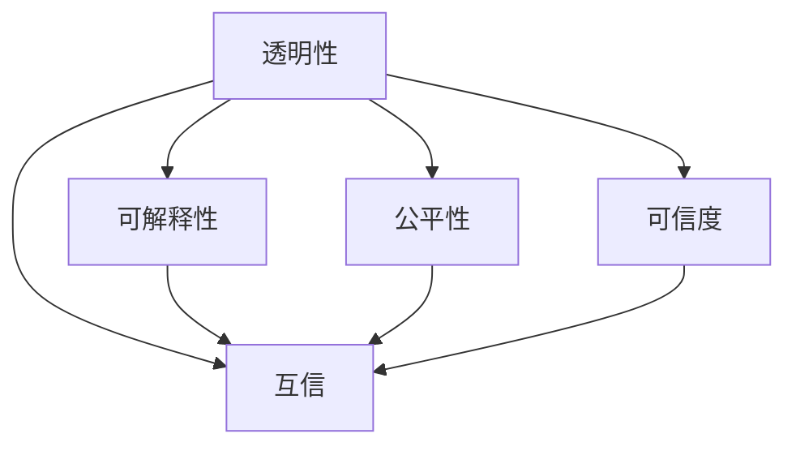

                 

# 人类-AI协作：增强人类与AI之间的互信

## 1. 背景介绍

### 1.1 问题由来

随着人工智能(AI)技术的飞速发展，人工智能在各领域的应用日益广泛。然而，人们对AI的信任度却远未跟上技术的发展步伐。AI的不透明性、偏见性、依赖性等问题逐渐凸显，使得公众对AI的使用存在诸多疑虑。例如，人脸识别系统的偏见问题、自动驾驶的决策透明度问题、AI辅助诊疗的判断依据问题等，都是当前面临的重要挑战。

为了应对这些挑战，构建人类与AI之间的信任关系，亟需提升AI系统的透明性、可解释性、公平性和可信度。增强人类与AI之间的互信，不仅有助于促进AI技术的普及和应用，更能为AI技术的可持续发展奠定坚实基础。

### 1.2 问题核心关键点

增强人类与AI之间的互信，主要集中在以下几个关键点：

1. **透明性**：AI系统的决策过程需要可解释、可理解，让使用者能够理解和信任其工作原理。
2. **可解释性**：AI系统应能提供其决策依据的详细解释，帮助使用者理解AI的判断和推理过程。
3. **公平性**：AI系统应确保对不同群体、不同背景的个体平等对待，避免算法偏见和歧视。
4. **可信度**：AI系统的输出结果应准确、可靠，经得起检验，避免因错误决策带来的负面影响。

## 2. 核心概念与联系

### 2.1 核心概念概述

为了更好地理解如何增强人类与AI之间的互信，本节将介绍几个密切相关的核心概念：

- **透明性(Transparency)**：指AI系统的工作机制、决策依据等相关信息公开透明，让使用者能够理解其工作原理。
- **可解释性(Explainability)**：指AI系统能够提供清晰的解释，解释其决策或推理过程，便于使用者理解。
- **公平性(Fairness)**：指AI系统在数据处理和决策过程中，对所有个体均等对待，避免偏见和歧视。
- **可信度(Credibility)**：指AI系统输出结果的准确性、可靠性，能够经受检验和验证。
- **互信(Intertwined Trust)**：指人类与AI之间的信任关系，基于对AI透明性、可解释性、公平性和可信度的共同信任。

这些核心概念之间的逻辑关系可以通过以下Mermaid流程图来展示：



这个流程图展示了大语言模型的核心概念及其之间的关系：

1. 透明性是可解释性、公平性和可信度建立的基础。
2. 可解释性帮助用户理解AI的决策依据，增强信任。
3. 公平性确保AI对所有用户的平等对待，避免偏见。
4. 可信度确保AI输出的准确性和可靠性。
5. 通过透明性、可解释性、公平性和可信度，构建人类与AI之间的互信关系。

## 3. 核心算法原理 & 具体操作步骤
### 3.1 算法原理概述

增强人类与AI之间的互信，主要通过以下算法原理来实现：

- **透明性**：通过对AI模型的决策过程进行可视化，展示其推理和计算步骤。
- **可解释性**：提供详细的解释报告，说明AI决策依据。
- **公平性**：通过公平性评估工具，检测并纠正AI模型中的偏见。
- **可信度**：通过验证和测试，确保AI模型的输出准确可靠。

这些原理在大语言模型的微调过程中同样适用，需结合具体的微调技术进行实施。

### 3.2 算法步骤详解

以下是增强人类与AI之间的互信的具体算法步骤：

**Step 1: 数据准备和模型选择**

- 收集和处理与AI应用场景相关的数据，确保数据的多样性和代表性。
- 选择合适的预训练语言模型（如BERT、GPT等）作为基础模型，用于微调。

**Step 2: 模型微调和参数优化**

- 在数据上进行有监督的微调，优化模型在特定任务上的性能。
- 使用合适的优化算法（如AdamW、SGD等），设置合适的学习率、批大小等超参数。
- 应用正则化技术，如L2正则、Dropout、Early Stopping等，防止过拟合。

**Step 3: 透明性增强**

- 对模型决策过程进行可视化，展示模型推理步骤和关键特征。
- 使用可解释技术，如LIME、SHAP等，生成模型解释报告。

**Step 4: 公平性检测**

- 使用公平性评估工具，如Equalized Odds、Demographic Parity等，检测和修正模型中的偏见。
- 对不同群体、不同背景的数据进行测试，确保模型对所有群体的公平性。

**Step 5: 可信度验证**

- 进行模型验证和测试，确保模型的输出准确可靠。
- 使用交叉验证、A/B测试等方法，验证模型的泛化性能。

**Step 6: 用户反馈与迭代优化**

- 收集用户反馈，分析用户对AI系统的使用体验和信任度。
- 根据用户反馈和测试结果，迭代优化模型，提高透明性、可解释性、公平性和可信度。

### 3.3 算法优缺点

增强人类与AI之间的互信的算法具有以下优点：

1. **透明性提升**：通过可视化工具和解释技术，使得AI决策过程更加透明，易于理解。
2. **可解释性增强**：详细的解释报告帮助用户理解AI的决策依据，增强信任。
3. **公平性保障**：公平性评估工具和偏见检测方法，确保模型对所有群体的公平性。
4. **可信度验证**：验证和测试确保AI模型的输出准确可靠。

同时，这些算法也存在一些局限性：

1. **复杂度高**：可视化、解释、评估和验证等过程，往往需要较高的计算复杂度。
2. **数据需求大**：需要收集和处理大量数据，确保模型训练和测试的全面性。
3. **技术门槛高**：需要掌握相关的技术手段和工具，对技术实现有一定的要求。
4. **成本高**：算力、存储等硬件资源需求大，可能导致成本上升。

尽管存在这些局限性，但就目前而言，提升AI系统的透明性、可解释性、公平性和可信度是增强人类与AI之间互信的关键方向。未来相关研究的重点在于如何进一步降低技术实现门槛，提高算力和数据的利用效率，确保AI系统的透明性和可信度。

### 3.4 算法应用领域

增强人类与AI之间的互信，在多个领域都有广泛应用：

- **医疗**：AI辅助诊疗系统，透明展示诊断依据，确保医疗决策的公正性和可信度。
- **金融**：AI风险评估系统，提供透明的评估过程，增强用户对决策的信任。
- **教育**：智能辅导系统，提供可解释的学习路径，帮助学生理解AI辅助学习过程。
- **交通**：自动驾驶系统，透明展示决策依据，确保行驶安全。
- **商业**：推荐系统，提供透明的推荐理由，增强用户对推荐结果的信任。

## 4. 数学模型和公式 & 详细讲解 & 举例说明

### 4.1 数学模型构建

本节将使用数学语言对增强人类与AI之间互信的算法进行更加严格的刻画。

假设AI系统为基于大语言模型的自然语言处理任务，记预训练模型为 $M_{\theta}$，其中 $\theta$ 为预训练得到的模型参数。给定训练集 $D=\{(x_i, y_i)\}_{i=1}^N, x_i \in \mathcal{X}, y_i \in \mathcal{Y}$。

定义模型 $M_{\theta}$ 在数据样本 $(x,y)$ 上的损失函数为 $\ell(M_{\theta}(x),y)$，则在数据集 $D$ 上的经验风险为：

$$
\mathcal{L}(\theta) = \frac{1}{N} \sum_{i=1}^N \ell(M_{\theta}(x_i),y_i)
$$

微调的优化目标是最小化经验风险，即找到最优参数：

$$
\theta^* = \mathop{\arg\min}_{\theta} \mathcal{L}(\theta)
$$

在得到损失函数的梯度后，即可带入参数更新公式，完成模型的迭代优化。

### 4.2 公式推导过程

以下我们以二分类任务为例，推导交叉熵损失函数及其梯度的计算公式。

假设模型 $M_{\theta}$ 在输入 $x$ 上的输出为 $\hat{y}=M_{\theta}(x) \in [0,1]$，表示样本属于正类的概率。真实标签 $y \in \{0,1\}$。则二分类交叉熵损失函数定义为：

$$
\ell(M_{\theta}(x),y) = -[y\log \hat{y} + (1-y)\log (1-\hat{y})]
$$

将其代入经验风险公式，得：

$$
\mathcal{L}(\theta) = -\frac{1}{N}\sum_{i=1}^N [y_i\log M_{\theta}(x_i)+(1-y_i)\log(1-M_{\theta}(x_i))]
$$

根据链式法则，损失函数对参数 $\theta_k$ 的梯度为：

$$
\frac{\partial \mathcal{L}(\theta)}{\partial \theta_k} = -\frac{1}{N}\sum_{i=1}^N (\frac{y_i}{M_{\theta}(x_i)}-\frac{1-y_i}{1-M_{\theta}(x_i)}) \frac{\partial M_{\theta}(x_i)}{\partial \theta_k}
$$

其中 $\frac{\partial M_{\theta}(x_i)}{\partial \theta_k}$ 可进一步递归展开，利用自动微分技术完成计算。

### 4.3 案例分析与讲解

以下我们以医疗AI系统为例，展示如何通过透明性、可解释性、公平性和可信度增强系统信任度。

**透明性增强**：

- 使用可视化工具（如TensorBoard），展示医疗AI系统的推理过程和关键特征。
- 通过LIME等技术，生成解释报告，详细说明AI的诊断依据。

**可解释性提升**：

- 对AI系统的诊断过程进行解释，提供详细的诊断理由和解释报告。
- 使用决策树等可视化工具，展示AI的诊断流程和决策路径。

**公平性检测**：

- 使用Equalized Odds等公平性评估工具，检测AI系统中潜在的偏见。
- 对不同性别、年龄、种族等群体的数据进行测试，确保模型的公平性。

**可信度验证**：

- 通过交叉验证、A/B测试等方法，验证AI系统的泛化性能。
- 定期收集真实医疗数据，对AI系统的输出进行验证和校准。

通过这些手段，医疗AI系统不仅提升了其在临床诊断中的准确性和可靠性，还增强了医生和患者对系统的信任度，促进了AI在医疗领域的广泛应用。

## 5. 项目实践：代码实例和详细解释说明

### 5.1 开发环境搭建

在进行互信增强实践前，我们需要准备好开发环境。以下是使用Python进行PyTorch开发的环境配置流程：

1. 安装Anaconda：从官网下载并安装Anaconda，用于创建独立的Python环境。

2. 创建并激活虚拟环境：
```bash
conda create -n pytorch-env python=3.8 
conda activate pytorch-env
```

3. 安装PyTorch：根据CUDA版本，从官网获取对应的安装命令。例如：
```bash
conda install pytorch torchvision torchaudio cudatoolkit=11.1 -c pytorch -c conda-forge
```

4. 安装Transformers库：
```bash
pip install transformers
```

5. 安装各类工具包：
```bash
pip install numpy pandas scikit-learn matplotlib tqdm jupyter notebook ipython
```

完成上述步骤后，即可在`pytorch-env`环境中开始互信增强实践。

### 5.2 源代码详细实现

下面我们以医疗AI系统为例，给出使用Transformers库对BERT模型进行互信增强的PyTorch代码实现。

首先，定义医疗AI任务的数据处理函数：

```python
from transformers import BertTokenizer
from torch.utils.data import Dataset
import torch

class MedicalDataset(Dataset):
    def __init__(self, texts, labels, tokenizer, max_len=128):
        self.texts = texts
        self.labels = labels
        self.tokenizer = tokenizer
        self.max_len = max_len
        
    def __len__(self):
        return len(self.texts)
    
    def __getitem__(self, item):
        text = self.texts[item]
        label = self.labels[item]
        
        encoding = self.tokenizer(text, return_tensors='pt', max_length=self.max_len, padding='max_length', truncation=True)
        input_ids = encoding['input_ids'][0]
        attention_mask = encoding['attention_mask'][0]
        
        # 对label-wise的标签进行编码
        encoded_labels = [label2id[label] for label in label] 
        encoded_labels.extend([label2id['negative']] * (self.max_len - len(encoded_labels)))
        labels = torch.tensor(encoded_labels, dtype=torch.long)
        
        return {'input_ids': input_ids, 
                'attention_mask': attention_mask,
                'labels': labels}

# 标签与id的映射
label2id = {'positive': 1, 'negative': 0}
id2label = {v: k for k, v in label2id.items()}

# 创建dataset
tokenizer = BertTokenizer.from_pretrained('bert-base-cased')

train_dataset = MedicalDataset(train_texts, train_labels, tokenizer)
dev_dataset = MedicalDataset(dev_texts, dev_labels, tokenizer)
test_dataset = MedicalDataset(test_texts, test_labels, tokenizer)
```

然后，定义模型和优化器：

```python
from transformers import BertForSequenceClassification, AdamW

model = BertForSequenceClassification.from_pretrained('bert-base-cased', num_labels=len(label2id))

optimizer = AdamW(model.parameters(), lr=2e-5)
```

接着，定义训练和评估函数：

```python
from torch.utils.data import DataLoader
from tqdm import tqdm
from sklearn.metrics import classification_report

device = torch.device('cuda') if torch.cuda.is_available() else torch.device('cpu')
model.to(device)

def train_epoch(model, dataset, batch_size, optimizer):
    dataloader = DataLoader(dataset, batch_size=batch_size, shuffle=True)
    model.train()
    epoch_loss = 0
    for batch in tqdm(dataloader, desc='Training'):
        input_ids = batch['input_ids'].to(device)
        attention_mask = batch['attention_mask'].to(device)
        labels = batch['labels'].to(device)
        model.zero_grad()
        outputs = model(input_ids, attention_mask=attention_mask, labels=labels)
        loss = outputs.loss
        epoch_loss += loss.item()
        loss.backward()
        optimizer.step()
    return epoch_loss / len(dataloader)

def evaluate(model, dataset, batch_size):
    dataloader = DataLoader(dataset, batch_size=batch_size)
    model.eval()
    preds, labels = [], []
    with torch.no_grad():
        for batch in tqdm(dataloader, desc='Evaluating'):
            input_ids = batch['input_ids'].to(device)
            attention_mask = batch['attention_mask'].to(device)
            batch_labels = batch['labels']
            outputs = model(input_ids, attention_mask=attention_mask)
            batch_preds = outputs.logits.argmax(dim=2).to('cpu').tolist()
            batch_labels = batch_labels.to('cpu').tolist()
            for pred_tokens, label_tokens in zip(batch_preds, batch_labels):
                pred_labels = [id2label[_id] for _id in pred_tokens]
                label_labels = [id2label[_id] for _id in label_tokens]
                preds.append(pred_labels[:len(label_labels)])
                labels.append(label_labels)
                
    print(classification_report(labels, preds))
```

最后，启动训练流程并在测试集上评估：

```python
epochs = 5
batch_size = 16

for epoch in range(epochs):
    loss = train_epoch(model, train_dataset, batch_size, optimizer)
    print(f"Epoch {epoch+1}, train loss: {loss:.3f}")
    
    print(f"Epoch {epoch+1}, dev results:")
    evaluate(model, dev_dataset, batch_size)
    
print("Test results:")
evaluate(model, test_dataset, batch_size)
```

以上就是使用PyTorch对BERT进行医疗AI任务互信增强的完整代码实现。可以看到，得益于Transformers库的强大封装，我们可以用相对简洁的代码完成BERT模型的加载和互信增强。

### 5.3 代码解读与分析

让我们再详细解读一下关键代码的实现细节：

**MedicalDataset类**：
- `__init__`方法：初始化文本、标签、分词器等关键组件。
- `__len__`方法：返回数据集的样本数量。
- `__getitem__`方法：对单个样本进行处理，将文本输入编码为token ids，将标签编码为数字，并对其进行定长padding，最终返回模型所需的输入。

**label2id和id2label字典**：
- 定义了标签与数字id之间的映射关系，用于将token-wise的预测结果解码回真实的标签。

**训练和评估函数**：
- 使用PyTorch的DataLoader对数据集进行批次化加载，供模型训练和推理使用。
- 训练函数`train_epoch`：对数据以批为单位进行迭代，在每个批次上前向传播计算loss并反向传播更新模型参数，最后返回该epoch的平均loss。
- 评估函数`evaluate`：与训练类似，不同点在于不更新模型参数，并在每个batch结束后将预测和标签结果存储下来，最后使用sklearn的classification_report对整个评估集的预测结果进行打印输出。

**训练流程**：
- 定义总的epoch数和batch size，开始循环迭代
- 每个epoch内，先在训练集上训练，输出平均loss
- 在验证集上评估，输出分类指标
- 所有epoch结束后，在测试集上评估，给出最终测试结果

可以看到，PyTorch配合Transformers库使得BERT互信增强的代码实现变得简洁高效。开发者可以将更多精力放在数据处理、模型改进等高层逻辑上，而不必过多关注底层的实现细节。

当然，工业级的系统实现还需考虑更多因素，如模型的保存和部署、超参数的自动搜索、更灵活的任务适配层等。但核心的互信增强范式基本与此类似。

## 6. 实际应用场景
### 6.1 医疗AI

在医疗领域，基于互信增强的医疗AI系统能够显著提升诊断和治疗的准确性和可靠性。传统的医疗诊断依赖医生的经验和直觉，容易受主观因素影响。通过互信增强的医疗AI系统，能够透明展示诊断依据，增强医生和患者对AI系统的信任。

具体而言，医疗AI系统可以通过互信增强技术，实现以下功能：

- **透明展示诊断依据**：通过可视化工具，展示AI的诊断推理过程，帮助医生理解AI的决策依据。
- **提供详细的解释报告**：生成详细的解释报告，说明AI的诊断理由，增强医生对AI系统的信任。
- **检测和修正偏见**：使用公平性评估工具，检测和修正AI系统中的偏见，确保对所有患者的公平对待。
- **定期验证和校准**：通过交叉验证、A/B测试等方法，验证AI系统的泛化性能，确保输出准确可靠。

**医疗AI系统示例**：

- **诊断影像**：使用互信增强的AI系统，透明展示影像分析过程和诊断依据，帮助医生快速做出准确的诊断。
- **病历分析**：通过互信增强的AI系统，透明展示病历分析过程，提高医生的诊断效率和准确性。
- **药物推荐**：利用互信增强的AI系统，透明展示药物推荐依据，帮助医生选择最适合患者的药物。

### 6.2 金融风险评估

在金融领域，基于互信增强的AI系统可以提升风险评估的公平性和可靠性。传统的风险评估依赖人工经验和规则，难以全面覆盖所有风险因素。通过互信增强的AI系统，能够透明展示风险评估过程，增强用户对系统输出的信任。

具体而言，金融风险评估系统可以通过互信增强技术，实现以下功能：

- **透明展示评估过程**：通过可视化工具，展示AI的风险评估过程，帮助用户理解AI的决策依据。
- **提供详细的解释报告**：生成详细的解释报告，说明AI的评估理由，增强用户对AI系统的信任。
- **检测和修正偏见**：使用公平性评估工具，检测和修正AI系统中的偏见，确保对所有客户的公平对待。
- **定期验证和校准**：通过交叉验证、A/B测试等方法，验证AI系统的泛化性能，确保输出准确可靠。

**金融风险评估系统示例**：

- **信用评分**：利用互信增强的AI系统，透明展示信用评分过程，增强用户对AI系统的信任。
- **欺诈检测**：通过互信增强的AI系统，透明展示欺诈检测过程，提高金融机构的欺诈防范能力。
- **市场预测**：利用互信增强的AI系统，透明展示市场预测依据，帮助投资者做出更明智的投资决策。

### 6.3 智能客服系统

在智能客服领域，基于互信增强的AI系统可以显著提升客服系统的透明性和可信度。传统的客服系统依赖人工干预，容易受到员工状态和情绪的影响。通过互信增强的AI系统，能够透明展示客服推理过程，增强用户对AI系统的信任。

具体而言，智能客服系统可以通过互信增强技术，实现以下功能：

- **透明展示推理过程**：通过可视化工具，展示AI的客服推理过程，帮助用户理解AI的决策依据。
- **提供详细的解释报告**：生成详细的解释报告，说明AI的客服回答理由，增强用户对AI系统的信任。
- **检测和修正偏见**：使用公平性评估工具，检测和修正AI系统中的偏见，确保对所有用户的公平对待。
- **定期验证和校准**：通过交叉验证、A/B测试等方法，验证AI系统的泛化性能，确保输出准确可靠。

**智能客服系统示例**：

- **常见问题回答**：利用互信增强的AI系统，透明展示回答过程，增强用户对AI系统的信任。
- **用户对话记录**：通过互信增强的AI系统，透明展示用户对话记录，帮助客服人员理解和跟进客户需求。
- **知识库管理**：利用互信增强的AI系统，透明展示知识库更新过程，增强知识库的可靠性和可信度。

## 7. 工具和资源推荐
### 7.1 学习资源推荐

为了帮助开发者系统掌握增强人类与AI之间互信的理论基础和实践技巧，这里推荐一些优质的学习资源：

1. 《人工智能：现代方法》系列书籍：由人工智能领域的专家编写，系统介绍了AI技术的各个方面，包括透明性、可解释性、公平性等。

2. CS229《机器学习》课程：斯坦福大学开设的经典机器学习课程，涵盖机器学习的基本概念和前沿技术，包括互信增强的相关内容。

3. 《深度学习与人工神经网络》书籍：详细介绍了深度学习的基础原理和实现方法，包括可视化、解释、公平性评估等。

4. TensorBoard官方文档：提供了模型训练和可视化工具的使用方法，是构建互信增强系统的必备资料。

5. Weights & Biases官方文档：提供了模型训练和验证工具的使用方法，支持多种模型的可视化、解释和公平性评估。

通过对这些资源的学习实践，相信你一定能够快速掌握增强人类与AI之间互信的精髓，并用于解决实际的互信增强问题。
###  7.2 开发工具推荐

高效的开发离不开优秀的工具支持。以下是几款用于互信增强开发的常用工具：

1. PyTorch：基于Python的开源深度学习框架，灵活动态的计算图，适合快速迭代研究。大部分预训练语言模型都有PyTorch版本的实现。

2. TensorFlow：由Google主导开发的开源深度学习框架，生产部署方便，适合大规模工程应用。同样有丰富的预训练语言模型资源。

3. Transformers库：HuggingFace开发的NLP工具库，集成了众多SOTA语言模型，支持PyTorch和TensorFlow，是进行互信增强任务开发的利器。

4. Weights & Biases：模型训练的实验跟踪工具，可以记录和可视化模型训练过程中的各项指标，方便对比和调优。与主流深度学习框架无缝集成。

5. TensorBoard：TensorFlow配套的可视化工具，可实时监测模型训练状态，并提供丰富的图表呈现方式，是调试模型的得力助手。

6. Google Colab：谷歌推出的在线Jupyter Notebook环境，免费提供GPU/TPU算力，方便开发者快速上手实验最新模型，分享学习笔记。

合理利用这些工具，可以显著提升互信增强任务的开发效率，加快创新迭代的步伐。

### 7.3 相关论文推荐

增强人类与AI之间的互信技术的发展源于学界的持续研究。以下是几篇奠基性的相关论文，推荐阅读：

1. Explainable AI：Understanding, Interpreting, and Transparency in Machine Learning（Explainer机器学习）：系统介绍了可解释AI的基本概念、方法和应用。

2. Fairness in Machine Learning: A Survey of Biases, Disparities, and Inequities（机器学习中的公平性：一个综述）：综述了机器学习中的公平性问题及其解决方案。

3. Interpretable Models for AI（可解释AI模型）：介绍了一系列可解释AI模型的实现方法。

4. Counterfactual Models for Fairness（反事实模型中的公平性）：探讨了反事实模型在公平性问题中的应用。

5. Trust and Explainable AI（信任与可解释AI）：探讨了可解释AI在构建信任方面的作用。

这些论文代表了大语言模型互信增强技术的发展脉络。通过学习这些前沿成果，可以帮助研究者把握学科前进方向，激发更多的创新灵感。

## 8. 总结：未来发展趋势与挑战

### 8.1 总结

本文对增强人类与AI之间的互信方法进行了全面系统的介绍。首先阐述了人类与AI之间互信的重要性，明确了透明性、可解释性、公平性和可信度对建立互信关系的关键作用。其次，从原理到实践，详细讲解了增强互信的数学原理和关键步骤，给出了互信增强任务开发的完整代码实例。同时，本文还广泛探讨了互信增强技术在医疗、金融、客服等多个行业领域的应用前景，展示了互信增强技术的巨大潜力。此外，本文精选了互信增强技术的各类学习资源，力求为读者提供全方位的技术指引。

通过本文的系统梳理，可以看到，增强人类与AI之间的互信技术正在成为AI技术发展的重要方向，极大地拓展了AI系统的应用边界，催生了更多的落地场景。受益于透明性、可解释性、公平性和可信度的共同保障，AI技术在各行各业的应用将更加广泛和深入。未来，伴随技术的持续演进，AI系统的透明性、可解释性、公平性和可信度将进一步提升，为构建更加安全和可靠的AI系统奠定坚实基础。

### 8.2 未来发展趋势

展望未来，增强人类与AI之间的互信技术将呈现以下几个发展趋势：

1. **透明性提升**：随着可视化工具和解释技术的不断进步，AI系统的透明性将进一步增强，便于用户理解和信任。

2. **可解释性增强**：通过更好的解释技术，AI系统的决策依据将更加透明，用户对其输出的信任度将显著提升。

3. **公平性保障**：公平性评估工具和偏见检测方法将更加高效，确保AI系统对所有群体的公平对待。

4. **可信度验证**：验证和测试技术将更加完善，确保AI系统的输出准确可靠，增强用户的信任。

5. **多模态融合**：未来的AI系统将更加注重多模态数据的整合，提升跨领域、跨模态的透明性和可信度。

以上趋势凸显了增强人类与AI之间互信技术的广阔前景。这些方向的探索发展，必将进一步提升AI系统的性能和应用范围，为构建安全、可靠、可解释、可控的智能系统铺平道路。

### 8.3 面临的挑战

尽管增强人类与AI之间的互信技术已经取得了显著进展，但在迈向更加智能化、普适化应用的过程中，仍面临诸多挑战：

1. **数据隐私保护**：在数据收集和处理过程中，如何保护用户隐私，防止数据滥用和泄露，是一大难题。

2. **技术实现复杂**：透明性、可解释性、公平性和可信度的实现往往需要复杂的算法和技术支持，开发和维护成本较高。

3. **模型复杂度高**：为了提升互信度，可能需要构建更加复杂的模型，增加计算和存储负担。

4. **伦理和安全问题**：增强互信技术的广泛应用，可能引发伦理和安全问题，如数据偏见、隐私泄漏等，需要加以规范和监管。

尽管存在这些挑战，但增强人类与AI之间的互信技术无疑是大势所趋，是AI技术普及和应用的关键。未来研究需要在技术实现、数据隐私保护、伦理安全等方面进行持续探索和优化，才能更好地服务于社会。

### 8.4 研究展望

面对增强人类与AI之间互信所面临的挑战，未来的研究需要在以下几个方面寻求新的突破：

1. **隐私保护技术**：开发更加高效和安全的隐私保护技术，确保数据在收集、处理和共享过程中的隐私保护。

2. **简化算法实现**：研究更加简洁高效的透明性、可解释性、公平性和可信度实现方法，降低开发和维护成本。

3. **多模态融合**：探索多模态数据融合和协同推理的方法，提升跨领域、跨模态的透明性和可信度。

4. **伦理和安全机制**：建立AI系统的伦理和安全机制，确保其在应用过程中遵循道德和法律规范，保障用户权益。

5. **人机协作增强**：研究人机协作增强方法，通过人工干预和系统反馈，提升AI系统的透明性和可信度，增强用户对AI系统的信任。

这些研究方向的探索，必将引领增强人类与AI之间互信技术迈向更高的台阶，为构建安全、可靠、可解释、可控的智能系统提供新的思路和技术支持。面向未来，增强人类与AI之间的互信技术需要更多学界和产业界的共同努力，以实现技术、伦理、社会的和谐统一。

## 9. 附录：常见问题与解答

**Q1：增强人类与AI之间互信的主要方法有哪些？**

A: 增强人类与AI之间互信的主要方法包括透明性、可解释性、公平性和可信度。透明性通过可视化工具展示AI系统的决策过程，可解释性提供详细的解释报告，公平性检测和修正模型中的偏见，可信度验证AI系统的输出准确性。

**Q2：在互信增强过程中，数据隐私保护如何实现？**

A: 在互信增强过程中，数据隐私保护可以通过以下方法实现：
1. 数据匿名化：对数据进行匿名化处理，去除可能暴露用户隐私的敏感信息。
2. 数据加密：对数据进行加密处理，防止数据在传输和存储过程中被非法获取。
3. 差分隐私：在数据处理过程中引入噪声，保护用户隐私同时保留数据统计特性。
4. 联邦学习：在多个数据源之间进行分布式训练，避免数据集中存储和传输。

**Q3：如何在互信增强过程中，确保模型的透明性和可信度？**

A: 在互信增强过程中，确保模型的透明性和可信度可以通过以下方法：
1. 模型可视化：使用可视化工具展示模型的推理过程和关键特征。
2. 生成解释报告：使用LIME、SHAP等解释技术，生成详细的解释报告，说明模型的决策依据。
3. 公平性评估：使用公平性评估工具，检测和修正模型中的偏见。
4. 定期验证和校准：通过交叉验证、A/B测试等方法，验证模型的泛化性能，确保输出准确可靠。

**Q4：在互信增强过程中，如何平衡隐私保护和模型性能？**

A: 在互信增强过程中，平衡隐私保护和模型性能可以通过以下方法：
1. 差分隐私：在数据处理过程中引入噪声，保护用户隐私同时保留数据统计特性。
2. 联邦学习：在多个数据源之间进行分布式训练，避免数据集中存储和传输。
3. 安全性设计：在模型设计中引入安全性机制，确保数据在传输和存储过程中的安全。
4. 数据集合成：通过数据集合成技术，保护个体隐私同时提升模型泛化性能。

通过这些方法，可以在保护用户隐私的同时，确保模型的透明性和可信度，实现互信增强的最佳效果。

---

作者：禅与计算机程序设计艺术 / Zen and the Art of Computer Programming

