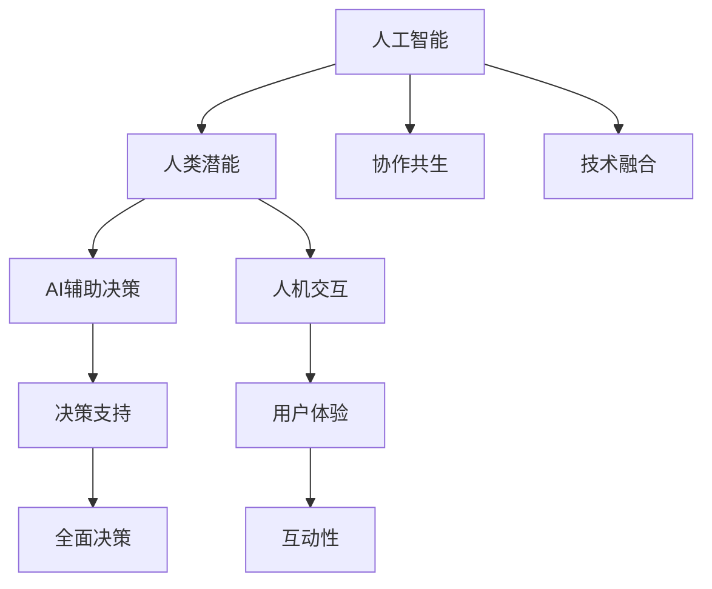

                 

# 人类-AI协作：增强人类潜能与AI能力的融合发展

> 关键词：人类潜能,人工智能,协作共生,技术融合,AI辅助决策,人机交互,智能增强

## 1. 背景介绍

### 1.1 问题由来
随着人工智能(AI)技术的飞速发展，AI在多个领域已展现出前所未有的潜能，从医疗、教育、金融到制造、交通，AI正以一种悄无声息的方式，悄然改变着人类的生产生活方式。然而，尽管AI在技术上取得了突破，但如何更好地融合AI与人类潜能，充分发挥两者优势，仍是一个亟待解决的问题。

### 1.2 问题核心关键点
当前，AI与人类的协作关系主要体现在以下几个方面：

1. **AI辅助决策**：通过数据分析和模式识别，AI在医疗、金融等高风险领域，为人类提供辅助决策支持。
2. **人机交互优化**：AI通过自然语言处理、计算机视觉等技术，提升人机交互的流畅性和效率。
3. **智能增强**：AI为人类提供了强大的工具，如自动化、智能推荐、智能搜索等，极大地增强了人类的工作和生活质量。
4. **协同创新**：AI与人类的协作不仅局限于单一任务，而是通过跨领域的融合创新，推动技术进步和社会发展。

### 1.3 问题研究意义
研究人类-AI协作关系，对于推动人工智能技术的普惠应用，构建人机协同的未来社会，具有重要意义：

1. **提高生产效率**：AI能够处理大量重复性、高强度的工作，释放人类潜能，投入到更有创造性的活动中。
2. **提升决策质量**：AI凭借其强大的数据分析能力，辅助人类做出更为精准的决策，降低错误率。
3. **促进教育公平**：AI可以个性化地为学生提供教学支持，帮助学习者实现精准化、差异化的学习。
4. **增强社会福祉**：AI在医疗、环保、公共安全等领域的应用，可以提升社会的整体福祉。
5. **推动产业升级**：AI与各行业的深度融合，带来技术创新，提升生产效率，促进产业转型升级。

## 2. 核心概念与联系

### 2.1 核心概念概述

为更好地理解人类-AI协作的原理，本节将介绍几个核心概念：

- **人工智能(Artificial Intelligence, AI)**：指通过计算机技术实现的一种具有智能特性的技术系统，能够在某种程度上模拟人类的思维和行为。
- **人类潜能(Human Potential)**：指人类内在的认知、情感、道德、创新等能力，是推动社会进步和人类发展的基石。
- **协作共生(Co-Creation and Co-Existence)**：指AI与人类在多个层面的深度合作，共同创造价值、共存共赢。
- **技术融合(Technology Integration)**：指不同技术之间的整合和协同，通过技术融合，实现整体效能的提升。
- **AI辅助决策(AI-Assisted Decision Making)**：指AI在决策过程中提供辅助支持，帮助人类进行更为全面和准确的决策。
- **人机交互(Human-Machine Interaction, HMI)**：指人类与AI系统之间的信息交换和交互过程，强调互动性和用户体验。

这些核心概念之间通过协作共生和技术融合，形成了良性互动的生态系统，共同推动了AI与人类潜能的融合发展。

### 2.2 核心概念原理和架构的 Mermaid 流程图(Mermaid 流程节点中不要有括号、逗号等特殊字符)


这个流程图展示了人类潜能、人工智能、协作共生、技术融合等核心概念的相互关系和互动方式。

## 3. 核心算法原理 & 具体操作步骤
### 3.1 算法原理概述

人类-AI协作的算法原理，主要基于以下几个方面：

1. **数据驱动的决策支持**：AI通过大量数据的学习，能够提供更全面、准确的决策依据，辅助人类做出更为精准的决策。
2. **智能增强工具**：AI通过自然语言处理、计算机视觉等技术，为人类提供高效的智能工具，提升工作效率和生活质量。
3. **个性化交互**：通过用户行为数据的分析，AI能够实现个性化的交互体验，提高用户满意度。
4. **协同创新**：AI通过跨领域的整合，推动技术的创新和应用，提升社会的整体福祉。

### 3.2 算法步骤详解

人类-AI协作的算法步骤一般包括以下几个关键步骤：

**Step 1: 数据准备**
- 收集和清洗数据，确保数据质量和多样性。
- 选择适当的特征和指标，确保数据代表性。
- 数据预处理，包括数据清洗、归一化、特征工程等。

**Step 2: 模型训练与选择**
- 根据任务需求，选择合适的AI模型和算法，如决策树、神经网络、深度学习等。
- 训练模型，优化模型参数，确保模型的泛化能力和性能。
- 模型评估，通过交叉验证、测试集评估等方式，选择最优模型。

**Step 3: 用户交互设计**
- 设计用户界面，确保人机交互的直观性和易用性。
- 实现智能辅助功能，如智能问答、个性化推荐等。
- 优化用户体验，通过用户反馈不断改进系统。

**Step 4: 系统集成与部署**
- 将训练好的模型和用户界面集成到实际应用系统中。
- 部署系统，确保系统的稳定性和可靠性。
- 持续监测和优化系统，提升系统的性能和用户体验。

### 3.3 算法优缺点

人类-AI协作的算法具有以下优点：

1. **决策精准性**：AI的强大数据分析能力，能够提供更为全面和准确的决策支持。
2. **效率提升**：AI自动化处理大量重复性、高强度工作，释放人类潜能。
3. **个性化服务**：AI能够根据用户行为数据，提供个性化的服务和推荐。
4. **创新驱动**：AI与人类的协作，能够推动跨领域的整合创新，带来技术进步和社会发展。

同时，该算法也存在以下局限：

1. **数据隐私问题**：收集和处理用户数据时，需要严格遵守隐私保护法规。
2. **算法偏见**：AI模型的训练数据和算法设计可能引入偏见，需要持续监控和调整。
3. **系统鲁棒性**：AI系统在面对异常情况时，可能出现不稳定或错误。
4. **人机信任问题**：用户对AI系统的信任度不足，可能影响系统效果。

### 3.4 算法应用领域

人类-AI协作的算法在多个领域得到了广泛应用，例如：

- **医疗健康**：AI辅助诊断、治疗方案推荐、医疗数据分析等。
- **金融服务**：风险评估、投资决策、欺诈检测等。
- **教育培训**：个性化学习、智能辅导、作业批改等。
- **制造业**：智能生产、质量控制、设备维护等。
- **物流配送**：路径规划、库存管理、配送优化等。
- **城市管理**：智能交通、公共安全、环境监测等。

## 4. 数学模型和公式 & 详细讲解  
### 4.1 数学模型构建

假设某决策问题可以通过二分类模型来解决，即判断输入数据 $x$ 是否属于某一类别 $y$，其中 $y \in \{0,1\}$。

设决策函数为 $f(x)=\sigma(w\cdot x+b)$，其中 $\sigma$ 为激活函数，$w$ 为模型参数，$b$ 为偏置项。

模型在训练集 $D=\{(x_i,y_i)\}_{i=1}^N$ 上的损失函数为交叉熵损失：

$$
\mathcal{L}(w,b) = -\frac{1}{N}\sum_{i=1}^N y_i\log f(x_i)+(1-y_i)\log(1-f(x_i))
$$

模型的优化目标是最小化损失函数：

$$
\mathop{\min}_{w,b} \mathcal{L}(w,b)
$$

通过梯度下降等优化算法，不断更新模型参数 $w$ 和 $b$，使得模型在测试集上取得最优性能。

### 4.2 公式推导过程

以决策树为例，推导其构建过程。

设训练集为 $D=\{(x_i,y_i)\}_{i=1}^N$，其中 $x_i \in \mathcal{X}$，$y_i \in \{0,1\}$。决策树的构建过程如下：

1. 选择一个最佳特征 $X_k$ 进行划分。
2. 计算每个子节点的信息增益。
3. 选择信息增益最大的特征 $X_k$，将其作为节点。
4. 递归对子节点进行划分，直至满足终止条件。

信息增益的计算公式为：

$$
\text{IG}(D) = \sum_{k=1}^m p_k\text{IG}(D|X_k)
$$

其中 $p_k$ 为特征 $X_k$ 的概率，$D|X_k$ 为条件集，$p(x_k|y_i)$ 为条件概率。

### 4.3 案例分析与讲解

以医疗领域的疾病诊断为例，分析AI与人类的协作关系。

假设某医疗系统通过AI模型，对患者的症状和病史进行分析，辅助医生进行疾病诊断。具体步骤如下：

1. **数据准备**：收集患者症状、病史、检查结果等数据，进行预处理。
2. **模型训练**：选择适当的AI模型（如决策树、神经网络），训练模型。
3. **用户交互**：设计医生界面，提供AI诊断建议。
4. **系统集成**：将AI模型和医生界面集成到实际医疗系统中。
5. **持续优化**：根据医生反馈，不断优化AI模型，提升诊断准确率。

## 5. 项目实践：代码实例和详细解释说明
### 5.1 开发环境搭建

在进行人类-AI协作实践前，我们需要准备好开发环境。以下是使用Python进行项目开发的环境配置流程：

1. 安装Anaconda：从官网下载并安装Anaconda，用于创建独立的Python环境。

2. 创建并激活虚拟环境：
```bash
conda create -n project-env python=3.8 
conda activate project-env
```

3. 安装所需的Python包和依赖：
```bash
pip install numpy pandas scikit-learn torch transformers
```

完成上述步骤后，即可在`project-env`环境中开始项目开发。

### 5.2 源代码详细实现

这里我们以医疗领域的疾病诊断为例，给出使用Transformers库对模型进行训练和推理的PyTorch代码实现。

首先，定义数据预处理函数：

```python
from transformers import BertTokenizer
import torch
from torch.utils.data import Dataset

class MedicalDataset(Dataset):
    def __init__(self, texts, labels):
        self.texts = texts
        self.labels = labels
        self.tokenizer = BertTokenizer.from_pretrained('bert-base-cased')
        
    def __len__(self):
        return len(self.texts)
    
    def __getitem__(self, item):
        text = self.texts[item]
        label = self.labels[item]
        
        encoding = self.tokenizer(text, return_tensors='pt', max_length=128, padding='max_length', truncation=True)
        input_ids = encoding['input_ids'][0]
        attention_mask = encoding['attention_mask'][0]
        
        # 对标签进行编码
        label = torch.tensor([label], dtype=torch.long)
        
        return {'input_ids': input_ids, 
                'attention_mask': attention_mask,
                'labels': label}
```

然后，定义模型和优化器：

```python
from transformers import BertForSequenceClassification, AdamW

model = BertForSequenceClassification.from_pretrained('bert-base-cased', num_labels=2)

optimizer = AdamW(model.parameters(), lr=2e-5)
```

接着，定义训练和评估函数：

```python
from torch.utils.data import DataLoader
from tqdm import tqdm
from sklearn.metrics import classification_report

device = torch.device('cuda') if torch.cuda.is_available() else torch.device('cpu')
model.to(device)

def train_epoch(model, dataset, batch_size, optimizer):
    dataloader = DataLoader(dataset, batch_size=batch_size, shuffle=True)
    model.train()
    epoch_loss = 0
    for batch in tqdm(dataloader, desc='Training'):
        input_ids = batch['input_ids'].to(device)
        attention_mask = batch['attention_mask'].to(device)
        labels = batch['labels'].to(device)
        model.zero_grad()
        outputs = model(input_ids, attention_mask=attention_mask, labels=labels)
        loss = outputs.loss
        epoch_loss += loss.item()
        loss.backward()
        optimizer.step()
    return epoch_loss / len(dataloader)

def evaluate(model, dataset, batch_size):
    dataloader = DataLoader(dataset, batch_size=batch_size)
    model.eval()
    preds, labels = [], []
    with torch.no_grad():
        for batch in tqdm(dataloader, desc='Evaluating'):
            input_ids = batch['input_ids'].to(device)
            attention_mask = batch['attention_mask'].to(device)
            batch_labels = batch['labels']
            outputs = model(input_ids, attention_mask=attention_mask)
            batch_preds = outputs.logits.argmax(dim=1).to('cpu').tolist()
            batch_labels = batch_labels.to('cpu').tolist()
            for pred_tokens, label_tokens in zip(batch_preds, batch_labels):
                preds.append(pred_tokens)
                labels.append(label_tokens)
                
    print(classification_report(labels, preds))
```

最后，启动训练流程并在测试集上评估：

```python
epochs = 5
batch_size = 16

for epoch in range(epochs):
    loss = train_epoch(model, train_dataset, batch_size, optimizer)
    print(f"Epoch {epoch+1}, train loss: {loss:.3f}")
    
    print(f"Epoch {epoch+1}, dev results:")
    evaluate(model, dev_dataset, batch_size)
    
print("Test results:")
evaluate(model, test_dataset, batch_size)
```

以上就是使用PyTorch对医疗疾病诊断任务进行人类-AI协作微调的完整代码实现。可以看到，通过Transformers库，我们可以用相对简洁的代码完成模型的训练和推理。

### 5.3 代码解读与分析

让我们再详细解读一下关键代码的实现细节：

**MedicalDataset类**：
- `__init__`方法：初始化文本和标签，并创建BERT分词器。
- `__len__`方法：返回数据集的样本数量。
- `__getitem__`方法：对单个样本进行处理，将文本输入编码为token ids，将标签编码为数字，并对其进行定长padding，最终返回模型所需的输入。

**模型和优化器定义**：
- 使用BERT模型作为决策函数。
- 选择AdamW优化器，并设置学习率。

**训练和评估函数**：
- 使用PyTorch的DataLoader对数据集进行批次化加载，供模型训练和推理使用。
- 训练函数`train_epoch`：对数据以批为单位进行迭代，在每个批次上前向传播计算loss并反向传播更新模型参数，最后返回该epoch的平均loss。
- 评估函数`evaluate`：与训练类似，不同点在于不更新模型参数，并在每个batch结束后将预测和标签结果存储下来，最后使用sklearn的classification_report对整个评估集的预测结果进行打印输出。

**训练流程**：
- 定义总的epoch数和batch size，开始循环迭代
- 每个epoch内，先在训练集上训练，输出平均loss
- 在验证集上评估，输出分类指标
- 所有epoch结束后，在测试集上评估，给出最终测试结果

可以看到，PyTorch配合Transformers库使得疾病诊断任务的模型训练和推理变得简洁高效。开发者可以将更多精力放在数据处理、模型改进等高层逻辑上，而不必过多关注底层的实现细节。

当然，工业级的系统实现还需考虑更多因素，如模型的保存和部署、超参数的自动搜索、更灵活的任务适配层等。但核心的协作范式基本与此类似。

## 6. 实际应用场景
### 6.1 智能客服系统

基于人类-AI协作的对话技术，可以广泛应用于智能客服系统的构建。传统客服往往需要配备大量人力，高峰期响应缓慢，且一致性和专业性难以保证。通过使用协作共生的对话模型，智能客服系统能够7x24小时不间断服务，快速响应客户咨询，用自然流畅的语言解答各类常见问题。

在技术实现上，可以收集企业内部的历史客服对话记录，将问题和最佳答复构建成监督数据，在此基础上对预训练对话模型进行微调。协作共生的对话模型能够自动理解用户意图，匹配最合适的答案模板进行回复。对于客户提出的新问题，还可以接入检索系统实时搜索相关内容，动态组织生成回答。如此构建的智能客服系统，能大幅提升客户咨询体验和问题解决效率。

### 6.2 金融舆情监测

金融机构需要实时监测市场舆论动向，以便及时应对负面信息传播，规避金融风险。传统的人工监测方式成本高、效率低，难以应对网络时代海量信息爆发的挑战。通过人类-AI协作的情感分析技术，金融舆情监测系统能够实时监测不同主题下的情感变化趋势，一旦发现负面信息激增等异常情况，系统便会自动预警，帮助金融机构快速应对潜在风险。

### 6.3 个性化推荐系统

当前的推荐系统往往只依赖用户的历史行为数据进行物品推荐，无法深入理解用户的真实兴趣偏好。通过协作共生的个性化推荐模型，推荐系统可以更好地挖掘用户行为背后的语义信息，从而提供更精准、多样的推荐内容。

在实践中，可以收集用户浏览、点击、评论、分享等行为数据，提取和用户交互的物品标题、描述、标签等文本内容。将文本内容作为模型输入，用户的后续行为（如是否点击、购买等）作为监督信号，在此基础上微调预训练语言模型。协作共生的推荐模型能够从文本内容中准确把握用户的兴趣点。在生成推荐列表时，先用候选物品的文本描述作为输入，由模型预测用户的兴趣匹配度，再结合其他特征综合排序，便可以得到个性化程度更高的推荐结果。

### 6.4 未来应用展望

随着人类-AI协作技术的不断发展，基于协作共生的AI系统将在更多领域得到应用，为传统行业带来变革性影响。

在智慧医疗领域，基于协作共生的医疗问答、病历分析、药物研发等应用将提升医疗服务的智能化水平，辅助医生诊疗，加速新药开发进程。

在智能教育领域，协作共生的智能辅导、个性化推荐、作业批改等技术，将因材施教，促进教育公平，提高教学质量。

在智慧城市治理中，协作共生的城市事件监测、舆情分析、应急指挥等环节，将提高城市管理的自动化和智能化水平，构建更安全、高效的未来城市。

此外，在企业生产、社会治理、文娱传媒等众多领域，基于协作共生的AI应用也将不断涌现，为NLP技术带来了全新的突破。相信随着预训练语言模型和协作共生方法的不断演进，协作共生技术必将在构建人机协同的智能时代中扮演越来越重要的角色。

## 7. 工具和资源推荐
### 7.1 学习资源推荐

为了帮助开发者系统掌握人类-AI协作的理论基础和实践技巧，这里推荐一些优质的学习资源：

1. 《人工智能导论》（第二版）：入门级AI教材，从基础到进阶，系统介绍AI技术。
2. 《深度学习》（第二版）：由深度学习领域知名专家Yoshua Bengio、Ian Goodfellow、Aaron Courville合著，涵盖深度学习的各个方面。
3. 《Python机器学习》：通过Python代码实现机器学习算法，适合动手实践学习。
4. 《强化学习》：介绍强化学习的基本概念和算法，包括Q-learning、Deep Q-Network等。
5. 《自然语言处理综论》：全面介绍NLP的基本理论和应用，涵盖文本分类、信息检索、语言生成等任务。
6. 《TensorFlow实战Google深度学习框架》：实战型TensorFlow教程，适合动手练习。

通过对这些资源的学习实践，相信你一定能够快速掌握人类-AI协作的精髓，并用于解决实际的AI问题。

### 7.2 开发工具推荐

高效的开发离不开优秀的工具支持。以下是几款用于人类-AI协作开发的常用工具：

1. PyTorch：基于Python的开源深度学习框架，灵活动态的计算图，适合快速迭代研究。
2. TensorFlow：由Google主导开发的开源深度学习框架，生产部署方便，适合大规模工程应用。
3. Transformers库：HuggingFace开发的NLP工具库，集成了众多SOTA语言模型，支持PyTorch和TensorFlow，是进行协作共生任务开发的利器。
4. Weights & Biases：模型训练的实验跟踪工具，可以记录和可视化模型训练过程中的各项指标，方便对比和调优。
5. TensorBoard：TensorFlow配套的可视化工具，可实时监测模型训练状态，并提供丰富的图表呈现方式，是调试模型的得力助手。

合理利用这些工具，可以显著提升人类-AI协作任务的开发效率，加快创新迭代的步伐。

### 7.3 相关论文推荐

人类-AI协作的研究源于学界的持续研究。以下是几篇奠基性的相关论文，推荐阅读：

1. "Collaborative Filtering Techniques"：介绍了协同过滤的基本原理和算法，为推荐系统奠定了基础。
2. "Adaptive Computation of Maximum-k-Valued Records in an MBR Database"：提出了一种高效的协同过滤算法，适用于个性化推荐系统。
3. "Deep Reinforcement Learning for Personalized TV Program Recommendations"：使用深度强化学习技术，提升个性化推荐系统的效果。
4. "The Importance of Contextual Clues for Recommendation Systems"：分析了上下文信息对推荐系统性能的影响，提出基于上下文的推荐方法。
5. "Contextual Bandit Algorithms for Adesian Recommendations"：介绍上下文推荐算法，适用于个性化推荐系统。
6. "Deep Collaborative Filtering and Learning over Implicit Feedback"：提出基于深度学习的推荐系统，利用隐式反馈进行训练。

这些论文代表了大语言模型协作共生技术的发展脉络。通过学习这些前沿成果，可以帮助研究者把握学科前进方向，激发更多的创新灵感。

## 8. 总结：未来发展趋势与挑战

### 8.1 总结

本文对人类-AI协作关系进行了全面系统的介绍。首先阐述了人类潜能、人工智能、协作共生、技术融合等核心概念及其相互关系。其次，从原理到实践，详细讲解了人类-AI协作的数学模型和关键步骤，给出了协作共生任务开发的完整代码实例。同时，本文还广泛探讨了协作共生技术在多个行业领域的应用前景，展示了协作共生的巨大潜力。此外，本文精选了协作共生技术的各类学习资源，力求为读者提供全方位的技术指引。

通过本文的系统梳理，可以看到，基于人类-AI协作的关系，AI技术与人类潜能的融合，正在形成一种新的共生生态系统，推动了AI技术在各行各业的广泛应用。未来，随着技术的不断演进和优化，人类-AI协作将成为构建智能社会的重要范式，为人类的生产生活方式带来深远影响。

### 8.2 未来发展趋势

展望未来，人类-AI协作技术将呈现以下几个发展趋势：

1. **深度融合**：AI与人类潜能的深度融合将进一步推动技术进步和社会发展，实现人机协同的智能化应用。
2. **个性化服务**：基于协作共生的AI系统将实现更加精准、个性化的服务，提升用户体验。
3. **创新驱动**：协作共生的技术创新将带来新的商业模式和应用场景，推动经济社会发展。
4. **伦理安全**：协作共生的AI系统需要注重伦理安全，保障用户隐私，避免恶意用途。
5. **人机共存**：未来人机关系将从简单的交互转向共存，AI将在更多领域与人类共生共赢。

这些趋势凸显了协作共生技术的广阔前景。这些方向的探索发展，必将进一步提升人类-AI协作的效果，推动AI技术向更高的台阶迈进。

### 8.3 面临的挑战

尽管人类-AI协作技术已经取得了瞩目成就，但在迈向更加智能化、普适化应用的过程中，它仍面临着诸多挑战：

1. **数据隐私问题**：收集和处理用户数据时，需要严格遵守隐私保护法规。
2. **算法偏见**：AI模型的训练数据和算法设计可能引入偏见，需要持续监控和调整。
3. **系统鲁棒性**：AI系统在面对异常情况时，可能出现不稳定或错误。
4. **人机信任问题**：用户对AI系统的信任度不足，可能影响系统效果。
5. **知识整合能力不足**：现有的协作共生模型往往局限于任务内数据，难以灵活吸收和运用更广泛的先验知识。

正视协作共生面临的这些挑战，积极应对并寻求突破，将是人机协作技术走向成熟的必由之路。相信随着学界和产业界的共同努力，这些挑战终将一一被克服，协作共生技术必将在构建智能社会中发挥越来越重要的作用。

### 8.4 研究展望

面对协作共生技术所面临的种种挑战，未来的研究需要在以下几个方面寻求新的突破：

1. **探索无监督和半监督协作共生方法**：摆脱对大规模标注数据的依赖，利用自监督学习、主动学习等无监督和半监督范式，最大限度利用非结构化数据，实现更加灵活高效的协作共生。
2. **研究参数高效和计算高效的协作共生范式**：开发更加参数高效的协作共生方法，在固定大部分预训练参数的同时，只更新极少量的任务相关参数。同时优化协作共生模型的计算图，减少前向传播和反向传播的资源消耗，实现更加轻量级、实时性的部署。
3. **融合因果和对比学习范式**：通过引入因果推断和对比学习思想，增强协作共生模型建立稳定因果关系的能力，学习更加普适、鲁棒的语言表征，从而提升模型泛化性和抗干扰能力。
4. **引入更多先验知识**：将符号化的先验知识，如知识图谱、逻辑规则等，与神经网络模型进行巧妙融合，引导协作共生过程学习更准确、合理的语言模型。同时加强不同模态数据的整合，实现视觉、语音等多模态信息与文本信息的协同建模。
5. **结合因果分析和博弈论工具**：将因果分析方法引入协作共生模型，识别出模型决策的关键特征，增强输出解释的因果性和逻辑性。借助博弈论工具刻画人机交互过程，主动探索并规避模型的脆弱点，提高系统稳定性。
6. **纳入伦理道德约束**：在协作共生模型的训练目标中引入伦理导向的评估指标，过滤和惩罚有偏见、有害的输出倾向。同时加强人工干预和审核，建立模型行为的监管机制，确保输出符合人类价值观和伦理道德。

这些研究方向的探索，必将引领协作共生技术迈向更高的台阶，为构建安全、可靠、可解释、可控的智能系统铺平道路。面向未来，协作共生技术还需要与其他人工智能技术进行更深入的融合，如知识表示、因果推理、强化学习等，多路径协同发力，共同推动自然语言理解和智能交互系统的进步。只有勇于创新、敢于突破，才能不断拓展协作共生技术的边界，让智能技术更好地造福人类社会。

## 9. 附录：常见问题与解答

**Q1：人类-AI协作是否适用于所有NLP任务？**

A: 人类-AI协作在大多数NLP任务上都能取得不错的效果，特别是对于数据量较小的任务。但对于一些特定领域的任务，如医学、法律等，仅仅依靠通用语料预训练的模型可能难以很好地适应。此时需要在特定领域语料上进一步预训练，再进行协作共生，才能获得理想效果。此外，对于一些需要时效性、个性化很强的任务，如对话、推荐等，协作共生方法也需要针对性的改进优化。

**Q2：协作共生过程中如何选择合适的模型和算法？**

A: 选择合适的模型和算法，需要考虑以下几个因素：
1. 任务的复杂度：复杂任务可能需要更强大的模型和算法。
2. 数据量和质量：数据量较大且质量较高的任务，可以使用更复杂的模型。
3. 实时性和资源限制：资源受限的任务，需要选择轻量级模型和算法。
4. 任务的特殊需求：如对解释性和鲁棒性的要求等。

通常，在数据集较小的情况下，可以采用预训练模型进行微调，如BERT、GPT等。在数据集较大且质量较高的情况下，可以直接使用大规模预训练模型进行协作共生。对于实时性要求高的任务，如对话系统，可以选择基于Transformer架构的轻量级模型。

**Q3：协作共生过程中如何缓解数据隐私问题？**

A: 缓解数据隐私问题，需要采取以下措施：
1. 数据匿名化：通过数据匿名化技术，保护用户隐私。
2. 差分隐私：在数据收集和处理过程中，采用差分隐私技术，防止数据泄露。
3. 数据去标识化：对数据进行去标识化处理，保护用户身份信息。
4. 用户授权：在数据收集和使用过程中，明确告知用户并征得其同意。
5. 安全存储：采用安全的数据存储技术，防止数据泄露。

通过这些措施，可以最大程度保护用户隐私，确保协作共生过程中数据的安全性。

**Q4：协作共生过程中如何处理算法偏见问题？**

A: 处理算法偏见问题，需要采取以下措施：
1. 数据多样性：确保训练数据的多样性和代表性，避免数据偏见。
2. 算法透明：选择透明、可解释性强的算法，便于监控和调整。
3. 定期检查：定期检查模型性能，及时发现和纠正偏见。
4. 引入先验知识：在模型中加入先验知识，如领域知识、伦理道德等，引导模型学习。
5. 多模型集成：通过多模型集成，降低单个模型的偏见风险。

这些措施可以帮助减少协作共生模型中的算法偏见，确保模型在各种场景下公平、公正地工作。

**Q5：协作共生过程中如何提高系统鲁棒性？**

A: 提高系统鲁棒性，需要采取以下措施：
1. 数据增强：通过数据增强技术，增加数据多样性，提高模型的泛化能力。
2. 对抗训练：引入对抗样本，提高模型的鲁棒性和抗干扰能力。
3. 多模型集成：通过多模型集成，降低单个模型的鲁棒性风险。
4. 鲁棒性优化算法：采用鲁棒性优化算法，增强模型的鲁棒性。
5. 持续学习：通过持续学习，模型可以不断吸收新知识，适应新场景。

这些措施可以帮助提高协作共生模型的鲁棒性，确保其在各种情况下都能稳定、可靠地工作。

**Q6：协作共生过程中如何增强系统解释性？**

A: 增强系统解释性，需要采取以下措施：
1. 可解释性模型：选择可解释性强的模型，便于理解模型的决策过程。
2. 特征可视化：通过特征可视化技术，了解模型的决策依据。
3. 用户反馈：通过用户反馈，不断改进模型的解释性。
4. 透明度设置：在系统中设置透明度机制，保障用户知情权。
5. 解释模型辅助：引入解释模型，辅助用户理解模型的决策。

这些措施可以帮助增强协作共生模型的解释性，使用户能够理解模型的决策依据，增强用户信任度。

---

作者：禅与计算机程序设计艺术 / Zen and the Art of Computer Programming

