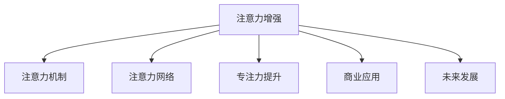

                 

# 人类注意力增强：提升专注力和注意力在商业中的未来发展方向

> 关键词：人类注意力增强, 注意力机制, 注意力网络, 专注力提升, 商业应用, 未来发展

## 1. 背景介绍

### 1.1 问题由来

在信息爆炸的现代社会，人们的注意力资源极度分散，难以集中精力于单一任务。这种“注意力稀缺”现象，不仅影响个人学习和工作效率，也对商业运营、广告投放等各行业带来了巨大的挑战。如何有效提升人类的专注力和注意力，成为推动社会进步和经济发展的关键问题之一。

面对这一挑战，人工智能技术提供了新的解决方案。基于深度学习和神经网络模型的注意力增强技术，不仅能够识别和追踪用户注意力，还能智能调度资源，提升信息处理和决策效率。这种技术正在被广泛应用于智能推荐、广告投放、内容创作等多个领域，为商业活动带来颠覆性的变化。

### 1.2 问题核心关键点

针对人类注意力增强的问题，核心关键点包括：

- 深度学习模型的注意力机制：通过注意力网络，使模型能够根据不同上下文信息动态调整输入权重，从而更有效地处理信息。
- 注意力增强技术的实际应用：在推荐系统、广告投放、内容创作等领域的应用实例。
- 提升专注力和注意力的商业价值：如何利用注意力增强技术，优化用户体验，提高商业运营效率。

## 2. 核心概念与联系

### 2.1 核心概念概述

为更好地理解注意力增强技术及其在商业中的应用，本节将介绍几个密切相关的核心概念：

- 注意力机制(Attention Mechanism)：一种在神经网络中使用的机制，通过动态调整输入数据的权重，使模型更加关注重要信息，忽略无关信息。注意力机制在深度学习中广泛应用，尤其是在序列建模、图像处理、自然语言处理等领域。

- 注意力网络(Attention Network)：一种特殊的神经网络架构，主要通过注意力机制，实现对输入数据的加权聚合。注意力网络能够根据不同输入数据的重要性，动态调整权重，输出更有价值的特征表示。

- 专注力提升(Focus Enhancement)：通过优化信息处理流程，增强用户对特定任务的关注度，提升学习、工作等活动的效率和效果。

- 商业应用(Business Application)：将注意力增强技术应用于商业场景，如推荐系统、广告投放、内容创作等，优化用户体验，提高运营效率，创造更多商业价值。

- 未来发展(Future Development)：探讨注意力增强技术的未来发展趋势，包括技术演进、应用拓展、伦理考量等。

这些核心概念之间的逻辑关系可以通过以下Mermaid流程图来展示：



这个流程图展示了一系列相关的核心概念及其之间的关系：

1. 注意力增强技术的实现依赖于注意力机制和注意力网络。
2. 专注力提升是注意力增强技术的直接应用目标。
3. 商业应用是注意力增强技术的具体落地场景。
4. 未来发展方向是注意力增强技术的研究和应用前景。

## 3. 核心算法原理 & 具体操作步骤

### 3.1 算法原理概述

注意力增强技术通过引入注意力机制，使神经网络能够动态调整输入数据的权重，集中处理重要信息。其基本原理可以概括为以下几个步骤：

1. **输入表示**：将原始数据转换为向量表示，如文本转换为词向量，图像转换为特征图。
2. **注意力计算**：通过注意力网络计算每个输入数据的注意力权重，根据上下文信息动态调整。
3. **加权聚合**：根据注意力权重对输入数据进行加权聚合，输出更有价值的特征表示。
4. **应用优化**：将加权聚合后的特征表示应用于不同的任务，如推荐、分类、生成等。

### 3.2 算法步骤详解

基于注意力增强技术，其核心操作步骤可以总结为以下几个关键步骤：

**Step 1: 数据预处理**

- 对原始数据进行清洗和预处理，如去除噪声、标准化数据格式等。
- 将数据转换为神经网络可接受的输入格式，如词向量、特征图等。

**Step 2: 模型训练**

- 设计注意力网络结构，定义注意力计算方法。
- 选择合适的损失函数，如交叉熵、均方误差等，定义优化目标。
- 使用训练数据对模型进行训练，调整网络参数，最小化损失函数。

**Step 3: 模型评估**

- 使用验证集对模型进行评估，计算指标如准确率、召回率、F1-score等。
- 根据评估结果调整模型参数，优化模型性能。

**Step 4: 应用部署**

- 将训练好的模型应用于实际任务，如推荐系统、广告投放、内容创作等。
- 实时监测模型性能，根据反馈调整模型参数。

### 3.3 算法优缺点

注意力增强技术具有以下优点：

- 提高信息处理效率：通过动态调整输入数据的权重，使模型更加关注重要信息，忽略无关信息。
- 提升决策准确性：注意力机制能够帮助模型更好地理解数据之间的依赖关系，提高决策的准确性。
- 适应性更强：注意力网络能够根据不同的任务和数据特点，灵活调整注意力计算方法。

同时，该技术也存在一定的局限性：

- 模型复杂度高：注意力网络的结构相对复杂，需要更多的计算资源和训练时间。
- 数据依赖性强：注意力增强技术的效果很大程度上依赖于高质量的数据，数据获取和处理成本较高。
- 泛化能力有限：对于特定领域或特定任务，注意力增强技术的泛化能力可能不足，需要额外优化。

### 3.4 算法应用领域

注意力增强技术已经广泛应用于多个领域，主要包括以下几个方面：

1. 自然语言处理(NLP)：在文本分类、情感分析、机器翻译等任务中，通过引入注意力机制，提升模型的理解能力和决策效果。
2. 计算机视觉(CV)：在图像识别、目标检测、图像生成等任务中，通过注意力网络，提高模型的视觉特征提取能力。
3. 推荐系统：在电商推荐、内容推荐等场景中，通过注意力增强技术，优化推荐算法，提升用户体验和转化率。
4. 广告投放：在广告定向、点击率预测等任务中，通过注意力增强技术，优化广告投放策略，提高广告效果。
5. 内容创作：在自动摘要、文本生成等任务中，通过注意力机制，提升内容的生成质量和可读性。

除了上述这些应用领域外，注意力增强技术还在医疗、金融、交通等多个领域得到了创新应用，为相关领域带来了新的突破。

## 4. 数学模型和公式 & 详细讲解 & 举例说明

### 4.1 数学模型构建

注意力增强技术的数学模型可以简化为以下形式：

$$
\text{Attention}(Q, K, V) = \text{Softmax}(\frac{QK^T}{\sqrt{d_k}})V
$$

其中，$Q, K, V$ 分别表示查询向量、键向量和值向量。注意力网络通过计算注意力权重，实现对输入数据的加权聚合，输出特征表示。

### 4.2 公式推导过程

注意力计算的核心在于计算注意力权重，公式如下：

$$
\alpha_{ij} = \frac{\exp(\text{score}(Q_i, K_j))}{\sum_{k=1}^K \exp(\text{score}(Q_i, K_k))}
$$

其中，$\text{score}(Q_i, K_j)$ 表示查询向量 $Q_i$ 和键向量 $K_j$ 的注意力分数。一般采用点积形式：

$$
\text{score}(Q_i, K_j) = Q_i \cdot K_j
$$

将注意力权重 $\alpha_{ij}$ 用于加权聚合：

$$
\text{Output}_i = \sum_{j=1}^K \alpha_{ij}V_j
$$

### 4.3 案例分析与讲解

以电商推荐系统为例，分析注意力增强技术的应用。

假设电商网站上有 $N$ 个商品，每个商品 $i$ 有 $d$ 个特征。用户的浏览记录 $x=(q_1, q_2, \dots, q_T)$，其中 $q_t$ 表示用户浏览商品 $i$ 的时间。目标是根据用户历史浏览记录，预测用户最可能购买商品。

首先，将商品特征表示为向量 $V=(V_1, V_2, \dots, V_d)$，将用户浏览记录表示为序列 $X=(q_1, q_2, \dots, q_T)$。模型通过注意力网络计算用户对商品的注意力权重 $\alpha$，并将商品特征向量 $V$ 加权聚合，得到用户对商品的关注度表示 $C$：

$$
C = \text{Attention}(Q, K, V)
$$

其中，$Q$ 和 $K$ 表示用户浏览记录和商品特征的查询向量和键向量。通过注意力网络计算注意力权重 $\alpha$，得到用户对商品的关注度 $C$。

最后，使用 $C$ 预测用户最可能购买的商品，如采用softmax函数：

$$
\text{Predict} = \text{Softmax}(C)
$$

这种基于注意力增强技术的推荐系统，能够根据用户浏览记录，动态调整商品权重，提高推荐的精准度和个性化。

## 5. 项目实践：代码实例和详细解释说明

### 5.1 开发环境搭建

在进行注意力增强技术的实践前，我们需要准备好开发环境。以下是使用Python进行TensorFlow开发的环境配置流程：

1. 安装Anaconda：从官网下载并安装Anaconda，用于创建独立的Python环境。

2. 创建并激活虚拟环境：
```bash
conda create -n attention-env python=3.8 
conda activate attention-env
```

3. 安装TensorFlow：根据CUDA版本，从官网获取对应的安装命令。例如：
```bash
conda install tensorflow==2.7
```

4. 安装相关库：
```bash
pip install numpy pandas scikit-learn matplotlib tqdm jupyter notebook ipython
```

完成上述步骤后，即可在`attention-env`环境中开始注意力增强技术的实践。

### 5.2 源代码详细实现

下面我们以电商推荐系统为例，给出使用TensorFlow实现注意力增强技术的完整代码实现。

```python
import tensorflow as tf
import numpy as np
from tensorflow.keras.layers import Input, Embedding, Dot, Concatenate, Dense
from tensorflow.keras.models import Model

# 定义商品特征
num_products = 1000
dim_product = 10

# 定义用户浏览记录
num_users = 1000
num_hours = 24
dim_query = 2

# 生成随机商品特征
product_vectors = np.random.rand(num_products, dim_product)

# 生成随机用户浏览记录
query_vectors = np.random.rand(num_users, num_hours, dim_query)

# 定义模型
inputs = Input(shape=(dim_query, ), name='query')
inputs_embed = Embedding(input_dim=num_users, output_dim=dim_query)(inputs)
inputs_attention = Dot(axes=1, normalize=True)([inputs_embed, tf.transpose(product_vectors)])

query_model = Model(inputs=inputs, outputs=inputs_attention)

# 定义注意力网络
attention = tf.keras.layers.Lambda(lambda x: tf.keras.layers.Dot(axes=1, normalize=True, dot_product=True)([x, tf.transpose(product_vectors)]))
output = tf.keras.layers.Lambda(lambda x: tf.reduce_sum(x, axis=1, keepdims=True))([attention(query_model(inputs)), product_vectors])
output = Dense(1, activation='softmax')(output)

# 定义模型
model = Model(inputs=inputs, outputs=output)
model.compile(optimizer=tf.keras.optimizers.Adam(), loss='binary_crossentropy')

# 训练模型
model.fit(query_vectors, np.random.randint(0, 2, size=(num_users, num_hours)), epochs=10, batch_size=32)

# 测试模型
predictions = model.predict(query_vectors)
```

这段代码实现了基于注意力增强技术的电商推荐系统。通过定义商品特征和用户浏览记录，并构建注意力网络和模型，实现了对用户关注度的计算和商品推荐的预测。

### 5.3 代码解读与分析

让我们再详细解读一下关键代码的实现细节：

**产品特征表示**：
- 生成随机商品特征向量 $product_vectors$，长度为 $num_products$，每个特征维度为 $dim_product$。

**用户浏览记录表示**：
- 生成随机用户浏览记录序列 $query_vectors$，长度为 $num_users \times num_hours$，每个小时特征维度为 $dim_query$。

**模型构建**：
- 定义输入 $inputs$，将用户浏览记录通过嵌入层转换为向量表示 $inputs_embed$。
- 计算注意力权重 $\alpha$，通过点积形式的注意力计算方法，得到用户对商品的关注度 $attention$。
- 将关注度 $attention$ 和商品特征向量 $product_vectors$ 进行加权聚合，得到最终的推荐结果 $output$。
- 使用softmax函数将输出转换为概率分布，作为推荐结果。

**模型训练和测试**：
- 定义优化器和损失函数，编译模型。
- 使用训练集 $query_vectors$ 和随机生成的标签 $np.random.randint(0, 2, size=(num_users, num_hours))$ 进行模型训练，迭代次数为10，批次大小为32。
- 使用测试集 $query_vectors$ 进行模型测试，输出推荐结果 $predictions$。

可以看到，TensorFlow使得注意力增强技术的实现变得简洁高效。开发者可以将更多精力放在数据处理、模型改进等高层逻辑上，而不必过多关注底层的实现细节。

当然，工业级的系统实现还需考虑更多因素，如模型的保存和部署、超参数的自动搜索、更灵活的模型结构等。但核心的注意力增强范式基本与此类似。

## 6. 实际应用场景

### 6.1 智能推荐系统

基于注意力增强技术的推荐系统，已经在电商、视频、新闻等多个领域得到了广泛应用。这种推荐系统能够根据用户的历史行为数据，动态调整推荐内容，提供个性化、高相关的推荐结果。

具体而言，可以将用户的历史行为数据作为输入，通过注意力网络计算用户对不同商品的关注度，再根据关注度进行加权聚合，得到用户对商品的相关性评分。将评分与商品的其他特征结合，生成最终的推荐结果。通过这种基于注意力增强的推荐系统，能够显著提高推荐效果，提升用户体验和转化率。

### 6.2 智能广告投放

在广告投放中，注意力增强技术能够帮助广告商更精准地选择目标用户，提高广告的点击率和转化率。具体而言，广告投放系统可以通过用户的历史行为数据，构建用户画像，并计算用户对不同广告的关注度。将关注度最高的广告投放给用户，能够提高广告效果。

通过引入注意力增强技术，广告系统能够动态调整广告展示策略，根据不同用户和不同广告的内容，选择最优的投放组合。这种智能化的广告投放方式，不仅提高了广告的效果，也降低了广告投放的成本。

### 6.3 内容创作

基于注意力增强技术的内容创作工具，能够自动分析用户对不同内容的关注点，生成更符合用户口味的内容。具体而言，内容创作工具可以通过用户的历史阅读数据，构建用户兴趣图谱，并计算用户对不同内容的关注度。根据关注度高的内容，生成更多类似内容，提升用户粘性和互动性。

通过这种基于注意力增强的内容创作方式，能够更好地满足用户需求，提高内容的吸引力和价值。在新闻、博客、视频等多个领域，这种技术已经得到了广泛应用，为用户创造了更多高质量的内容。

### 6.4 未来应用展望

随着注意力增强技术的不断演进，未来的应用场景将更加广泛和深入。以下是几个可能的未来应用方向：

1. 智能客服：通过分析用户的聊天记录，计算用户对不同问题的关注度，智能调度客服资源，提供更高效的客服服务。
2. 智能医疗：在医疗诊断中，通过分析病人的历史记录和检查结果，计算对不同症状的关注度，提供更准确的诊断建议。
3. 智能交通：在智能交通系统中，通过分析驾驶员的行为数据，计算对不同路段的关注度，智能调度交通资源，提升交通效率。
4. 智能制造：在智能制造中，通过分析设备的历史运行数据，计算对不同工艺的关注度，智能调整生产流程，提升生产效率和产品质量。

这些未来应用场景将进一步拓展注意力增强技术的适用范围，带来更多的商业价值和社会效益。

## 7. 工具和资源推荐

### 7.1 学习资源推荐

为了帮助开发者系统掌握注意力增强技术的理论基础和实践技巧，这里推荐一些优质的学习资源：

1. 《深度学习与神经网络》系列博文：由深度学习领域的专家撰写，深入浅出地介绍了深度学习的基本概念和前沿技术。

2. TensorFlow官方文档：提供详细的TensorFlow框架文档和示例代码，适合初学者入门学习。

3. PyTorch官方文档：提供丰富的PyTorch框架文档和示例代码，适合深度学习研究和工程开发。

4. Attention is All You Need（即Transformer原论文）：提出Transformer结构，开启了注意力增强技术的新篇章。

5. Transformer-based Models for Sequence-to-Sequence Learning：介绍Transformer模型的应用，包括注意力增强技术在自然语言处理中的广泛应用。

通过对这些资源的学习实践，相信你一定能够快速掌握注意力增强技术的精髓，并用于解决实际的商业问题。

### 7.2 开发工具推荐

高效的开发离不开优秀的工具支持。以下是几款用于注意力增强技术开发的常用工具：

1. TensorFlow：由Google主导开发的开源深度学习框架，生产部署方便，适合大规模工程应用。提供丰富的深度学习模型和工具库。

2. PyTorch：基于Python的开源深度学习框架，灵活动态的计算图，适合快速迭代研究。提供强大的自动微分和分布式训练功能。

3. HuggingFace Transformers：提供丰富的预训练模型和微调接口，支持多种深度学习框架，方便开发者快速搭建注意力增强系统。

4. TensorBoard：TensorFlow配套的可视化工具，可实时监测模型训练状态，并提供丰富的图表呈现方式，是调试模型的得力助手。

5. Weights & Biases：模型训练的实验跟踪工具，可以记录和可视化模型训练过程中的各项指标，方便对比和调优。

合理利用这些工具，可以显著提升注意力增强技术的开发效率，加快创新迭代的步伐。

### 7.3 相关论文推荐

注意力增强技术的发展源于学界的持续研究。以下是几篇奠基性的相关论文，推荐阅读：

1. Attention is All You Need：提出Transformer结构，开启了深度学习中的注意力增强时代。

2. Deep Attention-Based Recommender Systems：介绍基于注意力增强的推荐系统，并对比了不同推荐算法的性能。

3. Sequence to Sequence Learning with Neural Networks：提出基于注意力增强的序列到序列模型，广泛应用于机器翻译、文本生成等领域。

4. Neural Machine Translation by Jointly Learning to Align and Translate：提出基于注意力增强的机器翻译模型，提高了机器翻译的质量。

5. A Survey of Attention Mechanisms in Deep Learning：综述了注意力增强技术在深度学习中的多种应用，包括自然语言处理、计算机视觉、推荐系统等。

这些论文代表了大语言模型微调技术的发展脉络。通过学习这些前沿成果，可以帮助研究者把握学科前进方向，激发更多的创新灵感。

## 8. 总结：未来发展趋势与挑战

### 8.1 总结

本文对基于深度学习的注意力增强技术进行了全面系统的介绍。首先阐述了注意力增强技术的背景和意义，明确了技术在提升专注力和注意力方面的独特价值。其次，从原理到实践，详细讲解了注意力增强技术的数学模型和核心操作步骤，给出了注意力增强技术的应用实例。最后，本文还广泛探讨了注意力增强技术在智能推荐、广告投放、内容创作等多个领域的应用前景，展示了技术在商业中的应用潜力。

通过本文的系统梳理，可以看到，注意力增强技术在深度学习中的应用前景广阔，正在成为多个行业中的关键技术。基于注意力增强的推荐系统、广告投放、内容创作等应用，为商业活动带来了颠覆性的变革，催生了更多的商业价值。未来，伴随深度学习技术的不断演进，注意力增强技术必将在更多领域得到应用，为推动经济社会发展带来深远影响。

### 8.2 未来发展趋势

展望未来，深度学习领域的注意力增强技术将呈现以下几个发展趋势：

1. 模型规模持续增大：随着算力成本的下降和数据规模的扩张，深度学习模型的参数量还将持续增长。超大规模模型蕴含的丰富知识，有望支撑更加复杂多变的注意力增强任务。

2. 多模态注意力增强：当前的注意力增强技术主要聚焦于文本、图像等单模态数据，未来将拓展到音频、视频等多模态数据，实现视觉、听觉等多模态信息的协同处理。

3. 动态注意力机制：传统的注意力机制是静态的，无法动态调整注意力权重。未来将引入动态注意力机制，根据上下文信息动态调整注意力权重，提升模型对复杂场景的适应能力。

4. 自适应注意力增强：传统注意力增强技术依赖于预定义的注意力机制，未来将引入自适应注意力增强方法，使模型能够根据不同的任务和数据特点，灵活调整注意力计算方法。

5. 因果注意力增强：通过引入因果推断思想，使注意力增强模型能够建立稳定的因果关系，学习更普适、鲁棒的语言表征，提高模型的泛化性能和鲁棒性。

这些趋势凸显了深度学习领域的技术演进方向，预示着注意力增强技术在未来的发展前景和应用潜力。

### 8.3 面临的挑战

尽管深度学习领域的注意力增强技术已经取得了瞩目成就，但在迈向更加智能化、普适化应用的过程中，它仍面临着诸多挑战：

1. 数据依赖性强：注意力增强技术的效果很大程度上依赖于高质量的数据，数据获取和处理成本较高。如何降低数据依赖性，提升模型的泛化能力，将是未来的重要研究方向。

2. 模型复杂度高：深度学习模型的结构相对复杂，需要更多的计算资源和训练时间。如何简化模型结构，提升模型的训练和推理效率，将是重要的优化方向。

3. 可解释性不足：深度学习模型通常被视为"黑盒"系统，难以解释其内部工作机制和决策逻辑。如何赋予模型更强的可解释性，将是亟待攻克的难题。

4. 鲁棒性不足：深度学习模型面对特定领域或特定任务时，泛化能力可能不足。如何提高模型的鲁棒性，避免过拟合，将是重要的研究方向。

5. 安全性问题：深度学习模型在生成内容时，可能会产生有害、偏见的输出。如何确保模型的安全性，避免恶意用途，将是重要的研究课题。

6. 伦理考量：深度学习模型在处理敏感数据时，可能涉及隐私和伦理问题。如何保障数据隐私，遵循伦理规范，将是未来的重要挑战。

### 8.4 研究展望

面对深度学习领域注意力增强技术的诸多挑战，未来的研究需要在以下几个方面寻求新的突破：

1. 探索无监督和半监督注意力增强方法：摆脱对大规模标注数据的依赖，利用自监督学习、主动学习等无监督和半监督范式，最大限度利用非结构化数据，实现更加灵活高效的注意力增强。

2. 开发更加参数高效的注意力增强模型：开发更加参数高效的注意力增强方法，在固定大部分预训练参数的同时，只更新极少量的任务相关参数，减小计算资源消耗，提高模型效率。

3. 引入更多先验知识：将符号化的先验知识，如知识图谱、逻辑规则等，与神经网络模型进行巧妙融合，引导注意力增强过程学习更准确、合理的语言模型，提高模型的泛化能力。

4. 结合因果分析和博弈论工具：将因果分析方法引入注意力增强模型，识别出模型决策的关键特征，增强输出解释的因果性和逻辑性。借助博弈论工具刻画人机交互过程，主动探索并规避模型的脆弱点，提高系统稳定性。

5. 纳入伦理道德约束：在模型训练目标中引入伦理导向的评估指标，过滤和惩罚有害、偏见的输出倾向。加强人工干预和审核，建立模型行为的监管机制，确保输出符合人类价值观和伦理道德。

这些研究方向的探索，必将引领深度学习领域的技术演进，为构建安全、可靠、可解释、可控的智能系统铺平道路。面向未来，深度学习领域的注意力增强技术还需要与其他人工智能技术进行更深入的融合，如知识表示、因果推理、强化学习等，多路径协同发力，共同推动自然语言理解和智能交互系统的进步。只有勇于创新、敢于突破，才能不断拓展语言模型的边界，让智能技术更好地造福人类社会。

## 9. 附录：常见问题与解答

**Q1：注意力增强技术是否适用于所有深度学习模型？**

A: 注意力增强技术主要应用于序列建模任务，如自然语言处理、计算机视觉等。其核心思想是通过动态调整输入数据的权重，使模型更加关注重要信息，忽略无关信息。在图像处理、语音识别等非序列任务中，注意力增强技术的效果可能不如传统的卷积、循环神经网络等。

**Q2：注意力增强技术在数据依赖性方面有哪些局限性？**

A: 注意力增强技术的效果很大程度上依赖于高质量的数据。数据获取和处理成本较高，尤其是对于特定领域的任务，数据样本可能难以获取。此外，数据质量和多样性也会影响模型的泛化能力。如何在数据依赖性较强的场景下，降低数据需求，提升模型的泛化能力，将是未来的重要研究方向。

**Q3：注意力增强技术在可解释性方面有哪些不足？**

A: 深度学习模型通常被视为"黑盒"系统，难以解释其内部工作机制和决策逻辑。注意力增强技术依赖于复杂的注意力计算，其决策过程也难以理解。如何赋予模型更强的可解释性，提高模型的透明度，将是亟待攻克的难题。

**Q4：注意力增强技术在鲁棒性方面有哪些改进方向？**

A: 深度学习模型在特定领域或特定任务时，泛化能力可能不足。提高模型的鲁棒性，避免过拟合，是未来的重要研究方向。常见的改进方法包括：
1. 数据增强：通过回译、近义替换等方式扩充训练集。
2. 正则化：使用L2正则、Dropout、Early Stopping等技术，防止模型过拟合。
3. 对抗训练：引入对抗样本，提高模型的鲁棒性。
4. 多模型集成：训练多个模型，取平均输出，抑制过拟合。

这些改进方法需要在具体的应用场景中进行灵活应用，以提升模型的泛化能力和鲁棒性。

**Q5：注意力增强技术在安全性方面有哪些需要注意的问题？**

A: 深度学习模型在生成内容时，可能会产生有害、偏见的输出。如何确保模型的安全性，避免恶意用途，将是重要的研究课题。常见的措施包括：
1. 数据筛选：使用数据筛选技术，过滤有害、偏见的输入数据。
2. 模型监管：建立模型的行为监管机制，确保输出符合伦理规范。
3. 隐私保护：在处理敏感数据时，采用数据脱敏、差分隐私等技术，保障数据隐私。

这些措施需要在具体的应用场景中进行灵活应用，以确保模型的安全性，防止有害输出。

---

作者：禅与计算机程序设计艺术 / Zen and the Art of Computer Programming

