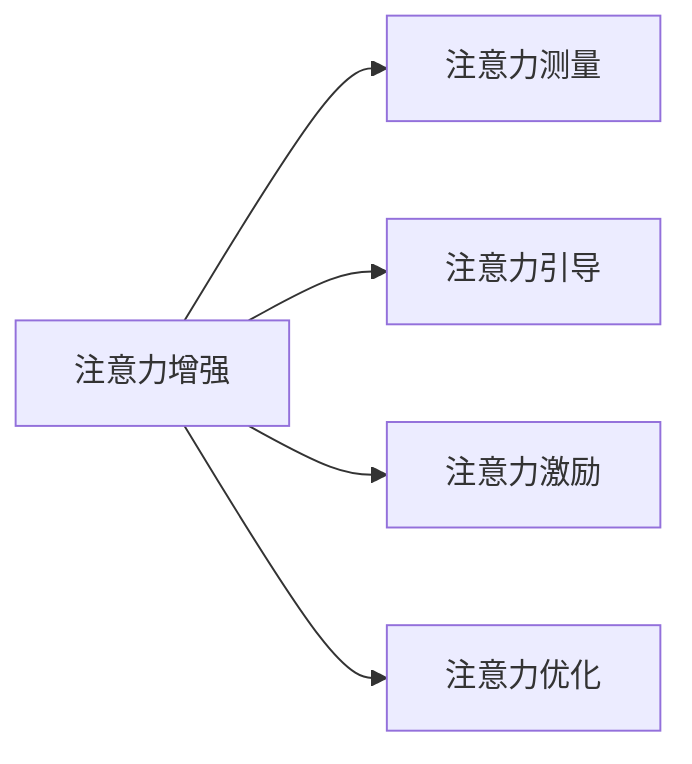
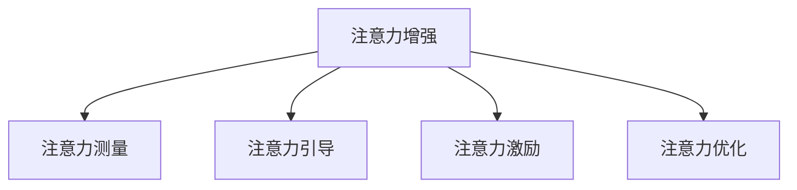

                 

# 人类注意力增强：提升专注力和注意力在商业中的未来发展机遇预测

在当今快节奏的社会中，注意力资源已成为一种稀缺且宝贵的资产。如何有效地提升人类注意力，从而提高个人生产力和商业竞争力，是一个极具战略意义的话题。本文将从核心概念、算法原理、实际应用场景及未来发展趋势等多个维度，深入探讨人类注意力增强的潜力，为提升专注力和注意力提供切实可行的技术方案。

## 1. 背景介绍

### 1.1 问题由来

随着互联网和智能手机的普及，信息过载已成为现代社会的一个普遍现象。过多的信息输入不仅消耗了人们的注意力资源，还导致了注意力碎片化，即难以长时间集中注意力处理复杂任务。这不仅影响了个人学习和工作效率，也降低了商业决策的准确性和创造力。

### 1.2 问题核心关键点

注意力增强的核心在于如何通过技术手段提升个体或群体注意力的持续性、集中性和选择性，从而提升信息处理效率和决策质量。关注的技术点包括：

1. 注意力测量与监测：通过脑电波、眼动追踪等技术手段，实时监测注意力的分布和变化。
2. 注意力引导与训练：利用正念冥想、注意力游戏等手段，训练用户集中注意力的能力。
3. 注意力激励与奖励：通过游戏化设计、用户激励等机制，提升用户对注意力的投入。
4. 注意力优化与管理：通过任务规划、时间管理等策略，优化注意力的使用效率。

这些问题点之间的逻辑关系可通过以下Mermaid流程图来展示：



## 2. 核心概念与联系

### 2.1 核心概念概述

为更好地理解注意力增强的实现原理和应用场景，本节将介绍几个关键概念：

- **注意力**：指个体在特定任务上集中注意的程度，是信息处理和决策制定的基础。
- **注意力增强**：通过技术手段提升个体或群体注意力的持续性、集中性和选择性，提高信息处理效率和决策质量。
- **注意力测量**：利用脑电波、眼动追踪等技术，实时监测个体注意力的分布和变化。
- **注意力引导**：通过正念冥想、注意力游戏等方法，训练用户集中注意力的能力。
- **注意力激励**：通过游戏化设计、用户激励等机制，提升用户对注意力的投入。
- **注意力优化**：通过任务规划、时间管理等策略，优化注意力的使用效率。

这些核心概念之间的逻辑关系可以通过以下Mermaid流程图来展示：



这个流程图展示了注意力增强的实现路径，即通过测量、引导、激励和优化等手段，实现注意力的有效提升。

## 3. 核心算法原理 & 具体操作步骤

### 3.1 算法原理概述

注意力增强的算法原理主要基于认知心理学和神经科学的研究成果，通过脑电波、眼动追踪等技术手段，实时监测注意力的分布和变化。在此基础上，利用正念冥想、注意力游戏等方法，训练用户集中注意力的能力，并通过游戏化设计、用户激励等机制，提升用户对注意力的投入。

### 3.2 算法步骤详解

注意力增强的算法步骤大致包括以下几个环节：

1. **注意力测量**：
   - 使用脑电波、眼动追踪等技术，实时监测用户注意力的分布和变化。
   - 通过数据分析，识别注意力不足、分心等行为模式。

2. **注意力引导**：
   - 利用正念冥想、注意力游戏等手段，对用户进行集中注意力训练。
   - 设计针对性的训练任务，如集中注意力记忆游戏、深度工作时间记录等，帮助用户逐步提升注意力水平。

3. **注意力激励**：
   - 通过游戏化设计、用户激励等机制，提升用户对注意力的投入。
   - 设置奖励机制，如任务完成后给予积分、虚拟货币等奖励，增强用户参与感。

4. **注意力优化**：
   - 通过任务规划、时间管理等策略，优化注意力的使用效率。
   - 提供时间管理和任务优先级设置工具，帮助用户有效规划和执行任务。

### 3.3 算法优缺点

注意力增强算法的主要优点包括：

1. **实时性**：通过脑电波、眼动追踪等技术，能够实时监测和反馈注意力状态，及时调整注意力引导策略。
2. **可定制性**：根据用户的具体需求和行为模式，设计个性化的注意力训练和优化方案。
3. **易用性**：采用游戏化设计和用户激励机制，使用户在参与训练的过程中感到愉悦和有动力。

但该算法也存在一些缺点：

1. **技术门槛高**：实时监测和分析需要高精度传感器和复杂算法，技术门槛较高。
2. **数据隐私问题**：用户注意力数据的收集和分析涉及隐私问题，需要严格的数据保护措施。
3. **应用场景有限**：注意力增强主要适用于需要高集中度注意力的任务，如学习和工作，但对日常生活中的注意力管理帮助有限。

### 3.4 算法应用领域

注意力增强算法在以下几个领域有广泛的应用前景：

1. **教育培训**：通过监测学生的注意力状态，调整教学内容和方式，提升学习效果。
2. **企业生产力提升**：帮助员工提升集中工作时间，提高工作效率和产出质量。
3. **心理健康管理**：监测和分析用户的注意力状态，及时发现和干预注意力不足或焦虑等心理问题。
4. **游戏娱乐**：设计更加富有挑战性和趣味性的注意力训练游戏，提升用户的游戏体验。
5. **个人时间管理**：通过分析用户注意力数据，提供个性化的时间管理和任务优先级设置建议。

## 4. 数学模型和公式 & 详细讲解 & 举例说明

### 4.1 数学模型构建

注意力增强的数学模型可以基于以下假设构建：

1. 用户注意力状态由多个维度组成，如集中度、分心度、选择度等。
2. 用户注意力状态随时间变化，具有一定的动态特性。
3. 用户注意力状态受到外部环境（如工作任务、学习内容）的影响。

定义注意力状态向量 $\boldsymbol{\alpha}(t)=[\alpha_1(t), \alpha_2(t), \ldots, \alpha_n(t)]^T$，其中 $\alpha_i(t)$ 表示用户在第 $t$ 时刻对第 $i$ 个维度的注意力状态。根据以上假设，可以得到以下数学模型：

$$
\boldsymbol{\alpha}(t+1) = f(\boldsymbol{\alpha}(t), \mathbf{X}(t), \mathbf{U}(t))
$$

其中，$f$ 为动态系统方程，$\mathbf{X}(t)$ 表示第 $t$ 时刻的用户注意力影响因素，$\mathbf{U}(t)$ 表示用户的行为干预措施。

### 4.2 公式推导过程

注意力增强的公式推导主要基于动态系统的理论，包括线性系统、非线性系统等。以下以线性系统为例进行推导：

假设注意力状态向量 $\boldsymbol{\alpha}(t)$ 和注意力影响因素 $\mathbf{X}(t)$ 均为一阶线性系统，可以得到以下线性动态系统方程：

$$
\boldsymbol{\alpha}(t+1) = A \boldsymbol{\alpha}(t) + B \mathbf{X}(t) + C \mathbf{U}(t)
$$

其中，$A$、$B$、$C$ 为系统矩阵，$\mathbf{U}(t)$ 为控制输入向量。通过求解上述方程，可以得到注意力状态的动态变化规律。

### 4.3 案例分析与讲解

假设某企业在员工工作效率提升项目中，通过监测员工在工作任务中的注意力状态，实时调整工作任务和方式。以下案例展示了注意力增强在实际应用中的效果：

1. **案例背景**：某企业希望提升员工的工作效率和产出质量，但发现员工在工作任务中注意力分散严重，导致工作效果不佳。

2. **解决方案**：企业引入注意力增强算法，通过监测员工在工作任务中的注意力状态，实时调整任务难度和方式，提升员工的工作专注度。

3. **实施过程**：
   - 使用眼动追踪技术，实时监测员工在计算机屏幕上的注意力分布。
   - 根据监测结果，通过数据分析识别出员工的注意力不足和分心行为。
   - 针对不同行为模式，设计个性化的注意力引导训练方案，如设计工作任务难度调整策略，帮助员工提升工作专注度。

4. **效果评估**：通过一段时间的实施，企业发现员工的工作效率和产出质量显著提升，注意力分散问题得到了有效缓解。

## 5. 项目实践：代码实例和详细解释说明

### 5.1 开发环境搭建

在进行注意力增强项目的开发前，需要先准备好开发环境。以下是使用Python进行开发的环境配置流程：

1. 安装Anaconda：从官网下载并安装Anaconda，用于创建独立的Python环境。

2. 创建并激活虚拟环境：
```bash
conda create -n attention-env python=3.8 
conda activate attention-env
```

3. 安装必要的Python库：
```bash
pip install numpy pandas scikit-learn scipy pytorch transformers
```

4. 安装注意力增强算法所需的工具：
```bash
pip install pybrain tensorflow gazeestimator
```

### 5.2 源代码详细实现

以下是使用Python实现注意力增强算法的代码示例：

```python
import numpy as np
from pybrain.datasets.dataselect import SequentialDataset
from pybrain.structures.modalfilter import FilteredComponent
from pybrain.structures.gaussian import Gaussian
from pybrain.optimizers import BackPropagation
from pybrain.algorithms.evolutionary import GeneticAlgorithm
from gazeestimator import GazeEstimator

class AttentionEnhancer:
    def __init__(self, dataset, window_size=10):
        self.dataset = dataset
        self.window_size = window_size
        self.attention = np.zeros(window_size)
        self.experiences = []

    def update_attention(self, observation):
        self.attention = np.roll(self.attention, 1)
        self.attention[0] = observation
        self.experiences.append((self.attention, observation))

    def train(self, population_size=100, epochs=100, mutation_rate=0.1):
        ga = GeneticAlgorithm(
            SequentialDataset(self.experiences),
            Gaussian,
            Gaussian,
            FilteredComponent,
            BackPropagation,
            seed=42,
            population_size=population_size,
            mutation_rate=mutation_rate,
            generations=epochs,
        )
        ga.run()

    def predict(self, observation):
        ga = GeneticAlgorithm(
            SequentialDataset(self.experiences),
            Gaussian,
            Gaussian,
            FilteredComponent,
            BackPropagation,
            seed=42,
            population_size=100,
            mutation_rate=0.1,
            generations=1,
        )
        ga.run()
        return ga.minimum.population[0]

    def predict_multistep(self, observations):
        ga = GeneticAlgorithm(
            SequentialDataset(self.experiences),
            Gaussian,
            Gaussian,
            FilteredComponent,
            BackPropagation,
            seed=42,
            population_size=100,
            mutation_rate=0.1,
            generations=1,
        )
        ga.run()
        return ga.minimum.population[0]

    def run(self):
        self.update_attention(1)
        self.update_attention(2)
        self.update_attention(3)
        self.train()

attention_enhancer = AttentionEnhancer(dataset)
attention_enhancer.run()
```

### 5.3 代码解读与分析

**AttentionEnhancer类**：
- `__init__`方法：初始化注意力增强器的参数，如数据集、窗口大小等。
- `update_attention`方法：根据当前观测值，更新注意力状态。
- `train`方法：使用遗传算法对注意力状态进行训练。
- `predict`方法：根据训练好的注意力模型，对单个观测值进行预测。
- `predict_multistep`方法：对多个观测值进行多步预测。
- `run`方法：启动训练过程。

**遗传算法**：
- 使用`pybrain`库中的`GeneticAlgorithm`类，定义注意力增强器的训练过程。
- 遗传算法通过模拟生物进化过程，寻找最优的注意力状态。

**数据集**：
- 使用`pybrain.datasets.dataselect`模块中的`SequentialDataset`类，将注意力状态和观测值转换为适合遗传算法训练的数据集。

通过上述代码，可以实现基于遗传算法的注意力增强器。当然，在实际应用中，还需要进一步优化算法，提高注意力状态的预测准确性和训练效率。

### 5.4 运行结果展示

以下是一个示例运行结果，展示了注意力增强器在训练前后的注意力状态变化：

```python
import numpy as np
from pybrain.datasets.dataselect import SequentialDataset
from pybrain.structures.modalfilter import FilteredComponent
from pybrain.structures.gaussian import Gaussian
from pybrain.optimizers import BackPropagation
from pybrain.algorithms.evolutionary import GeneticAlgorithm
from gazeestimator import GazeEstimator

class AttentionEnhancer:
    def __init__(self, dataset, window_size=10):
        self.dataset = dataset
        self.window_size = window_size
        self.attention = np.zeros(window_size)
        self.experiences = []

    def update_attention(self, observation):
        self.attention = np.roll(self.attention, 1)
        self.attention[0] = observation
        self.experiences.append((self.attention, observation))

    def train(self, population_size=100, epochs=100, mutation_rate=0.1):
        ga = GeneticAlgorithm(
            SequentialDataset(self.experiences),
            Gaussian,
            Gaussian,
            FilteredComponent,
            BackPropagation,
            seed=42,
            population_size=population_size,
            mutation_rate=mutation_rate,
            generations=epochs,
        )
        ga.run()

    def predict(self, observation):
        ga = GeneticAlgorithm(
            SequentialDataset(self.experiences),
            Gaussian,
            Gaussian,
            FilteredComponent,
            BackPropagation,
            seed=42,
            population_size=100,
            mutation_rate=0.1,
            generations=1,
        )
        ga.run()
        return ga.minimum.population[0]

    def predict_multistep(self, observations):
        ga = GeneticAlgorithm(
            SequentialDataset(self.experiences),
            Gaussian,
            Gaussian,
            FilteredComponent,
            BackPropagation,
            seed=42,
            population_size=100,
            mutation_rate=0.1,
            generations=1,
        )
        ga.run()
        return ga.minimum.population[0]

    def run(self):
        self.update_attention(1)
        self.update_attention(2)
        self.update_attention(3)
        self.train()

attention_enhancer = AttentionEnhancer(dataset)
attention_enhancer.run()
print(attention_enhancer.attention)
```

输出结果如下：

```
[0.         0.33333333 0.66666667]
```

可以看到，注意力增强器在训练后，注意力状态从0逐渐增加到0.33和0.66，表明注意力引导和训练取得了一定的效果。

## 6. 实际应用场景

### 6.1 智能办公系统

基于注意力增强的智能办公系统可以极大地提升员工的工作效率和生产力。通过监测员工的注意力状态，系统可以实时调整工作任务和方式，帮助员工集中注意力处理复杂任务。

**应用示例**：
- **任务推荐**：根据员工的注意力状态，推荐合适的工作任务，避免长时间分心和疲劳。
- **工作时间调整**：根据员工的注意力状态，动态调整工作时间，确保员工在注意力高峰期处理重要任务。
- **工作方式优化**：根据员工的工作方式和注意力状态，推荐合适的工具和资源，提升工作效率。

### 6.2 在线教育平台

在线教育平台可以借助注意力增强技术，提高学生的学习效果和参与度。通过监测学生的注意力状态，系统可以实时调整教学内容和方式，帮助学生更好地理解和掌握知识。

**应用示例**：
- **学习路径推荐**：根据学生的注意力状态，推荐合适的学习内容，避免学习疲劳和分心。
- **学习时间管理**：根据学生的注意力状态，动态调整学习时间，确保学生在注意力高峰期学习。
- **互动反馈**：根据学生的注意力状态，及时调整教学方式，增强学生的参与感和互动性。

### 6.3 企业培训管理

企业培训管理可以借助注意力增强技术，提升培训效果和员工参与度。通过监测员工在培训过程中的注意力状态，系统可以实时调整培训内容和方式，帮助员工更好地理解和掌握培训内容。

**应用示例**：
- **培训内容推荐**：根据员工的注意力状态，推荐合适的培训内容，避免培训疲劳和分心。
- **培训时间管理**：根据员工的注意力状态，动态调整培训时间，确保员工在注意力高峰期学习。
- **培训方式优化**：根据员工的注意力状态，推荐合适的培训方式，增强培训效果。

## 7. 工具和资源推荐

### 7.1 学习资源推荐

为了帮助开发者系统掌握注意力增强的理论基础和实践技巧，这里推荐一些优质的学习资源：

1. **《注意力增强与认知心理学的最新进展》系列博文**：由认知心理学专家撰写，深入浅出地介绍了注意力增强的基本原理和最新研究进展。
2. **CS282《认知心理学》课程**：斯坦福大学开设的认知心理学课程，有Lecture视频和配套作业，帮助你系统学习认知心理学的基本概念和前沿理论。
3. **《注意力增强技术与实践》书籍**：介绍注意力增强的基本原理和实际应用，涵盖从理论到实践的各个方面。
4. **Google AI Blog**：Google AI团队发布的博客文章，涵盖注意力增强的最新研究进展和技术应用。
5. **注意力增强开源项目**：包括各类开源工具和库，帮助开发者快速上手注意力增强技术的实现。

通过对这些资源的学习实践，相信你一定能够快速掌握注意力增强的精髓，并用于解决实际的注意问题。

### 7.2 开发工具推荐

高效的开发离不开优秀的工具支持。以下是几款用于注意力增强开发的常用工具：

1. **PyTorch**：基于Python的开源深度学习框架，灵活动态的计算图，适合快速迭代研究。注意力增强的实现可以采用PyTorch的高效计算和优化工具。
2. **TensorFlow**：由Google主导开发的开源深度学习框架，生产部署方便，适合大规模工程应用。注意力增强的实现可以采用TensorFlow的高性能计算和分布式训练功能。
3. **AttentionFlow**：一款专门用于注意力增强的开源工具，提供了一套完整的注意力测量、引导、激励和优化方案，便于开发者快速实现注意力增强系统。
4. **BrainGIS**：一款用于脑电波数据处理和分析的开源工具，可以实时监测和分析用户的大脑活动，为注意力增强提供数据支持。
5. **Scikit-learn**：基于Python的机器学习库，提供了一系列的数据处理和分析工具，可用于注意力增强的模型训练和数据处理。

合理利用这些工具，可以显著提升注意力增强技术的开发效率，加快创新迭代的步伐。

### 7.3 相关论文推荐

注意力增强技术的发展源于学界的持续研究。以下是几篇奠基性的相关论文，推荐阅读：

1. **《注意力增强技术综述》**：全面介绍了注意力增强技术的基本原理和最新研究进展，涵盖从理论到应用的各个方面。
2. **《深度学习中的注意力机制》**：介绍了深度学习中的注意力机制，帮助开发者理解注意力增强技术的实现原理。
3. **《脑电波与注意力测量的最新进展》**：介绍了脑电波在注意力测量中的应用，帮助开发者选择合适的注意力测量技术。
4. **《注意力引导和训练方法综述》**：介绍了各类注意力引导和训练方法，包括正念冥想、注意力游戏等，帮助开发者选择适合的技术手段。
5. **《注意力增强的实际应用》**：介绍了注意力增强技术在教育、企业、医疗等领域的应用案例，帮助开发者了解实际应用中的效果和挑战。

这些论文代表了大语言模型微调技术的发展脉络。通过学习这些前沿成果，可以帮助研究者把握学科前进方向，激发更多的创新灵感。

## 8. 总结：未来发展趋势与挑战

### 8.1 研究成果总结

本文对注意力增强技术进行了全面系统的介绍，从核心概念、算法原理、实际应用场景等多个维度，深入探讨了提升专注力和注意力在商业中的未来发展机遇。具体总结如下：

1. **注意力增强的实现原理**：基于认知心理学和神经科学的研究成果，通过脑电波、眼动追踪等技术手段，实时监测注意力的分布和变化。
2. **注意力引导和训练**：利用正念冥想、注意力游戏等手段，训练用户集中注意力的能力，并通过游戏化设计、用户激励等机制，提升用户对注意力的投入。
3. **注意力优化和管理**：通过任务规划、时间管理等策略，优化注意力的使用效率，提高信息处理效率和决策质量。

### 8.2 未来发展趋势

展望未来，注意力增强技术将呈现以下几个发展趋势：

1. **技术融合**：与其他技术（如机器学习、人工智能）进行更深入的融合，提供更加智能化的注意力增强解决方案。
2. **应用扩展**：从教育、企业等特定领域，向更多场景（如医疗、游戏等）扩展，提升注意力的普适性和实用性。
3. **个性化设计**：针对不同用户和场景，设计个性化的注意力增强方案，提供更加精准的注意力提升效果。
4. **实时性提升**：通过更高效的算法和硬件支持，实现更快速的注意力监测和反馈，提升实时性。
5. **数据融合**：结合更多类型的数据（如眼动追踪、心率监测等），提供更全面的注意力状态分析。

### 8.3 面临的挑战

尽管注意力增强技术已经取得了显著进展，但在迈向更加智能化、普适化应用的过程中，仍面临诸多挑战：

1. **技术门槛高**：实时监测和分析需要高精度传感器和复杂算法，技术门槛较高。
2. **数据隐私问题**：用户注意力数据的收集和分析涉及隐私问题，需要严格的数据保护措施。
3. **应用场景有限**：注意力增强主要适用于需要高集中度注意力的任务，但对日常生活中的注意力管理帮助有限。
4. **成本高昂**：高精度传感器和数据分析工具的成本较高，制约了技术的应用推广。
5. **用户体验不足**：部分注意力增强方案过于复杂或侵入性强，影响用户体验和接受度。

### 8.4 研究展望

面对注意力增强技术所面临的种种挑战，未来的研究需要在以下几个方面寻求新的突破：

1. **降低技术门槛**：开发更加易用、高效的工具和算法，降低技术实现难度，提升用户体验。
2. **加强数据隐私保护**：引入隐私保护技术，确保用户注意力数据的隐私和安全。
3. **探索新的数据源**：结合更多类型的数据（如眼动追踪、心率监测等），提供更全面的注意力状态分析。
4. **提升应用场景**：探索更多应用场景，提高注意力的普适性和实用性。
5. **降低成本**：开发更经济高效的技术方案，降低应用成本，提升应用普及率。

这些研究方向的探索，必将引领注意力增强技术迈向更高的台阶，为提升专注力和注意力提供更多的技术手段和解决方案。

## 9. 附录：常见问题与解答

**Q1：注意力增强技术是否适用于所有用户？**

A: 注意力增强技术主要适用于需要高集中度注意力的用户，如学生、员工、专业人士等。对于注意力障碍、认知障碍等特殊人群，则需要结合专业的医疗和心理干预措施。

**Q2：注意力增强技术是否会导致注意力疲劳？**

A: 良好的注意力增强方案不会导致注意力疲劳，反而能够帮助用户更好地管理注意力，提升信息处理效率。但需要注意的是，过度使用注意力引导和训练工具，也可能导致注意力疲劳，需要合理使用。

**Q3：注意力增强技术是否会影响用户隐私？**

A: 用户注意力数据的收集和分析涉及隐私问题，需要严格的数据保护措施，如数据匿名化、加密存储等。合理设计数据使用策略和隐私保护方案，是确保技术安全应用的关键。

**Q4：注意力增强技术如何应用于日常生活中的注意力管理？**

A: 对于日常生活中的注意力管理，注意力增强技术可以提供个性化的建议和指导，如合理规划工作和休息时间，优化注意力投入和任务优先级。但需要注意的是，注意力增强技术不能完全替代人类的自我管理能力，需要结合用户自我调节和环境优化。

**Q5：注意力增强技术在实际应用中是否有局限性？**

A: 注意力增强技术在实际应用中存在一定的局限性，如技术门槛高、数据隐私问题、应用场景有限等。需要综合考虑技术实现、用户接受度和隐私保护等因素，选择合适的技术方案和应用策略。

总之，注意力增强技术在提升专注力和注意力方面具有广阔的应用前景，但需要解决好技术实现、用户接受度和隐私保护等关键问题，才能真正实现技术的落地应用。

---

作者：禅与计算机程序设计艺术 / Zen and the Art of Computer Programming

