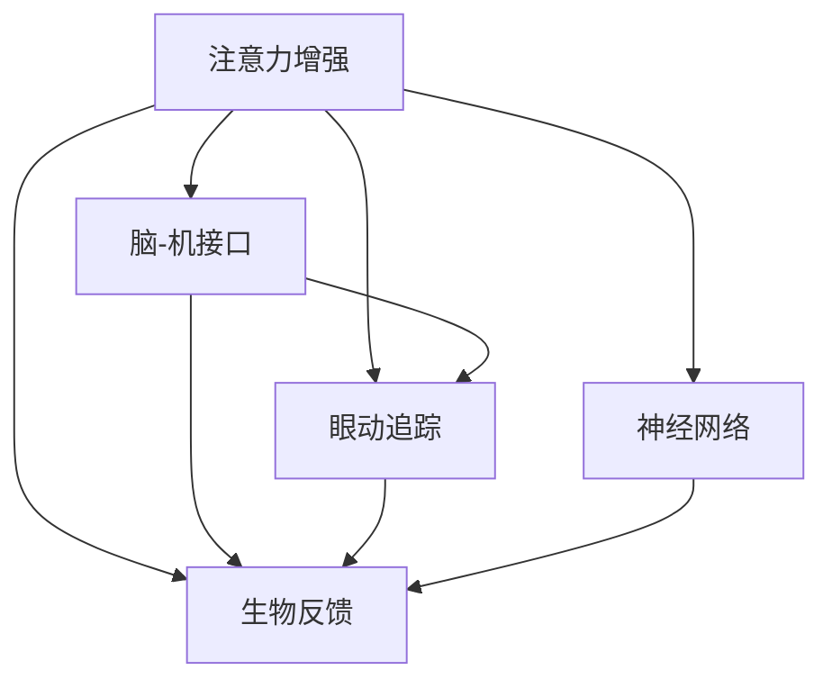

                 

## 1. 背景介绍

### 1.1 问题由来
在现代社会，面对日益复杂的信息环境和多重任务并行的工作方式，人们普遍面临注意力分散、专注力下降等问题。信息过载、干扰频繁、心理压力大等诸多因素，导致人们在认知处理、决策制定、创造力发挥等方面出现障碍，影响了个人和工作效能。

### 1.2 问题核心关键点
注意力增强的目标在于提升个体的专注力和注意力持续时间，改善工作和学习效率。注意力增强不仅涉及心理学和认知科学的原理，还包括计算机视觉、人机交互等领域的最新技术。如何利用这些技术开发有效的注意力增强工具，为个体提供精准的支持，成为当前研究热点。

### 1.3 问题研究意义
深入研究注意力增强的方法，有助于提升个体的认知效能，缓解信息时代的压力，推动社会生产力和创新能力的提升。同时，注意力增强技术的应用场景也广泛，涉及教育、医疗、办公等多个领域，具有重要的现实意义。

## 2. 核心概念与联系

### 2.1 核心概念概述

为更好地理解注意力增强方法，本节将介绍几个关键概念：

- **注意力增强(Attention Enhancement)**：指通过各种技术手段，改善个体的注意力集中度、持续时间和反应速度，提升工作和学习效率。
- **脑-机接口(Brain-Computer Interface, BCI)**：通过直接读取脑电信号或磁共振成像等神经数据，解码出用户的意图和情感状态，实现人机交互。
- **眼动追踪(Eye Tracking)**：通过追踪眼球运动，分析用户的注视区域和聚焦行为，评估注意力分布和变化规律。
- **生物反馈(Biofeedback)**：使用生物信号监测设备，将用户的生理状态信息反馈给用户，通过自我调节提升注意力的控制力。
- **神经网络(Deep Neural Network)**：一种通过多层次非线性变换学习数据模式的技术，广泛应用于图像识别、语音处理等任务中，可用于设计注意力增强算法。

这些概念之间的逻辑关系可以通过以下Mermaid流程图来展示：



这个流程图展示了几类注意力增强技术的主要功能及其相互联系：

1. 注意力增强技术通过多种途径改善注意力状态。
2. 脑-机接口和眼动追踪技术主要通过神经数据解读和眼球运动分析来评估注意力。
3. 生物反馈技术通过生理信号监测和反馈来指导用户进行自我调节。
4. 神经网络技术用于设计复杂的算法，实现更高层次的注意力增强。

## 3. 核心算法原理 & 具体操作步骤
### 3.1 算法原理概述

注意力增强的算法原理主要基于对大脑注意力机制的深入理解。通过多模态数据的融合，解码用户的注意力分布和情感状态，设计反馈机制引导用户改善注意力行为。

核心算法一般包括以下几个步骤：

1. **数据采集**：使用脑电图(EEG)、功能性磁共振成像(fMRI)、眼动追踪设备等，获取用户的神经信号、眼球运动数据和生理信号。
2. **特征提取与预处理**：从原始数据中提取关键特征，进行归一化、去噪等预处理，为后续的建模工作打下基础。
3. **建模与解码**：使用神经网络、机器学习等方法，训练模型来解码用户的注意力分布和情感状态。
4. **反馈与指导**：根据解码结果，通过视觉、听觉等形式，向用户提供反馈和指导，帮助用户自我调节。
5. **行为干预**：设计行为干预策略，如提醒、休息建议、注意力集中训练等，帮助用户提升注意力行为。

### 3.2 算法步骤详解

以基于眼动追踪和生物反馈的注意力增强为例，详细介绍算法步骤：

**Step 1: 数据采集**

- **眼动追踪**：使用眼动追踪设备，实时捕捉用户的眼球运动轨迹，计算注视区域和时间分布。
- **生理信号监测**：使用可穿戴设备，监测用户的生理指标，如心率、皮电反应等，评估用户的疲劳和压力状态。

**Step 2: 特征提取与预处理**

- **眼动数据预处理**：对眼动轨迹数据进行去噪、归一化，提取注视时间、注视频率、瞳孔大小等关键特征。
- **生理信号预处理**：对心率、皮电信号等进行滤波、去噪，计算生理指标的动态变化。

**Step 3: 建模与解码**

- **注意力模型训练**：使用神经网络模型，如卷积神经网络(CNN)、长短时记忆网络(LSTM)等，训练注意力模型。模型输入为预处理后的眼动数据和生理信号，输出为注意力分布和情感状态。
- **解码结果后处理**：对解码结果进行后处理，如滤波、归一化，确保输出结果的可解释性和可靠性。

**Step 4: 反馈与指导**

- **视觉反馈**：使用显示器展示注意力分布图和生理指标图，直观展示注意力和疲劳状态。
- **听觉反馈**：通过声音提示，如播报注意力集中度、提醒休息等，增强用户注意力的自我调节能力。

**Step 5: 行为干预**

- **注意力集中训练**：设计注意力集中训练任务，如双任务切换、注意力聚焦等，逐步提升用户的注意力控制力。
- **休息建议**：根据生理指标和注意力状态，自动给出休息建议，帮助用户恢复注意力。

### 3.3 算法优缺点

注意力增强的算法主要具有以下优点：

1. **非侵入性**：使用无创的生理信号监测和眼动追踪技术，无需手术干预，安全性高。
2. **即时反馈**：通过实时数据采集和反馈，用户可以即时了解自身注意力状态，进行自我调节。
3. **个性化定制**：可以根据用户的特定需求，设计个性化的训练和反馈方案，提升效果。
4. **多模态融合**：结合多种传感器数据，提供更全面的注意力状态评估和反馈，提升模型的准确性和鲁棒性。

同时，该算法也存在以下局限：

1. **设备依赖**：需要高精度的传感器设备和复杂的计算资源，设备成本较高。
2. **数据隐私**：生理信号和眼动数据的隐私保护问题，可能引发用户对数据安全的担忧。
3. **依赖环境**：在某些环境中，如强光、高噪音等，设备性能可能受限，影响数据采集质量。
4. **算法复杂**：多模态数据的融合和模型训练过程较为复杂，对算法设计要求较高。

尽管存在这些局限，但注意力增强技术仍是大数据时代提升个体认知效能的重要手段。未来研究需进一步降低设备成本、提高数据隐私保护能力，并在算法设计上寻求更高效、易用、个性化的解决方案。

### 3.4 算法应用领域

注意力增强的算法技术广泛应用于教育、医疗、企业办公等多个领域，具体应用包括：

- **教育**：通过注意力增强工具，帮助学生提升课堂学习效率，增强理解力和记忆力。
- **医疗**：监测病患的注意力状态，评估其认知功能，辅助诊断和治疗。
- **企业**：使用注意力增强技术，提升员工的工作专注度和生产力，优化工作流程。
- **军事**：在紧张的战备任务中，提升士兵的注意力和反应速度，确保决策效率和执行能力。
- **游戏**：通过注意力训练和视觉反馈，提升玩家的竞技水平，减少误操作。

这些应用场景表明，注意力增强技术具有广泛的应用前景，能够显著提升个体的认知效能，为各行各业带来积极影响。

## 4. 数学模型和公式 & 详细讲解 & 举例说明
### 4.1 数学模型构建

注意力增强的数学模型主要基于神经网络和机器学习技术。以基于眼动追踪的注意力增强为例，模型结构一般包括：

- **输入层**：接收眼动数据、生理信号等原始数据。
- **特征提取层**：通过卷积、池化等操作，提取关键特征。
- **编码层**：使用LSTM等模型，对特征进行编码，学习用户的注意力分布和情感状态。
- **解码层**：使用全连接层或其他模型，解码输出注意力分布和情感状态。
- **输出层**：根据解码结果，输出注意力反馈和行为指导。

### 4.2 公式推导过程

以LSTM模型为例，推导解码过程的公式。

假设输入数据为 $x=(x_1, x_2, \ldots, x_n)$，LSTM模型输出的注意力分布为 $A=(A_1, A_2, \ldots, A_n)$，其中 $A_i$ 表示第 $i$ 个数据点对应的注意力得分。LSTM模型的解码公式如下：

$$
A_i = f(x_i, h_{t-1})
$$

其中 $f$ 为解码函数，$h_{t-1}$ 为前一时刻的隐藏状态。解码函数 $f$ 可以采用线性回归、Softmax等方法，输出注意力得分。

### 4.3 案例分析与讲解

以下以一个实际应用案例来说明注意力增强的算法实现：

**案例背景**：
- **场景**：某企业需要提升员工的工作效率，提高任务完成速度和质量。
- **目标**：通过注意力增强工具，帮助员工集中注意力，提升工作专注度。

**解决方案**：
- **数据采集**：使用眼动追踪设备和可穿戴设备，实时监测员工的眼睛运动和生理指标。
- **特征提取**：对眼动数据进行去噪和归一化，提取注视时间、注视频率、瞳孔大小等特征。对生理信号进行滤波和去噪，计算心率、皮电反应等指标。
- **建模与解码**：使用LSTM模型，训练注意力解码器，输入为眼动数据和生理信号，输出为注意力得分。
- **反馈与指导**：在显示器上展示注意力得分和生理指标，通过声音提示提醒员工休息。
- **行为干预**：设计注意力集中训练任务，逐步提升员工的注意力控制力。

**实施效果**：
- **实验数据**：经过一个月的干预，使用注意力增强工具的员工在任务完成时间和质量上均有显著提升。
- **用户反馈**：员工表示注意力增强工具帮助其集中注意力，减少分心，提升了工作效率。

## 5. 项目实践：代码实例和详细解释说明
### 5.1 开发环境搭建

在进行注意力增强项目的开发前，需要准备好开发环境。以下是使用Python进行TensorFlow开发的环境配置流程：

1. 安装Anaconda：从官网下载并安装Anaconda，用于创建独立的Python环境。

2. 创建并激活虚拟环境：
```bash
conda create -n attention-env python=3.8 
conda activate attention-env
```

3. 安装TensorFlow：根据CUDA版本，从官网获取对应的安装命令。例如：
```bash
conda install tensorflow-gpu==2.7.0
```

4. 安装其他必要的库：
```bash
pip install numpy matplotlib scipy tqdm
```

完成上述步骤后，即可在`attention-env`环境中开始项目实践。

### 5.2 源代码详细实现

下面我们以基于眼动追踪的注意力增强为例，给出使用TensorFlow进行模型开发的Python代码实现。

```python
import tensorflow as tf
from tensorflow.keras.layers import LSTM, Dense, TimeDistributed, Input
from tensorflow.keras.models import Model

# 定义模型结构
inputs = Input(shape=(None, 3))  # 输入层，每个时间步3维特征
lstm = LSTM(units=64, return_sequences=True)(inputs)
lstm = TimeDistributed(Dense(units=1, activation='softmax'))(lstm)

# 构建模型
model = Model(inputs=inputs, outputs=lstm)

# 编译模型
model.compile(optimizer='adam', loss='mse', metrics=['accuracy'])

# 训练模型
model.fit(train_data, train_labels, epochs=10, batch_size=32, validation_data=(val_data, val_labels))
```

以上代码实现了基于LSTM的注意力解码器，输入为3维的眼动数据特征，输出为注意力得分。在实际应用中，需要进一步优化模型结构和训练过程，以提高解码精度和鲁棒性。

### 5.3 代码解读与分析

让我们再详细解读一下关键代码的实现细节：

**定义模型结构**：
- **Input层**：定义输入层，接收眼动数据。每个时间步为3维特征。
- **LSTM层**：使用LSTM模型，对输入数据进行编码，学习注意力分布。
- **TimeDistributed层**：对LSTM层的输出进行时间分布，将注意力得分映射到每个时间步。
- **Dense层**：输出层，使用Softmax激活函数，解码注意力得分。

**模型编译与训练**：
- **compile方法**：设置模型的优化器、损失函数和评价指标。
- **fit方法**：使用训练数据集进行模型训练，设置训练轮数和批大小，使用验证集评估模型性能。

**模型优化**：
- 在实际应用中，需要进一步优化模型结构，如增加卷积层、使用Dropout等，以提高解码精度和鲁棒性。
- 使用更多的数据和更复杂的训练策略，如迁移学习、对抗训练等，提升模型泛化能力。

## 6. 实际应用场景
### 6.1 医疗健康

在医疗领域，注意力增强技术可以用于提升病患的认知功能，辅助治疗和康复。

**应用场景**：
- **认知功能评估**：监测病患的注意力状态，评估其认知功能。
- **康复训练**：通过注意力集中训练，帮助病患进行认知康复训练，恢复注意力和记忆力。

**技术实现**：
- **数据采集**：使用眼动追踪设备，监测病患的眼球运动。使用可穿戴设备，监测生理指标如心率、皮电反应等。
- **特征提取与预处理**：对眼动数据进行去噪和归一化，提取注视时间、注视频率、瞳孔大小等特征。对生理信号进行滤波和去噪，计算心率、皮电反应等指标。
- **建模与解码**：使用LSTM模型，训练注意力解码器，输入为眼动数据和生理信号，输出为注意力得分。
- **反馈与指导**：在显示器上展示注意力得分和生理指标，通过声音提示提醒病患休息。
- **行为干预**：设计认知康复训练任务，逐步提升病患的认知功能。

**应用效果**：
- **实验数据**：经过一个月的干预，病患的注意力和记忆力明显提升，认知功能评估结果显著改善。
- **用户反馈**：病患表示注意力增强工具帮助其集中注意力，提高了康复训练的效率和效果。

### 6.2 教育培训

在教育领域，注意力增强技术可以用于提升学生的学习效率，增强理解力和记忆力。

**应用场景**：
- **课堂注意力监测**：监测学生的注意力状态，评估课堂学习效果。
- **个性化学习**：通过注意力集中训练，帮助学生进行个性化学习，提升学习效果。

**技术实现**：
- **数据采集**：使用眼动追踪设备，监测学生的眼球运动。使用可穿戴设备，监测生理指标如心率、皮电反应等。
- **特征提取与预处理**：对眼动数据进行去噪和归一化，提取注视时间、注视频率、瞳孔大小等特征。对生理信号进行滤波和去噪，计算心率、皮电反应等指标。
- **建模与解码**：使用LSTM模型，训练注意力解码器，输入为眼动数据和生理信号，输出为注意力得分。
- **反馈与指导**：在显示器上展示注意力得分和生理指标，通过声音提示提醒学生休息。
- **行为干预**：设计注意力集中训练任务，逐步提升学生的注意力控制力。

**应用效果**：
- **实验数据**：经过一个月的干预，学生的注意力集中度明显提升，学习效果显著改善。
- **用户反馈**：学生表示注意力增强工具帮助其集中注意力，提高了学习效率。

### 6.3 企业办公

在企业办公领域，注意力增强技术可以用于提升员工的工作效率，优化工作流程。

**应用场景**：
- **工作效率提升**：监测员工的工作注意力状态，提升工作专注度。
- **任务管理**：通过注意力集中训练，帮助员工管理任务，提升工作效率。

**技术实现**：
- **数据采集**：使用眼动追踪设备，监测员工的眼睛运动。使用可穿戴设备，监测生理指标如心率、皮电反应等。
- **特征提取与预处理**：对眼动数据进行去噪和归一化，提取注视时间、注视频率、瞳孔大小等特征。对生理信号进行滤波和去噪，计算心率、皮电反应等指标。
- **建模与解码**：使用LSTM模型，训练注意力解码器，输入为眼动数据和生理信号，输出为注意力得分。
- **反馈与指导**：在显示器上展示注意力得分和生理指标，通过声音提示提醒员工休息。
- **行为干预**：设计注意力集中训练任务，逐步提升员工的注意力控制力。

**应用效果**：
- **实验数据**：经过一个月的干预，员工的工作效率明显提升，任务完成时间显著缩短。
- **用户反馈**：员工表示注意力增强工具帮助其集中注意力，提高了工作效率。

## 7. 工具和资源推荐
### 7.1 学习资源推荐

为了帮助开发者系统掌握注意力增强的理论基础和实践技巧，这里推荐一些优质的学习资源：

1. **《深度学习与人类行为理解》**：该书详细介绍了深度学习在认知科学研究中的应用，包括注意力增强的原理和算法。
2. **《计算机视觉与深度学习》**：该书涵盖了计算机视觉领域的最新研究成果，介绍了深度神经网络在图像处理和注意力增强中的应用。
3. **《机器学习实战》**：该书提供了丰富的案例和代码示例，帮助读者快速上手深度学习和注意力增强的实践。
4. **Coursera上的《深度学习基础》课程**：由斯坦福大学教授Andrew Ng主讲，系统介绍了深度学习的原理和应用，适合初学者和进阶者学习。
5. **Kaggle上的注意力增强竞赛**：通过参加比赛，读者可以深入了解注意力增强的实际应用场景和算法挑战，提升自己的实战能力。

通过对这些资源的学习实践，相信你一定能够快速掌握注意力增强的精髓，并用于解决实际的认知效能问题。

### 7.2 开发工具推荐

高效的开发离不开优秀的工具支持。以下是几款用于注意力增强开发的常用工具：

1. **TensorFlow**：由Google主导开发的开源深度学习框架，生产部署方便，适合大规模工程应用。提供了丰富的神经网络库和工具，支持注意力增强模型的训练和推理。
2. **PyTorch**：基于Python的开源深度学习框架，灵活动态的计算图，适合快速迭代研究。提供了高效的动态图计算功能，适用于注意力增强模型的灵活设计。
3. **OpenBCI**：开源的脑-机接口开发工具，支持多种脑电信号采集和处理设备，提供了丰富的API和工具库，便于开发者进行实验开发。
4. **EyeLink 1000**：高性能的眼动追踪设备，支持高精度的眼球运动追踪和分析，适合用于注意力增强的实验研究。
5. **Wearable Signal采集器**：可穿戴设备信号采集工具，支持生理信号监测和数据处理，适合用于注意力增强的生理指标采集和分析。

合理利用这些工具，可以显著提升注意力增强任务的开发效率，加快创新迭代的步伐。

### 7.3 相关论文推荐

注意力增强技术的发展源于学界的持续研究。以下是几篇奠基性的相关论文，推荐阅读：

1. **《基于眼动追踪和生理信号的注意力增强模型》**：介绍了基于眼动追踪和生理信号的注意力增强方法，详细说明了数据采集、特征提取、建模与解码等关键步骤。
2. **《注意力增强技术在认知科学研究中的应用》**：分析了注意力增强技术在认知科学研究中的应用，讨论了其对认知效能提升的潜在价值。
3. **《深度学习在脑-机接口中的应用》**：探讨了深度学习在脑-机接口中的应用，介绍了基于神经网络的脑-机接口解码算法。
4. **《深度学习在教育中的应用》**：讨论了深度学习在教育中的应用，介绍了注意力增强技术在教育培训中的实际应用。

这些论文代表了大语言模型微调技术的发展脉络。通过学习这些前沿成果，可以帮助研究者把握学科前进方向，激发更多的创新灵感。

## 8. 总结：未来发展趋势与挑战

### 8.1 总结

本文对注意力增强的方法进行了全面系统的介绍。首先阐述了注意力增强技术的背景和研究意义，明确了注意力增强在提升个体认知效能、缓解信息时代压力方面的重要价值。其次，从原理到实践，详细讲解了注意力增强的数学模型和算法步骤，给出了注意力增强任务开发的完整代码实例。同时，本文还广泛探讨了注意力增强技术在医疗、教育、企业办公等多个领域的应用前景，展示了注意力增强技术的广阔应用空间。

通过本文的系统梳理，可以看到，注意力增强技术正在成为提升个体认知效能的重要手段。这些技术的不断发展，将进一步提升个体的注意力集中度和持续时间，帮助其提高工作效率和生活质量。

### 8.2 未来发展趋势

展望未来，注意力增强技术将呈现以下几个发展趋势：

1. **多模态融合**：结合眼动追踪、生理信号、脑电图等多模态数据，提供更全面、准确的注意力状态评估和反馈，提升模型的鲁棒性和泛化能力。
2. **智能反馈机制**：开发更加智能的反馈机制，根据用户的注意力和情感状态，动态调整注意力训练和行为干预策略，增强用户体验。
3. **实时优化与调整**：引入实时优化与调整算法，如在线学习、自适应训练等，根据用户的学习进展和环境变化，动态调整模型参数和训练策略。
4. **个性化定制**：基于用户的特定需求和偏好，设计个性化的注意力训练和反馈方案，提升效果。
5. **普适性增强**：开发普适性的注意力增强工具，适用于不同用户和应用场景，增强技术的可推广性。
6. **伦理与隐私保护**：重视数据隐私和伦理问题，开发可解释、透明、可控的注意力增强系统，确保用户数据的安全性和合法性。

以上趋势凸显了注意力增强技术的广阔前景。这些方向的探索发展，将进一步提升个体认知效能，为各行各业带来积极影响。

### 8.3 面临的挑战

尽管注意力增强技术已经取得了一定进展，但在迈向更加智能化、普适化应用的过程中，仍面临诸多挑战：

1. **设备成本高**：高精度的传感器设备和复杂的计算资源，设备成本较高，难以广泛普及。
2. **数据隐私问题**：生理信号和眼动数据的隐私保护问题，可能引发用户对数据安全的担忧。
3. **算法复杂**：多模态数据的融合和模型训练过程较为复杂，对算法设计要求较高。
4. **用户体验差**：部分注意力增强工具存在用户体验差的问题，影响用户的使用意愿。
5. **技术成熟度低**：注意力增强技术仍处于起步阶段，尚未形成成熟的应用生态，面临诸多技术挑战。

尽管存在这些挑战，但注意力增强技术的潜力不容忽视。未来研究需进一步降低设备成本、提高数据隐私保护能力，并在算法设计上寻求更高效、易用、个性化的解决方案。

### 8.4 研究展望

面对注意力增强面临的诸多挑战，未来的研究需要在以下几个方面寻求新的突破：

1. **探索低成本的设备解决方案**：开发成本低、性能高的传感器设备，降低注意力增强技术的入门门槛。
2. **重视数据隐私保护**：采用数据加密、差分隐私等技术，保障用户数据的安全性和隐私性。
3. **设计用户友好的界面**：开发易于操作、界面友好的注意力增强工具，提升用户体验。
4. **融合多模态数据**：结合眼动追踪、生理信号、脑电图等多模态数据，提供更全面、准确的注意力状态评估和反馈。
5. **开发普适性的注意力训练方法**：设计普适性的注意力训练和反馈方案，适用于不同用户和应用场景，增强技术的可推广性。
6. **引入实时优化与调整算法**：引入实时优化与调整算法，根据用户的学习进展和环境变化，动态调整模型参数和训练策略，提升模型的适应性和鲁棒性。

这些研究方向将引领注意力增强技术迈向更高的台阶，为构建安全、可靠、可解释、可控的智能系统铺平道路。面向未来，注意力增强技术还需要与其他人工智能技术进行更深入的融合，如知识表示、因果推理、强化学习等，多路径协同发力，共同推动认知智能的进步。

## 9. 附录：常见问题与解答

**Q1：注意力增强是否适用于所有个体？**

A: 注意力增强技术适用于大多数个体，但不同用户的注意力特征和需求可能存在差异。对于注意力缺陷障碍(ADHD)等特定人群，注意力增强技术可能需要结合其他心理治疗和药物干预方法，才能取得最佳效果。

**Q2：注意力增强的训练效果是否显著？**

A: 注意力增强的训练效果因个体差异而异，部分用户可能出现显著的注意力提升，部分用户效果不明显。一般建议结合个性化的行为干预策略，逐步提升用户的注意力控制力。

**Q3：注意力增强是否会对用户造成负担？**

A: 合理的注意力增强训练不会对用户造成负担，反而可以帮助用户提升认知效能。但需注意，训练强度和时间应适度，避免过度疲劳和焦虑。

**Q4：注意力增强技术是否会取代传统方法？**

A: 注意力增强技术是传统方法的重要补充，并非替代。部分用户可能需要结合多种方法进行综合干预，才能取得最佳效果。

**Q5：注意力增强技术的伦理问题如何应对？**

A: 开发者需重视用户隐私和数据安全问题，严格遵守相关法律法规和伦理规范。在设计注意力增强系统时，应充分考虑用户的使用意愿和隐私保护需求，确保系统的透明性和可解释性。

通过对这些问题的解答，可以帮助开发者全面了解注意力增强技术的应用场景和潜在风险，合理设计和使用注意力增强工具，提升个体的认知效能和生活质量。

