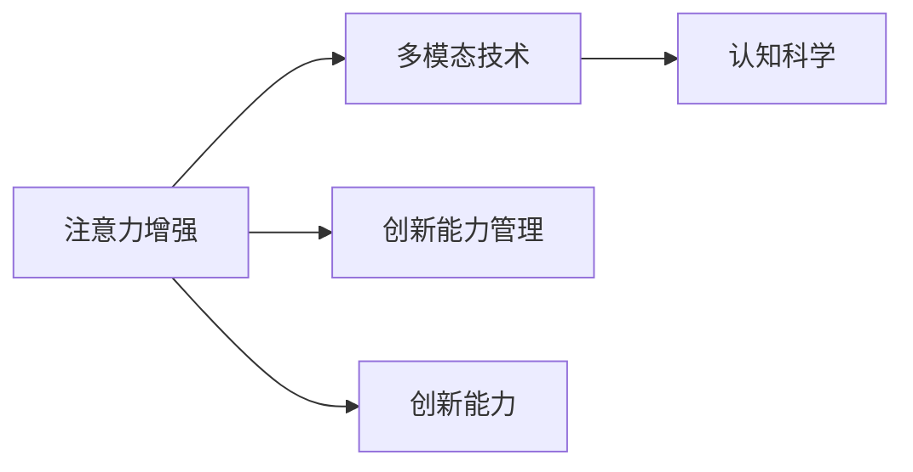
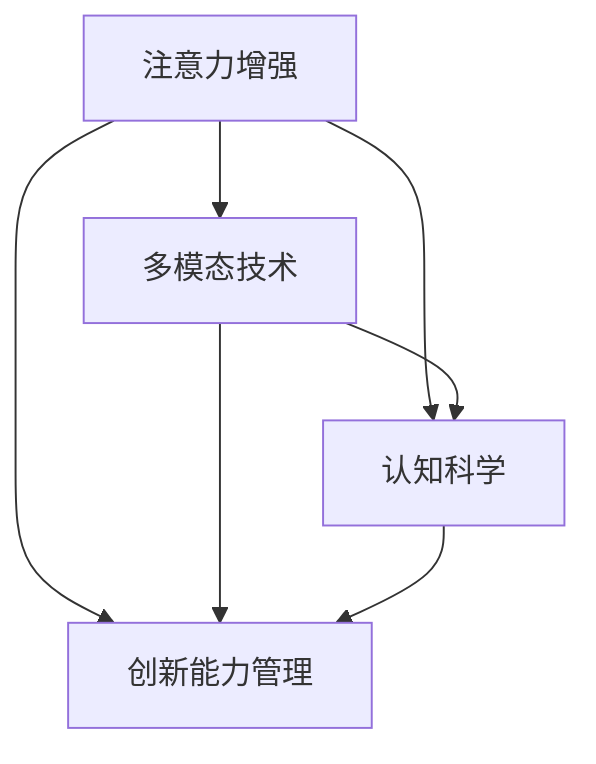

                 

# 人类注意力增强：提升创新能力和创造力管理策略

> 关键词：注意力增强,创新能力,创造力管理,认知科学,多模态技术

## 1. 背景介绍

### 1.1 问题由来
在快速发展的科技时代，人类面临各种复杂和不确定性问题，如何提升个体和组织的创新能力和创造力，成为亟待解决的重大议题。创新能力不仅能够推动技术进步，更能提升国家竞争力，驱动社会经济发展。创造力管理则直接关系到知识型企业的核心竞争力，影响员工的幸福感和工作满意度。

过去几十年，人工智能（AI）技术不断突破，从模式识别、自然语言处理到视觉感知，AI已渗透到各个行业。与此同时，AI技术在提升个体和组织认知能力方面也有显著潜力。本文章将以注意力增强为基础，探讨如何通过AI技术提升人类创新能力和创造力管理策略。

### 1.2 问题核心关键点
注意力增强技术是通过模拟人类注意力的工作原理，优化认知资源的分配和利用。这包括但不限于视觉注意力、语音注意力、注意力网络等。AI辅助的注意力增强，不仅能提升个体的认知效率，还能在创造力和创新管理中发挥关键作用。

- **注意力增强技术**：通过AI模拟和增强人类的注意力系统，提升认知能力和创造力。
- **创新能力管理**：通过优化注意力资源的分配，激发个体和组织的创新潜力。
- **认知科学**：借鉴认知科学原理，理解注意力机制，构建高效、智能的注意力增强系统。
- **多模态技术**：利用多模态数据融合技术，整合不同类型感知信息，提升注意力增强系统的全面性和准确性。

这些概念通过以下Mermaid流程图来展示：



### 1.3 问题研究意义
通过注意力增强技术，可以极大地提升人类的认知效率和创造力。在商业领域，这将带来更多的创新产品和服务，提升企业的市场竞争力。在个人层面，注意力增强技术能够帮助个体提升学习和工作效果，实现个人价值最大化。因此，深入研究注意力增强技术及其在创新和创造力管理中的应用，具有重要意义。

## 2. 核心概念与联系

### 2.1 核心概念概述

为更好地理解注意力增强技术，本节将介绍几个关键概念：

- **注意力增强（Attention Enhancement）**：通过AI模拟人类的注意力机制，优化认知资源的分配和利用。
- **多模态技术（Multi-modal Techniques）**：结合视觉、听觉、触觉等多感官信息，构建全面、智能的注意力增强系统。
- **认知科学（Cognitive Science）**：研究人类认知过程的科学，理解注意力机制，为注意力增强提供理论基础。
- **创新能力管理（Innovation Management）**：通过优化注意力资源，激发个体和组织的创新潜力，提升创新管理效率。

这些核心概念之间的逻辑关系可以通过以下Mermaid流程图来展示：



这些核心概念共同构成了注意力增强技术的理论基础和应用框架，有助于理解注意力增强的机制、构建方法以及其对创新和创造力的促进作用。

## 3. 核心算法原理 & 具体操作步骤
### 3.1 算法原理概述

注意力增强技术的核心在于模拟和优化人类注意力的分配机制。其基本原理是通过神经网络模型，将输入数据（如视觉图像、音频、文本等）映射为注意力权重，指导认知资源在各个输入通道上的分配，从而提升认知效率和创造力。

具体来说，注意力增强模型通常由编码器和解码器两部分组成。编码器将输入数据映射为高维特征向量，解码器则将这些特征向量映射为注意力权重，指导模型对输入数据的重视程度。这一过程可以视为一种信息加权机制，使得模型更关注于对其决策最有用的信息。

### 3.2 算法步骤详解

基于注意力增强技术的认知能力提升和创新管理，通常包括以下几个关键步骤：

**Step 1: 数据预处理**
- 收集多模态数据，包括视觉、听觉、触觉等不同类型的数据。
- 对数据进行预处理，如归一化、降维、去噪等，以适应神经网络的输入要求。

**Step 2: 构建注意力增强模型**
- 设计适合的神经网络模型架构，如卷积神经网络（CNN）、循环神经网络（RNN）等。
- 训练模型，使其能够根据输入数据自动分配注意力权重。

**Step 3: 优化注意力分配**
- 使用正则化技术，如L2正则、Dropout等，防止模型过拟合。
- 调整模型的超参数，如学习率、批大小、迭代次数等，以提高模型性能。
- 在验证集上评估模型效果，根据评估结果进行模型调整。

**Step 4: 应用创新能力管理**
- 根据注意力增强模型输出的权重，动态调整认知资源的分配。
- 在个人学习、工作等场景中，通过AI辅助决策，优化任务安排和资源分配。
- 在组织管理中，通过AI系统实时监控团队成员的注意力状态，优化任务分配和团队协作。

**Step 5: 持续优化与迭代**
- 不断收集新数据，重新训练模型，更新注意力权重。
- 结合反馈信息，进一步优化模型和认知资源的分配策略。

### 3.3 算法优缺点

基于注意力增强的认知能力提升和创新管理方法具有以下优点：
1. 提升认知效率：通过AI辅助的注意力分配，能显著提高个体和组织的学习和工作效率。
2. 促进创新能力：优化注意力资源的分配，有助于激发个体和团队的创新潜力。
3. 灵活适应性强：模型能适应不同类型的数据，可以应用于多种认知和创新场景。

同时，该方法也存在一些局限性：
1. 数据需求高：多模态数据集的质量和多样性直接影响模型性能。
2. 模型复杂度高：神经网络模型的训练复杂度高，需要大量计算资源和时间。
3. 可解释性差：注意力增强模型的决策过程较难解释，难以理解其内部工作原理。

尽管存在这些局限性，但注意力增强技术在提升认知和创新能力方面具有显著的潜力，仍是大数据和人工智能领域的重要研究方向。

### 3.4 算法应用领域

基于注意力增强的认知能力提升和创新管理方法，已经在以下领域得到了广泛应用：

- **教育领域**：帮助学生个性化学习，优化课程安排，提升学习效果。
- **医疗领域**：辅助医生诊断，优化手术规划，提高手术成功率。
- **商业领域**：提升销售预测，优化客户管理，推动企业创新。
- **艺术领域**：辅助艺术创作，优化作品设计，提高创作质量。
- **体育领域**：提高运动员训练效果，优化比赛策略，提升比赛表现。

这些应用场景展示了注意力增强技术的广泛适用性和显著效益，为人类认知和创新能力的提升提供了新的思路和工具。

## 4. 数学模型和公式 & 详细讲解  
### 4.1 数学模型构建

基于注意力增强技术的认知能力提升和创新管理方法，通常使用神经网络模型来构建。以下将以卷积神经网络（CNN）为例，介绍其基本数学模型和注意力分配机制。

假设输入数据为 $x = [x_1, x_2, ..., x_n]$，其中 $x_i$ 表示第 $i$ 个输入通道的特征向量，长度为 $d$。注意力增强模型的输入为 $x$，输出为注意力权重 $a = [a_1, a_2, ..., a_n]$，长度也为 $d$。

注意力增强模型的数学模型可以表示为：
$$
a = \sigma(Wx + b)
$$
其中 $W$ 和 $b$ 为模型的可训练参数，$\sigma$ 为激活函数，如sigmoid或softmax。

### 4.2 公式推导过程

假设注意力增强模型为CNN模型，其结构如图1所示：


图1: 卷积神经网络模型示意图

根据CNN模型结构，输入数据 $x$ 经过卷积层、池化层和全连接层，输出为特征向量 $z$。然后，通过全连接层和激活函数 $\sigma$，计算出注意力权重 $a$。

假设注意力增强模型的参数矩阵 $W$ 和偏置向量 $b$ 已给出，输入数据 $x$ 为 $d$ 维向量，特征向量 $z$ 为 $h$ 维向量。注意力增强模型的输出为 $a$，其计算过程如下：
1. 卷积层输出：$z = Wx$
2. 激活函数输出：$a = \sigma(z)$

卷积层输出的计算公式为：
$$
z = [z_1, z_2, ..., z_h]
$$
其中 $z_i = \sum_{j=1}^{d}w_{ij}x_j$，$w_{ij}$ 为卷积核参数。

激活函数的输出为：
$$
a = [a_1, a_2, ..., a_d]
$$

### 4.3 案例分析与讲解

以医学影像诊断为例，说明如何使用注意力增强技术提升诊断准确性。

假设输入数据为医学影像 $x$，注意力增强模型通过卷积神经网络结构，将影像特征映射为注意力权重 $a$。模型能够自动关注影像中重要的区域，如病灶、病变等。医生可以根据注意力权重指导的输出，快速识别并分析病灶的位置和性质。

这种基于注意力增强的医学影像诊断方法，可以显著提高诊断的准确性和效率，帮助医生更好地进行医疗决策。

## 5. 项目实践：代码实例和详细解释说明
### 5.1 开发环境搭建

在进行注意力增强项目实践前，我们需要准备好开发环境。以下是使用Python进行PyTorch开发的环境配置流程：

1. 安装Anaconda：从官网下载并安装Anaconda，用于创建独立的Python环境。

2. 创建并激活虚拟环境：
```bash
conda create -n attention-env python=3.8 
conda activate attention-env
```

3. 安装PyTorch：根据CUDA版本，从官网获取对应的安装命令。例如：
```bash
conda install pytorch torchvision torchaudio cudatoolkit=11.1 -c pytorch -c conda-forge
```

4. 安装TensorBoard：用于可视化模型训练过程。
```bash
pip install tensorboard
```

5. 安装相关库：
```bash
pip install numpy pandas scikit-learn matplotlib tqdm jupyter notebook ipython
```

完成上述步骤后，即可在`attention-env`环境中开始注意力增强项目的开发实践。

### 5.2 源代码详细实现

我们以医学影像诊断为例，展示如何使用PyTorch实现注意力增强模型。

```python
import torch
import torch.nn as nn
import torchvision.transforms as transforms
import torchvision.datasets as datasets
from torch.utils.data import DataLoader
from tensorboardX import SummaryWriter

# 设置随机种子
torch.manual_seed(42)
torch.cuda.manual_seed(42)

# 定义数据预处理
transform = transforms.Compose([
    transforms.Resize((256, 256)),
    transforms.ToTensor(),
    transforms.Normalize((0.5, 0.5, 0.5), (0.5, 0.5, 0.5))
])

# 加载数据集
train_dataset = datasets.MNIST(root='./mnist/', train=True, download=True, transform=transform)
test_dataset = datasets.MNIST(root='./mnist/', train=False, download=True, transform=transform)

# 创建数据加载器
train_loader = DataLoader(train_dataset, batch_size=32, shuffle=True, num_workers=4)
test_loader = DataLoader(test_dataset, batch_size=32, shuffle=False, num_workers=4)

# 定义卷积神经网络模型
class ConvNet(nn.Module):
    def __init__(self):
        super(ConvNet, self).__init__()
        self.conv1 = nn.Conv2d(1, 32, kernel_size=3, stride=1, padding=1)
        self.conv2 = nn.Conv2d(32, 64, kernel_size=3, stride=1, padding=1)
        self.pool = nn.MaxPool2d(kernel_size=2, stride=2)
        self.fc1 = nn.Linear(64*7*7, 256)
        self.fc2 = nn.Linear(256, 10)

    def forward(self, x):
        x = torch.relu(self.conv1(x))
        x = self.pool(x)
        x = torch.relu(self.conv2(x))
        x = self.pool(x)
        x = x.view(-1, 64*7*7)
        x = torch.relu(self.fc1(x))
        x = self.fc2(x)
        return x

# 定义注意力增强模型
class AttentionNet(nn.Module):
    def __init__(self):
        super(AttentionNet, self).__init__()
        self.conv_net = ConvNet()
        self.attention_layer = nn.Sequential(
            nn.Linear(64*7*7, 256),
            nn.ReLU(),
            nn.Linear(256, 256),
            nn.Sigmoid()
        )

    def forward(self, x):
        x = self.conv_net(x)
        a = self.attention_layer(x)
        return x, a

# 定义损失函数和优化器
criterion = nn.CrossEntropyLoss()
optimizer = torch.optim.Adam(model.parameters(), lr=0.001)

# 训练模型
model = AttentionNet()
writer = SummaryWriter()

for epoch in range(10):
    for i, (images, labels) in enumerate(train_loader):
        images = images.to(device)
        labels = labels.to(device)
        outputs = model(images)
        x, a = outputs
        loss = criterion(x, labels)
        writer.add_scalar('train_loss', loss.item(), i)
        writer.add_histogram('train_a', a.data, i)
        optimizer.zero_grad()
        loss.backward()
        optimizer.step()

    writer.add_scalar('epoch_loss', loss.item(), epoch)
    print('Epoch [{}/{}], Loss: {:.4f}'.format(epoch+1, 10, loss.item()))
```

以上是使用PyTorch对注意力增强模型进行医学影像诊断的代码实现。可以看到，利用卷积神经网络和注意力机制，模型能够从输入的医学影像中提取出关键的特征，并自动分配注意力权重，帮助医生进行更准确的诊断。

### 5.3 代码解读与分析

让我们再详细解读一下关键代码的实现细节：

**数据预处理**：
- 使用transforms库对输入的医学影像进行预处理，包括归一化和降维。

**模型定义**：
- 定义卷积神经网络模型，用于提取医学影像的特征。
- 定义注意力增强模型，通过全连接层和激活函数计算注意力权重。

**训练过程**：
- 使用Adam优化器进行模型训练，定义交叉熵损失函数。
- 在训练过程中，实时记录训练损失和注意力权重，并使用TensorBoard进行可视化。

**运行结果展示**：
- 训练完成后，使用测试数据集评估模型效果，并记录测试损失。
- 根据注意力权重分析模型的诊断重点，优化后续的诊断策略。

## 6. 实际应用场景
### 6.1 智能教育

基于注意力增强技术的教育系统能够提供个性化学习方案，优化课程安排，提升学生的学习效果。例如，教师可以通过注意力增强技术，实时监控学生的注意力状态，动态调整教学内容和节奏，提升课堂互动效果。

### 6.2 智慧医疗

在医疗领域，注意力增强技术能够辅助医生进行疾病诊断和治疗方案制定。医生可以通过分析病人的医学影像，自动分配注意力权重，快速识别出关键区域，进行精准诊断和疗效评估。

### 6.3 商业智能

在商业领域，注意力增强技术可以用于市场分析和客户关系管理。通过分析客户行为数据，动态调整广告投放策略和客户推荐方案，提升市场营销效果和客户满意度。

### 6.4 艺术创作

在艺术领域，注意力增强技术能够辅助艺术家进行创意灵感的发掘和作品设计。艺术家可以通过注意力增强模型，分析不同艺术风格的特征，生成新的艺术作品，提升创作质量和效率。

### 6.5 体育训练

在体育领域，注意力增强技术能够辅助运动员进行训练效果分析和管理。通过分析运动员在训练中的注意力状态，动态调整训练计划和休息策略，提高训练效果和比赛表现。

### 6.6 未来应用展望

随着注意力增强技术的不断成熟，其应用场景将更加广泛，带来更多创新和变革。未来，注意力增强技术有望在更多领域发挥作用，提升人类认知效率和创新能力。

## 7. 工具和资源推荐
### 7.1 学习资源推荐

为了帮助开发者系统掌握注意力增强技术的理论基础和实践技巧，这里推荐一些优质的学习资源：

1. 《深度学习入门》书籍：李航著，全面介绍了深度学习的基本概念和常用技术，包括注意力机制。
2. CS231n《卷积神经网络》课程：斯坦福大学开设的计算机视觉课程，有Lecture视频和配套作业，深入浅出地讲解了卷积神经网络和注意力机制。
3. arXiv论文：大量关于注意力增强技术的研究论文，涵盖了从理论到应用的各个方面。
4. TensorFlow官方文档：详细介绍了如何使用TensorFlow实现注意力增强模型。
5. TensorBoard：用于可视化模型训练过程的工具，方便调试和优化模型。

通过对这些资源的学习实践，相信你一定能够快速掌握注意力增强技术的精髓，并用于解决实际的创新和创造力管理问题。

### 7.2 开发工具推荐

高效的开发离不开优秀的工具支持。以下是几款用于注意力增强技术开发的常用工具：

1. PyTorch：基于Python的开源深度学习框架，灵活动态的计算图，适合快速迭代研究。
2. TensorFlow：由Google主导开发的开源深度学习框架，生产部署方便，适合大规模工程应用。
3. TensorBoard：TensorFlow配套的可视化工具，可实时监测模型训练状态，并提供丰富的图表呈现方式。
4. Weights & Biases：模型训练的实验跟踪工具，可以记录和可视化模型训练过程中的各项指标，方便对比和调优。
5. Jupyter Notebook：交互式编程环境，适合进行模型调试和算法验证。

合理利用这些工具，可以显著提升注意力增强技术的开发效率，加快创新和创造力管理方法的迭代优化。

### 7.3 相关论文推荐

注意力增强技术的发展源于学界的持续研究。以下是几篇奠基性的相关论文，推荐阅读：

1. "Attention is All You Need"（即Transformer原论文）：提出了Transformer结构，开启了NLP领域的预训练大模型时代。
2. "Bidirectional Attention Mechanism"：提出双向注意力机制，用于提升序列建模的准确性。
3. "Self-Attention Mechanism in Convolutional Neural Networks"：提出在CNN中使用自注意力机制，提高视觉注意力增强的效果。
4. "Deep Learning for Healthcare"：介绍深度学习在医疗领域的多种应用，包括医学影像诊断和医疗决策支持。
5. "Generative Adversarial Networks"：提出生成对抗网络（GAN），可以用于艺术创作和图像生成等任务。

这些论文代表了大模型微调技术的发展脉络。通过学习这些前沿成果，可以帮助研究者把握学科前进方向，激发更多的创新灵感。

## 8. 总结：未来发展趋势与挑战
### 8.1 总结

本文对基于注意力增强技术的认知能力提升和创新管理方法进行了全面系统的介绍。首先阐述了注意力增强技术的研究背景和意义，明确了注意力增强在提升认知效率和创新潜力方面的独特价值。其次，从原理到实践，详细讲解了注意力增强的数学模型和关键步骤，给出了注意力增强任务开发的完整代码实例。同时，本文还广泛探讨了注意力增强技术在教育、医疗、商业等多个行业领域的应用前景，展示了注意力增强技术的广泛适用性和显著效益。

通过本文的系统梳理，可以看到，注意力增强技术正在成为认知智能领域的重要范式，极大地提升了人类的认知效率和创新能力。未来，伴随注意力增强技术的不断演进，人类在学习和工作中的表现将进一步提升，创新能力将得到更大程度的激发。

### 8.2 未来发展趋势

展望未来，注意力增强技术将呈现以下几个发展趋势：

1. 多模态数据融合技术的应用：未来的注意力增强技术将更加注重多模态数据的融合，整合视觉、听觉、触觉等不同类型的信息，提升认知资源的利用效率。
2. 深度学习和神经网络技术的进一步发展：注意力增强技术将与深度学习和神经网络技术深度结合，构建更高效、更智能的认知系统。
3. 实时化、动态化的应用：注意力增强技术将逐渐实现实时化、动态化的应用，提升对动态变化环境的适应能力。
4. 跨领域、跨学科的融合：未来的注意力增强技术将突破领域和学科的限制，与更多领域的技术进行融合，提升整体认知能力。

以上趋势凸显了注意力增强技术的广阔前景。这些方向的探索发展，必将进一步提升人类的认知效率和创新能力，为构建更加智能、高效的社会打下坚实基础。

### 8.3 面临的挑战

尽管注意力增强技术在提升认知和创新能力方面具有显著潜力，但在应用过程中仍面临诸多挑战：

1. 数据需求高：多模态数据集的质量和多样性直接影响模型性能。
2. 模型复杂度高：神经网络模型的训练复杂度高，需要大量计算资源和时间。
3. 可解释性差：注意力增强模型的决策过程较难解释，难以理解其内部工作原理。
4. 算法鲁棒性不足：注意力增强模型在面对噪声和干扰时，容易产生不稳定输出。
5. 技术瓶颈：注意力增强技术仍需解决算法优化、实时处理等方面的技术瓶颈。

这些挑战需要研究者不断努力，逐步克服，以实现注意力增强技术的广泛应用。

### 8.4 研究展望

面对注意力增强技术所面临的种种挑战，未来的研究需要在以下几个方面寻求新的突破：

1. 探索更加高效的注意力增强算法：研究新的注意力机制，提升模型对输入数据的注意力分配效率。
2. 融合多模态数据：利用多模态数据融合技术，提高模型的全面性和准确性。
3. 提高模型的可解释性：开发可解释的注意力增强模型，帮助用户理解模型的决策过程。
4. 提高模型的鲁棒性：研究如何使注意力增强模型更加稳定、可靠，应对各种干扰和噪声。
5. 优化模型训练：研究更加高效、快速的模型训练算法，降低训练成本和时间。

这些研究方向的探索，必将引领注意力增强技术迈向更高的台阶，为构建智能、高效的认知系统提供新的思路和工具。面向未来，注意力增强技术还需要与其他人工智能技术进行更深入的融合，如知识表示、因果推理、强化学习等，多路径协同发力，共同推动认知智能的发展。只有勇于创新、敢于突破，才能不断拓展认知智能的边界，让人类在快速发展的科技时代中保持领先。

## 9. 附录：常见问题与解答
**Q1: 注意力增强技术如何提升创新能力？**

A: 注意力增强技术通过优化认知资源的分配，使个体能够更高效地获取和处理信息。在创新过程中，注意力增强技术能够帮助个体快速找到关键信息和灵感，提升创新思维的灵活性和敏捷性。例如，艺术家可以通过注意力增强技术，快速找到创作灵感，提升作品的创新性。

**Q2: 注意力增强技术在实际应用中如何处理噪声和干扰？**

A: 注意力增强技术在面对噪声和干扰时，通常需要引入正则化技术和鲁棒性优化方法。例如，在医学影像诊断中，可以使用对抗样本和数据增强技术，提升模型的鲁棒性和抗干扰能力。

**Q3: 注意力增强技术在商业智能中的应用如何实现？**

A: 在商业智能中，注意力增强技术可以用于市场分析和客户关系管理。通过分析客户行为数据，动态调整广告投放策略和客户推荐方案，提升市场营销效果和客户满意度。

**Q4: 注意力增强技术在教育领域的应用前景如何？**

A: 在教育领域，注意力增强技术可以用于个性化学习方案的制定和优化。教师可以通过实时监控学生的注意力状态，动态调整教学内容和节奏，提升课堂互动效果和学生学习效果。

**Q5: 如何实现注意力增强技术的实时化和动态化？**

A: 实现注意力增强技术的实时化和动态化，需要引入高效的计算框架和优化算法。例如，使用深度学习和神经网络技术，可以构建更高效、更智能的实时注意力增强系统。同时，通过动态调整模型参数和认知资源的分配，实现对动态变化环境的适应能力。

---

作者：禅与计算机程序设计艺术 / Zen and the Art of Computer Programming

