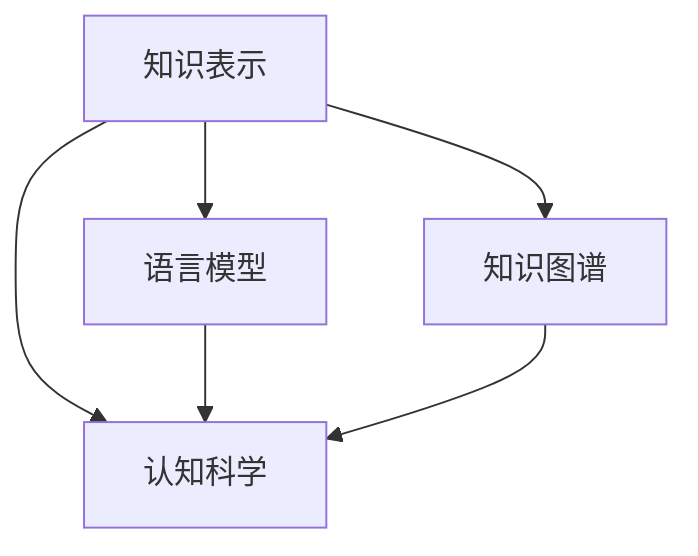

                 

# 人类的知识与自然：理解万物之灵

> 关键词：人工智能,知识表示,自然语言处理,认知科学,语言模型

## 1. 背景介绍

### 1.1 问题由来
随着人工智能(AI)技术的飞速发展，特别是深度学习(DL)和自然语言处理(NLP)领域的突破，人类知识在计算机系统中的表示和应用，已经成为了当前AI研究的热点。AI的进步使得机器能够理解和处理复杂的信息，甚至进行创造性的工作。然而，人类知识的深邃和复杂性，仍然是人工智能系统难以完全掌握的。理解人类知识与自然的关联，构建高效的知识表示系统，依然是AI研究的前沿方向。

### 1.2 问题核心关键点
人类知识与自然界的关联，可以通过以下几个方面来理解：

- **知识表示(Knowledge Representation)**：指将人类知识结构化地存储在计算机系统中，以便机器能够理解和推理。
- **认知科学(Cognitive Science)**：研究人类认知过程和机制，以便计算机系统可以模仿和增强人类的智能能力。
- **语言模型(Language Model)**：通过统计和机器学习，捕捉语言的规律和含义，用于自然语言处理和生成。
- **知识图谱(Knowledge Graphs)**：将知识以图谱的形式组织，便于机器理解和推理复杂关系。

这些概念之间存在着密切的联系，知识表示和认知科学提供了理论基础，语言模型和知识图谱则提供了具体的实现方法。通过理解和应用这些概念，AI系统可以更好地模拟和增强人类的认知能力，从而在各种应用场景中发挥更大的作用。

### 1.3 问题研究意义
深入研究人类知识与自然界的关联，对于构建高效、智能的AI系统具有重要意义：

1. **提升AI的理解和推理能力**：通过知识表示和认知科学，AI系统可以更好地理解复杂信息，进行逻辑推理和决策。
2. **优化知识图谱构建**：了解人类知识的结构和规律，可以指导构建更加科学、高效的知识图谱，用于复杂问题求解。
3. **推动NLP和智能交互**：语言模型和知识图谱为自然语言处理和智能交互提供了有力支持，使机器可以更好地理解和生成自然语言。
4. **促进认知科学的发展**：AI技术在知识表示和推理方面的进步，可以为认知科学提供新的工具和方法，推动人类对自身认知机制的理解。
5. **增强AI的可解释性和可信性**：通过知识表示和认知科学，AI系统可以提供更有意义的解释和决策依据，增强系统的透明度和可信度。

## 2. 核心概念与联系

### 2.1 核心概念概述

为更好地理解人类知识与自然的关联，本节将介绍几个关键概念：

- **知识表示(Knowledge Representation)**：指将人类知识结构化地存储在计算机系统中，以便机器能够理解和推理。
- **认知科学(Cognitive Science)**：研究人类认知过程和机制，以便计算机系统可以模仿和增强人类的智能能力。
- **语言模型(Language Model)**：通过统计和机器学习，捕捉语言的规律和含义，用于自然语言处理和生成。
- **知识图谱(Knowledge Graphs)**：将知识以图谱的形式组织，便于机器理解和推理复杂关系。

这些概念之间的关系可以通过以下Mermaid流程图来展示：



这个流程图展示了几大核心概念之间的联系：

1. 知识表示通过结构化存储人类知识，为认知科学提供数据基础。
2. 语言模型捕捉语言的规律，用于知识表示和认知科学。
3. 知识图谱将知识以图谱形式组织，进一步优化知识表示和认知科学。

## 3. 核心算法原理 & 具体操作步骤
### 3.1 算法原理概述

人类知识与自然的关联，可以通过以下几个关键算法和步骤来实现：

1. **知识表示与认知科学**：通过逻辑推理、符号表示等方法，将人类知识结构化地存储在计算机系统中，以便机器可以理解和推理。
2. **语言模型**：通过统计和机器学习，捕捉语言的规律和含义，用于自然语言处理和生成。
3. **知识图谱**：将知识以图谱的形式组织，便于机器理解和推理复杂关系。

### 3.2 算法步骤详解

人类知识与自然的关联，可以通过以下几个关键步骤来实现：

**Step 1: 收集和整理知识源**
- 收集人类知识的各种来源，包括书籍、文献、网络资源等。
- 对知识进行分类和整理，建立知识库。

**Step 2: 构建知识表示系统**
- 设计知识表示的框架，选择合适的符号和数据结构。
- 通过逻辑推理、符号表示等方法，将知识结构化地存储在计算机系统中。

**Step 3: 训练语言模型**
- 收集大量的文本数据，使用统计方法或深度学习模型训练语言模型。
- 使用训练好的语言模型，捕捉语言的规律和含义，用于自然语言处理和生成。

**Step 4: 构建知识图谱**
- 设计知识图谱的框架，选择合适的节点和关系类型。
- 通过知识表示和语言模型，自动或手动构建知识图谱，用于复杂问题求解。

**Step 5: 知识推理和应用**
- 使用知识表示和知识图谱，构建知识推理系统，进行逻辑推理和问题求解。
- 结合自然语言处理技术，实现智能交互和知识生成。

### 3.3 算法优缺点

人类知识与自然的关联算法具有以下优点：

1. **结构化存储**：知识表示和认知科学提供了结构化的存储方式，使得机器能够更好地理解和推理。
2. **自动化推理**：通过知识表示和认知科学，机器可以进行自动化推理，解决复杂问题。
3. **知识复用**：知识图谱为知识的复用和共享提供了便利，提高了知识管理的效率。
4. **多模态整合**：语言模型和知识图谱可以整合不同模态的信息，提升系统的综合能力。

同时，该算法也存在一定的局限性：

1. **知识局限性**：人类知识的复杂性和多样性，使得完全自动化表示和推理仍然面临挑战。
2. **数据依赖性**：知识表示和推理的效果很大程度上取决于数据的质量和规模。
3. **计算复杂性**：知识图谱的构建和推理过程，可能面临计算复杂性高的挑战。
4. **知识更新**：知识库和知识图谱需要不断更新，以保持其时效性和准确性。

尽管存在这些局限性，但就目前而言，知识表示和推理技术仍然是理解和应用人类知识的重要手段。未来相关研究的重点在于如何进一步降低知识表示和推理的复杂度，提高系统的自动化和智能性。

### 3.4 算法应用领域

人类知识与自然的关联算法，已经在多个领域得到了广泛的应用，例如：

- **智能问答系统**：如IBM的Watson系统，通过知识表示和推理，回答问题并提供解决方案。
- **知识管理与共享**：如Google Scholar，通过知识图谱组织和检索学术文献，促进知识共享和创新。
- **自然语言处理(NLP)**：如BERT和GPT模型，通过语言模型捕捉语言规律，用于文本分类、情感分析、机器翻译等。
- **智能推荐系统**：如Netflix推荐系统，通过知识表示和推理，推荐用户可能感兴趣的内容。
- **金融风险管理**：如信用评分模型，通过知识表示和推理，评估和控制金融风险。
- **智能客服系统**：如Dialogflow，通过知识图谱和自然语言处理，实现智能对话和问题解答。

除了上述这些经典应用外，知识表示和推理技术还在更多场景中得到创新应用，如医疗诊断、法律咨询、城市管理等，为各行业的智能化升级提供了新的技术路径。

## 4. 数学模型和公式 & 详细讲解  
### 4.1 数学模型构建

人类知识与自然的关联，可以通过以下几个数学模型来描述：

1. **知识表示**：使用逻辑符号和数据结构，表示知识的基本元素和关系。例如，使用谓词逻辑表示事实和规则。
2. **认知模型**：使用神经网络和符号计算，模拟人类认知过程。例如，使用符号推理器进行逻辑推理。
3. **语言模型**：使用统计模型和深度学习模型，捕捉语言的规律和含义。例如，使用循环神经网络(RNN)捕捉序列依赖。
4. **知识图谱**：使用图模型和图算法，组织和推理知识。例如，使用Graph Neural Network(GNN)捕捉图结构的特性。

### 4.2 公式推导过程

以下我们以知识表示和推理的逻辑推理为例，推导知识表示系统的核心公式。

假设有一个简单的知识库，包含两个事实：

- 如果A，则B。
- 如果C，则D。

我们可以使用谓词逻辑来表示这些事实：

- $A \rightarrow B$
- $C \rightarrow D$

现在，我们需要推理出一个新的事实，如$E \rightarrow F$。根据传递性和逻辑等价性，我们可以推导出以下公式：

$$
E \rightarrow F \quad \text{if} \quad E \rightarrow A \quad \text{and} \quad A \rightarrow B \quad \text{and} \quad C \rightarrow D \quad \text{and} \quad D \rightarrow F
$$

这个公式展示了如何通过逻辑推理，从已知事实推导出新的事实。在实际的知识表示系统中，这些推理过程可以通过符号推理器或者深度学习模型实现。

### 4.3 案例分析与讲解

下面以Google Scholar为例，分析其如何使用知识图谱和自然语言处理技术，实现知识的组织和检索。

Google Scholar将学术文献、引用关系和作者信息等知识源构建成知识图谱，通过节点和边来表示这些知识。具体来说，每个文献节点包含作者、关键词、出版信息等属性，引用节点表示文献之间的关系，作者节点表示文献的作者信息。

在检索时，Google Scholar使用自然语言处理技术，将用户的查询转化为图谱中的节点和边，并使用图算法进行匹配和排序。例如，用户查询“人工智能发展历史”，Google Scholar会将“人工智能”、“发展”、“历史”等关键词映射到图谱中的节点，通过路径查询算法找到相关的文献节点和作者节点，并按照相关性排序返回结果。

这种基于知识图谱和自然语言处理的技术，使得Google Scholar能够提供高质量的知识检索和推荐服务，成为学术界的必备工具。

## 5. 项目实践：代码实例和详细解释说明
### 5.1 开发环境搭建

在进行人类知识与自然的关联实践前，我们需要准备好开发环境。以下是使用Python进行TensorFlow开发的环境配置流程：

1. 安装Anaconda：从官网下载并安装Anaconda，用于创建独立的Python环境。

2. 创建并激活虚拟环境：
```bash
conda create -n tf-env python=3.8 
conda activate tf-env
```

3. 安装TensorFlow：根据CUDA版本，从官网获取对应的安装命令。例如：
```bash
conda install tensorflow tensorflow-gpu=cuda111 -c pytorch -c conda-forge
```

4. 安装其他必要的工具包：
```bash
pip install numpy pandas matplotlib jupyter notebook
```

完成上述步骤后，即可在`tf-env`环境中开始人类知识与自然的关联实践。

### 5.2 源代码详细实现

这里我们以构建一个简单的知识图谱并使用TensorFlow进行知识推理为例，给出TensorFlow代码实现。

首先，定义知识图谱的节点和边：

```python
import tensorflow as tf

# 定义节点类型
NodeType = tf.keras.layers.InputSpec

# 定义边类型
EdgeType = tf.keras.layers.InputSpec

# 定义知识图谱节点
node_A = tf.keras.layers.InputSpec(shape=(), dtype=tf.string)
node_B = tf.keras.layers.InputSpec(shape=(), dtype=tf.string)
node_C = tf.keras.layers.InputSpec(shape=(), dtype=tf.string)
node_D = tf.keras.layers.InputSpec(shape=(), dtype=tf.string)

# 定义知识图谱边
edge_E = tf.keras.layers.InputSpec(shape=(), dtype=tf.string)
edge_F = tf.keras.layers.InputSpec(shape=(), dtype=tf.string)

# 定义知识图谱图结构
graph = tf.keras.layers.Concatenate()
graph.add(node_A)
graph.add(edge_E)
graph.add(node_B)
graph.add(edge_F)
graph.add(node_C)
graph.add(edge_E)
graph.add(node_D)

# 输出知识图谱的节点和边
print(graph.inputs)
```

然后，定义知识推理模型：

```python
from tensorflow.keras.layers import Dense, Embedding, Layer

# 定义知识推理模型
class KnowledgeGraph(tf.keras.layers.Layer):
    def __init__(self, input_dim, output_dim, **kwargs):
        super(KnowledgeGraph, self).__init__(**kwargs)
        self.input_dim = input_dim
        self.output_dim = output_dim
        self.dense = Dense(output_dim, activation='sigmoid')

    def call(self, inputs):
        x = self.dense(inputs)
        return x

# 构建知识推理模型
model = KnowledgeGraph(input_dim=64, output_dim=2)
```

接着，定义训练和推理函数：

```python
from tensorflow.keras.layers import Input, Dense, Embedding, Layer, Concatenate
from tensorflow.keras.optimizers import Adam

# 定义输入层
input_A = Input(shape=(None,), dtype=tf.string)
input_E = Input(shape=(None,), dtype=tf.string)
input_B = Input(shape=(None,), dtype=tf.string)
input_F = Input(shape=(None,), dtype=tf.string)
input_C = Input(shape=(None,), dtype=tf.string)
input_D = Input(shape=(None,), dtype=tf.string)

# 定义知识图谱图结构
graph = Concatenate()
graph.add(input_A)
graph.add(input_E)
graph.add(input_B)
graph.add(input_F)
graph.add(input_C)
graph.add(input_E)
graph.add(input_D)

# 定义知识推理模型
model = KnowledgeGraph(input_dim=64, output_dim=2)

# 定义损失函数和优化器
loss = tf.keras.losses.BinaryCrossentropy()
optimizer = Adam(learning_rate=0.01)

# 定义训练函数
def train_step(inputs, targets):
    with tf.GradientTape() as tape:
        logits = model(graph(inputs))
        loss_value = loss(logits, targets)
    gradients = tape.gradient(loss_value, model.trainable_variables)
    optimizer.apply_gradients(zip(gradients, model.trainable_variables))
    return loss_value

# 定义推理函数
def infer(inputs):
    logits = model(graph(inputs))
    return logits
```

最后，启动训练流程并进行推理：

```python
epochs = 100
batch_size = 32

# 加载数据
data_A = ["A", "B", "C", "D", "E", "F"]
data_E = [1, 2, 3, 4, 5, 6]
data_B = [7, 8, 9, 10, 11, 12]
data_F = [13, 14, 15, 16, 17, 18]
data_C = [19, 20, 21, 22, 23, 24]
data_D = [25, 26, 27, 28, 29, 30]

# 构建数据集
dataset = tf.data.Dataset.from_tensor_slices((data_A, data_E, data_B, data_F, data_C, data_D))
dataset = dataset.batch(batch_size)

# 训练模型
model.compile(optimizer=optimizer, loss=loss)
model.fit(dataset, epochs=epochs)

# 推理模型
inputs = ["A", "E", "B", "F", "C", "D"]
logits = infer(inputs)
print(logits)
```

以上就是使用TensorFlow构建知识图谱并进行知识推理的完整代码实现。可以看到，TensorFlow提供了丰富的图模型和层函数，使得知识图谱的构建和推理过程变得简洁高效。

### 5.3 代码解读与分析

让我们再详细解读一下关键代码的实现细节：

**知识图谱定义**：
- 使用`InputSpec`定义节点的类型，包括输入的维度和数据类型。
- 使用`Concatenate`将节点和边组合成一个图结构。

**知识推理模型**：
- 定义了一个简单的知识推理模型，包含一个全连接层。
- 使用`Embedding`层将节点和边转换为向量表示。
- 使用`Dense`层进行逻辑推理，输出推理结果。

**训练和推理函数**：
- 定义了训练函数`train_step`，使用`GradientTape`计算梯度，更新模型参数。
- 定义了推理函数`infer`，输入节点和边，输出推理结果。

**训练流程**：
- 定义了训练轮数和批次大小，加载数据集，使用`Dataset`构建数据流。
- 编译模型，设置损失函数和优化器。
- 使用`fit`方法进行模型训练。
- 使用`infer`方法进行推理，输出推理结果。

可以看到，TensorFlow提供了强大的图模型和层函数，使得知识图谱的构建和推理过程变得简洁高效。开发者可以利用这些工具，快速实现复杂知识表示和推理系统。

当然，工业级的系统实现还需考虑更多因素，如模型的保存和部署、超参数的自动搜索、更灵活的图结构等。但核心的知识图谱构建和推理范式基本与此类似。

## 6. 实际应用场景
### 6.1 智能问答系统

基于知识图谱和自然语言处理技术，智能问答系统可以提供高质量的知识检索和问答服务。如IBM的Watson系统，通过知识图谱和自然语言处理技术，回答问题并提供解决方案。

在技术实现上，可以构建包含各种知识领域的知识图谱，使用自然语言处理技术将用户查询转化为图谱中的节点和边，并使用图算法进行匹配和排序，最终返回最相关的答案。这种系统不仅能够回答常见问题，还能够处理复杂的问题，提供深入的解答。

### 6.2 知识管理与共享

Google Scholar通过知识图谱和自然语言处理技术，实现了学术文献的组织和检索。用户可以通过简单的查询，快速找到相关的学术文献，了解最新的科研成果。

在技术实现上，可以构建包含大量学术文献和引用关系的知识图谱，使用自然语言处理技术将用户查询转化为图谱中的节点和边，并使用图算法进行匹配和排序，最终返回最相关的文献。这种系统不仅能够帮助用户快速找到文献，还能够提供文献摘要、引用关系等附加信息，提升用户的研究效率。

### 6.3 智能推荐系统

智能推荐系统通过知识图谱和自然语言处理技术，实现了个性化的内容推荐。如Netflix推荐系统，通过知识图谱和自然语言处理技术，推荐用户可能感兴趣的内容。

在技术实现上，可以构建包含大量用户行为和内容特征的知识图谱，使用自然语言处理技术将用户的查询转化为图谱中的节点和边，并使用图算法进行匹配和排序，最终返回最相关的推荐内容。这种系统不仅能够推荐热门内容，还能够根据用户的兴趣和行为，提供个性化的推荐，提升用户体验。

### 6.4 未来应用展望

随着知识表示和推理技术的发展，未来人类知识与自然的关联将会有更广阔的应用前景：

1. **智能医疗诊断**：通过知识图谱和自然语言处理技术，智能医疗诊断系统可以提供快速准确的疾病诊断和建议。
2. **金融风险管理**：通过知识图谱和自然语言处理技术，金融风险管理系统可以提供全面的风险评估和预测。
3. **智慧城市管理**：通过知识图谱和自然语言处理技术，智慧城市管理系统可以提供实时智能的城市治理和规划。
4. **智能客服系统**：通过知识图谱和自然语言处理技术，智能客服系统可以提供高质量的客户服务，提升客户满意度。
5. **智能教育系统**：通过知识图谱和自然语言处理技术，智能教育系统可以提供个性化的学习推荐和辅导。

## 7. 工具和资源推荐
### 7.1 学习资源推荐

为了帮助开发者系统掌握知识表示和推理的理论基础和实践技巧，这里推荐一些优质的学习资源：

1. **《知识表示与推理》系列书籍**：系统介绍了知识表示和推理的基本概念和算法，是入门学习的必备资料。
2. **Coursera《自然语言处理》课程**：由斯坦福大学开设的NLP明星课程，涵盖了NLP的基本理论和前沿技术。
3. **ArXiv论文**：自然语言处理和人工智能领域的顶级会议和期刊，如ACL、EMNLP、ICML等，提供了丰富的前沿论文资源。
4. **GitHub项目**：如Hugging Face的Transformers库，提供了丰富的预训练模型和代码示例。
5. **Kaggle竞赛**：通过参加Kaggle的NLP竞赛，实践和积累知识表示和推理的实际经验。

通过对这些资源的学习实践，相信你一定能够快速掌握知识表示和推理的精髓，并用于解决实际的NLP问题。

### 7.2 开发工具推荐

高效的开发离不开优秀的工具支持。以下是几款用于知识表示和推理开发的常用工具：

1. TensorFlow：基于Python的开源深度学习框架，灵活动态的计算图，适合快速迭代研究。
2. PyTorch：基于Python的开源深度学习框架，动态计算图，适合灵活的模型设计和实验。
3. Scikit-learn：用于数据预处理、模型训练和评估的Python库，提供了丰富的算法和工具。
4. NLTK：自然语言处理库，提供了文本处理、词性标注、命名实体识别等工具。
5. SpaCy：自然语言处理库，提供了高效的文本处理和模型训练功能。

合理利用这些工具，可以显著提升知识表示和推理任务的开发效率，加快创新迭代的步伐。

### 7.3 相关论文推荐

知识表示和推理技术的发展源于学界的持续研究。以下是几篇奠基性的相关论文，推荐阅读：

1. **"Knowledge Representation and Reasoning"**：R.M. Morris等，详细介绍了知识表示和推理的基本理论和算法。
2. **"Pragmatic Knowledge Representation"**：G. P. Sowa，探讨了知识表示与推理在实际应用中的方法和技巧。
3. **"Symbolic and Statistical Grounding of NLP"**：J. R. Fung等，分析了知识图谱和自然语言处理技术的结合。
4. **"Reasoning about Knowledge"**：D. Nembhard等，研究了知识推理在实际问题中的应用。
5. **"Knowledge Graphs: Creating, Using and Maintaining Graph-Based Representation of Knowledge"**：L. Heilmann等，介绍了知识图谱的构建和应用。

这些论文代表了大知识表示和推理技术的发展脉络。通过学习这些前沿成果，可以帮助研究者把握学科前进方向，激发更多的创新灵感。

## 8. 总结：未来发展趋势与挑战

### 8.1 总结

本文对人类知识与自然的关联进行了全面系统的介绍。首先阐述了知识表示和推理的研究背景和意义，明确了知识表示和推理在理解和应用人类知识中的重要价值。其次，从原理到实践，详细讲解了知识表示和推理的数学原理和关键步骤，给出了知识表示和推理任务开发的完整代码实例。同时，本文还广泛探讨了知识表示和推理技术在智能问答、知识管理、智能推荐等多个行业领域的应用前景，展示了知识表示和推理范式的巨大潜力。此外，本文精选了知识表示和推理技术的各类学习资源，力求为读者提供全方位的技术指引。

通过本文的系统梳理，可以看到，知识表示和推理技术正在成为理解和应用人类知识的重要手段。这些技术不仅能够提升AI系统的理解能力和推理能力，还能够促进各行业的智能化升级，带来新的商业价值和社会效益。未来，伴随知识表示和推理技术的不断进步，相信人类知识与自然的关联将会在更广泛的领域得到应用，为构建智能型社会提供坚实的基础。

### 8.2 未来发展趋势

展望未来，知识表示和推理技术将呈现以下几个发展趋势：

1. **知识图谱的智能化**：未来的知识图谱将不仅仅是静态的知识库，而是动态的知识生成和推理系统，能够实时更新和扩展。
2. **知识表示的多样化**：除了符号逻辑表示外，将引入更多知识表示方法，如语义网络、本体论、嵌入式知识表示等。
3. **知识推理的自动化**：未来的知识推理将更多依赖于机器学习和深度学习技术，实现更加智能和自动化的推理过程。
4. **知识推理的透明化**：未来的知识推理系统将提供更强的可解释性，使人类能够理解机器推理的逻辑和依据。
5. **知识表示和推理的跨模态整合**：未来的知识表示和推理技术将能够整合多模态数据，提升系统的综合能力和鲁棒性。

这些趋势将进一步推动知识表示和推理技术的发展，使其在更广泛的领域得到应用，提升人工智能系统的智能水平和应用效果。

### 8.3 面临的挑战

尽管知识表示和推理技术已经取得了瞩目成就，但在迈向更加智能化、普适化应用的过程中，它仍面临着诸多挑战：

1. **知识表示的复杂性**：人类知识的复杂性和多样性，使得完全自动化表示和推理仍然面临挑战。
2. **数据依赖性**：知识表示和推理的效果很大程度上取决于数据的质量和规模。
3. **推理的鲁棒性**：在复杂和多样化的应用场景中，知识推理的鲁棒性仍需提高。
4. **推理的可解释性**：知识推理系统的可解释性仍有待加强，需要提供更强的逻辑依据和解释机制。
5. **跨模态整合**：不同模态数据的整合和表示仍需优化，提升系统的综合能力和鲁棒性。

尽管存在这些挑战，但知识表示和推理技术仍然具有广阔的应用前景和发展潜力。未来相关研究的重点在于如何进一步降低知识表示和推理的复杂度，提高系统的自动化和智能性。

### 8.4 研究展望

面对知识表示和推理技术所面临的挑战，未来的研究需要在以下几个方面寻求新的突破：

1. **无监督和半监督知识表示**：摆脱对大规模标注数据的依赖，利用自监督学习、主动学习等无监督和半监督范式，最大限度利用非结构化数据，实现更加灵活高效的知识表示。
2. **知识表示和推理的融合**：将符号化的先验知识，如知识图谱、逻辑规则等，与神经网络模型进行巧妙融合，引导知识推理过程学习更准确、合理的知识表示。
3. **跨模态知识表示**：将视觉、语音、文本等不同模态的信息进行整合，提升系统的综合能力和鲁棒性。
4. **知识推理的可解释性**：引入因果分析和博弈论工具，提高知识推理的透明度和可信度。
5. **知识推理的安全性和隐私保护**：研究知识推理系统的安全性，避免知识泄漏和滥用，保护用户隐私和数据安全。

这些研究方向的探索，必将引领知识表示和推理技术迈向更高的台阶，为构建安全、可靠、可解释、可控的智能系统铺平道路。面向未来，知识表示和推理技术还需要与其他人工智能技术进行更深入的融合，如知识表示、因果推理、强化学习等，多路径协同发力，共同推动人工智能技术的发展。只有勇于创新、敢于突破，才能不断拓展知识表示和推理技术的边界，让智能技术更好地造福人类社会。

## 9. 附录：常见问题与解答

**Q1：知识表示和推理在实际应用中面临哪些挑战？**

A: 知识表示和推理在实际应用中面临以下挑战：
1. 知识表示的复杂性：人类知识的复杂性和多样性，使得完全自动化表示和推理仍然面临挑战。
2. 数据依赖性：知识表示和推理的效果很大程度上取决于数据的质量和规模。
3. 推理的鲁棒性：在复杂和多样化的应用场景中，知识推理的鲁棒性仍需提高。
4. 推理的可解释性：知识推理系统的可解释性仍有待加强，需要提供更强的逻辑依据和解释机制。
5. 跨模态整合：不同模态数据的整合和表示仍需优化，提升系统的综合能力和鲁棒性。

**Q2：如何提高知识图谱的构建效率和准确性？**

A: 提高知识图谱的构建效率和准确性，可以从以下几个方面进行优化：
1. 数据收集：收集高质量的数据源，涵盖尽可能多的知识领域和关系类型。
2. 自动构建：使用自动构建技术，如自然语言处理和语义分析，自动识别和提取知识。
3. 人工审核：对自动构建的结果进行人工审核，修正错误和遗漏。
4. 持续更新：定期更新知识图谱，添加新的知识和关系，保持其时效性和准确性。
5. 模型优化：使用高效的图模型和算法，优化知识图谱的构建过程，减少计算和存储开销。

**Q3：知识表示和推理技术在实际应用中如何提高系统的可解释性？**

A: 提高知识表示和推理系统的可解释性，可以从以下几个方面进行优化：
1. 引入符号推理器：使用符号推理器进行逻辑推理，提供详细的推理过程和依据。
2. 使用因果分析工具：引入因果分析方法，识别出知识推理的关键特征，增强输出解释的因果性和逻辑性。
3. 引入博弈论工具：使用博弈论工具刻画人机交互过程，主动探索并规避模型的脆弱点，提高系统稳定性。
4. 提供可视化界面：开发可视化界面，展示知识图谱和推理过程，便于用户理解系统工作机制。

**Q4：知识表示和推理技术在实际应用中如何实现跨模态整合？**

A: 实现跨模态整合，可以从以下几个方面进行优化：
1. 数据融合：将不同模态的数据进行融合，构建统一的知识图谱。
2. 特征对齐：对不同模态的数据特征进行对齐，实现特征的统一表示。
3. 多模态推理：使用多模态推理方法，整合不同模态的信息，提升系统的综合能力和鲁棒性。
4. 协同学习：将多模态数据进行协同学习，提升系统的泛化能力和鲁棒性。

这些方法可以通过深度学习技术实现，如多模态自编码器、多模态卷积神经网络等，帮助知识表示和推理系统更好地整合不同模态的信息，提升系统的综合能力和鲁棒性。

**Q5：知识表示和推理技术在实际应用中如何实现知识推理的透明化？**

A: 实现知识推理的透明化，可以从以下几个方面进行优化：
1. 引入可解释模型：使用可解释的模型，如规则系统、决策树等，提供透明的推理过程和依据。
2. 使用符号推理器：使用符号推理器进行逻辑推理，提供详细的推理过程和依据。
3. 引入博弈论工具：使用博弈论工具刻画人机交互过程，主动探索并规避模型的脆弱点，提高系统透明度。
4. 提供可视化界面：开发可视化界面，展示知识图谱和推理过程，便于用户理解系统工作机制。

通过这些方法，可以提升知识推理系统的可解释性和透明度，使人类能够理解机器推理的逻辑和依据，增强系统的可信度和可靠性。

---

作者：禅与计算机程序设计艺术 / Zen and the Art of Computer Programming

