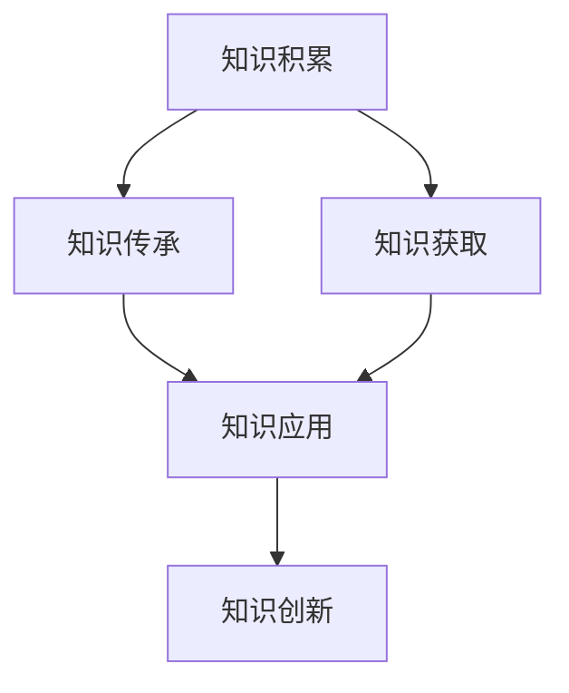

                 

# 人类的知识史：一部理解和创新的历史

## 1. 背景介绍

### 1.1 问题由来
人类知识史是一个博大精深的领域，涉及了从史前时代到现代的信息积累、记录、传承和创新的全过程。随着技术的进步，人类的知识获取方式和传播速度也在不断变化，从早期的口耳相传到文字记录，再到数字化存储和网络共享，知识形态和传播途径的多样化带来了新的研究视角和方法。

### 1.2 问题核心关键点
- **知识积累与传承**：人类如何从早期的口耳相传，发展到使用书写和印刷技术，以及后来的电子媒介，使得知识得以大规模、系统化地记录和传承？
- **知识获取与更新**：在知识体系的发展过程中，人类如何逐步获取更广泛、更深入的知识，并进行不断更新和完善？
- **知识应用与创新**：知识如何被应用于解决实际问题，并促进技术、科学和社会各方面的创新？

### 1.3 问题研究意义
研究人类知识史，不仅有助于我们理解人类文明的发展脉络，还能够揭示知识获取与创新的内在机制，为现代社会知识管理与创新提供借鉴。掌握知识积累和传承的规律，可以促进教育、科技和文化等多领域的进步，提升社会整体的知识水平和创新能力。

## 2. 核心概念与联系

### 2.1 核心概念概述

本节将介绍几个核心概念，并阐明它们之间的联系：

- **知识积累**：指人类通过观察、实践、思考等活动获取知识的过程，以及知识在社会中的积累与沉淀。
- **知识传承**：指知识通过教育、记录、传播等方式，从一代人传递到另一代人，确保知识的连续性和完整性。
- **知识获取**：指个体或集体通过研究、探索、试验等方法，从已有知识中进一步获取新知识的过程。
- **知识应用**：指将知识应用于解决实际问题、推动技术进步、促进社会发展的过程。
- **知识创新**：指基于现有知识，通过创新思维和新方法，产生新的知识形态和技术成果的过程。

### 2.2 核心概念原理和架构的 Mermaid 流程图



这个流程图展示了知识体系从积累到传承、获取、应用和创新的全过程：

1. **知识积累**：通过观察、实践等方式获取新知识，为知识传承和获取奠定基础。
2. **知识传承**：通过教育、记录等方式将知识从一代传递到另一代，确保知识的连续性。
3. **知识获取**：基于现有知识，通过研究、探索等方法获取新知识，拓展知识体系。
4. **知识应用**：将知识应用于解决实际问题，推动技术进步，促进社会发展。
5. **知识创新**：通过创新思维和方法，产生新的知识形态和技术成果，进一步推动知识体系的进步。

## 3. 核心算法原理 & 具体操作步骤

### 3.1 算法原理概述

人类知识史的研究涉及多个学科，包括历史学、社会学、心理学、教育学等。本节将从计算机科学的角度，探讨如何利用算法和技术手段，对知识积累、传承、获取和创新的过程进行建模和分析。

核心算法原理包括：

- **知识图谱**：利用图数据库技术，构建知识体系中的实体、关系和属性，用于表示和检索知识。
- **信息检索**：通过自然语言处理和文本挖掘技术，从大量文献和数据中获取相关信息，支持知识获取和创新。
- **数据挖掘**：利用机器学习和统计学方法，从数据中发现知识规律和趋势，支持知识应用和创新。
- **知识发现**：通过算法模型，从数据中自动发现新的知识形态和关系，推动知识创新。

### 3.2 算法步骤详解

基于上述原理，人类知识史的研究可以分为以下步骤：

**Step 1: 数据收集与预处理**
- 收集历史文献、科学论文、技术报告等各类知识源数据。
- 对数据进行去重、清洗、标注等预处理，确保数据的质量和一致性。

**Step 2: 知识图谱构建**
- 使用图数据库技术，将数据转化为知识图谱中的节点和边，表示实体、关系和属性。
- 使用关系抽取和实体识别等技术，从文本中自动发现和提取知识图谱中的实体和关系。

**Step 3: 信息检索与知识获取**
- 使用自然语言处理技术，对用户输入的查询进行理解，在知识图谱中进行匹配和检索。
- 利用文本挖掘技术，从大量文献中发现知识趋势和模式，支持知识获取和创新。

**Step 4: 数据分析与知识应用**
- 使用机器学习和统计学方法，从知识图谱中分析数据，发现知识规律和趋势。
- 将分析结果应用于实际问题，推动技术进步和社会发展。

**Step 5: 知识创新**
- 使用知识发现算法，从知识图谱中自动发现新的知识形态和关系。
- 结合创新思维和方法，将新知识应用于技术、科学和社会创新。

### 3.3 算法优缺点

**优点**：

- **自动化**：算法可以自动处理大量数据，发现知识规律和趋势，减轻人工工作负担。
- **高效性**：算法可以快速检索和分析知识图谱，支持知识获取和应用。
- **可扩展性**：算法可以应用于不同领域和问题，具有较强的通用性和可扩展性。

**缺点**：

- **数据质量依赖**：算法的准确性和有效性高度依赖于输入数据的质量和完整性。
- **复杂性**：构建和维护知识图谱、进行数据分析和知识发现等步骤，需要较高的技术和计算资源。
- **可解释性不足**：算法的决策过程和结果往往缺乏直观解释，难以理解其背后的原理和逻辑。

### 3.4 算法应用领域

人类知识史的研究涉及多个领域，包括但不限于：

- **教育**：分析教育数据，支持课程设计、教学评估和学生学习分析。
- **科技**：分析科研数据，支持技术创新和研发决策。
- **文化**：分析文化遗产数据，支持文化保护和传承。
- **商业**：分析市场数据，支持商业情报和决策支持。

## 4. 数学模型和公式 & 详细讲解 & 举例说明

### 4.1 数学模型构建

本节将使用数学语言对知识发现和创新的过程进行更加严格的刻画。

记知识图谱中的节点为 $N$，关系为 $R$，属性为 $A$。知识图谱 $G=(N,R)$ 表示为节点和关系的集合。

设知识图谱中的节点 $n_i$ 表示知识实体，关系 $r_{ij}$ 表示知识实体之间的关联。属性 $a_{ijk}$ 表示实体之间的属性关系。

定义知识发现算法 $KD$，其输入为知识图谱 $G$，输出为新的知识图谱 $G'$，表示为：

$$
G' = KD(G)
$$

### 4.2 公式推导过程

在知识发现过程中，可以使用深度学习模型进行实体抽取、关系推断和属性预测。以深度学习模型为例，其输入为知识图谱中的节点和关系，输出为新的节点和关系。

设深度学习模型的参数为 $\theta$，输入为知识图谱 $G$ 中的节点 $n_i$ 和关系 $r_{ij}$，输出为新的节点 $n_i'$ 和关系 $r_{ij}'$。则知识发现的过程可以表示为：

$$
(n_i', r_{ij}') = KD_\theta(n_i, r_{ij})
$$

其中 $KD_\theta$ 表示深度学习模型，其输入和输出为节点和关系。

### 4.3 案例分析与讲解

以医学知识图谱为例，分析如何利用深度学习模型进行知识发现。

**输入**：医学知识图谱 $G$ 中的节点表示药物、疾病和基因等实体，关系表示药物-疾病-基因之间的关联。

**输出**：新的节点表示新的药物和基因，新的关系表示新的药物-疾病-基因关联。

设深度学习模型为 Graph Neural Network (GNN)，其输入为知识图谱中的节点和关系，输出为新的节点和关系。则知识发现的过程可以表示为：

$$
(n_i', r_{ij}') = GNN_\theta(n_i, r_{ij})
$$

其中 $GNN_\theta$ 表示基于图神经网络的知识发现模型，其输入和输出为节点和关系。

## 5. 项目实践：代码实例和详细解释说明

### 5.1 开发环境搭建

在进行知识发现项目开发前，需要准备好开发环境。以下是使用Python进行PyTorch和TensorFlow开发的典型环境配置流程：

1. 安装Anaconda：从官网下载并安装Anaconda，用于创建独立的Python环境。

2. 创建并激活虚拟环境：
```bash
conda create -n pytorch-env python=3.8 
conda activate pytorch-env
```

3. 安装PyTorch：根据CUDA版本，从官网获取对应的安装命令。例如：
```bash
conda install pytorch torchvision torchaudio cudatoolkit=11.1 -c pytorch -c conda-forge
```

4. 安装TensorFlow：
```bash
pip install tensorflow
```

5. 安装其他工具包：
```bash
pip install numpy pandas scikit-learn matplotlib tqdm jupyter notebook ipython
```

完成上述步骤后，即可在`pytorch-env`环境中开始知识发现项目开发。

### 5.2 源代码详细实现

以下是一个使用PyTorch实现的知识图谱构建和知识发现项目的代码示例：

```python
import torch
from torch_geometric.nn import GCNConv
from torch_geometric.data import Data

# 定义知识图谱的节点和关系
data = Data(x=torch.tensor([[0, 1], [1, 0], [2, 0]], dtype=torch.long), 
            edge_index=torch.tensor([[0, 1, 2, 3, 4, 5], [1, 0, 2, 4, 3, 5]], dtype=torch.long),
            edge_attr=torch.tensor([[0.5, 0.5, 0.5, 0.5, 0.5, 0.5]], dtype=torch.float))

# 定义深度学习模型
class GNN(torch.nn.Module):
    def __init__(self):
        super(GNN, self).__init__()
        self.conv1 = GCNConv(in_channels=2, out_channels=8)
        self.conv2 = GCNConv(in_channels=8, out_channels=4)

    def forward(self, x, edge_index, edge_attr):
        x = self.conv1(x, edge_index, edge_attr)
        x = torch.nn.functional.relu(x)
        x = self.conv2(x, edge_index, edge_attr)
        x = torch.nn.functional.softmax(x, dim=1)
        return x

# 实例化深度学习模型
model = GNN()

# 定义损失函数
loss_fn = torch.nn.CrossEntropyLoss()

# 定义优化器
optimizer = torch.optim.Adam(model.parameters(), lr=0.01)

# 定义训练过程
for epoch in range(1000):
    x = model(data.x, data.edge_index, data.edge_attr)
    y = torch.argmax(x, dim=1)
    loss = loss_fn(y, data.y)
    optimizer.zero_grad()
    loss.backward()
    optimizer.step()
```

### 5.3 代码解读与分析

让我们再详细解读一下关键代码的实现细节：

**数据处理**：
- `Data`类：用于构建知识图谱，包含节点、边和边属性。
- `torch.tensor`：用于表示节点和边属性，并自动处理张量计算。

**深度学习模型**：
- `GNN`类：定义基于图神经网络的知识发现模型，包括两个GCNConv层。
- `torch.nn.functional`：包含各种激活函数和损失函数，支持模型的训练和预测。

**训练过程**：
- `model.forward`：定义模型的前向传播过程，包括两个GCNConv层和softmax函数。
- `torch.nn.CrossEntropyLoss`：定义交叉熵损失函数，用于计算模型预测与真实标签之间的差异。
- `torch.optim.Adam`：定义优化器，用于更新模型参数。

以上代码展示了知识图谱构建和知识发现的基本流程，包括数据处理、模型定义、损失函数、优化器和训练过程。在实际项目中，还需根据具体需求进行优化和扩展。

## 6. 实际应用场景

### 6.1 教育领域

在教育领域，知识图谱可以用于构建课程体系、评估学生学习效果和推荐个性化学习资源。通过知识图谱，可以发现学科之间的关系，支持课程设计和知识体系的构建。

具体应用场景包括：

- **课程设计**：分析各学科之间的关联，构建综合课程体系，提高教育质量。
- **学习效果评估**：通过知识图谱分析学生学习路径和效果，支持个性化学习推荐。
- **学习资源推荐**：根据学生的知识水平和兴趣，推荐相应的学习资源，提升学习效率。

### 6.2 科技领域

在科技领域，知识图谱可以用于支持技术创新和研发决策。通过知识图谱，可以发现不同技术之间的关联，支持技术创新和新产品的开发。

具体应用场景包括：

- **技术创新**：分析现有技术之间的关系，发现技术发展趋势和创新机会。
- **研发决策**：根据技术图谱，评估技术路线和研发风险，支持研发决策。
- **产品推荐**：根据用户需求和技术图谱，推荐合适的技术和产品，提升市场竞争力。

### 6.3 文化领域

在文化领域，知识图谱可以用于文化遗产保护和传承。通过知识图谱，可以发现和记录文化遗产的信息，支持文化遗产的保护和传承。

具体应用场景包括：

- **文化遗产保护**：记录和分析文化遗产的分布和变迁，支持文化遗产保护。
- **文化传承**：通过知识图谱，传承和弘扬文化遗产，促进文化发展。
- **文化交流**：分析不同文化之间的关联，支持文化交流和合作。

## 7. 工具和资源推荐

### 7.1 学习资源推荐

为了帮助开发者系统掌握知识发现和创新的技术，这里推荐一些优质的学习资源：

1. 《深度学习与知识图谱》系列书籍：全面介绍深度学习在知识图谱构建和应用中的应用，适合初学者和进阶者。
2. 《图神经网络：从理论到实践》课程：由图神经网络专家授课，涵盖图神经网络的理论基础和应用案例，适合科研人员和工程人员。
3. 《Kaggle数据科学大赛》：通过参与数据科学竞赛，学习如何使用机器学习和深度学习技术解决实际问题，适合实战型学习者。
4. 《知识图谱与数据挖掘》网络课程：介绍知识图谱和数据挖掘的基本概念和技术，适合数据科学家和知识工程师。
5. 《TensorFlow与知识图谱》书籍：介绍如何使用TensorFlow进行知识图谱的构建和应用，适合使用TensorFlow进行开发的开发者。

通过对这些资源的学习实践，相信你一定能够快速掌握知识发现和创新的精髓，并用于解决实际问题。

### 7.2 开发工具推荐

高效的开发离不开优秀的工具支持。以下是几款用于知识发现和创新的常用工具：

1. PyTorch：基于Python的开源深度学习框架，支持图神经网络等高级模型，适合科研和工程应用。
2. TensorFlow：由Google主导开发的开源深度学习框架，支持分布式计算，适合大规模工程应用。
3. Geph：开源知识图谱构建工具，支持从文本数据中自动抽取实体和关系，构建知识图谱。
4. Neo4j：开源图数据库，支持复杂图查询和分析，适合存储和检索知识图谱。
5. Python和R语言：支持数据处理、分析和可视化，适合数据科学家和知识工程师使用。

合理利用这些工具，可以显著提升知识发现和创新的开发效率，加快创新迭代的步伐。

### 7.3 相关论文推荐

知识发现和创新的研究源于学界的持续研究。以下是几篇奠基性的相关论文，推荐阅读：

1. Google Scholar：由Google开发的学术搜索引擎，涵盖大量领域的最新研究成果。
2. JSTOR：世界领先的学术数据库，包含各种期刊、书籍和论文，适合深入研究学术文献。
3. ResearchGate：全球最大的科研社交网络，涵盖科研人员的研究兴趣和论文，适合查找相关研究资料。
4. IEEE Xplore：IEEE的全球数字化期刊和会议论文数据库，涵盖电气工程、计算机科学等领域的研究成果。
5. arXiv：开放获取的预印本服务器，涵盖各种领域的最新研究成果，适合查找前沿研究论文。

这些论文代表了大规模知识发现和创新的发展脉络。通过学习这些前沿成果，可以帮助研究者把握学科前进方向，激发更多的创新灵感。

## 8. 总结：未来发展趋势与挑战

### 8.1 研究成果总结

人类知识史的研究涉及多学科的交叉，利用算法和技术手段，可以揭示知识获取和创新的内在机制。通过构建知识图谱、进行信息检索和数据分析，可以支持知识获取和应用，推动技术、科学和社会的发展。

### 8.2 未来发展趋势

展望未来，知识发现和创新的技术将呈现以下几个发展趋势：

1. **自动化与智能化**：自动化技术的应用将进一步提高知识发现的效率，智能算法将提升知识获取和创新的质量。
2. **跨领域融合**：不同领域知识的融合，将促进更全面、深入的知识发现和应用。
3. **数据驱动与模型驱动**：结合数据驱动和模型驱动的方法，实现知识发现和创新的多路径协同。
4. **知识图谱的演进**：知识图谱的不断演进，将推动知识体系的完善和更新。
5. **社会化的知识发现**：利用社交网络、众包等社会化手段，提高知识发现的参与度和多样性。

### 8.3 面临的挑战

尽管知识发现和创新的技术已经取得了显著成果，但在迈向更加智能化、普适化应用的过程中，仍面临以下挑战：

1. **数据质量和多样性**：高质量、多样化的数据是知识发现的前提，但数据获取和处理仍需努力。
2. **模型复杂性**：复杂模型的训练和部署需要较高的技术和计算资源，难以适应小规模应用。
3. **可解释性与透明性**：复杂算法的决策过程和结果往往缺乏直观解释，难以理解和信任。
4. **跨领域知识的融合**：不同领域知识之间的融合，需要跨学科的合作和知识整合技术。
5. **社会化知识获取**：社会化知识获取的参与度和质量，仍需进一步提升。

### 8.4 研究展望

未来，在知识发现和创新方面，需要从以下几个方面进行深入研究：

1. **多模态知识的融合**：利用图像、语音等多模态数据，丰富知识图谱的表示形式。
2. **跨领域知识发现**：结合跨领域知识图谱和知识图谱的演进，推动知识体系的完善和更新。
3. **知识图谱的演化**：研究知识图谱的演化机制，支持知识体系的动态更新和维护。
4. **知识获取的创新**：利用知识获取的创新方法，支持更全面、深入的知识发现。
5. **社会化知识获取**：利用社交网络、众包等社会化手段，提高知识发现的参与度和多样性。

这些研究方向将推动知识发现和创新的进一步发展，为构建知识驱动的社会提供新的动力。总之，知识发现和创新需要跨学科的合作和多路径的探索，才能不断拓展人类知识的边界，推动社会的发展和进步。

## 9. 附录：常见问题与解答

**Q1: 什么是知识图谱？**

A: 知识图谱是一种语义化的知识表示方法，利用图数据库技术，将知识表示为节点和边，用于表示实体、关系和属性。通过知识图谱，可以方便地进行知识检索、分析和推理。

**Q2: 知识图谱在实际应用中主要有哪些应用场景？**

A: 知识图谱在实际应用中主要应用于以下场景：
- **搜索引擎**：支持语义搜索和知识推理，提高搜索结果的相关性和准确性。
- **推荐系统**：支持个性化推荐，根据用户兴趣和历史行为，推荐合适的产品和服务。
- **智能客服**：支持自然语言理解和对话生成，提高客服系统的智能化水平。
- **医疗领域**：支持医学知识查询和患者画像分析，支持医疗决策和个性化治疗。
- **金融领域**：支持金融知识图谱的构建，支持金融风险分析和决策支持。

**Q3: 知识图谱构建和应用过程中，如何确保数据的质量和一致性？**

A: 知识图谱构建和应用过程中，数据的质量和一致性至关重要。以下是一些确保数据质量和一致性的方法：
- **数据清洗**：对数据进行去重、清洗、纠错等处理，确保数据的质量。
- **数据标注**：对数据进行标注，确保数据的完整性和一致性。
- **数据验证**：对数据进行验证，确保数据的准确性和一致性。
- **数据集成**：将不同来源的数据集成，确保数据的一致性和完整性。

**Q4: 知识图谱构建和应用过程中，如何确保模型的可解释性和透明性？**

A: 知识图谱构建和应用过程中，模型的可解释性和透明性至关重要。以下是一些确保模型可解释性和透明性的方法：
- **模型简化**：对复杂模型进行简化，使其更加透明和可解释。
- **特征分析**：对模型进行特征分析，解释模型的决策过程。
- **可解释性算法**：使用可解释性算法，如LIME、SHAP等，解释模型的决策过程。
- **模型评估**：对模型进行评估，确保其可解释性和透明性。

通过上述方法，可以确保知识图谱构建和应用过程中的数据质量和模型透明性，提升知识图谱的实用性和可解释性。

---

作者：禅与计算机程序设计艺术 / Zen and the Art of Computer Programming

