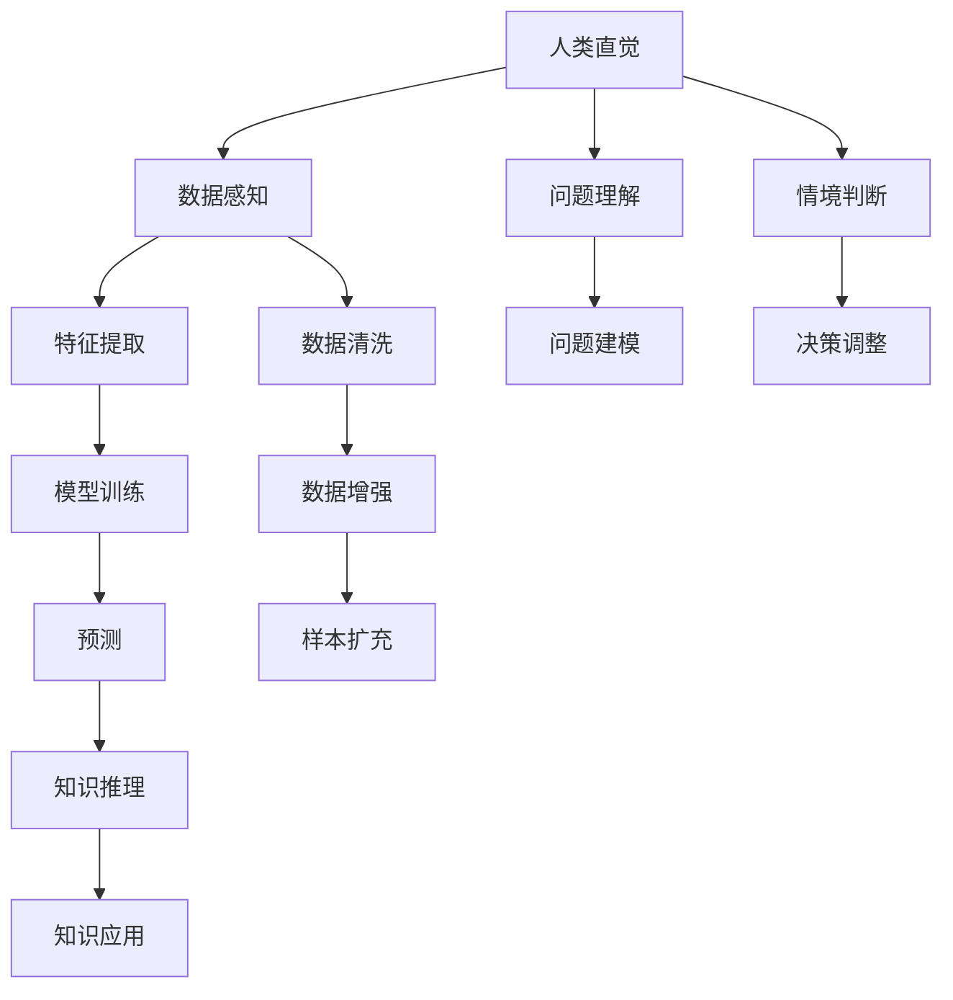

                 

## 1. 背景介绍

在信息爆炸的时代，人类面临知识发现与利用的巨大挑战。在科学技术迅猛发展的今天，数据量和信息复杂性正呈指数级增长，但人类直觉和智慧的局限性却难以应对海量信息的处理需求。人工智能，尤其是机器学习技术，为解决这一问题提供了新的路径。

人类直觉作为一种重要的认知能力，在知识发现和创新中扮演着不可或缺的角色。但随着数据量的增加，人类直觉的局限性逐渐显现，难以应对现代复杂问题的挑战。机器学习作为人工智能的核心技术，通过算法模型自动学习和挖掘数据中的潜在知识，弥补了人类直觉的不足，成为知识发现的利器。

因此，探讨人类直觉与机器学习在知识发现中的结合，是提升数据处理效率和知识挖掘深度的关键。本文将从背景介绍、核心概念与联系、核心算法原理、数学模型与公式、项目实践、实际应用场景、工具和资源推荐、未来发展趋势与挑战等方面，全面系统地阐述人类直觉与机器学习在知识发现中的角色，并提供详细的技术实现路径。

## 2. 核心概念与联系

### 2.1 核心概念概述

在知识发现的背景下，人类直觉与机器学习分别扮演着重要的角色。

**人类直觉**：
人类直觉基于长期经验、教育背景和文化熏陶，能够快速识别模式、理解语义，并对问题进行快速判断和决策。人类直觉的特点包括：
1. 感知能力：通过视觉、听觉、触觉等多种感官获取信息。
2. 联想记忆：能够根据已有知识，通过类比、隐喻等方式，快速理解新知识。
3. 情境判断：能够根据情境变化，做出灵活适应的决策。

**机器学习**：
机器学习是一种基于数据的算法，通过模型自动学习数据中的规律和知识，并能够进行预测、分类、聚类等任务。机器学习的核心在于算法模型，主要包括以下几种类型：
1. 监督学习：基于标记数据进行训练，如分类、回归等任务。
2. 无监督学习：无需标记数据，自动发现数据中的结构和规律，如聚类、降维等。
3. 强化学习：通过与环境互动，自动学习最优决策策略，如机器人控制、游戏AI等。

人类直觉与机器学习在知识发现中的联系在于，它们能够互补融合，共同推动知识获取和创新。人类直觉在数据理解、问题判断方面具有优势，而机器学习则在数据分析、模式识别方面具有优势。通过结合人类直觉和机器学习，可以提升知识发现的效率和深度。

### 2.2 核心概念原理和架构的 Mermaid 流程图



这个流程图展示了人类直觉与机器学习在知识发现中的互动和融合。人类直觉通过对数据的感知、理解、判断，为机器学习提供了更准确的问题定义和情境信息。机器学习则通过数据分析、建模、训练，自动发现数据中的规律和知识，并将这些知识应用于实际问题中。

## 3. 核心算法原理 & 具体操作步骤

### 3.1 算法原理概述

在知识发现中，人类直觉与机器学习相互补充，共同作用。机器学习模型通过大量数据训练，自动学习数据中的模式和规律，而人类直觉则能够理解机器学习的结果，并进行判断和决策。

知识发现过程通常包括以下几个步骤：
1. 数据收集：从不同来源收集数据，并进行清洗和预处理。
2. 特征提取：使用机器学习算法自动提取数据中的特征。
3. 模型训练：通过标记数据训练机器学习模型。
4. 模型评估：使用未标记数据评估模型性能。
5. 知识应用：将机器学习模型应用于实际问题中，并结合人类直觉进行判断和决策。

### 3.2 算法步骤详解

#### 3.2.1 数据收集和预处理

数据收集和预处理是知识发现的第一步，旨在从不同来源获取高质量的数据，并进行清洗和格式转换。

**数据收集**：
数据可以从多个来源获取，如数据库、传感器、网络爬虫等。需要根据数据类型和来源，选择合适的数据收集方式。例如，从数据库中获取结构化数据，从传感器中获取实时数据，从网络爬虫中获取非结构化数据等。

**数据预处理**：
数据预处理包括数据清洗、格式转换、缺失值处理等。数据清洗去除重复、错误、异常数据，格式转换将数据转换为统一的格式，缺失值处理填补缺失数据，以确保数据质量。

#### 3.2.2 特征提取

特征提取是从原始数据中提取出对问题有意义的特征，是知识发现的核心步骤。

**特征选择**：
特征选择从原始数据中选择最具有代表性的特征，以减少数据维度。常见的特征选择方法包括相关性分析、主成分分析等。

**特征工程**：
特征工程是对原始特征进行变换和组合，以增强特征的表现力。常见的特征工程方法包括PCA降维、归一化、数据增强等。

#### 3.2.3 模型训练

模型训练是通过大量标记数据训练机器学习模型，自动学习数据中的规律和知识。

**模型选择**：
根据问题类型选择合适的模型，如回归模型、分类模型、聚类模型等。

**模型训练**：
使用标记数据训练模型，自动学习数据中的规律和知识。常见训练方法包括梯度下降、随机梯度下降等。

#### 3.2.4 模型评估

模型评估是通过未标记数据评估模型性能，判断模型是否能够有效发现数据中的规律和知识。

**模型验证**：
使用验证集评估模型性能，常见评估指标包括准确率、召回率、F1分数等。

**模型调优**：
根据评估结果调整模型参数，以提高模型性能。

#### 3.2.5 知识应用

知识应用是将机器学习模型应用于实际问题中，并结合人类直觉进行判断和决策。

**问题建模**：
根据问题类型建立数学模型，如回归模型、分类模型、聚类模型等。

**决策调整**：
结合人类直觉和机器学习模型的结果，进行决策调整，以获得最优解决方案。

### 3.3 算法优缺点

**优点**：
1. 数据处理能力强：机器学习能够处理大规模数据，发现数据中的复杂规律和知识。
2. 自动化能力强：机器学习自动进行特征提取和模型训练，减少人工干预。
3. 适应性强：机器学习能够适应不同类型和来源的数据，具有广泛的应用范围。

**缺点**：
1. 模型复杂度高：机器学习模型复杂度较高，需要大量数据和计算资源。
2. 解释性差：机器学习模型通常具有"黑盒"特性，难以解释其决策过程。
3. 依赖数据质量：机器学习模型依赖高质量的数据，数据噪声和缺失值会影响模型性能。

### 3.4 算法应用领域

基于人类直觉与机器学习的知识发现技术，已经在多个领域得到了广泛应用，包括但不限于：

**金融分析**：
使用机器学习模型分析金融市场数据，预测股票价格、风险评估等。结合人类直觉，进行风险控制和投资决策。

**医疗诊断**：
使用机器学习模型分析医疗数据，预测疾病风险、诊断疾病等。结合人类直觉，进行疾病判断和治疗决策。

**自然语言处理**：
使用机器学习模型分析文本数据，进行情感分析、主题分类、信息抽取等。结合人类直觉，理解文本的语义和情境。

**图像识别**：
使用机器学习模型分析图像数据，进行目标检测、图像分类、图像生成等。结合人类直觉，理解图像的视觉特征和语义。

## 4. 数学模型和公式 & 详细讲解 & 举例说明

### 4.1 数学模型构建

知识发现过程可以构建多种数学模型，以处理不同类型的问题。以下以回归模型为例，详细讲解知识发现的数学模型构建。

**回归模型**：
回归模型用于预测数值型输出，如房价、股票价格等。常见的回归模型包括线性回归、多项式回归、岭回归等。

### 4.2 公式推导过程

**线性回归模型**：
假设存在一个线性回归模型 $y = \beta_0 + \beta_1x_1 + \beta_2x_2 + ... + \beta_nx_n$，其中 $y$ 为输出，$x_1, x_2, ..., x_n$ 为输入特征，$\beta_0, \beta_1, \beta_2, ..., \beta_n$ 为模型参数。

**梯度下降算法**：
使用梯度下降算法更新模型参数，以最小化误差平方和 $J(\beta) = \frac{1}{2N}\sum_{i=1}^N(y_i - (\beta_0 + \beta_1x_{i1} + \beta_2x_{i2} + ... + \beta_nx_{in}))^2$。

### 4.3 案例分析与讲解

以房价预测为例，说明回归模型在知识发现中的应用。

**数据收集和预处理**：
从房地产数据库中收集房屋销售数据，包括房屋面积、位置、年份等特征，并进行清洗和预处理。

**特征提取**：
使用PCA降维，选择最具有代表性的特征，如房屋面积、地理位置等。

**模型训练**：
使用训练集训练线性回归模型，自动学习数据中的规律和知识。

**模型评估**：
使用验证集评估模型性能，调整模型参数以提高准确率。

**知识应用**：
将训练好的模型应用于实际问题中，预测新房屋的销售价格，并结合人类直觉进行决策调整。

## 5. 项目实践：代码实例和详细解释说明

### 5.1 开发环境搭建

开发环境搭建是知识发现项目的基础，需要选择合适的开发平台和工具。

**Python环境**：
Python是知识发现项目的主要开发语言，具有丰富的科学计算和机器学习库。

**科学计算库**：
使用NumPy、Pandas等科学计算库，进行数据处理和特征提取。

**机器学习库**：
使用Scikit-learn、TensorFlow等机器学习库，进行模型训练和评估。

### 5.2 源代码详细实现

**代码实现**：
以下是一个简单的房价预测项目的代码实现，使用Scikit-learn库进行线性回归模型的训练和评估。

```python
import numpy as np
import pandas as pd
from sklearn.linear_model import LinearRegression
from sklearn.model_selection import train_test_split
from sklearn.metrics import mean_squared_error

# 读取数据
data = pd.read_csv('house_price.csv')

# 数据预处理
X = data[['area', 'location']] # 特征
y = data['price'] # 输出

# 数据分割
X_train, X_test, y_train, y_test = train_test_split(X, y, test_size=0.2, random_state=0)

# 模型训练
model = LinearRegression()
model.fit(X_train, y_train)

# 模型评估
y_pred = model.predict(X_test)
mse = mean_squared_error(y_test, y_pred)
print('MSE:', mse)

# 知识应用
new_data = pd.DataFrame({'area': [1000], 'location': ['市中心']})
new_data['price_pred'] = model.predict(new_data)
print(new_data)
```

### 5.3 代码解读与分析

**数据读取和预处理**：
使用Pandas库读取数据，并进行特征提取和数据分割。

**模型训练和评估**：
使用Scikit-learn库的LinearRegression模型进行训练，使用均方误差评估模型性能。

**知识应用**：
将训练好的模型应用于新数据，进行房价预测。

## 6. 实际应用场景

### 6.1 金融分析

在金融分析领域，机器学习模型被广泛应用于风险评估、股票价格预测等任务。通过结合人类直觉，金融分析师能够对模型预测结果进行更深入的理解和判断，从而做出更准确的投资决策。

**风险评估**：
使用机器学习模型分析历史交易数据，预测客户违约风险。结合人类直觉，进行风险控制和客户管理。

**股票价格预测**：
使用机器学习模型分析股票价格变化趋势，预测未来价格。结合人类直觉，进行投资组合优化和风险管理。

### 6.2 医疗诊断

在医疗诊断领域，机器学习模型被广泛应用于疾病预测、病历分析等任务。通过结合人类直觉，医生能够对模型预测结果进行更深入的理解和判断，从而做出更准确的诊断和治疗决策。

**疾病预测**：
使用机器学习模型分析患者数据，预测疾病风险。结合人类直觉，进行疾病预防和治疗决策。

**病历分析**：
使用机器学习模型分析病历数据，进行病情分类和诊断。结合人类直觉，进行疾病分析和治疗决策。

### 6.3 自然语言处理

在自然语言处理领域，机器学习模型被广泛应用于情感分析、信息抽取等任务。通过结合人类直觉，研究人员能够对模型预测结果进行更深入的理解和判断，从而提升模型性能和应用效果。

**情感分析**：
使用机器学习模型分析文本数据，进行情感分类和情感强度预测。结合人类直觉，进行情感理解和社会分析。

**信息抽取**：
使用机器学习模型分析文本数据，进行实体抽取和关系抽取。结合人类直觉，进行信息验证和知识整合。

### 6.4 图像识别

在图像识别领域，机器学习模型被广泛应用于目标检测、图像分类等任务。通过结合人类直觉，研究人员能够对模型预测结果进行更深入的理解和判断，从而提升模型性能和应用效果。

**目标检测**：
使用机器学习模型分析图像数据，进行目标定位和识别。结合人类直觉，进行目标验证和分析。

**图像分类**：
使用机器学习模型分析图像数据，进行图像分类和图像生成。结合人类直觉，进行图像理解和社会分析。

## 7. 工具和资源推荐

### 7.1 学习资源推荐

以下是一些有用的学习资源，可以帮助开发者深入理解人类直觉与机器学习在知识发现中的应用。

**Coursera《机器学习》课程**：
由斯坦福大学教授Andrew Ng主讲，讲解机器学习的基本原理和常用算法。

**DeepLearning.AI《深度学习》课程**：
由吴恩达教授主讲，讲解深度学习的基本原理和常用算法，涵盖神经网络、卷积神经网络、循环神经网络等。

**Kaggle数据科学竞赛**：
Kaggle是一个数据科学竞赛平台，提供大量数据集和竞赛题目，帮助开发者实践和提升技能。

**Google AI Blog**：
Google AI Blog提供了大量最新的AI技术进展和应用案例，涵盖机器学习、自然语言处理、计算机视觉等多个领域。

### 7.2 开发工具推荐

以下是一些常用的开发工具，可以帮助开发者高效进行知识发现项目的开发和部署。

**Jupyter Notebook**：
Jupyter Notebook是一个免费的开发环境，支持Python、R等多种编程语言，适合数据探索和模型验证。

**Git**：
Git是一个版本控制系统，适合团队协作开发，方便代码管理和版本控制。

**Docker**：
Docker是一个容器化平台，支持应用快速部署和扩展，方便知识发现项目的运行和部署。

### 7.3 相关论文推荐

以下是几篇有代表性的论文，可以帮助开发者深入理解人类直觉与机器学习在知识发现中的应用。

**Deep Learning for Healthcare**：
文章总结了深度学习在医疗领域的应用，包括疾病预测、病历分析、图像识别等。

**Human-in-the-loop Machine Learning**：
文章探讨了人类在机器学习中的作用，提出了“人机协同”的智能系统设计思路。

**A Survey on Explainable Artificial Intelligence for Healthcare**：
文章综述了可解释性人工智能在医疗领域的应用，包括医疗决策、诊断支持等。

## 8. 总结：未来发展趋势与挑战

### 8.1 研究成果总结

人类直觉与机器学习在知识发现中发挥着重要的互补作用，能够提升数据处理效率和知识挖掘深度。本文从背景介绍、核心概念与联系、核心算法原理、数学模型与公式、项目实践、实际应用场景、工具和资源推荐、未来发展趋势与挑战等方面，全面系统地阐述了人类直觉与机器学习在知识发现中的角色。

### 8.2 未来发展趋势

未来，人类直觉与机器学习在知识发现中的结合将呈现以下几个发展趋势：

**模型自动化**：
机器学习模型的自动化程度将进一步提升，能够自动进行数据预处理、特征提取和模型训练，减少人工干预。

**智能决策**：
结合人类直觉和机器学习模型，构建更智能的决策系统，能够在多目标、多约束条件下做出最优决策。

**跨领域应用**：
人类直觉与机器学习结合的应用领域将不断扩展，涵盖更多行业和学科。

**人机协同**：
人类与机器的协同工作将成为常态，构建人机协同的智能系统，提升知识发现和创新的效率和效果。

### 8.3 面临的挑战

在知识发现中，结合人类直觉与机器学习仍面临一些挑战：

**数据质量和噪声**：
机器学习模型依赖高质量的数据，数据噪声和缺失值会影响模型性能。

**模型解释性**：
机器学习模型的复杂性导致其缺乏解释性，难以理解和解释模型决策过程。

**跨领域融合**：
不同领域的数据和问题具有不同特点，难以直接应用跨领域融合的技术。

**隐私和安全**：
数据隐私和安全问题在知识发现中具有重要意义，需要建立有效的数据保护机制。

### 8.4 研究展望

未来，结合人类直觉与机器学习在知识发现中的应用，还需要在以下几个方面进行深入研究：

**跨领域融合**：
探索跨领域融合的技术和方法，将不同领域的数据和问题进行有机结合，提升知识发现的效率和效果。

**隐私保护**：
研究隐私保护技术，确保数据隐私和安全，避免数据泄露和滥用。

**智能决策**：
研究智能决策算法，提升人机协同系统的决策能力，实现更精准、高效的决策。

**跨学科应用**：
探索跨学科应用的可能性，结合人类直觉和机器学习，在更多领域进行知识发现和创新。

总之，结合人类直觉与机器学习在知识发现中的应用，具有广阔的发展前景和深远的社会影响。只有在技术、应用和伦理等多个方面共同努力，才能真正实现人类直觉与机器学习的深度融合，推动人工智能技术的不断进步和创新。

## 9. 附录：常见问题与解答

**Q1: 什么是知识发现？**

A: 知识发现是指从大规模数据中自动或半自动地提取、发现和总结有价值的知识的过程。

**Q2: 机器学习在知识发现中的作用是什么？**

A: 机器学习通过算法模型自动发现数据中的规律和知识，提升数据处理效率和知识挖掘深度。

**Q3: 人类直觉在知识发现中的作用是什么？**

A: 人类直觉基于长期经验、教育背景和文化熏陶，能够快速识别模式、理解语义，并对问题进行快速判断和决策。

**Q4: 人类直觉与机器学习结合有哪些优势？**

A: 结合人类直觉和机器学习，可以提升数据处理效率和知识挖掘深度，具有更广泛的适用性和更高的性能。

**Q5: 如何提高机器学习模型的解释性？**

A: 使用可解释性模型，如决策树、线性模型等，结合特征解释技术，提升模型的可解释性。

---

作者：禅与计算机程序设计艺术 / Zen and the Art of Computer Programming

