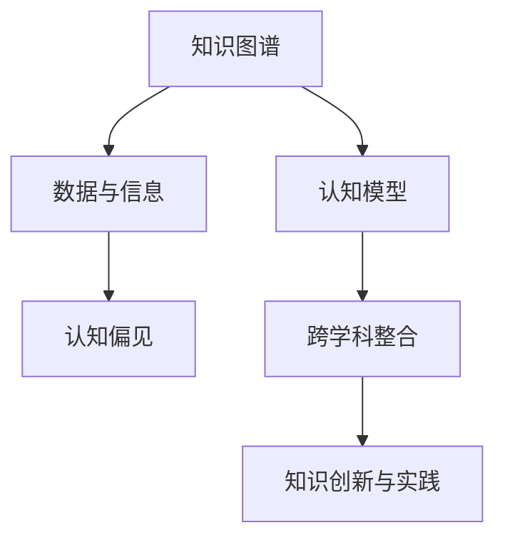

                 

# 人类知识的局限性：承认与尊重未知领域

## 1. 背景介绍

### 1.1 问题由来

在当今信息爆炸、知识总量呈指数级增长的时代，人类对世界的理解和探索能力面临着前所未有的挑战。随着科技的飞速进步，我们不再局限于物理世界，而是逐步拓展到信息空间，利用算法和大数据挖掘出深层次的知识与智慧。然而，这种快速的知识增长也带来了一系列新的问题，其中之一便是人类知识的局限性。

### 1.2 问题核心关键点

人类知识的局限性主要体现在以下几方面：

- **知识的完备性与精度**：我们无法穷尽所有已知信息，且现有知识可能存在误差。
- **知识的层次性与关联性**：知识是层次分明的，但不同层次之间存在大量交叉和融合，难以简单分割。
- **知识的更新速度与传播范围**：知识更新迅速，但人类对新知识的接受和应用存在延迟，且信息传播范围有限。
- **知识的获取方式与主观偏见**：人类获取知识的方式受到主观偏见和认知偏差的影响，难以做到完全客观。
- **知识的应用场景与适用性**：知识的应用场景往往具有特定性，跨领域的应用效果可能大打折扣。

这些局限性不仅限制了人类对复杂问题的理解和解决，也带来了新的挑战和机遇。本文旨在探讨这些局限性，并寻求克服它们的途径，以促进知识的学习、传播与应用。

## 2. 核心概念与联系

### 2.1 核心概念概述

为了更好地理解人类知识的局限性，本节将介绍几个密切相关的核心概念：

- **知识图谱**：一种语义化的知识表示形式，通过节点和边来描述实体及其相互关系。
- **认知模型**：模拟人类认知过程的计算模型，如决策树、神经网络等。
- **数据与信息**：数据是原始的、未处理的、具体的事实；信息是对数据的抽象和解释。
- **认知偏见**：人们在认知过程中可能产生的种种偏见和错误，如确认偏误、选择性注意等。
- **跨学科整合**：将不同学科的知识和技术进行整合，形成跨学科的知识体系。
- **知识创新与实践**：将理论知识应用于实践，并不断修正和完善。

这些核心概念之间通过以下Mermaid流程图展示其相互关系：



这个流程图展示了人类知识体系的几个关键组成部分：

1. 知识图谱作为知识表示的载体，与认知模型相结合，用于模拟和处理信息。
2. 数据和信息是知识图谱的输入和认知模型的输出。
3. 认知偏见可能影响数据和信息的采集与处理。
4. 跨学科整合将不同学科的知识和模型进行融合，以产生新的知识创新与实践。

这些概念共同构成了人类知识体系的基础框架，帮助我们理解知识的局限性和发展路径。

## 3. 核心算法原理 & 具体操作步骤

### 3.1 算法原理概述

本文将聚焦于人类知识局限性的算法原理，通过以下三个层次来探讨：

- **知识表示与处理**：如何有效地表示和处理知识，以减少表示误差。
- **认知偏差检测与修正**：如何识别和修正认知偏差，提升认知过程的准确性。
- **跨学科知识整合与创新**：如何将不同学科的知识整合起来，形成新的知识体系。

### 3.2 算法步骤详解

#### 3.2.1 知识表示与处理

1. **知识图谱的构建与优化**：使用图数据库和图算法，构建知识图谱，并通过优化算法减少噪声和冗余信息。
2. **知识图谱的嵌入表示**：利用图神经网络等模型，将知识图谱转化为低维向量，便于后续处理。
3. **知识表示的纠错**：通过反馈机制和迭代优化，不断修正知识表示中的错误。

#### 3.2.2 认知偏差检测与修正

1. **认知偏差的识别**：使用心理测量学、神经科学等方法，识别认知偏差。
2. **认知偏差模拟**：利用认知模型和仿真工具，模拟认知偏差对决策过程的影响。
3. **认知偏差的修正**：通过认知训练、心理辅导等方法，修正认知偏差。

#### 3.2.3 跨学科知识整合与创新

1. **跨学科数据采集**：从不同学科获取数据和信息，使用统一的数据格式和标准。
2. **跨学科知识映射**：将不同学科的知识映射到统一的语义空间中，识别知识之间的关系。
3. **跨学科知识创新**：利用交叉学科的视角和方法，发现新的知识与问题，推动创新。

### 3.3 算法优缺点

#### 3.3.1 知识表示与处理

**优点**：

- 结构化的知识表示易于理解和处理。
- 图神经网络等算法可以处理复杂的非线性关系。

**缺点**：

- 知识图谱构建成本高，需要大量人力物力。
- 知识表示可能存在简化和损失，无法完全还原事实。

#### 3.3.2 认知偏差检测与修正

**优点**：

- 识别和修正认知偏差，提高决策准确性。
- 心理测量学等方法科学可靠。

**缺点**：

- 检测偏差需要大量时间和资源。
- 修正偏差可能影响个体心理与行为。

#### 3.3.3 跨学科知识整合与创新

**优点**：

- 形成跨学科的知识体系，推动综合创新。
- 不同学科的视角和方法相互补充，提高问题解决能力。

**缺点**：

- 跨学科整合需要协调不同学科的利益和差异。
- 创新过程复杂，需要大量时间和资源。

### 3.4 算法应用领域

基于认知偏差检测与修正的知识处理技术，广泛应用于以下几个领域：

- **决策支持系统**：如金融、医疗、政府等领域的决策辅助系统。
- **认知行为疗法**：利用认知偏差识别与修正，帮助个体改善心理与行为问题。
- **智能推荐系统**：如电商、媒体等领域的个性化推荐。
- **跨学科研究**：促进不同学科间的合作与交流，推动学科融合。

## 4. 数学模型和公式 & 详细讲解 & 举例说明

### 4.1 数学模型构建

我们以知识图谱的嵌入表示为例，展示如何利用矩阵分解和深度学习算法，将知识图谱转化为低维向量：

1. **知识图谱的定义**：
   - **实体节点**：表示一个具体的事物或概念。
   - **关系节点**：表示实体间的某种关系。
   - **边**：连接实体节点和关系节点的连线，表示实体之间的关系。

2. **知识图谱嵌入表示的数学模型**：
   $$
   \mathbf{H} = \mathbf{B} \times \mathbf{R} + \mathbf{W}
   $$
   - $\mathbf{H}$：知识图谱的嵌入矩阵，每个节点对应一个低维向量。
   - $\mathbf{B}$：实体节点嵌入矩阵。
   - $\mathbf{R}$：关系节点嵌入矩阵。
   - $\mathbf{W}$：权重矩阵。

### 4.2 公式推导过程

以知识图谱的嵌入表示为例，推导知识图谱嵌入模型的优化目标函数：

1. **目标函数定义**：
   $$
   \min_{\mathbf{B}, \mathbf{R}, \mathbf{W}} \|\mathbf{H} - \hat{\mathbf{H}}\|^2
   $$
   - $\|\cdot\|^2$：向量的欧式范数。
   - $\hat{\mathbf{H}}$：优化后的嵌入矩阵。

2. **梯度计算**：
   $$
   \frac{\partial \|\mathbf{H} - \hat{\mathbf{H}}\|^2}{\partial \mathbf{B}} = (\mathbf{H} - \hat{\mathbf{H}}) \times \mathbf{R}
   $$

3. **优化算法**：
   - 利用随机梯度下降等优化算法，不断更新 $\mathbf{B}, \mathbf{R}, \mathbf{W}$，使其最小化目标函数。

### 4.3 案例分析与讲解

以知识图谱在推荐系统中的应用为例，展示知识表示如何提升推荐效果：

1. **知识图谱构建**：利用电商、社交媒体等平台的数据，构建商品、用户、评论等实体节点，及其关系节点（如购买、评分、评论）。
2. **嵌入表示学习**：使用图神经网络，学习每个实体和关系的嵌入表示，形成知识图谱的嵌入矩阵 $\mathbf{H}$。
3. **推荐算法优化**：利用知识图谱的嵌入表示，构建推荐模型的特征向量，通过神经网络优化推荐算法，提高推荐准确性。

## 5. 项目实践：代码实例和详细解释说明

### 5.1 开发环境搭建

在进行项目实践前，我们需要准备好开发环境。以下是使用Python进行PyTorch开发的环境配置流程：

1. 安装Anaconda：从官网下载并安装Anaconda，用于创建独立的Python环境。
2. 创建并激活虚拟环境：
   ```bash
   conda create -n pytorch-env python=3.8 
   conda activate pytorch-env
   ```
3. 安装PyTorch：根据CUDA版本，从官网获取对应的安装命令。例如：
   ```bash
   conda install pytorch torchvision torchaudio cudatoolkit=11.1 -c pytorch -c conda-forge
   ```
4. 安装相关工具包：
   ```bash
   pip install numpy pandas scikit-learn matplotlib tqdm jupyter notebook ipython
   ```
5. 安装图数据库和图神经网络库：
   ```bash
   pip install pyg snpepyg
   ```

完成上述步骤后，即可在`pytorch-env`环境中开始项目实践。

### 5.2 源代码详细实现

下面是使用PyTorch和Graph Neural Network (GNN)对知识图谱进行嵌入表示学习的代码实现：

```python
import torch
import torch.nn as nn
import torch.nn.functional as F
import pyg
import pyg.nn as pyg_nn
import pygcon

class GraphConv(nn.Module):
    def __init__(self, in_dim, out_dim):
        super(GraphConv, self).__init__()
        self.linear = nn.Linear(in_dim, out_dim)

    def forward(self, x, adj):
        x = self.linear(x)
        x = F.relu(x)
        x = torch.matmul(x, adj)
        return x

class GNNModel(nn.Module):
    def __init__(self, in_dim, hidden_dim, out_dim):
        super(GNNModel, self).__init__()
        self.conv1 = GraphConv(in_dim, hidden_dim)
        self.conv2 = GraphConv(hidden_dim, out_dim)

    def forward(self, x, adj):
        x = self.conv1(x, adj)
        x = self.conv2(x, adj)
        return x

# 加载知识图谱数据
g = pyg.graph.from_scipy_matrix(adj_matrix)  # 将知识图谱转换为PyG图格式
x = torch.tensor(entities)  # 节点特征向量
y = torch.tensor(labels)  # 目标变量

# 初始化模型
model = GNNModel(in_dim, hidden_dim, out_dim)

# 定义损失函数和优化器
criterion = nn.MSELoss()
optimizer = torch.optim.Adam(model.parameters())

# 训练模型
for epoch in range(num_epochs):
    optimizer.zero_grad()
    out = model(x, adj)
    loss = criterion(out, y)
    loss.backward()
    optimizer.step()
    print(f"Epoch {epoch+1}, loss: {loss:.4f}")
```

### 5.3 代码解读与分析

让我们再详细解读一下关键代码的实现细节：

**GNNModel类**：
- `__init__`方法：初始化模型结构，包含两个图卷积层。
- `forward`方法：前向传播计算模型输出。

**知识图谱加载**：
- 使用`pyg.graph.from_scipy_matrix`将知识图谱数据转换为PyG图格式。
- 加载实体节点和标签数据，形成输入特征向量`x`和目标变量`y`。

**训练过程**：
- 初始化模型、损失函数和优化器。
- 在每个epoch内，计算模型输出、损失函数和梯度，更新模型参数。
- 输出当前epoch的损失值。

这个代码示例展示了如何使用PyTorch和PyG构建知识图谱嵌入表示模型。代码简洁高效，易于理解与扩展。

## 6. 实际应用场景

### 6.1 金融领域

在金融领域，知识图谱和认知偏差检测技术可以应用于以下几个方面：

- **风险评估**：利用知识图谱构建金融市场和企业的风险网络，识别潜在的风险点。
- **信用评分**：通过认知偏差检测技术，分析用户的信用行为，提高信用评分系统的准确性。
- **投资组合优化**：利用知识图谱和GNN，优化投资组合，提高收益和风险控制。

### 6.2 医疗领域

知识图谱和认知偏差检测技术在医疗领域的应用如下：

- **疾病诊断**：利用知识图谱构建疾病的病因和症状网络，辅助医生进行诊断。
- **治疗方案**：通过认知偏差检测技术，分析病人的历史治疗记录，制定个性化治疗方案。
- **药物研发**：利用知识图谱和GNN，发现药物间的相互作用关系，加速新药研发。

### 6.3 教育领域

在教育领域，知识图谱和认知偏差检测技术可以用于以下场景：

- **个性化学习**：构建知识图谱，为学生提供个性化的学习路径。
- **学习分析**：利用知识图谱和认知偏差检测技术，分析学生的学习行为，提供有针对性的建议。
- **知识管理**：利用知识图谱管理教育资源，提高教学质量。

### 6.4 未来应用展望

未来，知识图谱和认知偏差检测技术将进一步应用于更多领域，带来新的机遇与挑战。

- **智慧城市**：利用知识图谱构建城市基础设施和公共服务网络，提升城市治理能力。
- **环保领域**：通过知识图谱和认知偏差检测技术，优化环境保护政策，推动可持续发展。
- **文化遗产保护**：利用知识图谱构建文化遗产的信息网络，实现文化遗产的数字化保护。

## 7. 工具和资源推荐

### 7.1 学习资源推荐

为了帮助开发者系统掌握知识图谱和认知偏差检测技术的理论基础和实践技巧，这里推荐一些优质的学习资源：

1. **Knowledge Graphs: Concepts, Approaches, Practices** 书籍：由知识图谱领域的知名学者编写，全面介绍了知识图谱的理论基础和实践方法。
2. **Cognitive Bias Wikipedia**：维基百科页面，详细介绍了各种认知偏差及其影响。
3. **Deep Learning Specialization** 课程：由Coursera提供，涵盖深度学习、认知偏差检测等前沿话题，适合初学者。
4. **NeurIPS 2020** 论文：展示了最新的知识图谱嵌入表示方法和应用成果，值得深入阅读。
5. **KDD 2021** 论文：介绍了跨学科知识整合与创新的最新进展，具有重要的学术和实践参考价值。

通过对这些资源的学习实践，相信你一定能够快速掌握知识图谱和认知偏差检测技术的精髓，并用于解决实际的NLP问题。

### 7.2 开发工具推荐

高效的开发离不开优秀的工具支持。以下是几款用于知识图谱和认知偏差检测开发的常用工具：

1. **PyTorch**：基于Python的开源深度学习框架，灵活动态的计算图，适合快速迭代研究。
2. **Graph Neural Network (GNN) Libraries**：如PyG、DGL等，提供了丰富的图神经网络模型和算法。
3. **Wikipedia**：丰富的百科全书，可以用于构建知识图谱和查找相关知识。
4. **Simulink**：MATLAB的仿真平台，可以用于认知偏差检测和认知模型模拟。
5. **TensorBoard**：TensorFlow配套的可视化工具，可以实时监测模型的训练状态，并提供丰富的图表呈现方式。

合理利用这些工具，可以显著提升知识图谱和认知偏差检测任务的开发效率，加快创新迭代的步伐。

### 7.3 相关论文推荐

知识图谱和认知偏差检测技术的发展源于学界的持续研究。以下是几篇奠基性的相关论文，推荐阅读：

1. **"Semantic Representations from Large-Scale Text"**（Word2Vec）：提出了基于词向量的方法，利用大规模文本数据构建语义空间。
2. **"Neural Tensor Networks for Relational Learning"**：利用张量网络模型，处理复杂的关系型数据。
3. **"Fast and Scalable Graph Neural Network Library for Python"**：介绍了PyG库，提供了高效的图神经网络实现。
4. **"Cognitive Bias Detection and Correction via Deep Learning"**：利用深度学习模型，识别和修正认知偏差。
5. **"Knowledge Graph Embeddings"**：介绍了多种知识图谱嵌入表示方法，如TransE、DistMult等。

这些论文代表了大语言模型微调技术的发展脉络。通过学习这些前沿成果，可以帮助研究者把握学科前进方向，激发更多的创新灵感。

## 8. 总结：未来发展趋势与挑战

### 8.1 总结

本文对知识图谱和认知偏差检测技术的核心概念和应用进行了全面系统的介绍。首先阐述了人类知识的局限性，明确了知识图谱和认知偏差检测在克服这些局限性方面的重要性。其次，从原理到实践，详细讲解了知识图谱嵌入表示、认知偏差检测与修正等关键技术，给出了知识图谱嵌入表示的代码实例。同时，本文还广泛探讨了知识图谱和认知偏差检测技术在多个行业领域的应用前景，展示了这些技术在提升决策质量、优化学习路径等方面的巨大潜力。

通过本文的系统梳理，可以看到，知识图谱和认知偏差检测技术正在成为现代智能系统的重要组成部分，极大地拓展了知识表示和处理的能力，推动了跨学科的协同创新。未来，伴随技术的不断演进，知识图谱和认知偏差检测技术将进一步普及，为构建智能化的社会和人类认知体系提供强有力的支持。

### 8.2 未来发展趋势

展望未来，知识图谱和认知偏差检测技术将呈现以下几个发展趋势：

1. **知识图谱的自动化构建**：利用自然语言处理和人工智能技术，自动构建大规模知识图谱，减少人工干预和成本。
2. **知识图谱的跨语言支持**：开发跨语言的知识图谱嵌入表示方法，实现不同语言的知识整合。
3. **认知偏差的在线检测**：利用实时数据流和大数据分析技术，在线检测和修正认知偏差，提升决策过程的动态适应能力。
4. **跨学科知识融合**：推动跨学科知识体系的构建，促进不同学科的合作与交流。
5. **知识图谱的可视化**：开发高效的知识图谱可视化工具，辅助知识图谱的构建和应用。

这些趋势凸显了知识图谱和认知偏差检测技术的广阔前景，为知识表示和处理提供了新的思路和方法，有望带来更多创新应用。

### 8.3 面临的挑战

尽管知识图谱和认知偏差检测技术已经取得了显著进展，但在迈向更广泛应用的过程中，仍面临以下挑战：

1. **知识图谱构建成本高**：构建大规模知识图谱需要大量人力物力，可能成为推广的瓶颈。
2. **知识图谱更新困难**：知识图谱需要不断更新以反映最新的知识变化，但更新过程复杂且耗时。
3. **认知偏差检测准确性不足**：认知偏差的检测和修正可能存在误判和误操作。
4. **跨学科知识整合难度大**：不同学科的知识体系差异显著，整合难度较大，需要协调不同学科的利益和需求。
5. **知识图谱隐私保护**：在知识图谱的应用中，隐私保护和数据安全成为重要问题。

这些挑战需要通过技术创新和多方协作来解决，确保知识图谱和认知偏差检测技术在实际应用中的可靠性和安全性。

### 8.4 研究展望

面对知识图谱和认知偏差检测技术所面临的挑战，未来的研究需要在以下几个方面寻求新的突破：

1. **自动化知识图谱构建**：开发自动化的知识图谱构建工具，减少人工干预。
2. **高效的知识图谱嵌入表示**：研发新的图神经网络模型，提高知识图谱嵌入表示的效率和效果。
3. **认知偏差的实时检测与修正**：利用实时数据流和大数据分析技术，实现认知偏差的在线检测与修正。
4. **跨学科知识的协同整合**：推动跨学科知识体系的构建，促进不同学科的合作与交流。
5. **知识图谱的可视化与交互**：开发高效的知识图谱可视化工具，提供交互式的知识探索平台。

这些研究方向将为知识图谱和认知偏差检测技术的进一步发展和应用提供新的动力，推动智能系统向更加智能化、普适化的方向迈进。

## 9. 附录：常见问题与解答

**Q1：知识图谱和认知偏差检测技术是否适用于所有领域？**

A: 知识图谱和认知偏差检测技术具有广泛的应用前景，但不同领域的应用需求和复杂度存在差异。例如，在金融领域，知识图谱可以用于风险评估和信用评分；在医疗领域，知识图谱可以用于疾病诊断和治疗方案制定；在教育领域，知识图谱可以用于个性化学习和知识管理。但在某些领域，如艺术、文学等，知识图谱和认知偏差检测技术的适用性可能有限。

**Q2：如何有效地构建知识图谱？**

A: 构建知识图谱需要经过以下几个步骤：

1. **数据采集**：收集相关领域的知识和事实，形成结构化数据。
2. **数据清洗**：去除冗余、不一致和错误的数据，确保数据质量。
3. **实体识别**：自动识别实体及其属性，形成知识图谱的基本单元。
4. **关系抽取**：自动识别实体之间的关系，形成知识图谱的边。
5. **验证与迭代**：验证知识图谱的准确性和完整性，不断迭代优化。

这些步骤需要结合领域知识，并利用自然语言处理和人工智能技术，才能构建出高质量的知识图谱。

**Q3：认知偏差检测与修正对决策过程有何影响？**

A: 认知偏差检测与修正可以显著提高决策过程的准确性和稳定性。通过识别和修正认知偏差，决策者可以减少错误判断和决策失误，提高决策的科学性和合理性。例如，在金融领域，认知偏差检测可以用于识别和纠正交易决策中的确认偏误和过度自信，降低风险；在医疗领域，认知偏差检测可以用于识别和纠正诊断中的误诊和漏诊，提高诊断准确性。

**Q4：跨学科知识整合的难点在哪里？**

A: 跨学科知识整合的难点主要在于：

1. **不同学科的语言和模型差异**：不同学科的知识体系和表示方式不同，难以直接融合。
2. **不同学科的利益和需求**：不同学科的利益和需求存在冲突，需要协调和妥协。
3. **跨学科数据格式不统一**：不同学科的数据格式和标准不一致，需要进行统一和转换。

这些难点需要通过技术创新和多方协作来解决，推动跨学科知识的协同整合。

**Q5：知识图谱的应用前景如何？**

A: 知识图谱具有广泛的应用前景，可以应用于以下几个领域：

1. **智能搜索与推荐**：通过知识图谱构建搜索和推荐系统，提供更精准的搜索结果和推荐内容。
2. **知识管理与信息检索**：利用知识图谱进行知识管理，提供高效的文本检索和信息发现。
3. **智能问答与对话**：通过知识图谱构建问答和对话系统，提供自然流畅的智能互动体验。
4. **智能决策支持**：利用知识图谱构建决策支持系统，辅助决策者进行科学决策。

知识图谱将为人工智能的各个领域提供强有力的知识基础，推动智能系统的创新和发展。

---

作者：禅与计算机程序设计艺术 / Zen and the Art of Computer Programming

