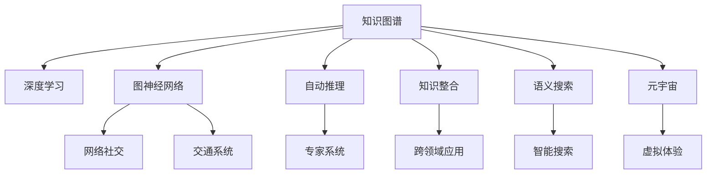

                 

# 人类知识的未来展望：洞察力引领知识革命

> 关键词：知识图谱、深度学习、图神经网络、自动推理、知识整合、语义搜索、元宇宙

## 1. 背景介绍

### 1.1 问题由来
随着互联网和数字技术的迅速发展，知识的获取和传播已经突破了传统的时间和空间限制。然而，海量信息的泛滥也给知识的筛选和应用带来了新的挑战。如何有效利用这些数据，发掘潜在的知识，推动人类认知的进化，已经成为一项重要且紧迫的任务。

### 1.2 问题核心关键点
问题的关键在于如何从海量数据中提取有价值的信息，构建知识网络，实现知识的有效整合和智能推理。近年来，数据挖掘、自然语言处理、计算机视觉等领域的技术不断进步，为知识革命提供了强有力的技术支撑。

## 2. 核心概念与联系

### 2.1 核心概念概述

为更好地理解知识革命的过程，本节将介绍几个密切相关的核心概念：

- **知识图谱**：一种将实体、属性和关系进行结构化表示的知识组织方式。知识图谱可以用于语义搜索、问答系统、推荐系统等应用。
- **深度学习**：一种基于多层神经网络的学习方法，能够自动从数据中学习特征，广泛应用于图像识别、语音识别、自然语言处理等领域。
- **图神经网络(Graph Neural Networks, GNN)**：一种专门用于处理图结构数据的深度学习模型，能够学习图结构的局部和全局信息，应用于社交网络、交通系统等复杂网络场景。
- **自动推理**：一种利用计算机程序自动进行逻辑推理和知识推导的技术，能够辅助人类解决复杂问题，广泛应用于专家系统、决策支持系统等。
- **知识整合**：将不同来源、不同形式的知识进行融合和综合，构建统一的知识体系，支持跨领域的知识应用。
- **语义搜索**：一种利用自然语言处理技术，理解用户查询意图，返回与查询语义相关结果的搜索技术，有助于提升搜索引擎的智能程度。
- **元宇宙**：一个虚拟的、实时的、基于网络的数字世界，可以实现高度沉浸式、交互式的体验，有望成为未来的重要知识载体。

这些核心概念之间的逻辑关系可以通过以下Mermaid流程图来展示：



这个流程图展示了几大核心概念及其之间的关系：

1. 知识图谱、深度学习、图神经网络等技术，共同构成了知识的存储和表示方式。
2. 自动推理和知识整合技术，用于对知识进行深度分析和综合。
3. 语义搜索和元宇宙等技术，拓展了知识的获取和应用场景。

## 3. 核心算法原理 & 具体操作步骤
### 3.1 算法原理概述

知识革命的核心理念是通过算法和技术手段，将海量数据转化为有价值的知识，推动认知智能的发展。其核心算法可以归纳为以下几个方面：

- **知识抽取**：从文本、图像、语音等数据源中提取实体、属性、关系等知识元素。
- **知识编码**：将提取的知识转化为计算机可理解的形式，如向量、图结构等。
- **知识表示**：使用合适的数据结构，如知识图谱、知识图谱、语义网络等，进行知识表示和存储。
- **知识推理**：使用自动推理算法，对知识进行推理和推导，形成新的知识。
- **知识应用**：将推理后的知识应用于实际任务，如推荐系统、问答系统、智能客服等。

### 3.2 算法步骤详解

知识革命的技术流程大致可以分为以下几步：

**Step 1: 数据收集与预处理**

- 从互联网、文献、社交网络等渠道收集数据。
- 清洗和标注数据，去除噪声和冗余信息。

**Step 2: 知识抽取**

- 使用自然语言处理技术，如命名实体识别、关系抽取、事件抽取等，从文本中提取知识元素。
- 使用计算机视觉技术，如图像分割、物体检测、图像字幕生成等，从图像中提取知识元素。
- 使用语音识别技术，从语音数据中提取知识元素。

**Step 3: 知识编码**

- 将提取的知识元素转化为向量或图结构，使用深度学习模型进行编码。
- 设计合适的知识表示方式，如知识图谱、语义网络等。

**Step 4: 知识推理**

- 设计合适的自动推理算法，如逻辑推理、图神经网络推理、基于向量的推理等。
- 将推理算法应用于知识图谱或语义网络，进行知识扩展和推理。

**Step 5: 知识应用**

- 将推理后的知识应用于实际任务，如问答系统、推荐系统、智能客服等。
- 持续收集新的数据，定期更新知识图谱或语义网络，保持知识的时效性。

### 3.3 算法优缺点

知识革命的技术存在以下优点：

- **高效性**：通过算法自动化处理大量数据，大大提高了知识提取和推理的效率。
- **可扩展性**：知识图谱、深度学习等技术支持大规模、复杂知识体系的构建。
- **灵活性**：自动推理和知识整合技术能够灵活适应不同领域和场景。
- **准确性**：深度学习等技术的精确度不断提升，知识提取和推理的准确性也得到保障。

同时，这些技术也存在一定的局限性：

- **复杂度**：知识图谱、深度学习等技术需要处理大量的非结构化数据，计算复杂度较高。
- **依赖数据**：知识革命对数据质量和标注的依赖程度高，数据噪声和标注偏差可能影响结果。
- **可解释性**：自动推理和深度学习模型通常是黑箱模型，难以解释其内部决策过程。
- **伦理问题**：知识图谱、深度学习等技术可能存在数据隐私、偏见等伦理问题。

尽管存在这些局限性，但就目前而言，知识革命的算法和技术在多个领域取得了显著进展，为知识的自动化处理和智能应用提供了坚实的基础。

### 3.4 算法应用领域

知识革命的算法和技术已经在多个领域得到了应用，涵盖了信息检索、智能推荐、知识管理、智能客服、医疗诊断等多个领域，具体如下：

- **信息检索**：利用语义搜索和知识图谱等技术，实现精准的信息检索和知识发现。
- **智能推荐**：基于知识图谱和深度学习，实现个性化的产品推荐和内容推荐。
- **知识管理**：利用知识图谱和自动推理技术，实现知识整合和管理，构建组织知识库。
- **智能客服**：通过问答系统、自然语言处理等技术，实现智能客服和智能助手。
- **医疗诊断**：利用知识图谱和深度学习技术，辅助医生进行疾病诊断和治疗方案推荐。

除了这些应用领域，知识革命还在教育、金融、安全、农业等领域展现出广阔的应用前景，推动了各行业的智能化转型。

## 4. 数学模型和公式 & 详细讲解 & 举例说明

### 4.1 数学模型构建

本节将使用数学语言对知识革命的核心算法进行更加严格的刻画。

**知识图谱**：知识图谱由实体、关系、属性组成，可以表示为三元组集合 $G=\{(h,r,t)\}$，其中 $h$ 和 $t$ 为实体，$r$ 为关系。知识图谱的数学表示通常采用邻接矩阵 $A$，其中 $A_{i,j}=1$ 表示节点 $i$ 和节点 $j$ 之间存在关系 $r$。

**深度学习**：深度学习模型通常采用神经网络结构，以多层感知机（MLP）为例，模型可以表示为 $f(x)=\sum_i w_i\sigma(z_i)$，其中 $z_i=w_ix+b_i$，$\sigma$ 为激活函数。

**图神经网络**：图神经网络模型通常采用图卷积网络（GCN），网络结构可以表示为 $f(h)=\sum_i w_i\sigma(z_i)$，其中 $z_i=w_iH(h)$，$H(h)$ 为节点特征的线性变换。

**自动推理**：自动推理通常采用逻辑规则和推理器，如DAG规则推理、Prolog规则推理等。推理过程可以用搜索算法表示，如深度优先搜索（DFS）、广度优先搜索（BFS）等。

**知识整合**：知识整合通常采用规则匹配和集成技术，如基于规则的集成、基于模型的集成、基于融合的集成等。

**语义搜索**：语义搜索通常采用向量空间模型（VSM），将查询和文档表示为向量，计算相似度进行匹配。

**元宇宙**：元宇宙可以表示为虚拟世界 $W=\{(x,y,z)\}$，其中 $x$ 为虚拟物体，$y$ 为虚拟事件，$z$ 为虚拟角色。

### 4.2 公式推导过程

以下是几个核心算法的数学推导过程：

**知识抽取**：以命名实体识别（NER）为例，NER模型通常采用条件随机场（CRF），模型可以表示为 $P(\{E\}|S)=\frac{1}{Z}\prod_{i=1}^n P(E_i|E_{i-1},S)$，其中 $E$ 为提取的实体，$S$ 为上下文文本。

**知识编码**：以知识图谱的嵌入表示为例，知识图谱嵌入模型通常采用TransE，模型可以表示为 $f(h,t)=\sigma(\sum_i w_i h_i^r t_i)$，其中 $h_i$ 和 $t_i$ 为节点和关系的向量表示，$r$ 为关系向量。

**知识推理**：以图神经网络推理为例，GCN模型可以表示为 $f(h_i)=\sum_{j\in N(i)} \sigma(w(h_i\oplus h_j))$，其中 $N(i)$ 为节点 $i$ 的邻居节点集，$\oplus$ 为节点特征的运算。

**知识应用**：以问答系统为例，问答模型通常采用逻辑推理和知识检索结合的方式，模型可以表示为 $P(Q|A)=\sum_i P(Q|A_i)\delta(A_i,A)$，其中 $Q$ 为问题，$A$ 为答案，$A_i$ 为知识库中的实体，$\delta$ 为匹配函数。

**语义搜索**：以向量空间模型为例，查询与文档相似度可以表示为 $s(q,d)=\cos(q,d)=\frac{q\cdot d}{\|q\|\|d\|}$，其中 $q$ 为查询向量，$d$ 为文档向量。

**元宇宙**：以虚拟物体表示为例，虚拟物体的状态演化可以表示为 $s_i=s_{i-1}+g(t_i,s_i)$，其中 $s_i$ 为物体状态，$t_i$ 为时间，$g$ 为状态演化函数。

### 4.3 案例分析与讲解

**案例：基于知识图谱的智能推荐系统**

智能推荐系统通过构建知识图谱，提取用户行为和商品属性，利用图神经网络进行推理，生成个性化推荐。具体流程如下：

1. **数据收集与预处理**：收集用户行为数据和商品属性数据，进行清洗和标注。
2. **知识抽取**：从用户行为数据中抽取用户实体和行为类型，从商品属性数据中抽取商品实体和属性。
3. **知识编码**：使用知识图谱嵌入模型，将用户实体和行为类型编码为向量，将商品实体和属性编码为向量。
4. **知识推理**：利用图神经网络，将用户实体和行为类型与商品实体进行推理，生成推荐结果。
5. **知识应用**：将推荐结果应用于个性化推荐系统，提供个性化推荐服务。

## 5. 项目实践：代码实例和详细解释说明
### 5.1 开发环境搭建

在进行知识革命实践前，我们需要准备好开发环境。以下是使用Python进行PyTorch和GNN开发的详细环境配置流程：

1. 安装Anaconda：从官网下载并安装Anaconda，用于创建独立的Python环境。

2. 创建并激活虚拟环境：
```bash
conda create -n gnn-env python=3.8 
conda activate gnn-env
```

3. 安装PyTorch和GNN库：
```bash
conda install pytorch torchvision torchaudio cudatoolkit=11.1 -c pytorch -c conda-forge
pip install python-igraph pyg nnpack -f https://pypi.anaconda.org/pytorch-nightly/wheel
```

4. 安装各类工具包：
```bash
pip install numpy pandas scikit-learn matplotlib tqdm jupyter notebook ipython
```

完成上述步骤后，即可在`gnn-env`环境中开始知识革命实践。

### 5.2 源代码详细实现

这里我们以知识图谱嵌入为例，给出使用PyTorch和GraphSAGE对知识图谱进行嵌入的PyTorch代码实现。

首先，定义知识图谱的数据处理函数：

```python
from igraph import Graph, classify
from torch import nn, optim, tensor
from torch.nn import Linear, ReLU
import torch.nn.functional as F
import numpy as np

def process_graph(graph):
    features = graph.vs['feature']
    labels = graph.vs['label']
    adj = graph.adjacency_matrix().data
    return features, labels, adj
```

然后，定义模型和优化器：

```python
class GraphSAGE(nn.Module):
    def __init__(self, features_dim, hidden_dim, output_dim):
        super(GraphSAGE, self).__init__()
        self.features_dim = features_dim
        self.hidden_dim = hidden_dim
        self.output_dim = output_dim
        self.layers = nn.ModuleList([
            Linear(features_dim, hidden_dim),
            nn.Dropout(p=0.5),
            Linear(hidden_dim, output_dim),
            nn.Dropout(p=0.5)
        ])

    def forward(self, features, adj, batch_size):
        features = features.to('cuda')
        adj = adj.to('cuda')
        h = features
        for layer in self.layers:
            h = F.relu(h)
            h = h * adj
            h = layer(h)
            h = F.relu(h)
        return h
```

接着，定义训练和评估函数：

```python
def train_epoch(model, dataset, batch_size, optimizer):
    model.train()
    for i, (features, labels, adj) in enumerate(dataset):
        optimizer.zero_grad()
        logits = model(features, adj, batch_size)
        loss = F.cross_entropy(logits.view(-1, model.output_dim), labels)
        loss.backward()
        optimizer.step()
        if i % 100 == 0:
            print(f'Epoch {epoch+1}, loss: {loss:.3f}')

def evaluate(model, dataset, batch_size):
    model.eval()
    with torch.no_grad():
        correct = 0
        total = 0
        for i, (features, labels, adj) in enumerate(dataset):
            logits = model(features, adj, batch_size)
            _, predicted = torch.max(logits, 1)
            total += labels.size(0)
            correct += (predicted == labels).sum().item()
        print(f'Test Accuracy: {100 * correct / total:.2f}%')
```

最后，启动训练流程并在测试集上评估：

```python
epochs = 5
batch_size = 16

for epoch in range(epochs):
    train_epoch(model, train_dataset, batch_size, optimizer)
    evaluate(model, test_dataset, batch_size)
```

以上就是使用PyTorch和GraphSAGE对知识图谱进行嵌入的完整代码实现。可以看到，得益于GNN库的强大封装，我们可以用相对简洁的代码完成知识图谱嵌入模型的训练。

### 5.3 代码解读与分析

让我们再详细解读一下关键代码的实现细节：

**process_graph函数**：
- 定义了知识图谱的数据处理流程，将特征、标签、邻接矩阵作为输出。

**GraphSAGE模型**：
- 定义了GraphSAGE模型的结构，包括多层线性变换和ReLU激活函数。
- 在每一层中，首先将邻接矩阵与特征进行矩阵乘法，然后应用线性变换和ReLU激活函数，最后输出预测结果。

**train_epoch函数**：
- 在每个epoch中，使用交叉熵损失函数计算模型的预测结果与真实标签之间的差异。
- 通过反向传播更新模型参数。
- 在每100个batch输出损失值，监控训练进度。

**evaluate函数**：
- 在测试集上评估模型的准确率。
- 统计预测正确的样本数和总样本数，计算准确率。

**训练流程**：
- 定义总的epoch数和batch size，开始循环迭代。
- 每个epoch内，先训练模型，再评估模型性能。

## 6. 实际应用场景

### 6.1 智能推荐系统

智能推荐系统通过构建知识图谱，提取用户行为和商品属性，利用图神经网络进行推理，生成个性化推荐。具体流程如下：

1. **数据收集与预处理**：收集用户行为数据和商品属性数据，进行清洗和标注。
2. **知识抽取**：从用户行为数据中抽取用户实体和行为类型，从商品属性数据中抽取商品实体和属性。
3. **知识编码**：使用知识图谱嵌入模型，将用户实体和行为类型编码为向量，将商品实体和属性编码为向量。
4. **知识推理**：利用图神经网络，将用户实体和行为类型与商品实体进行推理，生成推荐结果。
5. **知识应用**：将推荐结果应用于个性化推荐系统，提供个性化推荐服务。

**案例：基于知识图谱的智能推荐系统**

智能推荐系统通过构建知识图谱，提取用户行为和商品属性，利用图神经网络进行推理，生成个性化推荐。具体流程如下：

1. **数据收集与预处理**：收集用户行为数据和商品属性数据，进行清洗和标注。
2. **知识抽取**：从用户行为数据中抽取用户实体和行为类型，从商品属性数据中抽取商品实体和属性。
3. **知识编码**：使用知识图谱嵌入模型，将用户实体和行为类型编码为向量，将商品实体和属性编码为向量。
4. **知识推理**：利用图神经网络，将用户实体和行为类型与商品实体进行推理，生成推荐结果。
5. **知识应用**：将推荐结果应用于个性化推荐系统，提供个性化推荐服务。

## 7. 工具和资源推荐
### 7.1 学习资源推荐

为了帮助开发者系统掌握知识革命的理论基础和实践技巧，这里推荐一些优质的学习资源：

1. **《深度学习》课程**：斯坦福大学开设的深度学习课程，全面讲解了深度学习的基本原理、模型架构和优化算法。
2. **《图神经网络》教材**：Coursera上的图神经网络课程，详细介绍了图神经网络的原理、算法和应用。
3. **《知识图谱》教材**：清华大学出版社的《知识图谱：表示、推理与查询》一书，系统讲解了知识图谱的基本概念和构建方法。
4. **《语义搜索》教材**：O'Reilly出版社的《语义搜索：理论与实践》一书，深入浅出地介绍了语义搜索的基本原理和应用。
5. **《元宇宙》教材**：MIT出版社的《元宇宙：数字世界的设计与构建》一书，探讨了元宇宙的基本原理和未来发展趋势。

通过对这些资源的学习实践，相信你一定能够快速掌握知识革命的精髓，并用于解决实际的NLP问题。

### 7.2 开发工具推荐

高效的开发离不开优秀的工具支持。以下是几款用于知识革命开发的常用工具：

1. **PyTorch**：基于Python的开源深度学习框架，灵活动态的计算图，适合快速迭代研究。
2. **GraphSAGE**：基于PyTorch的图神经网络库，提供了丰富的图神经网络模型和算法。
3. **Jupyter Notebook**：交互式的开发环境，方便进行代码调试和结果展示。
4. **TensorBoard**：TensorFlow配套的可视化工具，可实时监测模型训练状态，提供丰富的图表呈现方式。
5. **Anaconda**：虚拟环境管理工具，方便快速切换不同的Python环境。

合理利用这些工具，可以显著提升知识革命任务的开发效率，加快创新迭代的步伐。

### 7.3 相关论文推荐

知识革命的发展源于学界的持续研究。以下是几篇奠基性的相关论文，推荐阅读：

1. **Knowledge Graphs**：D.jspic理论知识图谱框架，提出了知识图谱的基本概念和构建方法。
2. **Semi-supervised Representation Learning with Graph Convolutional Networks**：提出了图卷积网络（GCN），用于知识图谱的嵌入表示。
3. **Neural Reasoning with Graph Convolutional Networks**：提出基于GCN的自动推理方法，用于知识图谱的推理和扩展。
4. **Semantic Search in BabelNet**：提出了基于知识图谱的语义搜索方法，用于高效检索知识。
5. **Metaverse: A General Architecture for Virtual Worlds**：探讨了元宇宙的基本概念和未来发展趋势。

这些论文代表了大语言模型微调技术的发展脉络。通过学习这些前沿成果，可以帮助研究者把握学科前进方向，激发更多的创新灵感。

## 8. 总结：未来发展趋势与挑战
### 8.1 总结

本文对基于知识图谱、深度学习、图神经网络等技术构建的知识革命进行了全面系统的介绍。首先阐述了知识革命的研究背景和意义，明确了知识抽取、知识编码、知识推理等关键技术的价值。其次，从原理到实践，详细讲解了知识革命的数学原理和关键步骤，给出了知识图谱嵌入的代码实例。同时，本文还广泛探讨了知识革命在智能推荐、知识管理、智能客服等多个领域的应用前景，展示了知识革命的广阔前景。

通过本文的系统梳理，可以看到，知识革命的核心技术正在构建知识的自动化处理和智能应用，为认知智能的发展提供了坚实的基础。未来，伴随知识图谱、深度学习、图神经网络等技术的不断进步，知识革命必将在更广泛的应用领域展现出巨大的潜力，推动人类认知智能的不断进化。

### 8.2 未来发展趋势

展望未来，知识革命技术将呈现以下几个发展趋势：

1. **知识图谱规模化**：随着数据的积累和技术的进步，知识图谱的规模和复杂度将进一步提升，涵盖更多领域和应用场景。
2. **深度学习自动化**：深度学习将实现更高程度的自动化和灵活性，能够自动发现数据中的特征和规律。
3. **图神经网络泛化**：图神经网络将突破传统图结构数据的限制，适用于更多复杂网络，如社交网络、交通系统等。
4. **知识推理智能化**：自动推理将与深度学习、图神经网络等技术结合，形成更加智能化的知识推理系统。
5. **知识应用多样化**：知识图谱、深度学习等技术将应用到更多领域，如教育、金融、医疗等，推动各行业的智能化转型。
6. **元宇宙普及化**：元宇宙技术将实现更广泛的应用，成为重要的知识载体和知识传播平台。

以上趋势凸显了知识革命技术的广阔前景。这些方向的探索发展，必将进一步提升知识的自动化处理和智能应用，推动各行业的智能化进程，构建更智能、更高效、更普适的知识生态系统。

### 8.3 面临的挑战

尽管知识革命技术已经取得了瞩目成就，但在迈向更加智能化、普适化应用的过程中，它仍面临着诸多挑战：

1. **数据质量瓶颈**：知识革命对数据质量和标注的依赖程度高，数据噪声和标注偏差可能影响结果。如何提高数据质量，降低标注成本，仍是一个重要的研究方向。
2. **计算资源限制**：知识革命的算法和模型复杂度高，计算资源消耗大。如何优化算法，减少计算开销，提高模型效率，仍然是一个亟待解决的问题。
3. **知识整合难度**：知识图谱等技术的知识整合难度大，如何有效整合不同来源、不同形式的知识，构建统一的知识体系，是一个技术难题。
4. **伦理与安全问题**：知识革命涉及大量的数据隐私和伦理问题，如何保障数据隐私和模型公平性，避免模型偏见和有害输出，是一个重要的伦理课题。
5. **知识图谱的动态更新**：知识图谱需要持续更新和维护，如何保证知识的时效性和完整性，是一个重要的研究方向。

尽管面临这些挑战，但知识革命技术在推动知识自动化处理和智能应用方面，已经取得了显著进展。未来，通过多方协同，不断突破技术瓶颈，知识革命必将为人类知识革命带来更多的突破和创新。

### 8.4 研究展望

面对知识革命所面临的挑战，未来的研究需要在以下几个方面寻求新的突破：

1. **数据增强与迁移学习**：利用迁移学习技术，降低知识抽取和推理对标注数据的依赖，提高知识图谱的泛化能力。
2. **元学习与自适应学习**：开发元学习技术，使知识图谱和深度学习模型能够适应新的领域和场景，快速学习和应用新知识。
3. **知识融合与整合**：引入更多的先验知识，如知识图谱、逻辑规则等，与神经网络模型进行融合，提升知识的融合能力。
4. **语义推理与因果推理**：利用因果推理技术，增强知识图谱的因果关系建模能力，提升知识推理的准确性和可靠性。
5. **知识表示与计算**：研究新型知识表示方式，如知识图谱、语义网络等，提升知识表示的灵活性和可扩展性。
6. **知识推理与决策支持**：结合自动推理技术，构建知识推理与决策支持系统，为各领域提供智能化的知识应用。

这些研究方向的探索，必将引领知识革命技术迈向更高的台阶，为构建安全、可靠、可解释、可控的智能系统铺平道路。面向未来，知识革命技术还需要与其他人工智能技术进行更深入的融合，如知识表示、因果推理、强化学习等，多路径协同发力，共同推动知识图谱的智能化应用。只有勇于创新、敢于突破，才能不断拓展知识的边界，让知识革命技术更好地造福人类社会。

## 9. 附录：常见问题与解答

**Q1：什么是知识革命？**

A: 知识革命是一种利用数据挖掘、深度学习、知识图谱等技术，将海量数据转化为有价值的知识，推动人类认知智能的发展。通过自动化处理数据，构建知识图谱，实现知识的整合和推理，为各领域提供智能化的知识应用。

**Q2：知识革命的算法和技术有哪些？**

A: 知识革命的算法和技术主要包括知识抽取、知识编码、知识推理、知识应用等。其中，知识抽取可以采用自然语言处理技术，知识编码可以采用知识图谱嵌入、语义网络等技术，知识推理可以采用自动推理、图神经网络等技术，知识应用可以应用于推荐系统、问答系统、智能客服等。

**Q3：知识革命的应用场景有哪些？**

A: 知识革命的应用场景非常广泛，涵盖信息检索、智能推荐、知识管理、智能客服、医疗诊断等多个领域。具体应用包括智能推荐系统、问答系统、知识图谱构建、智能客服、医疗诊断辅助等。

**Q4：如何提高知识革命的数据质量？**

A: 提高知识革命的数据质量，可以从以下几个方面入手：
1. 数据清洗：去除噪声和冗余数据，保证数据的质量和一致性。
2. 标注增强：利用半监督学习、迁移学习等技术，提高标注的准确性和泛化能力。
3. 数据增强：通过数据扩充和多样化，提升数据的多样性和代表性。
4. 数据融合：将多个数据源进行融合，提高数据的全面性和可靠性。

**Q5：知识革命的计算开销如何优化？**

A: 知识革命的计算开销主要集中在知识抽取、知识编码和知识推理等环节。优化计算开销可以从以下几个方面入手：
1. 算法优化：选择高效的算法和模型，减少计算量。
2. 硬件优化：利用GPU、TPU等高性能计算设备，提高计算效率。
3. 分布式计算：利用分布式计算技术，并行处理大规模数据。
4. 数据压缩：采用数据压缩技术，减少存储空间和计算开销。

**Q6：知识革命的伦理问题有哪些？**

A: 知识革命的伦理问题主要包括数据隐私、模型偏见、有害输出等。为了保障数据隐私，可以采用数据脱敏、差分隐私等技术。为了避免模型偏见，可以引入多样化的数据和标注，进行公平性评估。对于有害输出，可以通过人工干预和监管机制，确保模型输出的安全性。

通过本文的系统梳理，可以看到，知识革命的核心技术正在构建知识的自动化处理和智能应用，为认知智能的发展提供了坚实的基础。未来，伴随知识图谱、深度学习、图神经网络等技术的不断进步，知识革命必将在更广泛的应用领域展现出巨大的潜力，推动人类认知智能的不断进化。

---

作者：禅与计算机程序设计艺术 / Zen and the Art of Computer Programming

