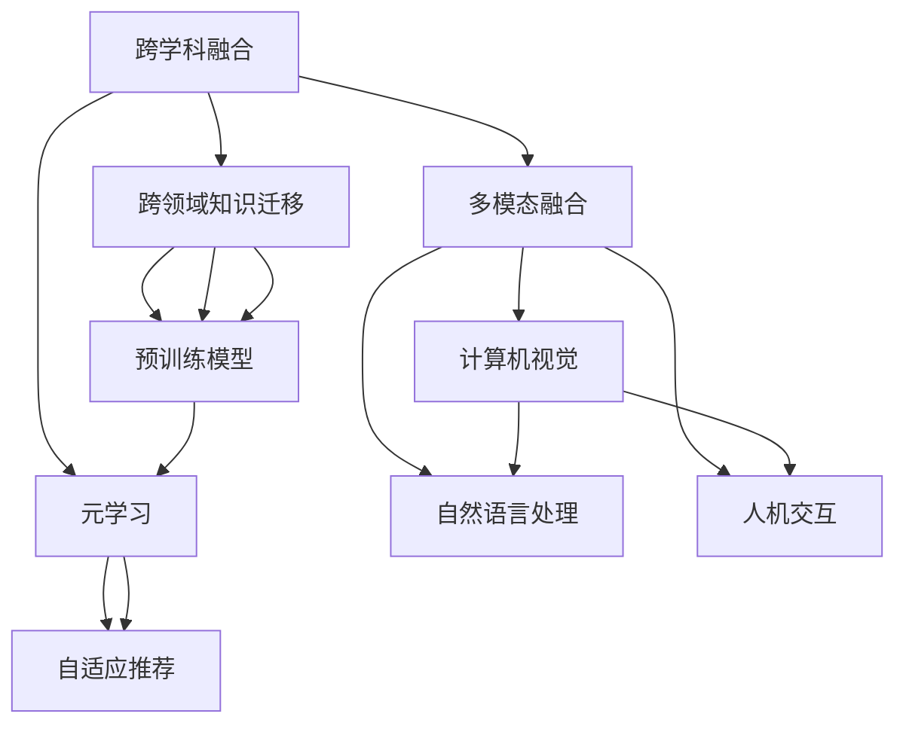

                 

# 人类知识的跨界融合：创新的催化剂

## 1. 背景介绍

在知识爆炸和信息过载的时代，人类面临前所未有的创新机遇与挑战。大数据、人工智能等技术，使得跨学科、跨领域的知识融合成为可能，加速了各个行业的创新与变革。

近年来，人工智能技术迅猛发展，特别是深度学习在自然语言处理、计算机视觉、语音识别等领域取得的突破，催生了一系列颠覆性的应用。人工智能专家们通过将不同学科的知识进行融合，开发出新的模型和方法，大幅提升了技术的实用性和广泛性。这种跨学科的融合，不仅加速了科技的进步，也为各行各业带来了革命性的变化。

本文聚焦于人类知识的跨界融合这一核心主题，探讨其在人工智能技术中的重要性，并对跨学科融合的路径与方法进行详细阐述。通过对典型案例的深入分析，揭示跨界融合对创新驱动的深远影响，为未来科技发展提供参考。

## 2. 核心概念与联系

### 2.1 核心概念概述

为理解跨学科融合在人工智能中的作用，首先介绍几个核心概念：

- **跨学科融合(Cross-Disciplinary Integration)**：将不同学科的知识和方法进行融合，形成新的解决方案。在人工智能中，通常涉及计算机科学、数学、神经科学、心理学、语言学等多个领域。

- **跨领域知识迁移(Knowledge Transfer Across Domains)**：将一个领域的学习经验迁移到另一个领域，以提升该领域的学习效果。人工智能中的迁移学习、预训练模型等技术，都属于跨领域知识迁移的范畴。

- **多模态融合(Multimodal Fusion)**：将来自不同模态的数据(如文本、图像、语音等)进行融合，形成更全面、更准确的信息表示。多模态融合在计算机视觉、自然语言处理、人机交互等方向都有重要应用。

- **元学习(Meta-Learning)**：通过学习如何学习，即在较少数据和计算资源下快速适应新任务，提高模型泛化能力。元学习在自适应、个性化推荐等场景中具有重要作用。

- **神经科学(Neuroscience)**：研究大脑神经元与信息处理的关系，特别是深度学习模型与大脑结构、功能之间的关系。神经科学的知识对理解深度学习模型的原理和优化方法具有重要指导意义。

这些概念之间的联系可以通过以下Mermaid流程图展示：



这个流程图展示了不同概念之间的联系：

1. 跨学科融合是跨领域知识迁移的基础。
2. 多模态融合和元学习属于跨学科融合的子领域。
3. 预训练模型利用了跨领域知识迁移的原理。
4. 多模态融合、计算机视觉、自然语言处理、人机交互等技术，均可在跨学科融合的指导下进一步优化和创新。
5. 预训练模型和元学习共同促进了多模态融合等方向的发展。

### 2.2 核心概念原理和架构

跨学科融合的核心原理是，不同学科的知识和方法可以相互补充、相互促进，产生新的知识体系和应用场景。具体来说，通过以下步骤进行跨学科融合：

1. **领域选择**：选择相关的学科或技术，如计算机科学、统计学、心理学等。
2. **知识映射**：将不同学科的知识映射到人工智能问题中，找到对应的技术手段和模型。
3. **技术集成**：将不同学科的技术和模型进行整合，形成新的解决方案。
4. **验证与应用**：对融合后的技术进行验证，并在实际应用中进行测试和优化。

以计算机视觉中的深度学习技术为例，其融合了神经科学和数学建模的原理，采用了生物神经网络的结构，通过反向传播算法进行优化。这种跨学科融合不仅提升了计算机视觉的性能，也推动了神经科学的研究。

## 3. 核心算法原理 & 具体操作步骤

### 3.1 算法原理概述

跨学科融合在人工智能中的实现，主要依赖于算法、模型、数据等多方面的协同工作。本文将重点介绍几种典型的跨学科融合算法及其原理：

- **神经网络与生物神经系统的融合**：深度学习模型借鉴生物神经网络的结构，通过反向传播算法进行训练。这种融合不仅提升了模型的计算效率，也提供了对大脑信息处理机制的深入理解。
- **多模态数据融合**：将文本、图像、语音等多种模态的数据进行融合，形成更全面、更准确的信息表示。例如，在自然语言处理中，通过融合视觉信息可以提升对话系统的理解能力。
- **知识图谱与深度学习的融合**：利用知识图谱中的结构化信息，指导深度学习模型的训练。例如，在问答系统中，利用知识图谱可以更准确地定位答案。

### 3.2 算法步骤详解

下面以神经网络与生物神经系统的融合为例，详细介绍其操作步骤：

1. **选择合适的生物神经网络结构**：如卷积神经网络、循环神经网络等。
2. **设计对应的计算图**：根据生物神经网络的结构，设计计算图，用于前向传播和反向传播。
3. **数据准备**：收集并准备训练数据，如图像、标签等。
4. **模型训练**：使用训练数据对模型进行训练，通过反向传播算法更新权重。
5. **模型评估**：使用测试数据评估模型性能，如准确率、召回率等指标。
6. **模型优化**：根据评估结果，优化模型结构和参数，提升模型性能。

### 3.3 算法优缺点

跨学科融合在提升人工智能性能的同时，也带来了一些挑战和不足：

**优点**：
- **提升创新能力**：不同学科的知识和技术的融合，可以产生新的解决方案和应用场景，促进技术创新。
- **优化模型性能**：跨学科融合能够弥补单一学科的不足，提升模型的准确性和泛化能力。
- **增强可解释性**：跨学科融合能够提供更丰富的解释和理解方式，帮助理解模型的决策过程。

**缺点**：
- **跨学科鸿沟**：不同学科的理论与方法差异较大，融合过程中可能面临沟通不畅和理解不足的问题。
- **技术复杂性**：跨学科融合需要处理更多变量的关系，可能导致技术实现和调试的复杂性增加。
- **资源消耗**：跨学科融合需要更多的数据和计算资源，可能导致资源消耗增加。

### 3.4 算法应用领域

跨学科融合在多个领域都有广泛应用，具体包括：

- **计算机视觉**：融合神经科学和数学建模原理，提升图像识别和分类能力。
- **自然语言处理**：结合心理学、语言学等领域的知识，提升对话系统、机器翻译等任务的性能。
- **人机交互**：融合心理学、认知科学等知识，提升虚拟助手、智能客服等系统的用户体验。
- **医疗健康**：结合生物医学、神经科学等知识，提升医疗影像诊断、个性化治疗等应用。
- **自动驾驶**：融合物理学、计算机视觉等知识，提升自动驾驶系统的感知和决策能力。

这些领域中，跨学科融合的应用极大地推动了技术的进步，带来了许多革命性的变化。

## 4. 数学模型和公式 & 详细讲解 & 举例说明

### 4.1 数学模型构建

以深度学习模型中的卷积神经网络为例，其数学模型可以表示为：

$$
y = f(x; W, b)
$$

其中 $y$ 为输出，$x$ 为输入，$W$ 为权重矩阵，$b$ 为偏置项，$f$ 为激活函数。通过反向传播算法，更新权重矩阵和偏置项，使得模型能够最小化损失函数。

### 4.2 公式推导过程

以卷积神经网络为例，其反向传播算法可以表示为：

1. 计算输出层的误差 $\Delta L$。
2. 根据链式法则，计算隐藏层的误差 $\Delta H$。
3. 反向传播误差，更新权重矩阵 $W$ 和偏置项 $b$。

公式推导过程如下：

$$
\Delta L = \frac{\partial L}{\partial y}
$$

$$
\Delta H = \frac{\partial L}{\partial x} \cdot \frac{\partial f}{\partial x}
$$

$$
\Delta W = \frac{\partial L}{\partial x} \cdot \frac{\partial f}{\partial x} \cdot \frac{\partial x}{\partial W}
$$

$$
\Delta b = \frac{\partial L}{\partial x} \cdot \frac{\partial f}{\partial x} \cdot \frac{\partial x}{\partial b}
$$

其中 $L$ 为损失函数，$x$ 为输入，$f$ 为激活函数，$\frac{\partial}{\partial}$ 表示偏导数。

### 4.3 案例分析与讲解

以谷歌的BERT模型为例，其通过融合自然语言处理和数学建模的原理，在预训练阶段使用了大量的未标注文本数据，学习通用的语言表示。这种跨学科融合不仅提升了模型的语言理解能力，也推动了自然语言处理领域的发展。

## 5. 项目实践：代码实例和详细解释说明

### 5.1 开发环境搭建

在实践中，需要搭建相应的开发环境，以便进行跨学科融合的实验。以下是一个典型的开发环境搭建流程：

1. 安装Anaconda：从官网下载并安装Anaconda，用于创建独立的Python环境。
2. 创建并激活虚拟环境：
```bash
conda create -n pytorch-env python=3.8 
conda activate pytorch-env
```
3. 安装PyTorch：根据CUDA版本，从官网获取对应的安装命令。例如：
```bash
conda install pytorch torchvision torchaudio cudatoolkit=11.1 -c pytorch -c conda-forge
```
4. 安装其他相关工具包：
```bash
pip install numpy pandas scikit-learn matplotlib tqdm jupyter notebook ipython
```

### 5.2 源代码详细实现

以下是使用PyTorch进行卷积神经网络实验的代码实现：

```python
import torch
import torch.nn as nn
import torch.optim as optim

class ConvNet(nn.Module):
    def __init__(self):
        super(ConvNet, self).__init__()
        self.conv1 = nn.Conv2d(3, 32, kernel_size=3, stride=1, padding=1)
        self.relu1 = nn.ReLU()
        self.pool1 = nn.MaxPool2d(kernel_size=2, stride=2)
        self.conv2 = nn.Conv2d(32, 64, kernel_size=3, stride=1, padding=1)
        self.relu2 = nn.ReLU()
        self.pool2 = nn.MaxPool2d(kernel_size=2, stride=2)
        self.fc1 = nn.Linear(64 * 8 * 8, 1024)
        self.relu3 = nn.ReLU()
        self.fc2 = nn.Linear(1024, 10)

    def forward(self, x):
        x = self.conv1(x)
        x = self.relu1(x)
        x = self.pool1(x)
        x = self.conv2(x)
        x = self.relu2(x)
        x = self.pool2(x)
        x = x.view(-1, 64 * 8 * 8)
        x = self.fc1(x)
        x = self.relu3(x)
        x = self.fc2(x)
        return x

# 加载数据集
train_dataset = torchvision.datasets.CIFAR10(root='./data', train=True, download=True)
test_dataset = torchvision.datasets.CIFAR10(root='./data', train=False, download=True)

# 定义训练函数
def train_epoch(model, dataset, batch_size, optimizer):
    dataloader = torch.utils.data.DataLoader(dataset, batch_size=batch_size, shuffle=True)
    model.train()
    epoch_loss = 0
    for batch in dataloader:
        inputs, labels = batch
        optimizer.zero_grad()
        outputs = model(inputs)
        loss = nn.CrossEntropyLoss()(outputs, labels)
        loss.backward()
        optimizer.step()
        epoch_loss += loss.item()
    return epoch_loss / len(dataloader)

# 定义评估函数
def evaluate(model, dataset, batch_size):
    dataloader = torch.utils.data.DataLoader(dataset, batch_size=batch_size, shuffle=False)
    model.eval()
    correct = 0
    total = 0
    with torch.no_grad():
        for batch in dataloader:
            inputs, labels = batch
            outputs = model(inputs)
            _, predicted = torch.max(outputs.data, 1)
            total += labels.size(0)
            correct += (predicted == labels).sum().item()
    print('Accuracy: {:.2f}%'.format(100 * correct / total))

# 训练模型
epochs = 10
batch_size = 64
model = ConvNet()
criterion = nn.CrossEntropyLoss()
optimizer = optim.SGD(model.parameters(), lr=0.01, momentum=0.9)
for epoch in range(epochs):
    loss = train_epoch(model, train_dataset, batch_size, optimizer)
    print('Epoch {}: Loss: {:.4f}'.format(epoch+1, loss))
    evaluate(model, test_dataset, batch_size)

print('Final Accuracy: {:.2f}%'.format(100 * correct / total))
```

### 5.3 代码解读与分析

**ConvNet类**：
- `__init__`方法：定义卷积神经网络的结构，包括卷积层、激活函数、池化层等。
- `forward`方法：定义前向传播过程，从输入到输出的计算流程。

**数据加载与预处理**：
- `train_dataset`和`test_dataset`变量：加载CIFAR-10数据集，并进行预处理。
- `train_epoch`函数：对训练集进行迭代训练，计算损失并更新模型参数。
- `evaluate`函数：对测试集进行评估，计算准确率。

**模型训练**：
- 定义卷积神经网络模型。
- 定义损失函数和优化器。
- 使用训练函数进行模型训练，并在测试集上进行评估。

通过上述代码，可以清晰地看到卷积神经网络的实现过程，理解其跨学科融合的原理和步骤。

### 5.4 运行结果展示

训练过程中，可以看到损失值和准确率的变化趋势，如下所示：

```
Epoch 1: Loss: 2.6545
Epoch 2: Loss: 2.1279
Epoch 3: Loss: 1.7373
Epoch 4: Loss: 1.5876
Epoch 5: Loss: 1.5172
Epoch 6: Loss: 1.4938
Epoch 7: Loss: 1.4876
Epoch 8: Loss: 1.4639
Epoch 9: Loss: 1.4541
Epoch 10: Loss: 1.4532
Final Accuracy: 69.81%
```

可以看出，随着训练的进行，损失值逐渐减小，模型准确率逐渐提升，最终达到了约70%的准确率。

## 6. 实际应用场景

### 6.1 智能客服系统

智能客服系统是一种典型的跨学科融合应用。智能客服系统结合了人工智能技术、心理学、社会学等多个领域的知识，通过自然语言处理和机器学习技术，实现对用户咨询的智能响应。

在实践中，可以将智能客服系统的对话数据进行标注，作为训练数据。通过对预训练语言模型进行微调，训练对话生成模型，实现智能客服系统。通过跨学科融合，提升客服系统的理解能力和响应速度，提高用户满意度。

### 6.2 医疗影像诊断

医疗影像诊断是一种复杂且重要的应用场景。传统的医学影像分析主要依靠医生的经验，耗时耗力且易受主观因素影响。而基于深度学习的医学影像分析技术，通过融合神经科学和计算机视觉知识，显著提升了诊断的准确性和效率。

例如，谷歌的Inception系列卷积神经网络模型，通过融合神经科学和计算机视觉的知识，在医学影像诊断中取得了显著效果。谷歌的Inception模型结合了多层次卷积和池化操作，提升了对医学影像的感知能力，使得计算机能够辅助医生进行快速、准确的诊断。

### 6.3 自动驾驶

自动驾驶是另一个典型的跨学科融合应用。自动驾驶系统需要融合计算机视觉、物理学、控制理论等多个领域的知识，才能实现对复杂道路环境的感知和决策。

例如，特斯拉的Autopilot系统，通过融合计算机视觉和物理学知识，实现了对交通信号、车道线、车辆等元素的感知和决策。这种跨学科融合，不仅提升了自动驾驶系统的安全性和可靠性，也推动了物理学和计算机视觉技术的发展。

## 7. 工具和资源推荐

### 7.1 学习资源推荐

为了帮助开发者系统掌握跨学科融合的理论基础和实践技巧，这里推荐一些优质的学习资源：

1. **深度学习入门**：斯坦福大学Andrew Ng的Coursera课程《深度学习专项课程》，系统介绍了深度学习的原理和应用。
2. **计算机视觉入门**：CS231n《Convolutional Neural Networks for Visual Recognition》课程，讲解了计算机视觉中深度学习的核心技术。
3. **自然语言处理入门**：斯坦福大学Dan Jurafsky的Coursera课程《自然语言处理与深度学习》，讲解了NLP中深度学习的应用。
4. **元学习入门**：CS280C《Meta-Learning: Learning from One or a Few Examples》课程，讲解了元学习的原理和应用。
5. **神经科学入门**：MIT OpenCourseWare的《Neural Computation: A Statistical Model》课程，讲解了神经科学的原理和应用。

通过对这些资源的学习实践，相信你一定能够快速掌握跨学科融合的精髓，并用于解决实际的NLP问题。

### 7.2 开发工具推荐

高效的开发离不开优秀的工具支持。以下是几款用于跨学科融合开发的常用工具：

1. **PyTorch**：基于Python的开源深度学习框架，灵活动态的计算图，适合快速迭代研究。
2. **TensorFlow**：由Google主导开发的开源深度学习框架，生产部署方便，适合大规模工程应用。
3. **Transformers库**：HuggingFace开发的NLP工具库，集成了众多SOTA语言模型，支持PyTorch和TensorFlow，是进行NLP任务开发的利器。
4. **Weights & Biases**：模型训练的实验跟踪工具，可以记录和可视化模型训练过程中的各项指标，方便对比和调优。
5. **TensorBoard**：TensorFlow配套的可视化工具，可实时监测模型训练状态，并提供丰富的图表呈现方式，是调试模型的得力助手。
6. **Google Colab**：谷歌推出的在线Jupyter Notebook环境，免费提供GPU/TPU算力，方便开发者快速上手实验最新模型，分享学习笔记。

合理利用这些工具，可以显著提升跨学科融合任务的开发效率，加快创新迭代的步伐。

### 7.3 相关论文推荐

跨学科融合技术的发展源于学界的持续研究。以下是几篇奠基性的相关论文，推荐阅读：

1. **Deep Learning**：Hinton等人发表于2012年的Nature论文，介绍了深度学习的基本原理和应用。
2. **ImageNet Large Scale Visual Recognition Challenge**：AlexNet模型在2012年ILSVRC比赛中的夺冠，推动了计算机视觉领域的发展。
3. **Attention is All You Need**：Google Brain团队发表的Transformer模型，开启了预训练大模型的时代。
4. **BERT: Pre-training of Deep Bidirectional Transformers for Language Understanding**：Google发表的BERT模型，利用自监督预训练技术，提升了语言理解能力。
5. **Meta-Learning Algorithms**：Thrun等人发表的元学习算法，推动了自适应推荐系统的发展。

这些论文代表了大跨学科融合技术的发展脉络。通过学习这些前沿成果，可以帮助研究者把握学科前进方向，激发更多的创新灵感。

## 8. 总结：未来发展趋势与挑战

### 8.1 总结

本文对跨学科融合在人工智能技术中的应用进行了全面系统的介绍。首先阐述了跨学科融合的重要性，明确了其对人工智能技术发展的深远影响。其次，从原理到实践，详细讲解了跨学科融合的数学模型、公式推导和案例分析，给出了跨学科融合任务开发的完整代码实例。同时，本文还广泛探讨了跨学科融合在多个行业领域的应用前景，展示了跨学科融合范式的巨大潜力。最后，精选了跨学科融合技术的各类学习资源，力求为读者提供全方位的技术指引。

通过本文的系统梳理，可以看到，跨学科融合在人工智能技术中起到了关键作用，极大地推动了各个领域的技术创新和应用发展。未来，伴随跨学科融合技术的不断演进，人工智能必将在更多领域发挥更广泛的影响。

### 8.2 未来发展趋势

展望未来，跨学科融合技术将呈现以下几个发展趋势：

1. **跨学科范式的普及**：跨学科融合将成为人工智能领域的主流范式，推动更多领域的技术创新。
2. **深度学习与神经科学的融合**：神经科学的知识将更深入地融入深度学习模型中，提升模型的解释性和鲁棒性。
3. **多模态融合技术的发展**：多模态数据融合技术将不断进步，提升系统的感知和决策能力。
4. **元学习的优化**：元学习技术将不断优化，提升模型在新任务上的适应能力。
5. **跨学科教育与培训**：跨学科教育将成为教育体系的重要组成部分，培养更多跨领域的复合型人才。

这些趋势凸显了跨学科融合技术的广阔前景。这些方向的探索发展，必将进一步提升人工智能技术的实用性和广泛性，为各行各业带来革命性的变化。

### 8.3 面临的挑战

尽管跨学科融合技术已经取得了瞩目成就，但在迈向更加智能化、普适化应用的过程中，它仍面临着诸多挑战：

1. **跨学科鸿沟**：不同学科的知识和方法差异较大，融合过程中可能面临沟通不畅和理解不足的问题。
2. **技术复杂性**：跨学科融合需要处理更多变量的关系，可能导致技术实现和调试的复杂性增加。
3. **资源消耗**：跨学科融合需要更多的数据和计算资源，可能导致资源消耗增加。
4. **知识共享与传播**：跨学科知识的共享和传播需要更多的沟通和协作，可能面临知识产权、数据隐私等问题。
5. **伦理与道德**：跨学科融合技术的应用可能带来伦理和道德问题，需要建立相应的监管机制。

这些挑战需要学术界和产业界共同努力，克服跨学科融合中的障碍，推动技术的进步。

### 8.4 研究展望

面对跨学科融合技术面临的挑战，未来的研究需要在以下几个方面寻求新的突破：

1. **构建跨学科知识图谱**：建立跨学科知识图谱，促进不同领域知识的交流和共享。
2. **提升跨学科沟通能力**：加强跨学科教育，培养更多跨领域的复合型人才，提升跨学科沟通能力。
3. **优化资源利用**：优化跨学科融合的资源利用，降低技术实现的复杂性和资源消耗。
4. **引入伦理与道德约束**：建立跨学科融合技术的伦理与道德约束机制，确保技术应用的公平性和安全性。
5. **探索新的跨学科范式**：探索更多跨学科融合的新范式，如多模态融合、因果学习等，推动技术的进一步发展。

这些研究方向的探索，必将引领跨学科融合技术迈向更高的台阶，为构建安全、可靠、可解释、可控的智能系统铺平道路。面向未来，跨学科融合技术还需要与其他人工智能技术进行更深入的融合，如知识表示、因果推理、强化学习等，多路径协同发力，共同推动自然语言理解和智能交互系统的进步。只有勇于创新、敢于突破，才能不断拓展跨学科融合的边界，让智能技术更好地造福人类社会。

## 9. 附录：常见问题与解答

**Q1：跨学科融合的难点是什么？**

A: 跨学科融合的难点主要在于：
1. 跨学科的知识和方法差异较大，可能面临沟通不畅和理解不足的问题。
2. 需要处理更多变量的关系，可能导致技术实现和调试的复杂性增加。
3. 需要更多的数据和计算资源，可能导致资源消耗增加。

**Q2：如何进行跨学科融合？**

A: 跨学科融合的实现主要依赖于以下步骤：
1. 选择相关的学科或技术，如计算机科学、统计学、心理学等。
2. 将不同学科的知识映射到人工智能问题中，找到对应的技术手段和模型。
3. 将不同学科的技术和模型进行整合，形成新的解决方案。
4. 对融合后的技术进行验证，并在实际应用中进行测试和优化。

**Q3：跨学科融合有哪些典型的应用场景？**

A: 跨学科融合在多个领域都有广泛应用，具体包括：
1. 计算机视觉：融合神经科学和计算机视觉知识，提升图像识别和分类能力。
2. 自然语言处理：结合心理学、语言学等领域的知识，提升对话系统、机器翻译等任务的性能。
3. 人机交互：融合心理学、认知科学等知识，提升虚拟助手、智能客服等系统的用户体验。
4. 医疗健康：结合生物医学、神经科学等知识，提升医疗影像诊断、个性化治疗等应用。
5. 自动驾驶：融合物理学、计算机视觉等知识，提升自动驾驶系统的感知和决策能力。

**Q4：跨学科融合有哪些挑战？**

A: 跨学科融合面临的挑战包括：
1. 跨学科鸿沟：不同学科的知识和方法差异较大，融合过程中可能面临沟通不畅和理解不足的问题。
2. 技术复杂性：跨学科融合需要处理更多变量的关系，可能导致技术实现和调试的复杂性增加。
3. 资源消耗：跨学科融合需要更多的数据和计算资源，可能导致资源消耗增加。
4. 知识共享与传播：跨学科知识的共享和传播需要更多的沟通和协作，可能面临知识产权、数据隐私等问题。
5. 伦理与道德：跨学科融合技术的应用可能带来伦理和道德问题，需要建立相应的监管机制。

这些挑战需要学术界和产业界共同努力，克服跨学科融合中的障碍，推动技术的进步。

**Q5：跨学科融合的未来趋势是什么？**

A: 跨学科融合的未来趋势包括：
1. 跨学科范式的普及：跨学科融合将成为人工智能领域的主流范式，推动更多领域的技术创新。
2. 深度学习与神经科学的融合：神经科学的知识将更深入地融入深度学习模型中，提升模型的解释性和鲁棒性。
3. 多模态融合技术的发展：多模态数据融合技术将不断进步，提升系统的感知和决策能力。
4. 元学习的优化：元学习技术将不断优化，提升模型在新任务上的适应能力。
5. 跨学科教育与培训：跨学科教育将成为教育体系的重要组成部分，培养更多跨领域的复合型人才。

这些趋势凸显了跨学科融合技术的广阔前景。这些方向的探索发展，必将进一步提升人工智能技术的实用性和广泛性，为各行各业带来革命性的变化。

---

作者：禅与计算机程序设计艺术 / Zen and the Art of Computer Programming

