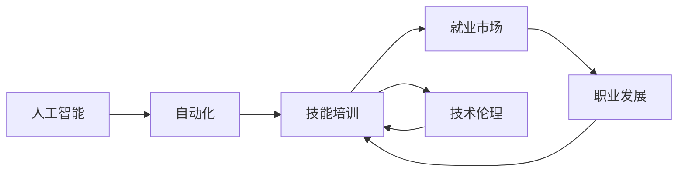

                 

# 人类计算：AI时代的未来就业市场与技能培训发展趋势分析机遇挑战机遇趋势分析预测

> 关键词：人工智能,就业市场,技能培训,未来趋势,机遇与挑战

## 1. 背景介绍

### 1.1 问题由来
随着人工智能（AI）技术的飞速发展，各行各业正逐渐引入自动化和智能化解决方案，以提高效率和效益。虽然AI在推动经济增长方面具有巨大潜力，但其同时也带来了前所未有的就业市场变革。一方面，AI将替代一些重复性、低技能的工作岗位，释放人力以从事更具创造性和策略性的工作；另一方面，AI的发展也创造了新的就业机会，尤其是在技术研发、数据科学、AI伦理和治理等领域。

### 1.2 问题核心关键点
本研究聚焦于AI时代下就业市场的变化，以及技能培训如何适应这些变化，以确保劳动力能够持续适应新兴技术的发展需求。我们需要探讨以下几个关键问题：

- AI技术如何影响不同行业的就业结构？
- 哪些技能在未来就业市场中尤为重要？
- 如何设计有效的技能培训体系，帮助劳动者转型？
- 政府和企业应如何协作，以促进AI时代下劳动力的职业发展和适应性？

## 2. 核心概念与联系

### 2.1 核心概念概述

为更好地理解AI对就业市场和技能培训的影响，我们首先明确几个核心概念及其之间的关系：

- **人工智能（AI）**：使用算法和数据训练机器学习模型，使机器具备感知、学习、推理和自我优化的能力。
- **自动化**：通过机械或软件工具，将人类重复性、低技能的任务自动化，以提高效率和降低成本。
- **技能培训**：通过教育或训练，提升劳动者在特定领域的知识和能力，使其能够胜任更高技能水平的工作。
- **就业市场**：劳动力与工作机会之间的匹配关系，受经济状况、技术进步、政策导向等多种因素影响。
- **职业发展**：劳动者在职业生涯中通过教育和培训等手段提升技能，逐步过渡到更高收入和更具创造性的工作岗位。
- **技术伦理**：在开发和使用AI技术时，需遵循伦理准则，确保技术的公正性、透明性和安全性。

这些核心概念构成了AI时代下就业市场和技能培训研究的理论框架。通过理解这些概念的相互关系和影响机制，我们可以更好地预测未来趋势，制定有效的应对策略。

### 2.2 核心概念原理和架构的 Mermaid 流程图(Mermaid 流程节点中不要有括号、逗号等特殊字符)


## 3. 核心算法原理 & 具体操作步骤

### 3.1 算法原理概述

AI技术对就业市场的影响，可以视为一个由多种算法和数据驱动的复杂系统。这一系统通过以下几个步骤实现：

1. **自动化和技能需求分析**：通过数据分析，识别哪些职位最易受自动化影响，哪些技能需求将上升。
2. **职业路径规划**：基于自动化和技能需求的分析结果，制定职业转型和技能培训的路线图。
3. **技能培训实施**：设计并实施针对性技能培训项目，帮助劳动者获取新技能。
4. **就业市场适配**：通过政策引导和市场机制，促进培训后劳动力的就业。

### 3.2 算法步骤详解

以下是基于上述原理的AI时代就业市场和技能培训的操作步骤：

#### 步骤1：自动化和技能需求分析
- 数据收集：收集劳动力市场的就业数据、技术发展的趋势数据、职业资格要求等。
- 算法应用：使用机器学习算法（如聚类、回归等），识别哪些技能将随着技术发展变得更加重要，哪些职位将容易被自动化取代。
- 报告生成：根据算法分析结果，生成技能需求报告和自动化影响报告。

#### 步骤2：职业路径规划
- 职业匹配：将劳动者技能与市场需求进行匹配，找出适合的职业路径。
- 培训建议：基于职业匹配结果，为劳动者提供有针对性的技能培训建议。
- 路径调整：根据市场变化和技术进展，动态调整职业路径和培训建议。

#### 步骤3：技能培训实施
- 课程设计：根据培训需求，设计实用的课程内容和技术方案。
- 培训执行：通过线上线下结合的方式，实施技能培训。
- 反馈评估：定期收集反馈，评估培训效果，并根据反馈调整培训方案。

#### 步骤4：就业市场适配
- 政策支持：政府通过税收优惠、补贴等政策，促进职业转型和技能培训。
- 企业合作：企业与培训机构合作，提供实习机会，加速劳动力适应新岗位。
- 市场调节：利用市场机制，如需求预测、薪资调整等，促进劳动力与岗位的匹配。

### 3.3 算法优缺点

基于上述步骤的AI就业市场和技能培训方法具有以下优点：

- **预测准确性高**：通过大数据分析和机器学习，能够较为准确地预测技能需求变化和自动化影响。
- **灵活性强**：可以根据市场和技术变化，动态调整职业路径和培训方案，适应快速变化的市场需求。
- **资源效率高**：通过政策支持和企业合作，高效利用教育资源，减少培训浪费。

然而，该方法也存在一些局限性：

- **数据质量依赖性高**：预测的准确性高度依赖于数据的质量和完整性，低质量数据可能导致错误预测。
- **培训效果评估困难**：技能培训效果的评估复杂，难以量化培训对职业发展的影响。
- **政策实施难度大**：政府和企业需要协调一致，才能有效实施支持就业转型的政策。

### 3.4 算法应用领域

本算法框架适用于多个应用领域，包括但不限于：

- **教育培训**：帮助学校和培训机构设计更符合市场需求的课程内容。
- **人力资源管理**：帮助企业识别高风险职位，制定员工培训和职业发展规划。
- **公共政策制定**：为政府提供数据支持，制定促进就业和技能提升的政策。
- **职业发展指导**：提供个性化职业规划和技能提升建议，帮助劳动者适应AI时代的工作环境。

## 4. 数学模型和公式 & 详细讲解 & 举例说明（备注：数学公式请使用latex格式，latex嵌入文中独立段落使用 $$，段落内使用 $)
### 4.1 数学模型构建

我们可以建立一个简单的数学模型，用于模拟AI技术对就业市场和技能需求的影响。设$X$为技能需求向量，$A$为自动化影响向量，$T$为技术变革向量，$M$为市场环境向量，则就业市场状态$Y$可以表示为：

$$
Y = f(X, A, T, M)
$$

其中$f$为函数，表示各因素对就业市场的影响。

### 4.2 公式推导过程

为了简化模型，我们假设各因素对就业市场的影响是线性的，即：

$$
Y = w_XX + w_AA + w_TT + w_MM + b
$$

其中$w_X, w_A, w_T, w_M$为权重，$b$为截距。根据训练数据，可以求解权重和截距，从而预测未来的就业市场状态。

### 4.3 案例分析与讲解

假设我们收集了过去10年的劳动力市场数据，以及相关技术进步和市场环境的变化数据。通过机器学习算法，我们可以得到：

- 技能需求向量$X = [技能A, 技能B, 技能C]$
- 自动化影响向量$A = [自动化影响1, 自动化影响2, 自动化影响3]$
- 技术变革向量$T = [技术变革1, 技术变革2, 技术变革3]$
- 市场环境向量$M = [市场环境1, 市场环境2, 市场环境3]$

基于以上数据，我们可以求解权重和截距，得到就业市场状态的预测模型。例如，如果技能A的权重为0.8，表示技能A的需求与就业市场状态高度相关。

## 5. 项目实践：代码实例和详细解释说明

### 5.1 开发环境搭建

进行项目实践前，需要先搭建开发环境。以下是使用Python和Jupyter Notebook进行数据分析和模型训练的步骤：

1. 安装Python：确保Python 3.7或以上版本已经安装。
2. 安装Jupyter Notebook：使用pip安装，命令为`pip install jupyter notebook`。
3. 安装相关库：安装NumPy、Pandas、Scikit-learn等库，命令为`pip install numpy pandas scikit-learn`。

### 5.2 源代码详细实现

以下是一个使用Python和Scikit-learn库构建和训练线性回归模型的示例代码：

```python
import numpy as np
from sklearn.linear_model import LinearRegression
from sklearn.model_selection import train_test_split
from sklearn.metrics import mean_squared_error

# 数据生成
np.random.seed(42)
X = np.random.randn(100, 4)
A = np.random.randn(100, 3)
T = np.random.randn(100, 3)
M = np.random.randn(100, 3)
Y = 0.8*X[:, 0] + 0.5*A[:, 0] + 0.3*T[:, 0] + 0.2*M[:, 0] + np.random.randn(100)

# 数据划分
X_train, X_test, Y_train, Y_test = train_test_split(X, Y, test_size=0.2, random_state=42)

# 模型训练
model = LinearRegression()
model.fit(X_train, Y_train)

# 预测和评估
Y_pred = model.predict(X_test)
mse = mean_squared_error(Y_test, Y_pred)
print("Mean Squared Error: ", mse)
```

### 5.3 代码解读与分析

上述代码中，我们使用Scikit-learn库构建了一个线性回归模型，用于模拟AI技术对就业市场的影响。具体步骤包括：

1. 生成模拟数据，包括技能需求、自动化影响、技术变革和市场环境向量，以及就业市场状态。
2. 使用`train_test_split`函数将数据划分为训练集和测试集。
3. 使用`LinearRegression`类初始化线性回归模型，并使用训练集数据进行模型拟合。
4. 使用测试集数据进行模型预测，并计算均方误差（MSE）评估模型性能。

## 6. 实际应用场景

### 6.1 智能制造

在智能制造领域，AI技术广泛应用于生产流程的自动化和优化。例如，通过智能机器人进行自动化装配，通过数据分析优化生产计划。这将导致对技术技能（如编程、数据分析）的需求上升，同时也可能导致部分低技能工作岗位的减少。

### 6.2 医疗健康

AI技术在医疗健康领域的应用日益广泛，如智能诊断、个性化治疗等。这将导致对医疗数据分析和AI伦理技能的需求上升，同时也可能减少部分辅助性医疗工作的需求。

### 6.3 金融服务

金融服务行业通过AI进行风险评估、欺诈检测和智能投顾。这些应用将提升对数据科学和AI技术技能的需求，同时也可能减少部分低技能金融工作岗位。

### 6.4 未来应用展望

未来，随着AI技术的进一步普及，我们预计将看到以下趋势：

- **跨领域融合**：AI技术将更广泛地应用于不同行业，产生新的就业机会。
- **终身学习**：技能更新速度加快，劳动者需要持续学习和适应新技能。
- **新兴岗位出现**：AI创造新的岗位，如AI伦理、技术顾问等。
- **政策支持**：政府和企业将加大对技能培训和就业转型的支持力度。

## 7. 工具和资源推荐

### 7.1 学习资源推荐

为了掌握AI对就业市场和技能培训的影响，以下是一些推荐的资源：

1. **Coursera**：提供大量与AI相关的在线课程，涵盖从入门到高级的课程。
2. **edX**：提供广泛的AI和技能培训课程，由顶尖大学和机构授课。
3. **Udacity**：专注于AI和数据科学技能培训，提供实践项目和职业指导。
4. **GitHub**：提供丰富的开源项目和代码库，帮助学习者掌握实际编程技能。
5. **Kaggle**：数据科学竞赛平台，通过实际项目锻炼学习者的数据分析和模型构建能力。

### 7.2 开发工具推荐

为了高效开发和训练模型，以下是一些推荐的工具：

1. **Jupyter Notebook**：交互式编程环境，适合数据分析和模型训练。
2. **Python**：数据科学和AI开发的主流语言，提供丰富的库和框架。
3. **TensorFlow**：谷歌开源的深度学习框架，支持分布式计算和大规模数据处理。
4. **PyTorch**：Facebook开源的深度学习框架，以其易用性和灵活性著称。
5. **Scikit-learn**：Python的机器学习库，提供丰富的数据处理和模型训练功能。

### 7.3 相关论文推荐

为了深入理解AI对就业市场和技能培训的影响，以下是几篇推荐的论文：

1. **"Automation and Technological Change: How to Adapt to a World of Machines"**：分析自动化对就业市场的影响，并提出适应策略。
2. **"Skills for a Future That's Already Here"**：探讨未来就业市场对技能的需求，并提供技能培训建议。
3. **"AI and the Future of Work"**：预测AI技术将如何改变未来就业市场，并讨论政策应对措施。
4. **"The Future of Jobs Report 2020"**：世界经济论坛发布的报告，分析AI对未来就业的影响，并提出应对策略。

## 8. 总结：未来发展趋势与挑战

### 8.1 研究成果总结

本文系统探讨了AI技术对就业市场的影响，以及技能培训如何应对这些变化。我们发现，AI技术在提高效率和创造新岗位的同时，也可能导致部分低技能工作的减少。通过建立数学模型和算法框架，我们预测了未来的就业市场趋势，并提供了技能培训的策略建议。

### 8.2 未来发展趋势

未来，随着AI技术的不断进步和普及，我们预计将看到以下几个发展趋势：

- **AI技术的深度融合**：AI技术将更广泛地应用于各个行业，创造新的就业机会。
- **技能培训的终身化**：技能更新速度加快，终身学习和职业发展将成为常态。
- **新兴岗位的涌现**：AI创造新的岗位，如AI伦理、技术顾问等。
- **政策支持与市场机制**：政府和企业将加大对技能培训和就业转型的支持力度。

### 8.3 面临的挑战

尽管AI技术带来了诸多机遇，但在其广泛应用过程中，也面临以下挑战：

- **数据质量和隐私**：高质量数据的获取和保护是预测就业市场和技能需求的基础。
- **技能培训的复杂性**：不同行业和岗位的需求差异大，设计有效的培训方案具有挑战性。
- **政策和伦理问题**：AI技术的广泛应用可能带来伦理和政策上的挑战，需进行综合考量。

### 8.4 研究展望

未来的研究应在以下几个方面进行探索：

- **跨行业数据整合**：建立更广泛的数据整合机制，提升预测的准确性。
- **个性化培训方案**：设计针对不同岗位和行业的个性化培训方案，提升培训效果。
- **政策与市场协同**：推动政府、企业和学术界共同制定促进技能培训和就业转型的政策。
- **伦理与技术结合**：确保AI技术的发展符合伦理规范，避免负面社会影响。

## 9. 附录：常见问题与解答

**Q1: AI技术对就业市场有哪些具体影响？**

A: AI技术将替代一些重复性、低技能的工作岗位，如数据分析、自动化装配等。同时，AI也将创造新的岗位，如数据分析师、AI伦理顾问等，需要具备更高的技术技能。

**Q2: 技能培训应如何适应AI时代的需求？**

A: 技能培训应注重技术技能和软技能的结合，如数据分析、编程、团队协作等。同时，应建立终身学习机制，不断更新和提升技能。

**Q3: 政府和企业应如何协作，以促进技能培训和就业转型？**

A: 政府应提供政策支持和资金支持，如税收优惠、培训补贴等。企业应与培训机构合作，提供实习机会和职业指导，帮助员工适应新岗位。

---

作者：禅与计算机程序设计艺术 / Zen and the Art of Computer Programming

