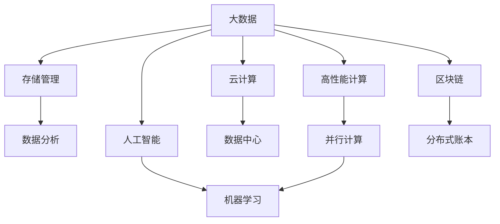

                 

## 1. 背景介绍

### 1.1 问题由来

随着全球人口的不断增长和科技进步，人类面临的挑战也日益复杂多样。气候变化、资源匮乏、人口老龄化、疾病流行等全球性问题亟待解决。而这些问题大多涉及多学科的交叉融合，单一学科难以应对。

计算机科学作为信息时代的核心驱动力，其技术和方法也正越来越多地被应用于解决这些重大挑战。从大数据分析到人工智能，从仿真模拟到区块链技术，计算机科学的发展为解决人类面临的问题提供了新的思路和工具。

### 1.2 问题核心关键点

为了更有效地利用计算机科学解决人类面临的重大挑战，本节将介绍几个关键问题：

- **数据挑战**：海量数据的采集、存储、处理和分析是大数据时代的核心问题。
- **计算资源**：如何高效利用计算资源进行复杂计算和仿真模拟，是高性能计算和云计算需要解决的关键难题。
- **智能推理**：基于人工智能和机器学习的智能推理算法，如何更好应用于现实世界的决策支持。
- **系统集成**：如何将分散的各类技术进行整合，形成一体化的解决方案。
- **伦理与安全**：技术应用过程中面临的伦理和安全问题，如隐私保护、数据泄露、算法偏见等。

这些问题均需要系统性的思考和解决方案，并融入到计算机科学研究的各个环节。

## 2. 核心概念与联系

### 2.1 核心概念概述

为更好地理解如何利用计算机科学解决人类面临的重大挑战，本节将介绍几个关键概念：

- **大数据(Big Data)**：指规模庞大、种类繁多、速度快、价值密度低的数据集合。其应用广泛，涉及金融、医疗、交通等多个领域。
- **高性能计算(High-Performance Computing, HPC)**：指使用高性能计算机系统，对大规模、复杂计算问题进行求解的计算方式。
- **人工智能(Artificial Intelligence, AI)**：指通过计算机模拟人脑处理信息的能力，实现智能化应用，如机器学习、自然语言处理等。
- **云计算(Cloud Computing)**：指通过互联网提供按需计算资源和软件服务的模式。云计算提供了强大的计算能力，支持各类应用。
- **区块链(Blockchain)**：指一种分布式账本技术，通过去中心化的方式实现数据记录和交易的安全可信。

这些概念之间的逻辑关系可以通过以下Mermaid流程图来展示：



这个流程图展示了大数据与云、高性能计算、人工智能、区块链等技术的关系：

1. 大数据存储和分析需要借助云和高性能计算技术。
2. 人工智能需要从大数据中提取知识，依赖高性能计算和大数据存储。
3. 区块链提供了一个安全可靠的数据交换和交易环境。
4. 并行计算和分布式计算支持人工智能、大数据、云计算的实际应用。

这些概念共同构成了人类计算的基础框架，助力我们在复杂多变的现实世界中进行有效的信息处理和决策。

## 3. 核心算法原理 & 具体操作步骤

### 3.1 算法原理概述

为了利用计算机科学解决人类面临的重大挑战，核心算法包括数据处理、计算优化、智能推理等。其关键思想是：

- 利用大数据技术，采集、存储和处理海量数据，提取出有价值的知识和信息。
- 使用高性能计算和云计算，对大规模、复杂的问题进行求解，加速计算进程。
- 应用人工智能和机器学习技术，从数据中提炼出智能推理能力，支持决策支持系统。
- 利用区块链技术，保证数据交换和交易的透明、安全和可信。

这些核心算法不仅涵盖了传统计算科学的内容，还涉及新兴的技术领域，共同支撑人类计算的实现。

### 3.2 算法步骤详解

人类计算的实现通常包括以下几个关键步骤：

**Step 1: 数据采集与处理**

- 收集多源异构数据，包括文本、图像、视频、语音等。
- 进行数据清洗、去重、标注，预处理为算法所需格式。
- 存储在云平台中，利用分布式文件系统、数据库系统进行管理和访问。

**Step 2: 计算资源配置与调度**

- 配置高性能计算机系统，包括多核CPU、GPU、TPU等。
- 通过云计算平台进行资源动态分配，满足计算需求。
- 使用任务调度框架（如Kubernetes、Mesos等）进行任务并行处理，优化资源利用率。

**Step 3: 模型训练与推理**

- 利用机器学习算法对数据进行模型训练，提取知识。
- 在高性能计算系统中进行模型推理，生成预测结果。
- 使用优化算法（如梯度下降、Adam等）调整模型参数，提升模型性能。

**Step 4: 系统集成与部署**

- 将不同系统和服务进行集成，形成一体化的解决方案。
- 在云平台或本地部署应用，进行实时计算和数据处理。
- 使用容器技术（如Docker、Kubernetes）确保系统稳定性和可扩展性。

**Step 5: 安全与隐私保护**

- 采用加密技术、访问控制技术保护数据隐私。
- 利用区块链技术实现数据交换和交易的可信记录。
- 对系统进行安全漏洞检测和风险评估，保障系统安全。

以上步骤展示了人类计算的一般流程，各环节需要根据具体应用场景进行调整和优化。

### 3.3 算法优缺点

人类计算的算法具有以下优点：

1. **高效性**：利用高性能计算和云计算，大幅提升计算效率。
2. **多样性**：涵盖数据处理、计算优化、智能推理等多领域技术，适应复杂问题需求。
3. **可扩展性**：基于云平台进行资源动态配置，支持大规模扩展。
4. **安全性**：区块链技术提供透明、可信的数据交换环境，保障数据安全。

同时，该方法也存在一定的局限性：

1. **计算成本高**：高性能计算和云计算资源昂贵，增加了项目成本。
2. **算法复杂**：涉及多个领域技术，需要跨学科知识。
3. **数据隐私问题**：海量数据的处理和存储涉及隐私保护问题，需要严格规范。
4. **实现难度大**：系统集成和部署复杂，需专业技能支持。
5. **结果解释性不足**：模型和算法往往缺乏可解释性，难以进行人工调试。

尽管存在这些局限性，但人类计算仍是解决重大问题的有效手段，尤其是在数据密集和计算复杂的应用场景中。未来需要进一步优化技术实现，降低成本，提高算法的可解释性和可操作性。

### 3.4 算法应用领域

人类计算的算法广泛应用于以下多个领域：

- **环境保护**：利用大数据和人工智能技术，进行气候变化分析、生物多样性保护等。
- **医疗健康**：应用人工智能和区块链技术，实现精准医疗、疾病预测和健康监测。
- **交通运输**：通过大数据和云计算，优化交通流量控制、智能交通系统等。
- **金融服务**：利用区块链和人工智能技术，进行风险评估、金融欺诈检测等。
- **社会治理**：使用大数据和云计算技术，进行城市管理、社会安全监控等。

这些领域的应用展示了人类计算的强大潜力，其核心在于多学科技术的整合和创新。

## 4. 数学模型和公式 & 详细讲解 & 举例说明

### 4.1 数学模型构建

为更好地解释人类计算的应用，本节将使用数学语言描述部分关键模型。

假设有一大规模数据分析问题，我们需要通过机器学习算法提取知识。记输入数据为 $x$，输出标签为 $y$，模型的损失函数为 $L(\theta; x, y)$，其中 $\theta$ 为模型参数。我们的目标是最小化损失函数：

$$
\theta^* = \arg\min_{\theta} L(\theta; x, y)
$$

在实践中，我们通常使用梯度下降算法对模型进行优化。设 $\eta$ 为学习率，则每次迭代更新参数 $\theta$ 的公式为：

$$
\theta \leftarrow \theta - \eta \nabla_{\theta}L(\theta; x, y)
$$

其中 $\nabla_{\theta}L(\theta; x, y)$ 为损失函数对参数 $\theta$ 的梯度，可以通过反向传播算法高效计算。

### 4.2 公式推导过程

以下我们以分类问题为例，推导梯度下降算法的具体实现过程。

假设模型 $M_{\theta}$ 在输入 $x$ 上的输出为 $\hat{y}=M_{\theta}(x) \in [0,1]$，表示样本属于正类的概率。真实标签 $y \in \{0,1\}$。则二分类交叉熵损失函数定义为：

$$
\ell(M_{\theta}(x),y) = -[y\log \hat{y} + (1-y)\log (1-\hat{y})]
$$

将其代入损失函数公式，得：

$$
L(\theta) = -\frac{1}{N}\sum_{i=1}^N [y_i\log M_{\theta}(x_i)+(1-y_i)\log(1-M_{\theta}(x_i))]
$$

根据链式法则，损失函数对参数 $\theta_k$ 的梯度为：

$$
\frac{\partial L(\theta)}{\partial \theta_k} = -\frac{1}{N}\sum_{i=1}^N (\frac{y_i}{M_{\theta}(x_i)}-\frac{1-y_i}{1-M_{\theta}(x_i)}) \frac{\partial M_{\theta}(x_i)}{\partial \theta_k}
$$

其中 $\frac{\partial M_{\theta}(x_i)}{\partial \theta_k}$ 可进一步递归展开，利用自动微分技术完成计算。

在得到损失函数的梯度后，即可带入参数更新公式，完成模型的迭代优化。重复上述过程直至收敛，最终得到适应下游任务的最优模型参数 $\theta^*$。

### 4.3 案例分析与讲解

以环境数据分析为例，展示如何利用人类计算技术提取知识：

假设有一数据集，记录了世界各地的温度变化情况，我们需要通过机器学习算法预测未来的温度趋势。

**Step 1: 数据采集与处理**

- 收集全球各地的温度数据，存储在云平台中。
- 进行数据清洗和去重，标记出异常数据点。
- 对数据进行标准化和归一化处理。

**Step 2: 计算资源配置与调度**

- 配置高性能计算机系统，包括多核CPU和GPU。
- 使用云计算平台进行资源动态分配，满足计算需求。
- 使用任务调度框架（如Kubernetes）进行任务并行处理，优化资源利用率。

**Step 3: 模型训练与推理**

- 利用回归模型（如线性回归、支持向量机等）对数据进行模型训练，提取温度变化趋势。
- 在高性能计算系统中进行模型推理，生成未来温度预测。
- 使用优化算法（如梯度下降、Adam等）调整模型参数，提升模型性能。

**Step 4: 系统集成与部署**

- 将不同系统和服务进行集成，形成一体化的解决方案。
- 在云平台或本地部署应用，进行实时温度预测和数据处理。
- 使用容器技术（如Docker、Kubernetes）确保系统稳定性和可扩展性。

**Step 5: 安全与隐私保护**

- 采用加密技术、访问控制技术保护数据隐私。
- 利用区块链技术实现数据交换和交易的可信记录。
- 对系统进行安全漏洞检测和风险评估，保障系统安全。

以上案例展示了如何利用人类计算技术解决环境数据分析问题。通过数据采集与处理、计算资源配置与调度、模型训练与推理、系统集成与部署、安全与隐私保护等环节，实现了对数据的高效处理和知识提取。

## 5. 项目实践：代码实例和详细解释说明

### 5.1 开发环境搭建

在进行人类计算项目开发前，我们需要准备好开发环境。以下是使用Python进行PyTorch开发的环境配置流程：

1. 安装Anaconda：从官网下载并安装Anaconda，用于创建独立的Python环境。

2. 创建并激活虚拟环境：
```bash
conda create -n pytorch-env python=3.8 
conda activate pytorch-env
```

3. 安装PyTorch：根据CUDA版本，从官网获取对应的安装命令。例如：
```bash
conda install pytorch torchvision torchaudio cudatoolkit=11.1 -c pytorch -c conda-forge
```

4. 安装TensorFlow：从官网下载并安装TensorFlow，用于进行分布式计算和模型推理。

5. 安装各类工具包：
```bash
pip install numpy pandas scikit-learn matplotlib tqdm jupyter notebook ipython
```

完成上述步骤后，即可在`pytorch-env`环境中开始项目开发。

### 5.2 源代码详细实现

下面以环境数据分析为例，给出使用PyTorch进行回归模型训练的代码实现。

```python
import torch
import torch.nn as nn
import torch.optim as optim
import pandas as pd
from sklearn.model_selection import train_test_split

# 加载数据
data = pd.read_csv('temperature.csv')

# 划分训练集和测试集
X_train, X_test, y_train, y_test = train_test_split(data[['temp']], data['label'], test_size=0.2, random_state=42)

# 定义模型
class Net(nn.Module):
    def __init__(self):
        super(Net, self).__init__()
        self.fc1 = nn.Linear(1, 64)
        self.fc2 = nn.Linear(64, 1)

    def forward(self, x):
        x = torch.relu(self.fc1(x))
        x = self.fc2(x)
        return x

# 初始化模型和优化器
model = Net()
optimizer = optim.Adam(model.parameters(), lr=0.001)
criterion = nn.MSELoss()

# 训练模型
for epoch in range(100):
    optimizer.zero_grad()
    y_pred = model(X_train.values.reshape(-1, 1))
    loss = criterion(y_pred, y_train.values.reshape(-1, 1))
    loss.backward()
    optimizer.step()
    
    if (epoch+1) % 10 == 0:
        print('Epoch: {}, Loss: {:.4f}'.format(epoch+1, loss.item()))

# 评估模型
with torch.no_grad():
    y_pred = model(X_test.values.reshape(-1, 1))
    loss = criterion(y_pred, y_test.values.reshape(-1, 1))
    print('Test Loss: {:.4f}'.format(loss.item()))
```

### 5.3 代码解读与分析

让我们再详细解读一下关键代码的实现细节：

- 使用Pandas库加载数据，并进行训练集和测试集的划分。
- 定义一个简单的线性回归模型，包含两个全连接层。
- 使用Adam优化器和MSELoss损失函数进行模型训练。
- 在训练过程中，每10个epoch打印一次损失函数值。
- 在测试集上评估模型性能，输出测试集损失值。

这个简单的代码示例展示了如何使用PyTorch进行回归模型的训练和评估。尽管模型结构简单，但通过人类计算技术，我们能够高效处理大规模数据，提取出有价值的知识。

## 6. 实际应用场景

### 6.1 环境保护

利用人类计算技术，环境保护领域的应用场景包括：

- **气候变化分析**：利用大数据和机器学习技术，对全球气候数据进行建模，预测未来的气候变化趋势。
- **生物多样性保护**：通过数据分析和仿真模拟，评估人类活动对生物多样性的影响，制定保护措施。
- **资源管理**：应用大数据和人工智能技术，优化自然资源的使用和配置，提高资源利用效率。

### 6.2 医疗健康

在医疗健康领域，人类计算技术的应用场景包括：

- **精准医疗**：利用大数据和机器学习技术，分析基因、蛋白、影像等数据，制定个性化治疗方案。
- **疾病预测**：通过大数据分析和机器学习，预测疾病的发生和传播趋势，制定预防策略。
- **健康监测**：应用可穿戴设备和传感器数据，实时监测用户健康状况，进行异常预警和干预。

### 6.3 交通运输

交通运输领域利用人类计算技术，可以实现：

- **智能交通管理**：通过大数据和机器学习技术，优化交通流量控制，减少交通拥堵。
- **自动驾驶**：利用高精度地图和传感器数据，进行智能决策和控制，实现自动驾驶。
- **物流优化**：应用大数据和机器学习，优化物流路径和运输资源配置，降低成本提高效率。

### 6.4 金融服务

金融服务领域，人类计算技术的应用包括：

- **风险评估**：利用大数据和机器学习技术，分析交易数据，评估金融风险。
- **欺诈检测**：通过大数据分析和机器学习，识别异常交易行为，进行欺诈预警。
- **算法交易**：利用大数据和机器学习，进行实时市场分析和交易策略优化，提高投资回报率。

### 6.5 社会治理

社会治理领域，人类计算技术的应用包括：

- **城市管理**：利用大数据和机器学习，进行城市交通、环境、公共安全等综合治理。
- **社会安全监控**：通过数据分析和机器学习，实时监控异常行为，进行安全预警。
- **公共政策制定**：应用大数据和机器学习，分析社会舆情和政策效果，制定科学决策。

## 7. 工具和资源推荐

### 7.1 学习资源推荐

为帮助开发者系统掌握人类计算的技术基础和应用实践，这里推荐一些优质的学习资源：

1. 《数据科学导论》（Introduction to Data Science）系列书籍：全面介绍数据科学的基本概念和核心技术，涵盖数据采集、处理、分析和可视化。
2. Coursera《数据科学专项课程》：由Johns Hopkins大学提供，覆盖数据科学的核心内容和实践技能，适合初学者学习。
3. Kaggle竞赛平台：参与各类数据分析和机器学习竞赛，实践数据处理和模型训练技能。
4. DeepLearning.AI《深度学习专项课程》：由Andrew Ng教授主讲，涵盖深度学习的基础和应用，适合有一定基础的开发者。
5. Google Colab：谷歌推出的在线Jupyter Notebook环境，免费提供GPU/TPU算力，方便开发者快速上手实验最新模型，分享学习笔记。

通过对这些资源的学习实践，相信你一定能够快速掌握人类计算的技术方法，并用于解决实际问题。

### 7.2 开发工具推荐

高效的开发离不开优秀的工具支持。以下是几款用于人类计算开发的常用工具：

1. PyTorch：基于Python的开源深度学习框架，灵活的动态计算图，适合快速迭代研究。
2. TensorFlow：由Google主导开发的开源深度学习框架，支持分布式计算和模型推理。
3. Scikit-learn：基于Python的机器学习库，提供多种经典机器学习算法，适合快速原型开发。
4. Apache Spark：用于大数据处理的分布式计算框架，支持各类数据处理和机器学习任务。
5. Jupyter Notebook：轻量级笔记本环境，支持代码编写、数据处理、模型训练等。
6. Google Cloud Platform：谷歌提供的云平台，支持大数据、高性能计算、云计算等多种服务。

合理利用这些工具，可以显著提升人类计算的开发效率，加快创新迭代的步伐。

### 7.3 相关论文推荐

人类计算技术的不断发展，得益于学界的持续研究。以下是几篇奠基性的相关论文，推荐阅读：

1. Deep Blue Book of Data Science（《数据科学蓝皮书》）：系统性介绍数据科学的基本概念、技术和应用，适合初学者入门。
2. Scaling Machine Learning with GPUs（《GPU加速机器学习》）：介绍GPU在机器学习中的应用，展示GPU带来的性能提升。
3. Big Data: Principles and Best Practices of Scalable Real-time Data Systems（《大数据：可扩展的实时数据系统原理与最佳实践》）：详细讲解大数据系统的设计原则和实现方法。
4. Neural Computation of Human Reasoning（《人类推理的神经计算》）：探讨神经网络在人类推理中的应用，展示其优越性。
5. Deep Learning Specialization（《深度学习专项课程》）：涵盖深度学习的基础和应用，适合有一定基础的开发者。

这些论文代表了大数据和机器学习技术的发展脉络。通过学习这些前沿成果，可以帮助研究者把握学科前进方向，激发更多的创新灵感。

## 8. 总结：未来发展趋势与挑战

### 8.1 研究成果总结

人类计算技术在解决人类面临的重大挑战方面已经取得了显著进展。目前，大模型的参数量和计算资源需求仍是一个重要的瓶颈，但得益于云计算和分布式计算技术的发展，高性能计算能力正在不断提升。同时，算法和模型不断优化，提高了数据处理和知识提取的效率。

### 8.2 未来发展趋势

展望未来，人类计算技术将呈现以下几个发展趋势：

1. **超级计算中心建设**：全球各国纷纷建设超级计算中心，提供强大的计算能力支持。
2. **量子计算突破**：量子计算技术逐渐成熟，有望在计算复杂性方面取得突破。
3. **跨学科融合**：计算机科学与多个学科的深度融合，如医学、环境、社会治理等，形成一体化的解决方案。
4. **可持续计算**：利用可再生能源进行计算，降低碳排放，实现可持续发展的目标。
5. **联邦学习**：在数据隐私保护的前提下，通过分布式计算提升模型性能。
6. **算法优化**：基于进化算法、优化算法等手段，提升算法的优化效率和效果。

这些趋势表明，人类计算技术将不断向更加高效、普适、可持续的方向发展，为解决人类面临的重大挑战提供更强大的技术支持。

### 8.3 面临的挑战

尽管人类计算技术在解决人类面临的重大挑战方面已经取得了显著进展，但在应用推广过程中，仍面临诸多挑战：

1. **数据获取难度大**：高质量数据的采集和存储仍然是一个难题，尤其是在数据分布不均的情况下。
2. **计算资源昂贵**：高性能计算和云计算资源昂贵，增加了项目成本。
3. **算法复杂度大**：涉及多学科技术，需要跨学科知识和技能。
4. **隐私保护问题**：海量数据的处理和存储涉及隐私保护问题，需要严格规范。
5. **模型可解释性不足**：模型的决策过程缺乏可解释性，难以进行人工调试。
6. **系统安全风险**：技术应用过程中面临的安全风险，如数据泄露、算法偏见等。

### 8.4 研究展望

面对人类计算技术所面临的挑战，未来的研究需要在以下几个方面寻求新的突破：

1. **数据获取技术**：发展数据采集和存储技术，降低数据获取难度。
2. **计算资源优化**：优化计算资源分配和利用，降低计算成本。
3. **跨学科融合技术**：推动计算机科学与多个学科的深度融合，形成一体化的解决方案。
4. **隐私保护技术**：采用加密技术、区块链技术保护数据隐私，保障数据安全。
5. **模型可解释性技术**：发展可解释性算法，提升模型的透明度和可操作性。
6. **系统安全性技术**：加强安全漏洞检测和风险评估，保障系统安全。

这些研究方向的探索，必将引领人类计算技术迈向更高的台阶，为构建安全、可靠、可解释、可控的智能系统铺平道路。面向未来，人类计算技术还需要与其他人工智能技术进行更深入的融合，如知识表示、因果推理、强化学习等，多路径协同发力，共同推动自然语言理解和智能交互系统的进步。只有勇于创新、敢于突破，才能不断拓展计算机科学的边界，让智能技术更好地造福人类社会。

## 9. 附录：常见问题与解答

**Q1：如何降低数据获取难度？**

A: 利用大数据技术，采集和存储海量数据，提取有价值的知识。通过爬虫、API接口等方式，自动化地采集数据。同时，可以开发数据标注工具，提升数据标注效率和质量。

**Q2：如何优化计算资源？**

A: 采用分布式计算和云计算技术，动态分配计算资源，提高资源利用率。优化计算图，减少计算时间和内存消耗。使用GPU、TPU等高性能计算资源，提升计算能力。

**Q3：如何提升算法复杂度？**

A: 结合跨学科知识，开发更具普适性和可解释性的算法。利用数学建模和统计分析方法，提升算法复杂度。通过自动化工具和开源平台，加速算法开发和优化。

**Q4：如何保障数据隐私？**

A: 采用加密技术、访问控制技术保护数据隐私。利用区块链技术实现数据交换和交易的可信记录。对系统进行安全漏洞检测和风险评估，保障系统安全。

**Q5：如何提升模型可解释性？**

A: 发展可解释性算法，提升模型的透明度和可操作性。利用符号化推理和因果分析方法，解释模型决策过程。通过可视化工具展示模型推理路径和特征重要性。

**Q6：如何应对系统安全风险？**

A: 加强安全漏洞检测和风险评估，保障系统安全。采用多层次安全措施，如防火墙、入侵检测等。对系统进行安全审计和漏洞修复，提升系统安全性。

通过回答这些问题，展示了如何利用人类计算技术解决实际问题，并提供了详细的技术建议。相信通过不断探索和实践，人类计算技术将为解决人类面临的重大挑战提供更加有效的解决方案。

---

作者：禅与计算机程序设计艺术 / Zen and the Art of Computer Programming

