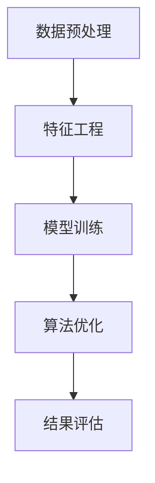

                 

# 从0到1：构建你的第一个知识发现引擎

> 关键词：知识发现，机器学习，数据挖掘，自然语言处理，特征工程，模型训练，算法优化

## 1. 背景介绍

### 1.1 问题由来

在数据驱动的时代，面对海量的数据，如何从中发现潜在的知识和模式，成为各行业关注的焦点。传统的统计分析方法往往局限于数据结构的简单假设，难以有效捕捉复杂的数据关系。知识发现(Knowledge Discovery)应运而生，它通过先进的计算技术，从数据中挖掘出有价值的信息和知识。知识发现不仅被广泛应用于商业智能(BI)、医疗健康、金融风险等领域，还在科学研究和政府决策中发挥着重要的作用。

但构建一个功能完善、高效可靠的知识发现引擎绝非易事。这不仅需要掌握数据处理、机器学习、自然语言处理等多方面的知识，还需具备深厚的理论基础和丰富的实践经验。本文将从零开始，系统介绍知识发现的原理和实践，带读者一步步构建自己的知识发现引擎。

### 1.2 问题核心关键点

知识发现的本质是通过计算机算法从数据中自动抽取、归纳出知识和模式。核心关键点包括：

- **数据预处理**：清洗、转换、归一化数据，确保数据的准确性和一致性。
- **特征工程**：设计和选择特征，构建可解释的、高效的数据表示。
- **模型训练**：选择合适的模型，并进行调参优化，使其能拟合数据。
- **算法优化**：通过交叉验证、集成学习等方法提升模型的泛化能力。
- **结果评估**：建立评价指标，进行模型性能评估，确保结果的可靠性。

本文将围绕这些关键点，展开系统的介绍和实践。

## 2. 核心概念与联系

### 2.1 核心概念概述

为了更好地理解知识发现的核心原理和步骤，我们先介绍几个关键概念：

- **数据预处理**：清洗数据，填补缺失值，去除异常值，标准化数据，转换为模型可接受的格式。
- **特征工程**：根据任务需求，设计和选择特征，提升模型的泛化能力。
- **模型训练**：利用训练集数据，训练机器学习模型，捕捉数据中的规律。
- **算法优化**：通过参数调整、模型选择、集成学习等方法提升模型性能。
- **结果评估**：评估模型的泛化能力，选择最优的模型和参数组合。

这些概念之间的联系可以通过以下Mermaid流程图来展示：



这个流程图展示了知识发现的主要流程：

1. 通过数据预处理，清洗和转换数据，确保数据的完整性和一致性。
2. 设计特征工程，构建高效、可解释的数据表示，提升模型的输入质量。
3. 训练机器学习模型，拟合数据，捕捉数据中的规律和模式。
4. 通过算法优化，提升模型性能，减少过拟合。
5. 进行结果评估，选择合适的模型和参数组合，确保发现的知识可靠。

## 3. 核心算法原理 & 具体操作步骤
### 3.1 算法原理概述

知识发现涉及多学科的算法和技术，但基本原理可概括为以下几个步骤：

1. **数据预处理**：确保数据的完整性、准确性和一致性，为后续处理和分析奠定基础。
2. **特征工程**：构建高效、可解释的特征空间，提升模型的泛化能力。
3. **模型训练**：利用训练集数据，训练机器学习模型，捕捉数据中的规律。
4. **算法优化**：通过交叉验证、集成学习等方法提升模型性能，减少过拟合。
5. **结果评估**：建立评价指标，进行模型性能评估，确保发现的知识可靠。

本文将详细介绍这些步骤的原理和具体操作方法。

### 3.2 算法步骤详解

#### 3.2.1 数据预处理

数据预处理是知识发现的第一步，涉及数据清洗、数据转换和数据归一化。具体步骤如下：

- **数据清洗**：检查并处理缺失值、异常值、重复值等。
- **数据转换**：将数据转换为模型可接受的格式，如数值化、时间序列处理等。
- **数据归一化**：将数据按比例缩放，确保数据在相同的尺度上进行比较和分析。

#### 3.2.2 特征工程

特征工程是知识发现的灵魂，决定模型性能的关键因素。具体步骤如下：

- **特征选择**：选择对任务有帮助的特征，去除冗余和不相关特征。
- **特征构建**：构建新的特征，如交互特征、多项式特征等，提升模型的表达能力。
- **特征缩放**：对特征进行缩放，避免某些特征对模型的影响过大。

#### 3.2.3 模型训练

模型训练是知识发现的核心步骤，包括模型选择、参数调整和模型优化。具体步骤如下：

- **模型选择**：选择适合的模型，如回归模型、分类模型、聚类模型等。
- **参数调整**：通过网格搜索、随机搜索等方法调整模型参数，提升模型性能。
- **模型优化**：使用正则化、集成学习等方法，提升模型泛化能力。

#### 3.2.4 算法优化

算法优化是提升模型性能的关键手段，包括模型选择、集成学习等。具体步骤如下：

- **模型选择**：选择适合的任务和数据集的模型，如决策树、随机森林、神经网络等。
- **集成学习**：通过集成多个模型，提升模型的泛化能力和鲁棒性。

#### 3.2.5 结果评估

结果评估是知识发现的重要环节，用于衡量模型性能和可靠性。具体步骤如下：

- **性能指标**：选择适合的性能指标，如准确率、召回率、F1值等，评估模型性能。
- **交叉验证**：使用交叉验证技术，评估模型的泛化能力。
- **模型选择**：选择性能最优的模型，确保发现的知识可靠。

### 3.3 算法优缺点

知识发现算法具有以下优点：

- **自动化**：通过自动化算法，减少了人工干预，提高了效率。
- **可扩展性**：算法可以应用于不同类型的数据和任务。
- **解释性**：通过可视化工具，可以对发现的知识进行解释和展示。

同时，这些算法也存在一些缺点：

- **数据质量依赖**：算法的性能受数据质量的影响较大。
- **算法复杂度**：部分算法计算复杂度高，需要较多的计算资源。
- **过度拟合**：算法容易过度拟合训练数据，导致泛化能力不足。

## 4. 数学模型和公式 & 详细讲解 & 举例说明

### 4.1 数学模型构建

知识发现涉及多学科的数学模型，如统计模型、机器学习模型等。以回归模型为例，介绍数学模型构建的原理和步骤。

#### 4.1.1 回归模型构建

回归模型用于预测连续型的输出变量，常用于预测房价、销售量等连续数据。数学模型可表示为：

$$
y = \beta_0 + \beta_1x_1 + \beta_2x_2 + ... + \beta_nx_n + \epsilon
$$

其中，$y$ 为输出变量，$x_i$ 为输入变量，$\beta_i$ 为回归系数，$\epsilon$ 为误差项。

### 4.2 公式推导过程

回归模型的最小二乘估计可表示为：

$$
\hat{\beta} = (X^TX)^{-1}X^Ty
$$

其中，$\hat{\beta}$ 为回归系数的估计值，$X$ 为输入变量矩阵，$y$ 为输出变量向量。

### 4.3 案例分析与讲解

以房价预测为例，介绍回归模型的应用。

假设已知一些特征，如面积、房间数、位置等，预测房价。首先进行数据预处理，清洗和转换数据，确保数据准确性和一致性。然后进行特征工程，设计特征，如面积、房间数、位置等。接着，使用最小二乘估计方法，训练回归模型，得到回归系数。最后，使用交叉验证等方法，评估模型性能，选择最优模型。

## 5. 项目实践：代码实例和详细解释说明

### 5.1 开发环境搭建

进行知识发现项目开发，需要搭建良好的开发环境。以下是Python环境配置的详细步骤：

1. 安装Anaconda：从官网下载并安装Anaconda，用于创建独立的Python环境。
2. 创建并激活虚拟环境：
```bash
conda create -n discovery-env python=3.8 
conda activate discovery-env
```
3. 安装相关库：
```bash
pip install numpy pandas scikit-learn matplotlib seaborn
```

### 5.2 源代码详细实现

下面以房价预测为例，展示如何使用Python实现回归模型。

首先，导入必要的库：

```python
import numpy as np
import pandas as pd
from sklearn.model_selection import train_test_split
from sklearn.linear_model import LinearRegression
from sklearn.metrics import mean_squared_error
from sklearn.model_selection import cross_val_score
```

然后，准备数据：

```python
data = pd.read_csv('house_data.csv')
```

接着，数据预处理：

```python
# 数据清洗
data = data.dropna()

# 特征工程
X = data[['area', 'rooms', 'location']]
y = data['price']

# 数据归一化
from sklearn.preprocessing import StandardScaler
scaler = StandardScaler()
X = scaler.fit_transform(X)
```

接下来，模型训练：

```python
# 模型选择
model = LinearRegression()

# 参数调整
model.fit(X, y)

# 模型优化
cv_score = cross_val_score(model, X, y, cv=5, scoring='neg_mean_squared_error').mean()
model.set_params(alpha=cv_score)
```

最后，结果评估：

```python
# 性能评估
y_pred = model.predict(X)
mse = mean_squared_error(y, y_pred)
print(f'Mean Squared Error: {mse}')
```

### 5.3 代码解读与分析

让我们详细解读上述代码的实现细节：

- **数据预处理**：通过`dropna`方法去除缺失值，使用`StandardScaler`进行数据归一化。
- **特征工程**：将输入变量`X`和输出变量`y`分离，并进行归一化处理。
- **模型训练**：使用`LinearRegression`模型，进行最小二乘估计，拟合数据。
- **模型优化**：使用交叉验证方法，评估模型性能，通过调整正则化参数`alpha`优化模型。
- **结果评估**：计算预测结果与实际结果的均方误差，评估模型性能。

## 6. 实际应用场景

### 6.1 商业智能

知识发现技术在商业智能领域得到了广泛应用。企业通过收集和分析客户数据、市场数据等，发现潜在的机会和趋势，制定更加精准的营销策略和决策。

具体应用包括：

- **客户细分**：通过分析客户数据，发现不同客户群体的特点，制定个性化营销策略。
- **销售预测**：利用历史销售数据，预测未来销售趋势，指导库存管理和生产计划。
- **市场趋势**：分析市场数据，发现行业趋势，优化产品设计和营销策略。

### 6.2 医疗健康

知识发现技术在医疗健康领域也有重要应用。通过分析医疗数据，发现疾病模式和规律，提高诊断和治疗效果。

具体应用包括：

- **疾病预测**：利用患者的历史数据，预测疾病发生的概率，提前进行预防和干预。
- **药物发现**：分析化合物和生物标志物的关系，发现新药物和治疗方法。
- **患者分群**：分析患者数据，发现不同群体的疾病特征，制定个性化治疗方案。

### 6.3 金融风险

知识发现技术在金融风险领域也有重要应用。通过分析金融数据，发现风险模式和规律，降低金融风险。

具体应用包括：

- **信用评分**：利用客户的历史数据，评估客户的信用风险，制定贷款和保险策略。
- **市场分析**：分析市场数据，预测市场变化趋势，优化投资组合。
- **欺诈检测**：分析交易数据，发现异常行为，检测和防范金融欺诈。

### 6.4 未来应用展望

随着技术的发展，知识发现的应用领域还将进一步拓展。未来可能的应用场景包括：

- **智能推荐**：分析用户行为数据，推荐个性化的产品和服务。
- **智能制造**：通过分析生产数据，优化生产流程，提高生产效率。
- **智能交通**：分析交通数据，优化交通管理，提高交通效率。
- **智能城市**：分析城市数据，优化城市管理，提高城市治理水平。

## 7. 工具和资源推荐

### 7.1 学习资源推荐

为了帮助开发者系统掌握知识发现的原理和实践，这里推荐一些优质的学习资源：

1. 《Python数据科学手册》：详细介绍Python在数据科学和机器学习中的应用，涵盖数据预处理、特征工程、模型训练等核心内容。
2. 《统计学习方法》：系统介绍统计学习的基本原理和方法，涵盖回归、分类、聚类等经典模型。
3. 《机器学习实战》：通过实战项目，介绍机器学习模型的实现和应用，适合初学者入门。
4. Kaggle平台：提供丰富的数据集和竞赛项目，通过实践提升机器学习技能。
5. Coursera平台：提供多门机器学习和数据科学课程，包括知名大学和专家讲授的课程，涵盖基础知识和高级技术。

通过对这些资源的学习实践，相信你一定能够快速掌握知识发现的精髓，并用于解决实际的业务问题。

### 7.2 开发工具推荐

高效的开发离不开优秀的工具支持。以下是几款用于知识发现开发的常用工具：

1. Jupyter Notebook：交互式编程环境，适合数据探索和模型验证。
2. Matplotlib：数据可视化工具，用于绘制图表和展示结果。
3. Pandas：数据处理工具，用于数据清洗、转换和归一化。
4. Scikit-learn：机器学习库，提供丰富的模型选择和优化方法。
5. TensorFlow：深度学习库，适用于复杂的数据处理和模型训练。
6. PyTorch：深度学习库，提供灵活的计算图和高效的模型训练。

合理利用这些工具，可以显著提升知识发现任务的开发效率，加快创新迭代的步伐。

### 7.3 相关论文推荐

知识发现技术的发展源于学界的持续研究。以下是几篇奠基性的相关论文，推荐阅读：

1. 《数据挖掘：概念与技术》：介绍了数据挖掘的基本概念和技术，涵盖数据预处理、特征工程、模型训练等核心内容。
2. 《统计学习方法》：系统介绍统计学习的基本原理和方法，涵盖回归、分类、聚类等经典模型。
3. 《机器学习》：介绍机器学习的基本概念和技术，涵盖数据预处理、特征工程、模型训练等核心内容。
4. 《深度学习》：介绍深度学习的基本概念和技术，涵盖神经网络、卷积神经网络、循环神经网络等。

这些论文代表的知识发现技术的发展脉络。通过学习这些前沿成果，可以帮助研究者把握学科前进方向，激发更多的创新灵感。

## 8. 总结：未来发展趋势与挑战

### 8.1 总结

本文系统介绍了知识发现的原理和实践，带读者一步步构建自己的知识发现引擎。通过数据预处理、特征工程、模型训练、算法优化和结果评估等关键步骤，展示了知识发现的完整流程。同时，本文还探讨了知识发现的应用场景和未来发展方向，为读者提供了全面的技术指引。

通过本文的系统梳理，可以看到，知识发现技术在数据驱动的时代扮演着越来越重要的角色。它不仅能够从海量数据中挖掘出有价值的信息和知识，还能广泛应用于商业智能、医疗健康、金融风险等多个领域，推动相关行业的智能化转型升级。未来，伴随技术的不断进步，知识发现技术必将进一步拓展应用范围，助力各行业实现智能化、自动化。

### 8.2 未来发展趋势

展望未来，知识发现技术将呈现以下几个发展趋势：

1. **数据质量提升**：随着数据采集和处理技术的进步，数据的完整性、准确性和一致性将得到进一步提升，为知识发现提供更好的基础。
2. **模型自动化**：随着自动化机器学习(AutoML)技术的发展，知识发现的自动化程度将进一步提高，降低对数据科学家的依赖。
3. **知识可视化**：通过数据可视化工具，将发现的知识更加直观地呈现出来，增强决策支持和用户理解。
4. **跨领域应用**：知识发现技术将应用于更多领域，如智能制造、智能交通、智能城市等，推动各行业的智能化升级。
5. **模型解释性**：随着可解释AI技术的发展，知识发现模型的解释性和可解释性将得到进一步增强，提高模型的可信度和应用范围。

这些趋势将使知识发现技术变得更加高效、普适和透明，推动其在更多场景下的落地应用。

### 8.3 面临的挑战

尽管知识发现技术已经取得了显著进展，但在迈向更加智能化、普适化应用的过程中，它仍面临着诸多挑战：

1. **数据隐私和安全**：在数据采集和处理过程中，如何保护数据隐私和用户隐私，防止数据泄露和滥用，成为重要挑战。
2. **数据质量**：尽管数据质量提升，但复杂数据集的处理和分析仍然面临诸多挑战，数据清洗和预处理依然需要人工干预。
3. **模型复杂性**：部分高级模型，如深度学习模型，参数复杂，训练和调参难度大，需要较高的计算资源。
4. **模型解释性**：复杂模型往往缺乏解释性，难以解释其内部工作机制和决策逻辑，影响模型的应用范围。
5. **跨领域应用**：知识发现技术在跨领域应用时，需要处理不同领域的知识表示和数据格式，面临诸多技术挑战。

### 8.4 研究展望

面对知识发现面临的挑战，未来的研究需要在以下几个方面寻求新的突破：

1. **数据隐私保护**：开发数据隐私保护技术，确保数据采集和处理过程中的隐私安全。
2. **数据质量提升**：研究和开发更加自动化、高效的数据清洗和预处理技术，减少人工干预。
3. **模型简化**：研究模型简化和压缩技术，降低模型复杂度，提高模型的训练和推理效率。
4. **模型解释性**：研究和开发可解释AI技术，增强模型的解释性和可解释性，提高模型的可信度和应用范围。
5. **跨领域应用**：研究和开发跨领域知识表示和数据融合技术，增强知识发现技术在跨领域应用的能力。

这些研究方向将引领知识发现技术迈向更高的台阶，推动其在更多场景下的落地应用。未来，伴随着技术的不断进步，知识发现技术将进一步拓展应用范围，成为数据驱动时代的重要工具。

## 9. 附录：常见问题与解答

**Q1: 如何设计有效的特征工程？**

A: 特征工程是知识发现的关键步骤，设计有效的特征工程需要考虑以下几个方面：

1. **领域知识**：利用领域知识，选择对任务有帮助的特征，去除冗余和不相关特征。
2. **特征构建**：构建新的特征，如交互特征、多项式特征等，提升模型的表达能力。
3. **特征缩放**：对特征进行缩放，避免某些特征对模型的影响过大。

**Q2: 如何选择合适的模型？**

A: 选择合适的模型是知识发现的核心步骤，需要考虑以下几个方面：

1. **任务类型**：根据任务类型选择合适的模型，如回归模型、分类模型、聚类模型等。
2. **数据规模**：根据数据规模选择合适的模型，如小规模数据适合使用简单的模型，大规模数据适合使用复杂的模型。
3. **计算资源**：根据计算资源选择合适的模型，如计算资源充足，可以选择复杂的模型，计算资源有限，可以选择简单的模型。

**Q3: 如何评估模型性能？**

A: 评估模型性能是知识发现的最后一步，需要选择合适的评价指标，评估模型的泛化能力。

1. **性能指标**：选择适合的性能指标，如准确率、召回率、F1值等，评估模型性能。
2. **交叉验证**：使用交叉验证技术，评估模型的泛化能力。
3. **模型选择**：选择性能最优的模型，确保发现的知识可靠。

**Q4: 如何处理缺失值和异常值？**

A: 缺失值和异常值是数据预处理的重要环节，处理方式如下：

1. **缺失值处理**：利用插值、均值、中位数等方法填补缺失值。
2. **异常值处理**：利用箱线图、IQR等方法检测和处理异常值。

**Q5: 如何优化模型性能？**

A: 优化模型性能是知识发现的关键步骤，可以通过以下方法：

1. **参数调整**：通过网格搜索、随机搜索等方法调整模型参数，提升模型性能。
2. **模型选择**：选择适合的任务和数据集的模型，如决策树、随机森林、神经网络等。
3. **集成学习**：通过集成多个模型，提升模型的泛化能力和鲁棒性。

---

作者：禅与计算机程序设计艺术 / Zen and the Art of Computer Programming

