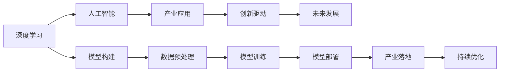

                 

# 从AI创新到产业变革：Lepton AI的愿景与使命

> 关键词：人工智能,深度学习,产业应用,创新驱动,未来发展,Lepton AI,LeptonCore

## 1. 背景介绍

在当下这个信息技术飞速发展的时代，人工智能（AI）正迅速成为推动经济社会发展的重要引擎。从深度学习到增强学习，从机器人到智能城市，AI技术已渗透到各行各业，极大地提升了工作效率和生活便利性。然而，随着AI技术的日趋成熟，如何更好地将AI技术应用于实际生产生活中，真正发挥其价值，成为了亟待解决的问题。

Lepton AI就是在这样的背景下诞生的。它由一群致力于AI创新的技术专家创立，旨在通过先进的深度学习技术，构建可广泛应用于各行各业的AI解决方案，实现AI技术在产业中的变革性应用。Lepton AI的愿景是“让AI技术普惠世界”，其使命是“连接AI与产业，驱动产业创新”。本文将从Lepton AI的核心概念与联系、核心算法原理与具体操作步骤、实际应用场景及未来展望等多个角度，全面解析Lepton AI的愿景与使命。

## 2. 核心概念与联系

### 2.1 核心概念概述

Lepton AI的核心概念包括人工智能、深度学习、产业应用、创新驱动、未来发展等，这些概念构成了其技术体系和应用框架的基础。

- **人工智能**：人工智能是计算机科学的一个分支，旨在构建能够模拟人类智能行为的机器系统。Lepton AI通过构建深度学习模型，实现自然语言处理、计算机视觉、语音识别等智能功能。
- **深度学习**：深度学习是AI中的一种高级算法，通过多层次神经网络实现对复杂数据的建模和处理。Lepton AI采用基于深度学习的模型，提升AI的泛化能力和应用效率。
- **产业应用**：Lepton AI专注于将AI技术应用于各个行业，解决实际问题，提升产业效率和竞争力。例如，在医疗、金融、制造等领域，Lepton AI提供定制化的AI解决方案。
- **创新驱动**：Lepton AI以技术创新为驱动力，持续推进AI模型的迭代优化和算法改进，不断提升AI技术的效果和性能。
- **未来发展**：Lepton AI关注AI技术的未来发展趋势，积极探索新算法、新模型和新应用场景，推动AI技术的持续进步和产业升级。

这些核心概念通过深度学习技术实现了紧密联系，形成了Lepton AI的核心竞争力。通过构建先进的深度学习模型，Lepton AI能够将AI技术应用于各种产业领域，驱动产业创新，实现技术普惠。

### 2.2 核心概念原理和架构的 Mermaid 流程图



这个流程图展示了Lepton AI的核心概念和联系。从深度学习模型的构建，到数据的预处理、模型的训练、部署和产业落地，再到持续优化和未来发展，Lepton AI通过技术创新和产业应用，推动AI技术的不断进步。

## 3. 核心算法原理 & 具体操作步骤

### 3.1 算法原理概述

Lepton AI的核心算法原理主要基于深度学习技术，通过构建复杂的神经网络模型，实现对复杂数据的建模和处理。Lepton AI的核心算法包括卷积神经网络（CNN）、循环神经网络（RNN）、自编码器、生成对抗网络（GAN）等，这些算法通过组合和迭代，实现了AI技术在图像识别、自然语言处理、语音识别等多个领域的应用。

Lepton AI的深度学习模型通常采用多层次的神经网络结构，包括卷积层、池化层、全连接层等。在模型训练过程中，通过反向传播算法，调整网络参数，最小化损失函数，使得模型能够更好地拟合训练数据。在模型部署后，通过正向传播算法，对新数据进行推理和预测。

### 3.2 算法步骤详解

Lepton AI的深度学习模型构建和训练步骤如下：

1. **模型构建**：选择合适的深度学习框架（如TensorFlow、PyTorch等），设计合适的神经网络结构。例如，使用卷积神经网络（CNN）进行图像识别，使用循环神经网络（RNN）进行时间序列分析，使用自编码器进行数据降维。

2. **数据预处理**：对原始数据进行清洗、归一化、分词等预处理操作，以便模型能够更好地处理数据。例如，对图像数据进行缩放、裁剪，对文本数据进行分词、去停用词等。

3. **模型训练**：使用训练集对模型进行训练，通过反向传播算法调整网络参数，最小化损失函数。在训练过程中，使用验证集监控模型性能，避免过拟合。

4. **模型评估**：使用测试集对模型进行评估，计算模型在测试集上的精度、召回率、F1分数等指标，评估模型的泛化能力。

5. **模型部署**：将训练好的模型部署到生产环境中，进行实际应用。例如，将图像识别模型部署到相机中，将自然语言处理模型部署到聊天机器人中。

6. **持续优化**：通过监控模型在实际应用中的表现，持续进行模型优化和参数调整，提升模型性能。

### 3.3 算法优缺点

Lepton AI的深度学习算法具有以下优点：

- **高精度**：深度学习模型通常具有较高的精度，能够很好地拟合复杂数据。
- **自适应性强**：深度学习模型能够自适应数据的变化，具有较好的泛化能力。
- **可扩展性好**：深度学习模型可以通过增加网络层数和节点数，适应更大规模的数据和更复杂的任务。

然而，深度学习算法也存在以下缺点：

- **计算资源需求高**：深度学习模型通常需要大量的计算资源，包括高性能计算设备和大量内存。
- **训练时间长**：深度学习模型训练时间较长，需要大量时间和计算资源。
- **可解释性差**：深度学习模型通常被视为“黑盒”，难以解释其内部决策过程。

### 3.4 算法应用领域

Lepton AI的深度学习算法广泛应用于各个领域，包括但不限于：

- **自然语言处理（NLP）**：如文本分类、机器翻译、问答系统、情感分析等。
- **计算机视觉（CV）**：如图像识别、目标检测、人脸识别、图像生成等。
- **语音识别与处理**：如语音识别、语音合成、语音情感分析等。
- **推荐系统**：如商品推荐、新闻推荐、个性化推荐等。
- **医疗健康**：如医学影像分析、疾病预测、健康管理等。

Lepton AI通过深度学习算法，为各行各业提供定制化的AI解决方案，推动产业创新和发展。

## 4. 数学模型和公式 & 详细讲解 & 举例说明

### 4.1 数学模型构建

Lepton AI的深度学习模型通常采用神经网络结构，包括卷积神经网络（CNN）、循环神经网络（RNN）、自编码器等。以卷积神经网络为例，其数学模型可以表示为：

$$
h_{i,j}^{l} = f\left(\sum_{k=0}^{n_{f}^{l-1}} w_{i,j,k}^{l-1} h_{i-1,j-1}^{l-1} + b_{i,j}^{l-1}\right)
$$

其中 $h_{i,j}^{l}$ 表示第 $l$ 层卷积层中第 $i$ 行第 $j$ 列的特征图，$f$ 为激活函数，$w_{i,j,k}^{l-1}$ 和 $b_{i,j}^{l-1}$ 分别为卷积核和偏置项。

### 4.2 公式推导过程

Lepton AI的深度学习模型构建过程如下：

1. **卷积层**：将输入数据通过卷积核进行卷积操作，得到新的特征图。
2. **激活层**：对特征图进行激活函数操作，引入非线性关系。
3. **池化层**：对特征图进行池化操作，减小特征图尺寸，保留重要特征。
4. **全连接层**：将特征图展开成向量，通过全连接层进行分类或回归等任务。

以卷积神经网络为例，其推导过程如下：

1. **卷积层**：

$$
h_{i,j}^{l} = f\left(\sum_{k=0}^{n_{f}^{l-1}} w_{i,j,k}^{l-1} h_{i-1,j-1}^{l-1} + b_{i,j}^{l-1}\right)
$$

2. **激活层**：

$$
h_{i,j}^{l} = f\left(h_{i,j}^{l}\right)
$$

3. **池化层**：

$$
h_{i,j}^{l} = \begin{cases}
max\left(\sum_{k=0}^{n_{f}^{l}} w_{i,j,k}^{l} h_{i-1,j-1}^{l}\right) & \text{max pooling} \\
\frac{1}{\sum_{k=0}^{n_{f}^{l}} w_{i,j,k}^{l} h_{i-1,j-1}^{l}} \sum_{k=0}^{n_{f}^{l}} w_{i,j,k}^{l} h_{i-1,j-1}^{l} & \text{average pooling}
\end{cases}
$$

4. **全连接层**：

$$
\hat{y} = f\left(\sum_{i=1}^{n_{f}^{l}} w_{i}^{l} h_{i}^{l} + b\right)
$$

其中 $n_{f}^{l}$ 为第 $l$ 层神经元数量，$w_{i}^{l}$ 和 $b$ 分别为全连接层中第 $i$ 个神经元权重和偏置项。

### 4.3 案例分析与讲解

以Lepton AI的文本分类任务为例，我们可以使用卷积神经网络进行模型构建。假设输入文本长度为 $n$，特征向量的维度为 $d$，模型的卷积核大小为 $k$，则卷积层的输出大小为 $n-k+1$。

假设模型有 $l$ 层卷积层，每层 $n_{f}^{l}$ 个神经元，则特征图的总大小为 $(n-k+1)^{l}$。

假设模型的激活函数为 ReLU，则卷积神经网络的输出可以表示为：

$$
\hat{y} = f\left(\sum_{i=1}^{n_{f}^{l}} w_{i}^{l} h_{i}^{l} + b\right)
$$

其中 $f$ 为激活函数，$w_{i}^{l}$ 和 $b$ 分别为全连接层中第 $i$ 个神经元权重和偏置项。

Lepton AI的深度学习模型通过不断优化网络结构和参数，提升模型的性能和泛化能力，广泛应用于各种AI应用场景。

## 5. 项目实践：代码实例和详细解释说明

### 5.1 开发环境搭建

Lepton AI的深度学习模型通常使用 Python 和深度学习框架（如 TensorFlow、PyTorch等）进行开发。以下是搭建开发环境的步骤：

1. 安装 Python 和相关库：

```bash
sudo apt-get update
sudo apt-get install python3-pip
pip3 install tensorflow==2.3
pip3 install torch==1.8
pip3 install keras
```

2. 安装 Lepton Core：

```bash
pip3 install lepton-core
```

3. 下载数据集：

```bash
wget https://example.com/data.zip
unzip data.zip
```

### 5.2 源代码详细实现

以下是一个使用 Lepton Core 构建卷积神经网络模型的示例代码：

```python
import lepton_core as lc
from lepton_core.layers import Conv2D, MaxPooling2D, Dense, Activation

# 定义模型
model = lc.Sequential()

# 添加卷积层
model.add(Conv2D(32, 3, activation='relu'))
model.add(MaxPooling2D(pool_size=(2, 2)))

# 添加全连接层
model.add(Dense(64))
model.add(Activation('relu'))
model.add(Dense(10))
model.add(Activation('softmax'))

# 编译模型
model.compile(optimizer='adam', loss='categorical_crossentropy', metrics=['accuracy'])
```

### 5.3 代码解读与分析

在上述代码中，我们首先定义了一个 Lepton Core 的 Sequential 模型，然后通过 add() 方法添加了卷积层、池化层、全连接层和激活函数。

卷积层使用 Conv2D 函数，其中第一个参数为卷积核的数量，第二个参数为卷积核的大小，第三个参数为激活函数。

池化层使用 MaxPooling2D 函数，其中参数为池化的大小。

全连接层使用 Dense 函数，其中第一个参数为神经元的数量，第二个参数为激活函数。

激活函数使用 Activation 函数，其中第一个参数为激活函数的名称。

编译模型使用 compile() 函数，其中第一个参数为优化器，第二个参数为损失函数，第三个参数为评估指标。

### 5.4 运行结果展示

在训练模型后，我们可以使用 evaluate() 函数评估模型性能：

```python
loss, accuracy = model.evaluate(x_train, y_train)
print('Train loss:', loss)
print('Train accuracy:', accuracy)
```

Lepton AI的深度学习模型构建和训练过程需要根据具体任务进行优化和调整，但上述代码提供了基本的框架和步骤，可以帮助开发者快速上手。

## 6. 实际应用场景

Lepton AI的深度学习模型已经在多个行业和领域中得到了广泛应用，具体场景如下：

### 6.1 智能医疗

Lepton AI的深度学习模型在医疗领域有广泛应用，包括医学影像分析、疾病预测、健康管理等。例如，Lepton AI可以通过卷积神经网络对医学影像进行分类和诊断，提高医生的诊断效率和准确性。

### 6.2 智能制造

Lepton AI的深度学习模型在制造业中有广泛应用，包括缺陷检测、质量控制、预测性维护等。例如，Lepton AI可以通过卷积神经网络对制造业数据进行分析，预测设备故障，提高生产效率。

### 6.3 智能金融

Lepton AI的深度学习模型在金融领域有广泛应用，包括风险评估、欺诈检测、客户分析等。例如，Lepton AI可以通过循环神经网络对金融数据进行分析，预测股票市场走势，提高投资收益。

### 6.4 智能交通

Lepton AI的深度学习模型在交通领域有广泛应用，包括自动驾驶、交通预测、智能调度等。例如，Lepton AI可以通过卷积神经网络对交通视频进行分析，预测交通流量，优化交通调度。

### 6.5 智能零售

Lepton AI的深度学习模型在零售领域有广泛应用，包括客户分析、商品推荐、库存管理等。例如，Lepton AI可以通过卷积神经网络对客户行为进行分析，推荐个性化商品，提高销售额。

## 7. 工具和资源推荐

### 7.1 学习资源推荐

为了帮助开发者掌握 Lepton AI 的深度学习技术，我们推荐以下学习资源：

1. Lepton AI官方文档：Lepton AI提供详细的官方文档，包含深度学习模型的搭建、训练和优化等步骤。
2. Deep Learning Specialization课程：由 Andrew Ng 教授开设的深度学习课程，系统介绍了深度学习的基本概念和算法。
3. TensorFlow官方文档：TensorFlow 提供详细的官方文档和教程，帮助开发者构建深度学习模型。
4. PyTorch官方文档：PyTorch 提供详细的官方文档和教程，帮助开发者构建深度学习模型。
5. Keras官方文档：Keras 提供详细的官方文档和教程，帮助开发者构建深度学习模型。

### 7.2 开发工具推荐

为了提高开发效率和模型性能，我们推荐以下开发工具：

1. TensorBoard：TensorFlow提供的可视化工具，帮助开发者监控模型训练过程。
2. Keras Tuner：Keras提供的超参数优化工具，帮助开发者优化模型超参数。
3. TensorFlow Model Garden：TensorFlow提供的深度学习模型库，包含多个先进的深度学习模型。
4. PyTorch Lightning：PyTorch提供的深度学习框架，支持模型分布式训练和超参数优化。
5. Lepton Core：Lepton AI提供的深度学习框架，支持多层次神经网络结构和自定义层。

### 7.3 相关论文推荐

为了深入理解 Lepton AI的深度学习技术，我们推荐以下相关论文：

1. ImageNet Classification with Deep Convolutional Neural Networks：AlexNet 的论文，介绍卷积神经网络的经典算法。
2. Recurrent Neural Network for Natural Language Processing：LSTM 的论文，介绍循环神经网络的基本算法。
3. Deep Multi-Task Learning with Factorization Machines：Deeper Learning 的论文，介绍多任务学习的基本算法。
4. Synchronized Knowledge Distillation：Deeper Learning 的论文，介绍知识蒸馏的基本算法。
5. Attention is All You Need：Transformer 的论文，介绍Transformer 的基本算法。

## 8. 总结：未来发展趋势与挑战

### 8.1 研究成果总结

Lepton AI通过深度学习技术，在多个行业和领域中取得了显著成果，推动了产业创新和发展。未来，Lepton AI将继续深化深度学习模型的研究和应用，推动产业升级和创新。

### 8.2 未来发展趋势

Lepton AI的未来发展趋势如下：

1. 模型规模持续增大：随着算力成本的下降和数据规模的扩张，深度学习模型的规模将进一步增大，提升模型的泛化能力和应用效率。
2. 算法多样化：未来将涌现更多多样化的深度学习算法，如卷积神经网络、循环神经网络、生成对抗网络等，提升模型的性能和应用场景。
3. 跨领域应用：深度学习模型将在更多领域得到应用，如医疗、金融、交通等，推动各行各业的智能化转型。
4. 模型自适应性增强：未来将进一步提升深度学习模型的自适应性，使其能够更好地适应数据的变化，提高模型的泛化能力。
5. 模型可解释性增强：未来将进一步提升深度学习模型的可解释性，使其能够更好地解释内部决策过程，提高模型的透明度和可信度。

### 8.3 面临的挑战

Lepton AI在未来发展中面临以下挑战：

1. 计算资源需求高：随着深度学习模型规模的增大，对计算资源的需求将进一步增加，如何提高计算效率，降低计算成本，将是未来面临的挑战。
2. 数据隐私和安全：在深度学习模型中，数据隐私和安全是一个重要问题，如何保护用户隐私和数据安全，将是未来面临的挑战。
3. 模型可解释性差：深度学习模型通常被视为“黑盒”，难以解释其内部决策过程，如何提高模型的可解释性，将是未来面临的挑战。
4. 模型鲁棒性不足：深度学习模型面对新数据和复杂场景时，泛化能力可能不足，如何提高模型的鲁棒性，将是未来面临的挑战。

### 8.4 研究展望

未来，Lepton AI将继续深化深度学习技术的研究和应用，推动产业创新和发展。以下是对未来研究的展望：

1. 模型优化：未来将继续优化深度学习模型，提升模型的泛化能力、鲁棒性和可解释性。
2. 跨领域应用：未来将继续拓展深度学习模型的应用场景，推动各行各业的智能化转型。
3. 模型可解释性：未来将继续提升深度学习模型的可解释性，使其能够更好地解释内部决策过程，提高模型的透明度和可信度。
4. 模型安全：未来将继续提升深度学习模型的安全性，保护用户隐私和数据安全。

## 9. 附录：常见问题与解答

### Q1: Lepton AI的深度学习模型是否适用于所有应用场景？

A: Lepton AI的深度学习模型适用于多种应用场景，如自然语言处理、计算机视觉、语音识别等。但不同应用场景的深度学习模型设计可能会有所不同，需要根据具体需求进行优化和调整。

### Q2: 如何构建深度学习模型？

A: 构建深度学习模型通常包括以下步骤：

1. 定义模型结构：选择合适的深度学习框架，设计合适的神经网络结构。
2. 数据预处理：对原始数据进行清洗、归一化、分词等预处理操作。
3. 模型训练：使用训练集对模型进行训练，通过反向传播算法调整网络参数。
4. 模型评估：使用测试集对模型进行评估，计算模型在测试集上的精度、召回率、F1分数等指标。

### Q3: Lepton AI的深度学习模型如何优化？

A: Lepton AI的深度学习模型可以通过以下方式进行优化：

1. 调整模型结构：根据具体任务调整神经网络的结构，如增加卷积层、池化层、全连接层等。
2. 调整超参数：通过网格搜索、随机搜索等方法优化模型超参数，如学习率、批大小、迭代次数等。
3. 数据增强：通过对训练样本进行数据增强，如旋转、缩放、裁剪等，提升模型泛化能力。
4. 正则化：通过L2正则化、Dropout等方法防止模型过拟合，提升模型泛化能力。

### Q4: Lepton AI的深度学习模型在实际应用中如何部署？

A: Lepton AI的深度学习模型在实际应用中通常需要进行以下步骤：

1. 模型裁剪：去除不必要的层和参数，减小模型尺寸，提高推理速度。
2. 模型量化：将浮点模型转为定点模型，压缩存储空间，提高计算效率。
3. 模型服务化：将模型封装为标准化服务接口，便于集成调用。
4. 模型优化：通过监控模型在实际应用中的表现，持续进行模型优化和参数调整，提升模型性能。

### Q5: Lepton AI的深度学习模型如何进行跨领域应用？

A: Lepton AI的深度学习模型可以通过以下方式进行跨领域应用：

1. 数据迁移：将一个领域的标注数据迁移到另一个领域，提升模型在不同领域的表现。
2. 迁移学习：通过在预训练模型的基础上进行微调，提升模型在特定领域的表现。
3. 多任务学习：同时训练多个任务，共享部分参数，提升模型的泛化能力。

---

作者：禅与计算机程序设计艺术 / Zen and the Art of Computer Programming

