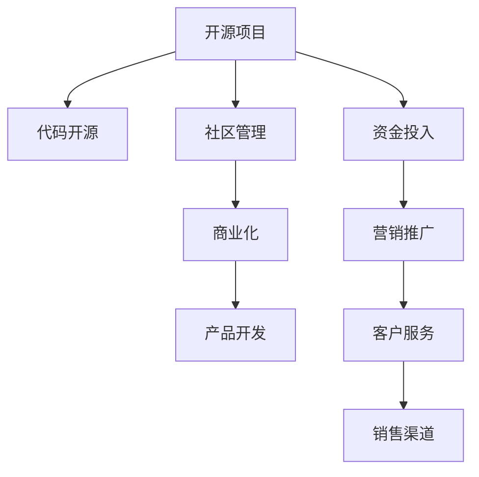

                 

# 从代码到现金：开源项目商业化策略

在当今快速变化的科技行业，开源项目已经成为推动创新和协作的关键力量。然而，如何将这些项目转化为可行的商业产品，并从代码到现金，这是一个值得深入探讨的课题。本文将从商业化策略的角度出发，探讨如何利用开源项目的优势，实现从技术到市场、从概念到产品的转型。

## 1. 背景介绍

### 1.1 问题由来

开源项目因其开放性、协作性和创新性，受到广泛的关注和支持。从Linux操作系统到Apache Web服务器，开源软件在各行各业中发挥着重要作用。然而，这些项目的开发和维护需要大量的资源投入，单靠社区的力量，很难实现商业化。如何将开源项目的成果转化为商业产品，是开源社区和商业公司共同面临的挑战。

### 1.2 问题核心关键点

开源项目的商业化，核心在于将技术、资源和市场结合，形成可持续发展的商业模式。这涉及以下几个关键问题：

- 如何选择合适的开源项目进行商业化？
- 如何将开源代码转化为可售产品？
- 如何构建和运营商业化的开源社区？
- 如何平衡开源和商业利益？

本节将从这些核心点出发，梳理开源项目商业化的路径和方法。

## 2. 核心概念与联系

### 2.1 核心概念概述

- **开源项目(Open Source Project, OSP)**：指代码公开、社区参与开发的软件项目，旨在推动技术的共享和创新。

- **商业化(Commercialization)**：指将技术或产品从研发阶段转向市场化运营的过程，包括产品开发、市场推广、销售和服务等环节。

- **开源与商业的结合(Open Source and Commercial Combination)**：指在开源项目的核心技术基础上，构建商业化的产品和服务，实现技术、资源和市场的有机结合。

- **社区运营(Community Operation)**：指开源项目的社区管理和维护，包括代码审核、问题跟踪、社区活动等，确保社区的活跃和协作。

- **商业模式(Business Model)**：指企业盈利的方式，如订阅模式、按需付费模式、广告模式等，是开源项目商业化的重要手段。

这些概念通过以下Mermaid流程图进行联系展示：



这个流程图展示了开源项目的生命周期，从代码开源到社区管理，再到商业化和产品开发，最终形成商业销售和客户服务。

## 3. 核心算法原理 & 具体操作步骤

### 3.1 算法原理概述

开源项目商业化的核心算法原理是利用开源项目的技术基础，通过市场需求分析、产品设计和市场推广，构建可持续发展的商业模式。这一过程涉及以下几个关键步骤：

1. **需求分析**：评估市场需求，确定商业化的目标和方向。
2. **产品设计**：基于开源项目的技术基础，设计符合市场需求的商业产品。
3. **市场推广**：通过市场营销和渠道推广，提升产品的知名度和用户基础。
4. **客户服务**：提供优质的客户服务和支持，增强用户粘性和满意度。
5. **反馈迭代**：通过用户反馈，不断优化和迭代产品，满足市场需求。

### 3.2 算法步骤详解

以下是开源项目商业化的详细步骤：

**Step 1: 需求分析**
- 收集市场信息：调研目标市场的需求、竞争状况、用户痛点等。
- 确定商业目标：明确商业化的目标和方向，如提高市场占有率、增加收入等。
- 制定商业计划：根据市场需求和商业目标，制定详细的商业化计划。

**Step 2: 产品设计**
- 评估开源项目：选择适合商业化的开源项目，评估其技术成熟度和市场潜力。
- 设计商业产品：基于开源项目的技术基础，设计符合市场需求的产品功能和服务。
- 确定商业模式：选择适合的产品定价策略和盈利模式，如SaaS、PaaS、订阅模式等。

**Step 3: 市场推广**
- 制定推广计划：根据商业计划，制定详细的市场推广计划，包括渠道选择、推广策略等。
- 实施推广活动：通过线上和线下渠道进行推广活动，提高产品的知名度和用户基础。
- 监测推广效果：实时监测推广效果，评估市场反应，及时调整推广策略。

**Step 4: 客户服务**
- 提供技术支持：为商业客户提供技术支持和咨询服务，帮助其顺利使用产品。
- 收集用户反馈：通过反馈渠道，收集用户意见和建议，了解产品不足。
- 持续改进产品：根据用户反馈，不断优化和改进产品，提高用户满意度。

**Step 5: 反馈迭代**
- 评估商业效果：定期评估商业化效果，分析产品销售、用户增长等关键指标。
- 优化商业计划：根据评估结果，优化商业化策略和产品设计。
- 持续创新发展：保持技术创新和市场敏感性，不断推出新产品和服务。

### 3.3 算法优缺点

开源项目商业化的算法具有以下优点：

- **技术优势**：利用开源项目的成熟技术，降低了研发成本和风险。
- **社区支持**：开源社区提供了丰富的代码资源和人才支持，加快了产品开发速度。
- **市场灵活性**：开放的开源项目更容易适应市场变化，快速调整产品策略。

同时，该算法也存在一些缺点：

- **利益冲突**：开源项目强调共享和协作，商业化可能带来利益冲突。
- **资金投入**：商业化需要大量资金投入，资金不足可能影响项目进展。
- **产品差异化**：商业化过程中，可能忽视开源项目的特色和优势。

### 3.4 算法应用领域

开源项目商业化在多个领域得到广泛应用，例如：

- **企业级软件**：利用开源项目的技术基础，构建商业级软件产品，如企业ERP、CRM等。
- **开源硬件**：基于开源硬件项目，设计并制造商业化产品，如物联网设备、嵌入式系统等。
- **开源云计算**：将开源云计算技术商业化，提供云服务、云平台等解决方案。
- **开源数据平台**：将开源数据平台技术商业化，构建商业数据处理和分析系统。

此外，开源项目商业化还在金融、医疗、教育等多个行业领域得到应用，为传统行业带来了新的活力和机遇。

## 4. 数学模型和公式 & 详细讲解

### 4.1 数学模型构建

在开源项目商业化过程中，我们可以构建一个简单的数学模型，用以评估商业化的效果和成本。设：

- $C$ 为商业化总成本。
- $R$ 为商业化总收入。
- $P$ 为商业化利润。

商业化利润 $P$ 可以表示为：

$$ P = R - C $$

### 4.2 公式推导过程

根据上述公式，商业化利润 $P$ 的最大化目标可以表示为：

$$ \max_{R,C} P = R - C $$

约束条件为：

$$ R \geq 0, C \geq 0 $$

进一步简化为：

$$ \max_{R} R - C $$

这是一个典型的线性规划问题。通过优化 $R$ 和 $C$ 的值，可以实现商业化利润的最大化。

### 4.3 案例分析与讲解

假设某开源项目具有 $C=10000$ 的总成本，市场分析得出 $R=20000$ 的最高收入潜力。我们可以构建一个优化模型：

$$ \max_{R} R - 10000 $$

在满足 $R \geq 20000$ 的条件下，$P$ 的最大值为 $10000$。这意味着，如果能够实现 $R=20000$ 的收入，商业化利润为 $10000$。

然而，实际的商业化过程远比这个模型复杂。商业化需要考虑市场推广、客户服务、产品质量等多个因素。因此，我们需要采用更复杂的模型，如考虑市场需求变化、竞争状况、产品生命周期等因素。

## 5. 项目实践：代码实例和详细解释说明

### 5.1 开发环境搭建

开源项目商业化实践需要准备开发环境，以下是详细的搭建流程：

1. 安装Python和必要的依赖：
```bash
sudo apt-get update
sudo apt-get install python3 python3-pip
pip install flask
```

2. 创建虚拟环境：
```bash
python3 -m venv myenv
source myenv/bin/activate
```

3. 安装Flask框架和开源项目代码：
```bash
pip install flask
git clone https://github.com/your-open-source-project/open-source-project.git
cd open-source-project
```

### 5.2 源代码详细实现

以下是一个简单的开源项目商业化实现示例，使用Flask框架构建Web服务：

```python
from flask import Flask, request

app = Flask(__name__)

@app.route('/api/hello', methods=['GET'])
def hello():
    name = request.args.get('name')
    return f'Hello, {name}!'

if __name__ == '__main__':
    app.run(debug=True)
```

该代码片段实现了一个简单的HTTP接口，用于输出欢迎消息。

### 5.3 代码解读与分析

这段代码实现了一个基本的Flask Web服务，通过`@app.route`装饰器定义了一个路由，当访问`/api/hello`时，输出欢迎消息。

**Flask**：轻量级的Python Web框架，支持动态路由和HTTP请求处理。

**request.args.get('name')**：从HTTP请求中获取参数，用于个性化的欢迎消息。

**if __name__ == '__main__'**：判断当前文件是否为主程序，如果是，则启动Web服务。

### 5.4 运行结果展示

启动服务后，可以通过浏览器访问`http://localhost:5000/api/hello?name=John`，得到`Hello, John!`的输出。

## 6. 实际应用场景

### 6.1 开源云服务平台

某开源云服务平台基于Kubernetes技术，提供了丰富的容器编排和运维功能。通过商业化，该平台可以为企业提供稳定的云服务，降低运维成本。

**需求分析**：调研市场对稳定、易用云服务的需求，确定产品定位和功能。

**产品设计**：设计商业化平台，包括容器编排、负载均衡、安全管理等功能。

**市场推广**：通过技术博客、社交媒体、线上广告等渠道推广产品，吸引用户试用。

**客户服务**：提供用户支持和在线帮助文档，解决用户问题。

**反馈迭代**：根据用户反馈，不断优化平台功能和用户体验。

### 6.2 开源社交网络平台

某开源社交网络平台，利用分布式技术和社区协作，实现了高可扩展性和数据隐私保护。通过商业化，该平台可以为企业提供社交网络解决方案，提升用户粘性。

**需求分析**：调研市场对社交网络和数据隐私保护的需求，确定商业目标。

**产品设计**：设计商业化社交网络平台，包括用户管理、内容发布、社交网络分析等功能。

**市场推广**：通过社交媒体、行业会议、技术论坛等渠道推广产品，吸引企业客户。

**客户服务**：提供技术支持、定制化服务，帮助企业顺利部署和运营。

**反馈迭代**：根据企业反馈，不断优化平台功能和用户体验。

### 6.3 开源物联网平台

某开源物联网平台，利用分布式技术和实时数据处理能力，实现了设备管理、数据分析等功能。通过商业化，该平台可以为工业企业提供物联网解决方案，提升生产效率。

**需求分析**：调研市场对物联网和设备管理的需求，确定商业目标。

**产品设计**：设计商业化物联网平台，包括设备管理、数据分析、实时监控等功能。

**市场推广**：通过技术博客、行业展会、线上广告等渠道推广产品，吸引工业企业客户。

**客户服务**：提供技术支持、定制化服务，帮助企业顺利部署和运营。

**反馈迭代**：根据企业反馈，不断优化平台功能和用户体验。

## 7. 工具和资源推荐

### 7.1 学习资源推荐

为了帮助开发者系统掌握开源项目商业化的理论基础和实践技巧，这里推荐一些优质的学习资源：

1. **《开源项目商业化》系列文章**：深度剖析开源项目商业化的路径和方法，结合实际案例，提供详细的技术指导。

2. **Coursera《商业分析》课程**：提供商业化策略和市场分析的基本概念和方法，适合初学者入门。

3. **Udemy《开源项目管理》课程**：结合开源项目的管理和商业化，提供项目开发的实际案例和工具使用技巧。

4. **GitHub开源社区**：提供大量的开源项目商业化案例和经验分享，值得深入学习和借鉴。

5. **Slido《开源项目商业化》讲座**：邀请行业专家，分享开源项目商业化的成功经验和方法。

通过这些资源的学习实践，相信你一定能够快速掌握开源项目商业化的精髓，并用于解决实际的商业问题。

### 7.2 开发工具推荐

高效的开发离不开优秀的工具支持。以下是几款用于开源项目商业化开发的常用工具：

1. **JIRA**：项目管理工具，支持任务分配、进度跟踪、问题管理等功能，适用于开源项目的团队协作。

2. **GitLab**：开源协作平台，提供代码托管、持续集成、DevOps等功能，适用于开源项目的开发和部署。

3. **Docker**：容器化技术，提供轻量级应用部署和运行环境，适用于开源项目的云服务。

4. **Kubernetes**：容器编排技术，提供容器管理和调度功能，适用于开源云平台和微服务架构。

5. **Prometheus**：开源监控系统，提供实时数据采集和监控功能，适用于开源平台的运维管理。

合理利用这些工具，可以显著提升开源项目商业化的开发效率，加快创新迭代的步伐。

### 7.3 相关论文推荐

开源项目商业化涉及多种技术和方法，以下是几篇奠基性的相关论文，推荐阅读：

1. **《开源项目商业化策略》**：详细介绍了开源项目商业化的理论基础和实践方法，结合多个成功案例，提供全面的技术指引。

2. **《开源社区和商业利益的平衡》**：探讨开源社区和商业利益之间的冲突和协调，提出平衡二者的策略和方法。

3. **《开源项目商业化的经济效益分析》**：利用经济学原理，评估开源项目商业化的成本和收益，提供商业化决策的依据。

4. **《开源项目商业化的社会影响》**：讨论开源项目商业化对社会和技术的影响，提供负责任的商业化策略。

这些论文代表了大规模商业化研究的发展脉络，通过学习这些前沿成果，可以帮助研究者把握学科前进方向，激发更多的创新灵感。

## 8. 总结：未来发展趋势与挑战

### 8.1 总结

本文对开源项目商业化策略进行了全面系统的介绍。首先阐述了开源项目商业化的背景和意义，明确了商业化在开源项目中的应用价值。其次，从原理到实践，详细讲解了开源项目商业化的数学模型和操作步骤，给出了商业化项目开发的完整代码实例。同时，本文还广泛探讨了开源项目在云服务、社交网络、物联网等多个行业领域的应用前景，展示了开源项目的巨大潜力。此外，本文精选了开源项目商业化的各类学习资源，力求为读者提供全方位的技术指引。

通过本文的系统梳理，可以看到，开源项目商业化是推动开源技术市场化和产业化的重要途径。其成功实现依赖于开源社区的支持、商业团队的智慧和市场需求的力量，具有广阔的应用前景和深远的社会影响。未来，伴随开源技术的发展和市场环境的演变，开源项目商业化必将成为科技领域的重要趋势。

### 8.2 未来发展趋势

展望未来，开源项目商业化呈现以下几个发展趋势：

1. **开源社区的商业化**：更多开源项目将通过社区运营和商业合作，形成商业化的闭环生态。

2. **开源技术的标准化**：开源技术标准将成为商业化的重要推动力，提高技术的通用性和可互操作性。

3. **开源和商业的融合**：开源和商业技术将更加紧密融合，推动技术创新和市场扩展。

4. **多模态开源商业化**：开源项目将涵盖更多模态（如语音、图像、物联网），提升技术应用的广度和深度。

5. **开源商业化平台的崛起**：开源商业化平台将提供更多的服务支持和协作工具，简化商业化过程。

这些趋势展示了开源项目商业化发展的潜力和机遇，为开源社区和商业团队提供了新的方向。

### 8.3 面临的挑战

尽管开源项目商业化取得了一系列成果，但仍面临诸多挑战：

1. **社区和商业的利益冲突**：开源社区强调共享和协作，商业化可能带来利益冲突，需要平衡二者的关系。

2. **商业化成本高**：开源项目商业化需要大量的资金和技术投入，成本高昂，可能阻碍项目的持续发展。

3. **商业模式的单一**：现有商业化模式较为单一，难以满足不同类型和规模的企业需求。

4. **技术落地的挑战**：开源项目从实验室到市场的转化，面临技术成熟度、市场接受度等挑战。

5. **知识产权风险**：商业化过程中可能涉及知识产权问题，需要慎重处理。

6. **客户和市场的认知**：开源商业化需要建立客户和市场的认知，提升品牌和口碑。

这些挑战需要开源社区和商业团队共同应对，通过创新和合作，找到解决方案。

### 8.4 研究展望

面对开源项目商业化面临的挑战，未来的研究需要在以下几个方面寻求新的突破：

1. **社区和商业的协作机制**：建立开源社区和商业团队的协作机制，确保商业化过程顺利进行。

2. **商业化的成本控制**：通过开源项目的众筹、众包等方式，降低商业化成本，提高项目的可持续性。

3. **多样化的商业模式**：探索多样化的商业化模式，如订阅模式、按需付费模式、广告模式等，满足不同企业需求。

4. **技术成熟度的提升**：提高开源技术的成熟度，降低技术落地的难度和风险。

5. **知识产权的保障**：通过开源协议和商业合同，保障开源项目的知识产权。

6. **品牌和市场的推广**：加强开源项目的品牌建设和市场推广，提升客户和市场的认知。

这些研究方向的探索，必将引领开源项目商业化技术迈向更高的台阶，为开源社区和商业团队提供更多的支持。

## 9. 附录：常见问题与解答

**Q1：如何选择合适的开源项目进行商业化？**

A: 选择合适的开源项目进行商业化，需要考虑项目的成熟度、市场需求、社区活跃度等因素。可以通过市场调研、技术评估、社区参与等方式，选择适合商业化的开源项目。

**Q2：如何将开源代码转化为可售产品？**

A: 将开源代码转化为可售产品，需要进行产品设计和功能开发。可以参考开源项目的文档和社区讨论，了解用户需求和技术难点，设计符合市场需求的产品。

**Q3：如何构建和运营商业化的开源社区？**

A: 构建和运营商业化的开源社区，需要保持社区的活跃和协作。可以通过组织技术讨论、社区活动、贡献者激励等方式，吸引更多的社区成员参与。

**Q4：如何平衡开源和商业利益？**

A: 平衡开源和商业利益，需要明确社区和商业团队的合作机制，确保商业化过程顺利进行。可以通过设立明确的商业目标、社区参与机制、利益分享机制等方式，协调双方的利益。

**Q5：如何优化开源项目的商业化策略？**

A: 优化开源项目的商业化策略，需要持续关注市场需求、竞争状况、技术进展等因素。可以通过市场调研、用户反馈、技术评估等方式，不断优化商业化策略。

---

作者：禅与计算机程序设计艺术 / Zen and the Art of Computer Programming

