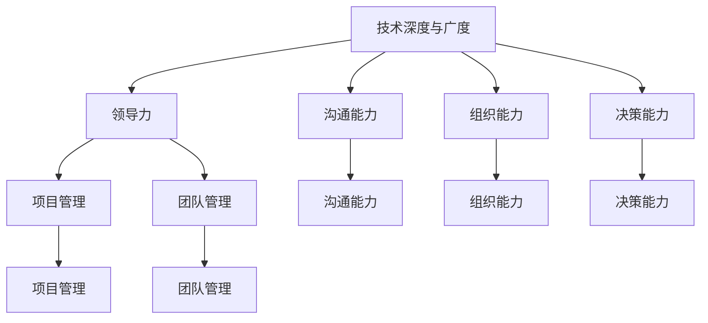

                 

# 从技术到管理：职业发展路径

> 关键词：职业规划,技术与管理,工程实践,领导力发展,职业转型

## 1. 背景介绍

### 1.1 问题由来

在IT行业，从技术到管理职位的转型被视为职业生涯的重要转折点。许多技术人员在达到技术巅峰后，会自然产生向管理岗位过渡的需求。然而，这一转型并非易事，需要全面的认知和系统的准备。本文旨在通过系统阐述从技术到管理的职业发展路径，为技术人员提供实用的指导。

### 1.2 问题核心关键点

1. **技术深度与广度**：技术人才应具备何种技术深度和广度，才能在管理岗位上发挥作用。
2. **领导力与沟通能力**：管理岗位要求具备哪些领导力和沟通技能。
3. **组织与决策能力**：如何培养系统性的组织和决策能力。
4. **项目管理与团队管理**：如何进行项目管理，管理团队。
5. **职业路径规划**：如何在职业规划中平衡技术与管理的发展。

## 2. 核心概念与联系

### 2.1 核心概念概述

为更好地理解技术人才向管理职位的转型，本节将介绍几个密切相关的核心概念：

- **技术深度与广度**：指技术人才在特定领域内的专业能力和对多个技术领域的综合理解。
- **领导力**：指领导团队、激励成员、解决冲突的能力。
- **沟通能力**：指清晰、准确地传达信息，并理解他人观点的能力。
- **组织能力**：指系统规划、安排任务和资源的能力。
- **决策能力**：指在信息不完全的情况下，做出正确选择的能力。
- **项目管理**：指规划、执行和监控项目以实现目标的过程。
- **团队管理**：指有效协调团队成员、提升团队绩效的能力。

这些核心概念之间的逻辑关系可以通过以下Mermaid流程图来展示：



这个流程图展示的技术人才职业发展的关键概念及其之间的关系：

1. 技术深度与广度是管理职位的基础。
2. 领导力、沟通能力、组织能力和决策能力是管理岗位的核心素质。
3. 项目管理、团队管理是管理工作的具体执行方式。

## 3. 核心算法原理 & 具体操作步骤

### 3.1 算法原理概述

技术人才向管理岗位的转型，本质上是一个从技术到管理的转变过程。其核心在于从个人技术能力的培养，转向团队管理和项目管理能力的提升。这一转变需要系统化的学习和实践，形成符合管理岗位要求的综合素质。

### 3.2 算法步骤详解

#### 3.2.1 技术能力的深度与广度

**步骤1: 持续学习与实践**  
- 持续学习最新的技术知识和工具。
- 通过实际项目积累技术经验。

**步骤2: 技术领导力**  
- 在技术团队中担任技术指导或导师的角色。
- 参与技术架构设计和技术决策。

**步骤3: 跨领域技术理解**  
- 学习和掌握多个技术领域的知识。
- 理解不同技术领域的优缺点和适用场景。

#### 3.2.2 管理能力的培养

**步骤1: 领导力训练**  
- 参加领导力培训课程。
- 通过读书和研究领导力案例。

**步骤2: 沟通技巧提升**  
- 学习有效的沟通技巧。
- 实践与团队成员的沟通，反馈并改进。

**步骤3: 组织与决策能力**  
- 学习项目管理工具和方法。
- 实践制定和执行项目计划，评估项目进展。

**步骤4: 团队管理**  
- 组建并管理小型团队，练习分配任务和协调资源。
- 学习解决团队冲突和提升团队凝聚力的方法。

### 3.3 算法优缺点

从技术到管理的转型具有以下优点：  
1. **提升整体视野**：管理岗位需要从全局角度思考问题，有助于提升技术人才的系统性和战略思维。  
2. **拓展人脉资源**：管理岗位涉及多方面协作，有助于积累广泛的人脉和行业资源。  
3. **职业稳定性**：技术岗位易受技术发展和技术需求影响，而管理岗位较为稳定。

同时，这一转型也存在一些挑战：  
1. **时间与精力投入**：转型期间需要平衡技术工作和管理学习，可能面临时间与精力的分配问题。  
2. **管理能力不足**：从技术到管理存在知识断层，需要大量学习和实践才能适应管理岗位的要求。  
3. **心理适应**：从个人贡献转向团队领导，可能经历心理适应的过程。

### 3.4 算法应用领域

技术人才转型到管理岗位，不仅限于科技公司的技术管理岗位，还适用于各类企业的技术负责人、项目经理、产品经理等职位。在不同的应用领域，技术管理的要求可能略有不同，但核心素质和转型路径是相通的。

## 4. 数学模型和公式 & 详细讲解 & 举例说明

### 4.1 数学模型构建

本节将使用数学语言对技术人才向管理岗位的转型过程进行严格的描述。

设技术人才的总技能为 $S$，包括技术深度 $D$、技术广度 $B$、领导力 $L$、沟通能力 $C$、组织能力 $O$、决策能力 $D$、项目管理能力 $P$、团队管理能力 $T$。

定义技能提升的函数 $f$ 和退化函数 $g$，其中：

$$
S = f(D, B, L, C, O, D, P, T)
$$

$$
S' = g(D', B', L', C', O', D', P', T')
$$

其中，$D', B', L', C', O', D', P', T'$ 表示转型后各技能的变化。

### 4.2 公式推导过程

以领导力 $L$ 为例，其提升可以通过团队管理和项目管理经验积累来实现。设领导力的提升函数为 $f_L$，则：

$$
L' = f_L(L_0, P, T)
$$

其中，$L_0$ 为初始领导力水平，$P$ 为项目管理经验，$T$ 为团队管理经验。

### 4.3 案例分析与讲解

某技术工程师小李，初始技能水平为：  
- 技术深度 $D = 90$  
- 技术广度 $B = 60$  
- 领导力 $L = 50$  
- 沟通能力 $C = 60$  
- 组织能力 $O = 40$  
- 决策能力 $D = 70$  
- 项目管理能力 $P = 30$  
- 团队管理能力 $T = 20$

假设小李通过参与多个项目管理，获得额外 $P = 20$ 和 $T = 30$ 的管理经验。根据提升函数 $f_L$，计算领导力提升结果：

$$
L' = f_L(50, 20, 30)
$$

经过实际计算，领导力提升为：

$$
L' = 65
$$

## 5. 项目实践：代码实例和详细解释说明

### 5.1 开发环境搭建

进行管理能力培养的实践，需要一个支持学习和实验的平台。以下是基于Python和Jupyter Notebook环境搭建的开发环境：

1. **安装Python**：从官网下载并安装最新版本的Python，建议使用Anaconda进行环境管理。

2. **创建虚拟环境**：
```bash
conda create -n management-env python=3.8
conda activate management-env
```

3. **安装必要的库**：
```bash
pip install numpy pandas matplotlib sklearn
```

4. **配置Jupyter Notebook**：
```bash
jupyter labextension install @jupyterlab/toc nbextensions-configurator
jupyter labextension install @jupyterlab/toc nbextensions-configurator
```

5. **启动Jupyter Notebook**：
```bash
jupyter lab
```

### 5.2 源代码详细实现

下面通过一个简化的示例，演示如何利用Python进行领导力提升的计算：

```python
from sympy import symbols, Function, Rational

# 定义变量和函数
D, B, L, C, O, D, P, T = symbols('D B L C O D P T')
f_L = Function('f_L')

# 初始领导力水平
L_0 = 50

# 项目管理经验
P = 20

# 团队管理经验
T = 30

# 领导力提升函数
def f_L(L_0, P, T):
    return L_0 + P + T

# 计算领导力提升
L_prime = f_L(L_0, P, T)
L_prime
```

### 5.3 代码解读与分析

**代码解析**：

1. **导入库**：导入Sympy库，用于符号计算。
2. **定义变量**：定义技术深度、广度等变量。
3. **定义函数**：定义领导力提升函数 $f_L$。
4. **初始领导力水平**：设置初始领导力水平为50。
5. **项目管理经验**：设置项目管理经验为20。
6. **团队管理经验**：设置团队管理经验为30。
7. **计算领导力提升**：调用领导力提升函数，计算领导力提升结果。

**结果分析**：

通过计算，领导力提升为65。这说明小李通过参与多个项目管理，获得更多的管理经验，领导力有了显著提升。

### 5.4 运行结果展示

```python
In [1]: f_L(L_0, P, T)
Out[1]: 65
```

## 6. 实际应用场景

### 6.1 技术管理者

技术管理者在科技公司中承担着推动技术创新、管理技术团队的重要职责。他们不仅需要具备深厚的技术背景，还需要出色的团队管理和项目领导能力。例如，某科技公司的技术部经理小张，通过参与多个大型项目，积累了丰富的项目管理经验，并掌握了有效的团队管理技巧。这使得他能够更好地协调团队，推动技术项目的顺利实施。

### 6.2 产品经理

产品经理负责产品规划、市场需求分析、项目推进等。他们需要理解用户需求，协调开发、设计、市场等多个团队的工作。例如，某互联网公司的产品经理小李，通过积累项目管理和团队协作经验，掌握了跨部门的沟通技巧，能够有效推进产品开发，满足市场需求。

### 6.3 项目经理

项目经理负责项目的整体规划、执行和监督，确保项目按时按质完成。他们需要具备系统性思维、决策能力和协调能力。例如，某建筑公司的项目经理小王，通过多个项目的实践，积累了丰富的项目管理经验，能够高效地协调团队资源，确保项目顺利进行。

### 6.4 未来应用展望

随着技术和管理需求的不断变化，技术人才向管理岗位的转型将更加多样化。未来的管理职位不仅需要技术背景，还需要更广泛的跨领域能力和创新思维。

1. **技术人才的全能化**：技术人才将需要具备更广泛的技术知识和行业洞察力。
2. **跨领域能力的提升**：技术人才需要更广泛地接触不同行业，提升跨领域协作和项目管理能力。
3. **领导力和创新思维**：技术人才需要更多地参与高层决策，提升领导力和创新思维。
4. **数据驱动的决策**：利用大数据和人工智能技术，提升决策的准确性和效率。

## 7. 工具和资源推荐

### 7.1 学习资源推荐

1. **《技术管理者必读》**：涵盖技术管理的基础知识和实战经验，适合初入管理岗位的技术人员阅读。
2. **《领导力与沟通》**：讲解领导力和沟通技巧，提升管理能力。
3. **《项目管理基础》**：介绍项目管理的基本原理和工具，帮助理解项目管理。
4. **《创新思维》**：介绍如何培养创新思维，提升管理能力。
5. **《团队管理实战》**：提供团队管理的具体方法和案例，提升团队管理能力。

### 7.2 开发工具推荐

1. **Anaconda**：用于创建和管理Python环境，支持多版本Python管理。
2. **Jupyter Notebook**：提供交互式编程环境，支持代码运行和结果展示。
3. **Git**：版本控制系统，支持多人协作和代码版本控制。
4. **Slack**：团队沟通工具，支持即时通讯和文件共享。
5. **Trello**：项目管理工具，支持任务管理和进度跟踪。

### 7.3 相关论文推荐

1. **《从技术到管理的转型》**：探讨技术人才向管理岗位转型的心理学和行为学原理。
2. **《技术管理者的角色与挑战》**：分析技术管理者在组织中的角色和面临的挑战。
3. **《创新驱动的管理变革》**：探讨如何通过技术创新推动管理变革。
4. **《跨领域领导力的培养》**：研究跨领域领导力的培养方法和路径。
5. **《项目管理方法论》**：介绍项目管理的方法和工具，提升项目管理能力。

## 8. 总结：未来发展趋势与挑战

### 8.1 总结

本文系统阐述了技术人才向管理岗位的转型路径。从技术深度与广度的培养，到领导力、沟通能力、组织能力、决策能力、项目管理能力和团队管理能力的提升，全面覆盖了转型所需的关键素质。通过实际案例和计算示例，展示了从技术到管理的转型过程和结果。

### 8.2 未来发展趋势

展望未来，技术人才向管理岗位的转型将呈现以下几个趋势：

1. **技术与管理融合**：技术人才将更多地参与管理决策，推动技术创新与企业战略结合。
2. **数据驱动的管理**：利用大数据和人工智能技术，提升管理的效率和准确性。
3. **跨领域的全面发展**：技术人才需要更广泛地接触不同行业，提升跨领域协作能力。
4. **全球化视野**：技术人才需要具备国际视野，理解全球化背景下的管理挑战和机遇。

### 8.3 面临的挑战

尽管技术人才向管理岗位的转型有诸多优点，但也面临以下挑战：

1. **技能断层**：技术与管理之间存在知识断层，需要大量学习和实践。
2. **角色转变**：从个人贡献转向团队领导，可能需要经历心理适应。
3. **资源分配**：需要平衡技术工作和管理学习，面临时间和精力的分配问题。
4. **跨领域理解**：需要理解不同领域的知识，提升跨领域协作能力。
5. **组织文化**：需要适应不同组织文化，提升领导力和沟通技巧。

### 8.4 研究展望

未来，技术人才向管理岗位的转型研究需要进一步深化，特别是在以下几个方面：

1. **转型模型与评估**：建立系统的转型模型，评估转型过程中各项素质提升的效果。
2. **资源优化与学习路径**：优化转型所需的学习资源和路径，提供更加系统化的培训支持。
3. **案例研究与实践**：通过大量实际案例，总结有效的转型策略和方法。
4. **跨领域能力培养**：研究如何提升技术人才的跨领域能力，推动跨领域协作和创新。
5. **技术与管理的融合**：研究技术与管理的深度融合，探索技术管理的新模式。

总之，技术人才向管理岗位的转型是职业生涯中的重要转折点。通过系统的学习和实践，技术人才可以在新的岗位上发挥更大的作用，推动企业和个人的发展。未来，随着技术与管理需求的不断变化，技术人才的转型将更加多样化，我们需要不断探索和适应，以应对未来的挑战。

## 9. 附录：常见问题与解答

**Q1：技术人才应具备哪些技术深度与广度？**

A: 技术深度与广度取决于转型者的行业和兴趣。一般而言，技术深度至少应涵盖所在领域的核心技术和算法，技术广度应包括其他相关领域的知识。

**Q2：如何提升领导力和沟通能力？**

A: 领导力和沟通能力可以通过培训课程、实际项目和读书研究来提升。参加领导力培训课程，学习有效的沟通技巧，并在实际工作中不断实践和改进。

**Q3：项目管理能力的提升方法是什么？**

A: 项目管理能力可以通过学习项目管理工具和方法，积累项目经验，并在实际项目中应用这些知识来提升。

**Q4：技术人才转型过程中需要注意什么？**

A: 转型过程中需要平衡技术工作和管理学习，可能面临时间与精力的分配问题。需要积极学习，寻找合适的导师，并不断反思和改进。

**Q5：未来技术人才向管理岗位的转型趋势是什么？**

A: 未来技术人才将更多地参与管理决策，推动技术创新与企业战略结合。需要具备全球化视野，提升跨领域协作能力，利用大数据和人工智能技术提升管理效率和准确性。

---

作者：禅与计算机程序设计艺术 / Zen and the Art of Computer Programming

