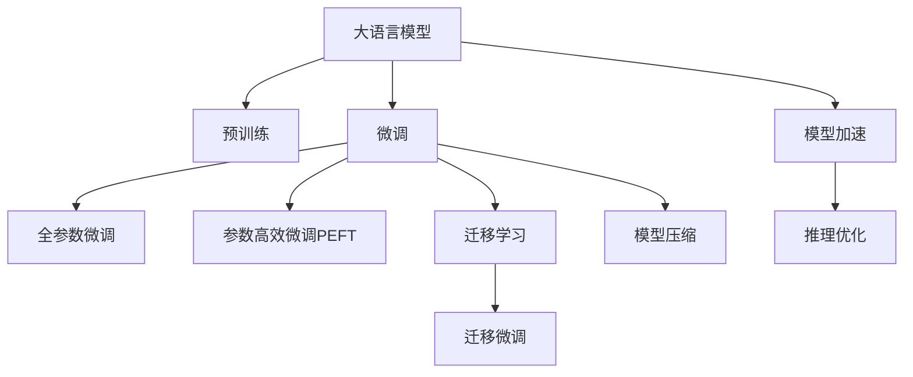

                 

## 1. 背景介绍

### 1.1 电商产业现状
电商行业自互联网兴起以来，已经发展成为全球最大的零售市场之一。从最初的在线商店，到如今融合社交媒体、移动应用、人工智能等技术的全渠道电商，电商产业逐步从纯线上购物向全链条、全场景的方向发展。在数据驱动的电商时代，各大电商平台通过分析用户行为数据，预测用户需求，优化推荐系统，提升用户体验和销售转化率，从而获取竞争优势。

### 1.2 电商行业痛点
尽管电商市场迅速壮大，但行业仍面临诸多挑战：
- **需求多样性**：不同用户的购物需求和偏好差异大，需要更精准的用户画像和推荐系统。
- **市场竞争激烈**：电商平台的竞争日益激烈，需要差异化服务和快速响应市场变化。
- **用户体验提升**：提高购物体验和售后服务质量，增加用户黏性。

## 2. 核心概念与联系

### 2.1 核心概念概述
#### 2.1.1 大语言模型(Large Language Model, LLM)
大语言模型是以自回归模型（如GPT）或自编码模型（如BERT）为代表的大规模预训练语言模型，通过在海量无标签文本语料上进行预训练，学习到丰富的语言知识和常识。

#### 2.1.2 预训练(Pre-training)
预训练是在大规模无标签文本语料上，通过自监督学习任务训练通用语言模型的过程。常见的预训练任务包括掩码语言模型、下一句预测等。

#### 2.1.3 微调(Fine-tuning)
微调是对预训练模型的基础上，使用下游任务的少量标注数据，通过有监督地训练优化模型在特定任务上的性能。

#### 2.1.4 迁移学习(Transfer Learning)
迁移学习是将一个领域学习到的知识，迁移应用到另一个相关领域的学习范式。大模型的预训练-微调过程即是一种典型的迁移学习方式。

#### 2.1.5 模型压缩和加速
模型压缩和加速技术旨在降低大模型的计算资源消耗，同时保持模型性能，以支持大规模部署和实时推理。

这些核心概念之间通过以下Mermaid流程图展示了联系和转化关系：



该流程图说明：

1. 大语言模型通过预训练获得基础能力。
2. 微调是对预训练模型进行任务特定的优化，可以分为全参数微调和参数高效微调（PEFT）。
3. 迁移学习是连接预训练模型与下游任务的桥梁，可以通过微调或迁移微调实现。
4. 模型压缩和加速是优化模型性能，支持大规模部署和实时推理的技术手段。

## 3. 核心算法原理 & 具体操作步骤
### 3.1 算法原理概述

基于电商场景的大语言模型微调，其核心思想是利用预训练语言模型对电商领域的语言数据进行学习，并通过任务特定的微调，提升模型在电商相关任务上的性能。

假设预训练模型为 $M_{\theta}$，其中 $\theta$ 为预训练得到的模型参数。电商领域有多个下游任务，如商品推荐、用户画像、广告投放等。假设给定电商任务 $T$ 的标注数据集 $D=\{(x_i, y_i)\}_{i=1}^N$，微调的目标是找到新的模型参数 $\hat{\theta}$，使得模型在任务 $T$ 上表现最佳。

形式化地，微调的目标为：

$$
\hat{\theta}=\mathop{\arg\min}_{\theta} \mathcal{L}(M_{\theta},D)
$$

其中 $\mathcal{L}$ 为针对任务 $T$ 设计的损失函数，用于衡量模型预测输出与真实标签之间的差异。常见的损失函数包括交叉熵损失、均方误差损失等。

### 3.2 算法步骤详解

#### 3.2.1 任务定义
电商领域常见任务包括：
- **商品推荐**：预测用户可能感兴趣的商品。
- **用户画像**：构建用户行为、兴趣、属性等综合画像。
- **广告投放**：优化广告定向策略，提升广告效果。

#### 3.2.2 数据准备
- **标注数据**：收集电商领域标注数据集，如商品评论、用户行为记录、广告点击数据等。标注数据应涵盖多种电商平台，并反映用户真实行为。
- **非标注数据**：收集电商领域的海量非标注数据，如产品介绍、用户评论等，用于预训练大语言模型。

#### 3.2.3 预训练模型选择
选择合适的预训练语言模型，如GPT-3、BERT、RoBERTa等，作为初始化参数。

#### 3.2.4 模型微调
- **任务适配层设计**：根据任务类型，在预训练模型顶层设计合适的输出层和损失函数。
- **设置微调超参数**：选择合适的优化算法及其参数，如 AdamW、SGD 等，设置学习率、批大小、迭代轮数等。
- **执行梯度训练**：将训练集数据分批次输入模型，前向传播计算损失函数。反向传播计算参数梯度，根据设定的优化算法和学习率更新模型参数。
- **评估模型性能**：周期性在验证集上评估模型性能，根据性能指标决定是否触发 Early Stopping。

#### 3.2.5 模型部署和优化
- **模型保存和加载**：将微调后的模型保存到本地或云端，便于后续调用。
- **模型加速**：使用模型压缩和加速技术，如知识蒸馏、剪枝、量化等，降低模型计算资源消耗。
- **推理优化**：针对特定硬件平台和应用场景，优化模型推理过程，提升推理速度和资源利用率。

## 4. 数学模型和公式 & 详细讲解

### 4.1 数学模型构建

电商领域的微调模型主要分为两部分：预训练模型和下游任务模型。预训练模型通过掩码语言模型、下一句预测等任务进行预训练，学习语言表示。下游任务模型通常为分类或回归模型，根据具体任务设计。

#### 4.1.1 预训练模型
假设预训练模型为 $M_{\theta}$，其在输入 $x$ 上的输出为 $\hat{y}=M_{\theta}(x)$。预训练任务通常为掩码语言模型，假设目标为预测 $x$ 中已被掩码的词语，即 $\hat{y}=[y_1, y_2, ..., y_n]$。

#### 4.1.2 下游任务模型
假设电商推荐任务为分类任务，目标为预测用户对商品 $x$ 的兴趣，即 $\hat{y}=[0,1]$，其中 $1$ 表示用户感兴趣。

### 4.2 公式推导过程

#### 4.2.1 损失函数定义
电商推荐任务的损失函数为交叉熵损失，即：

$$
\ell(y, \hat{y}) = -y \log \hat{y} - (1-y) \log(1-\hat{y})
$$

#### 4.2.2 梯度计算
根据链式法则，损失函数对参数 $\theta_k$ 的梯度为：

$$
\frac{\partial \mathcal{L}}{\partial \theta_k} = \frac{\partial \mathcal{L}}{\partial \hat{y}} \frac{\partial \hat{y}}{\partial x} \frac{\partial x}{\partial \theta_k}
$$

其中 $\frac{\partial \mathcal{L}}{\partial \hat{y}}$ 为交叉熵损失对预测值的梯度，$\frac{\partial \hat{y}}{\partial x}$ 为模型输出对输入的梯度，$\frac{\partial x}{\partial \theta_k}$ 为输入数据对模型参数的梯度。

### 4.3 案例分析与讲解

#### 4.3.1 商品推荐
假设有一个电商平台，收集到大量用户对商品的评分数据 $(x_i, y_i)$，其中 $x_i$ 为商品特征向量，$y_i$ 为评分。利用预训练语言模型 $M_{\theta}$，设计推荐模型 $M_{\theta}^{reco}$，输出用户对商品的兴趣概率。

设推荐模型为二分类任务，则损失函数为：

$$
\mathcal{L}(\theta) = -\frac{1}{N} \sum_{i=1}^N [y_i \log M_{\theta}^{reco}(x_i) + (1-y_i) \log(1-M_{\theta}^{reco}(x_i))]
$$

模型微调时，采用交叉熵损失函数，设计任务适配层，设置合适的超参数。例如：

```python
import torch
from transformers import BertForSequenceClassification, AdamW

model = BertForSequenceClassification.from_pretrained('bert-base-uncased', num_labels=2)

optimizer = AdamW(model.parameters(), lr=2e-5)

def train_epoch(model, dataset, batch_size, optimizer):
    dataloader = torch.utils.data.DataLoader(dataset, batch_size=batch_size, shuffle=True)
    model.train()
    epoch_loss = 0
    for batch in dataloader:
        input_ids = batch['input_ids'].to(device)
        attention_mask = batch['attention_mask'].to(device)
        labels = batch['labels'].to(device)
        model.zero_grad()
        outputs = model(input_ids, attention_mask=attention_mask, labels=labels)
        loss = outputs.loss
        epoch_loss += loss.item()
        loss.backward()
        optimizer.step()
    return epoch_loss / len(dataloader)

def evaluate(model, dataset, batch_size):
    dataloader = torch.utils.data.DataLoader(dataset, batch_size=batch_size)
    model.eval()
    preds, labels = [], []
    with torch.no_grad():
        for batch in dataloader:
            input_ids = batch['input_ids'].to(device)
            attention_mask = batch['attention_mask'].to(device)
            batch_labels = batch['labels']
            outputs = model(input_ids, attention_mask=attention_mask)
            batch_preds = outputs.logits.argmax(dim=1).to('cpu').tolist()
            batch_labels = batch_labels.to('cpu').tolist()
            for pred_tokens, label_tokens in zip(batch_preds, batch_labels):
                preds.append(pred_tokens)
                labels.append(label_tokens)
    return preds, labels
```

#### 4.3.2 用户画像
用户画像构建任务通常为多标签分类任务，目标为预测用户的行为、兴趣等属性。假设收集到大量用户行为数据 $(x_i, y_i)$，其中 $x_i$ 为行为序列，$y_i$ 为属性标签。利用预训练语言模型 $M_{\theta}$，设计用户画像模型 $M_{\theta}^{profile}$，输出用户的多标签属性。

设用户画像模型为多标签分类任务，则损失函数为：

$$
\mathcal{L}(\theta) = -\frac{1}{N} \sum_{i=1}^N \sum_{k=1}^K y_{i,k} \log M_{\theta}^{profile}(x_i,k)
$$

模型微调时，采用二分类交叉熵损失函数，设计任务适配层，设置合适的超参数。例如：

```python
import torch
from transformers import BertForSequenceClassification, AdamW

model = BertForSequenceClassification.from_pretrained('bert-base-uncased', num_labels=K)

optimizer = AdamW(model.parameters(), lr=2e-5)

def train_epoch(model, dataset, batch_size, optimizer):
    dataloader = torch.utils.data.DataLoader(dataset, batch_size=batch_size, shuffle=True)
    model.train()
    epoch_loss = 0
    for batch in dataloader:
        input_ids = batch['input_ids'].to(device)
        attention_mask = batch['attention_mask'].to(device)
        labels = batch['labels'].to(device)
        model.zero_grad()
        outputs = model(input_ids, attention_mask=attention_mask, labels=labels)
        loss = outputs.loss
        epoch_loss += loss.item()
        loss.backward()
        optimizer.step()
    return epoch_loss / len(dataloader)

def evaluate(model, dataset, batch_size):
    dataloader = torch.utils.data.DataLoader(dataset, batch_size=batch_size)
    model.eval()
    preds, labels = [], []
    with torch.no_grad():
        for batch in dataloader:
            input_ids = batch['input_ids'].to(device)
            attention_mask = batch['attention_mask'].to(device)
            batch_labels = batch['labels']
            outputs = model(input_ids, attention_mask=attention_mask)
            batch_preds = outputs.logits.argmax(dim=1).to('cpu').tolist()
            batch_labels = batch_labels.to('cpu').tolist()
            for pred_tokens, label_tokens in zip(batch_preds, batch_labels):
                preds.append(pred_tokens)
                labels.append(label_tokens)
    return preds, labels
```

## 5. 项目实践：代码实例和详细解释说明

### 5.1 开发环境搭建

在进行电商领域的大语言模型微调实践前，需要准备好开发环境。以下是使用Python进行PyTorch开发的环境配置流程：

1. 安装Anaconda：从官网下载并安装Anaconda，用于创建独立的Python环境。

2. 创建并激活虚拟环境：
```bash
conda create -n pytorch-env python=3.8 
conda activate pytorch-env
```

3. 安装PyTorch：根据CUDA版本，从官网获取对应的安装命令。例如：
```bash
conda install pytorch torchvision torchaudio cudatoolkit=11.1 -c pytorch -c conda-forge
```

4. 安装Transformers库：
```bash
pip install transformers
```

5. 安装各类工具包：
```bash
pip install numpy pandas scikit-learn matplotlib tqdm jupyter notebook ipython
```

完成上述步骤后，即可在`pytorch-env`环境中开始电商领域的微调实践。

### 5.2 源代码详细实现

这里我们以电商推荐任务为例，给出使用Transformers库对BERT模型进行微调的PyTorch代码实现。

首先，定义推荐任务的数据处理函数：

```python
from transformers import BertTokenizer
from torch.utils.data import Dataset
import torch

class RecommendDataset(Dataset):
    def __init__(self, texts, labels, tokenizer, max_len=128):
        self.texts = texts
        self.labels = labels
        self.tokenizer = tokenizer
        self.max_len = max_len
        
    def __len__(self):
        return len(self.texts)
    
    def __getitem__(self, item):
        text = self.texts[item]
        label = self.labels[item]
        
        encoding = self.tokenizer(text, return_tensors='pt', max_length=self.max_len, padding='max_length', truncation=True)
        input_ids = encoding['input_ids'][0]
        attention_mask = encoding['attention_mask'][0]
        
        # 对label进行编码
        encoded_label = [label2id[label] for label in self.labels] 
        encoded_label.extend([label2id['negative']] * (self.max_len - len(encoded_label)))
        labels = torch.tensor(encoded_label, dtype=torch.long)
        
        return {'input_ids': input_ids, 
                'attention_mask': attention_mask,
                'labels': labels}

# 标签与id的映射
label2id = {'positive': 1, 'negative': 0}
id2label = {v: k for k, v in label2id.items()}

# 创建dataset
tokenizer = BertTokenizer.from_pretrained('bert-base-cased')

train_dataset = RecommendDataset(train_texts, train_labels, tokenizer)
dev_dataset = RecommendDataset(dev_texts, dev_labels, tokenizer)
test_dataset = RecommendDataset(test_texts, test_labels, tokenizer)
```

然后，定义模型和优化器：

```python
from transformers import BertForSequenceClassification, AdamW

model = BertForSequenceClassification.from_pretrained('bert-base-cased', num_labels=2)

optimizer = AdamW(model.parameters(), lr=2e-5)
```

接着，定义训练和评估函数：

```python
from torch.utils.data import DataLoader
from tqdm import tqdm
from sklearn.metrics import accuracy_score

device = torch.device('cuda') if torch.cuda.is_available() else torch.device('cpu')
model.to(device)

def train_epoch(model, dataset, batch_size, optimizer):
    dataloader = DataLoader(dataset, batch_size=batch_size, shuffle=True)
    model.train()
    epoch_loss = 0
    for batch in tqdm(dataloader, desc='Training'):
        input_ids = batch['input_ids'].to(device)
        attention_mask = batch['attention_mask'].to(device)
        labels = batch['labels'].to(device)
        model.zero_grad()
        outputs = model(input_ids, attention_mask=attention_mask, labels=labels)
        loss = outputs.loss
        epoch_loss += loss.item()
        loss.backward()
        optimizer.step()
    return epoch_loss / len(dataloader)

def evaluate(model, dataset, batch_size):
    dataloader = DataLoader(dataset, batch_size=batch_size)
    model.eval()
    preds, labels = [], []
    with torch.no_grad():
        for batch in dataloader:
            input_ids = batch['input_ids'].to(device)
            attention_mask = batch['attention_mask'].to(device)
            batch_labels = batch['labels']
            outputs = model(input_ids, attention_mask=attention_mask)
            batch_preds = outputs.logits.argmax(dim=1).to('cpu').tolist()
            batch_labels = batch_labels.to('cpu').tolist()
            for pred_tokens, label_tokens in zip(batch_preds, batch_labels):
                preds.append(pred_tokens)
                labels.append(label_tokens)
                
    return accuracy_score(labels, preds)
```

最后，启动训练流程并在测试集上评估：

```python
epochs = 5
batch_size = 16

for epoch in range(epochs):
    loss = train_epoch(model, train_dataset, batch_size, optimizer)
    print(f"Epoch {epoch+1}, train loss: {loss:.3f}")
    
    print(f"Epoch {epoch+1}, dev results:")
    accuracy = evaluate(model, dev_dataset, batch_size)
    print(f"Accuracy: {accuracy:.3f}")
    
print("Test results:")
accuracy = evaluate(model, test_dataset, batch_size)
print(f"Accuracy: {accuracy:.3f}")
```

以上就是使用PyTorch对BERT进行电商推荐任务微调的完整代码实现。可以看到，得益于Transformers库的强大封装，我们可以用相对简洁的代码完成BERT模型的加载和微调。

### 5.3 代码解读与分析

让我们再详细解读一下关键代码的实现细节：

**RecommendDataset类**：
- `__init__`方法：初始化文本、标签、分词器等关键组件。
- `__len__`方法：返回数据集的样本数量。
- `__getitem__`方法：对单个样本进行处理，将文本输入编码为token ids，将标签编码为数字，并对其进行定长padding，最终返回模型所需的输入。

**label2id和id2label字典**：
- 定义了标签与数字id之间的映射关系，用于将label-wise的预测结果解码回真实的标签。

**训练和评估函数**：
- 使用PyTorch的DataLoader对数据集进行批次化加载，供模型训练和推理使用。
- 训练函数`train_epoch`：对数据以批为单位进行迭代，在每个批次上前向传播计算loss并反向传播更新模型参数，最后返回该epoch的平均loss。
- 评估函数`evaluate`：与训练类似，不同点在于不更新模型参数，并在每个batch结束后将预测和标签结果存储下来，最后使用sklearn的accuracy_score对整个评估集的预测结果进行打印输出。

**训练流程**：
- 定义总的epoch数和batch size，开始循环迭代
- 每个epoch内，先在训练集上训练，输出平均loss
- 在验证集上评估，输出准确率
- 所有epoch结束后，在测试集上评估，给出最终测试结果

可以看到，PyTorch配合Transformers库使得BERT微调的代码实现变得简洁高效。开发者可以将更多精力放在数据处理、模型改进等高层逻辑上，而不必过多关注底层的实现细节。

当然，工业级的系统实现还需考虑更多因素，如模型的保存和部署、超参数的自动搜索、更灵活的任务适配层等。但核心的微调范式基本与此类似。

## 6. 实际应用场景
### 6.1 电商平台推荐系统

电商平台的推荐系统是电商营销的核心引擎，通过智能推荐算法，将商品精准推送给用户，提升购物体验和销售转化率。大语言模型在推荐系统中的应用，主要体现在以下几个方面：

#### 6.1.1 用户行为分析
大语言模型能够处理和理解自然语言，可以分析用户的评论、搜索关键词、浏览记录等文本数据，提取用户偏好和需求。例如，通过分析用户评论中的情感倾向，可以判断用户对商品的好恶，从而进行个性化推荐。

#### 6.1.2 商品标签推荐
商品标签推荐是推荐系统的基础，利用大语言模型对商品描述进行理解，提取商品的关键词和属性。例如，通过对商品标签进行分类，构建商品的语义表示，提升推荐系统的准确性和多样性。

#### 6.1.3 推荐算法优化
电商推荐系统需要不断优化，以适应市场变化和用户需求。大语言模型能够学习用户的购物历史和行为模式，预测用户未来的需求和偏好。例如，通过构建用户画像，分析用户的历史购买记录和点击记录，设计基于时间序列的推荐算法，提升推荐效果。

### 6.2 广告投放优化

广告投放是电商营销的重要手段，通过精准投放广告，提升广告的点击率和转化率。大语言模型在广告投放中的应用，主要体现在以下几个方面：

#### 6.2.1 广告创意生成
广告创意是广告投放的基础，利用大语言模型生成高质量的广告文案和图片，提升广告的吸引力和用户点击率。例如，通过对用户画像和商品描述的分析，生成个性化的广告内容，提高广告的针对性和效果。

#### 6.2.2 投放渠道优化
电商平台的广告渠道多样，包括搜索引擎、社交媒体、邮件等。利用大语言模型分析广告投放效果，优化广告投放策略。例如，通过分析不同渠道的广告点击率和转化率，构建多渠道投放策略，提升广告投放的ROI。

#### 6.2.3 用户行为预测
大语言模型能够预测用户的未来行为，通过分析用户的搜索记录、浏览记录等数据，预测用户的购买意向和点击概率。例如，通过构建用户行为模型，预测用户的购买行为，优化广告投放的频率和位置，提升广告效果。

### 6.3 用户客服支持

用户客服是电商平台的重要组成部分，通过智能客服机器人，提升用户咨询体验和满意度。大语言模型在客服支持中的应用，主要体现在以下几个方面：

#### 6.3.1 智能对话生成
智能对话生成是智能客服的基础，利用大语言模型生成自然流畅的对话内容，提升客服的响应速度和用户满意度。例如，通过分析用户的问题，生成个性化的回答，提供精准的客户服务。

#### 6.3.2 意图识别
意图识别是智能客服的核心，通过大语言模型分析用户意图，提供个性化的服务。例如，通过分析用户的咨询内容，识别用户的意图，生成针对性的回答，提升客服的准确性和效率。

#### 6.3.3 多渠道融合
大语言模型可以融合多种数据源，提升客服系统的综合能力。例如，通过分析用户的社交媒体评论、客服聊天记录等数据，构建用户的综合画像，提供全方位的客户服务。

## 7. 工具和资源推荐
### 7.1 学习资源推荐

为了帮助开发者系统掌握大语言模型在电商中的应用，这里推荐一些优质的学习资源：

1. 《自然语言处理实战》系列博文：由大模型技术专家撰写，深入浅出地介绍了NLP实战技术和前沿范式。

2. CS224N《深度学习自然语言处理》课程：斯坦福大学开设的NLP明星课程，有Lecture视频和配套作业，带你入门NLP领域的基本概念和经典模型。

3. 《深度学习与NLP》书籍：介绍深度学习在自然语言处理中的应用，包含推荐系统、文本分类、机器翻译等多个领域的技术和算法。

4. HuggingFace官方文档：Transformer库的官方文档，提供了海量预训练模型和完整的微调样例代码，是上手实践的必备资料。

5. Kaggle竞赛平台：提供丰富的电商数据集，涵盖商品推荐、广告投放、用户画像等多个任务，帮助你掌握电商领域的微调实践。

通过对这些资源的学习实践，相信你一定能够快速掌握大语言模型在电商中的应用精髓，并用于解决实际的电商问题。
###  7.2 开发工具推荐

高效的开发离不开优秀的工具支持。以下是几款用于电商领域的大语言模型微调开发的常用工具：

1. PyTorch：基于Python的开源深度学习框架，灵活动态的计算图，适合快速迭代研究。大部分预训练语言模型都有PyTorch版本的实现。

2. TensorFlow：由Google主导开发的开源深度学习框架，生产部署方便，适合大规模工程应用。同样有丰富的预训练语言模型资源。

3. Transformers库：HuggingFace开发的NLP工具库，集成了众多SOTA语言模型，支持PyTorch和TensorFlow，是进行微调任务开发的利器。

4. Weights & Biases：模型训练的实验跟踪工具，可以记录和可视化模型训练过程中的各项指标，方便对比和调优。与主流深度学习框架无缝集成。

5. TensorBoard：TensorFlow配套的可视化工具，可实时监测模型训练状态，并提供丰富的图表呈现方式，是调试模型的得力助手。

6. Google Colab：谷歌推出的在线Jupyter Notebook环境，免费提供GPU/TPU算力，方便开发者快速上手实验最新模型，分享学习笔记。

合理利用这些工具，可以显著提升大语言模型微调任务的开发效率，加快创新迭代的步伐。

### 7.3 相关论文推荐

大语言模型和微调技术的发展源于学界的持续研究。以下是几篇奠基性的相关论文，推荐阅读：

1. Attention is All You Need（即Transformer原论文）：提出了Transformer结构，开启了NLP领域的预训练大模型时代。

2. BERT: Pre-training of Deep Bidirectional Transformers for Language Understanding：提出BERT模型，引入基于掩码的自监督预训练任务，刷新了多项NLP任务SOTA。

3. Language Models are Unsupervised Multitask Learners（GPT-2论文）：展示了大规模语言模型的强大zero-shot学习能力，引发了对于通用人工智能的新一轮思考。

4. Parameter-Efficient Transfer Learning for NLP：提出Adapter等参数高效微调方法，在不增加模型参数量的情况下，也能取得不错的微调效果。

5. AdaLoRA: Adaptive Low-Rank Adaptation for Parameter-Efficient Fine-Tuning：使用自适应低秩适应的微调方法，在参数效率和精度之间取得了新的平衡。

这些论文代表了大语言模型微调技术的发展脉络。通过学习这些前沿成果，可以帮助研究者把握学科前进方向，激发更多的创新灵感。

## 8. 总结：未来发展趋势与挑战

### 8.1 研究成果总结

本文对基于大语言模型的电商应用进行了全面系统的介绍。首先阐述了电商领域的背景和现状，明确了微调技术在电商领域的重要价值。其次，从算法原理到实践应用，详细讲解了电商领域大语言模型微调的核心步骤和关键技术，给出了电商推荐任务和用户画像任务的代码实现。同时，本文还广泛探讨了大语言模型在电商推荐、广告投放、客服支持等实际应用场景中的应用前景，展示了微调范式的强大潜力。此外，本文精选了电商领域的各类学习资源，力求为读者提供全方位的技术指引。

通过本文的系统梳理，可以看到，大语言模型微调技术在电商领域具有广阔的应用前景。得益于大模型的预训练基础和丰富的语言知识，微调技术能够在电商推荐、广告投放、客服支持等多个方面发挥重要作用，显著提升电商平台的运营效率和用户体验。

### 8.2 未来发展趋势

展望未来，大语言模型微调技术在电商领域的发展趋势如下：

1. **模型规模持续增大**：随着算力成本的下降和数据规模的扩张，预训练语言模型的参数量还将持续增长。超大规模语言模型蕴含的丰富语言知识，有望支撑更加复杂多变的电商推荐和广告投放任务。

2. **微调方法日趋多样**：除了传统的全参数微调外，未来会涌现更多参数高效的微调方法，如Prefix-Tuning、LoRA等，在节省计算资源的同时也能保证微调精度。

3. **用户画像和行为分析**：电商领域的大语言模型微调将更注重用户画像和行为分析。通过学习用户评论、搜索记录等数据，构建用户画像，提升个性化推荐和广告投放的效果。

4. **广告创意生成和投放优化**：利用大语言模型生成高质量的广告文案和图片，提升广告的吸引力和用户点击率。通过分析广告投放效果，优化广告投放策略，提高广告的点击率和转化率。

5. **智能客服和对话系统**：构建智能客服和对话系统，提升用户咨询体验和满意度。通过分析用户的问题，生成个性化的回答，提供精准的客户服务。

6. **多渠道融合和多任务学习**：融合多种数据源，提升客服系统的综合能力。通过多任务学习，提升推荐系统和广告投放的效果。

7. **隐私保护和安全性**：电商领域的大语言模型微调将更注重隐私保护和安全性。通过数据匿名化、差分隐私等技术，保护用户隐私，避免数据泄露。

### 8.3 面临的挑战

尽管大语言模型微调技术在电商领域已经取得了瞩目成就，但在迈向更加智能化、普适化应用的过程中，它仍面临诸多挑战：

1. **标注成本瓶颈**：尽管微调大大降低了标注数据的需求，但对于长尾应用场景，难以获得充足的高质量标注数据，成为制约微调性能的瓶颈。如何进一步降低微调对标注样本的依赖，将是一大难题。

2. **模型鲁棒性不足**：当前微调模型面对域外数据时，泛化性能往往大打折扣。对于测试样本的微小扰动，微调模型的预测也容易发生波动。如何提高微调模型的鲁棒性，避免灾难性遗忘，还需要更多理论和实践的积累。

3. **推理效率有待提高**：大规模语言模型虽然精度高，但在实际部署时往往面临推理速度慢、内存占用大等效率问题。如何在保证性能的同时，简化模型结构，提升推理速度，优化资源占用，将是重要的优化方向。

4. **可解释性亟需加强**：当前微调模型更像是"黑盒"系统，难以解释其内部工作机制和决策逻辑。对于医疗、金融等高风险应用，算法的可解释性和可审计性尤为重要。如何赋予微调模型更强的可解释性，将是亟待攻克的难题。

5. **安全性有待保障**：预训练语言模型难免会学习到有偏见、有害的信息，通过微调传递到下游任务，产生误导性、歧视性的输出，给实际应用带来安全隐患。如何从数据和算法层面消除模型偏见，避免恶意用途，确保输出的安全性，也将是重要的研究课题。

6. **跨领域应用扩展**：尽管当前大语言模型在电商领域取得了显著效果，但在其他领域的应用仍需进一步探索。如何将模型成功应用于金融、医疗、教育等领域，还需要更多创新和实践。

### 8.4 研究展望

面对大语言模型微调所面临的种种挑战，未来的研究需要在以下几个方面寻求新的突破：

1. **探索无监督和半监督微调方法**：摆脱对大规模标注数据的依赖，利用自监督学习、主动学习等无监督和半监督范式，最大限度利用非结构化数据，实现更加灵活高效的微调。

2. **研究参数高效和计算高效的微调范式**：开发更加参数高效的微调方法，在固定大部分预训练参数的同时，只更新极少量的任务相关参数。同时优化微调模型的计算图，减少前向传播和反向传播的资源消耗，实现更加轻量级、实时性的部署。

3. **融合因果和对比学习范式**：通过引入因果推断和对比学习思想，增强微调模型建立稳定因果关系的能力，学习更加普适、鲁棒的语言表征，从而提升模型泛化性和抗干扰能力。

4. **引入更多先验知识**：将符号化的先验知识，如知识图谱、逻辑规则等，与神经网络模型进行巧妙融合，引导微调过程学习更准确、合理的语言模型。同时加强不同模态数据的整合，实现视觉、语音等多模态信息与文本信息的协同建模。

5. **结合因果分析和博弈论工具**：将因果分析方法引入微调模型，识别出模型决策的关键特征，增强输出解释的因果性和逻辑性。借助博弈论工具刻画人机交互过程，主动探索并规避模型的脆弱点，提高系统稳定性。

6. **纳入伦理道德约束**：在模型训练目标中引入伦理导向的评估指标，过滤和惩罚有偏见、有害的输出倾向。同时加强人工干预和审核，建立模型行为的监管机制，确保输出符合人类价值观和伦理道德。

这些研究方向的探索，必将引领大语言模型微调技术迈向更高的台阶，为构建安全、可靠、可解释、可控的智能系统铺平道路。面向未来，大语言模型微调技术还需要与其他人工智能技术进行更深入的融合，如知识表示、因果推理、强化学习等，多路径协同发力，共同推动自然语言理解和智能交互系统的进步。只有勇于创新、敢于突破，才能不断拓展语言模型的边界，让智能技术更好地造福人类社会。

## 9. 附录：常见问题与解答

**Q1：大语言模型在电商中的应用是否需要标注数据？**

A: 大语言模型在电商中的应用需要标注数据，但标注数据的数量和质量要求相对较低。对于电商推荐、广告投放等任务，可以使用部分标注数据进行微调，然后利用无监督学习或迁移学习进一步优化。对于用户画像等任务，需要收集更多的标注数据，提升模型的泛化能力。

**Q2：电商领域的大语言模型微调是否需要特定的硬件资源？**

A: 电商领域的大语言模型微调需要较高的计算资源和存储空间。通常需要GPU或TPU等高性能设备，以支持大规模模型的训练和推理。同时，还需要优化模型结构和算法，减少资源消耗，提高系统效率。

**Q3：电商推荐系统的推荐效果如何提升？**

A: 电商推荐系统的推荐效果可以通过以下方式提升：

1. **用户画像构建**：通过大语言模型分析用户的搜索记录、浏览记录等文本数据，构建用户画像，提升个性化推荐效果。

2. **商品标签推荐**：利用大语言模型对商品描述进行理解，提取商品的关键词和属性，提升推荐系统的准确性和多样性。

3. **多渠道融合**：融合多种数据源，提升推荐系统的综合能力。例如，通过分析用户的社交媒体评论、客服聊天记录等数据，构建用户的综合画像，提供全方位的客户服务。

4. **广告创意生成和投放优化**：利用大语言模型生成高质量的广告文案和图片，提升广告的吸引力和用户点击率。通过分析广告投放效果，优化广告投放策略，提高广告的点击率和转化率。

5. **模型压缩和加速**：通过模型压缩和加速技术，如知识蒸馏、剪枝、量化等，降低模型计算资源消耗，支持大规模部署和实时推理。

这些方法可以帮助电商推荐系统提升推荐效果，提高用户体验和销售转化率。

**Q4：大语言模型在电商领域的应用是否需要跨领域知识？**

A: 大语言模型在电商领域的应用需要跨领域知识。例如，在广告创意生成和投放优化中，可以利用跨领域的文本生成技术和语义表示，提升广告文案的质量和投放效果。在智能客服和对话系统中，可以融合多种数据源，提升客服系统的综合能力。

通过引入跨领域的知识，大语言模型可以更好地理解电商领域的具体场景和需求，提供更精准、更个性化的服务。

**Q5：电商领域的大语言模型微调是否需要考虑隐私保护？**

A: 电商领域的大语言模型微调需要考虑隐私保护。例如，在用户画像构建中，需要对用户数据进行匿名化和差分隐私处理，避免数据泄露和滥用。同时，在广告投放中，需要对用户的行为数据进行脱敏处理，保护用户隐私。

通过隐私保护技术，可以确保电商领域的大语言模型微调符合法律法规和伦理要求，保护用户的隐私权利。

---

作者：禅与计算机程序设计艺术 / Zen and the Art of Computer Programming

