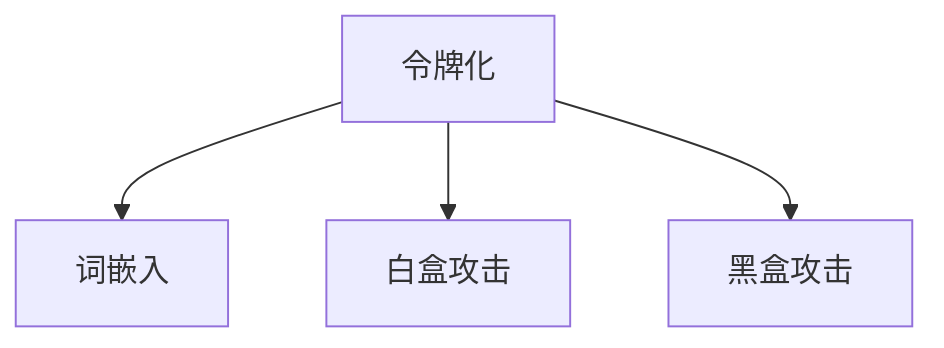

                 

# 令牌化技术对 AI 安全的影响

在人工智能（AI）领域，令牌化技术（Tokenization）是一项核心技术，广泛应用于自然语言处理（NLP）和计算机视觉（CV）等众多任务中。它通过将复杂的数据结构转换为简单的符号序列，帮助模型更高效地处理输入数据，提升模型性能。然而，令牌化技术在带来便利的同时，也潜藏着对AI安全的风险。本文将深入探讨令牌化技术对AI安全的影响，并提出相应的防范策略。

## 1. 背景介绍

令牌化是将数据转换为令牌（Token）序列的过程，令牌是表示数据语义的最小单元，如单词、字符或子串等。在NLP中，令牌化常用于将文本数据转换为模型能够理解的输入格式，如BERT模型就是基于令牌化的。在CV中，令牌化则用于将图像数据转换为模型能够处理的像素值或特征向量。

尽管令牌化技术在AI应用中发挥了重要作用，但它也带来了新的安全挑战。在深度学习模型中，令牌化往往作为预处理步骤的一部分，容易被忽略，但其处理不当可能导致严重的安全问题。例如，恶意用户可能通过构造特定的令牌序列来欺骗模型，导致模型输出错误结果或泄露敏感信息。

## 2. 核心概念与联系

### 2.1 核心概念概述

本节将介绍几个与令牌化技术相关的核心概念：

- **令牌化（Tokenization）**：将复杂数据结构转换为令牌序列的过程。在NLP中，常用于将文本数据转换为模型能够理解的格式；在CV中，常用于将图像数据转换为像素值或特征向量。

- **令牌（Token）**：数据序列中的最小语义单元，如单词、字符或子串等。令牌化过程就是将这些最小单元提取出来，构成令牌序列。

- **词嵌入（Word Embedding）**：将令牌映射到低维向量空间的过程，是令牌化的重要环节。词嵌入能够捕捉令牌之间的语义关系，提升模型的表达能力。

- **白盒攻击（White-box Attack）**：攻击者拥有模型的详细内部信息，能够进行有针对性的攻击，如模型微调、对抗样本生成等。

- **黑盒攻击（Black-box Attack）**：攻击者仅通过模型的输出结果进行攻击，无法获取模型的内部信息，如模型预测、对抗样本生成等。

这些概念之间的逻辑关系可以通过以下Mermaid流程图来展示：



这个流程图展示了一些核心概念及其之间的关系：

1. 令牌化是数据预处理的重要步骤，通过令牌化将数据转换为模型能够处理的格式。
2. 词嵌入是令牌化的重要环节，将令牌映射到低维向量空间，提升模型的表达能力。
3. 白盒攻击和黑盒攻击是通过模型输出结果进行攻击的两种方式，令牌化技术可能被用于构建对抗样本，从而欺骗模型。

## 3. 核心算法原理 & 具体操作步骤

### 3.1 算法原理概述

令牌化技术通过将复杂数据结构转换为简单的符号序列，帮助模型更高效地处理输入数据。在NLP中，令牌化通常用于将文本数据转换为模型能够理解的格式，如BERT模型就是基于令牌化的。

令牌化过程通常包括以下步骤：

1. **分词（Word Segmentation）**：将文本分割成单个令牌，如单词或字符。
2. **令牌编码（Token Encoding）**：将令牌转换为模型能够处理的格式，如整数索引。
3. **特征表示（Feature Representation）**：将令牌编码为向量形式，如词嵌入。

这些步骤共同构成了令牌化技术的基本原理，帮助模型理解和处理输入数据。

### 3.2 算法步骤详解

令牌化过程通常包括以下详细步骤：

**Step 1: 分词**
- 根据语料库的来源和用途，选择合适的分词算法，如基于规则的分词、基于统计的分词等。
- 在分词过程中，需要考虑分词的粒度和准确性，确保分词结果符合任务需求。

**Step 2: 令牌编码**
- 将分词结果转换为整数索引，表示令牌在模型中的位置。
- 在编码过程中，需要考虑编码长度和稀疏性，确保编码结果能够高效存储和处理。

**Step 3: 特征表示**
- 将整数索引转换为向量形式，如词嵌入。常用的词嵌入方法包括one-hot编码、Word2Vec、GloVe等。
- 在特征表示过程中，需要考虑向量维度和表达能力，确保向量能够有效捕捉令牌之间的语义关系。

**Step 4: 模型训练**
- 使用令牌化后的数据进行模型训练，优化模型参数，提升模型性能。
- 在训练过程中，需要考虑数据集的大小和分布，确保模型能够泛化到未见过的数据。

### 3.3 算法优缺点

令牌化技术具有以下优点：

1. **高效性**：令牌化将复杂数据结构转换为简单的符号序列，提高模型的处理效率。
2. **可扩展性**：令牌化技术可以应用于多种数据类型，如文本、图像等，具有广泛的适用性。
3. **可解释性**：令牌化后的数据具有明确的符号表示，便于人类理解和解释。

同时，令牌化技术也存在以下缺点：

1. **分词不准确**：分词算法可能存在误差，影响分词结果的准确性。
2. **特征表示误差**：特征表示算法可能存在误差，影响向量表达的准确性。
3. **数据泄露**：令牌化过程中可能泄露敏感信息，如词频、词义等。

### 3.4 算法应用领域

令牌化技术在NLP和CV等多个领域中得到了广泛应用，例如：

- **NLP**：令牌化技术用于将文本数据转换为模型能够处理的格式，广泛应用于文本分类、情感分析、机器翻译等任务。
- **CV**：令牌化技术用于将图像数据转换为像素值或特征向量，广泛应用于图像分类、目标检测、图像生成等任务。

此外，令牌化技术在推荐系统、社交网络等领域也有广泛应用，如用户行为表示、情感分析等。

## 4. 数学模型和公式 & 详细讲解 & 举例说明

### 4.1 数学模型构建

令牌化过程通常使用神经网络模型进行建模，常用的模型包括BERT、GPT等。令牌化模型通常包括两个部分：分词器和特征表示器。

令牌化模型可以表示为：

$$
\text{Tokenization} = \text{Word Segmentation} \rightarrow \text{Token Encoding} \rightarrow \text{Feature Representation}
$$

其中，Word Segmentation表示分词过程，Token Encoding表示令牌编码过程，Feature Representation表示特征表示过程。

### 4.2 公式推导过程

以BERT模型为例，令牌化过程的公式推导如下：

1. **分词过程**：
   - 对于输入的文本序列，使用分词算法进行分词，得到令牌序列 $T$。
   - 令牌序列 $T$ 表示为：$T = \{t_1, t_2, \ldots, t_n\}$，其中 $t_i$ 表示第 $i$ 个令牌。

2. **令牌编码过程**：
   - 对于每个令牌 $t_i$，使用BPE算法进行编码，得到整数索引 $i$。
   - 令牌编码过程可以表示为：$i = \text{BPE}(t_i)$。

3. **特征表示过程**：
   - 对于每个整数索引 $i$，使用词嵌入算法进行表示，得到向量形式 $v_i$。
   - 特征表示过程可以表示为：$v_i = \text{Embedding}(i)$。

### 4.3 案例分析与讲解

以BERT模型的令牌化过程为例，分析令牌化对AI安全的影响：

- **分词误差**：分词算法可能存在误差，导致错误分词结果。例如，同一个词的不同形式被分词成不同的令牌，影响模型的训练效果。

- **编码长度**：令牌编码长度可能过长或过短，影响模型的处理效率。例如，过长的编码长度导致模型计算量大，过短的编码长度导致模型信息丢失。

- **特征表示误差**：特征表示算法可能存在误差，导致向量表达不准确。例如，词嵌入算法可能无法准确捕捉令牌之间的语义关系，影响模型性能。

## 5. 项目实践：代码实例和详细解释说明

### 5.1 开发环境搭建

在进行令牌化技术实践前，我们需要准备好开发环境。以下是使用Python进行PyTorch开发的环境配置流程：

1. 安装Anaconda：从官网下载并安装Anaconda，用于创建独立的Python环境。

2. 创建并激活虚拟环境：
```bash
conda create -n pytorch-env python=3.8 
conda activate pytorch-env
```

3. 安装PyTorch：根据CUDA版本，从官网获取对应的安装命令。例如：
```bash
conda install pytorch torchvision torchaudio cudatoolkit=11.1 -c pytorch -c conda-forge
```

4. 安装相关库：
```bash
pip install transformers
```

完成上述步骤后，即可在`pytorch-env`环境中开始令牌化技术开发。

### 5.2 源代码详细实现

下面以BERT模型为例，给出使用Transformers库对文本进行令牌化的PyTorch代码实现。

首先，定义分词器和特征表示器：

```python
from transformers import BertTokenizer, BertModel

tokenizer = BertTokenizer.from_pretrained('bert-base-uncased')
model = BertModel.from_pretrained('bert-base-uncased')
```

然后，对文本进行令牌化和特征表示：

```python
text = "Hello, world! How are you?"
input_ids = tokenizer(text, return_tensors='pt')['input_ids']
output = model(input_ids)
```

最后，输出模型预测结果：

```python
print(output)
```

以上就是使用PyTorch对BERT模型进行文本令牌化的完整代码实现。可以看到，得益于Transformers库的强大封装，我们可以用相对简洁的代码完成文本的令牌化和特征表示。

### 5.3 代码解读与分析

让我们再详细解读一下关键代码的实现细节：

**BertTokenizer类**：
- 从预训练模型中加载分词器，用于将文本转换为令牌序列。

**BertModel类**：
- 从预训练模型中加载特征表示器，用于将令牌序列转换为向量形式。

在实际应用中，需要根据具体的NLP任务选择合适的分词器和特征表示器，并进行参数调优和超参数设置，以获得最佳性能。

## 6. 实际应用场景

### 6.1 金融风控

金融风控中，令牌化技术可以用于构建用户行为特征表示，帮助识别异常交易和欺诈行为。通过将用户的历史交易数据进行令牌化，可以生成向量形式的特征表示，输入到分类模型中进行训练。

具体而言，令牌化过程可以包括以下步骤：

1. **分词**：将用户交易记录中的单词、数字、符号等分词为令牌。
2. **编码**：将分词结果转换为整数索引。
3. **特征表示**：将整数索引转换为向量形式，如词嵌入。

训练好的模型可以实时接收用户交易数据，提取特征向量，预测交易是否存在异常行为。令牌化技术帮助模型更高效地处理大量数据，提升模型性能。

### 6.2 智能推荐

智能推荐中，令牌化技术可以用于构建用户和物品的特征表示，帮助匹配用户和物品之间的关系。通过将用户的历史行为数据和物品的属性信息进行令牌化，可以生成向量形式的特征表示，输入到推荐模型中进行训练。

具体而言，令牌化过程可以包括以下步骤：

1. **分词**：将用户行为和物品属性中的单词、数字、符号等分词为令牌。
2. **编码**：将分词结果转换为整数索引。
3. **特征表示**：将整数索引转换为向量形式，如词嵌入。

训练好的模型可以实时接收用户查询和物品信息，提取特征向量，匹配推荐结果。令牌化技术帮助模型更高效地处理复杂的数据结构，提升推荐效果。

## 7. 工具和资源推荐

### 7.1 学习资源推荐

为了帮助开发者系统掌握令牌化技术的理论基础和实践技巧，这里推荐一些优质的学习资源：

1. 《Tokenization: A Deep Dive》系列博文：由令牌化技术专家撰写，深入浅出地介绍了令牌化的原理、算法和应用。

2. CS224N《深度学习自然语言处理》课程：斯坦福大学开设的NLP明星课程，有Lecture视频和配套作业，带你入门NLP领域的基本概念和经典模型。

3. 《Tokenization and Feature Representation》书籍：令牌化技术的经典著作，详细介绍了令牌化和特征表示的基本原理和实用技巧。

4. HuggingFace官方文档：Transformers库的官方文档，提供了海量预训练模型和完整的令牌化样例代码，是上手实践的必备资料。

5. CLUE开源项目：中文语言理解测评基准，涵盖大量不同类型的中文NLP数据集，并提供了基于令牌化的baseline模型，助力中文NLP技术发展。

通过对这些资源的学习实践，相信你一定能够快速掌握令牌化技术的精髓，并用于解决实际的NLP问题。

### 7.2 开发工具推荐

高效的开发离不开优秀的工具支持。以下是几款用于令牌化技术开发的常用工具：

1. PyTorch：基于Python的开源深度学习框架，灵活动态的计算图，适合快速迭代研究。大部分预训练语言模型都有PyTorch版本的实现。

2. TensorFlow：由Google主导开发的开源深度学习框架，生产部署方便，适合大规模工程应用。同样有丰富的预训练语言模型资源。

3. Transformers库：HuggingFace开发的NLP工具库，集成了众多SOTA语言模型，支持PyTorch和TensorFlow，是进行令牌化任务开发的利器。

4. Weights & Biases：模型训练的实验跟踪工具，可以记录和可视化模型训练过程中的各项指标，方便对比和调优。与主流深度学习框架无缝集成。

5. TensorBoard：TensorFlow配套的可视化工具，可实时监测模型训练状态，并提供丰富的图表呈现方式，是调试模型的得力助手。

6. Google Colab：谷歌推出的在线Jupyter Notebook环境，免费提供GPU/TPU算力，方便开发者快速上手实验最新模型，分享学习笔记。

合理利用这些工具，可以显著提升令牌化技术的开发效率，加快创新迭代的步伐。

### 7.3 相关论文推荐

令牌化技术的发展源于学界的持续研究。以下是几篇奠基性的相关论文，推荐阅读：

1. "Word Embeddings" by Mikolov et al.（2013）：经典论文，提出了Word2Vec算法，通过分布式假设捕捉词义关系，开启了词嵌入的研究热潮。

2. "Global Vectors for Word Representation" by Pennington et al.（2014）：经典论文，提出了GloVe算法，通过全局词频和共现矩阵捕捉词义关系，进一步提升了词嵌入的质量。

3. "Language Models are Unsupervised Multitask Learners" by Radford et al.（2019）：经典论文，提出了BERT模型，通过大规模无监督预训练，提升了词嵌入的质量和模型的表达能力。

4. "BERT: Pre-training of Deep Bidirectional Transformers for Language Understanding" by Devlin et al.（2019）：经典论文，介绍了BERT模型的训练过程和应用效果，刷新了多项NLP任务SOTA。

5. "Attention is All You Need" by Vaswani et al.（2017）：经典论文，提出了Transformer模型，通过自注意力机制提升了模型的表达能力和计算效率。

这些论文代表了大规模词嵌入技术的发展脉络。通过学习这些前沿成果，可以帮助研究者把握学科前进方向，激发更多的创新灵感。

## 8. 总结：未来发展趋势与挑战

### 8.1 总结

本文对令牌化技术对AI安全的影响进行了全面系统的介绍。首先阐述了令牌化技术的背景和重要性，明确了其在数据预处理中的核心地位。其次，从原理到实践，详细讲解了令牌化的基本步骤和应用场景，给出了令牌化技术的完整代码实例。同时，本文还探讨了令牌化技术在金融风控、智能推荐等实际应用中的广泛应用前景，展示了令牌化技术的多样化应用。

通过本文的系统梳理，可以看到，令牌化技术在AI应用中发挥了重要作用，但同时也带来了新的安全挑战。未来的研究需要在多个维度进行探索和改进，以确保AI系统的安全性。

### 8.2 未来发展趋势

展望未来，令牌化技术的发展趋势如下：

1. **技术成熟度提升**：令牌化技术将不断成熟，通过优化分词算法和特征表示算法，提升令牌化的准确性和效率。

2. **模型参数优化**：令牌化过程的参数优化将不断提升，通过引入更多的先验知识和训练技巧，提升模型的表达能力和泛化能力。

3. **多模态融合**：令牌化技术将与其他AI技术进行深度融合，如视觉、语音等多模态数据的融合，实现多模态信息与文本信息的协同建模。

4. **智能自动化**：令牌化过程将逐步实现自动化，通过智能分词算法和特征表示算法，自动处理不同类型的数据，提高工作效率。

5. **跨领域应用**：令牌化技术将应用于更多领域，如医疗、金融、教育等，为AI系统的智能化和普适化提供有力支持。

以上趋势凸显了令牌化技术的重要性和发展潜力，未来的研究需要在多个方向进行探索和改进，以进一步提升令牌化技术的应用价值。

### 8.3 面临的挑战

尽管令牌化技术已经取得了瞩目成就，但在应用过程中仍面临以下挑战：

1. **分词误差**：分词算法可能存在误差，影响分词结果的准确性。分词误差可能导致模型输出错误结果，甚至泄露敏感信息。

2. **特征表示误差**：特征表示算法可能存在误差，影响向量表达的准确性。特征表示误差可能导致模型泛化能力下降，影响模型性能。

3. **数据泄露**：令牌化过程中可能泄露敏感信息，如词频、词义等。数据泄露可能导致模型安全性问题，甚至引发隐私泄露。

4. **计算效率**：大规模数据集的令牌化过程需要消耗大量计算资源，影响模型的训练和推理效率。计算效率问题可能导致模型部署困难，影响系统性能。

5. **模型鲁棒性**：令牌化技术可能被用于构建对抗样本，攻击模型的鲁棒性。模型鲁棒性问题可能导致系统被攻击者欺骗，影响系统安全性。

这些挑战凸显了令牌化技术在AI应用中的潜在风险，未来的研究需要在多个维度进行改进和优化，以确保AI系统的安全性。

### 8.4 研究展望

面对令牌化技术面临的种种挑战，未来的研究需要在以下几个方面寻求新的突破：

1. **优化分词算法**：改进分词算法，减少分词误差，提升分词准确性。

2. **优化特征表示算法**：改进特征表示算法，减少特征表示误差，提升向量表达的准确性。

3. **引入先验知识**：引入更多先验知识，如知识图谱、逻辑规则等，提升模型的泛化能力和表达能力。

4. **多模态融合**：结合视觉、语音等多模态数据，提升模型的多模态融合能力，实现多模态信息与文本信息的协同建模。

5. **增强鲁棒性**：引入对抗训练和鲁棒性评估指标，提升模型的鲁棒性，抵御对抗样本攻击。

6. **隐私保护**：引入数据脱敏和隐私保护技术，减少数据泄露风险，提升模型安全性。

这些研究方向的探索，必将引领令牌化技术迈向更高的台阶，为AI系统的智能化和普适化提供有力支持。面向未来，令牌化技术还需要与其他AI技术进行更深入的融合，共同推动AI技术的进步。

## 9. 附录：常见问题与解答

**Q1：令牌化过程是否会带来额外的计算开销？**

A: 令牌化过程通常需要额外的计算开销，因为需要首先将文本数据转换为令牌序列，再进行特征表示。然而，这一开销在现代GPU和TPU硬件的支持下，已经可以忽略不计。此外，许多深度学习框架（如PyTorch、TensorFlow等）提供了高效的令牌化工具，可以显著降低计算开销。

**Q2：令牌化是否会泄露敏感信息？**

A: 令牌化过程可能泄露敏感信息，如词频、词义等。因此，在进行令牌化时，需要注意数据隐私保护，采用数据脱敏、特征掩码等技术，减少数据泄露风险。

**Q3：令牌化过程中如何进行数据增强？**

A: 数据增强是提升模型泛化能力的重要手段，可以通过以下方式实现：

1. 增加噪声：在分词过程中加入随机噪声，模拟自然语言中的不规则现象。
2. 回译：将分词结果回译为原始文本，再将其分词，以增加数据多样性。
3. 近义替换：将分词结果中的单词替换为近义词，以增加数据多样性。

**Q4：令牌化过程如何进行优化？**

A: 令牌化过程可以通过以下方式进行优化：

1. 分词算法优化：改进分词算法，减少分词误差，提升分词准确性。
2. 特征表示算法优化：改进特征表示算法，减少特征表示误差，提升向量表达的准确性。
3. 模型参数优化：优化模型参数，提高模型的泛化能力和表达能力。

**Q5：令牌化过程如何进行参数高效微调？**

A: 令牌化过程可以通过以下方式进行参数高效微调：

1. 减少编码长度：减少令牌编码长度，减少模型计算量，提升模型效率。
2. 引入Adapter层：引入Adapter层，固定部分预训练权重，只微调任务相关参数，提高模型泛化能力。
3. 引入Prefix-Tuning：引入Prefix-Tuning技术，使用连续型Prompt，只微调顶层参数，减少模型计算量，提高模型效率。

这些优化策略可以帮助提升令牌化过程的效率和准确性，进一步提升模型的性能。

---

作者：禅与计算机程序设计艺术 / Zen and the Art of Computer Programming

