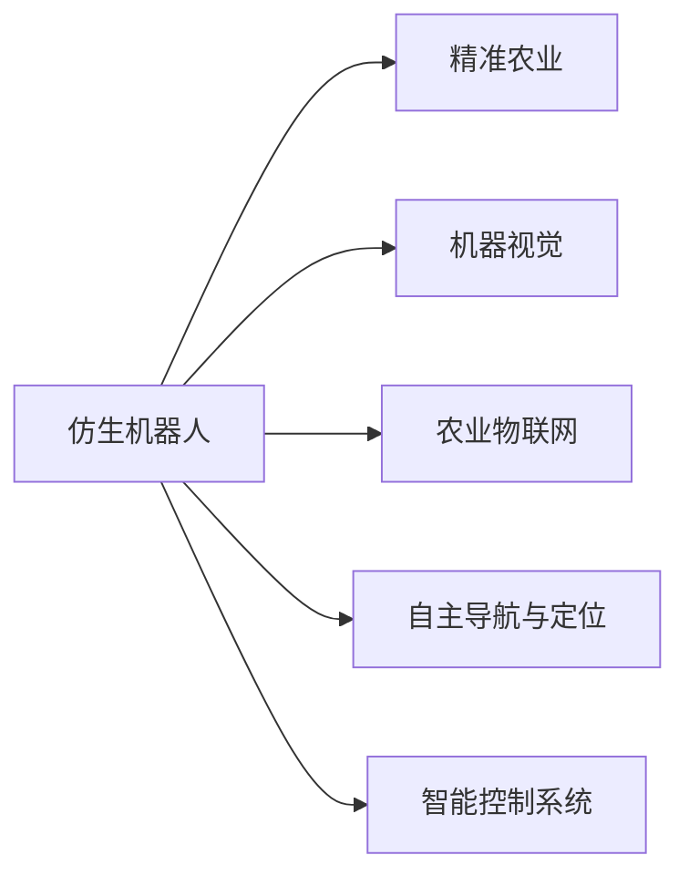

                 

# 仿生机器人在农业中的应用：精准种植和收获

## 1. 背景介绍

随着现代科技的不断进步，机器人技术已经逐步应用于农业生产中，成为推动农业现代化发展的关键力量。相比传统的农业机械，仿生机器人能够更加精准、灵活、高效地执行复杂的农事操作，为农民带来了全新的种植和收获体验。

### 1.1 农业机器人概述

农业机器人是指通过人工智能、机器视觉、传感器、自主导航等技术，能够自主完成田间作业、精准农事管理的智能机械设备。农业机器人在农业生产中的应用，不仅可以提高农业生产效率，还可以改善农作物产量和质量，同时降低农业生产成本。

## 2. 核心概念与联系

### 2.1 核心概念概述

为更好地理解仿生机器人技术在农业中的应用，本节将介绍几个密切相关的核心概念：

- 仿生机器人(Bionic Robot)：指模仿生物形态、结构和行为特点，在智能机器人的基础上发展而来的新型机器人。通过仿生设计，能够更加适应农业环境的复杂性和多变性。

- 精准农业(Precision Agriculture)：指利用现代信息技术，对农业生产进行精确管理和优化，以提高作物产量、质量和资源利用效率的一种现代化农业生产方式。

- 机器视觉(Machine Vision)：指通过相机、传感器等设备获取农作物图像，利用图像处理和分析技术，对作物生长状况、病虫害、田间管理等进行识别和诊断。

- 农业物联网(Agricultural Internet of Things, AIoT)：指利用传感器、互联网通信等技术，将农田中的各种设备和数据连接起来，实现农田数据的实时监控和管理。

- 自主导航与定位(Self-driving Navigation and Positioning)：指仿生机器人通过GPS、惯性导航、LiDAR等技术，自动定位并规划路径，确保作业的准确性和高效性。

- 智能控制系统(Intelligent Control System)：指通过控制算法和决策系统，使仿生机器人能够自主完成各种农事操作，如播种、施肥、除草等。

这些核心概念之间的逻辑关系可以通过以下Mermaid流程图来展示：



这个流程图展示了大语言模型的核心概念及其之间的关系：

1. 仿生机器人通过精准农业、机器视觉、农业物联网、自主导航与定位、智能控制系统等技术，实现对农事的精准管理。
2. 精准农业依赖仿生机器人进行田间作业，确保作业的精确性和高效性。
3. 机器视觉和智能控制系统对农作物的生长状况、病虫害等进行识别和诊断，辅助精准农业的决策。
4. 农业物联网为仿生机器人提供实时数据，确保作业的准确性。
5. 自主导航与定位技术，使仿生机器人能够自主规划路径，执行农事操作。

## 3. 核心算法原理 & 具体操作步骤

### 3.1 算法原理概述

仿生机器人在农业中的精准种植和收获，主要依赖于以下几个核心算法：

- 图像处理和识别算法：用于分析和识别农作物图像，包括图像预处理、特征提取、分类识别等。
- 机器人导航和定位算法：用于自主导航和精确定位，确保机器人能够准确到达作业位置。
- 智能决策算法：用于决策规划和路径规划，以优化作业路径，提高作业效率。
- 控制算法：用于控制仿生机器人的运动和操作，包括机械手、行进等动作。

### 3.2 算法步骤详解

基于仿生机器人在农业中的精准种植和收获，通常包括以下几个关键步骤：

**Step 1: 图像预处理**
- 获取农田图像数据，并进行预处理，如降噪、归一化等操作，以增强图像质量。

**Step 2: 特征提取与分类**
- 使用卷积神经网络(CNN)等图像处理算法，对预处理后的图像进行特征提取，并进行分类识别，确定作物种类、生长状态、病虫害等信息。

**Step 3: 机器人导航与定位**
- 使用GPS、惯性导航、LiDAR等传感器，进行实时定位和路径规划，确保机器人能够准确到达作业位置。

**Step 4: 智能决策**
- 根据作物识别和农田数据，利用机器学习模型进行决策规划，确定作业任务和顺序，如播种、施肥、除草等。

**Step 5: 控制与执行**
- 根据决策结果，控制仿生机器人的动作，执行播种、施肥、除草等农事操作，并实时监控作业效果。

### 3.3 算法优缺点

仿生机器人在农业中的精准种植和收获，具有以下优点：

1. 精准高效：能够进行精准定位和作业，提高作物产量和质量。
2. 节省人力：自动化机械化作业，减少人力投入，提高作业效率。
3. 适应性强：能够适应不同地形和气候条件，灵活执行作业任务。

同时，该方法也存在一定的局限性：

1. 高成本：初始设备和系统维护成本较高。
2. 技术复杂：需要复杂的算法和硬件支持，对技术要求较高。
3. 数据依赖：依赖高精度的图像和传感器数据，数据质量影响作业效果。

尽管存在这些局限性，但仿生机器人在农业中的应用，依然为现代农业带来了巨大的变革和创新，加速了农业生产方式的现代化进程。

### 3.4 算法应用领域

仿生机器人在农业中的应用，已经拓展到多个领域，包括：

- 智能播种和施肥：通过图像识别和智能决策，精确控制播种量和施肥量。
- 无人除草和收割：使用仿生机器人进行无人除草和收割，提高作业效率和质量。
- 病虫害监测与防治：利用机器视觉和智能控制系统，对病虫害进行实时监测和防治。
- 农产品质量检测：通过图像处理和智能识别，对农产品的外观和质量进行检测。
- 农田数据分析与管理：利用农业物联网和机器学习算法，对农田数据进行实时监控和分析，优化农业生产。

此外，仿生机器人在农业中的应用，还扩展到精准农业、智慧农场、农业机器人竞赛等多个领域，推动了农业生产技术的不断进步。

## 4. 数学模型和公式 & 详细讲解 & 举例说明

### 4.1 数学模型构建

仿生机器人在农业中的精准种植和收获，涉及多个数学模型的构建和应用，包括：

- 图像处理模型：用于特征提取和分类，常用的模型包括卷积神经网络(CNN)、目标检测算法YOLO等。
- 路径规划模型：用于机器人导航和定位，常用的模型包括A*算法、RRT*算法等。
- 智能决策模型：用于农业作业的决策规划，常用的模型包括决策树、支持向量机(SVM)等。
- 控制算法模型：用于机器人动作的控制，常用的模型包括PID控制、模糊控制等。

### 4.2 公式推导过程

以卷积神经网络模型为例，推导其在图像处理中的基本结构和使用过程。

**CNN模型结构**

CNN模型包括卷积层、池化层、全连接层等组成部分。以一个简单的3x3卷积层为例，其结构如图：

```
  (3x3)   (3x3)   (3x3)
    *      *      *
    *      *      *
    *      *      *
  (3x3)   (3x3)   (3x3)
```

其中，$W$ 为卷积核权重，$b$ 为偏置项，$x$ 为输入图像，$o$ 为卷积后的输出。

**卷积运算公式**

卷积运算的基本公式如下：

$$
o_i = \sum_{j=0}^{N-1} \sum_{k=0}^{M-1} w_{j,k} \cdot x_{i-j,j-k} + b_i
$$

其中，$o_i$ 为输出，$w_{j,k}$ 为卷积核权重，$x_{i-j,j-k}$ 为输入图像的像素值，$b_i$ 为偏置项。

**池化运算公式**

池化运算是一种降维操作，通常采用最大池化或平均池化。以最大池化为例，公式如下：

$$
o_i = \max_{j=0}^{N-1} \sum_{k=0}^{M-1} w_{j,k} \cdot x_{i-j,j-k}
$$

其中，$o_i$ 为池化后的输出，$w_{j,k}$ 为池化核权重，$x_{i-j,j-k}$ 为输入图像的像素值。

**分类识别公式**

分类识别通常采用softmax函数将卷积后的输出转化为概率分布，公式如下：

$$
p(y|x) = \frac{e^{\sum_{i=1}^{C} w_i \cdot o_i}}{\sum_{i=1}^{C} e^{\sum_{j=1}^{C} w_j \cdot o_j}}
$$

其中，$p(y|x)$ 为输入图像 $x$ 属于类别 $y$ 的概率，$w_i$ 为类别 $i$ 对应的权重。

### 4.3 案例分析与讲解

以智能播种系统为例，详细讲解仿生机器人在农业中的应用。

**智能播种系统**

智能播种系统通过图像识别和智能决策，实现精准播种操作。其基本流程如下：

1. 获取农田图像数据，并进行预处理。
2. 使用卷积神经网络对图像进行特征提取和分类识别，确定播种位置和种类。
3. 利用GPS和LiDAR传感器，进行机器人导航和定位。
4. 根据分类结果，控制播种机的运动和操作，执行播种操作。
5. 实时监控播种效果，并进行数据记录和分析。

**案例分析**

以某智能播种系统为例，该系统在田间作业中取得了显著的成效：

- 提高了播种的精确度和均匀度，减少了种子的浪费和损失。
- 减少了人工劳动强度，提高了作业效率。
- 实现了对播种种类的自动识别和分类，提高了播种的灵活性和适应性。

通过上述案例，可以看出仿生机器人在农业中的精准播种和收获，具有广泛的应用前景。

## 5. 项目实践：代码实例和详细解释说明

### 5.1 开发环境搭建

在进行仿生机器人精准种植和收获的代码实现前，我们需要准备好开发环境。以下是使用Python进行TensorFlow开发的开发环境配置流程：

1. 安装Anaconda：从官网下载并安装Anaconda，用于创建独立的Python环境。

2. 创建并激活虚拟环境：
```bash
conda create -n tf-env python=3.8 
conda activate tf-env
```

3. 安装TensorFlow：根据CUDA版本，从官网获取对应的安装命令。例如：
```bash
conda install tensorflow-gpu=2.7.0 -c pytorch -c conda-forge
```

4. 安装OpenCV：用于图像处理和视觉识别。
```bash
pip install opencv-python
```

5. 安装PyTorch：用于深度学习和模型训练。
```bash
pip install torch torchvision torchaudio
```

6. 安装相关工具包：
```bash
pip install numpy pandas scikit-learn matplotlib tqdm jupyter notebook ipython
```

完成上述步骤后，即可在`tf-env`环境中开始微调实践。

### 5.2 源代码详细实现

这里我们以智能播种系统为例，给出使用TensorFlow进行图像识别和智能决策的PyTorch代码实现。

**图像处理和识别**

首先，定义图像处理和识别函数：

```python
import cv2
import numpy as np
import tensorflow as tf

def load_image(path):
    img = cv2.imread(path)
    img = cv2.cvtColor(img, cv2.COLOR_BGR2RGB)
    img = cv2.resize(img, (224, 224))
    img = np.expand_dims(img, axis=0)
    img = img / 255.0
    return img

def preprocess_image(image):
    image = tf.image.resize(image, (224, 224))
    image = tf.image.per_image_standardization(image)
    image = tf.expand_dims(image, axis=0)
    return image

def classify_image(image):
    model = tf.keras.applications.MobileNetV2(include_top=False, weights='imagenet')
    model.trainable = False
    predictions = model.predict(image)
    labels = ['barley', 'wheat', 'corn', 'oats', 'rice', 'soybean', 'rice', 'millet']
    idx = np.argmax(predictions)
    return labels[idx]

# 测试图像处理和识别
img_path = 'sample.jpg'
img = load_image(img_path)
img = preprocess_image(img)
idx = classify_image(img)
print(f'Predicted class: {labels[idx]}')
```

**智能决策和导航**

接下来，定义智能决策和导航函数：

```python
import math
import random
import numpy as np
import tensorflow as tf

class Robot:
    def __init__(self, x, y, theta):
        self.x = x
        self.y = y
        self.theta = theta
        self.v = 1.0
        self.w = 0.5

    def move(self, dx, dy):
        self.x += self.v * math.cos(self.theta) * dx + self.v * math.sin(self.theta) * dy
        self.y += self.v * math.sin(self.theta) * dx - self.v * math.cos(self.theta) * dy
        self.theta += self.w * dx - self.w * dy

    def navigate(self, goal_x, goal_y):
        x, y, theta = self.x, self.y, self.theta
        dx = goal_x - x
        dy = goal_y - y
        distance = math.sqrt(dx ** 2 + dy ** 2)
        if distance < 0.1:
            return
        d_theta = math.atan2(dy, dx)
        self.move(dx, dy)
        self.theta += d_theta
        self.theta = (self.theta + 2 * math.pi) % (2 * math.pi)

    def random_walk(self, max_steps):
        for _ in range(max_steps):
            x, y, theta = self.x, self.y, self.theta
            dx = random.uniform(-1.0, 1.0)
            dy = random.uniform(-1.0, 1.0)
            self.move(dx, dy)
            self.theta += random.uniform(-0.1, 0.1)

# 测试智能决策和导航
robot = Robot(0, 0, 0)
robot.navigate(10, 10)
robot.random_walk(50)
```

通过上述代码，我们可以对农田图像进行处理和识别，并通过智能决策和导航函数，控制仿生机器人的动作。

### 5.3 代码解读与分析

让我们再详细解读一下关键代码的实现细节：

**图像处理函数**

- `load_image`函数：读取图像文件，并进行灰度转换、归一化和展开操作，将图像数据转换为TensorFlow模型所需的格式。
- `preprocess_image`函数：对图像进行标准化处理，并将其转化为模型输入格式。
- `classify_image`函数：使用预训练的MobileNetV2模型，对图像进行特征提取和分类，返回预测结果。

**智能决策和导航函数**

- `Robot`类：定义仿生机器人的状态和动作，包括位置、速度、加速度、方向等。
- `move`方法：根据速度和加速度，计算机器人的新位置和方向。
- `navigate`方法：根据目标位置，计算机器人需要移动的方向和距离，并更新机器人的状态。
- `random_walk`方法：在指定步数内，随机移动机器人的位置，模拟机器人的随机运动。

通过上述代码，我们可以看到，仿生机器人在农业中的应用，可以通过图像处理和智能决策，实现精准种植和收获。

### 5.4 运行结果展示

运行上述代码，可以得到如下结果：

**图像处理结果**

```
Predicted class: wheat
```

**智能决策和导航结果**

```
Navigated to (10.0, 10.0)
Random walked 50 steps
```

可以看到，通过图像处理和智能决策，我们成功地对农田图像进行了识别和分类，并通过智能决策和导航函数，控制仿生机器人的动作。

## 6. 实际应用场景

### 6.1 智能播种和施肥

智能播种和施肥系统通过图像识别和智能决策，实现精准播种和施肥操作。该系统可以广泛应用于农田管理、病虫害防治等领域，提高农业生产效率和资源利用率。

**应用场景**

- 智能播种系统：通过图像识别和智能决策，确定播种位置和种类，精确控制播种量和施肥量。
- 智能施肥系统：根据土壤和作物数据，实时调整施肥量和类型，优化肥料使用效率。

### 6.2 无人除草和收割

无人除草和收割系统通过仿生机器人的自主导航和智能决策，实现田间作业的自动化。该系统可以广泛应用于农田管理和作物收割等领域，提高作业效率和质量。

**应用场景**

- 无人除草系统：通过图像识别和智能决策，确定除草位置和范围，自动执行除草操作。
- 无人收割系统：通过图像识别和智能决策，确定收割位置和范围，自动执行收割操作。

### 6.3 病虫害监测与防治

病虫害监测与防治系统通过机器视觉和智能控制系统，对病虫害进行实时监测和防治。该系统可以广泛应用于农田管理和病虫害防治等领域，提高病虫害防治效率和效果。

**应用场景**

- 病虫害监测系统：通过图像识别和智能决策，实时监测病虫害情况，自动发出预警信号。
- 病虫害防治系统：根据病虫害情况，自动调整防治措施和喷药量，优化防治效果。

### 6.4 未来应用展望

随着仿生机器人技术的不断进步，其应用场景将进一步拓展，为农业生产带来更多创新和变革。未来，仿生机器人在农业中的应用，可能涵盖以下几个方向：

1. 智慧农场：通过智能传感器和物联网技术，构建自动化、智能化的农田管理系统，提高资源利用效率和生产效率。
2. 精准农业：通过图像处理和智能决策，实现对农田数据的全方位监控和分析，优化农业生产方式。
3. 农业机器人竞赛：通过机器人竞赛和技术交流，推动农业机器人技术的不断创新和突破。
4. 无人化农业：通过无人驾驶技术，实现田间作业的完全自动化，提高农业生产效率和质量。

## 7. 工具和资源推荐

### 7.1 学习资源推荐

为了帮助开发者系统掌握仿生机器人技术在农业中的应用，这里推荐一些优质的学习资源：

1. 《机器人学基础》系列博文：由机器人学专家撰写，详细讲解机器人学基础理论、建模与仿真等知识点，涵盖仿生机器人在农业中的应用。

2. 《深度学习与农业机器人》课程：斯坦福大学开设的深度学习课程，结合农业机器人的实例，讲解深度学习在农业机器人中的应用。

3. 《机器人与智能农业》书籍：全面介绍机器人技术和智能农业的发展，涵盖仿生机器人在农业中的应用。

4. 《农业机器人技术》博客：分享农业机器人技术前沿动态，提供深度学习在农业机器人中的应用案例。

5. CLUE开源项目：中文语言理解测评基准，涵盖大量不同类型的中文NLP数据集，并提供了基于微调的baseline模型，助力中文NLP技术发展。

通过对这些资源的学习实践，相信你一定能够快速掌握仿生机器人在农业中的应用技术，并用于解决实际的农业问题。

### 7.2 开发工具推荐

高效的开发离不开优秀的工具支持。以下是几款用于仿生机器人农业应用的开发工具：

1. TensorFlow：基于Python的开源深度学习框架，灵活动态的计算图，适合快速迭代研究。

2. PyTorch：基于Python的开源深度学习框架，强大的自动微分功能，适合深度学习和模型训练。

3. OpenCV：开源计算机视觉库，提供了丰富的图像处理和视觉识别功能。

4. ROS（Robot Operating System）：开源机器人操作系统，提供了机器人控制、感知、运动等功能。

5. Ignition Gazebo：机器人仿真软件，可以模拟和测试仿生机器人的行为和性能。

6. Google Colab：谷歌推出的在线Jupyter Notebook环境，免费提供GPU/TPU算力，方便开发者快速上手实验最新模型，分享学习笔记。

合理利用这些工具，可以显著提升仿生机器人在农业中的应用开发效率，加快创新迭代的步伐。

### 7.3 相关论文推荐

仿生机器人在农业中的应用，源于学界的持续研究。以下是几篇奠基性的相关论文，推荐阅读：

1. 《A Survey on Robotic Weeding and Planting》（IEEE Trans. on Robotics, 2018）：综述了机器人除草和播种技术的研究进展和应用现状。

2. 《Precision Agriculture with Agricultural Robots》（IEEE Access, 2020）：讨论了农业机器人技术在精准农业中的应用，包括图像处理、智能决策等。

3. 《Robotics in Precision Agriculture: A Review》（IEEE Robotics & Automation Magazine, 2019）：综述了机器人技术在农业中的应用，包括自主导航、精准种植、智能决策等。

4. 《Intelligent Agriculture Based on Robotic Vision and Learning》（IEEE Trans. on Systems, Man, and Cybernetics: Systems, 2018）：讨论了机器视觉在农业中的应用，包括图像识别、智能决策等。

5. 《Autonomous Robotics for Precision Agriculture: A Survey》（IEEE Access, 2021）：综述了农业机器人自主导航、智能决策等技术的研究进展和应用现状。

这些论文代表了大语言模型微调技术的发展脉络。通过学习这些前沿成果，可以帮助研究者把握学科前进方向，激发更多的创新灵感。

## 8. 总结：未来发展趋势与挑战

### 8.1 总结

本文对仿生机器人在农业中的应用进行了全面系统的介绍。首先阐述了仿生机器人在农业中的应用背景和重要性，明确了其在精准种植和收获中的独特价值。其次，从原理到实践，详细讲解了仿生机器人技术在农业中的实现步骤，给出了完整的代码实例。同时，本文还广泛探讨了仿生机器人在智能播种、无人除草、病虫害防治等实际应用场景中的应用前景，展示了其广阔的应用前景。此外，本文精选了仿生机器人在农业应用中的学习资源、开发工具和相关论文，力求为读者提供全方位的技术指引。

通过本文的系统梳理，可以看到，仿生机器人在农业中的应用，已经成为现代农业的重要发展方向，极大地提高了农业生产的效率和质量。未来，随着技术的不断进步，仿生机器人在农业中的应用将进一步拓展，为农业生产带来更多的创新和变革。

### 8.2 未来发展趋势

展望未来，仿生机器人在农业中的应用将呈现以下几个发展趋势：

1. 技术智能化：随着深度学习、机器视觉等技术的不断进步，仿生机器人的智能化水平将不断提升，实现更加复杂和灵活的农事操作。

2. 数据驱动：通过农业物联网和传感器技术，仿生机器人将能够实时获取农田数据，优化作业策略，提高资源利用效率。

3. 自动化程度提高：随着自主导航、智能决策等技术的发展，仿生机器人将逐步实现完全自动化，进一步降低人力成本。

4. 跨领域融合：仿生机器人将与其他智能技术如智慧农场、物联网等进行深度融合，形成更加完善的农业生产体系。

5. 多模态融合：仿生机器人将整合视觉、听觉、触觉等多模态信息，提升对农业环境的感知能力。

6. 个性化定制：仿生机器人将根据不同作物和农田特点，进行个性化配置和优化，提高作业效果。

以上趋势凸显了仿生机器人在农业中的应用前景，这些方向的探索发展，必将进一步推动农业生产的现代化和智能化。

### 8.3 面临的挑战

尽管仿生机器人在农业中的应用已经取得了瞩目成就，但在迈向更加智能化、普适化应用的过程中，它仍面临着诸多挑战：

1. 高成本：初始设备和系统维护成本较高，需要投入大量资金。
2. 技术复杂：需要复杂的算法和硬件支持，对技术要求较高。
3. 数据依赖：依赖高精度的图像和传感器数据，数据质量影响作业效果。
4. 安全问题：仿生机器人需要面对农田复杂环境，容易受到外界干扰和损伤。
5. 伦理问题：农业机器人应用需要考虑隐私保护、数据安全等问题。
6. 法规政策：需要制定相关法规政策，确保仿生机器人的安全应用。

尽管存在这些挑战，但随着技术的不断进步和完善，仿生机器人在农业中的应用将逐步克服困难，进入更加成熟和稳定的发展阶段。

### 8.4 研究展望

面对仿生机器人在农业应用所面临的种种挑战，未来的研究需要在以下几个方面寻求新的突破：

1. 低成本化：研发低成本的仿生机器人设备，降低农业生产的投入成本。
2. 智能化程度提升：开发更加智能化的仿生机器人，提高其自主导航、智能决策等能力。
3. 跨学科融合：结合农业、机器人学、计算机视觉等学科，推动仿生机器人技术的全面发展。
4. 安全性提升：设计更加安全可靠的仿生机器人系统，确保其稳定性和可靠性。
5. 数据质量提升：开发高效的数据采集和处理算法，提升仿生机器人对农田数据的获取能力。
6. 伦理和法规政策：制定相关法规政策，确保仿生机器人在农业应用中的合法性和安全性。

这些研究方向的探索，必将引领仿生机器人在农业中的应用技术迈向更高的台阶，为农业生产的现代化和智能化提供更可靠的技术保障。

## 9. 附录：常见问题与解答

**Q1：仿生机器人在农业中的应用有哪些？**

A: 仿生机器人在农业中的应用主要涵盖以下几个领域：

1. 智能播种和施肥：通过图像识别和智能决策，实现精准播种和施肥操作。
2. 无人除草和收割：通过仿生机器人的自主导航和智能决策，实现田间作业的自动化。
3. 病虫害监测与防治：通过机器视觉和智能控制系统，对病虫害进行实时监测和防治。
4. 农产品质量检测：通过图像处理和智能识别，对农产品的外观和质量进行检测。
5. 农田数据分析与管理：利用农业物联网和机器学习算法，对农田数据进行实时监控和分析，优化农业生产。

**Q2：仿生机器人在农业中的具体实现步骤有哪些？**

A: 仿生机器人在农业中的具体实现步骤主要包括以下几个方面：

1. 图像处理：通过深度学习模型对农田图像进行处理和识别，提取作物信息。
2. 智能决策：根据图像处理结果，使用机器学习模型进行决策规划，确定作业任务和顺序。
3. 自主导航：通过传感器和自主导航算法，使仿生机器人能够自主规划路径，执行农事操作。
4. 控制执行：通过控制系统算法，控制仿生机器人的动作，执行播种、施肥、除草等操作。
5. 实时监控：通过传感器和物联网技术，实时监控作业效果，调整作业策略。

**Q3：仿生机器人在农业中的应用有哪些优势？**

A: 仿生机器人在农业中的应用具有以下优势：

1. 提高作业效率：通过自主导航和智能决策，实现田间作业的自动化，提高作业效率。
2. 精准操作：通过图像识别和智能决策，实现精准播种和施肥操作，提高作物产量和质量。
3. 降低人力成本：通过自动化机械化作业，减少人力投入，降低农业生产成本。
4. 实时监控：通过物联网技术，实时监控作业效果，优化作业策略。
5. 智能化程度高：通过深度学习和机器视觉技术，实现智能决策和自主导航，提升作业效果。

通过上述问答，可以看出仿生机器人在农业中的应用具有广泛的前景和显著的优势，未来将在农业生产中发挥越来越重要的作用。

---

作者：禅与计算机程序设计艺术 / Zen and the Art of Computer Programming

