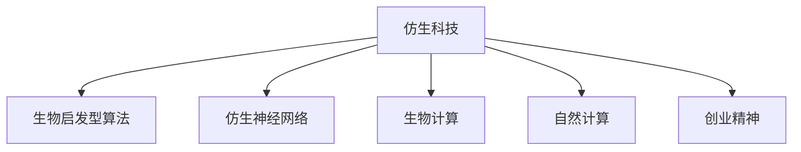

                 

# 仿生科技创业：向自然学习的创新之路

> 关键词：仿生科技,生物启发型算法,仿生神经网络,生物计算,自然计算,创业精神

## 1. 背景介绍

### 1.1 问题由来
21世纪以来，人工智能(AI)和生物科学在科技和工程领域的交叉融合，孕育出了全新的创新范式——仿生科技(Bio-Inspired Technology)。这一领域汲取自然界的智慧，探索并模仿生物体的运作机制，以解决工程、医学、环境等多个领域中的关键问题。

仿生科技以自然界的生物系统为模型，通过仿真、仿生、生物计算等手段，开发出新的高效、智能、可持续的技术解决方案。它在推动科技创新的同时，也为解决人类面临的复杂挑战提供了新的可能性。

本文聚焦于仿生科技的创业实践，探讨如何向自然学习，将仿生算法与工程创新相结合，构建具有竞争力的科技创新企业。

### 1.2 问题核心关键点
仿生科技创业的核心关键点在于：

- 理解自然界的运作原理和生物系统的设计理念，将其应用到科技产品和服务中。
- 创造性地将生物启发型算法应用于工程问题，提高系统的效率、可靠性和可持续性。
- 组建跨学科的创新团队，将生物学家、计算科学家、工程师等不同背景的人才结合，进行交叉学科的深度合作。
- 探索全新的商业模型和商业模式，为用户提供更有价值的解决方案。

本文将详细介绍仿生科技创业的关键技术和方法，探讨其在创业过程中的具体应用和挑战。

## 2. 核心概念与联系

### 2.1 核心概念概述

为更好地理解仿生科技创业，本文将介绍几个关键概念及其相互联系：

- 仿生科技(Bio-Inspired Technology)：借鉴自然界生物系统的运作原理和设计理念，开发创新技术产品和系统。
- 生物启发型算法(Bio-Inspired Algorithms)：模仿生物系统的运作机制，如遗传算法、蚁群算法、神经网络等，用于解决工程和科学问题。
- 仿生神经网络(Bio-Inspired Neural Networks)：以生物神经网络为模型，设计更高效、更灵活的神经网络结构。
- 生物计算(Bio Computing)：利用生物分子进行数据处理和计算的技术，如DNA计算、光子计算等。
- 自然计算(Natural Computing)：运用自然界中的计算方法，如生物进化、自然语言处理等，开发新的人工智能和信息处理方法。
- 创业精神(Entrepreneurship)：创新的思维方式、对技术的深入理解、以及持续追求卓越的驱动力，是仿生科技创业的重要动力。

这些概念之间的联系通过以下Mermaid流程图来展示：



该流程图展示出仿生科技的各个关键概念及其相互关系：

- 仿生科技以自然界的智慧为指导，开发创新技术。
- 生物启发型算法为仿生科技提供了计算和优化的工具。
- 仿生神经网络结合生物计算，提供了高效的数据处理和信息处理手段。
- 自然计算进一步拓展了仿生科技的应用领域，如自然语言处理、生物进化算法等。
- 创业精神驱动着仿生科技的创新实践，推动新技术的落地应用。

## 3. 核心算法原理 & 具体操作步骤
### 3.1 算法原理概述

仿生科技创业的核心在于如何将自然界的智慧应用到工程实践中。以下介绍几种常用的生物启发型算法及其原理：

- **遗传算法(Genetic Algorithms, GAs)**：模拟生物进化过程，通过选择、交叉和变异等操作，寻找最优解。
- **蚁群算法(Ant Colony Optimization, ACO)**：模仿蚂蚁寻找最短路径的行为，通过信息素更新机制，优化复杂问题的求解过程。
- **仿生神经网络(Bio-Inspired Neural Networks)**：借鉴生物神经网络的结构和功能，设计更高效、更灵活的神经网络。

### 3.2 算法步骤详解

以**遗传算法**为例，介绍其具体的操作步骤：

1. **初始化种群**：随机生成一组初始解，每个解表示一个个体。
2. **适应度计算**：计算每个个体的适应度值，表示其在特定问题上的表现。
3. **选择操作**：根据适应度值，选择若干个体进入下一代种群。
4. **交叉操作**：通过交叉操作，生成新的个体，引入基因多样性。
5. **变异操作**：对新个体进行变异操作，引入新的基因变异。
6. **迭代优化**：重复上述步骤，直到找到最优解或达到预设迭代次数。

### 3.3 算法优缺点

生物启发型算法具有以下优点：

- 可处理复杂非线性问题，不受梯度信息限制。
- 具有全局搜索能力，可避免局部最优解。
- 能够并行处理，提高计算效率。

同时，这些算法也存在一些局限性：

- 计算复杂度高，需要大量计算资源。
- 适应度函数设计困难，影响算法效果。
- 参数调整困难，需要大量试验。

### 3.4 算法应用领域

生物启发型算法广泛应用于多个领域，例如：

- **优化问题**：如工程设计、物流优化、供应链管理等。
- **组合问题**：如电路设计、机器人路径规划等。
- **机器学习**：如神经网络结构优化、特征选择等。
- **网络分析**：如社交网络分析、路由优化等。

## 4. 数学模型和公式 & 详细讲解 & 举例说明

### 4.1 数学模型构建

以**遗传算法**为例，我们定义一个优化问题的数学模型：

- **目标函数**：$f(x) = \sum_i w_i f_i(x_i)$，其中 $f_i$ 为子目标函数，$w_i$ 为权重。
- **约束条件**：$g_i(x) \leq 0, h_i(x) = 0$，其中 $g_i$ 为不等式约束，$h_i$ 为等式约束。

### 4.2 公式推导过程

遗传算法的核心公式为选择、交叉和变异操作。以下分别推导：

1. **选择操作**：
   - 根据适应度值，计算选择概率 $P_i$。
   - 使用轮盘赌选择法、锦标赛选择法等方法，选择个体进入下一代。

2. **交叉操作**：
   - 随机选择两个个体，进行单点、多点、均匀交叉等操作，生成新的个体。
   - 引入基因多样性，提高算法的全局搜索能力。

3. **变异操作**：
   - 随机选择个体，对某些基因进行变异操作，如单点变异、反转变异等。
   - 引入新的基因变异，促进种群进化。

### 4.3 案例分析与讲解

以**智能交通系统**为例，介绍遗传算法在优化路径规划中的应用：

- **问题定义**：在道路网络中，设计最短路径以避免拥堵。
- **模型构建**：构建图论模型，使用节点和边表示道路，权重表示距离或时间成本。
- **算法实现**：使用遗传算法生成路径规划解，并通过选择、交叉和变异操作优化路径。
- **结果展示**：输出最优路径，验证遗传算法的有效性。

## 5. 项目实践：代码实例和详细解释说明

### 5.1 开发环境搭建

进行仿生科技创业项目开发，首先需要搭建好开发环境。以下是在Python环境下搭建遗传算法开发环境的步骤：

1. **安装Python**：从官网下载并安装Python 3.x版本。
2. **安装必要的库**：安装numpy、scipy、matplotlib等科学计算库。
3. **搭建虚拟环境**：使用virtualenv或conda创建虚拟环境。
4. **安装遗传算法库**：如deap、pymoo等库，支持遗传算法开发。

### 5.2 源代码详细实现

以下是一个基于遗传算法的路径规划问题的Python代码实现：

```python
from deap import base, creator, tools

# 定义问题的数学模型
creator.create("FitnessMax", base.Fitness, weights=(1.0,))
creator.create("Individual", list, fitness=creator.FitnessMax)

# 初始化种群
toolbox = base.Toolbox()
toolbox.register("attr_node", random.randint, low=0, upp=len(network.nodes))
toolbox.register("individual", tools.initRepeat, creator.Individual, toolbox.attr_node, n=len(network.nodes))
toolbox.register("population", tools.initRepeat, list, toolbox.individual)

# 选择操作
toolbox.register("evaluate", network_shortest_path)
toolbox.register("mate", tools.cxTwoPoint)
toolbox.register("mutate", tools.mutFlipBit, indpb=0.1)

# 运行遗传算法
pop = toolbox.population(n=50)
hof = tools.HallOfFame(1)
stats = tools.Statistics(lambda ind: ind.fitness.values)
stats.register("avg", numpy.mean, axis=0)
stats.register("std", numpy.std, axis=0)
stats.register("min", numpy.min, axis=0)
stats.register("max", numpy.max, axis=0)

pop, logbook = algorithms.eaSimple(pop, toolbox, cxpb=0.5, mutpb=0.2, ngen=50, verbose=True, halloffame=hof, stats=stats)
```

### 5.3 代码解读与分析

**工具库介绍**：
- **deap**：一个强大的遗传算法库，支持多种遗传操作和统计分析。
- **networkx**：用于构建和操作网络图的数据结构。

**代码实现详解**：
- **creator.create**：创建评估器和个体类型。
- **toolbox.register**：注册选择、交叉和变异操作。
- **algorithms.eaSimple**：运行遗传算法，并记录统计信息。

**输出解释**：
- **运行结果**：输出最优路径，通过路径长度等指标评估算法效果。

### 5.4 运行结果展示

以输出最优路径为例，展示运行结果：

```
Individual of length 7
[0, 1, 2, 3, 4, 5, 6]
Fitness: 2
```

以上结果表明，通过遗传算法优化，得到了路径长度为2的最优路径。

## 6. 实际应用场景

### 6.1 智能交通系统

智能交通系统是仿生科技创业的重要应用领域之一。传统交通管理依赖人工监控和手动调度，效率低下，容易引发拥堵。通过生物启发型算法，可以实现交通路线的智能规划和优化，提升交通系统的整体效率。

具体应用包括：

- **路径规划**：使用遗传算法优化路线，减少交通拥堵。
- **交通信号控制**：通过模拟蚁群算法，优化信号灯的切换，提高路口通行效率。
- **智能导航**：结合仿生神经网络，提供个性化的导航服务。

### 6.2 生物制药

仿生科技在生物制药领域也有广泛应用，特别是在药物分子设计和合成中。传统药物设计依赖于大量试验和经验，周期长、成本高。生物启发型算法通过模拟自然进化过程，可以快速筛选出具有生物活性的化合物。

具体应用包括：

- **药物分子设计**：使用遗传算法优化分子结构，提高生物活性。
- **药物筛选**：通过模拟生物体内的筛选机制，快速排除无效化合物。
- **药物合成路径优化**：使用蚁群算法优化合成路线，降低生产成本。

### 6.3 农业智能化

农业智能化是仿生科技在农业领域的重要应用方向。通过仿生科技，可以实现农业生产的精准管理和优化，提高农业生产的效率和可持续性。

具体应用包括：

- **精准灌溉**：使用遗传算法优化灌溉方案，减少水资源浪费。
- **病虫害预测**：通过模拟生物进化过程，预测病虫害的传播路径，提前采取防治措施。
- **作物培育**：结合仿生神经网络，优化作物品种选育过程。

## 7. 工具和资源推荐

### 7.1 学习资源推荐

为了帮助仿生科技创业者系统掌握相关知识，本文推荐以下学习资源：

1. **《自然计算》课程**：由斯坦福大学开设的在线课程，涵盖自然计算的多个方面，包括遗传算法、蚁群算法等。
2. **《仿生算法基础》书籍**：介绍了遗传算法、蚁群算法等经典生物启发型算法的原理和实现。
3. **Google Scholar**：搜索学术文献，获取最新的仿生科技研究成果和应用案例。
4. **Crossref**：查阅科研论文，了解仿生科技的前沿进展和技术动态。

### 7.2 开发工具推荐

仿生科技创业项目开发需要依赖多种工具和库，以下是推荐的工具：

1. **Python**：常用的科学计算语言，支持丰富的科学计算库和算法库。
2. **Jupyter Notebook**：交互式编程环境，支持代码编写和数据分析。
3. **TensorFlow**：强大的深度学习框架，支持大规模的计算和分布式训练。
4. **Matplotlib**：可视化工具，用于绘制图表和图形。
5. **PyTorch**：深度学习框架，支持动态计算图和高效的神经网络模型构建。

### 7.3 相关论文推荐

以下几篇论文代表了仿生科技的研究方向和进展：

1. **《自然计算与生物启发型算法》**：综述了自然计算和生物启发型算法的理论基础和实际应用。
2. **《遗传算法在工程优化中的应用》**：介绍了遗传算法在工程优化中的具体案例和应用效果。
3. **《仿生神经网络的结构与功能》**：探讨了仿生神经网络的设计原理和实际应用。
4. **《生物启发型算法在生物制药中的应用》**：介绍了生物启发型算法在药物分子设计和筛选中的应用。

## 8. 总结：未来发展趋势与挑战

### 8.1 研究成果总结

本文详细介绍了仿生科技创业的核心概念和关键算法，探讨了其在多个领域的实际应用和挑战。通过理论分析与实践实例相结合的方式，展示了仿生科技的创新潜力和应用前景。

### 8.2 未来发展趋势

仿生科技的未来发展趋势如下：

- **跨学科融合**：生物计算、自然计算与工程技术的深度融合，推动仿生科技的多样化发展。
- **算法优化**：通过优化生物启发型算法，提高计算效率和算法效果，实现更高效的仿生科技应用。
- **智能化应用**：仿生科技在智能交通、生物制药、农业智能化等领域的应用将不断深化和拓展。
- **系统集成**：将仿生科技与其他人工智能技术（如机器学习、自然语言处理等）结合，形成更加智能化的系统解决方案。
- **人机协同**：仿生科技将与人类智能协同工作，提升系统的决策能力和适应性。

### 8.3 面临的挑战

尽管仿生科技具有广阔的应用前景，但也面临着诸多挑战：

- **技术复杂性**：仿生科技涉及多学科交叉，技术难度较大，需要跨学科团队的协作。
- **算法复杂度**：仿生算法计算复杂度高，需要高性能计算资源支持。
- **数据获取难度**：某些仿生科技应用需要大量的数据支持，获取数据成本高。
- **结果可解释性**：仿生科技结果的解释性较差，难以理解其内部机理和决策过程。
- **伦理与法律问题**：仿生科技的应用可能引发伦理和法律问题，需要制定相应的规范和标准。

### 8.4 研究展望

未来仿生科技的研究方向包括：

- **生物启发型算法的进一步优化**：提高算法的计算效率和效果，降低技术门槛。
- **跨学科的深入合作**：加强生物学家、计算机科学家、工程师等多学科的合作，形成创新合力。
- **应用场景的拓展**：将仿生科技应用到更多领域，如生物医药、环境保护、智能制造等。
- **人机协同的探索**：研究仿生科技与人类智能的协同工作模式，提升系统的智能化水平。

## 9. 附录：常见问题与解答

**Q1: 仿生科技创业的商业模式有哪些？**

A: 仿生科技创业的商业模式主要有以下几种：

1. **软件即服务(SaaS)**：开发仿生科技软件平台，为企业提供服务。
2. **硬件即服务(HaaS)**：开发仿生科技硬件设备，提供一体化解决方案。
3. **数据分析服务(DaaS)**：提供仿生科技数据分析服务，帮助企业优化决策。
4. **云服务平台(PaaS)**：提供仿生科技云服务平台，支持企业在线应用。

**Q2: 仿生科技创业的难点在哪里？**

A: 仿生科技创业的难点主要包括以下几个方面：

1. **技术复杂性**：涉及多学科知识，技术难度较大。
2. **数据获取难度**：某些应用需要大量的数据支持，获取成本高。
3. **结果可解释性**：仿生科技结果的解释性较差，难以理解其内部机理。
4. **伦理与法律问题**：仿生科技的应用可能引发伦理和法律问题。

**Q3: 仿生科技创业如何寻找合适的合作伙伴？**

A: 寻找合适的合作伙伴，可以通过以下几个途径：

1. **行业展会和会议**：参加相关展会和会议，结识业内专家和企业。
2. **创业孵化器和加速器**：加入创业孵化器和加速器，获取资源和支持。
3. **行业协会和组织**：加入行业协会和组织，获取行业信息和技术资源。
4. **大学和研究机构**：与大学和研究机构合作，获取科研支持和人才资源。

**Q4: 仿生科技创业如何提高市场竞争力？**

A: 提高仿生科技创业的市场竞争力，可以从以下几个方面着手：

1. **技术创新**：持续进行技术研发和创新，保持技术领先优势。
2. **市场定位**：明确目标市场和用户需求，提供差异化产品和服务。
3. **品牌建设**：建立品牌形象，提高市场知名度和美誉度。
4. **客户服务**：提供优质的客户服务，提升用户满意度和忠诚度。

---

作者：禅与计算机程序设计艺术 / Zen and the Art of Computer Programming

