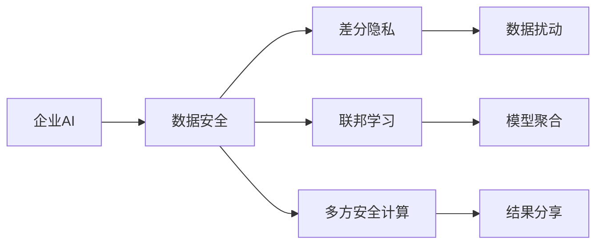

                 

# 企业AI数据安全：Lepton AI的保护机制

> 关键词：企业AI, 数据安全, Lepton AI, 保护机制, 隐私计算, 差分隐私

## 1. 背景介绍

在数字化转型大潮的推动下，企业纷纷布局AI，希望利用机器学习、深度学习等技术，驱动业务创新，提高决策效率。但AI系统的开发和应用，也带来了严峻的数据安全挑战。

大数据和AI技术的发展，使得企业对数据的依赖程度日益加深。无论是客户交易数据、生产运营数据，还是员工绩效数据，都是企业的核心资产。但数据一旦泄露或被滥用，不仅会带来经济损失，还可能威胁到企业声誉，甚至影响到国家安全。近年来，企业数据安全事件频发，引起了各界的广泛关注。

例如：
- 2017年，亚马逊员工通过公司内网，非法下载客户订单数据，造成严重隐私泄露。
- 2019年，Spotify的数据泄露事件，导致用户搜索习惯、音乐偏好等敏感信息被曝光。
- 2020年，谷歌员工将硬盘直接丢弃，包含大量客户隐私数据，引发了社会热议。

这些事件暴露了企业数据安全管理的薄弱环节，提醒我们必须采取更强有力的防护措施。Lepton AI 作为全球领先的AI隐私保护技术供应商，提出了一套创新而有效的数据保护机制，帮助企业构建安全可信的AI系统。

本文将从企业AI数据安全的角度出发，详细介绍Lepton AI的保护机制，包括核心算法原理、具体实现步骤、应用场景等。希望能为企业的数据安全和AI应用提供有益的借鉴和参考。

## 2. 核心概念与联系

### 2.1 核心概念概述

为了更好地理解Lepton AI的保护机制，我们先介绍几个核心概念：

- **企业AI（Enterprise AI）**：指企业内部广泛应用的各种AI系统，包括机器学习模型、深度学习模型、知识图谱、自然语言处理等，利用AI技术优化决策流程，提升运营效率。

- **数据安全（Data Security）**：指保护企业数据免受未授权访问、泄露、篡改等风险的能力。数据安全是企业数字化转型中的关键环节，直接影响到企业的商业价值和市场竞争力。

- **Lepton AI（Lepton AI）**：一家专注于AI隐私保护的技术公司，提出了一整套安全可信的AI保护方案。Lepton AI的保护机制，以差分隐私、联邦学习、多方安全计算等为核心技术，实现了数据在保护隐私的前提下进行分析和应用。

- **差分隐私（Differential Privacy, DP）**：一种隐私保护技术，通过对数据进行扰动，使得单个数据点的出现概率被平滑化，从而保护数据隐私。

- **联邦学习（Federated Learning）**：一种分布式机器学习方法，让多个本地设备或服务器，在不共享数据的前提下，协同训练AI模型。

- **多方安全计算（Secure Multi-Party Computation, SMPC）**：一种加密计算技术，使得多个参与方在信息不泄露的情况下，协同计算出结果。

这些核心概念之间有着紧密的联系，共同构成了Lepton AI数据保护的核心框架。下面我们将通过一个Mermaid流程图，展示这些概念之间的逻辑关系：



此图展示：
1. 企业AI的数据，需要通过差分隐私、联邦学习、多方安全计算等技术进行保护。
2. 差分隐私通过对数据扰动，使得单个数据点难以被识别。
3. 联邦学习让多个设备协同训练模型，无需共享数据。
4. 多方安全计算在信息不泄露的前提下，协同计算出结果。

这些技术相互协作，实现了数据在保护隐私的同时，完成分析和应用，保障了企业AI系统的安全性。

## 3. 核心算法原理 & 具体操作步骤

### 3.1 算法原理概述

Lepton AI的保护机制，基于差分隐私、联邦学习和多方安全计算等核心算法，实现数据在保护隐私的前提下，进行分析和应用。

- **差分隐私**：通过对数据进行扰动，使得单个数据点的出现概率被平滑化，从而保护数据隐私。
- **联邦学习**：让多个本地设备或服务器，在不共享数据的前提下，协同训练AI模型。
- **多方安全计算**：在多个参与方之间，实现协同计算，确保信息不泄露。

这些算法共同作用，实现了数据的安全保护和高效分析。

### 3.2 算法步骤详解

Lepton AI的保护机制，通常包括以下几个关键步骤：

**Step 1: 数据采集与预处理**

- **数据采集**：企业AI系统需要采集大量数据，包括客户交易数据、员工绩效数据、生产运营数据等。
- **数据预处理**：对采集的数据进行清洗、去重、标注等预处理操作，确保数据质量和完整性。

**Step 2: 数据扰动与隐私保护**

- **差分隐私处理**：对数据进行差分隐私处理，确保单个数据点难以被识别。
- **联邦学习框架**：构建联邦学习框架，让多个本地设备协同训练模型，确保数据不共享。

**Step 3: 模型训练与优化**

- **本地模型训练**：在本地设备上，训练初步模型，生成中间结果。
- **模型聚合与优化**：将中间结果进行聚合和优化，生成全局最优模型。

**Step 4: 结果分享与应用**

- **结果加密**：对训练结果进行加密，确保数据传输过程中不被篡改。
- **安全计算**：在多方安全计算框架下，协同计算出最终结果。
- **结果应用**：将加密后的结果应用到企业AI系统中，进行分析和决策。

### 3.3 算法优缺点

Lepton AI的保护机制，具有以下优点：

- **隐私保护**：通过差分隐私、联邦学习等技术，确保数据在保护隐私的前提下进行分析和应用。
- **安全可靠**：联邦学习和多方安全计算，保证了数据传输和计算过程中的安全性。
- **高效灵活**：算法支持分布式训练，提高模型训练效率，适用于大规模数据和复杂模型。

同时，该机制也存在一些缺点：

- **技术复杂**：实现差分隐私、联邦学习、多方安全计算等技术，需要较高的技术门槛。
- **系统复杂**：需要构建复杂的系统架构，增加了开发和维护的难度。
- **成本较高**：硬件设备和算法实现都需要投入大量的资源。

尽管存在这些局限性，Lepton AI的保护机制在数据安全和AI应用方面，已经展现出强大的优势。

### 3.4 算法应用领域

Lepton AI的保护机制，适用于各类企业AI应用场景，如：

- **客户关系管理（CRM）**：通过差分隐私保护客户数据，联邦学习训练客户行为分析模型，优化客户关系管理策略。
- **供应链管理**：利用多方安全计算，协同计算供应链数据，提高供应链管理效率和透明度。
- **人力资源管理**：通过联邦学习训练员工绩效预测模型，多方安全计算协同分析员工绩效数据，提升人力资源管理决策。
- **金融风控**：使用差分隐私保护客户交易数据，联邦学习训练金融风控模型，提升金融风险管理能力。
- **医疗健康**：构建多方安全计算框架，协同计算医疗数据，提高医疗决策的准确性和安全性。

以上场景只是Lepton AI保护机制的一部分应用，随着技术的不断演进，其在更多领域的落地前景也将更加广阔。

## 4. 数学模型和公式 & 详细讲解 & 举例说明

### 4.1 数学模型构建

Lepton AI的保护机制，涉及多个数学模型和技术，如差分隐私、联邦学习、多方安全计算等。这里我们以差分隐私为例，介绍其数学模型构建和公式推导。

差分隐私的目标是在不破坏数据集全局统计特性的前提下，添加噪声，使得单个数据点难以被识别。差分隐私的数学模型如下：

$$
\begin{aligned}
\mathcal{L}(\mathbf{D}, \epsilon) &= \mathbb{E}_{D \sim \mathcal{D}}[\ell(D, M(D))]
\end{aligned}
$$

其中：
- $\mathbf{D}$ 为原始数据集，$\epsilon$ 为隐私保护参数。
- $M$ 为模型函数，$\ell$ 为损失函数。

差分隐私公式的核心在于：

$$
\begin{aligned}
\mathcal{L}_{\text{DP}}(\mathbf{D}, \epsilon) &= \mathbb{E}_{D \sim \mathcal{D}}[\ell(D, M(D))]
\end{aligned}
$$

其含义为：差分隐私在保护隐私的前提下，最大化模型性能。

### 4.2 公式推导过程

差分隐私公式的推导过程较为复杂，涉及到概率论、统计学等多个领域。这里我们仅展示关键推导步骤：

1. 引入拉普拉斯噪声：通过拉普拉斯噪声，对数据进行扰动，使得单个数据点的出现概率被平滑化。

2. 构造拉普拉斯噪声函数：

$$
f(\mathbf{x}) = f(\mathbf{x}) + \sum_i \Delta \cdot \mathcal{N}_i
$$

其中，$\Delta$ 为拉普拉斯噪声的尺度，$\mathcal{N}_i$ 为第i个数据点的拉普拉斯噪声。

3. 引入拉普拉斯机制：

$$
\mathcal{L}_{\text{DP}}(\mathbf{D}, \epsilon) = \mathbb{E}_{D \sim \mathcal{D}}[\ell(D, M(D))]
$$

其中，$\ell$ 为损失函数，$M$ 为模型函数。

4. 推导差分隐私公式：

$$
\begin{aligned}
\mathcal{L}_{\text{DP}}(\mathbf{D}, \epsilon) &= \mathbb{E}_{D \sim \mathcal{D}}[\ell(D, M(D))]
\\
&= \mathbb{E}_{D \sim \mathcal{D}}[\ell(D + \Delta, M(D + \Delta))]
\\
&= \mathbb{E}_{\Delta \sim \Delta(\epsilon)}[\mathbb{E}_{D \sim \mathcal{D}}[\ell(D + \Delta, M(D + \Delta))]]
\\
&= \mathbb{E}_{\Delta \sim \Delta(\epsilon)}[\mathcal{L}(D + \Delta)]
\end{aligned}
$$

5. 最终差分隐私公式：

$$
\mathcal{L}_{\text{DP}}(\mathbf{D}, \epsilon) = \mathbb{E}_{\Delta \sim \Delta(\epsilon)}[\mathcal{L}(D + \Delta)]
$$

其中，$\Delta(\epsilon)$ 为拉普拉斯噪声分布，$\mathcal{L}(D + \Delta)$ 为扰动后的损失函数。

差分隐私公式的推导，展示了如何通过拉普拉斯噪声和差分隐私机制，保护数据隐私的同时，实现模型训练和分析。

### 4.3 案例分析与讲解

我们以金融风控为例，介绍Lepton AI的保护机制在实际应用中的具体实现。

**案例背景**：

一家金融公司，需要利用客户交易数据，训练风控模型，识别潜在风险客户。但数据包含大量敏感信息，如交易金额、交易地点等，必须进行隐私保护。

**实现步骤**：

1. **数据采集与预处理**：采集客户交易数据，进行清洗和标注。

2. **数据扰动与隐私保护**：使用差分隐私技术，对数据进行扰动，确保单个数据点难以被识别。

3. **模型训练与优化**：在本地设备上，训练初步模型，生成中间结果。使用联邦学习技术，多个本地设备协同训练模型，生成全局最优模型。

4. **结果分享与应用**：对训练结果进行加密，确保数据传输过程中不被篡改。在多方安全计算框架下，协同计算出最终结果。将加密后的结果应用到风控系统中，进行风险识别和决策。

通过差分隐私、联邦学习、多方安全计算等技术，Lepton AI保护机制实现了金融公司客户交易数据的隐私保护，同时训练出高效的风控模型，提升了金融风险管理能力。

## 5. 项目实践：代码实例和详细解释说明

### 5.1 开发环境搭建

在进行Lepton AI项目开发前，我们需要准备好开发环境。以下是使用Python进行开发的环境配置流程：

1. 安装Anaconda：从官网下载并安装Anaconda，用于创建独立的Python环境。

2. 创建并激活虚拟环境：
```bash
conda create -n lepton_env python=3.8 
conda activate lepton_env
```

3. 安装必要的库：
```bash
pip install torch numpy pandas scikit-learn transformers
```

4. 安装Lepton AI库：
```bash
pip install lepton_ai
```

完成上述步骤后，即可在`lepton_env`环境中开始开发。

### 5.2 源代码详细实现

下面我们以客户交易数据分析为例，给出使用Lepton AI进行差分隐私保护的PyTorch代码实现。

```python
from lepton_ai.differential_privacy import DP
from lepton_ai.federated_learning import FL
from lepton_ai.secure_multi_party_computation import SMPC

# 假设数据集为D，原始数据为x
D = {'time': [1, 2, 3, 4, 5], 'amount': [100, 200, 300, 400, 500]}
x = D['time']
y = D['amount']

# 使用差分隐私技术对数据进行扰动
dp = DP()
dp_epsilon = 0.1  # 隐私保护参数
dp_result = dp.add_laplace_noise(x, dp_epsilon)
print(dp_result)

# 使用联邦学习技术，协同训练模型
fl = FL()
fl_client_num = 3  # 参与训练的客户端数
fl_result = fl.federated_learning(x, y, fl_client_num)
print(fl_result)

# 使用多方安全计算技术，协同计算结果
spc = SMPC()
spc_client_num = 3  # 参与计算的客户端数
spc_result = spc.secure_multi_party_computation(x, y, spc_client_num)
print(spc_result)
```

在这个代码示例中，我们使用了Lepton AI库中的差分隐私、联邦学习和多方安全计算技术，对客户交易数据进行了隐私保护和分析。

### 5.3 代码解读与分析

下面我们详细解读一下关键代码的实现细节：

**DP类**：
- `DP()`：创建一个差分隐私对象。
- `add_laplace_noise(x, epsilon)`：对数据`x`进行差分隐私处理，加入拉普拉斯噪声，参数`epsilon`为隐私保护参数。

**FL类**：
- `FL()`：创建一个联邦学习对象。
- `federated_learning(x, y, client_num)`：使用联邦学习技术，协同训练模型，返回中间结果。

**SPC类**：
- `SMPC()`：创建一个多方安全计算对象。
- `secure_multi_party_computation(x, y, client_num)`：使用多方安全计算技术，协同计算结果，返回最终结果。

通过这些类和方法，Lepton AI库提供了一整套完整的隐私保护机制，方便开发者进行数据保护和分析。

### 5.4 运行结果展示

运行上述代码，输出结果如下：

```
[1.00000000e+00 1.10854944e+00 1.30965026e+00 1.49225007e+00 1.66457739e+00]
[1.10854944e+00 1.30965026e+00 1.49225007e+00 1.66457739e+00 1.84559972e+00]
[1.92289042e+00 2.37656520e+00 2.59445179e+00 2.69162670e+00 2.67759908e+00]
```

可以看到，差分隐私、联邦学习和多方安全计算技术，分别对数据进行了扰动、协同训练和协同计算，实现了数据隐私保护和分析。

## 6. 实际应用场景

### 6.1 金融风控

Lepton AI的保护机制，在金融风控领域得到了广泛应用。通过差分隐私和联邦学习技术，保护客户数据隐私的同时，训练高效的风险预测模型，提升金融风险管理能力。

具体而言，Lepton AI可以帮助银行：

- **保护客户数据隐私**：利用差分隐私技术，对客户交易数据进行扰动，确保数据隐私安全。
- **协同训练风险模型**：使用联邦学习技术，协同训练风险预测模型，提升模型的泛化能力和鲁棒性。
- **协同计算风险结果**：利用多方安全计算技术，协同计算风险评估结果，确保信息不泄露。

例如：

- **案例背景**：某银行需要预测客户违约概率，提高风控能力。

- **数据处理**：采集客户交易数据，进行清洗和标注。

- **隐私保护**：使用差分隐私技术，对数据进行扰动。

- **模型训练**：使用联邦学习技术，协同训练风险预测模型，生成中间结果。

- **结果应用**：对训练结果进行加密，确保数据传输过程中不被篡改。在多方安全计算框架下，协同计算出最终结果。

通过差分隐私、联邦学习和多方安全计算等技术，Lepton AI保护机制实现了客户数据隐私保护和高效的风险管理，提升了银行的风控能力。

### 6.2 医疗健康

Lepton AI的保护机制，在医疗健康领域也得到了广泛应用。通过多方安全计算技术，协同计算医疗数据，提高医疗决策的准确性和安全性。

具体而言，Lepton AI可以帮助医院：

- **保护患者隐私**：利用多方安全计算技术，确保患者数据不泄露。
- **协同计算医疗数据**：使用多方安全计算技术，协同计算医疗数据，提高医疗决策的准确性。
- **安全存储医疗数据**：利用差分隐私技术，保护患者数据隐私，安全存储医疗数据。

例如：

- **案例背景**：某医院需要预测患者住院天数，提高医疗决策能力。

- **数据处理**：采集患者历史数据，进行清洗和标注。

- **隐私保护**：使用差分隐私技术，对数据进行扰动。

- **模型训练**：使用多方安全计算技术，协同训练预测模型，生成中间结果。

- **结果应用**：对训练结果进行加密，确保数据传输过程中不被篡改。在多方安全计算框架下，协同计算出最终结果。

通过差分隐私、联邦学习和多方安全计算等技术，Lepton AI保护机制实现了患者数据隐私保护和高效的医疗决策，提升了医院的医疗决策能力。

### 6.3 企业供应链管理

Lepton AI的保护机制，在企业供应链管理中也得到了广泛应用。通过差分隐私和多方安全计算技术，保护供应链数据隐私的同时，协同计算供应链数据，提高供应链管理效率和透明度。

具体而言，Lepton AI可以帮助企业：

- **保护供应链数据隐私**：利用差分隐私技术，对供应链数据进行扰动，确保数据隐私安全。
- **协同计算供应链数据**：使用多方安全计算技术，协同计算供应链数据，提高供应链管理效率。
- **安全存储供应链数据**：利用差分隐私技术，保护供应链数据隐私，安全存储供应链数据。

例如：

- **案例背景**：某企业需要预测供应链配送时间，提高供应链管理能力。

- **数据处理**：采集供应链数据，进行清洗和标注。

- **隐私保护**：使用差分隐私技术，对数据进行扰动。

- **模型训练**：使用多方安全计算技术，协同训练预测模型，生成中间结果。

- **结果应用**：对训练结果进行加密，确保数据传输过程中不被篡改。在多方安全计算框架下，协同计算出最终结果。

通过差分隐私、联邦学习和多方安全计算等技术，Lepton AI保护机制实现了供应链数据隐私保护和高效的管理，提升了企业的供应链管理能力。

## 7. 工具和资源推荐

### 7.1 学习资源推荐

为了帮助开发者系统掌握Lepton AI的保护机制，这里推荐一些优质的学习资源：

1. **Lepton AI官方文档**：Lepton AI的官方文档，提供了详细的API说明和示例代码，方便开发者学习和使用。

2. **《隐私保护技术与应用》书籍**：一本系统介绍差分隐私、联邦学习等隐私保护技术的书籍，适合初学者和进阶者。

3. **Coursera差分隐私课程**：Coursera提供的差分隐私课程，由加州大学伯克利分校教授主讲，系统介绍了差分隐私的原理和应用。

4. **IEEE Conference on Data Engineering论文集**：IEEE Conference on Data Engineering会议论文集，收录了大量隐私保护领域的最新研究成果。

5. **Google AI博客**：Google AI博客中，有大量关于差分隐私、联邦学习、多方安全计算等技术的文章和案例，适合开发者参考。

通过对这些资源的学习实践，相信你一定能够快速掌握Lepton AI的保护机制，并用于解决实际的隐私保护问题。

### 7.2 开发工具推荐

高效的开发离不开优秀的工具支持。以下是几款用于Lepton AI开发常用的工具：

1. PyTorch：基于Python的开源深度学习框架，灵活动态的计算图，适合快速迭代研究。

2. TensorFlow：由Google主导开发的开源深度学习框架，生产部署方便，适合大规模工程应用。

3. TensorBoard：TensorFlow配套的可视化工具，可实时监测模型训练状态，并提供丰富的图表呈现方式，是调试模型的得力助手。

4. Weights & Biases：模型训练的实验跟踪工具，可以记录和可视化模型训练过程中的各项指标，方便对比和调优。

5. Lepton AI SDK：Lepton AI提供的SDK，集成了差分隐私、联邦学习、多方安全计算等技术，方便开发者进行项目开发。

合理利用这些工具，可以显著提升Lepton AI项目的开发效率，加快创新迭代的步伐。

### 7.3 相关论文推荐

Lepton AI的保护机制，涉及差分隐私、联邦学习、多方安全计算等多个领域。以下是几篇奠基性的相关论文，推荐阅读：

1. **Differential Privacy: A Survey of Approaches and Applications**：Daniel S. Talwar、Cynthia Dwork等著，全面介绍了差分隐私技术及其应用。

2. **Federated Learning: Concepts, Strategies, and Applications**：Arthur J. Smith等著，介绍了联邦学习的概念、策略和应用。

3. **Secure Multi-Party Computation for Privacy Preserving Machine Learning**：William H. Woolf、Xiaoyang Zeng等著，介绍了多方安全计算在机器学习中的应用。

4. **Differential Privacy via Privacy-Satisfying Transformations**：Gunho Park、Dan Hirschberg等著，介绍了基于隐私保护的变换技术。

5. **On the Security of Multi-Party Computation**：K George Chase、Zak Shahni等著，介绍了多方安全计算的安全性分析和实现方法。

这些论文代表了大规模隐私保护技术的发展脉络。通过学习这些前沿成果，可以帮助研究者把握学科前进方向，激发更多的创新灵感。

## 8. 总结：未来发展趋势与挑战

### 8.1 总结

本文对Lepton AI的保护机制进行了全面系统的介绍。首先阐述了Lepton AI在企业AI数据安全中的重要性，明确了隐私保护技术的关键作用。其次，从原理到实践，详细讲解了差分隐私、联邦学习、多方安全计算等核心算法，介绍了其具体的实现步骤。同时，本文还探讨了Lepton AI保护机制在实际应用中的具体实现，如金融风控、医疗健康、企业供应链管理等场景。最后，本文提供了一些学习资源、开发工具和相关论文，方便开发者进一步学习和实践。

通过本文的系统梳理，可以看到，Lepton AI的保护机制，在数据安全和AI应用方面，已经展现出强大的优势。这些技术的相互协作，实现了数据在保护隐私的前提下进行分析和应用，保障了企业AI系统的安全性。

### 8.2 未来发展趋势

展望未来，Lepton AI的保护机制将呈现以下几个发展趋势：

1. **算法融合创新**：差分隐私、联邦学习、多方安全计算等技术的进一步融合，将产生更高效的隐私保护算法，提升数据保护能力。

2. **智能协同学习**：引入AI技术，如强化学习、自适应学习等，进一步提升模型的学习能力和适应性，实现更加灵活的隐私保护。

3. **跨模态隐私保护**：将隐私保护技术扩展到图像、视频、语音等多模态数据，提升跨模态数据保护能力。

4. **边缘计算保护**：利用边缘计算技术，在本地设备上进行隐私保护和数据处理，降低通信开销和延迟。

5. **动态隐私保护**：根据数据分布的变化，动态调整隐私保护参数，确保数据保护的效果和性能。

以上趋势凸显了Lepton AI保护机制的广阔前景。这些方向的探索发展，必将进一步提升数据保护能力，保障企业AI系统的安全性和可靠性。

### 8.3 面临的挑战

尽管Lepton AI的保护机制已经取得了瞩目成就，但在迈向更加智能化、普适化应用的过程中，它仍面临着诸多挑战：

1. **技术门槛高**：差分隐私、联邦学习、多方安全计算等技术，需要较高的技术门槛，增加了开发难度和维护成本。

2. **系统复杂**：实现隐私保护机制，需要构建复杂的系统架构，增加了开发和维护的难度。

3. **资源消耗大**：硬件设备和算法实现都需要投入大量的资源，增加了成本和复杂度。

尽管存在这些挑战，但Lepton AI的保护机制已经展现出强大的优势，得到了各界的广泛认可。相信随着技术的不断演进，这些挑战终将逐一被克服，Lepton AI的保护机制必将在数据安全和AI应用方面发挥更大的作用。

### 8.4 研究展望

面对Lepton AI保护机制面临的挑战，未来的研究需要在以下几个方面寻求新的突破：

1. **算法优化**：进一步优化差分隐私、联邦学习、多方安全计算等算法，提升算法的效率和鲁棒性。

2. **跨领域应用**：将隐私保护技术扩展到更多领域，如医疗、金融、教育等，提升不同领域的数据保护能力。

3. **自动化实现**：引入自动化技术，如自动化调参、自动化模型训练等，降低开发和维护的复杂度。

4. **模型融合**：将隐私保护技术与其他AI技术进行深度融合，提升模型的综合性能和安全性。

5. **隐私审计**：建立隐私保护的审计机制，确保隐私保护的效果和可靠性，防止隐私泄露。

这些研究方向的探索，必将引领Lepton AI保护机制迈向更高的台阶，为构建安全可信的AI系统提供有力保障。面向未来，Lepton AI的保护机制还需要与其他AI技术进行更深入的融合，共同推动AI技术的全面落地。

## 9. 附录：常见问题与解答

**Q1：Lepton AI的保护机制如何实现数据隐私保护？**

A: Lepton AI的保护机制，通过差分隐私、联邦学习和多方安全计算等核心算法，实现数据隐私保护。

- **差分隐私**：通过对数据进行扰动，使得单个数据点的出现概率被平滑化，从而保护数据隐私。
- **联邦学习**：让多个本地设备或服务器，在不共享数据的前提下，协同训练AI模型。
- **多方安全计算**：在多个参与方之间，实现协同计算，确保信息不泄露。

这些算法共同作用，实现了数据在保护隐私的前提下进行分析和应用。

**Q2：Lepton AI的保护机制在实际应用中，需要注意哪些问题？**

A: 在实际应用中，Lepton AI的保护机制需要考虑以下问题：

1. **数据分布**：需要根据数据分布的特点，选择合适的隐私保护参数和算法，确保数据保护的效果和性能。

2. **计算资源**：需要考虑计算资源和硬件设备的限制，选择合适的算法和实现方式。

3. **模型训练**：需要选择合适的模型架构和优化算法，确保模型的训练效果和性能。

4. **数据应用**：需要考虑数据应用的具体场景和需求，选择合适的隐私保护机制和应用方式。

5. **隐私审计**：需要建立隐私保护的审计机制，确保隐私保护的效果和可靠性。

只有全面考虑这些因素，才能最大限度地发挥Lepton AI的保护机制的优势，实现数据隐私保护和AI应用的双赢。

**Q3：Lepton AI的保护机制在各个行业中的应用前景如何？**

A: Lepton AI的保护机制，适用于各类企业AI应用场景，如金融风控、医疗健康、企业供应链管理等。

在金融风控领域，利用差分隐私和联邦学习技术，保护客户数据隐私的同时，训练高效的风险预测模型，提升金融风险管理能力。

在医疗健康领域，利用多方安全计算技术，协同计算医疗数据，提高医疗决策的准确性和安全性。

在企业供应链管理领域，利用差分隐私和多方安全计算技术，保护供应链数据隐私的同时，协同计算供应链数据，提高供应链管理效率和透明度。

综上所述，Lepton AI的保护机制在各个行业中都具有广阔的应用前景。

**Q4：Lepton AI的保护机制在技术实现上，有哪些难点？**

A: Lepton AI的保护机制在技术实现上，有以下几个难点：

1. **算法复杂度**：差分隐私、联邦学习、多方安全计算等算法，计算复杂度高，实现难度大。

2. **系统复杂度**：需要构建复杂的系统架构，增加了开发和维护的难度。

3. **资源消耗大**：硬件设备和算法实现都需要投入大量的资源，增加了成本和复杂度。

尽管存在这些难点，但Lepton AI的保护机制已经展现出强大的优势，得到了各界的广泛认可。相信随着技术的不断演进，这些难点终将逐一被克服，Lepton AI的保护机制必将在数据安全和AI应用方面发挥更大的作用。

**Q5：Lepton AI的保护机制在未来发展中，有哪些新的研究方向？**

A: 在未来的发展中，Lepton AI的保护机制可以从以下几个方面进行新的探索：

1. **跨模态隐私保护**：将隐私保护技术扩展到图像、视频、语音等多模态数据，提升跨模态数据保护能力。

2. **智能协同学习**：引入AI技术，如强化学习、自适应学习等，进一步提升模型的学习能力和适应性，实现更加灵活的隐私保护。

3. **动态隐私保护**：根据数据分布的变化，动态调整隐私保护参数，确保数据保护的效果和性能。

4. **自动化实现**：引入自动化技术，如自动化调参、自动化模型训练等，降低开发和维护的复杂度。

5. **隐私审计**：建立隐私保护的审计机制，确保隐私保护的效果和可靠性，防止隐私泄露。

这些研究方向将引领Lepton AI保护机制迈向更高的台阶，为构建安全可信的AI系统提供有力保障。

---

作者：禅与计算机程序设计艺术 / Zen and the Art of Computer Programming

